# Assetra User Journey & Interaction Map

> Complete mapping of all user flows, interactions, and screen states for re-theming reference.
> Each section includes Mermaid diagrams and an inventory of interactive elements per screen.

---

## Table of Contents

1. [Application Architecture Overview](#1-application-architecture-overview)
2. [Authentication Flow](#2-authentication-flow)
3. [Onboarding Wizard Flow](#3-onboarding-wizard-flow)
4. [Dashboard Workspace](#4-dashboard-workspace)
5. [Financial Data CRUD](#5-financial-data-crud)
6. [Chart Interactions](#6-chart-interactions)
7. [CPF Planner Module](#7-cpf-planner-module)
8. [Insurance Planner Module](#8-insurance-planner-module)
9. [Vehicle Planner Module](#9-vehicle-planner-module)
10. [Property Planner Module](#10-property-planner-module)
11. [Tax Planner Module](#11-tax-planner-module)
12. [Chat Assistant](#12-chat-assistant)
13. [Settings & Person Management](#13-settings--person-management)
14. [Landing Page](#14-landing-page)
15. [Existing Assetra3.pen Inventory](#15-existing-assetra3pen-inventory)
16. [Missing Screens for Full Coverage](#16-missing-screens-for-full-coverage)

---

## 1. Application Architecture Overview

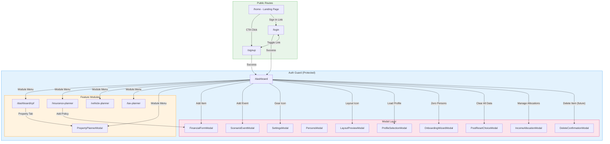
```mermaid
flowchart TB
    subgraph PUBLIC["Public Routes"]
        LAND["/home - Landing Page"]
        LOGIN["/login"]
        SIGNUP["/signup"]
    end

    subgraph AUTH_GUARD["Auth Guard (Protected)"]
        DASH["/dashboard"]

        subgraph MODULES["Feature Modules"]
            CPF["/dashboard/cpf"]
            INS["/insurance-planner"]
            VEH["/vehicle-planner"]
            TAX["/tax-planner"]
            PROP["PropertyPlannerModal"]
        end

        subgraph OVERLAYS["Modal Layer"]
            M_FIN["FinancialFormModal"]
            M_SCEN["ScenarioEventModal"]
            M_SET["SettingsModal"]
            M_PERS["PersonsModal"]
            M_PROF["ProfileSelectionModal"]
            M_LAY["LayoutPreviewModal"]
            M_ALLOC["IncomeAllocationModal"]
            M_DEL["DeleteConfirmationModal"]
            M_ONBOARD["OnboardingWizardModal"]
            M_RESET["PostResetChoiceModal"]
        end
    end

    LAND -->|"CTA Click"| SIGNUP
    LAND -->|"Sign In Link"| LOGIN
    LOGIN -->|"Success"| DASH
    SIGNUP -->|"Success"| DASH
    LOGIN <-->|"Toggle Link"| SIGNUP

    DASH -->|"Module Menu"| CPF
    DASH -->|"Module Menu"| INS
    DASH -->|"Module Menu"| VEH
    DASH -->|"Module Menu"| TAX
    DASH -->|"Module Menu"| PROP

    DASH -->|"Add Item"| M_FIN
    DASH -->|"Add Event"| M_SCEN
    DASH -->|"Gear Icon"| M_SET
    DASH -->|"Layout Icon"| M_LAY
    DASH -->|"Load Profile"| M_PROF
    DASH -->|"Zero Persons"| M_ONBOARD
    DASH -->|"Clear All Data"| M_RESET
    DASH -->|"Manage Allocations"| M_ALLOC
    DASH -->|"Delete Item (future)"| M_DEL

    CPF -->|"Property Tab"| PROP
    INS -->|"Add Policy"| M_FIN

    style PUBLIC fill:#e8f5e9,stroke:#4caf50
    style AUTH_GUARD fill:#e3f2fd,stroke:#2196f3
    style MODULES fill:#fff3e0,stroke:#ff9800
    style OVERLAYS fill:#fce4ec,stroke:#e91e63
```

### Screen State Machine (Top Level)

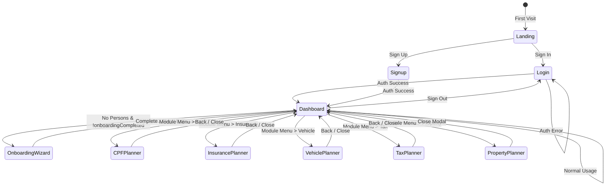
```mermaid
stateDiagram-v2
    [*] --> Landing : First Visit
    Landing --> Login : Sign In
    Landing --> Signup : Sign Up
    Login --> Dashboard : Auth Success
    Signup --> Dashboard : Auth Success
    Login --> Login : Auth Error

    Dashboard --> OnboardingWizard : No Persons & !onboardingCompleted
    OnboardingWizard --> Dashboard : Complete / Skip / Exit
    Dashboard --> Dashboard : Normal Usage

    Dashboard --> CPFPlanner : Module Menu > CPF
    Dashboard --> InsurancePlanner : Module Menu > Insurance
    Dashboard --> VehiclePlanner : Module Menu > Vehicle
    Dashboard --> TaxPlanner : Module Menu > Tax
    Dashboard --> PropertyPlanner : Module Menu > Property

    CPFPlanner --> Dashboard : Back / Close
    InsurancePlanner --> Dashboard : Back / Close
    VehiclePlanner --> Dashboard : Back / Close
    TaxPlanner --> Dashboard : Back / Close
    PropertyPlanner --> Dashboard : Close Modal

    Dashboard --> Login : Sign Out
```

---

## 2. Authentication Flow

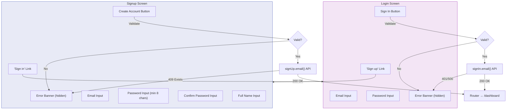
```mermaid
flowchart TB
    subgraph LOGIN_SCREEN["Login Screen"]
        L_EMAIL["Email Input"]
        L_PASS["Password Input"]
        L_SUBMIT["Sign In Button"]
        L_LINK["'Sign up' Link"]
        L_ERR["Error Banner (hidden)"]
    end

    subgraph SIGNUP_SCREEN["Signup Screen"]
        S_NAME["Full Name Input"]
        S_EMAIL["Email Input"]
        S_PASS["Password Input (min 8 chars)"]
        S_CONFIRM["Confirm Password Input"]
        S_SUBMIT["Create Account Button"]
        S_LINK["'Sign in' Link"]
        S_ERR["Error Banner (hidden)"]
    end

    L_SUBMIT -->|"Validate"| V1{Valid?}
    V1 -->|"Yes"| API1["signIn.email() API"]
    V1 -->|"No"| L_ERR
    API1 -->|"200 OK"| REDIRECT["Router → /dashboard"]
    API1 -->|"401/500"| L_ERR

    S_SUBMIT -->|"Validate"| V2{Valid?}
    V2 -->|"Yes"| API2["signUp.email() API"]
    V2 -->|"No"| S_ERR
    API2 -->|"200 OK"| REDIRECT
    API2 -->|"409 Exists"| S_ERR

    L_LINK --> SIGNUP_SCREEN
    S_LINK --> LOGIN_SCREEN

    style LOGIN_SCREEN fill:#f3e5f5,stroke:#9c27b0
    style SIGNUP_SCREEN fill:#e8eaf6,stroke:#3f51b5
```

### Login Validation Rules
| Field | Rule | Error Message |
|-------|------|---------------|
| Email | Valid email format | "Invalid email address" |
| Password | Required (min 1 char) | "Password is required" |

### Signup Validation Rules
| Field | Rule | Error Message |
|-------|------|---------------|
| Name | Min 2 characters | "Name must be at least 2 characters" |
| Email | Valid email format | "Invalid email address" |
| Password | Min 8 chars + 1 letter + 1 number | "Password must be at least 8 characters" |
| Confirm | Must match password | "Passwords do not match" |

### Sign Out Flow
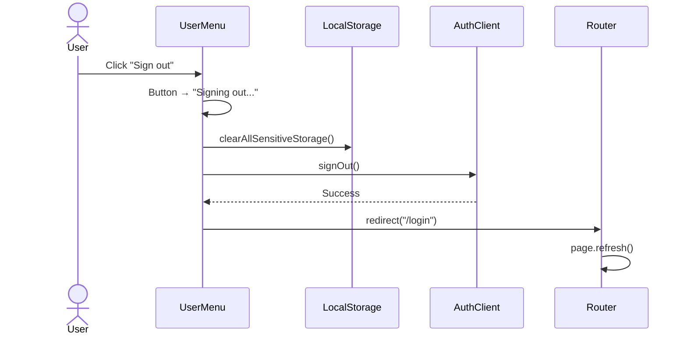
```mermaid
sequenceDiagram
    actor User
    participant Menu as UserMenu
    participant Store as LocalStorage
    participant Auth as AuthClient
    participant Router

    User->>Menu: Click "Sign out"
    Menu->>Menu: Button → "Signing out..."
    Menu->>Store: clearAllSensitiveStorage()
    Menu->>Auth: signOut()
    Auth-->>Menu: Success
    Menu->>Router: redirect("/login")
    Router->>Router: page.refresh()
```

---

## 3. Onboarding Wizard Flow

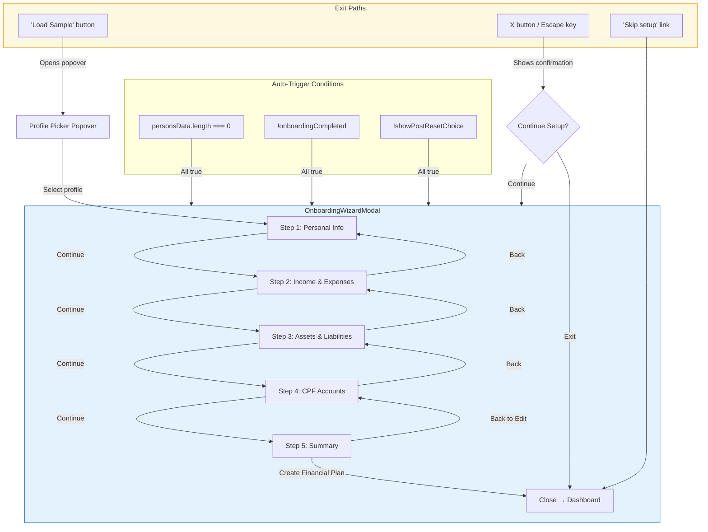
```mermaid
flowchart TB
    subgraph TRIGGER["Auto-Trigger Conditions"]
        C1["personsData.length === 0"]
        C2["!onboardingCompleted"]
        C3["!showPostResetChoice"]
    end

    C1 & C2 & C3 -->|"All true"| WIZARD

    subgraph WIZARD["OnboardingWizardModal"]
        direction TB
        S1["Step 1: Personal Info"]
        S2["Step 2: Income & Expenses"]
        S3["Step 3: Assets & Liabilities"]
        S4["Step 4: CPF Accounts"]
        S5["Step 5: Summary"]

        S1 -->|"Continue"| S2
        S2 -->|"Continue"| S3
        S3 -->|"Continue"| S4
        S4 -->|"Continue"| S5
        S5 -->|"Create Financial Plan"| DONE["Close → Dashboard"]

        S2 -->|"Back"| S1
        S3 -->|"Back"| S2
        S4 -->|"Back"| S3
        S5 -->|"Back to Edit"| S4
    end

    subgraph ESCAPE["Exit Paths"]
        SKIP["'Skip setup' link"]
        EXIT_X["X button / Escape key"]
        LOAD["'Load Sample' button"]
    end

    EXIT_X -->|"Shows confirmation"| CONFIRM{"Continue Setup?"}
    CONFIRM -->|"Continue"| WIZARD
    CONFIRM -->|"Exit"| DONE
    SKIP --> DONE
    LOAD -->|"Opens popover"| PROFILES["Profile Picker Popover"]
    PROFILES -->|"Select profile"| S1

    style WIZARD fill:#e3f2fd,stroke:#1565c0
    style ESCAPE fill:#fff8e1,stroke:#f9a825
```

### Step 1: Personal Info — Interactive Elements

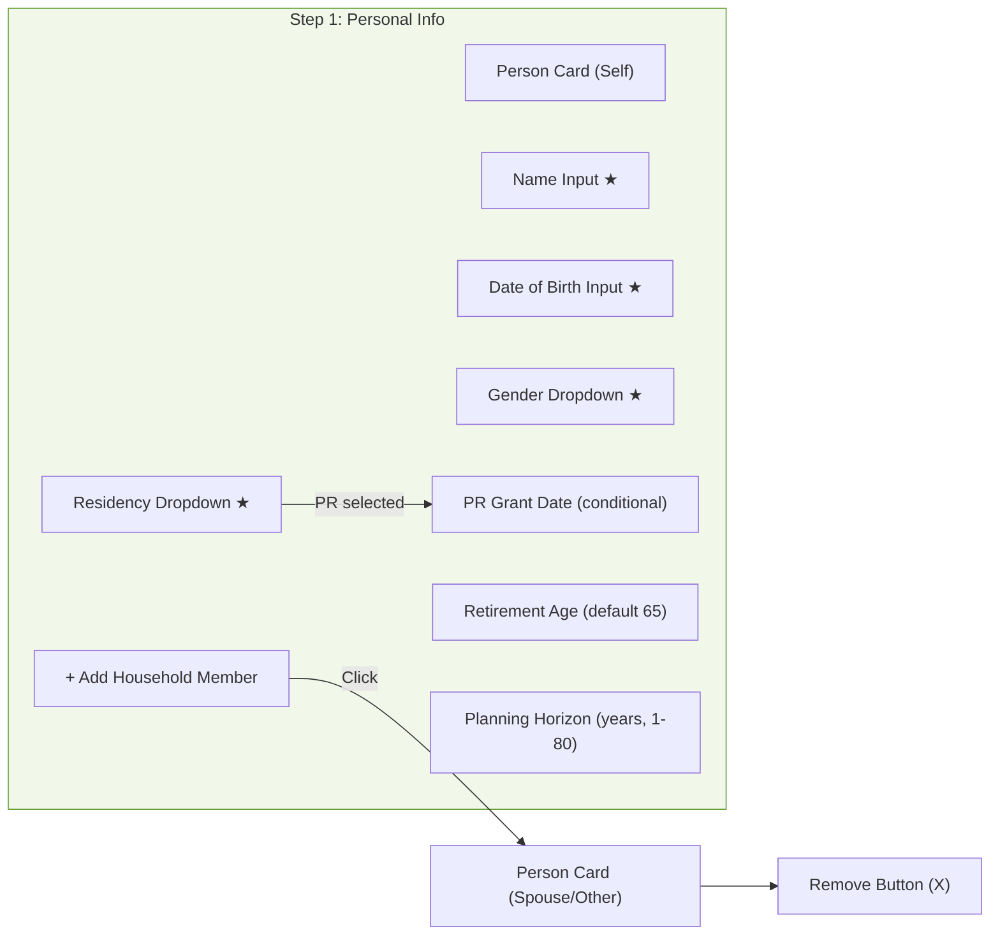
```mermaid
flowchart LR
    subgraph STEP1["Step 1: Personal Info"]
        direction TB
        P1["Person Card (Self)"]
        P1_NAME["Name Input ★"]
        P1_DOB["Date of Birth Input ★"]
        P1_GENDER["Gender Dropdown ★"]
        P1_RESID["Residency Dropdown ★"]
        P1_PR["PR Grant Date (conditional)"]
        P1_RETIRE["Retirement Age (default 65)"]

        ADD_BTN["+ Add Household Member"]
        PROJ["Planning Horizon (years, 1-80)"]
    end

    ADD_BTN -->|"Click"| P2["Person Card (Spouse/Other)"]
    P2 --> DEL["Remove Button (X)"]

    P1_RESID -->|"PR selected"| P1_PR

    style STEP1 fill:#f1f8e9,stroke:#689f38
```

### Step 2: Income & Expenses — Interactive Elements

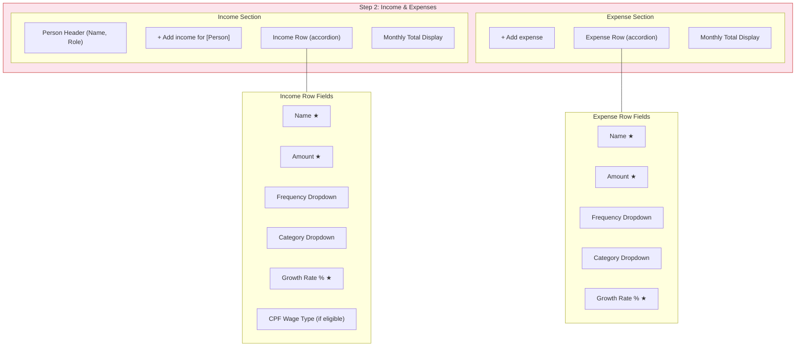
```mermaid
flowchart TB
    subgraph STEP2["Step 2: Income & Expenses"]
        subgraph INC["Income Section"]
            INC_HDR["Person Header (Name, Role)"]
            INC_ADD["+ Add income for [Person]"]
            INC_ROW["Income Row (accordion)"]
            INC_TOTAL["Monthly Total Display"]
        end
        subgraph EXP["Expense Section"]
            EXP_ADD["+ Add expense"]
            EXP_ROW["Expense Row (accordion)"]
            EXP_TOTAL["Monthly Total Display"]
        end
    end

    INC_ROW --- INC_FIELDS
    subgraph INC_FIELDS["Income Row Fields"]
        IF1["Name ★"]
        IF2["Amount ★"]
        IF3["Frequency Dropdown"]
        IF4["Category Dropdown"]
        IF5["Growth Rate % ★"]
        IF6["CPF Wage Type (if eligible)"]
    end

    EXP_ROW --- EXP_FIELDS
    subgraph EXP_FIELDS["Expense Row Fields"]
        EF1["Name ★"]
        EF2["Amount ★"]
        EF3["Frequency Dropdown"]
        EF4["Category Dropdown"]
        EF5["Growth Rate % ★"]
    end

    style STEP2 fill:#fce4ec,stroke:#c62828
```

### Step 3: Assets & Liabilities — Interactive Elements

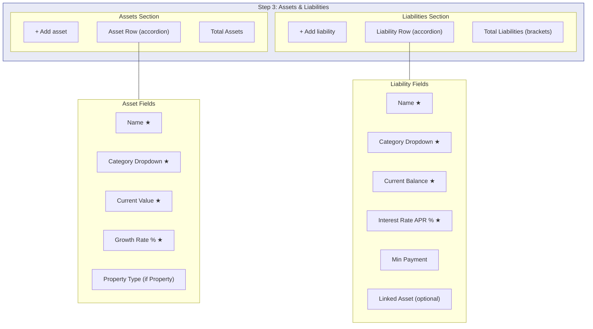
```mermaid
flowchart TB
    subgraph STEP3["Step 3: Assets & Liabilities"]
        subgraph ASSETS["Assets Section"]
            A_ADD["+ Add asset"]
            A_ROW["Asset Row (accordion)"]
            A_TOTAL["Total Assets"]
        end
        subgraph LIAB["Liabilities Section"]
            L_ADD["+ Add liability"]
            L_ROW["Liability Row (accordion)"]
            L_TOTAL["Total Liabilities (brackets)"]
        end
    end

    A_ROW --- A_FIELDS
    subgraph A_FIELDS["Asset Fields"]
        AF1["Name ★"]
        AF2["Category Dropdown ★"]
        AF3["Current Value ★"]
        AF4["Growth Rate % ★"]
        AF5["Property Type (if Property)"]
    end

    L_ROW --- L_FIELDS
    subgraph L_FIELDS["Liability Fields"]
        LF1["Name ★"]
        LF2["Category Dropdown ★"]
        LF3["Current Balance ★"]
        LF4["Interest Rate APR % ★"]
        LF5["Min Payment"]
        LF6["Linked Asset (optional)"]
    end

    style STEP3 fill:#e8eaf6,stroke:#283593
```

### Step 4: CPF Accounts

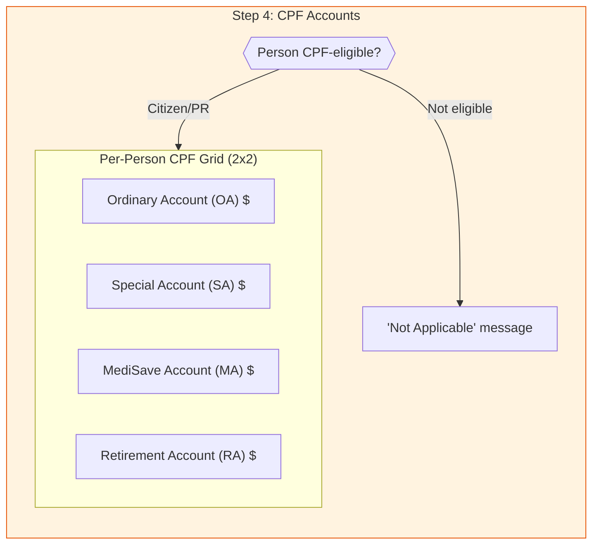
```mermaid
flowchart LR
    subgraph STEP4["Step 4: CPF Accounts"]
        direction TB
        ELIG{{"Person CPF-eligible?"}}
        ELIG -->|"Citizen/PR"| CPF_GRID
        ELIG -->|"Not eligible"| NA["'Not Applicable' message"]

        subgraph CPF_GRID["Per-Person CPF Grid (2x2)"]
            OA["Ordinary Account (OA) $"]
            SA["Special Account (SA) $"]
            MA["MediSave Account (MA) $"]
            RA["Retirement Account (RA) $"]
        end
    end

    style STEP4 fill:#fff3e0,stroke:#e65100
```

### Step 5: Summary

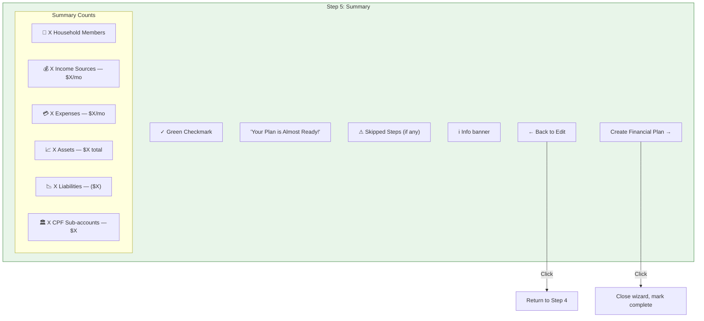
```mermaid
flowchart TB
    subgraph STEP5["Step 5: Summary"]
        CHECK["✓ Green Checkmark"]
        TITLE["'Your Plan is Almost Ready!'"]

        subgraph COUNTS["Summary Counts"]
            C_PERS["👥 X Household Members"]
            C_INC["💰 X Income Sources — $X/mo"]
            C_EXP["💳 X Expenses — $X/mo"]
            C_ASS["📈 X Assets — $X total"]
            C_LIA["📉 X Liabilities — ($X)"]
            C_CPF["🏛️ X CPF Sub-accounts — $X"]
        end

        SKIP_WARN["⚠ Skipped Steps (if any)"]
        INFO["ℹ Info banner"]
        BTN_BACK["← Back to Edit"]
        BTN_CREATE["Create Financial Plan →"]
    end

    BTN_CREATE -->|"Click"| CLOSE["Close wizard, mark complete"]
    BTN_BACK -->|"Click"| S4["Return to Step 4"]

    style STEP5 fill:#e8f5e9,stroke:#2e7d32
```

### Sample Profile Loading

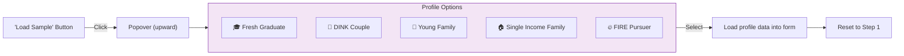
```mermaid
flowchart LR
    LOAD_BTN["'Load Sample' Button"] -->|"Click"| POP["Popover (upward)"]

    subgraph POP_CONTENT["Profile Options"]
        P1["🎓 Fresh Graduate"]
        P2["💑 DINK Couple"]
        P3["👶 Young Family"]
        P4["🏠 Single Income Family"]
        P5["🔥 FIRE Pursuer"]
    end

    POP --> POP_CONTENT
    POP_CONTENT -->|"Select"| LOAD["Load profile data into form"]
    LOAD --> RESET["Reset to Step 1"]

    style POP_CONTENT fill:#f3e5f5,stroke:#7b1fa2
```

---

## 4. Dashboard Workspace

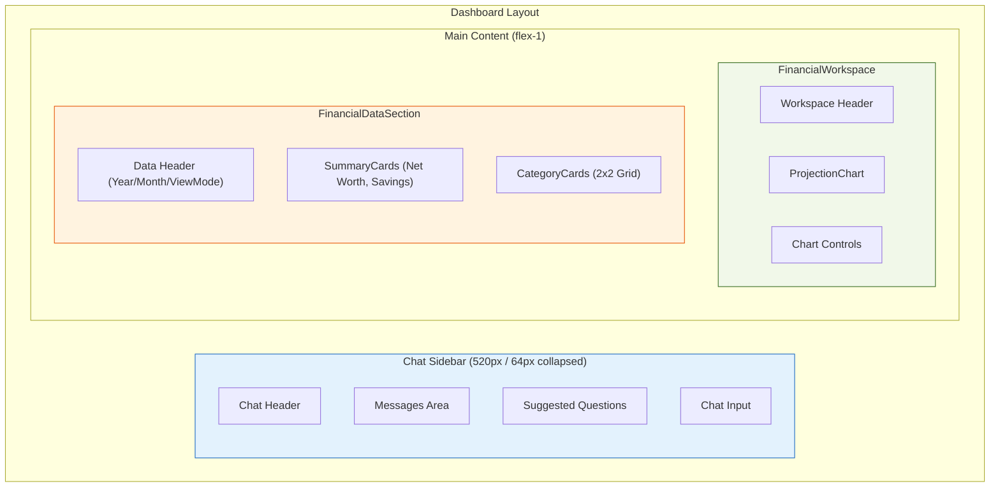
```mermaid
flowchart TB
    subgraph DASHBOARD["Dashboard Layout"]
        direction LR
        subgraph CHAT_SIDE["Chat Sidebar (520px / 64px collapsed)"]
            CH_HEAD["Chat Header"]
            CH_MSGS["Messages Area"]
            CH_SUGGEST["Suggested Questions"]
            CH_INPUT["Chat Input"]
        end

        subgraph MAIN["Main Content (flex-1)"]
            subgraph WORKSPACE["FinancialWorkspace"]
                WS_HEADER["Workspace Header"]
                CHART["ProjectionChart"]
                CHART_CTRL["Chart Controls"]
            end

            subgraph DATA["FinancialDataSection"]
                DATA_HDR["Data Header (Year/Month/ViewMode)"]
                SUMMARY["SummaryCards (Net Worth, Savings)"]
                CARDS["CategoryCards (2x2 Grid)"]
            end
        end
    end

    style CHAT_SIDE fill:#e3f2fd,stroke:#1565c0
    style WORKSPACE fill:#f1f8e9,stroke:#33691e
    style DATA fill:#fff3e0,stroke:#e65100
```

### Workspace Header — All Interactive Elements

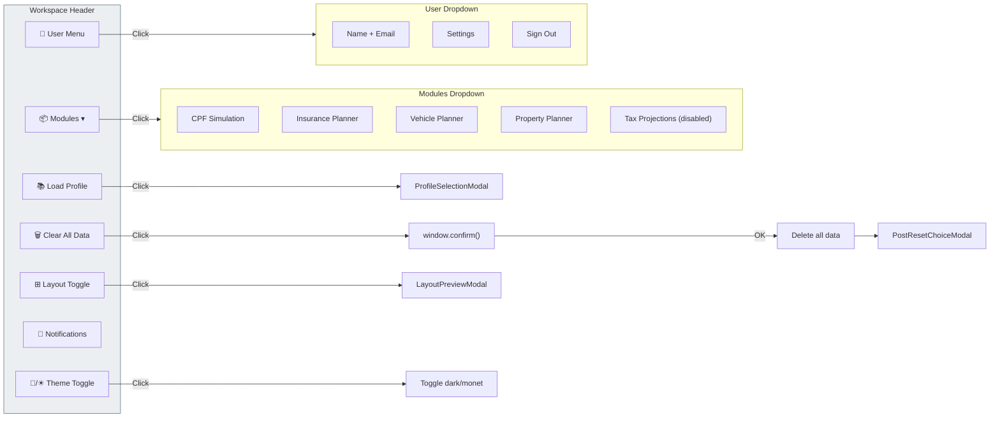
```mermaid
flowchart LR
    subgraph HEADER["Workspace Header"]
        LOAD_PROF["📚 Load Profile"]
        CLEAR["🗑️ Clear All Data"]
        MODULES["📦 Modules ▾"]
        LAYOUT["⊞ Layout Toggle"]
        THEME["🌙/☀ Theme Toggle"]
        BELL["🔔 Notifications"]
        USER["👤 User Menu"]
    end

    MODULES -->|"Click"| MOD_MENU
    subgraph MOD_MENU["Modules Dropdown"]
        M_CPF["CPF Simulation"]
        M_INS["Insurance Planner"]
        M_VEH["Vehicle Planner"]
        M_PROP["Property Planner"]
        M_TAX["Tax Projections (disabled)"]
    end

    USER -->|"Click"| USER_MENU
    subgraph USER_MENU["User Dropdown"]
        UM_INFO["Name + Email"]
        UM_SET["Settings"]
        UM_OUT["Sign Out"]
    end

    LOAD_PROF -->|"Click"| PROF_MODAL["ProfileSelectionModal"]
    CLEAR -->|"Click"| CONFIRM["window.confirm()"]
    CONFIRM -->|"OK"| DELETE_ALL["Delete all data"]
    DELETE_ALL --> RESET_CHOICE["PostResetChoiceModal"]
    LAYOUT -->|"Click"| LAY_MODAL["LayoutPreviewModal"]
    THEME -->|"Click"| TOGGLE["Toggle dark/monet"]

    style HEADER fill:#eceff1,stroke:#546e7a
```

### Dashboard Layout Modes

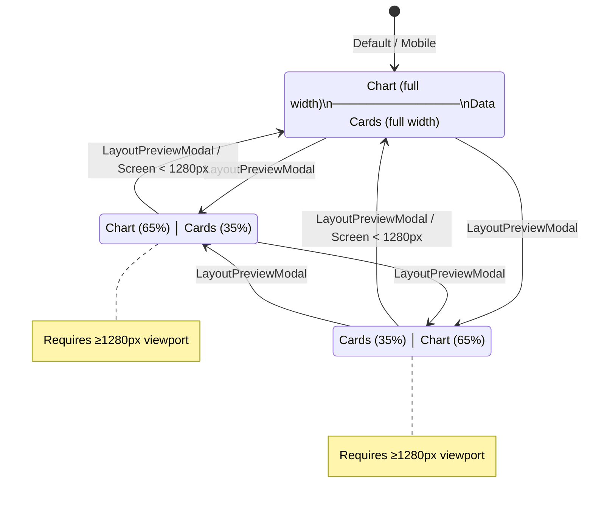
```mermaid
stateDiagram-v2
    [*] --> Stacked : Default / Mobile

    Stacked : Chart (full width)\n───────────────\nData Cards (full width)
    ChartLeft : Chart (65%) │ Cards (35%)
    ChartRight : Cards (35%) │ Chart (65%)

    Stacked --> ChartLeft : LayoutPreviewModal
    Stacked --> ChartRight : LayoutPreviewModal
    ChartLeft --> Stacked : LayoutPreviewModal / Screen < 1280px
    ChartRight --> Stacked : LayoutPreviewModal / Screen < 1280px
    ChartLeft --> ChartRight : LayoutPreviewModal
    ChartRight --> ChartLeft : LayoutPreviewModal

    note right of ChartLeft : Requires ≥1280px viewport
    note right of ChartRight : Requires ≥1280px viewport
```

### Data Section Header

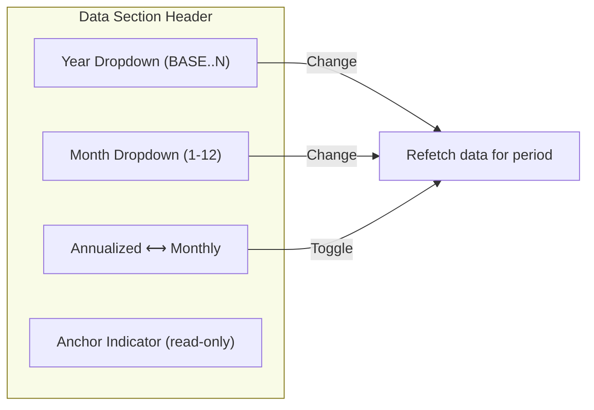
```mermaid
flowchart LR
    subgraph DATA_HDR["Data Section Header"]
        YEAR_SEL["Year Dropdown (BASE..N)"]
        MONTH_SEL["Month Dropdown (1-12)"]
        VIEW_TOGGLE["Annualized ⟷ Monthly"]
        ANCHOR["Anchor Indicator (read-only)"]
    end

    YEAR_SEL -->|"Change"| REFETCH["Refetch data for period"]
    MONTH_SEL -->|"Change"| REFETCH
    VIEW_TOGGLE -->|"Toggle"| REFETCH

    style DATA_HDR fill:#f9fbe7,stroke:#827717
```

### Category Cards Structure

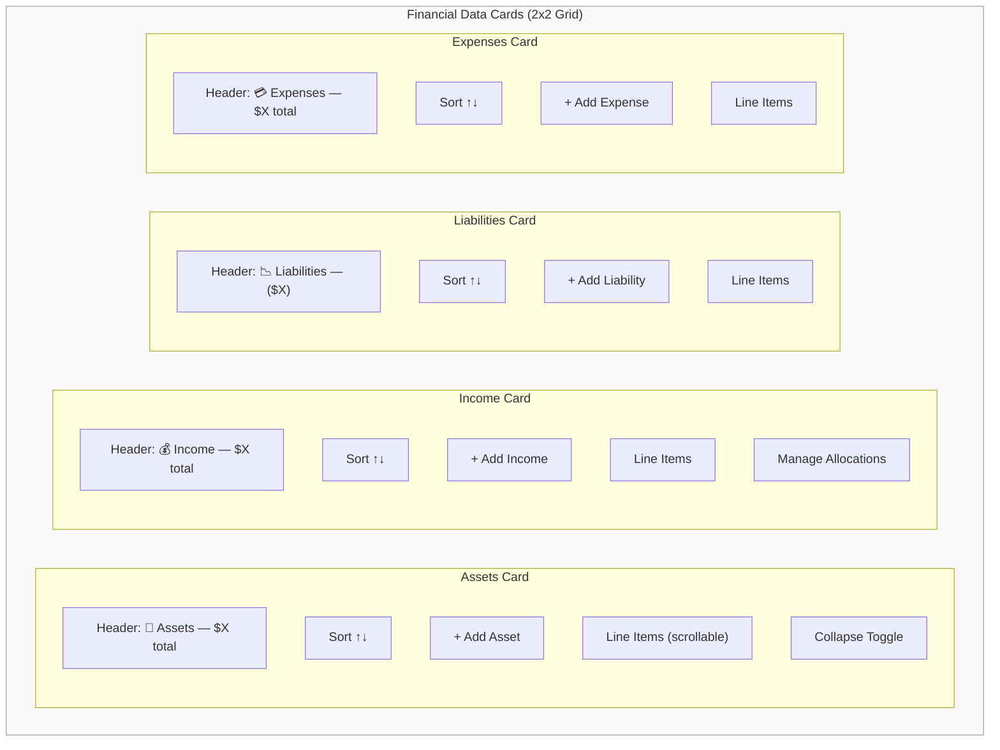
```mermaid
flowchart TB
    subgraph CARDS["Financial Data Cards (2x2 Grid)"]
        subgraph ASSETS["Assets Card"]
            A_HDR["Header: 💎 Assets — $X total"]
            A_SORT["Sort ↑↓"]
            A_ADD["+ Add Asset"]
            A_ITEMS["Line Items (scrollable)"]
            A_COLL["Collapse Toggle"]
        end

        subgraph INCOME["Income Card"]
            I_HDR["Header: 💰 Income — $X total"]
            I_SORT["Sort ↑↓"]
            I_ADD["+ Add Income"]
            I_ITEMS["Line Items"]
            I_ALLOC["Manage Allocations"]
        end

        subgraph LIAB["Liabilities Card"]
            L_HDR["Header: 📉 Liabilities — ($X)"]
            L_SORT["Sort ↑↓"]
            L_ADD["+ Add Liability"]
            L_ITEMS["Line Items"]
        end

        subgraph EXP["Expenses Card"]
            E_HDR["Header: 💳 Expenses — $X total"]
            E_SORT["Sort ↑↓"]
            E_ADD["+ Add Expense"]
            E_ITEMS["Line Items"]
        end
    end

    style CARDS fill:#fafafa,stroke:#9e9e9e
```

### Line Item Interactions

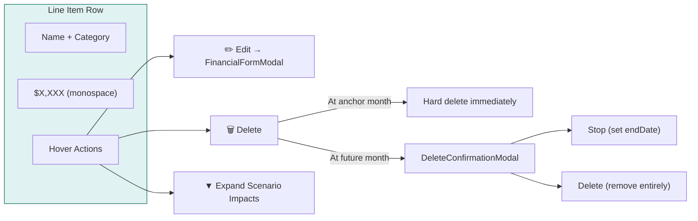
```mermaid
flowchart LR
    subgraph LINE_ITEM["Line Item Row"]
        NAME["Name + Category"]
        AMOUNT["$X,XXX (monospace)"]
        ACTIONS["Hover Actions"]
    end

    ACTIONS --> EDIT["✏️ Edit → FinancialFormModal"]
    ACTIONS --> DELETE["🗑️ Delete"]
    ACTIONS --> EXPAND["▼ Expand Scenario Impacts"]

    DELETE -->|"At anchor month"| HARD["Hard delete immediately"]
    DELETE -->|"At future month"| SOFT_CONFIRM["DeleteConfirmationModal"]
    SOFT_CONFIRM --> STOP["Stop (set endDate)"]
    SOFT_CONFIRM --> HARD_DEL["Delete (remove entirely)"]

    style LINE_ITEM fill:#e0f2f1,stroke:#00695c
```

---

## 5. Financial Data CRUD

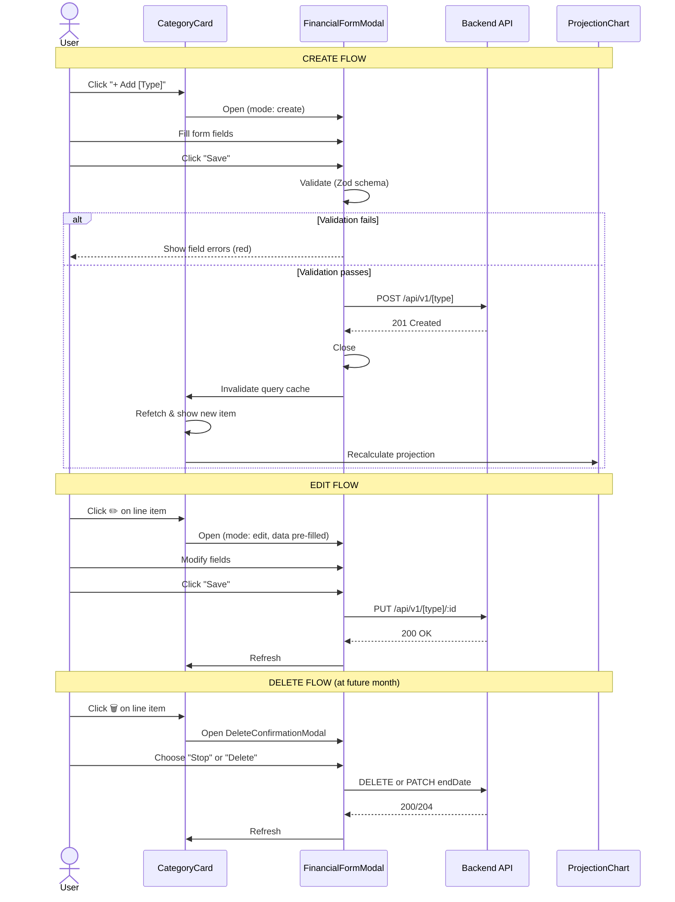
```mermaid
sequenceDiagram
    actor User
    participant Card as CategoryCard
    participant Modal as FinancialFormModal
    participant API as Backend API
    participant Chart as ProjectionChart

    Note over User,Chart: CREATE FLOW
    User->>Card: Click "+ Add [Type]"
    Card->>Modal: Open (mode: create)
    User->>Modal: Fill form fields
    User->>Modal: Click "Save"
    Modal->>Modal: Validate (Zod schema)
    alt Validation fails
        Modal-->>User: Show field errors (red)
    else Validation passes
        Modal->>API: POST /api/v1/[type]
        API-->>Modal: 201 Created
        Modal->>Modal: Close
        Modal->>Card: Invalidate query cache
        Card->>Card: Refetch & show new item
        Card->>Chart: Recalculate projection
    end

    Note over User,Chart: EDIT FLOW
    User->>Card: Click ✏️ on line item
    Card->>Modal: Open (mode: edit, data pre-filled)
    User->>Modal: Modify fields
    User->>Modal: Click "Save"
    Modal->>API: PUT /api/v1/[type]/:id
    API-->>Modal: 200 OK
    Modal->>Card: Refresh

    Note over User,Chart: DELETE FLOW (at future month)
    User->>Card: Click 🗑️ on line item
    Card->>Modal: Open DeleteConfirmationModal
    User->>Modal: Choose "Stop" or "Delete"
    Modal->>API: DELETE or PATCH endDate
    API-->>Modal: 200/204
    Modal->>Card: Refresh
```

### FinancialFormModal — Field Matrix

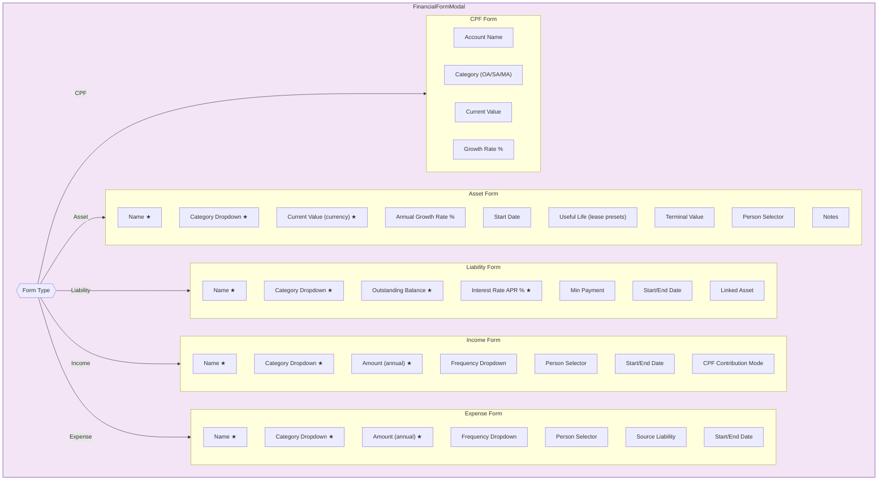
```mermaid
flowchart TB
    subgraph MODAL["FinancialFormModal"]
        TYPE{{"Form Type"}}

        TYPE -->|"Asset"| ASSET_FIELDS
        TYPE -->|"Liability"| LIAB_FIELDS
        TYPE -->|"Income"| INC_FIELDS
        TYPE -->|"Expense"| EXP_FIELDS
        TYPE -->|"CPF"| CPF_FIELDS
    end

    subgraph ASSET_FIELDS["Asset Form"]
        AF1["Name ★"]
        AF2["Category Dropdown ★"]
        AF3["Current Value (currency) ★"]
        AF4["Annual Growth Rate %"]
        AF5["Start Date"]
        AF6["Useful Life (lease presets)"]
        AF7["Terminal Value"]
        AF8["Person Selector"]
        AF9["Notes"]
    end

    subgraph LIAB_FIELDS["Liability Form"]
        LF1["Name ★"]
        LF2["Category Dropdown ★"]
        LF3["Outstanding Balance ★"]
        LF4["Interest Rate APR % ★"]
        LF5["Min Payment"]
        LF6["Start/End Date"]
        LF7["Linked Asset"]
    end

    subgraph INC_FIELDS["Income Form"]
        IF1["Name ★"]
        IF2["Category Dropdown ★"]
        IF3["Amount (annual) ★"]
        IF4["Frequency Dropdown"]
        IF5["Person Selector"]
        IF6["Start/End Date"]
        IF7["CPF Contribution Mode"]
    end

    subgraph EXP_FIELDS["Expense Form"]
        EF1["Name ★"]
        EF2["Category Dropdown ★"]
        EF3["Amount (annual) ★"]
        EF4["Frequency Dropdown"]
        EF5["Person Selector"]
        EF6["Source Liability"]
        EF7["Start/End Date"]
    end

    subgraph CPF_FIELDS["CPF Form"]
        CF1["Account Name"]
        CF2["Category (OA/SA/MA)"]
        CF3["Current Value"]
        CF4["Growth Rate %"]
    end

    style MODAL fill:#f3e5f5,stroke:#6a1b9a
```

### Scenario Event Modal

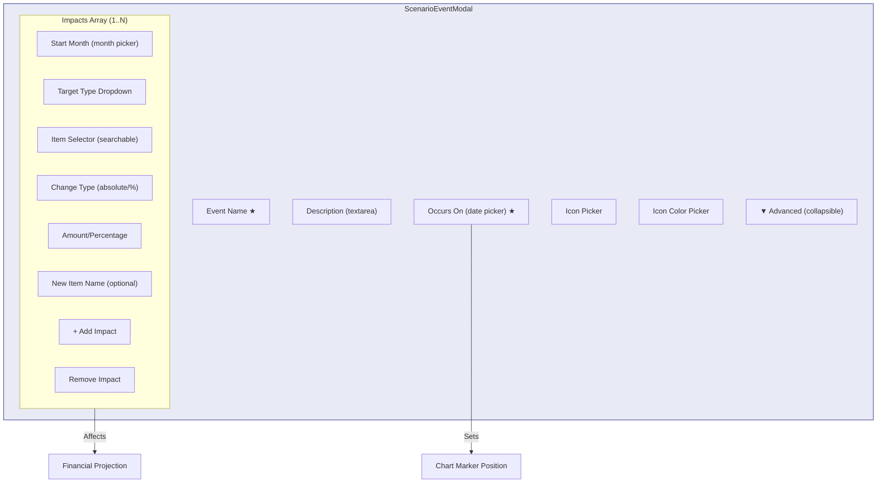
```mermaid
flowchart TB
    subgraph SCENARIO["ScenarioEventModal"]
        SE_NAME["Event Name ★"]
        SE_DESC["Description (textarea)"]
        SE_DATE["Occurs On (date picker) ★"]
        SE_ICON["Icon Picker"]
        SE_COLOR["Icon Color Picker"]

        subgraph IMPACTS["Impacts Array (1..N)"]
            IMP_START["Start Month (month picker)"]
            IMP_TARGET["Target Type Dropdown"]
            IMP_ITEM["Item Selector (searchable)"]
            IMP_CHANGE["Change Type (absolute/%)"]
            IMP_AMT["Amount/Percentage"]
            IMP_NAME["New Item Name (optional)"]
            IMP_ADD["+ Add Impact"]
            IMP_DEL["Remove Impact"]
        end

        SE_ADVANCED["▼ Advanced (collapsible)"]
    end

    SE_DATE -->|"Sets"| MARKER["Chart Marker Position"]
    IMPACTS -->|"Affects"| PROJECTION["Financial Projection"]

    style SCENARIO fill:#e8eaf6,stroke:#1a237e
```

---

## 6. Chart Interactions

```mermaid
stateDiagram-v2
    state ChartArea {
        [*] --> Idle

        Idle --> Hovering : Mouse Enter
        Hovering --> Idle : Mouse Leave
        Hovering --> PointClicked : Click Data Point
        PointClicked --> Idle : Click Away

        Idle --> Dragging : Drag Indicator
        Dragging --> Idle : Release

        Idle --> Zooming : Scroll (zoom mode)
        Zooming --> Idle : Scroll End

        Idle --> Panning : Drag Chart (page mode)
        Panning --> Idle : Release

        state Hovering {
            [*] --> ShowTooltip
            ShowTooltip : Net worth value\nAge/Year\nMonth name
        }

        state PointClicked {
            [*] --> UpdateTimeline
            UpdateTimeline : selectedYear updated\nselectedMonth updated\nCards refetch data
        }
    }
```

### Chart Controls & Features

```mermaid
flowchart TB
    subgraph CHART_CTRL["Chart Controls"]
        ZOOM_IN["+ Zoom In"]
        ZOOM_OUT["- Zoom Out"]
        SCROLL_MODE["🔄 Scroll Mode Toggle"]
        AXIS_TOGGLE["Age ⟷ Actual Year"]
        ADD_EVENT["+ Add Event"]
    end

    subgraph MARKERS["Chart Markers"]
        SCENARIO_DOT["Scenario Event (colored dot)"]
        PROP_RING["Property Marker (ring)"]
        OVERRIDE["Override Year Indicator"]
    end

    subgraph PIP["Picture-in-Picture"]
        MINI["MiniChart (floating)"]
        RESIZE["Resize Handle"]
        DISMISS["X Dismiss"]
        SCROLL_BACK["↗ Back to Chart"]
    end

    SCENARIO_DOT -->|"Click"| DOT_MENU["Edit / Expand"]
    PROP_RING -->|"Click"| PROP_POP["PropertyMarkerPopover"]
    ADD_EVENT -->|"Click"| SCEN_MODAL["ScenarioEventModal"]

    MINI -->|"Appears when"| CONDITION["Main chart < 20% visible"]
    DISMISS -->|"Click"| HIDE["Hide MiniChart"]
    SCROLL_BACK -->|"Click"| SCROLL["Smooth scroll to main chart"]

    style CHART_CTRL fill:#e0f7fa,stroke:#006064
    style PIP fill:#fff8e1,stroke:#ff6f00
```

---

## 7. CPF Planner Module

```mermaid
flowchart TB
    ENTRY["Dashboard → Modules → CPF"] -->|"Navigate"| CPF_VIEW["CPFSimulationView"]

    subgraph CPF_VIEW["CPF Planner"]
        direction TB
        subgraph TABS["Tab Navigation"]
            T1["Overview"]
            T2["Projection"]
            T3["Property"]
            T4["Strategies"]
            T5["Learn"]
        end

        T1 --> OV["CPF Balance Overview\n+ Contribution Flow"]
        T2 --> PROJ["30-Year Projection Chart\n+ Growth/Drawdown Toggle\n+ Milestone Markers"]
        T3 --> PROP_LIST["Property Scenarios\n+ CPF Usage Summary\n+ Add Scenario → PropertyModal"]
        T4 --> STRAT["Strategy Selector Dropdown"]
        T5 --> LEARN["Age 55 Simulator\n+ CPF Life Calculator\n+ Journey Questionnaire"]
    end

    STRAT --> STRAT_OPTS
    subgraph STRAT_OPTS["Strategy Options"]
        SO1["Regular Contributions (TopUpTaxReliefCalc)"]
        SO2["Self-Employed (placeholder)"]
        SO3["VC3A (placeholder)"]
        SO4["MediSave Top-Up (placeholder)"]
        SO5["RSTU (placeholder)"]
        SO6["Transfers (placeholder)"]
        SO7["Housing Refund (placeholder)"]
        SO8["CPFIS (CPFISInvestmentDashboard)"]
    end

    style CPF_VIEW fill:#e8f5e9,stroke:#1b5e20
```

### CPF Overview — Interactive Elements

```mermaid
flowchart LR
    subgraph CPF_OV["CPF Overview Tab"]
        BALANCES["Account Balances (editable)"]
        OA_INPUT["OA: $______"]
        SA_INPUT["SA: $______"]
        MA_INPUT["MA: $______"]
        FLOW["Contribution Flow Visualization"]
        READINESS["Retirement Readiness Summary"]
    end

    BALANCES --> SAVE["Save balances to API"]

    style CPF_OV fill:#c8e6c9,stroke:#2e7d32
```

### CPF Projection — Interactive Elements

```mermaid
flowchart TB
    subgraph CPF_PROJ["CPF Projection Tab"]
        CHART["30-Year Line Chart"]
        TOGGLE["Growth ⟷ Drawdown"]
        SLIDER["Projection Years Slider (0-30)"]
        MARKERS["Milestone Markers"]
        M55["Age 55: RA Conversion"]
        M65["Age 65: Drawdown Start"]
        TARGET["Retirement Sum Target Line"]
    end

    CHART -->|"Hover"| TOOLTIP["Year, OA, SA, MA, Total"]
    MARKERS --> M55 & M65

    style CPF_PROJ fill:#b2dfdb,stroke:#004d40
```

---

## 8. Insurance Planner Module

```mermaid
flowchart TB
    ENTRY["Dashboard → Insurance\nOR /insurance-planner"] --> INS_VIEW

    subgraph INS_VIEW["Insurance Planner"]
        subgraph TABS["Tab Navigation (3 tabs)"]
            T1["Coverage"]
            T2["Journey"]
            T3["Policies"]
        end

        T1 --> COVERAGE
        T2 --> JOURNEY
        T3 --> POLICIES
    end

    subgraph COVERAGE["Coverage Tab"]
        PERSON_FILTER["Person Dropdown Filter"]
        subgraph COV_CARDS["Coverage Category Cards (4)"]
            CC1["🏥 Hospitalization (ward class)"]
            CC2["❤️ Life/TPD (death coverage)"]
            CC3["🛡️ Critical Illness"]
            CC4["🛡️ Early CI"]
        end
        GAP["Coverage Gap Indicators"]
        POLICY_LIST["Individual Policy List"]
        RESET_TARGETS["Reset Targets Button"]
        EDIT_TARGETS["Edit Targets → Guidelines"]
    end

    subgraph JOURNEY["Journey Tab"]
        J_CHART["Coverage Projection Chart (Chart.js)"]
        J_PERSON["Person Selector"]
        J_FILTER["Category Filter Pills (toggle)"]
        J_STAGES["Life Stage Milestones"]
    end

    subgraph POLICIES["Policies Tab"]
        P_ADD["+ Add Policy (red button)"]
        P_LIST["Paginated Policy Table"]
        P_SORT["Sort Controls"]
        P_FILTER["Filter by Category"]
        P_ACTIONS["Per-Row: View / Edit / Delete"]
    end

    P_ADD -->|"Click"| ADD_MODAL["AddPolicyModal"]
    P_ACTIONS -->|"View"| DETAIL_MODAL["PolicyDetailModal"]
    P_ACTIONS -->|"Edit"| ADD_MODAL
    P_ACTIONS -->|"Delete"| CONFIRM["Confirm Delete"]

    style INS_VIEW fill:#fce4ec,stroke:#880e4f
```

### AddPolicyModal Flow

```mermaid
flowchart LR
    subgraph ADD_POLICY["AddPolicyModal"]
        STEP1["Step 1: Category Selection"]
        STEP1_BTNS["6 Category Buttons:\nLife | Health | Critical Illness\nLong-Term Care | Personal Accident | Disability"]

        STEP2["Step 2: Policy Details"]
        STEP2_FIELDS["Policy Name ★\nProvider Dropdown ★\nSum Assured (currency) ★\nPremium (currency) ★\nPremium Frequency Toggle\nPolicy Start Date\nEnd Date (optional)\nRenewal Date (optional)"]

        STEP3["Step 3: Review & Save"]
    end

    STEP1 -->|"Select category"| STEP2
    STEP2 -->|"Next"| STEP3
    STEP3 -->|"Save"| CLOSE["Close → Refresh list"]
    STEP2 -->|"Back"| STEP1
    STEP3 -->|"Back"| STEP2

    style ADD_POLICY fill:#f8bbd0,stroke:#ad1457
```

---

## 9. Vehicle Planner Module

```mermaid
flowchart TB
    ENTRY["/vehicle-planner"] --> VEH_VIEW

    subgraph VEH_VIEW["Vehicle Planner"]
        SEL_SCREEN["Vehicle Selection Screen"]
        DETAIL["Vehicle Detail View"]
    end

    SEL_SCREEN -->|"Click vehicle card"| DETAIL
    SEL_SCREEN -->|"+ Add Vehicle"| ADD_MODAL["AddVehicleScenarioModal"]
    ADD_MODAL -->|"Create"| DETAIL
    DETAIL -->|"Back arrow"| SEL_SCREEN

    subgraph SEL_SCREEN_CONTENT["Selection Screen"]
        VEH_LIST["Vehicle Scenario Cards"]
        VEH_CARD["Card: Toggle | Icon | Name | Category\nTotal Cost | Monthly Cost | Delete"]
        EMPTY["Empty State: + Add Vehicle"]
    end

    subgraph DETAIL_CONTENT["Detail View — 5 Tabs"]
        DT1["Vehicle & Financing"]
        DT2["Cost Breakdown"]
        DT3["Depreciation"]
        DT4["Total Cost of Ownership"]
        DT5["Scenarios"]
    end

    style VEH_VIEW fill:#e0f2f1,stroke:#004d40
```

### Vehicle Detail Tabs

```mermaid
flowchart TB
    subgraph VEH_FIN["Tab 1: Vehicle & Financing"]
        VF1["Category Selector (Cat A/B/D)"]
        VF2["Fuel Type (Petrol/Diesel/Electric/Hybrid)"]
        VF3["Vehicle Price (currency)"]
        VF4["Year of Manufacture"]
        VF5["Mileage"]
        VF6["CO2 Emissions"]
        VF7["VES Band (calculated)"]
    end

    subgraph VEH_COST["Tab 2: Cost Breakdown"]
        VC1["Breakdown Chart (bar)"]
        VC2["Cost Details Table"]
        VC3["Custom Costs Section"]
        VC4["+ Add Custom Cost"]
    end

    subgraph VEH_DEP["Tab 3: Depreciation"]
        VD1["Depreciation Curve Chart"]
        VD2["Rate Table"]
        VD3["Residual Value"]
        VD4["View Toggle: Year / Cumulative"]
    end

    subgraph VEH_TCO["Tab 4: Total Cost"]
        VT1["5/10/15yr Cost Metrics"]
        VT2["Cost per Month"]
        VT3["Cost per KM"]
        VT4["Ownership Period Slider (1-20yr)"]
        VT5["Break-even Chart"]
    end

    subgraph VEH_SCEN["Tab 5: Scenarios"]
        VS1["Scenario List"]
        VS2["+ Add Scenario"]
        VS3["Save Current as Scenario"]
        VS4["Multi-Vehicle Comparison"]
    end

    style VEH_FIN fill:#b2dfdb,stroke:#00695c
    style VEH_COST fill:#c8e6c9,stroke:#2e7d32
    style VEH_DEP fill:#dcedc8,stroke:#558b2f
    style VEH_TCO fill:#f0f4c3,stroke:#827717
    style VEH_SCEN fill:#fff9c4,stroke:#f9a825
```

---

## 10. Property Planner Module

```mermaid
flowchart TB
    ENTRY["Dashboard → Property\nOR CPF Property Tab"] --> PROP_MODAL["PropertyPlannerModal"]

    subgraph PROP_MODAL["Property Planner (Modal)"]
        LIST["Scenario Selection"]
        DETAIL["Scenario Detail (Tabbed)"]
    end

    LIST -->|"Click scenario"| DETAIL
    LIST -->|"+ Add Scenario"| DETAIL
    DETAIL -->|"Back"| LIST

    subgraph LIST_CONTENT["Scenario List"]
        SC1["Scenario Cards"]
        SC2["Include Toggle"]
        SC3["Property Type Badge"]
        SC4["Purchase/Sale Price"]
        SC5["Net Profit/Loss"]
        SC6["Actions: View / Duplicate / Delete"]
        SC7["+ Add Scenario"]
    end

    subgraph DETAIL_TABS["Detail View — 8 Tabs"]
        PT1["Overview"]
        PT2["Property"]
        PT3["Financing"]
        PT4["Borrowers"]
        PT5["Payment Rules"]
        PT6["CPF Impact"]
        PT7["Sale Parameters"]
        PT8["Results (sub-tabs)"]
    end

    subgraph RESULTS_SUB["Results Sub-Tabs"]
        R1["Returns (ROI %, annualized)"]
        R2["Cash Flow Timeline"]
        R3["Amortization Schedule"]
        R4["Appreciation Chart"]
        R5["CPF Ledger"]
    end

    PT8 --> RESULTS_SUB

    style PROP_MODAL fill:#fff3e0,stroke:#e65100
```

### Property Form Fields (Tabs 2-7)

```mermaid
flowchart TB
    subgraph PROPERTY_TAB["Tab: Property"]
        P1["Property Type Selector"]
        P2["Purchase Price ★"]
        P3["Purchase Date ★"]
        P4["Completion Date (BTO)"]
        P5["Occupancy Date"]
        P6["Address"]
        P7["Holding Period Slider"]
    end

    subgraph FINANCING_TAB["Tab: Financing"]
        F1["Loan Amount / LTV% Toggle"]
        F2["Tenure Slider (5-30yr)"]
        F3["Interest Rate ★"]
        F4["Rate Type (Fixed/Variable)"]
        F5["Down Payment Amount"]
        F6["Down Payment Sources:\n  Cash $ | CPF OA $"]
        F7["Monthly Payment Sources:\n  Cash $ | CPF OA $"]
    end

    subgraph BORROWERS_TAB["Tab: Borrowers"]
        B1["Borrower 1 Selector"]
        B2["Borrower 2 (optional)"]
        B3["Income Inputs"]
        B4["CPF Refund Mapping"]
    end

    subgraph SALE_TAB["Tab: Sale"]
        S1["Sale Price"]
        S2["Sale Date"]
        S3["Agent Commission (% or $)"]
        S4["Legal Fees"]
        S5["Stamp Duty"]
        S6["Other Costs (editable list)"]
        S7["Proceeds Allocation"]
    end

    style PROPERTY_TAB fill:#ffe0b2,stroke:#e65100
    style FINANCING_TAB fill:#ffccbc,stroke:#bf360c
    style BORROWERS_TAB fill:#d7ccc8,stroke:#4e342e
    style SALE_TAB fill:#ffecb3,stroke:#ff6f00
```

---

## 11. Tax Planner Module

```mermaid
flowchart TB
    ENTRY["/tax-planner"] --> TAX_VIEW

    subgraph TAX_VIEW["Tax Planner"]
        LIST["Scenario Selection Screen"]
        DETAIL["Scenario Detail View (2x2 Grid)"]
    end

    LIST -->|"Click scenario"| DETAIL
    LIST -->|"+ Add Tax Scenario"| INLINE_CREATE["Inline Create Form"]
    INLINE_CREATE -->|"Save"| DETAIL
    DETAIL -->|"Back to Scenarios"| LIST

    subgraph LIST_CONTENT["Scenario List"]
        TC1["Scenario Cards"]
        TC2["Include Toggle"]
        TC3["YA Badge (2024/25/26)"]
        TC4["Income · Tax Payable"]
        TC5["Effective Rate"]
        TC6["Edit / Delete"]
    end

    style TAX_VIEW fill:#e8eaf6,stroke:#283593
```

### Tax Detail View — 2x2 Grid Layout

```mermaid
flowchart TB
    subgraph LEFT["Left Panel: Tax Form Wizard"]
        subgraph STEP1["Step 1: Income"]
            S1A["Assessment Year Dropdown"]
            S1B["Residency Status"]
            S1C["Income Sources List"]
            S1D["+ Add Income Source"]
            S1E["Per Source: Name, Type, Gross, CPF, Bonus"]
        end

        subgraph STEP2["Step 2: Reliefs"]
            S2A["Relief Categories (Accordion)"]
            S2B["Personal / CPF & SRS / Family / Insurance"]
            S2C["Per Relief: Amount, Max, Progress Bar"]
            S2D["$80K Cap Warning"]
        end

        subgraph STEP3["Step 3: Summary"]
            S3A["Tax Payable (rose)"]
            S3B["Effective Rate (emerald)"]
            S3C["Marginal Rate (amber)"]
            S3D["Visualization Toggle"]
            S3E["Full Breakdown Table"]
        end

        STEP1 -->|"Next"| STEP2
        STEP2 -->|"Next"| STEP3
    end

    subgraph RIGHT["Right Panel: Results"]
        R1["Tax Summary Card"]
        R2["Income Flow Card\n(Gross → CPF → Reliefs → Tax)"]
        R3["Optimization Tips"]
        R4["Scenario Comparison\n(if 2+ scenarios)"]
    end

    style LEFT fill:#c5cae9,stroke:#1a237e
    style RIGHT fill:#e8eaf6,stroke:#3f51b5
```

### Tax Visualization Options

```mermaid
flowchart LR
    TOGGLE{{"Visualization Toggle"}}
    TOGGLE -->|"Breakdown"| BAR["Bar Chart:\nGross → CPF → Reliefs → Chargeable → Tax"]
    TOGGLE -->|"Tax by Bracket"| AREA["Area Chart:\nBrackets 0-20k .. Above $1M\nRate per bracket"]

    style BAR fill:#bbdefb,stroke:#1565c0
    style AREA fill:#b3e5fc,stroke:#0277bd
```

---

## 12. Chat Assistant

```mermaid
stateDiagram-v2
    state ChatSidebar {
        [*] --> Expanded : Default
        Expanded --> Collapsed : Click collapse
        Collapsed --> Expanded : Click expand

        state Expanded {
            [*] --> Empty
            Empty : Suggested Questions\n(4 pre-defined pills)
            Empty --> Active : Send message / Click suggestion
            Active : Messages scrollable area
            Active --> ActionReview : AI proposes action
            ActionReview --> Active : Confirm / Cancel
        }

        state Collapsed {
            IconBar : 64px icon strip
        }
    }

    note left of Expanded : Width: 520px
    note left of Collapsed : Width: 64px
```

### Chat Interaction Details

```mermaid
sequenceDiagram
    actor User
    participant Input as ChatInput
    participant Chat as useChat Hook
    participant AI as AI Backend
    participant Dashboard

    User->>Input: Type message (or click suggestion)
    Input->>Chat: sendMessage(text)
    Chat->>AI: Stream request
    AI-->>Chat: Streaming response chunks
    Chat->>Chat: Render message bubbles

    alt AI Proposes Action
        AI-->>Chat: ActionCard (e.g. "Add $500k asset?")
        Chat-->>User: Show Confirm ✓ / Cancel ✗
        User->>Chat: Click Confirm ✓
        Chat->>Dashboard: Execute action (create asset)
        Dashboard-->>Chat: Execution result
        Chat-->>User: Show result in chat
    end

    Note over User,Dashboard: Keyboard: Cmd+B toggles sidebar
    Note over User,Dashboard: Mobile: FloatingLauncher → modal overlay
```

### Suggested Questions
| # | Question |
|---|----------|
| 1 | "How much money do I need to retire?" |
| 2 | "Can I plan a career change?" |
| 3 | "How much do I need to save for my children's education?" |
| 4 | "Can I afford to buy a house?" |

---

## 13. Settings & Person Management

### Settings Modal

```mermaid
flowchart LR
    subgraph SETTINGS["SettingsModal"]
        subgraph SIDEBAR["Sidebar Tabs"]
            ST1["General"]
            ST2["Growth Rates"]
        end

        subgraph GENERAL["General Settings"]
            G1["Starting Age (number)"]
            G2["Terminal Age (number)"]
            G3["Year Display Format (toggle)"]
            G4["Chart PiP (checkbox)"]
            G5["Group by Category (checkbox)"]
        end

        subgraph GROWTH["Growth Rate Settings"]
            GR1["Assets Default % "]
            GR2["Income Default %"]
            GR3["Liabilities Default %"]
            GR4["Other defaults..."]
        end

        ST1 --> GENERAL
        ST2 --> GROWTH
    end

    style SETTINGS fill:#f3e5f5,stroke:#6a1b9a
```

### Persons Modal

```mermaid
flowchart TB
    subgraph PERSONS["PersonsModal"]
        PERSON_LIST["Person Cards List"]

        subgraph CARD["Per-Person Card"]
            PC_NAME["Name (editable)"]
            PC_DOB["Date of Birth"]
            PC_GENDER["Gender (M/F dropdown)"]
            PC_RESID["Residency (Citizen/PR/Foreigner)"]
            PC_PR["PR Grant Date (if PR)"]
            PC_INCLUDE["Include Toggle ☐"]
            PC_EDIT["✏️ Edit"]
            PC_DELETE["🗑️ Delete"]
        end

        ADD_PERSON["+ Add Person"]
        SAVE_BTN["Save Changes"]
        UNSAVED["⚠ Unsaved changes indicator"]
    end

    PC_DELETE -->|"Click"| CONFIRM["Confirmation Dialog"]
    CONFIRM -->|"Confirm"| DELETE["Delete person + recalculate"]

    style PERSONS fill:#e1bee7,stroke:#6a1b9a
```

---

## 14. Landing Page

```mermaid
flowchart TB
    subgraph LANDING["Landing Page (/home)"]
        direction TB
        HERO["Hero Section\n- Headline + Tagline\n- CTA: 'Get Started Free'\n- GSAP scroll animations"]

        FEATURES["Features Section\n- Feature cards (3-6)\n- Icons + descriptions\n- Staggered reveal"]

        HOW["How It Works\n- Step-by-step walkthrough\n- Numbered cards"]

        CTA["Call to Action\n- Final conversion prompt\n- 'Start Planning' button"]

        FOOTER["Footer\n- Links + social\n- Legal"]

        HERO --> FEATURES --> HOW --> CTA --> FOOTER
    end

    HERO -->|"CTA Click"| SIGNUP["/signup"]
    CTA -->|"CTA Click"| SIGNUP

    style LANDING fill:#1a1917,stroke:#c9a962,color:#f7f6f3
```

---

## 15. Existing Assetra3.pen Inventory

### Reusable Components (65)

| Category | Components |
|----------|------------|
| **Buttons** | Primary, Secondary, Ghost, Icon, Close, Destructive, FAB |
| **Form Inputs** | InputField, DropdownField, CurrencyInput, TextArea, Checkbox, RadioButton, ToggleSwitch, Slider, MonthPicker, DatePickerField, CalendarDropdown, SearchBar, PersonSelector |
| **Navigation** | TabBar, SegmentedControl, SidebarNavItem (Active/Inactive), Breadcrumb, TopNavbar, ModulesButton |
| **Layout** | ModalShell, ModalHeader, ModalFooter, GlassCard, CategoryCard, SummaryCard, CollapsibleSection, Backdrop, ConfirmDialog |
| **Data Display** | MetricCard, LineItem, TableHeader, TableRow, ChartLegendItem, Badge (Success/Warning/Error/Info/Neutral) |
| **Charts** | AreaPlaceholder, BarPlaceholder, DonutPlaceholder, GaugePlaceholder |
| **Feedback** | Toast, Tooltip, Skeleton, Spinner, EmptyState |
| **Onboarding** | StepItem (Active/Inactive/Complete), StepDivider, StepIndicator |
| **Chat** | MessageBubble/User, MessageBubble/Assistant, InputBar, ActionCard |
| **Profile** | UserProfile |

### Existing Screens (102 total: 51 Light + 51 Dark)

| Section | Screens (Light + Dark) | Count |
|---------|----------------------|-------|
| **Auth** | Login, Signup | 4 |
| **Dashboard** | Main, ExpandedFinancialData, ModulesDropdown, ChartFocused | 8 |
| **Onboarding** | Steps 1-5 | 10 |
| **Modals** | AddAsset, AddLiability, AddIncome, AddExpense, ScenarioEvent, IncomeAllocation, AddPolicy, PolicyDetail, Settings, ManagePersons, ProfileSelection | 22 |
| **CPF** | Overview, Projection, Property, Strategies, Learn-Journey, Learn-Contributions, Learn-Housing, Learn-Retirement | 16 |
| **Insurance** | CoverageDashboard, MyCoverage, Policies, GapAnalysis, Journey | 10 |
| **Property** | ScenarioList, Wizard Steps 1-3, Results-Breakdown, Results-Appreciation, Results-CPFUsage | 14 |
| **Vehicle** | Financing, CostBreakdown, Depreciation | 6 |
| **Tax** | Estimate | 2 |
| **Chat** | Conversation, ActionReview | 4 |
| **Landing** | Hero, Features, Pricing | 6 |
| **Total** | | **102** |

---

## 16. Missing Screens for Full Coverage

Based on the user journey analysis vs existing .pen screens:

### Dashboard States (need 6 screens)
| Screen | Description | Priority |
|--------|-------------|----------|
| Dashboard/SideBySideLeft | Chart-left layout variant | Medium |
| Dashboard/SideBySideRight | Chart-right layout variant | Medium |
| Dashboard/EmptyState | No data — empty cards + empty chart | High |
| Dashboard/MiniChart | PiP overlay state | Low |
| Dashboard/ChatCollapsed | 64px icon-bar sidebar | Medium |
| Dashboard/FullChat | Chat fully expanded with messages | Medium |

### Modals (need 6 screens)
| Screen | Description | Priority |
|--------|-------------|----------|
| Modal/ConfirmDelete | Stop vs Delete choice | High |
| Modal/LayoutPreview | 3 layout option cards | Medium |
| Modal/PostResetChoice | Dashboard vs Wizard choice | Medium |
| Modal/OnboardingExit | "Exit setup?" confirmation | Low |
| Modal/AddVehicle | Vehicle scenario creation | Medium |
| Modal/PropertyDetail | Full property detail edit | Medium |

### Insurance (need 2 screens)
| Screen | Description | Priority |
|--------|-------------|----------|
| Insurance/Guidelines | Questionnaire + target sliders | High |
| Insurance/PolicyDetail-View | Read-only policy view | Low |

### Vehicle (need 6 screens)
| Screen | Description | Priority |
|--------|-------------|----------|
| Vehicle/SelectionScreen | Vehicle list with cards | High |
| Vehicle/TotalCost | TCO metrics + break-even | High |
| Vehicle/Scenarios | Multi-vehicle comparison | Medium |
| Vehicle/AddVehicle | Quick-add modal | Medium |
| Vehicle/SelectionEmpty | Empty state | Low |
| Vehicle/TCO-Chart | Break-even analysis chart | Low |

### Property (need 8 screens)
| Screen | Description | Priority |
|--------|-------------|----------|
| Property/Wizard-Borrowers | Borrower selection + CPF mapping | High |
| Property/Wizard-PaymentRules | Rule conditions editor | Medium |
| Property/Wizard-Sale | Sale price + fees + allocation | High |
| Property/Results-Returns | ROI % + annualized | Medium |
| Property/Results-CashFlow | Timeline of cash in/out | Medium |
| Property/Results-Amortization | Monthly principal/interest table | Medium |
| Property/Overview | Property quick summary | Low |
| Property/CPFImpact | CPF balance during holding | Medium |

### Tax (need 8 screens)
| Screen | Description | Priority |
|--------|-------------|----------|
| Tax/ScenarioList | Scenario cards with comparison | High |
| Tax/Income | Step 1: Income sources form | High |
| Tax/Reliefs | Step 2: Relief categories accordion | High |
| Tax/Summary | Step 3: Breakdown + visualization | High |
| Tax/Comparison | Multi-scenario bar chart | Medium |
| Tax/BreakdownChart | Bar chart visualization | Medium |
| Tax/BracketChart | Area chart by bracket | Medium |
| Tax/Empty | No scenarios empty state | Low |

### Chat (need 4 screens)
| Screen | Description | Priority |
|--------|-------------|----------|
| Chat/Empty | Suggested questions state | Medium |
| Chat/History | Chat history sidebar open | Low |
| Chat/Streaming | AI response streaming state | Low |
| Chat/Mobile | Floating launcher + modal | Low |

### Landing (need 4 screens)
| Screen | Description | Priority |
|--------|-------------|----------|
| Landing/HowItWorks | Step walkthrough section | Medium |
| Landing/CTA | Final conversion section | Medium |
| Landing/Footer | Links + legal | Low |
| Landing/Mobile | Mobile responsive variant | Low |

### Summary: 44 additional screens needed for complete coverage

```mermaid
pie title Screen Coverage
    "Existing" : 102
    "Missing (High Priority)" : 16
    "Missing (Medium Priority)" : 18
    "Missing (Low Priority)" : 10
```

---

## Appendix: Responsive Breakpoints

| Breakpoint | Width | Layout Behavior |
|------------|-------|----------------|
| Mobile | < 640px | Stacked, chat hidden, 1-col cards |
| Tablet | 640-1023px | Stacked, chat hidden, 2-col cards |
| Desktop | 1024-1279px | Stacked, chat sidebar visible |
| Large | ≥ 1280px | Side-by-side option, chat sidebar |

## Appendix: Theme Tokens (Current)

| Token | Light Value | Dark Value | Usage |
|-------|------------|------------|-------|
| `bg-page` | #F7F6F3 | #1A1917 | Page background |
| `bg-surface` | #EFEDE8 | #232220 | Cards, surfaces |
| `bg-card` | #F7F6F3 | #0a0a0a | Card background |
| `text-primary` | #2D2D2D | #F7F6F3 | Headings |
| `text-secondary` | #6B7280 | #9CA3AF | Body text |
| `text-muted` | #9CA3AF | #6B7280 | Muted labels |
| `border` | #E8E6E1 | #2E2D2B | Borders, dividers |
| `accent-green` | #10B981 | #10B981 | Success, positive |
| `accent-red` | #C53D43 | #C53D43 | Error, negative |
| `accent-amber` | #D97706 | #D97706 | Warning |
| `accent-blue` | #3D5A80 | #3D5A80 | Info, links |

## Appendix: Typography

| Role | Font | Weight | Size |
|------|------|--------|------|
| Display (landing) | Cormorant Garamond | 400-700 | 48-72px |
| Body (landing) | DM Sans | 400-600 | 14-18px |
| App headings | Sora / Geist | 600 | 16-28px |
| App body | Geist | 400 | 14px |
| Monospace (numbers) | System mono | 400-500 | 14px |
| Labels | Geist | 500 | 10-12px |
