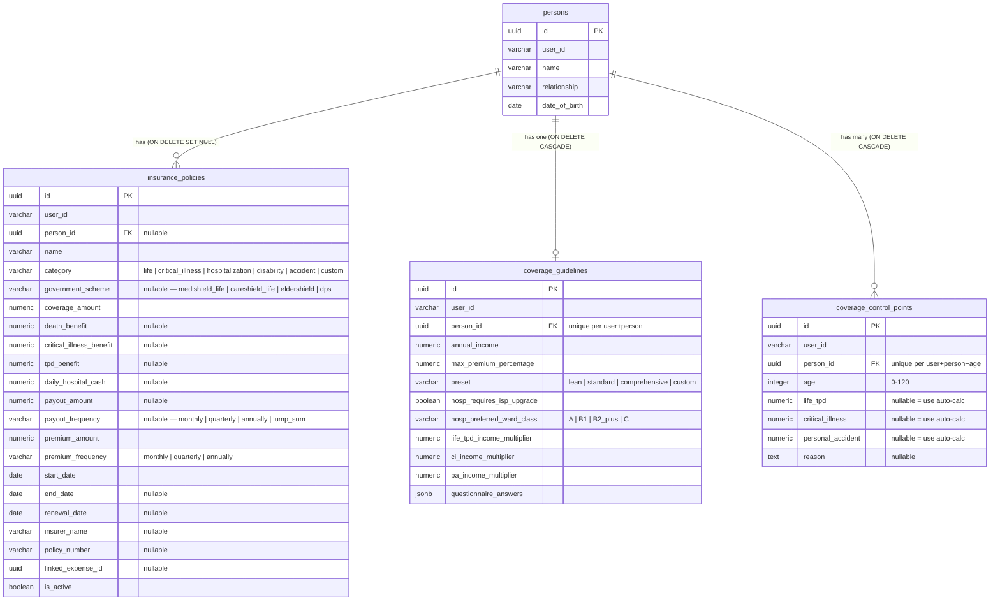
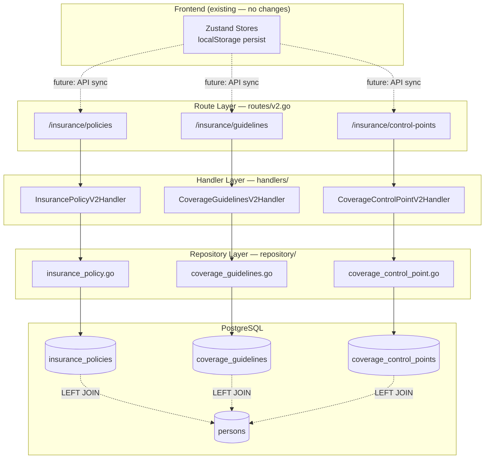
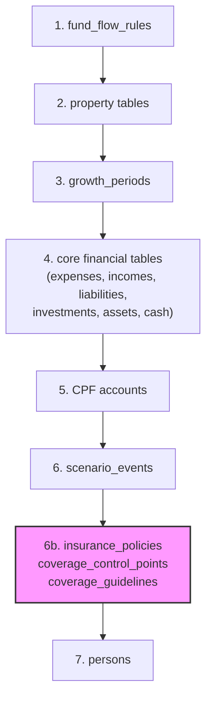
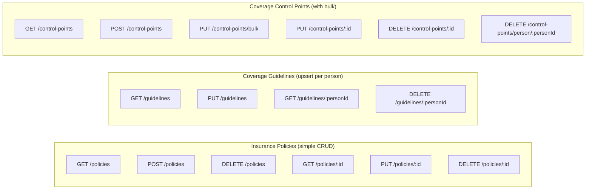

# Insurance Planner Backend Persistence — Implementation Plan

## Overview

Add backend CRUD APIs for three insurance data entities following established v2 patterns. Currently all insurance data lives in localStorage via Zustand `persist` middleware — this adds server-side persistence.

---

## Architecture Context

### Entity Relationship Diagram



### Backend Layer Architecture



### Delete Ordering in ResetAllUserData



### API Routes Overview



---

## Files to Create (12 new files)

### 1. Database Migrations (6 files)

#### `backend/migrations/202602070001_insurance_policies.up.sql`
```sql
CREATE TABLE insurance_policies (
    id uuid DEFAULT gen_random_uuid() NOT NULL PRIMARY KEY,
    user_id varchar(36) NOT NULL,
    person_id uuid REFERENCES persons(id) ON DELETE SET NULL,
    name varchar(200) NOT NULL,
    category varchar(30) NOT NULL
        CHECK (category IN ('life','critical_illness','hospitalization','disability','accident','custom')),
    subcategory varchar(50),
    government_scheme varchar(30)
        CHECK (government_scheme IN ('medishield_life','careshield_life','eldershield','dps')),
    coverage_amount numeric(15,2) DEFAULT 0 NOT NULL,
    death_benefit numeric(15,2),
    critical_illness_benefit numeric(15,2),
    tpd_benefit numeric(15,2),
    daily_hospital_cash numeric(15,2),
    payout_amount numeric(15,2),
    payout_frequency varchar(20)
        CHECK (payout_frequency IN ('monthly','quarterly','annually','lump_sum')),
    premium_amount numeric(15,2) DEFAULT 0 NOT NULL,
    premium_frequency varchar(20) DEFAULT 'annually' NOT NULL
        CHECK (premium_frequency IN ('monthly','quarterly','annually')),
    start_date date NOT NULL,
    end_date date,
    renewal_date date,
    insurer_name varchar(200),
    policy_number varchar(100),
    linked_expense_id uuid,
    is_active boolean DEFAULT true NOT NULL,
    notes text,
    created_at timestamptz DEFAULT now() NOT NULL,
    updated_at timestamptz DEFAULT now() NOT NULL
);
CREATE INDEX idx_insurance_policies_user ON insurance_policies(user_id);
CREATE INDEX idx_insurance_policies_person ON insurance_policies(person_id) WHERE person_id IS NOT NULL;
CREATE INDEX idx_insurance_policies_category ON insurance_policies(user_id, category);
```

#### `backend/migrations/202602070001_insurance_policies.down.sql`
```sql
DROP TABLE IF EXISTS insurance_policies;
```

#### `backend/migrations/202602070002_coverage_guidelines.up.sql`
```sql
CREATE TABLE coverage_guidelines (
    id uuid DEFAULT gen_random_uuid() NOT NULL PRIMARY KEY,
    user_id varchar(36) NOT NULL,
    person_id uuid NOT NULL REFERENCES persons(id) ON DELETE CASCADE,
    annual_income numeric(15,2) DEFAULT 60000 NOT NULL,
    max_premium_percentage numeric(6,4) DEFAULT 0.10 NOT NULL,
    preset varchar(20) DEFAULT 'standard' NOT NULL
        CHECK (preset IN ('lean','standard','comprehensive','custom')),
    hosp_requires_isp_upgrade boolean DEFAULT true NOT NULL,
    hosp_preferred_ward_class varchar(10) DEFAULT 'B1' NOT NULL
        CHECK (hosp_preferred_ward_class IN ('A','B1','B2_plus','C')),
    hosp_recommends_rider boolean DEFAULT true NOT NULL,
    hosp_is_enabled boolean DEFAULT true NOT NULL,
    hosp_notes text,
    life_tpd_income_multiplier numeric(6,2) DEFAULT 10 NOT NULL,
    life_tpd_is_required boolean DEFAULT true NOT NULL,
    life_tpd_is_enabled boolean DEFAULT true NOT NULL,
    life_tpd_notes text,
    ci_income_multiplier numeric(6,2) DEFAULT 5 NOT NULL,
    ci_is_required boolean DEFAULT true NOT NULL,
    ci_is_enabled boolean DEFAULT true NOT NULL,
    ci_notes text,
    pa_income_multiplier numeric(6,2) DEFAULT 5 NOT NULL,
    pa_is_required boolean DEFAULT true NOT NULL,
    pa_is_enabled boolean DEFAULT true NOT NULL,
    pa_notes text,
    questionnaire_answers jsonb DEFAULT '{}'::jsonb NOT NULL,
    -- See "Questionnaire Answers Schema" section below for JSONB structure
    created_at timestamptz DEFAULT now() NOT NULL,
    updated_at timestamptz DEFAULT now() NOT NULL,
    UNIQUE (user_id, person_id)
);
CREATE INDEX idx_coverage_guidelines_user ON coverage_guidelines(user_id);
CREATE INDEX idx_coverage_guidelines_person ON coverage_guidelines(person_id);
```

#### `backend/migrations/202602070002_coverage_guidelines.down.sql`
```sql
DROP TABLE IF EXISTS coverage_guidelines;
```

#### `backend/migrations/202602070003_coverage_control_points.up.sql`
```sql
CREATE TABLE coverage_control_points (
    id uuid DEFAULT gen_random_uuid() NOT NULL PRIMARY KEY,
    user_id varchar(36) NOT NULL,
    person_id uuid NOT NULL REFERENCES persons(id) ON DELETE CASCADE,
    age integer NOT NULL CHECK (age >= 0 AND age <= 120),
    life_tpd numeric(15,2),
    critical_illness numeric(15,2),
    personal_accident numeric(15,2),
    reason text,
    created_at timestamptz DEFAULT now() NOT NULL,
    updated_at timestamptz DEFAULT now() NOT NULL,
    UNIQUE (user_id, person_id, age)
);
CREATE INDEX idx_coverage_control_points_user ON coverage_control_points(user_id);
CREATE INDEX idx_coverage_control_points_person ON coverage_control_points(person_id);
```

#### `backend/migrations/202602070003_coverage_control_points.down.sql`
```sql
DROP TABLE IF EXISTS coverage_control_points;
```

#### Questionnaire Answers JSONB Schema

The `questionnaire_answers` column in `coverage_guidelines` stores a nested object with 5 sections. This drives the recommendation engine that auto-calculates coverage targets.

```json
{
  "hospitalization": {
    "hospitalPreference": "private | public | null",
    "preferenceReason": "doctor_choice | wait_time | cost | other",
    "willingToPayPremium": true,
    "comfortableWithWait": false
  },
  "lifeTpd": {
    "dependentPersonIds": ["uuid-1", "uuid-2"],
    "dependentCount": 2,
    "youngestDependentAge": 3,
    "yearsUntilIndependent": 18,
    "futureObligations": 100000,
    "spousePersonId": "uuid-3"
  },
  "criticalIllness": {
    "emergencyFundMonths": 6,
    "expectedRecoveryMonths": 12,
    "hasFamilySupport": true,
    "monthlyExpenses": 3500,
    "existingCiCoverage": 50000
  },
  "personalAccident": {
    "occupationRisk": "low | medium | high",
    "activeLifestyle": false,
    "commuteMethod": "public_transport | car | motorcycle | cycling | walking",
    "existingPaCoverage": 0
  },
  "selfInsurance": {
    "liquidNetWorth": 200000,
    "willingToSelfInsure": false,
    "selfInsuranceThreshold": 100000
  }
}
```

> **Derived at query time (not stored in JSONB):**
> - `mortgageBalance` — from `finance_liabilities` (category = mortgage) + property scenarios
> - `otherDebts` — from `finance_liabilities` (non-mortgage)
> - `existingAssets` — from `finance_assets` + `finance_investments`
> - `spouseHasIncome` / `spouseIncome` — from `finance_incomes` where `person_id = spousePersonId`
>
> These are computed by the frontend at recommendation time rather than duplicated in the questionnaire.

> **Note:** The `hospitalPreference` field captures `private | public` choice but the `hosp_preferred_ward_class` column only has public ward classes (`A`, `B1`, `B2_plus`, `C`). We may want to add a separate `hosp_hospital_preference` column or extend the ward class enum to handle this — flagging for review.

---

### 2. Repository Layer (3 files)

All files go under `backend/internal/financial_v2/repository/`.

#### `insurance_policy.go`

**Struct** — `InsurancePolicy` with fields matching the DB table, plus `PersonName string` (populated via LEFT JOIN).

**Methods on `*Store`:**
| Method | Signature | Notes |
|--------|-----------|-------|
| `ListInsurancePolicies` | `(ctx, userID, personID *string, pagination PaginationParams) → PaginatedResult[InsurancePolicy]` | LEFT JOIN persons for personName. Optional `personID` filter. |
| `GetInsurancePolicy` | `(ctx, userID, id string) → *InsurancePolicy, error` | Returns `ErrNotFound` if missing. |
| `CreateInsurancePolicy` | `(ctx, userID string, policy InsurancePolicy) → *InsurancePolicy, error` | `INSERT ... RETURNING *` pattern. |
| `UpdateInsurancePolicy` | `(ctx, userID, id string, policy InsurancePolicy) → *InsurancePolicy, error` | Full replacement PUT. Returns `ErrNotFound` if missing. |
| `DeleteInsurancePolicy` | `(ctx, userID, id string) → error` | Returns `ErrNotFound` if no rows affected. |
| `DeleteAllInsurancePolicies` | `(ctx, userID string) → int64, error` | Bulk delete for reset. |

#### `coverage_guidelines.go`

**Struct** — `CoverageGuidelines` with all DB columns + `PersonName string`.

**Methods on `*Store`:**
| Method | Signature | Notes |
|--------|-----------|-------|
| `ListCoverageGuidelines` | `(ctx, userID string) → []CoverageGuidelines, error` | Returns all guidelines for user, LEFT JOIN persons. |
| `GetCoverageGuidelines` | `(ctx, userID, personID string) → *CoverageGuidelines, error` | Gets by personID (unique per person). |
| `UpsertCoverageGuidelines` | `(ctx, userID string, g CoverageGuidelines) → *CoverageGuidelines, error` | `INSERT ... ON CONFLICT (user_id, person_id) DO UPDATE`. |
| `DeleteCoverageGuidelines` | `(ctx, userID, personID string) → error` | Deletes guidelines for a person. |

#### `coverage_control_point.go`

**Struct** — `CoverageControlPoint` with all DB columns + `PersonName string`.

**Methods on `*Store`:**
| Method | Signature | Notes |
|--------|-----------|-------|
| `ListCoverageControlPoints` | `(ctx, userID string, personID *string) → []CoverageControlPoint, error` | Optional personID filter. ORDER BY age ASC. |
| `CreateCoverageControlPoint` | `(ctx, userID string, point CoverageControlPoint) → *CoverageControlPoint, error` | Standard insert. |
| `UpdateCoverageControlPoint` | `(ctx, userID, id string, point CoverageControlPoint) → *CoverageControlPoint, error` | Full replacement. |
| `DeleteCoverageControlPoint` | `(ctx, userID, id string) → error` | Single delete. |
| `DeleteCoverageControlPointsByPerson` | `(ctx, userID, personID string) → int64, error` | Delete all for a person. |
| `BulkUpsertCoverageControlPoints` | `(ctx, userID, personID string, points []CoverageControlPoint) → []CoverageControlPoint, error` | Transaction: delete existing for person → insert all new points. |

---

### 3. Handler Layer (3 files)

All files go under `backend/cmd/server/handlers/`.

Each follows the `PersonV2Handler` pattern: struct with `*repo.Store`, constructor, methods with `requireUserID` + JSON decode + validation + repo call + `jsonResponse`.

#### `insurance_policies_v2.go`

**Input structs:**
- `insurancePolicyCreateInput` — JSON-friendly struct with string dates, all fields from the table
- `insurancePolicyUpdateInput` — same as create (full replacement)

**Handler methods:**
| Method | HTTP | Validation |
|--------|------|------------|
| `HandleList` | GET | Optional `?personId=` query param |
| `HandleCreate` | POST | Required: `name`, `category`, `premiumAmount`, `startDate` |
| `HandleGet` | GET `{id}` | — |
| `HandleUpdate` | PUT `{id}` | Same as create |
| `HandleDelete` | DELETE `{id}` | — |
| `HandleDeleteAll` | DELETE (collection) | — |

#### `coverage_guidelines_v2.go`

**Input struct:**
- `coverageGuidelinesInput` — all guideline fields, `personId` required

**Handler methods:**
| Method | HTTP | Validation |
|--------|------|------------|
| `HandleList` | GET | — |
| `HandleUpsert` | PUT | Required: `personId` |
| `HandleGet` | GET `{personId}` | — |
| `HandleDelete` | DELETE `{personId}` | — |

#### `coverage_control_points_v2.go`

**Input structs:**
- `controlPointCreateInput` — single point fields
- `controlPointBulkInput` — `personId` + `[]controlPointCreateInput`

**Handler methods:**
| Method | HTTP | Validation |
|--------|------|------------|
| `HandleList` | GET | Optional `?personId=` |
| `HandleCreate` | POST | Required: `personId`, `age` |
| `HandleUpdate` | PUT `{id}` | — |
| `HandleDelete` | DELETE `{id}` | — |
| `HandleBulkUpsert` | PUT `/bulk` | Required: `personId`, `points[]` |
| `HandleDeleteByPerson` | DELETE `/person/{personId}` | — |

---

## Files to Modify (2 existing files)

### 4. Route Registration — `backend/cmd/server/routes/v2.go`

Add to `RegisterV2Routes()` — 16 new route registrations under `/insurance/` prefix:

```
// Insurance policy endpoints
GET    /insurance/policies           → HandleList
POST   /insurance/policies           → HandleCreate
DELETE /insurance/policies           → HandleDeleteAll
GET    /insurance/policies/{id}      → HandleGet
PUT    /insurance/policies/{id}      → HandleUpdate
DELETE /insurance/policies/{id}      → HandleDelete

// Coverage guidelines endpoints
GET    /insurance/guidelines                → HandleList
PUT    /insurance/guidelines                → HandleUpsert
GET    /insurance/guidelines/{personId}     → HandleGet
DELETE /insurance/guidelines/{personId}     → HandleDelete

// Coverage control points endpoints
GET    /insurance/control-points                    → HandleList
POST   /insurance/control-points                    → HandleCreate
PUT    /insurance/control-points/bulk               → HandleBulkUpsert
PUT    /insurance/control-points/{id}               → HandleUpdate
DELETE /insurance/control-points/{id}               → HandleDelete
DELETE /insurance/control-points/person/{personId}  → HandleDeleteByPerson
```

Route registration follows the existing gorilla/mux `{id}` extraction + method switch pattern seen throughout v2.go.

### 5. ResetAllData — `backend/internal/financial_v2/repository/store.go`

Insert 3 new DELETE statements **before step 7 (persons deletion)**, after step 6 (scenario events). This is because:
- `coverage_guidelines` and `coverage_control_points` have `ON DELETE CASCADE` from persons, but we delete explicitly to avoid deadlocks (same rationale as existing code comments)
- `insurance_policies` has `ON DELETE SET NULL` for person_id, so we must delete before persons

```go
// 6b. Delete insurance-related tables (before persons, since policies ON DELETE SET NULL)
tag, err = tx.Exec(ctx, `DELETE FROM insurance_policies WHERE user_id = $1`, userID)
// ... error handling + totalAffected

tag, err = tx.Exec(ctx, `DELETE FROM coverage_control_points WHERE user_id = $1`, userID)
// ... error handling + totalAffected

tag, err = tx.Exec(ctx, `DELETE FROM coverage_guidelines WHERE user_id = $1`, userID)
// ... error handling + totalAffected
```

---

## What's NOT Included (Intentional)

- **No frontend API integration** — that's a follow-up task (Zustand stores keep working via localStorage)
- **No versioning/parent_id** — insurance policies are simple CRUD, not timeline-versioned
- **No scenario impact fields** — insurance isn't affected by the scenario event system
- **No `encoding/json` import in repo files** — only the `questionnaire_answers` field uses JSONB, handled by pgx natively via `json.RawMessage` or `[]byte`

---

## Verification Steps

After implementation:
1. `cd backend && go build ./...` — verify compilation
2. Run migrations against local DB
3. Test CRUD via curl:
   - Create policy → GET → Update → Delete
   - Upsert guidelines → GET by personId → Upsert again (updates, no duplicate)
   - Create control points → Bulk upsert → List by personId
4. Test `DELETE /api/v2/reset-all-data` clears insurance tables
