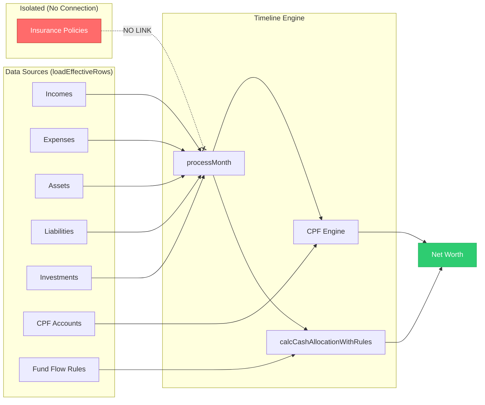
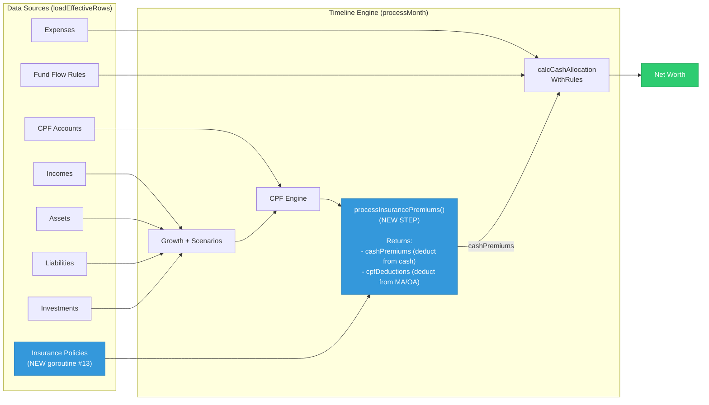
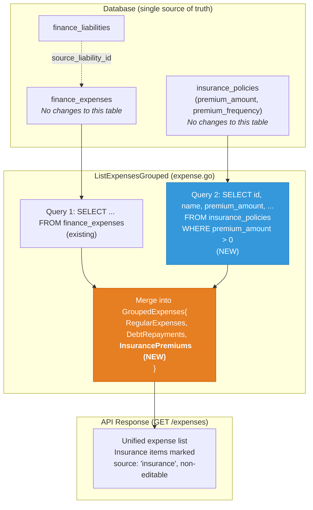
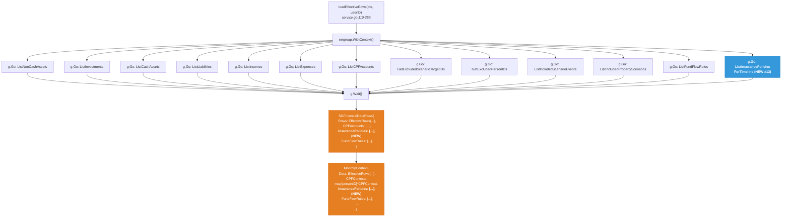
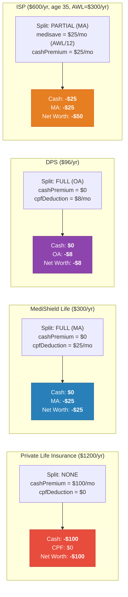
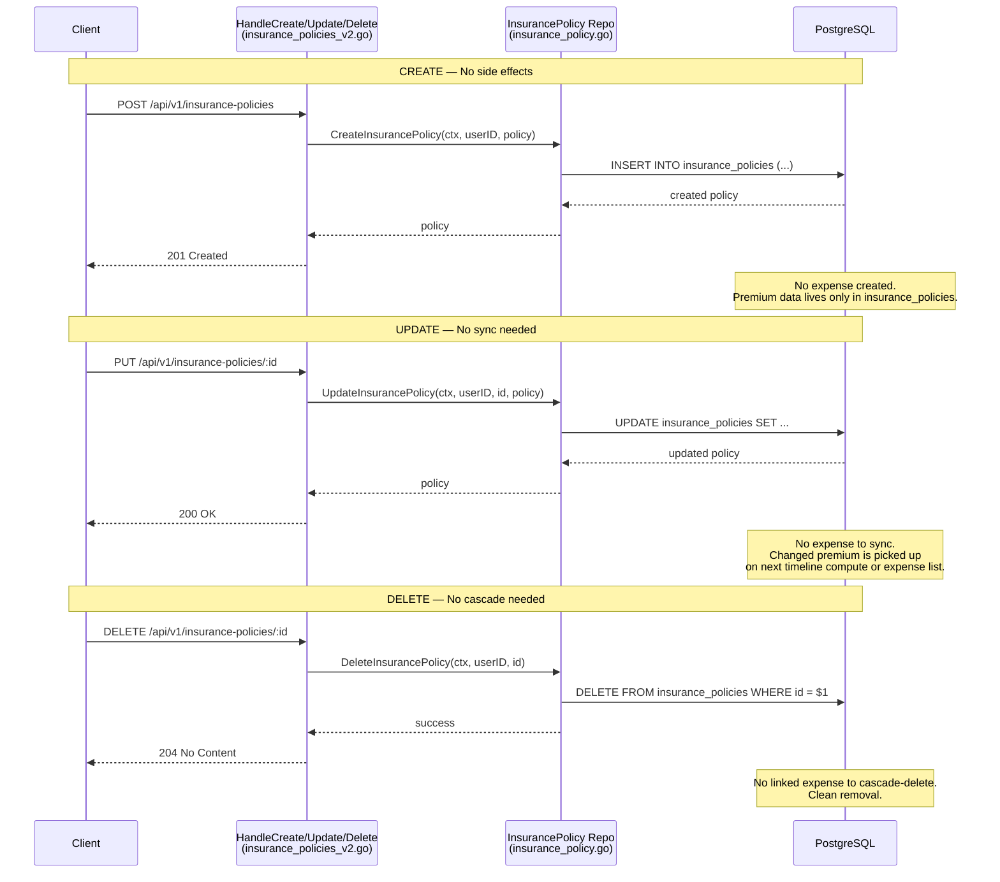
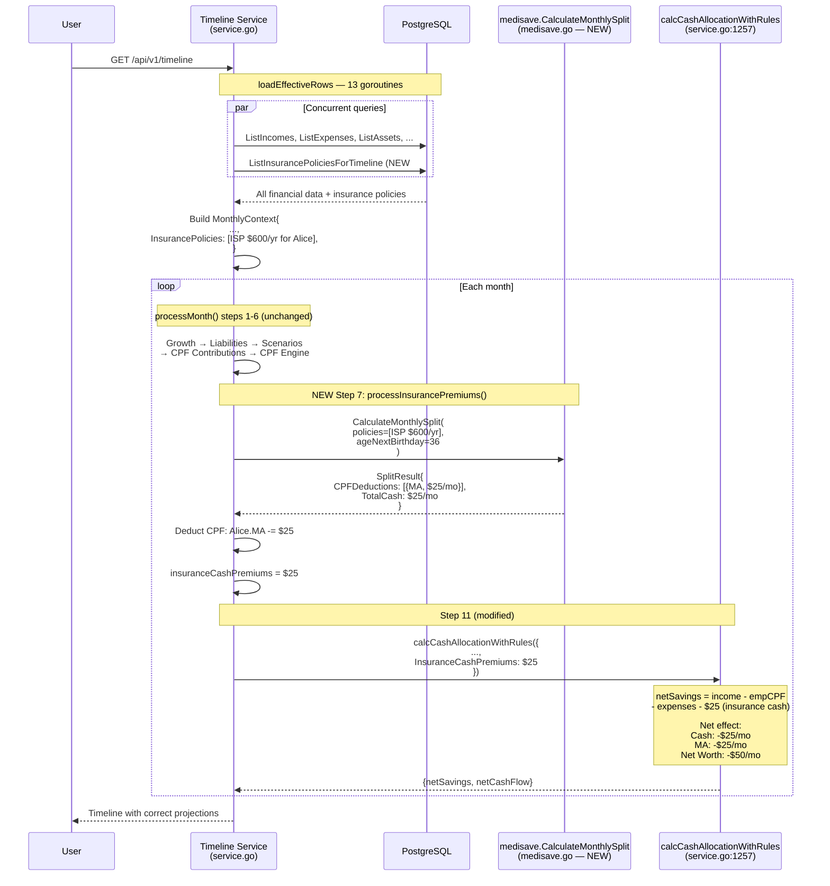

# Insurance Premium → Net Worth Integration (Cash + CPF)

> Implements **Phase B + Phase C** from `spec/medisave-integration-plan.md`:
> - Phase B: Government scheme auto-deduction from CPF
> - Phase C: Insurance in fund flow system, MediSave balance impact

## Context

Insurance premiums are invisible to the projection engine. The timeline service loads incomes, expenses, assets, liabilities, investments, CPF accounts, and fund flow rules — but **never** insurance policies. This means:

- **Cash-paid premiums** (life, CI, disability, accident) don't reduce cash flow or net worth
- **CPF-paid premiums** (MediShield Life, CareShield Life, DPS, ElderShield) don't reduce CPF MA/OA balances
- **ISP premiums** (hospitalization) don't split correctly between MediSave and cash

---

## Architecture Diagrams

### 1. Before vs After: System Architecture

**BEFORE** — Insurance policies are isolated from the projection engine:



**AFTER** — Single-track integration (no data duplication):



---

### 2. Expense Display — Application-Level Merge (No Data Duplication)

Insurance premiums are **not** stored as expense rows. Instead, they are queried from `insurance_policies` at read time and merged into the expense API response.



**Key principle:** No rows written to `finance_expenses`. The `insurance_policies` table is the single source of truth. Zero sync logic needed.

---

### 3. Timeline `processMonth` Pipeline (with new step)

```mermaid
graph TD
    START([processMonth called<br/><i>service.go:2230</i>]) --> RESET

    subgraph "Existing Steps (unchanged)"
        RESET["1. Reset CPF YTD<br/>(year boundaries)<br/><i>line 2232</i>"]
        GROW["2. Apply growth to all<br/>financial items<br/><i>lines 2235-2242</i>"]
        LIAB["3. Process liabilities<br/>(minimum payments)<br/><i>lines 2245-2251</i>"]
        SCEN["4. Apply scenario impacts<br/><i>line 2254</i>"]
        CPFC["5. Process CPF contributions<br/>(employer + employee)<br/><i>lines 2263-2266</i>"]
        CPFENG["6. CPF Engine<br/>(interest, RA, payouts)<br/><i>line 2270</i>"]
    end

    subgraph "NEW Step"
        INSPREM["<b>7. processInsurancePremiums()</b><br/><br/>For each person:<br/>1. Group their active policies<br/>2. CalculateMonthlySplit(policies, age)<br/>3. Deduct CPF portions from MA/OA<br/>4. Sum cash portions<br/><br/>Returns: totalCashPremiums"]
    end

    subgraph "Existing Steps (continued)"
        XFER["8. Execute transfer rules<br/>(Phase 3)<br/><i>lines 2278-2280</i>"]
        PAY["9. Execute payment rules<br/>(Phase 1)<br/><i>lines 2285-2288</i>"]
        EXPRULE["10. Execute expense rules<br/>(Phase 4)<br/><i>lines 2294-2297</i>"]
        CASH["11. calcCashAllocationWithRules<br/>(Phase 2)<br/><br/>netSavings = income - empCPF - expenses<br/><b>- insuranceCashPremiums (NEW)</b><br/><i>lines 1257-1299</i>"]
        RESP["12. Build MonthDetailResponse<br/><i>lines 2326-2334</i>"]
    end

    RESET --> GROW --> LIAB --> SCEN --> CPFC --> CPFENG --> INSPREM
    INSPREM -->|"totalCashPremiums"| XFER
    XFER --> PAY --> EXPRULE --> CASH --> RESP

    RESP --> END([return response])

    style INSPREM fill:#3498db,stroke:#2980b9,color:#fff
    style CASH fill:#e67e22,stroke:#d35400,color:#fff
```



**No offset/add-back needed.** Unlike the old plan that routed everything through expenses and had to "add back" the CPF portion, this approach computes cash and CPF portions separately. Each is deducted exactly once from the right account.

---

### 4. `loadEffectiveRows` — Data Loading (13 concurrent goroutines)



---

### 5. MediSave Split Decision Flowchart

```mermaid
flowchart TD
    START([For each policy<br/>in person's portfolio]) --> GOV{Has<br/>governmentScheme?}

    GOV -->|Yes| GOVTYPE{Which scheme?}
    GOV -->|No| HOSPCHECK{Category =<br/>'hospitalization'?}

    GOVTYPE -->|MediShield Life<br/>CareShield Life<br/>ElderShield| FULLMA["Payability: FULL<br/>Account: MA<br/><br/>Monthly CPF deduction =<br/>annualPremium / 12<br/><br/>Cash portion = $0"]

    GOVTYPE -->|DPS| FULLOA["Payability: FULL<br/>Account: OA<br/><br/>Monthly CPF deduction =<br/>annualPremium / 12<br/><br/>Cash portion = $0"]

    HOSPCHECK -->|Yes (ISP)| PARTIAL["Payability: PARTIAL<br/>Account: MA (up to AWL)"]
    HOSPCHECK -->|No| PRIVATE["Payability: NONE<br/><br/>Cash portion = full premium<br/>CPF deduction = $0"]

    PARTIAL --> AWLCALC["Calculate AWL by age:<br/><br/>  age ≤ 40 → $300/yr<br/>  41-70  → $600/yr<br/>  ≥ 71   → $900/yr<br/><br/>monthlyAWL = annualAWL / 12"]

    AWLCALC --> AWLSHARE{"Multiple ISPs<br/>for same person?"}

    AWLSHARE -->|Yes| SPLIT["AWL shared proportionally:<br/><br/>policyShare = (thisPremium /<br/>totalISPPremiums) × monthlyAWL<br/><br/>medisave = min(monthlyPremium, share)"]
    AWLSHARE -->|No| SINGLE["Full AWL for this ISP:<br/><br/>medisave = min(monthlyPremium,<br/>monthlyAWL)"]

    SPLIT --> CASHREM["cashPortion = monthlyPremium<br/>- medisavePortion"]
    SINGLE --> CASHREM

    FULLMA --> RESULT
    FULLOA --> RESULT
    PRIVATE --> RESULT
    CASHREM --> RESULT

    RESULT([SplitResult per person:<br/>CPFDeductions[] + TotalCPF + TotalCash])

    style FULLMA fill:#27ae60,stroke:#1e8449,color:#fff
    style FULLOA fill:#2980b9,stroke:#1f618d,color:#fff
    style PARTIAL fill:#e67e22,stroke:#d35400,color:#fff
    style PRIVATE fill:#95a5a6,stroke:#7f8c8d,color:#fff
```

---

### 6. Net Worth Impact — Worked Examples (monthly)

No double-counting, no offsets. Each premium is split once into cash + CPF, each deducted from the correct account.



---

### 7. Insurance Policy CRUD — No Side Effects

With the application-level merge approach, CRUD operations on insurance policies require **no changes**. There are no linked expenses to create, sync, or cascade-delete.



---

### 8. End-to-End: Timeline Projection Flow



---

## CPF-Insurance Reference

| Scheme | CPF Account | Stops At | Payability |
|--------|-------------|----------|------------|
| MediShield Life | MA | Never | `full` |
| CareShield Life | MA | Premiums stop at 67 | `full` |
| ElderShield | MA | Legacy, born <1980 | `full` |
| DPS | OA (SA fallback) | Age 65 | `full` |
| ISP (hospitalization) | MA (up to AWL) | — | `partial` |
| Private insurance | Cash only | — | `none` |

### AWL (Additional Withdrawal Limit) — shared per person per year

| Age Group | AWL |
|-----------|-----|
| ≤ 40 | $300 |
| 41–70 | $600 |
| ≥ 71 | $900 |

---

## Approach: Single-Track, No Data Duplication

### Key Design Decision

**Do NOT create linked expense rows** in `finance_expenses`. Instead:

1. **Expense display:** Query `insurance_policies` at read time and merge into `GroupedExpenses` response (application-level merge)
2. **Timeline projection:** Load insurance policies as a 13th goroutine, compute CPF/cash split directly in `processMonth()`

This avoids:
- Data duplication across two tables
- Sync logic on policy create/update/delete
- Backfill migrations
- The "offset hack" (add back CPF portion to cancel double-counted expense)

### Net effect per policy type

| Type | Cash Change | CPF Change | Net Worth Change |
|------|-------------|------------|-----------------|
| Private (cash-only) | −premium | 0 | −premium |
| Gov scheme (fully CPF) | 0 | −premium | −premium |
| ISP (mixed) | −cash portion | −MediSave portion | −premium |

---

## Implementation

### Part 1: MediSave Split Logic (Go port)

**New file:** `backend/internal/cpf/medisave/medisave.go`

Port from `frontend/src/lib/medisave-utils.ts`:

```go
package medisave

// GetAWL returns the Additional Withdrawal Limit based on age next birthday.
// ≤40: $300, 41-70: $600, ≥71: $900
func GetAWL(ageNextBirthday int) *decimal.Decimal

// Payability returns "full", "partial", or "none" for a policy.
func Payability(governmentScheme *string, category string) string

// CPFAccountForScheme returns "MA" or "OA" (DPS uses OA).
func CPFAccountForScheme(scheme string) string

// PolicyPremium is the minimal policy data needed for split calculation.
type PolicyPremium struct {
    ID               string
    PersonID         string
    Category         string
    GovernmentScheme *string
    PremiumAmount    decimal.Decimal
    PremiumFrequency string
    StartDate        time.Time
    EndDate          *time.Time
}

// SplitResult holds the per-person CPF/cash split.
type SplitResult struct {
    CPFDeductions []CPFDeduction
    TotalCPF      *decimal.Decimal
    TotalCash     *decimal.Decimal
}

type CPFDeduction struct {
    PolicyID   string
    Amount     *decimal.Decimal // Monthly CPF deduction amount
    CPFAccount string           // "MA" or "OA"
}

// CalculateMonthlySplit computes the CPF/cash split for one person's policies
// for a single month. AWL is annualized then divided by 12 for monthly processing.
func CalculateMonthlySplit(policies []PolicyPremium, ageNextBirthday int) SplitResult
```

Key logic (from `medisave-utils.ts:171-244`):
1. Government schemes → full CPF deduction (MA or OA for DPS)
2. ISPs (hospitalization, no gov scheme) → MediSave up to AWL (shared across ISPs)
3. Private → full cash, no CPF deduction
4. AWL is per-person per-year, shared across all ISPs

---

### Part 2: Timeline Integration

#### 2a. Load insurance policies in `loadEffectiveRows`

**File:** `backend/internal/financial_v2/timeline/service.go` (line ~216)

Add 13th goroutine alongside existing 12:

```go
var insurancePolicies []repo.InsurancePolicy

g.Go(func() error {
    var err error
    insurancePolicies, err = s.store.ListInsurancePoliciesForTimeline(gctx, userID)
    return err
})
```

#### 2b. Add to data structs

**File:** `backend/internal/financial_v2/timeline/service.go`

Add `InsurancePolicies` field to:

| Struct | Line | New Field |
|--------|------|-----------|
| `SGFinancialDataRows` | 72 | `InsurancePolicies []repo.InsurancePolicy` |
| `MonthlyContext` | 2118 | `InsurancePolicies []repo.InsurancePolicy` |

#### 2c. New repository query

**File:** `backend/internal/financial_v2/repository/insurance_policy.go`

```go
// ListInsurancePoliciesForTimeline returns active policies with premiums > 0
// for timeline projection. Lightweight query — only fields needed for split calculation.
func (s *Store) ListInsurancePoliciesForTimeline(
    ctx context.Context, userID string,
) ([]InsurancePolicy, error)
```

#### 2d. Process premiums in `processMonth`

**File:** `backend/internal/financial_v2/timeline/service.go` (after line 2270)

New step 7 — after CPF engine, before transfer rules:

```go
// Process insurance premium deductions (CPF + cash portions)
var insuranceCashPremiums *decimal.Decimal
if len(mctx.InsurancePolicies) > 0 && !isAnchorMonth {
    insuranceCashPremiums = processInsurancePremiums(
        mctx.InsurancePolicies, mctx.CPFContexts, currentDate,
    )
}
```

New function:

```go
func processInsurancePremiums(
    policies []repo.InsurancePolicy,
    cpfContexts map[string]*CPFContext,
    currentDate time.Time,
) *decimal.Decimal {
    totalCashPremiums := decimal.Zero()

    // Group policies by personID
    byPerson := groupPoliciesByPerson(policies)

    for personID, personPolicies := range byPerson {
        // Filter to policies active in this month
        activePolicies := filterActivePolicies(personPolicies, currentDate)
        if len(activePolicies) == 0 {
            continue
        }

        cpfCtx := cpfContexts[personID]
        ageNextBirthday := 0
        if cpfCtx != nil {
            ageNextBirthday = cpfCtx.State.AgeAt(currentDate) + 1
        }

        split := medisave.CalculateMonthlySplit(activePolicies, ageNextBirthday)

        // Apply CPF deductions to MA/OA
        if cpfCtx != nil {
            for _, deduction := range split.CPFDeductions {
                switch deduction.CPFAccount {
                case "MA":
                    cpfCtx.State.MA = cpfCtx.State.MA.Sub(deduction.Amount)
                case "OA":
                    cpfCtx.State.OA = cpfCtx.State.OA.Sub(deduction.Amount)
                }
            }
        }

        totalCashPremiums = totalCashPremiums.Add(split.TotalCash)
    }

    return totalCashPremiums
}
```

#### 2e. Subtract cash premiums in `calcCashAllocationWithRules`

**File:** `backend/internal/financial_v2/timeline/service.go` (line 1284)

Add `InsuranceCashPremiums` to `CashAllocationParams` and subtract from net savings:

```go
type CashAllocationParams struct {
    Data                   EffectiveRows
    AccountBalances        map[string]*decimal.Decimal
    CurrentDate            time.Time
    EmployeeCPF            *decimal.Decimal
    FundFlowRules          []repo.FundFlowRule
    ApplyAllocations       bool
    InsuranceCashPremiums  *decimal.Decimal  // NEW
}

// In calcCashAllocationWithRules, line 1284:
netSavings = income.Sub(params.EmployeeCPF).Sub(expense)
if params.InsuranceCashPremiums != nil {
    netSavings = netSavings.Sub(params.InsuranceCashPremiums)
}
```

#### 2f. Include in timeline response

**File:** `backend/internal/financial_v2/timeline/types.go` (line 121)

Add to `MonthDetailResponse`:

```go
InsurancePremiums       decimal.Decimal               `json:"insurancePremiums"`       // Total insurance cost this month
InsuranceCPFDeductions  []InsuranceCPFDeductionDetail  `json:"insuranceCPFDeductions"`  // Per-policy CPF breakdown
```

```go
type InsuranceCPFDeductionDetail struct {
    PolicyName string          `json:"policyName"`
    Amount     decimal.Decimal `json:"amount"`
    CPFAccount string          `json:"cpfAccount"` // "MA" or "OA"
    PersonName string          `json:"personName"`
}
```

---

### Part 3: Expense API — Application-Level Merge

#### 3a. Update `GroupedExpenses` struct

**File:** `backend/internal/financial_v2/repository/expense.go` (line 14)

```go
type GroupedExpenses struct {
    RegularExpenses   []Expense                `json:"regularExpenses"`
    DebtRepayments    []Expense                `json:"debtRepayments"`
    InsurancePremiums []InsurancePremiumExpense `json:"insurancePremiums"` // NEW
    Count             int                      `json:"count"`
    Limit             *int                     `json:"limit"`
    Offset            *int                     `json:"offset"`
}

// InsurancePremiumExpense represents an insurance premium displayed in the expense list.
// Read from insurance_policies table, not finance_expenses. Non-editable.
type InsurancePremiumExpense struct {
    PolicyID         string          `json:"policyId"`
    PolicyName       string          `json:"policyName"`
    PremiumAmount    decimal.Decimal `json:"premiumAmount"`
    PremiumFrequency string          `json:"premiumFrequency"`
    Category         string          `json:"category"`
    StartDate        time.Time       `json:"startDate"`
    EndDate          *time.Time      `json:"endDate,omitempty"`
    PersonName       string          `json:"personName,omitempty"`
}
```

#### 3b. Update `ListExpensesGrouped` to merge insurance premiums

**File:** `backend/internal/financial_v2/repository/expense.go` (line 22)

```go
func (s *Store) ListExpensesGrouped(
    ctx context.Context,
    userID string,
    pagination PaginationParams,
) (GroupedExpenses, error) {
    // Existing: query finance_expenses
    result, err := s.ListExpenses(ctx, ListQuery{...})
    if err != nil { return GroupedExpenses{}, err }

    // NEW: query insurance policies with premiums > 0
    insurancePremiums, err := s.ListInsurancePremiumsAsExpenses(ctx, userID)
    if err != nil { return GroupedExpenses{}, err }

    // ... existing grouping logic ...

    return GroupedExpenses{
        RegularExpenses:   regularExpenses,
        DebtRepayments:    debtRepayments,
        InsurancePremiums: insurancePremiums,  // NEW
        Count:             result.Count,
        Limit:             result.Limit,
        Offset:            result.Offset,
    }, nil
}
```

#### 3c. New query on insurance_policies

**File:** `backend/internal/financial_v2/repository/insurance_policy.go`

```go
// ListInsurancePremiumsAsExpenses returns active policies with premiums
// formatted for display in the expense list. No data is written to finance_expenses.
func (s *Store) ListInsurancePremiumsAsExpenses(
    ctx context.Context, userID string,
) ([]InsurancePremiumExpense, error) {
    query := `
        SELECT ip.id, ip.name, ip.premium_amount, ip.premium_frequency,
               ip.category, ip.start_date, ip.end_date,
               COALESCE(p.name, '') as person_name
        FROM insurance_policies ip
        LEFT JOIN persons p ON ip.person_id = p.id
        WHERE ip.user_id = $1
          AND ip.premium_amount > 0
          AND ip.is_active = true
        ORDER BY ip.name`
    // ... scan into []InsurancePremiumExpense ...
}
```

---

### Part 4: Frontend Updates

#### 4a. Timeline response types

**File:** `frontend/src/types/timeline.ts`

Add to `MonthDetailResponseV2`:

```typescript
insurancePremiums: string       // Total insurance cost this month
insuranceCPFDeductions?: Array<{
    policyName: string
    amount: string
    cpfAccount: 'MA' | 'OA'
    personName: string
}>
```

#### 4b. Expense types

**File:** `frontend/src/types/` or inline

Add `InsurancePremiumExpense` type matching the backend struct. Frontend should render these as non-editable rows with an "Insurance" badge.

---

## Tables Affected

### Database Tables — NO CHANGES

| Table | Current Columns (relevant) | Change |
|-------|---------------------------|--------|
| `insurance_policies` | `id`, `user_id`, `person_id`, `name`, `category`, `government_scheme`, `premium_amount`, `premium_frequency`, `start_date`, `end_date`, `linked_expense_id`, `is_active` | **None.** Already has all fields needed. `linked_expense_id` remains unused (can be removed in a future cleanup migration). |
| `finance_expenses` | `id`, `user_id`, `name`, `amount`, `frequency`, `start_date`, `end_date`, `category`, `source_liability_id` | **None.** No new FK column. Insurance premiums are not stored here. |
| `finance_liabilities` | `id`, `user_id`, `name`, `minimum_payment` | **None.** Existing `source_liability_id` pattern unchanged. |

### Backend Files — Changes

| File | Change | Type |
|------|--------|------|
| `backend/internal/cpf/medisave/medisave.go` | MediSave split logic (port from TS) | **New file** |
| `backend/internal/financial_v2/timeline/service.go` | Add goroutine #13, `processInsurancePremiums()`, modify `calcCashAllocationWithRules` | **Modify** |
| `backend/internal/financial_v2/timeline/types.go` | Add fields to `MonthDetailResponse` | **Modify** |
| `backend/internal/financial_v2/repository/expense.go` | Add `InsurancePremiumExpense` struct, update `ListExpensesGrouped` | **Modify** |
| `backend/internal/financial_v2/repository/insurance_policy.go` | Add `ListInsurancePoliciesForTimeline`, `ListInsurancePremiumsAsExpenses` | **Modify** |

### Frontend Files — Changes

| File | Change | Type |
|------|--------|------|
| `frontend/src/types/timeline.ts` | Add `insurancePremiums`, `insuranceCPFDeductions` fields | **Modify** |

### Existing Structs Modified

| Struct | File:Line | New Field |
|--------|-----------|-----------|
| `SGFinancialDataRows` | `service.go:72` | `InsurancePolicies []repo.InsurancePolicy` |
| `MonthlyContext` | `service.go:2118` | `InsurancePolicies []repo.InsurancePolicy` |
| `CashAllocationParams` | `service.go:1237` | `InsuranceCashPremiums *decimal.Decimal` |
| `MonthDetailResponse` | `types.go:121` | `InsurancePremiums`, `InsuranceCPFDeductions` |
| `GroupedExpenses` | `expense.go:14` | `InsurancePremiums []InsurancePremiumExpense` |

### New Structs

| Struct | File | Purpose |
|--------|------|---------|
| `InsurancePremiumExpense` | `expense.go` | Expense-list representation of an insurance premium |
| `InsuranceCPFDeductionDetail` | `types.go` | Per-policy CPF deduction in timeline response |
| `PolicyPremium` | `medisave.go` | Minimal policy data for split calculation |
| `SplitResult` | `medisave.go` | CPF/cash split output |
| `CPFDeduction` | `medisave.go` | Single CPF deduction entry |

### Existing Code to Reuse

| What | Where | How |
|------|-------|-----|
| MediSave split logic | `frontend/src/lib/medisave-utils.ts` | Port to Go |
| CPFContext per-person map | `service.go:2123` | Use existing map to apply CPF deductions |
| `isActiveInMonth()` helper | `service.go` | Filter policies by active date range |
| `common.ToMonthlyAmount()` | `internal/financial_v2/common/` | Convert premium frequencies to monthly |
| CPFState account fields | `cpf/engine/state.go` | Direct MA/OA manipulation |

---

## What Was Removed (vs. Original Plan)

| Original Plan Part | Status | Reason |
|---|---|---|
| Migration 1a: `source_insurance_policy_id` FK on `finance_expenses` | **Removed** | No linked expenses — no FK needed |
| Migration 1b: Backfill existing policies | **Removed** | Nothing to backfill |
| Part 2: Expense struct + SQL changes | **Removed** | `finance_expenses` table untouched |
| Part 3a: Auto-create expense on policy create | **Removed** | No side effects on CRUD |
| Part 3b: Sync expense on policy update | **Removed** | No data to sync |
| Part 3c: CASCADE delete | **Removed** | No FK relationship |
| Part 5d: Cash offset "add back" hack | **Removed** | Direct split eliminates double-counting |

---

## Verification

| Test | What to verify |
|------|----------------|
| Unit: `medisave.CalculateMonthlySplit` | AWL sharing across ISPs, age thresholds, DPS → OA routing |
| Unit: `medisave.GetAWL` | Correct amounts at age boundaries (40, 41, 70, 71) |
| Unit: `medisave.Payability` | Government schemes → full, hospitalization → partial, others → none |
| Unit: `processInsurancePremiums` | Correct CPF deductions applied, correct cash total returned |
| Integration: timeline private policy | Private $100/mo → cash reduced by $100/mo, CPF unchanged |
| Integration: timeline gov scheme | MediShield $300/yr → MA reduced by $25/mo, cash unchanged |
| Integration: timeline ISP mixed | ISP $600/yr, age 35 (AWL=$300) → MA -$25/mo, cash -$25/mo |
| Integration: timeline AWL sharing | Two ISPs same person → AWL shared, MA deduction ≤ AWL/12 per month |
| Integration: timeline no CPF account | Policy with personID that has no CPF → full cash, no crash |
| API: expense list | `GET /expenses` returns `insurancePremiums[]` from insurance_policies table |
| API: expense list non-editable | Insurance premium entries cannot be edited/deleted via expense endpoints |
| Frontend: expense display | Insurance premiums visible with badge, non-editable |
