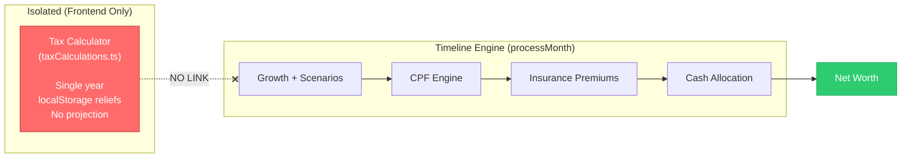
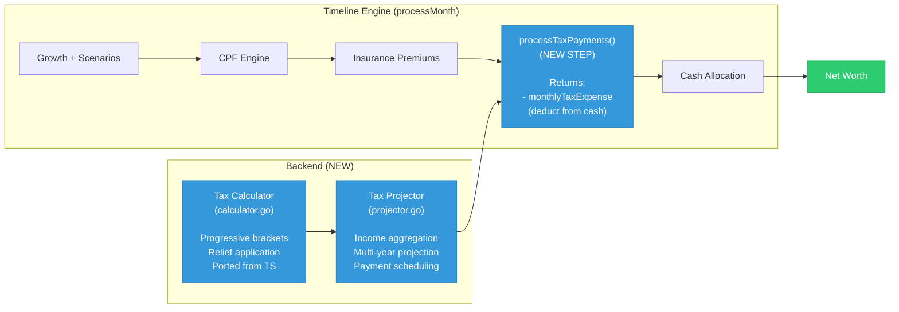
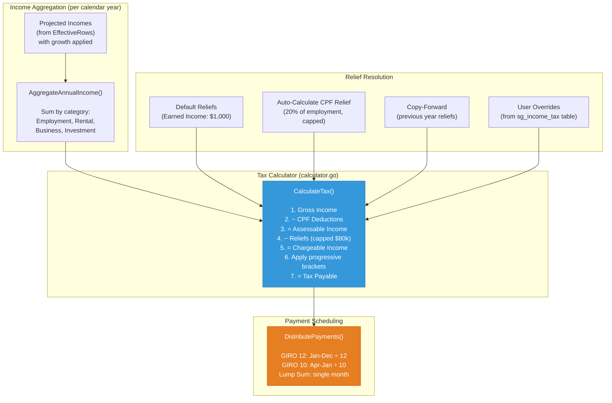
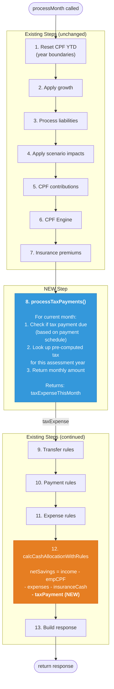
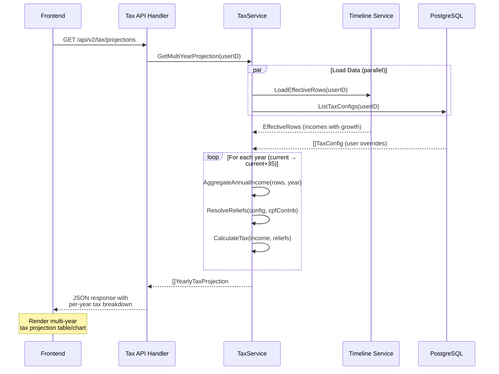
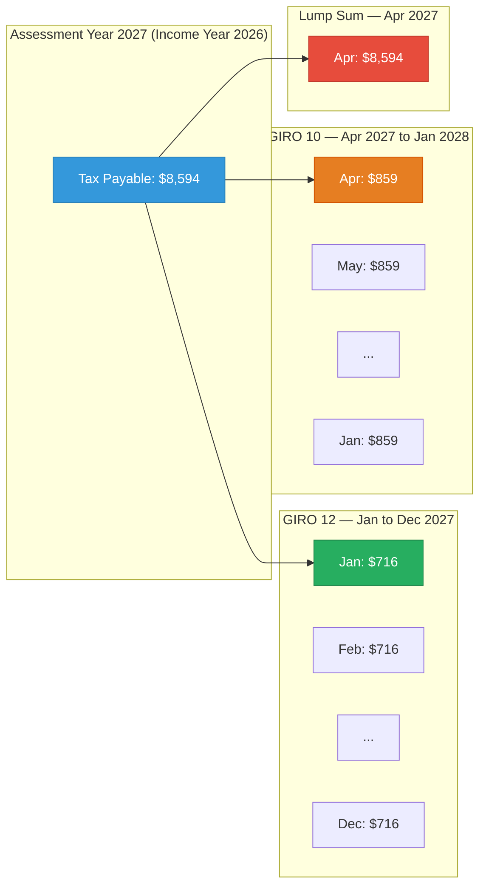

# SG Income Tax → Multi-Year Projection Engine

> Enables **multi-year income tax projections** integrated into the timeline engine.
> Tax estimates currently exist only as single-year frontend calculations — this spec connects them to the projection pipeline so tax liability is projected across years, deducted from cash flow, and reflected in net worth.

## Context

Tax estimation lives entirely on the frontend (`taxCalculations.ts`). The `TaxModePanel` calculates tax for one assessment year at a time using income from the API, reliefs from localStorage, and SG progressive brackets. Meanwhile, the timeline engine (`service.go`) runs a 35-year monthly projection loop covering income, expenses, assets, liabilities, CPF, insurance — but **never tax**. This means:

- **Tax liability** is invisible in net worth projections
- **Tax payments** don't reduce cash flow in the timeline
- **Income growth** in the projection engine isn't reflected in tax estimates
- **Scenario impacts** (job changes, marriage, children) don't auto-adjust tax reliefs
- **No year-to-year view** — users must manually switch assessment years to compare

---

## Architecture Diagrams

### 1. Before vs After: Tax in the Projection Pipeline

**BEFORE** — Tax is isolated from the projection engine:



**AFTER** — Tax integrated as a step in the monthly processing loop:



---

### 2. Tax Calculation Data Flow



---

### 3. Timeline `processMonth` Pipeline (with new tax step)



---

### 4. Multi-Year Projection API Response



---

### 5. Payment Schedule Distribution



---

## SG Progressive Tax Brackets (YA2024+)

| Chargeable Income | Rate | Cumulative Tax |
|-------------------|------|---------------|
| First $20,000 | 0% | $0 |
| Next $10,000 | 2% | $200 |
| Next $10,000 | 3.5% | $550 |
| Next $40,000 | 7% | $3,350 |
| Next $40,000 | 11.5% | $7,950 |
| Next $40,000 | 15% | $13,950 |
| Next $40,000 | 18% | $21,150 |
| Next $40,000 | 19% | $28,750 |
| Next $40,000 | 19.5% | $36,550 |
| Next $40,000 | 20% | $44,550 |
| Next $180,000 | 22% | $84,150 |
| Next $500,000 | 23% | $199,150 |
| Above $1,000,000 | 24% | — |

**Non-resident:** 24% flat rate on employment income (>60 days)

**Personal Relief Cap:** $80,000 total

---

## Implementation Phases

### Phase 1: Backend Tax Calculator (Port from Frontend)

**New package:** `backend/internal/financial_v2/tax/`

```
tax/
├── calculator.go    # Tax calculation engine (port from taxCalculations.ts)
├── projector.go     # Multi-year projection with income aggregation
├── types.go         # Go structs
└── calculator_test.go
```

**`types.go`**

```go
package tax

type TaxResidencyStatus string

const (
    Resident    TaxResidencyStatus = "resident"
    NonResident TaxResidencyStatus = "non_resident"
)

type ReliefSource string

const (
    SourceDefault  ReliefSource = "default"
    SourceUser     ReliefSource = "user"
    SourceScenario ReliefSource = "scenario"
    SourceAutoCPF  ReliefSource = "auto_cpf"
)

type ReliefEntry struct {
    Code          string          `json:"code"`
    Name          string          `json:"name"`
    Amount        decimal.Decimal `json:"amount"`
    MaxAmount     decimal.Decimal `json:"maxAmount"`
    Source        ReliefSource    `json:"source"`
    AutoCalculate bool            `json:"autoCalculate"`
    Enabled       bool            `json:"enabled"`
    ScenarioID    *string         `json:"scenarioId,omitempty"`
}

type AnnualIncome struct {
    Employment  decimal.Decimal `json:"employment"`
    Rental      decimal.Decimal `json:"rental"`
    Business    decimal.Decimal `json:"business"`
    Investment  decimal.Decimal `json:"investment"`
    Other       decimal.Decimal `json:"other"`
    TotalGross  decimal.Decimal `json:"totalGross"`
    CPFEmployee decimal.Decimal `json:"cpfEmployee"`
}

type TaxCalculationResult struct {
    GrossIncome      decimal.Decimal      `json:"grossIncome"`
    TotalDeductions  decimal.Decimal      `json:"totalDeductions"`
    AssessableIncome decimal.Decimal      `json:"assessableIncome"`
    TotalReliefs     decimal.Decimal      `json:"totalReliefs"`
    ChargeableIncome decimal.Decimal      `json:"chargeableIncome"`
    TaxPayable       decimal.Decimal      `json:"taxPayable"`
    EffectiveRate    decimal.Decimal      `json:"effectiveRate"`
    MarginalRate     decimal.Decimal      `json:"marginalRate"`
    Breakdown        []BracketBreakdown   `json:"breakdown"`
}

type BracketBreakdown struct {
    Bracket string          `json:"bracket"`
    Amount  decimal.Decimal `json:"amount"`
    Rate    decimal.Decimal `json:"rate"`
    Min     decimal.Decimal `json:"min"`
    Max     decimal.Decimal `json:"max"`
}

type YearlyTaxProjection struct {
    AssessmentYear   int                  `json:"assessmentYear"`
    IncomeYear       int                  `json:"incomeYear"`
    Income           AnnualIncome         `json:"income"`
    Reliefs          []ReliefEntry        `json:"reliefs"`
    Calculation      TaxCalculationResult `json:"calculation"`
    PaymentMethod    string               `json:"paymentMethod"`
    MonthlyPayment   decimal.Decimal      `json:"monthlyPayment,omitempty"`
    IsOverride       bool                 `json:"isOverride"`
    ResidencyStatus  TaxResidencyStatus   `json:"residencyStatus"`
}
```

**`calculator.go`** — Port from `frontend/src/lib/taxCalculations.ts`

```go
// CalculateTax computes SG income tax using progressive brackets.
// Ported from frontend/src/lib/taxCalculations.ts
func CalculateTax(
    grossIncome decimal.Decimal,
    cpfDeductions decimal.Decimal,
    reliefs []ReliefEntry,
    residencyStatus TaxResidencyStatus,
) (*TaxCalculationResult, error)

// CalculateProgressiveTax applies the YA2024+ bracket schedule.
func CalculateProgressiveTax(chargeableIncome decimal.Decimal) (decimal.Decimal, []BracketBreakdown)

// GetMarginalRate returns the marginal tax rate for a given chargeable income.
func GetMarginalRate(chargeableIncome decimal.Decimal, residency TaxResidencyStatus) decimal.Decimal

// GetDefaultReliefs returns the standard set of reliefs with defaults.
func GetDefaultReliefs(cpfContributions decimal.Decimal) []ReliefEntry
```

**Key logic to port:**
1. Progressive tax brackets (13 tiers, YA2024+)
2. Non-resident flat rate (24%)
3. Personal relief cap ($80,000)
4. CPF auto-calculation (20% of employment income, capped at $37,740)
5. Earned income relief ($1,000 default)

---

### Phase 2: Income Aggregation from Timeline

**`projector.go`** — Aggregate projected income per calendar year

```go
// AggregateAnnualIncome sums all income for a calendar year from EffectiveRows,
// applying growth rates to project future years.
func AggregateAnnualIncome(
    rows EffectiveRows,
    calendarYear int,
    growthRegistry *growth.Registry,
) (*AnnualIncome, error)

// ProjectMultiYear computes tax projections for all years in the projection horizon.
func (p *Projector) ProjectMultiYear(
    ctx context.Context,
    userID string,
    startYear int,
    endYear int,
) ([]YearlyTaxProjection, error)
```

**Income aggregation approach:**
- Reuse `EffectiveRows` from `loadEffectiveRows()` (same data the timeline uses)
- Apply the same growth strategies (`AnnualStep` for income)
- Sum monthly income × 12 (or actual months active) per calendar year
- Categorize by type: employment, rental, business, investment, other
- Calculate CPF contributions for auto-relief

---

### Phase 3: Multi-Year Projection API

**New endpoint:** `GET /api/v2/tax/projections`

**Handler:** `backend/cmd/server/handlers/tax.go`

```go
// HandleGetTaxProjections returns multi-year tax projections
// GET /api/v2/tax/projections?startYear=2026&years=10
func (h *TaxHandler) HandleGetTaxProjections(w http.ResponseWriter, r *http.Request)
```

**Response:**

```json
{
  "projections": [
    {
      "assessmentYear": 2027,
      "incomeYear": 2026,
      "income": {
        "employment": 120000,
        "rental": 24000,
        "totalGross": 144000,
        "cpfEmployee": 20400
      },
      "calculation": {
        "grossIncome": 144000,
        "totalDeductions": 20400,
        "assessableIncome": 123600,
        "totalReliefs": 22400,
        "chargeableIncome": 101200,
        "taxPayable": 6088,
        "effectiveRate": 4.23,
        "marginalRate": 11.5
      },
      "paymentMethod": "giro_12",
      "monthlyPayment": 507.33,
      "isOverride": false,
      "residencyStatus": "resident"
    },
    {
      "assessmentYear": 2028,
      "incomeYear": 2027,
      "income": {
        "employment": 126000,
        "totalGross": 150000
      },
      "calculation": {
        "taxPayable": 6838,
        "effectiveRate": 4.56,
        "marginalRate": 11.5
      }
    }
  ],
  "summary": {
    "totalTaxOverHorizon": 245000,
    "averageEffectiveRate": 5.2,
    "peakTaxYear": 2055,
    "peakTaxAmount": 12400
  }
}
```

**No database table needed at this stage** — this is a pure computation endpoint. User overrides come in Phase 6.

---

### Phase 4: Timeline Integration (Tax as Monthly Expense)

Follow the same pattern as insurance premium integration.

**Step 1:** Pre-compute tax for all years at the start of `computeSnapshotFromData()`

```go
// Before the monthly loop, compute tax for all projected years
taxProjections := preComputeTaxProjections(data, startYear, endYear)
taxSchedule := buildPaymentSchedule(taxProjections) // month → payment amount
```

**Step 2:** Add to `processMonth()` after insurance premiums (step 8)

```go
// Process tax payments for this month
var taxPaymentThisMonth *decimal.Decimal
if schedule, ok := taxSchedule[currentMonth]; ok {
    taxPaymentThisMonth = &schedule.Amount
}
```

**Step 3:** Subtract from cash in `calcCashAllocationWithRules`

```go
type CashAllocationParams struct {
    // ... existing fields ...
    InsuranceCashPremiums *decimal.Decimal
    TaxPayment           *decimal.Decimal  // NEW
}

// In calcCashAllocationWithRules:
netSavings = income.Sub(employeeCPF).Sub(expense)
if params.InsuranceCashPremiums != nil {
    netSavings = netSavings.Sub(params.InsuranceCashPremiums)
}
if params.TaxPayment != nil {
    netSavings = netSavings.Sub(params.TaxPayment)
}
```

**Step 4:** Add to `MonthDetailResponse`

```go
type MonthDetailResponse struct {
    // ... existing fields ...
    TaxPayment *TaxPaymentDetail `json:"taxPayment,omitempty"`
}

type TaxPaymentDetail struct {
    AssessmentYear int             `json:"assessmentYear"`
    Amount         decimal.Decimal `json:"amount"`
    PaymentMethod  string          `json:"paymentMethod"`
    PaymentNumber  int             `json:"paymentNumber"`  // e.g., 3 of 12
    TotalPayments  int             `json:"totalPayments"`  // e.g., 12
    AnnualTax      decimal.Decimal `json:"annualTax"`      // Full year tax
}
```

---

### Phase 5: Frontend — Multi-Year Tax View

**New component:** `frontend/src/components/dashboard/TaxProjection/`

```
TaxProjection/
├── index.tsx                 # Main container
├── TaxProjectionTable.tsx    # Year-by-year table
├── TaxProjectionChart.tsx    # Bar/line chart overlay
└── TaxYearDetail.tsx         # Expandable year detail
```

**5a. New hook:**

```typescript
// hooks/queries/useTaxProjectionsQuery.ts
export function useTaxProjectionsQuery(startYear?: number, years?: number) {
  return useQuery({
    queryKey: ['tax', 'projections', startYear, years],
    queryFn: () => financialApi.getTaxProjections({ startYear, years }),
    staleTime: 30_000,
  })
}
```

**5b. New API service method:**

```typescript
// services/financialApi.ts
getTaxProjections: async (params?: { startYear?: number; years?: number }) => {
  const searchParams = new URLSearchParams()
  if (params?.startYear) searchParams.set('startYear', String(params.startYear))
  if (params?.years) searchParams.set('years', String(params.years))
  return jsonRequest<TaxProjectionsResponse>(
    `${API_BASE}/tax/projections?${searchParams}`
  )
}
```

**5c. Table component** — Year-by-year projection:

| Year | Gross Income | Reliefs | Chargeable | Tax Payable | Eff. Rate | Payment |
|------|-------------|---------|------------|-------------|-----------|---------|
| YA2027 | $144,000 | ($22,400) | $101,200 | $6,088 | 4.23% | $507/mo |
| YA2028 | $150,000 | ($23,100) | $106,500 | $6,838 | 4.56% | $570/mo |
| YA2029 | $156,000 | ($23,800) | $111,800 | $7,607 | 4.88% | $634/mo |
| ... | ... | ... | ... | ... | ... | ... |

**5d. Chart overlay** — Optional bar chart on the net worth projection showing annual tax:

```typescript
// In ProjectionChartJS.tsx — add tax bars as secondary dataset
const taxDataset = {
  type: 'bar',
  label: 'Annual Tax',
  data: taxProjections.map(tp => ({
    x: tp.incomeYear - baseYear,
    y: tp.calculation.taxPayable,
  })),
  backgroundColor: 'rgba(244, 63, 94, 0.3)',  // rose-500/30
  borderColor: 'rgba(244, 63, 94, 0.6)',
  borderWidth: 1,
}
```

---

### Phase 6 (Future): Full Config, Overrides & Scenarios

**6a. Database table:** `sg_income_tax`

```sql
CREATE TABLE sg_income_tax (
  id uuid PRIMARY KEY DEFAULT gen_random_uuid(),
  user_id varchar(36) NOT NULL,
  parent_id uuid REFERENCES sg_income_tax(id) ON DELETE CASCADE,
  start_date timestamp with time zone DEFAULT now(),
  end_date timestamp with time zone,
  assessment_year int NOT NULL,
  residency_status text DEFAULT 'resident',
  reliefs jsonb NOT NULL DEFAULT '{}',
  payment_method text DEFAULT 'giro_12',
  lump_sum_month int,
  is_override boolean DEFAULT false,
  override_tax_payable numeric(15,4),
  created_at timestamp with time zone DEFAULT now(),
  updated_at timestamp with time zone DEFAULT now()
);
```

**6b. CRUD endpoints:**

```
GET    /api/v2/tax/config/{year}     # Get config for assessment year
POST   /api/v2/tax/config            # Create/update config
PUT    /api/v2/tax/config/{year}     # Update reliefs, payment method
DELETE /api/v2/tax/config/{year}     # Delete override (revert to auto)
```

**6c. Scenario-relief mapping:**

```go
var scenarioReliefMap = map[string][]string{
    "marriage":    {"spouse_relief"},
    "child":       {"child_relief", "working_mother_child"},
    "cpf_topup":   {"cpf_cash_topup"},
    "parent_care": {"parent_relief"},
}
```

**6d. Copy-forward logic:**

When accessing a future year without config, copy reliefs from most recent previous year. Auto-calculated reliefs (CPF) are recalculated for the new year's projected income.

**6e. Migrate from localStorage:**

Replace `useTaxReliefStorage` hook with API-backed queries. Remove localStorage persistence.

---

## Files Affected

### New Files

| File | Purpose |
|------|---------|
| `backend/internal/financial_v2/tax/types.go` | Go structs for tax calculation |
| `backend/internal/financial_v2/tax/calculator.go` | Tax engine (port from TS) |
| `backend/internal/financial_v2/tax/calculator_test.go` | Unit tests |
| `backend/internal/financial_v2/tax/projector.go` | Multi-year projection + income aggregation |
| `backend/cmd/server/handlers/tax.go` | API handler |
| `frontend/src/components/dashboard/TaxProjection/index.tsx` | Tax projection view |
| `frontend/src/components/dashboard/TaxProjection/TaxProjectionTable.tsx` | Year table |
| `frontend/src/hooks/queries/useTaxProjectionsQuery.ts` | React Query hook |

### Modified Files

| File | Change |
|------|--------|
| `backend/internal/financial_v2/timeline/service.go` | Add `processTaxPayments()` step, modify `calcCashAllocationWithRules` |
| `backend/internal/financial_v2/timeline/types.go` | Add `TaxPayment` to `MonthDetailResponse` |
| `backend/cmd/server/routes.go` | Register tax endpoints |
| `frontend/src/services/financialApi.ts` | Add `getTaxProjections()` method |
| `frontend/src/types/timeline.ts` | Add `taxPayment` field to response type |

### Existing Code to Reuse

| What | Where | How |
|------|-------|-----|
| Tax brackets + calculation | `frontend/src/lib/taxCalculations.ts` | Port to Go |
| Relief definitions | `frontend/src/lib/taxCalculations.ts` | Port relief catalog |
| Income loading | `timeline/service.go:loadEffectiveRows()` | Reuse for income aggregation |
| Growth strategies | `financial_v2/growth/` | Apply AnnualStep to project income |
| `CashAllocationParams` | `timeline/service.go` | Add TaxPayment field |
| Chart rendering | `ProjectionChartJS.tsx` | Add tax bar overlay dataset |
| `processMonth()` pipeline | `timeline/service.go` | Insert step after insurance |

---

## Verification

| Test | What to verify |
|------|----------------|
| Unit: `CalculateProgressiveTax` | All 13 bracket boundaries, edge cases at $0, $20k, $1M+ |
| Unit: `CalculateTax` (resident) | Full pipeline: gross → deductions → reliefs → chargeable → tax |
| Unit: `CalculateTax` (non-resident) | 24% flat rate applied correctly |
| Unit: `GetDefaultReliefs` | CPF auto-calculated, earned income $1,000, cap at $80k |
| Unit: `AggregateAnnualIncome` | Income summed correctly per year with growth |
| Unit: `DistributePayments` (GIRO 12) | Equal monthly payments Jan–Dec |
| Unit: `DistributePayments` (GIRO 10) | Equal monthly payments Apr–Jan |
| Unit: `DistributePayments` (lump sum) | Single payment in specified month |
| Integration: timeline with tax | Tax payments reduce cash flow, net worth lower |
| Integration: multi-year growth | Income growth → increasing tax over years |
| Integration: no income | Zero income → zero tax → no payments |
| API: `GET /tax/projections` | Returns projected tax for all years |
| Frontend: table rendering | All years displayed with correct formatting |
| Frontend: chart overlay | Tax bars visible on projection chart |

---

## Key Design Decisions

| Decision | Rationale |
|----------|-----------|
| **Port calculator to Go** (not call frontend) | Consistent with CPF engine pattern — backend is source of truth for projections |
| **No database table in Phase 1-5** | Pure computation endpoint avoids premature complexity. User overrides come in Phase 6 |
| **Pre-compute tax before monthly loop** | Tax is annual — computing once per year then distributing to months is more efficient than recalculating monthly |
| **Follow insurance premium pattern** | Same integration approach (new step in processMonth, subtract from cash allocation) — proven pattern |
| **GIRO 12 as default** | Most common Singapore payment method. User can change in Phase 6 |
| **Assessment Year = Income Year + 1** | Singapore convention: YA2027 covers income earned in calendar year 2026 |
