# PRD: AI Scenario Execution & Net Worth Analysis

## 1. Product Definition

### Executive Summary

Enable users to create, manage, and analyze financial scenarios through natural language conversation with AI. The AI will understand the user's existing financial data, create "what-if" scenarios, and explain their impact on net worth over time.

**Value Proposition:** Users can ask questions like "What if I buy a condo?" and get immediate, personalized analysis based on their actual financial data, with the ability to save scenarios for ongoing comparison.

### Problem Statement

**Current Pain Points:**
1. Users must manually create scenarios through UI forms - tedious for complex multi-impact scenarios
2. AI has no visibility into user's financial data - can't reference existing items or IDs
3. Net worth calculation is stubbed - returns fake data
4. No way to ask "what-if" questions and get personalized answers
5. AI doesn't know system limitations - may promise features that don't exist

### Success Criteria

- [ ] Users can create scenarios via chat (e.g., "Create a scenario for buying a car")
- [ ] AI correctly references existing assets/liabilities by name and ID
- [ ] Net worth calculations use real database values
- [ ] AI can compare scenario impact vs baseline
- [ ] AI gracefully handles unsupported requests
- [ ] Response formatting is concise and scannable

---

## 2. User Stories & Epics

### Epic 1: Financial Context Awareness
**As a user, I want the AI to know my financial situation so that it can give me personalized responses.**

#### User Stories:
- **US1.1**: As a user, I want the AI to see my assets/liabilities so that it can reference them by name
- **US1.2**: As a user, I want the AI to know my income/expenses so that it can calculate impacts accurately
- **US1.3**: As a user, I want the AI to see my existing scenarios so that it doesn't create duplicates

### Epic 2: Scenario Management via Chat
**As a user, I want to create and manage scenarios through conversation so that I don't have to use complex forms.**

#### User Stories:
- **US2.1**: As a user, I want to create a scenario by describing it (e.g., "What if I buy a car for $80k?")
- **US2.2**: As a user, I want to update an existing scenario through chat
- **US2.3**: As a user, I want to delete scenarios by name (e.g., "Remove the car scenario")
- **US2.4**: As a user, I want to enable/disable scenarios (e.g., "Turn off the job promotion scenario")
- **US2.5**: As a user, I want to list my scenarios (e.g., "What scenarios do I have?")

### Epic 3: Net Worth Analysis
**As a user, I want to understand my net worth trajectory so that I can make informed financial decisions.**

#### User Stories:
- **US3.1**: As a user, I want to ask "What's my net worth?" and get a real answer
- **US3.2**: As a user, I want to project my net worth at a future age (e.g., "Net worth at 65?")
- **US3.3**: As a user, I want to compare scenario impact (e.g., "How does buying a condo affect my net worth?")
- **US3.4**: As a user, I want to see what affects my net worth most

### Epic 4: AI Behavior & Guardrails
**As a user, I want clear, honest responses so that I understand what the system can and cannot do.**

#### User Stories:
- **US4.1**: As a user, I want the AI to admit when it can't help (e.g., tax calculations)
- **US4.2**: As a user, I want short, scannable responses instead of walls of text
- **US4.3**: As a user, I want the AI to ask follow-up questions one at a time
- **US4.4**: As a user, I want clear error messages when something fails

---

## 3. Technical Architecture

### System Overview

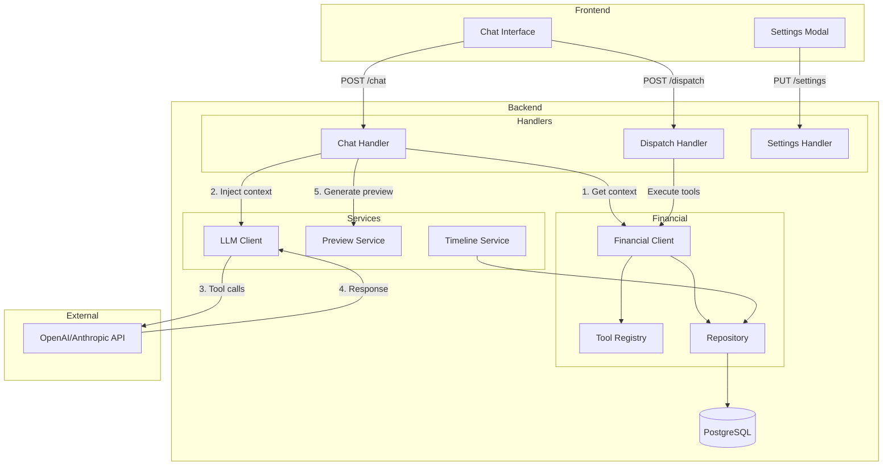

### Chat Flow with Context Injection

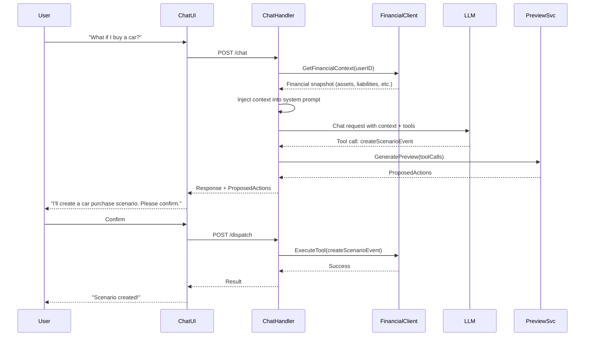

### Tool Registry Architecture

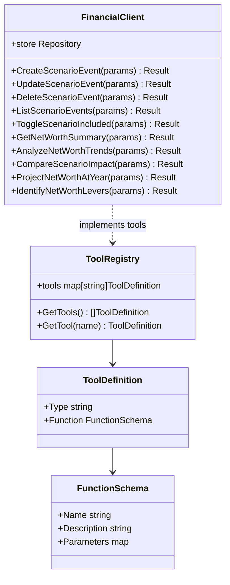

### Data Flow for Net Worth Analysis

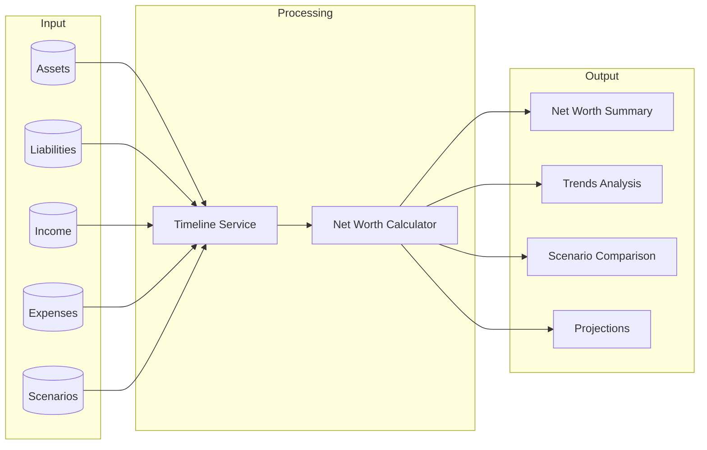

---

## 3.5 Prompt Pipeline Architecture

### Current State (Monolithic)

The current implementation has a simple, linear flow:

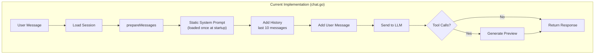

**Limitations:**
- System prompt is static (loaded once at startup)
- No dynamic context injection
- No branching logic
- Hard to add new prompt sections
- No middleware/interceptor pattern

### Proposed: Extensible Prompt Pipeline

```mermaid
flowchart TD
    subgraph Pipeline["Prompt Pipeline (Extensible)"]
        A[User Message] --> B[Pipeline Start]

        subgraph Enrichers["Context Enrichers (Parallel)"]
            E1[Financial Context]
            E2[User Settings]
            E3[Session State]
            E4[Feature Flags]
        end

        B --> Enrichers

        Enrichers --> C[Prompt Builder]

        subgraph Builder["Prompt Builder (Sequential)"]
            P1[Base System Prompt]
            P2[+ Capabilities Section]
            P3[+ Financial Snapshot]
            P4[+ Formatting Rules]
            P5[+ Error Handling]
        end

        C --> Builder

        Builder --> D{Intent Classifier}

        D -->|CRUD Request| T1[CRUD Tools Only]
        D -->|Analysis Request| T2[Analysis Tools Only]
        D -->|General Query| T3[All Tools]
        D -->|Unsupported| T4[No Tools - Explain Limitation]

        T1 & T2 & T3 & T4 --> E[LLM Request]

        E --> F[LLM Response]

        F --> G{Response Type}
        G -->|Tool Call| H[Validate & Preview]
        G -->|Text Only| I[Format Response]
        G -->|Error| J[Error Handler]

        H & I & J --> K[Return to User]
    end
```

### Detailed Pipeline Components

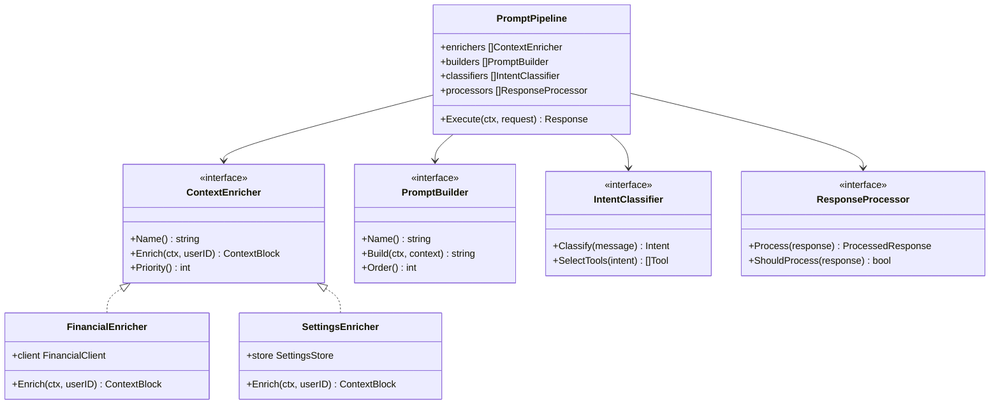

### Request Flow with Context Injection (Detailed)

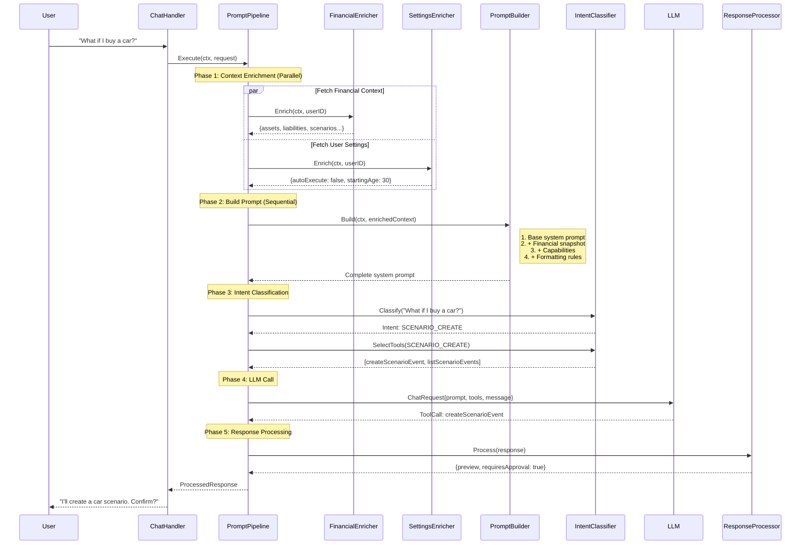

### Branching Logic for Different Intents

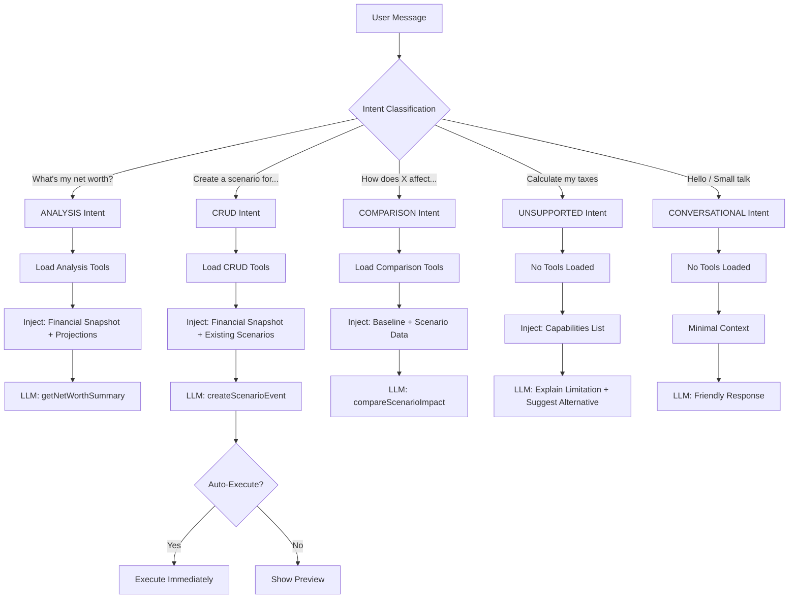

### Configuration-Driven Prompt Sections

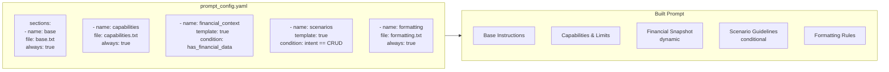

### Extensibility Points

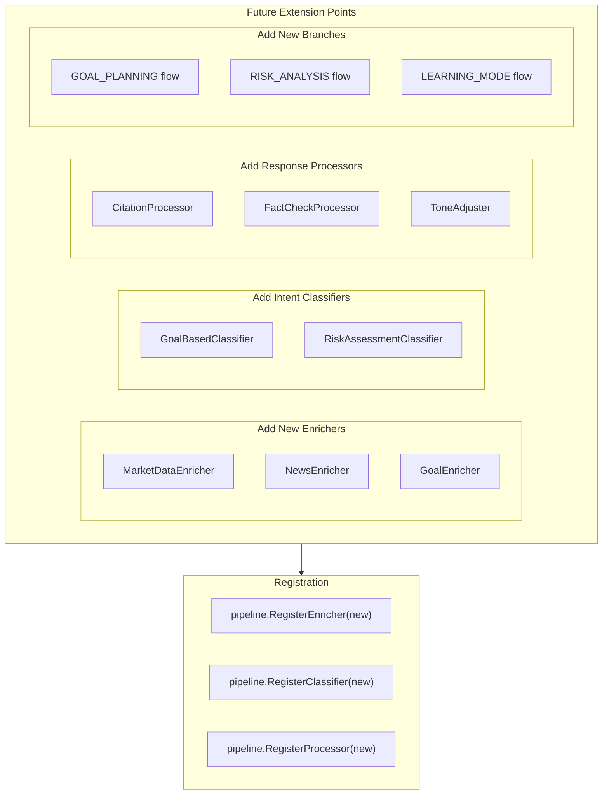

### Implementation Approach

**Option A: Minimal Change (Recommended for MVP)**
- Add `injectFinancialContext()` to existing `prepareMessages()`
- Keep linear flow, just add context block
- ~2 points of work

**Option B: Pipeline Refactor (Recommended for Extensibility)**
- Create `PromptPipeline` abstraction
- Implement `ContextEnricher` interface
- Add configuration-driven prompt building
- ~8 points of work, but highly extensible

```go
// Option A: Minimal (add to existing prepareMessages)
func (h *ChatHandler) prepareMessages(ctx context.Context, session *session.SessionState, userMessage string) []llm.ChatMessage {
    messages := []llm.ChatMessage{}

    // Build dynamic system prompt
    systemPrompt := h.systemPrompt

    // Inject financial context
    if ctx.Value("userID") != nil {
        financialContext, _ := h.financialClient.GetFinancialContext(ctx, userID)
        systemPrompt += "\n\n" + formatFinancialContext(financialContext)
    }

    messages = append(messages, llm.ChatMessage{Role: "system", Content: systemPrompt})
    // ... rest unchanged
}

// Option B: Pipeline (new abstraction)
type PromptPipeline struct {
    enrichers  []ContextEnricher
    builders   []PromptBuilder
    classifiers []IntentClassifier
}

func (p *PromptPipeline) Execute(ctx context.Context, req ChatRequest) (*ChatResponse, error) {
    // 1. Enrich context (parallel)
    context := p.enrichAll(ctx, req.UserID)

    // 2. Classify intent
    intent := p.classify(req.Message)

    // 3. Build prompt based on intent
    prompt := p.buildPrompt(context, intent)

    // 4. Select tools based on intent
    tools := p.selectTools(intent)

    // 5. Call LLM
    response := p.llm.Call(prompt, tools, req.Message)

    // 6. Process response
    return p.processResponse(response, intent)
}
```

---

## 4. API Contracts

### Financial Context Response

```json
// GET /api/v1/financial/context (internal use)
{
  "assets": [
    { "id": "uuid", "name": "HDB Flat", "currentValue": 650000, "category": "property_real_estate" }
  ],
  "liabilities": [
    { "id": "uuid", "name": "HDB Loan", "currentBalance": 350000, "category": "mortgage_home" }
  ],
  "income": [
    { "id": "uuid", "source": "Salary", "amount": 8000, "frequency": "monthly" }
  ],
  "expenses": [
    { "id": "uuid", "payee": "Mortgage", "amount": 2000, "frequency": "monthly" }
  ],
  "scenarios": [
    { "id": "uuid", "name": "Buy a Car", "occursOn": "2025-06-01", "isIncluded": true }
  ],
  "netWorth": {
    "current": 500000,
    "projectedYear10": 1200000
  }
}
```

### Tool Call Examples

**createScenarioEvent:**
```json
{
  "name": "createScenarioEvent",
  "arguments": {
    "name": "Buy a Car",
    "description": "Purchase a new car with financing",
    "occursOn": "2025-06-01",
    "displayIcon": "car",
    "isIncluded": true,
    "impacts": [
      {
        "targetType": "asset",
        "impactKind": "start",
        "amount": 80000,
        "cadence": "one_time",
        "startMonth": "2025-06-01",
        "notes": "Car value"
      },
      {
        "targetType": "liability",
        "impactKind": "start",
        "amount": 60000,
        "cadence": "one_time",
        "startMonth": "2025-06-01",
        "notes": "Car loan"
      }
    ]
  }
}
```

**getNetWorthSummary Response:**
```json
{
  "totalAssets": 850000,
  "totalLiabilities": 350000,
  "netWorth": 500000,
  "breakdown": {
    "assets": {
      "property_real_estate": 650000,
      "cpf_account": 120000,
      "cash_savings": 80000
    },
    "liabilities": {
      "mortgage_home": 350000
    }
  },
  "monthlyIncome": 8500,
  "monthlyExpenses": 4200,
  "monthlySavings": 4300,
  "savingsRate": 0.506
}
```

**compareScenarioImpact Response:**
```json
{
  "scenarioName": "Buy a Condo",
  "yearsCompared": 10,
  "baseline": {
    "netWorthYear10": 1200000
  },
  "withScenario": {
    "netWorthYear10": 950000
  },
  "difference": -250000,
  "summary": "Buying the condo would reduce your net worth by $250,000 over 10 years compared to your baseline trajectory."
}
```

---

## 5. Implementation Tickets

### Phase 0: Financial Context Injection

#### B0.1: Add GetFinancialContext to Financial Client
**Priority**: P0 | **Complexity**: 3 points | **Sprint**: 1

**Objective**: Create a method to fetch all user financial data for AI context injection.

**Requirements**:
- Add `GetFinancialContext(ctx, userID) (*FinancialContext, error)` to `client.go`
- Fetch assets, liabilities, income, expenses, scenarios in parallel
- Include current net worth (sum of assets - liabilities)
- Include projected net worth at year 10 from timeline

**API Contract**:
```go
type FinancialContext struct {
    Assets      []AssetSummary      `json:"assets"`
    Liabilities []LiabilitySummary  `json:"liabilities"`
    Income      []IncomeSummary     `json:"income"`
    Expenses    []ExpenseSummary    `json:"expenses"`
    Scenarios   []ScenarioSummary   `json:"scenarios"`
    NetWorth    NetWorthSummary     `json:"netWorth"`
}
```

**Files to modify**:
- `backend/internal/financial/client.go`
- `backend/internal/financial/types.go` (new types)

**Acceptance Criteria**:
- [ ] Returns all financial data for a user
- [ ] Calculates real net worth from DB
- [ ] Includes scenario list with included status
- [ ] Handles empty data gracefully
- [ ] Unit tests for context generation

---

#### B0.2: Inject Financial Context into Chat Handler
**Priority**: P0 | **Complexity**: 2 points | **Sprint**: 1

**Objective**: Inject user's financial context into the system prompt before LLM calls.

**Requirements**:
- Fetch financial context on each chat request
- Format as structured text block (see spec for format)
- Prepend to system prompt
- Handle missing/empty data gracefully

**Files to modify**:
- `backend/cmd/server/handlers/chat.go`

**Acceptance Criteria**:
- [ ] Financial context injected into every chat request
- [ ] Format matches spec (IDs visible, values formatted)
- [ ] Empty state handled ("No assets found")
- [ ] Does not break existing chat flow

---

#### B0.3: Update System Prompt with AI Guidelines
**Priority**: P0 | **Complexity**: 2 points | **Sprint**: 1

**Objective**: Add scenario guidance, capability boundaries, and formatting rules to system prompt.

**Requirements**:
- Add "Working with Scenarios" section
- Add "System Capabilities & Boundaries" section
- Add "Response Formatting" rules
- Add "Handling Errors" guidance

**Files to modify**:
- `backend/internal/llm/prompts/system_prompt.txt`

**Acceptance Criteria**:
- [ ] AI knows how to use scenario impact types (delta, override, start, stop)
- [ ] AI admits limitations honestly
- [ ] AI formats responses with short paragraphs and bullets
- [ ] AI asks one question at a time

---

### Phase 1: Foundation

#### B1.1: Add Auto-Execute User Setting
**Priority**: P1 | **Complexity**: 3 points | **Sprint**: 1

**Objective**: Add user setting to allow AI to execute actions without approval.

**Database Migration**:
```sql
-- 20241201001_add_ai_auto_execute.up.sql
ALTER TABLE user_settings
ADD COLUMN allow_ai_auto_execute BOOLEAN NOT NULL DEFAULT false;

-- 20241201001_add_ai_auto_execute.down.sql
ALTER TABLE user_settings DROP COLUMN allow_ai_auto_execute;
```

**Files to modify**:
- `backend/migrations/` - new migration
- `backend/internal/financial/repository/timeline.go` - add to UserSettings struct
- `backend/cmd/server/handlers/chat.go` - check setting before requiring approval

**Acceptance Criteria**:
- [ ] Migration runs successfully
- [ ] Setting defaults to false
- [ ] Chat handler respects setting
- [ ] Unit tests for setting behavior

---

#### F1.1: Add Auto-Execute Toggle to Settings UI
**Priority**: P1 | **Complexity**: 2 points | **Sprint**: 1

**Objective**: Add toggle in settings modal for AI auto-execute.

**Requirements**:
- Add toggle under "AI Settings" section
- Label: "Allow AI to execute without approval"
- Description: "When enabled, AI can create/modify financial data automatically"
- Default: off

**Files to modify**:
- `frontend/src/types/financial.ts` - add to UserSettings type
- `frontend/src/services/financialApi.ts` - include in API calls
- `frontend/src/components/modals/SettingsModal.tsx` - add toggle UI

**Acceptance Criteria**:
- [ ] Toggle appears in settings
- [ ] State persists after save
- [ ] Invalidates relevant queries on change

---

#### B1.2: Implement Real Net Worth Calculation
**Priority**: P1 | **Complexity**: 3 points | **Sprint**: 1

**Objective**: Replace stubbed net worth calculation with real DB queries.

**Requirements**:
- Sum all asset currentValue
- Sum all liability currentBalance
- Return assets - liabilities
- Cache result for performance (optional)

**Files to modify**:
- `backend/internal/financial/client.go` - implement CalculateNetWorth
- `backend/internal/financial/repository/store.go` - add aggregate queries if needed

**Acceptance Criteria**:
- [ ] Returns real sum from database
- [ ] Handles empty data (returns 0)
- [ ] Unit tests with test data

---

### Phase 2: Scenario CRUD Tools

#### B2.1: Add createScenarioEvent Tool
**Priority**: P1 | **Complexity**: 3 points | **Sprint**: 2

**Objective**: Add AI tool for creating scenarios with impacts.

**Tool Schema**:
```json
{
  "name": "createScenarioEvent",
  "description": "Create a financial scenario to model future events...",
  "parameters": {
    "type": "object",
    "properties": {
      "name": { "type": "string" },
      "occursOn": { "type": "string", "format": "date" },
      "impacts": { "type": "array" }
    },
    "required": ["name", "occursOn", "impacts"]
  }
}
```

**Files to modify**:
- `backend/internal/financial/tools.go` - add tool definition
- `backend/internal/financial/client.go` - add CreateScenarioEvent method
- `backend/internal/financial/preview.go` - add preview generation

**Acceptance Criteria**:
- [ ] Tool registered in registry
- [ ] Client method creates scenario via repository
- [ ] Preview shows friendly description
- [ ] Validation for required fields
- [ ] Unit tests

---

#### B2.2: Add updateScenarioEvent Tool
**Priority**: P1 | **Complexity**: 2 points | **Sprint**: 2

**Objective**: Add AI tool for updating existing scenarios.

**Files to modify**:
- `backend/internal/financial/tools.go`
- `backend/internal/financial/client.go`
- `backend/internal/financial/preview.go`

**Acceptance Criteria**:
- [ ] Can update by ID or name
- [ ] Partial updates supported
- [ ] Preview shows what will change
- [ ] Unit tests

---

#### B2.3: Add deleteScenarioEvent Tool
**Priority**: P1 | **Complexity**: 2 points | **Sprint**: 2

**Objective**: Add AI tool for deleting scenarios.

**Files to modify**:
- `backend/internal/financial/tools.go`
- `backend/internal/financial/client.go`
- `backend/internal/financial/preview.go`

**Acceptance Criteria**:
- [ ] Can delete by ID or name
- [ ] Preview shows scenario name being deleted
- [ ] Cascades to impacts
- [ ] Unit tests

---

#### B2.4: Add listScenarioEvents Tool
**Priority**: P1 | **Complexity**: 2 points | **Sprint**: 2

**Objective**: Add AI tool for listing scenarios with filters.

**Files to modify**:
- `backend/internal/financial/tools.go`
- `backend/internal/financial/client.go`

**Acceptance Criteria**:
- [ ] Supports year filter
- [ ] Supports includedOnly filter
- [ ] Returns formatted list for AI to present
- [ ] Unit tests

---

#### B2.5: Add toggleScenarioIncluded Tool
**Priority**: P1 | **Complexity**: 1 point | **Sprint**: 2

**Objective**: Add AI tool for enabling/disabling scenarios.

**Files to modify**:
- `backend/internal/financial/tools.go`
- `backend/internal/financial/client.go`
- `backend/internal/financial/preview.go`

**Acceptance Criteria**:
- [ ] Can toggle by ID or name
- [ ] Preview shows current vs new state
- [ ] Unit tests

---

### Phase 3: Net Worth Analysis Tools

#### B3.1: Add getNetWorthSummary Tool
**Priority**: P1 | **Complexity**: 3 points | **Sprint**: 3

**Objective**: Add AI tool to get current net worth breakdown.

**Response Format**:
```json
{
  "totalAssets": 850000,
  "totalLiabilities": 350000,
  "netWorth": 500000,
  "breakdown": { ... },
  "monthlyIncome": 8500,
  "monthlyExpenses": 4200,
  "savingsRate": 0.506
}
```

**Files to modify**:
- `backend/internal/financial/tools.go`
- `backend/internal/financial/client.go`

**Acceptance Criteria**:
- [ ] Returns real calculated values
- [ ] Supports includeScenarios param
- [ ] Supports asOfYear param
- [ ] Unit tests

---

#### B3.2: Add analyzeNetWorthTrends Tool
**Priority**: P2 | **Complexity**: 3 points | **Sprint**: 3

**Objective**: Add AI tool to analyze net worth growth trajectory.

**Response Format**:
```json
{
  "currentNetWorth": 500000,
  "projectedNetWorth": { "year5": 800000, "year10": 1200000, "year30": 3500000 },
  "annualGrowthRate": 0.08,
  "keyMilestones": [
    { "year": 7, "milestone": "First $1M" }
  ]
}
```

**Files to modify**:
- `backend/internal/financial/tools.go`
- `backend/internal/financial/client.go`

**Acceptance Criteria**:
- [ ] Uses timeline service for projections
- [ ] Identifies milestone years
- [ ] Calculates average growth rate
- [ ] Unit tests

---

#### B3.3: Add compareScenarioImpact Tool
**Priority**: P1 | **Complexity**: 3 points | **Sprint**: 3

**Objective**: Add AI tool to compare baseline vs scenario impact.

**Response Format**:
```json
{
  "scenarioName": "Buy a Condo",
  "baseline": { "netWorthYear10": 1200000 },
  "withScenario": { "netWorthYear10": 950000 },
  "difference": -250000,
  "summary": "Buying the condo would reduce your net worth by $250k over 10 years."
}
```

**Files to modify**:
- `backend/internal/financial/tools.go`
- `backend/internal/financial/client.go`

**Acceptance Criteria**:
- [ ] Can compare by scenario ID or name
- [ ] Returns summary-level output (not year-by-year)
- [ ] Uses timeline service with/without scenario
- [ ] Unit tests

---

#### B3.4: Add projectNetWorthAtYear Tool
**Priority**: P2 | **Complexity**: 2 points | **Sprint**: 3

**Objective**: Add AI tool to project net worth at specific year/age.

**Files to modify**:
- `backend/internal/financial/tools.go`
- `backend/internal/financial/client.go`

**Acceptance Criteria**:
- [ ] Supports targetYear (0-30)
- [ ] Supports targetAge (converts using startingAge)
- [ ] Supports includeScenarios
- [ ] Unit tests

---

#### B3.5: Add identifyNetWorthLevers Tool
**Priority**: P2 | **Complexity**: 3 points | **Sprint**: 3

**Objective**: Add AI tool to identify biggest impact items.

**Response Format**:
```json
{
  "topLevers": [
    { "type": "income", "name": "Salary", "impact": 96000, "description": "Annual income" },
    { "type": "expense", "name": "Mortgage", "impact": -24000, "description": "Annual expense" },
    { "type": "asset", "name": "HDB", "impact": 19500, "description": "3% annual growth" }
  ]
}
```

**Files to modify**:
- `backend/internal/financial/tools.go`
- `backend/internal/financial/client.go`

**Acceptance Criteria**:
- [ ] Ranks by annual impact on net worth
- [ ] Supports topN and category filters
- [ ] Returns actionable insights
- [ ] Unit tests

---

## 6. Success Metrics

### User Engagement
- % of users who use chat to create scenarios (target: 30%)
- Average scenarios created per user via chat (target: 2+)
- Chat session completion rate (target: 70%)

### Technical Performance
- Chat response time < 3s (p95)
- Net worth calculation time < 500ms
- Tool execution success rate > 95%

### Quality
- User satisfaction with AI responses (survey)
- Reduction in "I don't understand" follow-ups
- Accuracy of net worth calculations (100%)

---

## 7. Appendix

### System Prompt Additions

See sections in spec:
- [Enhanced System Prompt Additions](#enhanced-system-prompt-additions)
- [Unhappy Paths & System Limitations](#unhappy-paths--system-limitations)
- [Response Formatting Guidelines](#response-formatting-guidelines)

### Common Follow-up Scenarios

See section: [Common Follow-up Question Scenarios](#common-follow-up-question-scenarios)

### Ticket Summary

| Ticket | Description | Complexity | Sprint |
|--------|-------------|------------|--------|
| B0.1 | GetFinancialContext | 3 | 1 |
| B0.2 | Inject context into chat | 2 | 1 |
| B0.3 | Update system prompt | 2 | 1 |
| B1.1 | Auto-execute setting (backend) | 3 | 1 |
| F1.1 | Auto-execute toggle (frontend) | 2 | 1 |
| B1.2 | Real net worth calculation | 3 | 1 |
| B2.1 | createScenarioEvent tool | 3 | 2 |
| B2.2 | updateScenarioEvent tool | 2 | 2 |
| B2.3 | deleteScenarioEvent tool | 2 | 2 |
| B2.4 | listScenarioEvents tool | 2 | 2 |
| B2.5 | toggleScenarioIncluded tool | 1 | 2 |
| B3.1 | getNetWorthSummary tool | 3 | 3 |
| B3.2 | analyzeNetWorthTrends tool | 3 | 3 |
| B3.3 | compareScenarioImpact tool | 3 | 3 |
| B3.4 | projectNetWorthAtYear tool | 2 | 3 |
| B3.5 | identifyNetWorthLevers tool | 3 | 3 |

**Total: 39 points across 16 tickets**

### Sprint Planning

- **Sprint 1 (15 points)**: Foundation - context injection, settings, real net worth
- **Sprint 2 (10 points)**: Scenario CRUD tools
- **Sprint 3 (14 points)**: Net worth analysis tools

---

## 7.5 Handling "What If" Questions

### The Ambiguity Problem

When a user asks "What if I buy a car for $80k?", they might mean:

| Intent | What they want | AI Action |
|--------|----------------|-----------|
| **Hypothetical** | "Just tell me the impact" | Calculate & explain, no saved scenario |
| **Scenario Creation** | "Create a scenario I can toggle" | Create saved scenario + show impact |

### Recommended Approach: Clarify Intent

Add to system prompt:

```
## Handling "What If" Questions

When a user asks a "what if" question (e.g., "What if I buy a car?"):

1. **Default behavior**: Provide a quick hypothetical analysis WITHOUT creating a scenario
   - Calculate the impact on net worth
   - Show before/after comparison
   - At the end, offer to save: "Would you like me to save this as a scenario so you can compare it against other options?"

2. **Create scenario when**:
   - User explicitly asks: "Create a scenario for buying a car"
   - User confirms after hypothetical: "Yes, save that as a scenario"
   - User says: "Add this to my plan" or "I want to track this"

3. **Example flow**:

User: "What if I buy a car for $80k?"

AI: "Here's how an $80k car purchase would affect you:

**Impact on net worth:**
- Immediate: -$80,000 (if cash) or -$16,000 (if 20% down)
- Year 10: Net worth would be **$1.05M** vs **$1.2M** without

**Monthly cash flow:**
- Car payment: ~$1,200/month (if financed)
- Your savings rate drops from 50% → 35%

Would you like me to save this as a scenario so you can compare it with other options?"

User: "Yes, save it"

AI: "I'll create a 'Buy a Car' scenario for you."
[Creates scenario with impacts]
```

### Flow Diagram

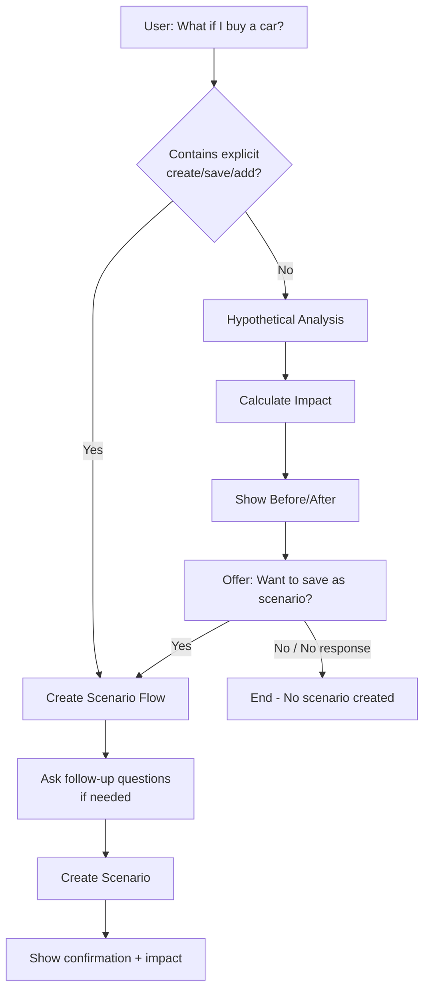

### Tool Selection Based on Intent

| User Message Pattern | Detected Intent | Tools Used |
|---------------------|-----------------|------------|
| "What if I buy..." | HYPOTHETICAL | `projectNetWorthAtYear` (read-only) |
| "Create a scenario for..." | SCENARIO_CREATE | `createScenarioEvent` |
| "Add a car purchase to my plan" | SCENARIO_CREATE | `createScenarioEvent` |
| "Compare buying vs renting" | COMPARISON | `compareScenarioImpact` |
| "Save that as a scenario" (after hypothetical) | SCENARIO_CREATE | `createScenarioEvent` |

### Implementation in System Prompt

```
## Intent Detection for "What If" Questions

Keyword patterns that indicate HYPOTHETICAL (don't create scenario):
- "What if..."
- "What would happen if..."
- "How would X affect..."
- "Show me the impact of..."

Keyword patterns that indicate SCENARIO_CREATE (create scenario):
- "Create a scenario..."
- "Add X to my plan..."
- "Save this as a scenario..."
- "I want to track..."
- "Model this for me..."

When in doubt, default to HYPOTHETICAL and offer to save afterward.
```

### Example Conversations

**Example 1: Pure Hypothetical**
```
User: "What if I increase my salary by 20%?"

AI: "A 20% salary increase would boost your finances significantly:

**Current salary**: $8,000/month
**New salary**: $9,600/month (+$1,600)

**Impact:**
- Annual savings increase: +$19,200
- Net worth at year 10: **$1.4M** (vs $1.2M now)
- You'd reach $1M net worth 2 years earlier

Would you like me to save this as a scenario?"

User: "No, just curious"

AI: "No problem! Let me know if you want to explore other scenarios."
```

**Example 2: Hypothetical → Saved**
```
User: "What if I buy a condo for $1.5M?"

AI: "Here's how a $1.5M condo purchase would affect you:
[... analysis ...]

Would you like me to save this as a scenario?"

User: "Yes please"

AI: "I'll create a 'Buy Condo' scenario.

When do you plan to purchase? (e.g., 2025-06-01)"

User: "June next year"

AI: "Got it. How much down payment?

Your current cash savings: $80,000
Typical down payment: 25% = $375,000"

User: "I'll put 25% down, borrowing from CPF too"

AI: [Creates scenario with impacts]
"Done! I've created the 'Buy Condo' scenario:
- Purchase: June 2025
- Down payment: $375,000
- Mortgage: $1,125,000

This scenario is now **enabled** in your timeline. You can toggle it off in the Scenarios panel to compare."
```

**Example 3: Direct Create**
```
User: "Create a scenario for my wife quitting her job"

AI: "I'll create an income change scenario.

What's the monthly income that would stop?"

User: "$5,000"

AI: "When would this take effect?"

User: "January 2026"

AI: [Creates scenario]
"Done! I've created 'Wife Quits Job' scenario:
- Income reduction: -$5,000/month
- Starts: January 2026

**Impact on your finances:**
- Monthly savings drop from $4,300 → -$700 (deficit)
- Net worth at year 10: **$650,000** (vs $1.2M baseline)

You may want to adjust expenses or explore other income sources to offset this."
```

---

## 8. Future Enhancement: Prompt Pipeline Refactor

### B-FUTURE-1: Refactor Chat Handler to Use Prompt Pipeline
**Priority**: P3 (Future) | **Complexity**: 8 points | **Sprint**: Backlog

**Objective**: Replace monolithic chat handler with extensible prompt pipeline architecture to support branching, multiple enrichers, and configuration-driven prompts.

**Background**:
The current chat handler has a linear flow that's hard to extend. As we add more features (goals, risk analysis, learning mode), we need a more flexible architecture.

**Requirements**:

1. **Create PromptPipeline abstraction**
```go
type PromptPipeline struct {
    enrichers   []ContextEnricher
    builders    []PromptBuilder
    classifiers []IntentClassifier
    processors  []ResponseProcessor
    llm         LLMClient
}

func (p *PromptPipeline) Execute(ctx context.Context, req ChatRequest) (*ChatResponse, error)
```

2. **Implement ContextEnricher interface**
```go
type ContextEnricher interface {
    Name() string
    Enrich(ctx context.Context, userID string) (ContextBlock, error)
    Priority() int  // Lower = runs first
}

// Initial enrichers:
// - FinancialEnricher (assets, liabilities, income, expenses, scenarios)
// - SettingsEnricher (user preferences, auto-execute flag)
// - SessionEnricher (conversation history, pending actions)
```

3. **Implement PromptBuilder interface**
```go
type PromptBuilder interface {
    Name() string
    Build(ctx context.Context, enrichedContext map[string]ContextBlock) string
    Order() int  // Lower = appears first in prompt
    Condition(intent Intent) bool  // Whether to include this section
}

// Initial builders:
// - BasePromptBuilder (core instructions)
// - CapabilitiesBuilder (what system can/cannot do)
// - FinancialContextBuilder (dynamic snapshot)
// - FormattingBuilder (response format rules)
// - ErrorHandlingBuilder (error response patterns)
```

4. **Implement IntentClassifier interface**
```go
type Intent string

const (
    IntentCRUD          Intent = "CRUD"
    IntentAnalysis      Intent = "ANALYSIS"
    IntentComparison    Intent = "COMPARISON"
    IntentUnsupported   Intent = "UNSUPPORTED"
    IntentConversational Intent = "CONVERSATIONAL"
)

type IntentClassifier interface {
    Classify(message string, context map[string]ContextBlock) Intent
    SelectTools(intent Intent) []ToolDefinition
}
```

5. **Implement ResponseProcessor interface**
```go
type ResponseProcessor interface {
    Name() string
    ShouldProcess(response *LLMResponse, intent Intent) bool
    Process(response *LLMResponse) (*ProcessedResponse, error)
}

// Initial processors:
// - ToolCallValidator (validate tool call parameters)
// - PreviewGenerator (generate action previews)
// - AutoExecutor (execute if setting enabled)
// - ErrorFormatter (format error responses)
```

6. **Add configuration file support**
```yaml
# prompts/pipeline_config.yaml
sections:
  - name: base
    file: base.txt
    always: true
    order: 1

  - name: capabilities
    file: capabilities.txt
    always: true
    order: 2

  - name: financial_context
    template: financial_snapshot.tmpl
    condition: has_financial_data
    order: 3

  - name: scenario_guidelines
    file: scenario_guidelines.txt
    condition: intent_is_crud
    order: 4

  - name: formatting
    file: formatting.txt
    always: true
    order: 5

intents:
  CRUD:
    tools: [createScenarioEvent, updateScenarioEvent, deleteScenarioEvent, listScenarioEvents, toggleScenarioIncluded]
  ANALYSIS:
    tools: [getNetWorthSummary, analyzeNetWorthTrends, projectNetWorthAtYear, identifyNetWorthLevers]
  COMPARISON:
    tools: [compareScenarioImpact]
  UNSUPPORTED:
    tools: []
  CONVERSATIONAL:
    tools: []
```

**Files to create**:
- `backend/internal/pipeline/pipeline.go` - Main pipeline orchestrator
- `backend/internal/pipeline/enricher.go` - ContextEnricher interface + implementations
- `backend/internal/pipeline/builder.go` - PromptBuilder interface + implementations
- `backend/internal/pipeline/classifier.go` - IntentClassifier interface + implementation
- `backend/internal/pipeline/processor.go` - ResponseProcessor interface + implementations
- `backend/internal/pipeline/config.go` - Configuration loading
- `backend/internal/llm/prompts/pipeline_config.yaml` - Pipeline configuration

**Files to modify**:
- `backend/cmd/server/handlers/chat.go` - Replace direct LLM calls with pipeline
- `backend/cmd/server/main.go` - Initialize pipeline with enrichers/builders

**Acceptance Criteria**:
- [ ] Pipeline produces identical output to current implementation (backward compatible)
- [ ] New enrichers can be added without modifying pipeline core
- [ ] New prompt sections can be added via config file
- [ ] Intent classification routes to correct tool sets
- [ ] Response processors can be chained
- [ ] Unit tests for each component
- [ ] Integration test for full pipeline flow

**Migration Strategy**:
1. Build pipeline alongside existing handler
2. Add feature flag to switch between old/new
3. Run both in parallel, compare outputs
4. Gradually migrate traffic to pipeline
5. Remove old handler once stable

**Benefits**:
- Easy to add new context sources (goals, market data, news)
- Easy to add new intents (goal planning, risk analysis)
- Configuration-driven prompt assembly
- Testable components in isolation
- Supports A/B testing of prompt variations

**Dependencies**:
- Requires B0.1-B0.3 (basic context injection) to be complete first
- Should be done after MVP is stable

---

### Updated Ticket Summary

| Ticket | Description | Complexity | Sprint | Status |
|--------|-------------|------------|--------|--------|
| B0.1 | GetFinancialContext | 3 | 1 | Todo |
| B0.2 | Inject context into chat | 2 | 1 | Todo |
| B0.3 | Update system prompt | 2 | 1 | Todo |
| B1.1 | Auto-execute setting (backend) | 3 | 1 | Todo |
| F1.1 | Auto-execute toggle (frontend) | 2 | 1 | Todo |
| B1.2 | Real net worth calculation | 3 | 1 | Todo |
| B2.1 | createScenarioEvent tool | 3 | 2 | Todo |
| B2.2 | updateScenarioEvent tool | 2 | 2 | Todo |
| B2.3 | deleteScenarioEvent tool | 2 | 2 | Todo |
| B2.4 | listScenarioEvents tool | 2 | 2 | Todo |
| B2.5 | toggleScenarioIncluded tool | 1 | 2 | Todo |
| B3.1 | getNetWorthSummary tool | 3 | 3 | Todo |
| B3.2 | analyzeNetWorthTrends tool | 3 | 3 | Todo |
| B3.3 | compareScenarioImpact tool | 3 | 3 | Todo |
| B3.4 | projectNetWorthAtYear tool | 2 | 3 | Todo |
| B3.5 | identifyNetWorthLevers tool | 3 | 3 | Todo |
| **B-FUTURE-1** | **Prompt Pipeline Refactor** | **8** | **Backlog** | **Future** |

**Total MVP: 39 points across 16 tickets**
**Total with Future: 47 points across 17 tickets**

---

## 9. Parallel Implementation Guide (3 Claude Agents)

### Git Workflow

**IMPORTANT**: Agents do NOT merge directly to main. Follow this workflow:

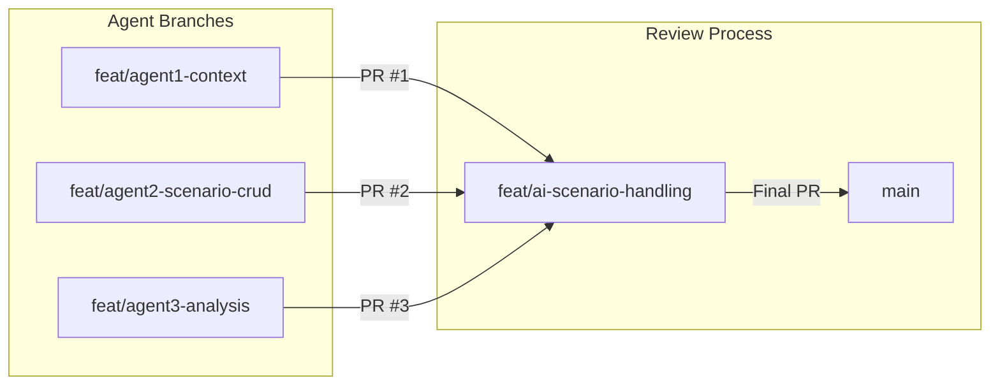

1. **Each agent works on their own branch** in a git worktree:
   - Agent 1: `feat/agent1-context` in `/Users/jitcorn/assetra3-agent1`
   - Agent 2: `feat/agent2-scenario-crud` in `/Users/jitcorn/assetra3-agent2`
   - Agent 3: `feat/agent3-analysis` in `/Users/jitcorn/assetra3-agent3`

2. **When done, create a PR to the intermediary branch**:
   ```bash
   gh pr create --base feat/ai-scenario-handling --title "Agent X: Feature Name" --body "..."
   ```

3. **User reviews and merges PRs** to the intermediary branch via GitHub

4. **Final merge**: After all PRs are merged to `feat/ai-scenario-handling`, user creates final PR to `main`

### Dependency Analysis

```mermaid
flowchart TD
    subgraph Foundation["Foundation (Must be first)"]
        B01[B0.1: GetFinancialContext]
        B12[B1.2: Real Net Worth Calc]
    end

    subgraph Parallel["Can Run in Parallel After Foundation"]
        subgraph Agent1["Agent 1: Context & Settings"]
            B02[B0.2: Inject Context]
            B03[B0.3: System Prompt]
            B11[B1.1: Auto-Execute Setting]
            F11[F1.1: Settings Toggle UI]
        end

        subgraph Agent2["Agent 2: Scenario CRUD Tools"]
            B21[B2.1: createScenarioEvent]
            B22[B2.2: updateScenarioEvent]
            B23[B2.3: deleteScenarioEvent]
            B24[B2.4: listScenarioEvents]
            B25[B2.5: toggleScenarioIncluded]
        end

        subgraph Agent3["Agent 3: Analysis Tools"]
            B31[B3.1: getNetWorthSummary]
            B32[B3.2: analyzeNetWorthTrends]
            B33[B3.3: compareScenarioImpact]
            B34[B3.4: projectNetWorthAtYear]
            B35[B3.5: identifyNetWorthLevers]
        end
    end

    B01 --> B02
    B01 --> B21
    B01 --> B31
    B12 --> B31
    B12 --> B32
    B12 --> B33
```

### Agent Assignment

#### Agent 1: Context Injection & User Settings (9 points)
**Focus**: System prompt, context injection, auto-execute setting

| Ticket | Description | Points | Files |
|--------|-------------|--------|-------|
| B0.1 | GetFinancialContext | 3 | `client.go`, `types.go` |
| B0.2 | Inject context into chat | 2 | `chat.go` |
| B0.3 | Update system prompt | 2 | `system_prompt.txt` |
| B1.1 | Auto-execute setting (backend) | 3 | migration, `timeline.go`, `chat.go` |
| F1.1 | Auto-execute toggle (frontend) | 2 | `financial.ts`, `SettingsModal.tsx` |

**Prompt for Agent 1:**
```
You are implementing the context injection and user settings feature for the AI chat system.

Read the PRD at /specs/ai/ai-scenario-execution.md, specifically sections:
- 3.5 Prompt Pipeline Architecture
- 4. API Contracts (Financial Context Response)
- 5. Implementation Tickets (B0.1, B0.2, B0.3, B1.1, F1.1)

Your tasks:
1. Create GetFinancialContext() in backend/internal/financial/client.go
   - Fetch assets, liabilities, income, expenses, scenarios
   - Calculate real net worth
   - Return structured FinancialContext

2. Modify prepareMessages() in backend/cmd/server/handlers/chat.go
   - Call GetFinancialContext()
   - Format as text block and append to system prompt

3. Update backend/internal/llm/prompts/system_prompt.txt
   - Add "Working with Scenarios" section
   - Add "System Capabilities & Boundaries" section
   - Add "Response Formatting" rules
   - Add "Handling What If Questions" section

4. Add allow_ai_auto_execute user setting
   - Create migration
   - Update UserSettings struct in repository/timeline.go
   - Check setting in chat.go before requiring approval

5. Add toggle UI in frontend/src/components/modals/SettingsModal.tsx

Do NOT modify:
- backend/internal/financial/tools.go (Agent 2 owns this)
- Any analysis/projection logic (Agent 3 owns this)

Run tests after each change: go test ./...
```

---

#### Agent 2: Scenario CRUD Tools (10 points)
**Focus**: Tool definitions and client methods for scenario management

| Ticket | Description | Points | Files |
|--------|-------------|--------|-------|
| B2.1 | createScenarioEvent tool | 3 | `tools.go`, `client.go`, `preview.go` |
| B2.2 | updateScenarioEvent tool | 2 | `tools.go`, `client.go`, `preview.go` |
| B2.3 | deleteScenarioEvent tool | 2 | `tools.go`, `client.go`, `preview.go` |
| B2.4 | listScenarioEvents tool | 2 | `tools.go`, `client.go` |
| B2.5 | toggleScenarioIncluded tool | 1 | `tools.go`, `client.go`, `preview.go` |

**Prompt for Agent 2:**
```
You are implementing scenario CRUD tools for the AI chat system.

Read the PRD at /specs/ai/ai-scenario-execution.md, specifically sections:
- 4. API Contracts (Tool Call Examples)
- 5. Implementation Tickets (B2.1-B2.5)
- 7.5 Handling "What If" Questions

Your tasks:
1. Add 5 tool definitions to backend/internal/financial/tools.go:
   - createScenarioEvent
   - updateScenarioEvent
   - deleteScenarioEvent
   - listScenarioEvents
   - toggleScenarioIncluded

2. Add execution methods to backend/internal/financial/client.go:
   - CreateScenarioEvent(ctx, params)
   - UpdateScenarioEvent(ctx, params)
   - DeleteScenarioEvent(ctx, params)
   - ListScenarioEvents(ctx, params)
   - ToggleScenarioIncluded(ctx, params)

   These should call the existing repository methods in repository/scenario_events.go

3. Add preview generation to backend/internal/financial/preview.go:
   - Generate friendly descriptions for each scenario tool
   - Show what will be created/updated/deleted

4. Update the tool executor in dispatch.go to handle new tools

Reference existing tool patterns in tools.go (createAsset, deleteAsset, etc.)

Do NOT modify:
- chat.go or system_prompt.txt (Agent 1 owns this)
- Analysis tools or net worth calculation (Agent 3 owns this)

Run tests after each change: go test ./...
```

---

#### Agent 3: Net Worth Analysis Tools (14 points)
**Focus**: Analysis tools and real net worth calculations

| Ticket | Description | Points | Files |
|--------|-------------|--------|-------|
| B1.2 | Real net worth calculation | 3 | `client.go`, `store.go` |
| B3.1 | getNetWorthSummary tool | 3 | `tools.go`, `client.go` |
| B3.2 | analyzeNetWorthTrends tool | 3 | `tools.go`, `client.go` |
| B3.3 | compareScenarioImpact tool | 3 | `tools.go`, `client.go` |
| B3.4 | projectNetWorthAtYear tool | 2 | `tools.go`, `client.go` |
| B3.5 | identifyNetWorthLevers tool | 3 | `tools.go`, `client.go` |

**Prompt for Agent 3:**
```
You are implementing net worth analysis tools for the AI chat system.

Read the PRD at /specs/ai/ai-scenario-execution.md, specifically sections:
- 3. Technical Architecture (Data Flow for Net Worth Analysis)
- 4. API Contracts (getNetWorthSummary, compareScenarioImpact responses)
- 5. Implementation Tickets (B1.2, B3.1-B3.5)

Your tasks:
1. Implement real CalculateNetWorth() in backend/internal/financial/client.go
   - Sum all asset currentValue
   - Sum all liability currentBalance
   - Return assets - liabilities
   - Replace the stubbed implementation that returns 500000

2. Add 5 analysis tool definitions to backend/internal/financial/tools.go:
   - getNetWorthSummary
   - analyzeNetWorthTrends
   - compareScenarioImpact
   - projectNetWorthAtYear
   - identifyNetWorthLevers

3. Add analysis methods to backend/internal/financial/client.go:
   - GetNetWorthSummary(ctx, params) - breakdown by category
   - AnalyzeNetWorthTrends(ctx, params) - use timeline service
   - CompareScenarioImpact(ctx, params) - baseline vs scenario
   - ProjectNetWorthAtYear(ctx, params) - specific year projection
   - IdentifyNetWorthLevers(ctx, params) - rank by impact

4. Use the timeline service (backend/internal/financial/timeline/service.go)
   for projections - it already handles scenario merging

Do NOT modify:
- chat.go or system_prompt.txt (Agent 1 owns this)
- Scenario CRUD tools (Agent 2 owns this)

Run tests after each change: go test ./...
```

---

### Execution Order

```mermaid
gantt
    title Parallel Implementation Timeline
    dateFormat X
    axisFormat %s

    section Agent 1
    B0.1 GetFinancialContext     :a1, 0, 3
    B0.2 Inject context          :a2, after a1, 2
    B0.3 System prompt           :a3, after a1, 2
    B1.1 Auto-execute setting    :a4, after a2, 3
    F1.1 Settings toggle UI      :a5, after a4, 2

    section Agent 2
    Wait for B0.1                :crit, w1, 0, 3
    B2.1 createScenarioEvent     :b1, after w1, 3
    B2.2 updateScenarioEvent     :b2, after b1, 2
    B2.3 deleteScenarioEvent     :b3, after b2, 2
    B2.4 listScenarioEvents      :b4, after b3, 2
    B2.5 toggleScenarioIncluded  :b5, after b4, 1

    section Agent 3
    B1.2 Real net worth calc     :c1, 0, 3
    B3.1 getNetWorthSummary      :c2, after c1, 3
    B3.2 analyzeNetWorthTrends   :c3, after c2, 3
    B3.3 compareScenarioImpact   :c4, after c2, 3
    B3.4 projectNetWorthAtYear   :c5, after c3, 2
    B3.5 identifyNetWorthLevers  :c6, after c4, 3
```

### File Ownership (Avoid Conflicts)

| File | Owner | Others Can Read |
|------|-------|-----------------|
| `client.go` | **Shared** - coordinate sections | Yes |
| `tools.go` | Agent 2 + Agent 3 (different functions) | Yes |
| `chat.go` | Agent 1 | Yes |
| `system_prompt.txt` | Agent 1 | Yes |
| `preview.go` | Agent 2 | Yes |
| `timeline.go` (repository) | Agent 1 (settings) | Yes |
| `timeline/service.go` | Agent 3 (read-only) | Yes |
| `SettingsModal.tsx` | Agent 1 | Yes |

### Shared File Strategy: client.go

Since all agents need to add methods to `client.go`, use this pattern:

```go
// ============================================
// SECTION: Context (Agent 1)
// ============================================

func (c *Client) GetFinancialContext(...) { ... }

// ============================================
// SECTION: Scenario CRUD (Agent 2)
// ============================================

func (c *Client) CreateScenarioEvent(...) { ... }
func (c *Client) UpdateScenarioEvent(...) { ... }
func (c *Client) DeleteScenarioEvent(...) { ... }

// ============================================
// SECTION: Analysis (Agent 3)
// ============================================

func (c *Client) CalculateNetWorth(...) { ... }
func (c *Client) GetNetWorthSummary(...) { ... }
func (c *Client) CompareScenarioImpact(...) { ... }
```

### Integration Checklist

After all agents complete, verify:
- [ ] `GetFinancialContext()` returns real data
- [ ] System prompt includes all new sections
- [ ] All 10 new tools registered in registry
- [ ] All tools have preview generation
- [ ] Auto-execute setting works end-to-end
- [ ] Run full test suite: `go test ./...`
- [ ] Manual test: Ask AI "What's my net worth?"
- [ ] Manual test: Ask AI "Create a scenario for buying a car"
