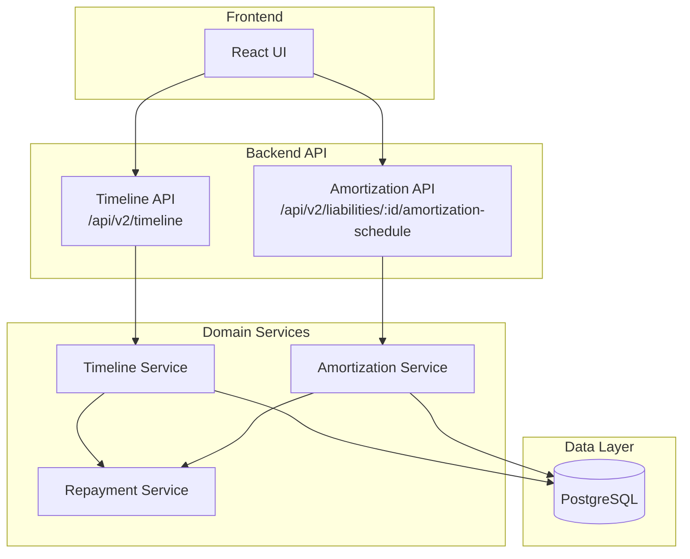
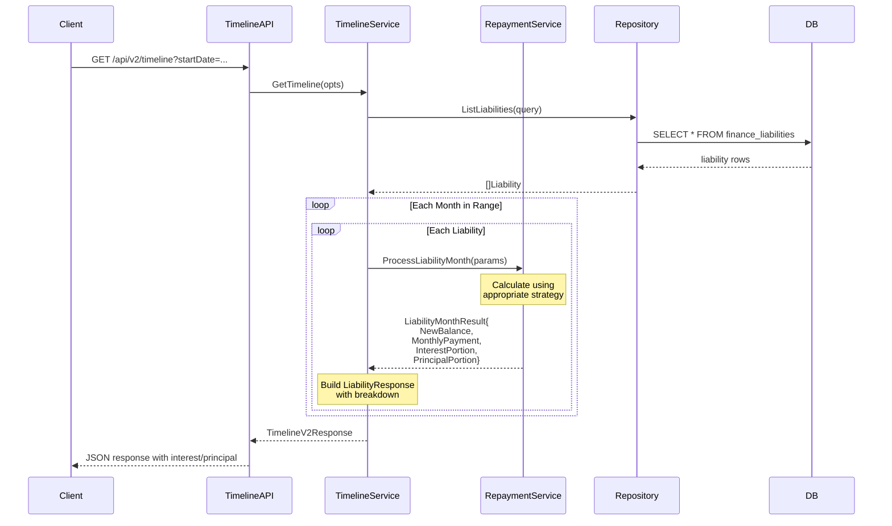
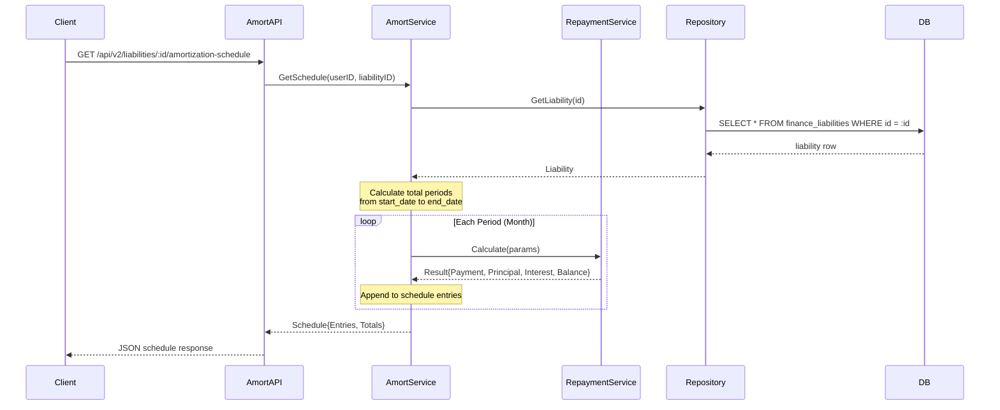
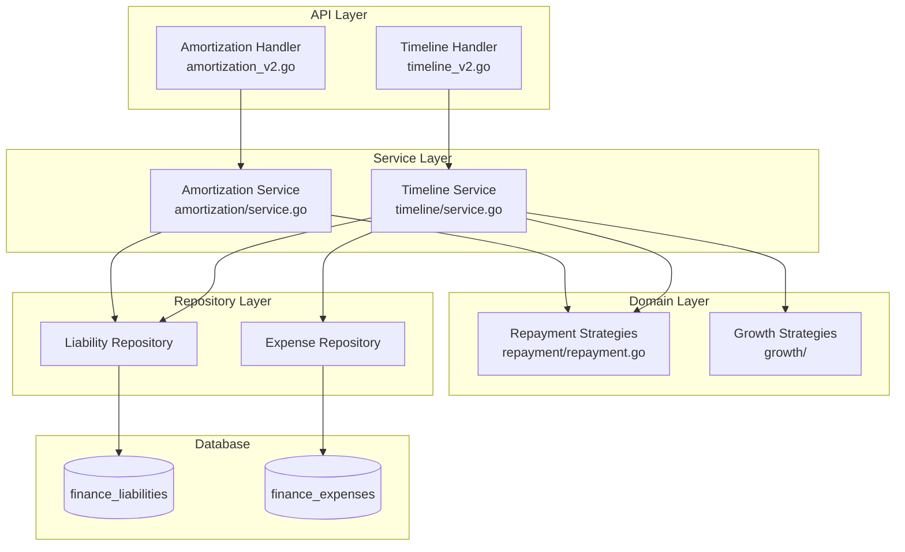

# Amortization Expense Recording Specification

## 1. Overview

This specification describes how to record and display loan amortization (interest/principal breakdown) in the Assetra financial planning system. The focus is on loan repayments; asset depreciation is out of scope for this iteration.

### Goals
1. **Loan Interest as Expense**: Show interest portion of loan payments in cash flow
2. **Computed On-Demand**: Calculate schedules when requested (no persisted records)
3. **Dual Resolution**: Support both monthly detail and annual summary views
4. **Timeline Integration**: Include interest/principal breakdown in existing timeline API

---

## 2. Current State Analysis

### Existing Schema

```sql
-- Current finance_liabilities table
CREATE TABLE finance_liabilities (
    id UUID PRIMARY KEY,
    user_id VARCHAR NOT NULL,
    name TEXT NOT NULL,
    category TEXT,
    current_balance NUMERIC NOT NULL,
    interest_rate_apr NUMERIC,
    minimum_payment NUMERIC,
    start_date TIMESTAMPTZ NOT NULL,
    end_date TIMESTAMPTZ,
    notes TEXT,
    growth_strategy VARCHAR(50),
    repayment_strategy VARCHAR(50),
    repayment_metadata JSONB,
    parent_id UUID,
    updated_at TIMESTAMPTZ
);

-- Current finance_expenses table
CREATE TABLE finance_expenses (
    id UUID PRIMARY KEY,
    user_id VARCHAR NOT NULL,
    name TEXT NOT NULL,
    amount NUMERIC NOT NULL,
    frequency VARCHAR(20),
    start_date TIMESTAMPTZ,
    end_date TIMESTAMPTZ,
    category TEXT,
    growth_rate NUMERIC(10,4),
    growth_strategy VARCHAR(50),
    notes TEXT,
    source_liability_id UUID REFERENCES finance_liabilities(id), -- Links to liability
    parent_id UUID,
    updated_at TIMESTAMPTZ
);
```

### Existing Repayment Calculation

The `repayment` package already calculates interest/principal splits:

```go
// backend/internal/financial_v2/repayment/repayment.go
type Result struct {
    MonthlyPayment   *decimal.Decimal // Total payment
    PrincipalPortion *decimal.Decimal // Principal paid ← EXISTS
    InterestPortion  *decimal.Decimal // Interest paid  ← EXISTS
    RemainingBalance *decimal.Decimal // Balance after payment
}
```

However, `LiabilityMonthResult` (used by timeline service) does NOT expose this breakdown:

```go
type LiabilityMonthResult struct {
    NewBalance     *decimal.Decimal // Balance after payment
    MonthlyPayment *decimal.Decimal // Total payment amount
    // Missing: InterestPortion, PrincipalPortion
}
```

---

## 3. Architecture

### 3.1 System Context



### 3.2 Data Flow: Timeline with Amortization



### 3.3 Data Flow: Amortization Schedule



---

## 4. Proposed Changes

### 4.1 No Database Schema Changes Required

The existing schema is sufficient. The `repayment` package already calculates interest/principal splits - we just need to expose this data through the API.

### 4.2 Backend Type Extensions

#### Extend LiabilityMonthResult

```go
// backend/internal/financial_v2/repayment/repayment.go

type LiabilityMonthResult struct {
    NewBalance       *decimal.Decimal // Balance after payment
    MonthlyPayment   *decimal.Decimal // Total payment amount
    InterestPortion  *decimal.Decimal // NEW: Interest expense this month
    PrincipalPortion *decimal.Decimal // NEW: Principal repayment this month
}
```

#### Extend Timeline LiabilityResponse

```go
// backend/internal/financial_v2/timeline/types.go

type LiabilityResponse struct {
    ID              string          `json:"id"`
    ParentID        string          `json:"parentId"`
    Name            string          `json:"name"`
    Category        string          `json:"category"`
    Balance         decimal.Decimal `json:"balance"`
    EventAdjBalance decimal.Decimal `json:"eventAdjBalance"`
    SourceAmount    decimal.Decimal `json:"sourceAmount"`
    ItemType        string          `json:"itemType"`
    StartYear       int             `json:"startYear"`
    StartMonth      int             `json:"startMonth"`
    EventImpacts    []AppliedImpact `json:"eventImpacts,omitempty"`

    // NEW: Monthly payment breakdown
    MonthlyPayment   decimal.Decimal `json:"monthlyPayment"`
    InterestExpense  decimal.Decimal `json:"interestExpense"`
    PrincipalPayment decimal.Decimal `json:"principalPayment"`
}
```

### 4.3 New Amortization Service

```go
// backend/internal/financial_v2/amortization/service.go

package amortization

import (
    "context"
    "time"
    "financial-chat-system/backend/internal/decimal"
    "financial-chat-system/backend/internal/financial_v2/repository"
    "financial-chat-system/backend/internal/financial_v2/repayment"
)

// ScheduleEntry represents one period in the amortization schedule
type ScheduleEntry struct {
    PeriodIndex      int             `json:"periodIndex"`
    Date             string          `json:"date"`          // YYYY-MM format
    Payment          decimal.Decimal `json:"payment"`
    Principal        decimal.Decimal `json:"principal"`
    Interest         decimal.Decimal `json:"interest"`
    RemainingBalance decimal.Decimal `json:"remainingBalance"`
}

// Schedule represents a complete amortization schedule
type Schedule struct {
    LiabilityID     string          `json:"liabilityId"`
    LiabilityName   string          `json:"liabilityName"`
    OriginalBalance decimal.Decimal `json:"originalBalance"`
    InterestRateAPR decimal.Decimal `json:"interestRateApr"`
    StartDate       string          `json:"startDate"`
    EndDate         *string         `json:"endDate,omitempty"`
    TotalPayments   decimal.Decimal `json:"totalPayments"`
    TotalPrincipal  decimal.Decimal `json:"totalPrincipal"`
    TotalInterest   decimal.Decimal `json:"totalInterest"`
    Entries         []ScheduleEntry `json:"entries"`
}

// AnnualSummary represents one year's totals
type AnnualSummary struct {
    Year           int             `json:"year"`
    TotalPayments  decimal.Decimal `json:"totalPayments"`
    TotalPrincipal decimal.Decimal `json:"totalPrincipal"`
    TotalInterest  decimal.Decimal `json:"totalInterest"`
    EndingBalance  decimal.Decimal `json:"endingBalance"`
}

// AnnualSchedule represents yearly summaries
type AnnualSchedule struct {
    LiabilityID     string          `json:"liabilityId"`
    LiabilityName   string          `json:"liabilityName"`
    OriginalBalance decimal.Decimal `json:"originalBalance"`
    InterestRateAPR decimal.Decimal `json:"interestRateApr"`
    TotalPayments   decimal.Decimal `json:"totalPayments"`
    TotalInterest   decimal.Decimal `json:"totalInterest"`
    Years           []AnnualSummary `json:"years"`
}

type Service struct {
    store repository.Store
}

func NewService(store repository.Store) *Service {
    return &Service{store: store}
}

// GetMonthlySchedule generates month-by-month amortization schedule
func (s *Service) GetMonthlySchedule(ctx context.Context, userID, liabilityID string) (*Schedule, error)

// GetAnnualSchedule generates year-by-year summary
func (s *Service) GetAnnualSchedule(ctx context.Context, userID, liabilityID string) (*AnnualSchedule, error)
```

### 4.4 New API Endpoint

```go
// backend/cmd/server/handlers/amortization_v2.go

// GET /api/v2/liabilities/:id/amortization-schedule?resolution=monthly|annual
func (h *Handler) HandleGetSchedule(w http.ResponseWriter, r *http.Request, id string) {
    resolution := r.URL.Query().Get("resolution")
    if resolution == "" {
        resolution = "monthly" // default
    }

    switch resolution {
    case "monthly":
        schedule, err := h.amortService.GetMonthlySchedule(ctx, userID, id)
        // ...
    case "annual":
        schedule, err := h.amortService.GetAnnualSchedule(ctx, userID, id)
        // ...
    }
}
```

---

## 5. API Specifications

### 5.1 Timeline API (Extended Response)

**Endpoint**: `GET /api/v2/financial/timeline/snapshot`

**Extended Liability Object in Response**:

```json
{
  "months": [
    {
      "year": 2025,
      "month": 1,
      "liabilities": [
        {
          "id": "550e8400-e29b-41d4-a716-446655440000",
          "name": "Home Mortgage",
          "category": "mortgage",
          "balance": 299604.94,
          "eventAdjBalance": 299604.94,
          "monthlyPayment": 1520.06,
          "interestExpense": 1125.00,
          "principalPayment": 395.06
        }
      ]
    }
  ]
}
```

### 5.2 Amortization Schedule API

**Endpoint**: `GET /api/v2/liabilities/:id/amortization-schedule`

**Query Parameters**:
| Parameter | Type | Default | Description |
|-----------|------|---------|-------------|
| resolution | string | monthly | `monthly` or `annual` |

#### Monthly Resolution Response

```json
{
  "liabilityId": "550e8400-e29b-41d4-a716-446655440000",
  "liabilityName": "Home Mortgage",
  "originalBalance": 300000.00,
  "interestRateApr": 4.50,
  "startDate": "2025-01",
  "endDate": "2055-01",
  "totalPayments": 547220.50,
  "totalPrincipal": 300000.00,
  "totalInterest": 247220.50,
  "entries": [
    {
      "periodIndex": 0,
      "date": "2025-01",
      "payment": 1520.06,
      "principal": 395.06,
      "interest": 1125.00,
      "remainingBalance": 299604.94
    },
    {
      "periodIndex": 1,
      "date": "2025-02",
      "payment": 1520.06,
      "principal": 396.54,
      "interest": 1123.52,
      "remainingBalance": 299208.40
    }
  ]
}
```

#### Annual Resolution Response

```json
{
  "liabilityId": "550e8400-e29b-41d4-a716-446655440000",
  "liabilityName": "Home Mortgage",
  "originalBalance": 300000.00,
  "interestRateApr": 4.50,
  "totalPayments": 547220.50,
  "totalInterest": 247220.50,
  "years": [
    {
      "year": 2025,
      "totalPayments": 18240.72,
      "totalPrincipal": 4890.22,
      "totalInterest": 13350.50,
      "endingBalance": 295109.78
    },
    {
      "year": 2026,
      "totalPayments": 18240.72,
      "totalPrincipal": 5114.88,
      "totalInterest": 13125.84,
      "endingBalance": 289994.90
    }
  ]
}
```

---

## 6. Component Diagram



---

## 7. Repayment Strategy Flow

```mermaid
flowchart TD
    Start[ProcessLiabilityMonth] --> CheckBalance{Balance > 0?}
    CheckBalance -->|No| ZeroResult[Return zero payment]
    CheckBalance -->|Yes| GetStrategy[Get Strategy Type]

    GetStrategy --> StratSwitch{Strategy?}

    StratSwitch -->|standard_amortization| SA[StandardAmortization<br/>M = P × r(1+r)^n / (1+r)^n-1]
    StratSwitch -->|interest_only| IO[InterestOnly<br/>Pay interest, no principal]
    StratSwitch -->|minimum_payment| MP[MinimumPayment<br/>max(2% balance, $25, interest+$1)]
    StratSwitch -->|fixed_payment| FP[FixedPayment<br/>Fixed amount from linked expense]
    StratSwitch -->|extra_payment| EP[ExtraPayment<br/>Standard + extra principal]

    SA --> CalcResult[Calculate Result]
    IO --> CalcResult
    MP --> CalcResult
    FP --> CalcResult
    EP --> CalcResult

    CalcResult --> BuildResult[Build LiabilityMonthResult<br/>NewBalance<br/>MonthlyPayment<br/>InterestPortion<br/>PrincipalPortion]

    BuildResult --> Return[Return Result]
```

---

## 8. Files to Modify/Create

| File | Action | Description |
|------|--------|-------------|
| `backend/internal/financial_v2/repayment/repayment.go` | Modify | Extend `LiabilityMonthResult` with `InterestPortion`, `PrincipalPortion` |
| `backend/internal/financial_v2/timeline/types.go` | Modify | Extend `LiabilityResponse` with payment breakdown fields |
| `backend/internal/financial_v2/timeline/service.go` | Modify | Capture and pass through interest/principal data |
| `backend/internal/financial_v2/amortization/service.go` | **Create** | New service for schedule generation |
| `backend/internal/financial_v2/amortization/types.go` | **Create** | Type definitions for schedule responses |
| `backend/cmd/server/handlers/amortization_v2.go` | **Create** | New API handler |
| `backend/cmd/server/main.go` | Modify | Register new route |

---

## 9. Test Cases

### Unit Tests

1. **Standard Amortization**
   - 30-year mortgage at 4.5% APR
   - Verify monthly payment matches formula
   - Verify interest decreases / principal increases over time
   - Verify final balance is zero

2. **Interest Only**
   - Verify payment equals interest portion
   - Verify principal portion is zero
   - Verify balance unchanged

3. **Zero Interest**
   - Verify simple division of balance over remaining periods
   - Verify no interest portion

4. **Edge Cases**
   - Open-ended liability (no end date)
   - Already paid off liability
   - Single remaining payment

### Integration Tests

1. **Timeline API**
   - Request timeline with liabilities
   - Verify `monthlyPayment`, `interestExpense`, `principalPayment` fields present
   - Verify values change month-to-month correctly

2. **Amortization Schedule API**
   - Monthly resolution with 360 periods
   - Annual resolution with 30 years
   - Totals match (principal = original balance, payments = principal + interest)

---

## 10. Implementation Sequence

```mermaid
gantt
    title Implementation Phases
    dateFormat X
    axisFormat %s

    section Phase 1: Types
    Extend LiabilityMonthResult           :p1, 0, 1
    Extend LiabilityResponse              :p2, 0, 1

    section Phase 2: Timeline
    Update ProcessLiabilityMonth          :p3, after p1, 1
    Update timeline service               :p4, after p3 p2, 2

    section Phase 3: Schedule
    Create amortization service           :p5, after p3, 2
    Create API handler                    :p6, after p5, 1
    Register route                        :p7, after p6, 1

    section Phase 4: Testing
    Unit tests                            :p8, after p4 p7, 2
    Integration tests                     :p9, after p8, 1
```



1. **Phase 1**: Extend type definitions (parallel)
2. **Phase 2**: Update timeline flow to capture/expose breakdown
3. **Phase 3**: Create amortization schedule service and API
4. **Phase 4**: Testing

---

## 11. Alternatives Considered

### Option A: Store Amortization as Expense Records (Rejected)

**Approach**: Auto-generate expense records in `finance_expenses` for each period's interest.

**Problems**:
- Data synchronization when liability terms change
- Storage overhead (360 records for 30-year mortgage)
- Double-counting risk with existing payment expenses
- Complex lifecycle management

### Option B: Computed On-Demand (Selected)

**Approach**: Calculate schedules when requested using existing repayment logic.

**Benefits**:
- No schema changes
- Always accurate (recalculates with current terms)
- Leverages existing, tested repayment strategies
- Minimal storage impact

---

## 12. Future Considerations

1. **Caching**: For frequently accessed schedules, implement cache with `liability.updated_at` as invalidation key
2. **Pagination**: For very long schedules, add `?offset=0&limit=12` support
3. **Scenario Support**: Add `?includeScenarios=true` to show how scenarios affect schedule
4. **Export**: CSV/PDF export of amortization schedules
5. **Asset Depreciation**: Apply similar pattern for tracking asset value decline
