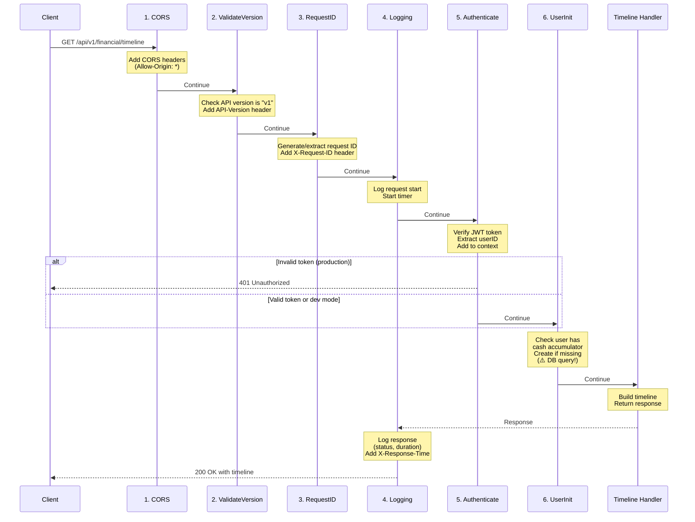

# Middleware Chain Explanation

**Purpose:** Explain what middleware runs on timeline API requests and why

---

## What is Middleware?

Middleware is code that runs **before** your handler (e.g., timeline handler). Each middleware can:
- Inspect/modify the request
- Add data to context
- Short-circuit and return early (e.g., auth failure)
- Or pass control to the next middleware

Think of it like airport security checkpoints - every request goes through multiple checks before reaching the final destination.

---

## Timeline API Middleware Chain

When you call `GET /api/v1/financial/timeline`, the request goes through **6 middleware** in this order:

```
Request → CORS → ValidateVersion → RequestID → Logging → Authenticate → UserInit → Timeline Handler
```

### Visual Flow



---

## Detailed Middleware Breakdown

### 1. CORS Middleware (middleware.go:28-43)

**Location:** Applied at router level (main.go:106)

**What it does:**
```go
w.Header().Set("Access-Control-Allow-Origin", "*")
w.Header().Set("Access-Control-Allow-Methods", "GET, POST, PUT, DELETE, OPTIONS")
w.Header().Set("Access-Control-Allow-Headers", "Content-Type, Authorization, API-Version, X-Session-ID")
```

**Why it exists:**
- Your frontend runs on `localhost:3000`
- Your backend runs on `localhost:8080`
- Different ports = different origins
- Browsers block cross-origin requests by default (security)
- CORS headers tell the browser "it's OK, allow this request"

**Without it:** Your frontend would get errors like:
```
Access to fetch at 'http://localhost:8080/api/v1/financial/timeline'
from origin 'http://localhost:3000' has been blocked by CORS policy
```

**Performance:** <1ms (just sets headers)

---

### 2. ValidateVersion Middleware (versioning.go:24-44)

**Location:** Applied to `/api/v1/*` routes (main.go:114)

**What it does:**
```go
version := extractVersion(r)  // "v1" from URL path /api/v1/...
if !supportedVersions[version] {
    return 400 "unsupported_api_version"
}
w.Header().Set("API-Version", "v1")
```

**Why it exists:**
- API versioning support (future-proofing)
- When you create `/api/v2` later, both v1 and v2 can coexist
- Clients know which version they're using via response header
- Can add deprecation warnings: `X-API-Deprecation-Warning`

**Current state:** Only v1 is supported, no deprecations

**Performance:** <1ms (just checks map and sets header)

---

### 3. RequestID Middleware (middleware.go:14-25)

**Location:** Applied to `/api/v1/*` routes (main.go:115)

**What it does:**
```go
requestID := r.Header.Get("X-Request-ID")  // From client if provided
if requestID == "" {
    requestID = uuid.New().String()  // Generate new UUID
}
w.Header().Set("X-Request-ID", requestID)
ctx = context.WithValue(r.Context(), "request_id", requestID)
```

**Why it exists:**
- **Traceability:** Track a single request through all logs
- **Debugging:** When user reports error, ask for request ID to find logs
- **Distributed systems:** If you call other services, pass request ID along

**Example logs:**
```
REQUEST START: GET /api/v1/financial/timeline | RequestID: a3f2b1c4-...
REQUEST INFO: GET /api/v1/financial/timeline | Status: 200 | Duration: 1.43s | RequestID: a3f2b1c4-...
```

**Performance:** <1ms (UUID generation is fast)

---

### 4. Logging Middleware (middleware.go:46-74)

**Location:** Applied to `/api/v1/*` routes (main.go:116)

**What it does:**
```go
start := time.Now()
log.Printf("REQUEST START: %s %s | RequestID: %v", r.Method, r.URL.Path, requestID)

next.ServeHTTP(wrapped, r)  // Call next middleware/handler

duration := time.Since(start)
w.Header().Set("X-Response-Time", duration.String())
log.Printf("REQUEST INFO: %s %s | Status: %d | Duration: %v", r.Method, r.URL.Path, status, duration)
```

**Why it exists:**
- **Monitoring:** See all requests, response times, errors
- **Debugging:** When something breaks, check logs
- **Performance tracking:** See which endpoints are slow
- **Response time header:** Client can measure round-trip time

**Example output:**
```
REQUEST START: GET /api/v1/financial/timeline | RequestID: abc123 | Content-Length: 0
REQUEST INFO: GET /api/v1/financial/timeline | Status: 200 | Duration: 1.43s | RequestID: abc123
```

**Performance:** <1ms (just logging and time tracking)

---

### 5. Authenticate Middleware (auth.go:24-59)

**Location:** Applied to `/api/v1/*` routes (main.go:117)

**What it does:**
```go
authToken := r.Header.Get("X-Auth-Token")  // JWT from frontend

if authToken != "" {
    userID, isVerified, err := verifyBFFToken(authToken)
    // Verify HMAC signature using BACKEND_SHARED_SECRET
    // Extract userID from JWT claims
}

// Fallback: Dev mode allows X-Session-ID header (no JWT required)
if userID == "" && isDevMode() {
    userID = r.Header.Get("X-Session-ID")
}

// Store userID in context for handlers to use
ctx := context.WithValue(r.Context(), userContextKey{}, UserContext{
    UserID:     userID,
    Token:      authToken,
    IsVerified: isVerified,
})
```

**Why it exists:**
- **Security:** Verify user is authenticated
- **Multi-tenancy:** Different users see different data
- **User context:** Handlers need to know which user made the request

**Two modes:**
1. **Production:** Requires valid HMAC-signed JWT token
2. **Dev mode:** Accepts simple `X-Session-ID` header (for testing)

**JWT verification process:**
```go
// 1. Parse JWT token
token, err := jwt.Parse(tokenString, func(token *jwt.Token) (interface{}, error) {
    // 2. Verify HMAC signature
    return []byte(BACKEND_SHARED_SECRET), nil
})

// 3. Extract user ID from claims
claims := token.Claims.(jwt.MapClaims)
userID := claims["sub"]  // "sub" = subject = user ID
```

**Performance:** ~1-5ms (JWT parsing and HMAC verification)

---

### 6. UserInit Middleware (user_init.go:23-40) ⚠️ PERFORMANCE BOTTLENECK

**Location:** Applied to `/api/v1/*` routes (main.go:120-121)

**What it does:**
```go
userID := GetUserContext(r.Context()).UserID

// Check if user has cash accumulator account
_, err := s.store.GetAccumulatorAccount(ctx, userID)
if err != nil {
    // No accumulator found - create default one
    s.store.CreateCashAccount(ctx, CashAccount{
        Name:          "Cash",
        Balance:       0,
        InterestRate:  1.5,
        IsAccumulator: true,
        StartYear:     time.Now().Year(),
    })
}
```

**Why it exists:**
- **Timeline requires accumulator:** The timeline service MUST have a cash accumulator to work
- **Lazy initialization:** Create accumulator on first request (vs requiring explicit onboarding)
- **User convenience:** Users don't have to manually create cash account

**The Problem:**
- Runs on **EVERY** `/api/v1/*` request
- Makes a DB query: `SELECT * FROM cash_accounts WHERE user_id = $1 AND is_accumulator = true`
- Once user has accumulator (99.9% of requests), this is wasted work

**Performance:** 50-100ms per request (DB query latency)

**This is why it was mentioned in the performance analysis!**

---

## Middleware Execution Order

Middleware executes in a **chain** (like Russian nesting dolls):

```
CORS {
    ValidateVersion {
        RequestID {
            Logging {
                Authenticate {
                    UserInit {
                        Handler()
                    }
                }
            }
        }
    }
}
```

Each middleware calls `next.ServeHTTP(w, r)` to pass control to the next one.

---

## Total Middleware Overhead

| Middleware | Time | Notes |
|------------|------|-------|
| CORS | <1ms | Just sets headers |
| ValidateVersion | <1ms | Map lookup + header |
| RequestID | <1ms | UUID generation |
| Logging | <1ms | Logging + timer |
| Authenticate | 1-5ms | JWT parsing + HMAC verify |
| **UserInit** | **50-100ms** | **⚠️ DB query** |
| **Total** | **~55-110ms** | **7-8% of 1.43s response time** |

---

## Why So Many Middleware?

Each middleware has a **single responsibility** (good software design):

1. **CORS** - Handle browser cross-origin security
2. **ValidateVersion** - API versioning
3. **RequestID** - Request tracing
4. **Logging** - Observability
5. **Authenticate** - Security & user identification
6. **UserInit** - User-specific setup

**Alternative:** Put all this logic in every handler
```go
func HandleTimeline(w http.ResponseWriter, r *http.Request) {
    // Set CORS headers
    w.Header().Set("Access-Control-Allow-Origin", "*")

    // Validate version
    version := extractVersion(r)
    if !supportedVersions[version] { return }

    // Generate request ID
    requestID := uuid.New().String()

    // Start logging
    start := time.Now()
    defer log.Printf("Duration: %v", time.Since(start))

    // Authenticate
    userID, err := verifyJWT(r.Header.Get("X-Auth-Token"))
    if err != nil { return }

    // Check accumulator
    ensureAccumulator(userID)

    // FINALLY: Build timeline
    timeline := buildTimeline(userID)
}
```

**Problems with this approach:**
- Code duplication across every handler
- Easy to forget a step (security vulnerability!)
- Hard to maintain (change CORS? update 50 handlers)
- Can't enforce ordering (auth must come before userInit)

**Middleware approach:**
- Write once, apply to all routes
- Guaranteed execution order
- Easy to add/remove/reorder
- Clear separation of concerns

---

## Common Middleware Patterns in Web Apps

Your middleware setup is **standard** for modern web APIs. Compare to other frameworks:

**Express.js (Node.js):**
```javascript
app.use(cors())
app.use(helmet())  // Security headers
app.use(morgan())  // Logging
app.use(authenticate)
app.use('/api/v1', v1Router)
```

**Django (Python):**
```python
MIDDLEWARE = [
    'django.middleware.security.SecurityMiddleware',
    'django.middleware.common.CommonMiddleware',
    'django.middleware.csrf.CsrfViewMiddleware',
    'django.contrib.auth.middleware.AuthenticationMiddleware',
    'django.middleware.clickjacking.XFrameOptionsMiddleware',
]
```

**Rails (Ruby):**
```ruby
config.middleware.use Rack::Cors
config.middleware.use ActionDispatch::RequestId
config.middleware.use Rails::Rack::Logger
```

Your 6 middleware is actually **fewer** than typical enterprise apps!

---

## Optimization Opportunities

### 1. UserInit Middleware (50-100ms)

**Current:** DB query on every request

**Optimization:** Cache in memory
```go
type UserInitializer struct {
    store            *repository.Store
    initializedUsers sync.Map  // Cache userIDs
}

func (ui *UserInitializer) ensureCashAccumulator(ctx context.Context, userID string) error {
    // Check cache first
    if _, exists := ui.initializedUsers.Load(userID); exists {
        return nil  // Skip DB query
    }

    // Only query DB on first request per user
    _, err := ui.store.GetAccumulatorAccount(ctx, userID)
    if err == nil {
        ui.initializedUsers.Store(userID, true)  // Cache hit
        return nil
    }

    // Create and cache
    // ...
}
```

**Speedup:** 50-100ms → <1ms (after first request per user)

### 2. Authenticate Middleware (1-5ms)

Already well-optimized. JWT verification is fast.

Could cache JWT verification results, but:
- JWTs are short-lived (expire quickly)
- Caching adds complexity
- 1-5ms is acceptable overhead

---

## Decision: Keep or Remove?

### Keep All 6 Middleware ✅

**Reasons:**
1. **CORS** - Required for frontend to work
2. **ValidateVersion** - Useful for future API versions
3. **RequestID** - Essential for debugging production issues
4. **Logging** - Need visibility into what's happening
5. **Authenticate** - Required for security
6. **UserInit** - Required for timeline to work (but optimize with cache)

### Optimize UserInit ✅ RECOMMENDED

Add `sync.Map` cache to eliminate 50-100ms overhead.

### Don't Remove Any ❌

Removing middleware saves <10ms (except UserInit), not worth losing functionality.

---

## Summary

**Why so many middleware?**
- Each has a specific purpose (CORS, auth, logging, etc.)
- Standard practice in modern web APIs
- Better than duplicating code in every handler

**Which one is slow?**
- **UserInit** - 50-100ms (DB query on every request)
- Others are <5ms combined

**What to do?**
- Keep all middleware (they're useful)
- Optimize UserInit with in-memory cache
- Expected speedup: ~50-100ms per request

**Your middleware chain is well-designed!** The only issue is the missing cache in UserInit, which is an easy fix.
