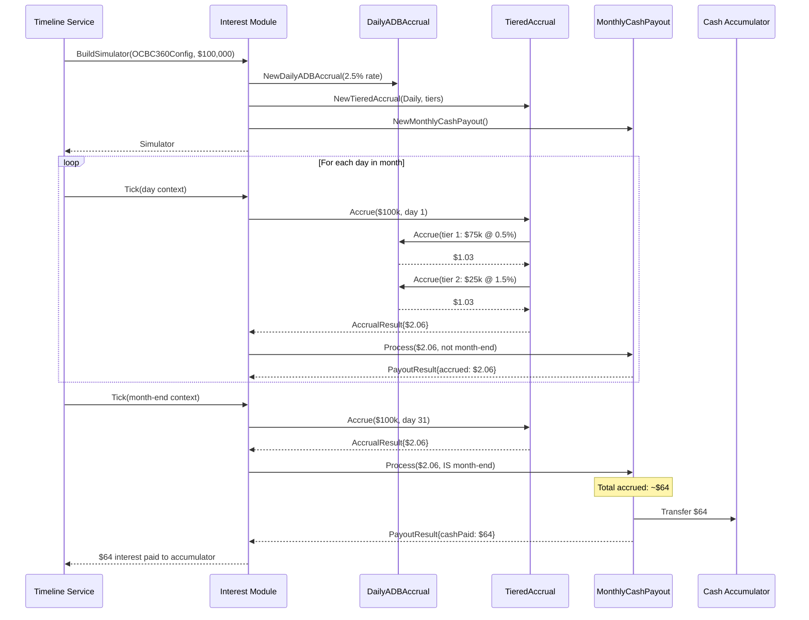
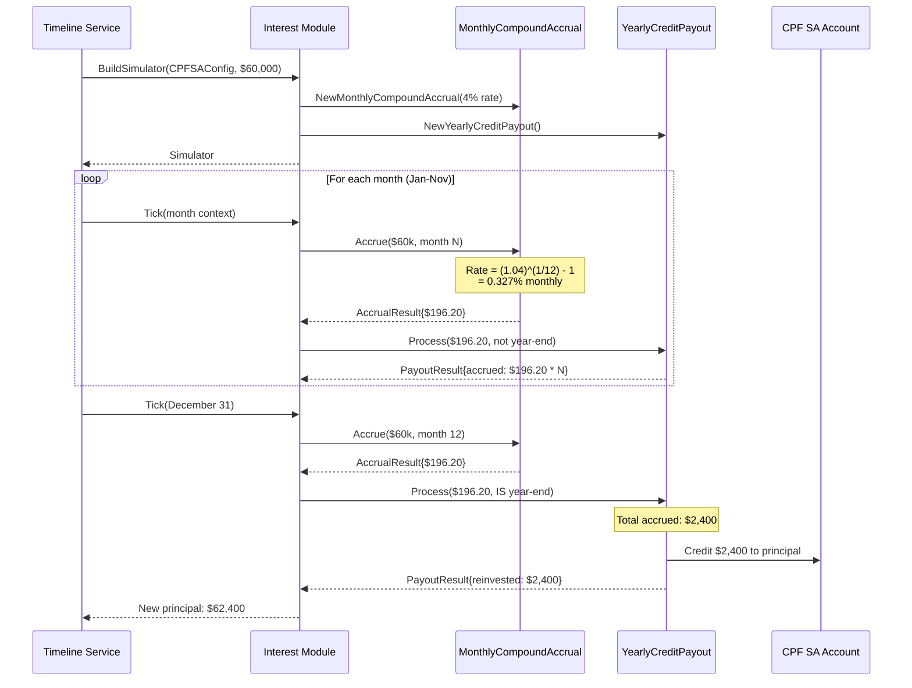
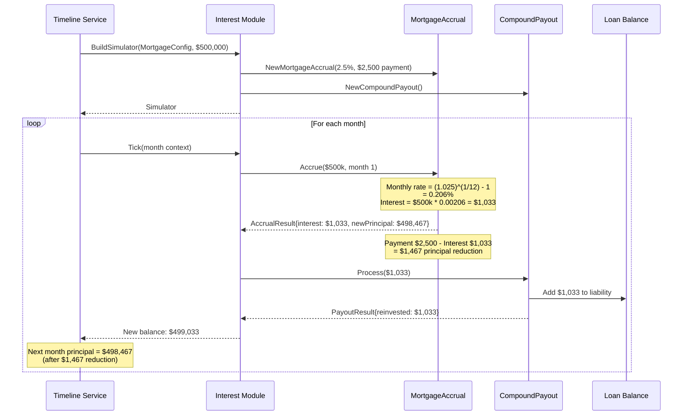
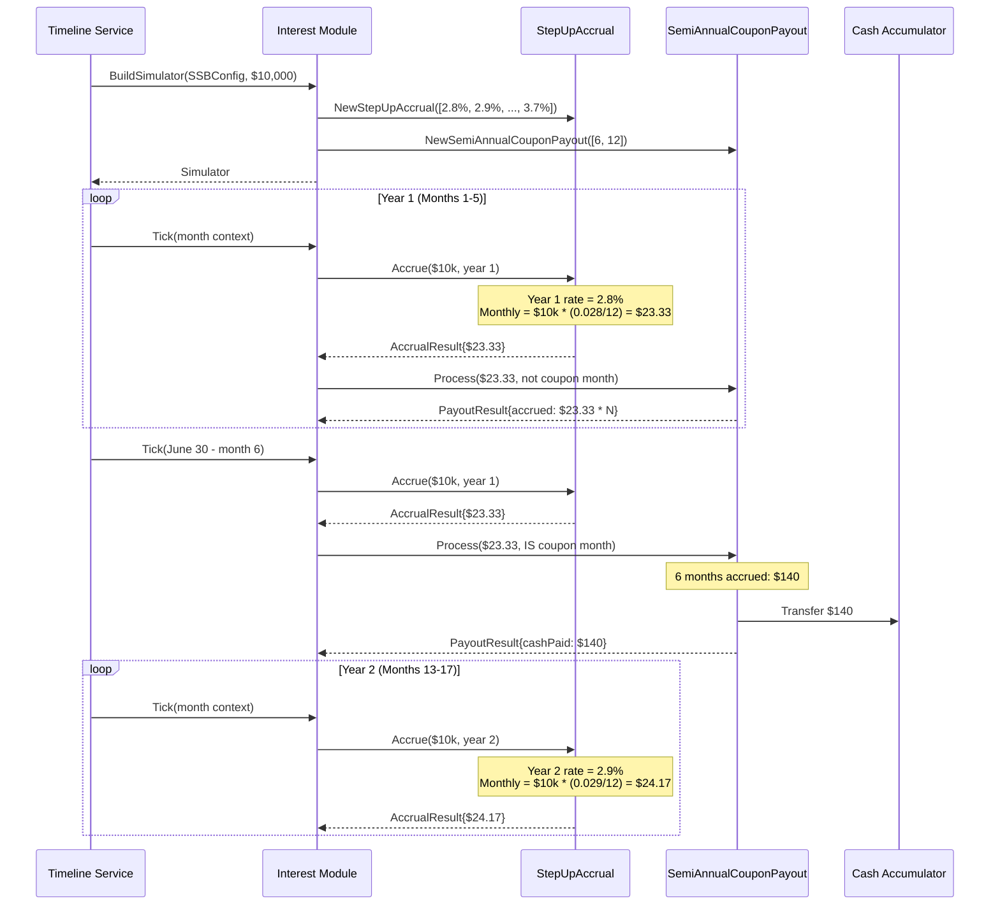
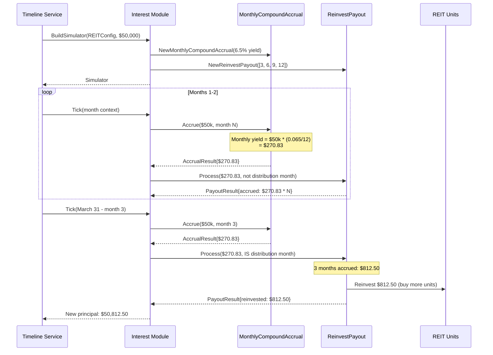
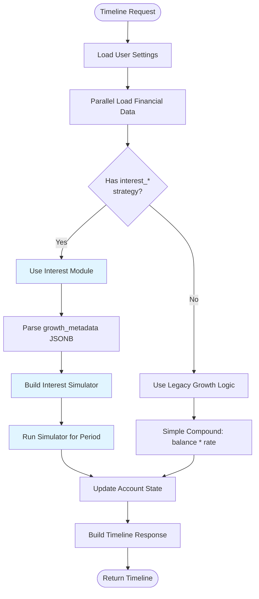
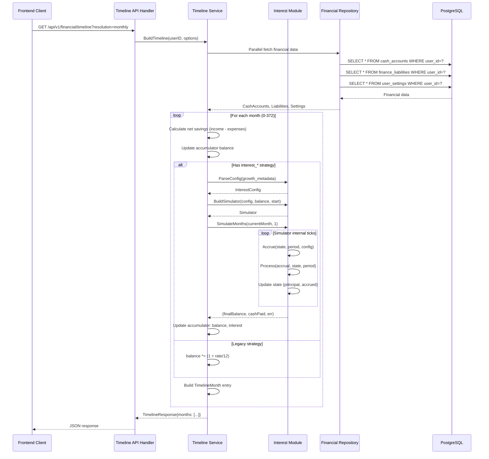
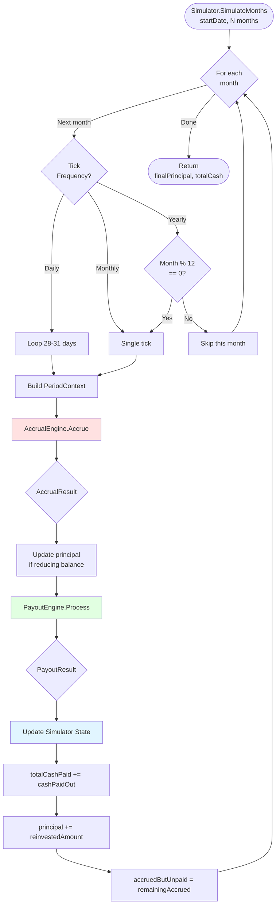
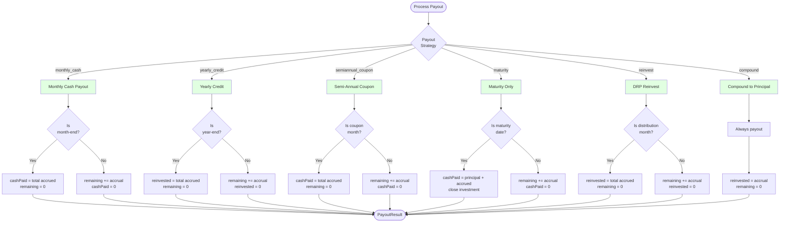

# Universal Interest-Rate Engine - Technical Specification

## Executive Summary

This specification details a **standalone interest-rate module** for Assetra that models all Singapore financial instruments with clean separation between **accrual**, **payout**, and **compounding** mechanics.

**Key Design Principles:**
- **Standalone module**: Independent `interest` package separate from existing `growth` system
- **Database tracking**: Add `accrued_interest` column to track partial-period accruals
- **Variable rates**: Support rate schedules that change over time
- **Strategy-specific granularity**: Each accrual strategy defines its own tick frequency (daily/monthly/yearly)

---

## Table of Contents

1. [System Architecture](#system-architecture)
2. [Module Structure](#module-structure)
3. [Interest Application by Financial Type](#interest-application-by-financial-type)
4. [Integration with Existing Backend](#integration-with-existing-backend)
5. [Data Flow Diagrams](#data-flow-diagrams)
6. [Singapore Instrument Examples](#singapore-instrument-examples)
7. [Database Schema](#database-schema)
8. [API Contracts](#api-contracts)
9. [Implementation Plan](#implementation-plan)

---

## System Architecture

### High-Level Architecture

```mermaid
graph TB
    subgraph "Frontend Layer"
        UI[Timeline UI]
        Config[Interest Config UI]
    end

    subgraph "API Layer"
        TimelineAPI[Timeline API Handler]
        ConfigAPI[Account Config API]
    end

    subgraph "Service Layer"
        TimelineService[Timeline Service]
        InterestService[Interest Service]
    end

    subgraph "Interest Module (Standalone)"
        Simulator[Interest Simulator]
        AccrualEngine[Accrual Engines]
        PayoutEngine[Payout Engines]
        RateSchedule[Rate Schedule Manager]
    end

    subgraph "Data Layer"
        Repo[Financial Repository]
        DB[(PostgreSQL)]
    end

    UI --> TimelineAPI
    Config --> ConfigAPI
    TimelineAPI --> TimelineService
    ConfigAPI --> Repo
    TimelineService --> InterestService
    InterestService --> Simulator
    Simulator --> AccrualEngine
    Simulator --> PayoutEngine
    Simulator --> RateSchedule
    Repo --> DB
    TimelineService --> Repo

    style "Interest Module (Standalone)" fill:#e1f5ff
```

### Interest Module Components

```mermaid
graph LR
    subgraph "Interest Module (backend/internal/financial/interest)"
        Types[types.go<br/>Core Types]
        Schedule[rate_schedule.go<br/>Variable Rates]

        subgraph "Accrual Engines"
            Daily[accrual_daily.go<br/>Daily ADB]
            Monthly[accrual_monthly.go<br/>Monthly Compound]
            Tiered[accrual_tiered.go<br/>Tiered Wrapper]
            StepUp[accrual_stepup.go<br/>SSB Step-Up]
            Discount[accrual_discount.go<br/>T-Bill Discount]
            Mortgage[accrual_mortgage.go<br/>Reducing Balance]
        end

        subgraph "Payout Engines"
            PMonthlyCash[payout_monthly.go<br/>Monthly Cash]
            PYearly[payout_yearly.go<br/>Yearly Credit]
            PCoupon[payout_coupon.go<br/>Semi-Annual]
            PMaturity[payout_maturity.go<br/>Maturity Only]
            PReinvest[payout_reinvest.go<br/>DRP Reinvest]
            PCompound[payout_compound.go<br/>To Principal]
        end

        Sim[simulator.go<br/>Orchestrator]
        Cfg[config.go<br/>Config Parser]

        subgraph "Examples"
            Banks[examples/bank_accounts.go]
            CPF[examples/cpf.go]
            Bonds[examples/bonds.go]
            TBills[examples/tbills.go]
            Loans[examples/loans.go]
            REITs[examples/reits.go]
        end
    end

    Types --> Sim
    Schedule --> Sim
    Daily --> Sim
    Monthly --> Sim
    Tiered --> Sim
    StepUp --> Sim
    Discount --> Sim
    Mortgage --> Sim
    PMonthlyCash --> Sim
    PYearly --> Sim
    PCoupon --> Sim
    PMaturity --> Sim
    PReinvest --> Sim
    PCompound --> Sim
    Cfg --> Sim
    Banks -.-> Cfg
    CPF -.-> Cfg
    Bonds -.-> Cfg
    TBills -.-> Cfg
    Loans -.-> Cfg
    REITs -.-> Cfg

    style "Interest Module (backend/internal/financial/interest)" fill:#e1f5ff
```

---

## Module Structure

### Package Organization

```
backend/internal/financial/interest/    # Standalone interest module
├── types.go                           # Core types (interfaces consumed)
├── rate_schedule.go                   # Variable rate support
│
├── accrual.go                         # AccrualEngine interface
├── accrual_daily.go                   # Daily ADB implementation
├── accrual_monthly.go                 # Monthly compound implementation
├── accrual_tiered.go                  # Tiered wrapper implementation
├── accrual_stepup.go                  # SSB step-up implementation
├── accrual_discount.go                # T-bill discount implementation
├── accrual_mortgage.go                # Mortgage reducing balance
│
├── payout.go                          # PayoutEngine interface
├── payout_monthly.go                  # Monthly cash payout
├── payout_yearly.go                   # Yearly credit payout
├── payout_coupon.go                   # Semi-annual coupon
├── payout_maturity.go                 # Maturity-only payout
├── payout_reinvest.go                 # DRP reinvestment
├── payout_compound.go                 # Compound to principal
│
├── simulator.go                       # Orchestrator (concrete type returned)
├── config.go                          # JSONB config parser
│
├── examples/                          # Reference configurations
│   ├── bank_accounts.go               # OCBC 360, DBS Multiplier
│   ├── cpf.go                         # CPF OA/SA/MA/RA
│   ├── bonds.go                       # SSB, SGS bonds
│   ├── tbills.go                      # T-bills
│   ├── loans.go                       # Mortgages, personal loans
│   └── reits.go                       # REIT dividends
│
└── interest_test.go                   # Comprehensive test suite
```

### Key Interfaces

```go
// AccrualEngine calculates interest earned during a period
type AccrualEngine interface {
    Accrue(state PrincipalState, period PeriodContext, config map[string]interface{}) (*AccrualResult, error)
    TickFrequency() TickFrequency
    Type() StrategyType
}

// PayoutEngine determines when and how accrued interest is distributed
type PayoutEngine interface {
    Process(accrual AccrualResult, state PrincipalState, period PeriodContext, config map[string]interface{}) (*PayoutResult, error)
    Type() StrategyType
}

// Simulator orchestrates accrual and payout (concrete type)
type Simulator struct {
    accrual       AccrualEngine
    payout        PayoutEngine
    state         PrincipalState
    accrualConfig map[string]interface{}
    payoutConfig  map[string]interface{}
    timelineStart time.Time
}
```

---

## Interest Application by Financial Type

### 1. Cash Accounts (Savings/Checking)



**Configuration Example:**
```json
{
  "accrual_strategy": "tiered",
  "payout_strategy": "monthly_cash",
  "accrual_config": {
    "base_engine": "daily_adb",
    "tiers": [
      {"threshold": 0, "rate": 0.005},
      {"threshold": 75000, "rate": 0.015},
      {"threshold": 100000, "rate": 0.025}
    ]
  }
}
```

**Database Storage:**
```sql
-- cash_accounts table
growth_strategy = 'interest_tiered_monthly_payout'
growth_metadata = '{"accrual_strategy": "tiered", ...}'
accrued_interest = 45.23  -- Updated daily
```

---

### 2. CPF Accounts (OA/SA/MA/RA)



**Configuration Example:**
```json
{
  "accrual_strategy": "monthly_compound",
  "payout_strategy": "yearly_credit",
  "accrual_config": {
    "rate_schedule": {
      "periods": [
        {"start_year": 0, "end_year": null, "rate": 0.04}
      ]
    }
  }
}
```

**Key Difference from Cash Accounts:**
- ✅ Interest **compounds to principal** (not paid to accumulator)
- ✅ Credited **once per year** (not monthly)
- ✅ Uses **monthly compounding** formula: (1 + r)^(1/12) - 1

---

### 3. Liabilities (Mortgages/Loans)



**Configuration Example:**
```json
{
  "accrual_strategy": "mortgage",
  "payout_strategy": "compound",
  "accrual_config": {
    "rate_schedule": {
      "periods": [
        {"start_year": 0, "end_year": 5, "rate": 0.025},
        {"start_year": 5, "end_year": null, "rate": 0.035}
      ]
    },
    "monthly_payment": 2500.0
  }
}
```

**Database Storage:**
```sql
-- finance_liabilities table
growth_strategy = 'interest_mortgage_compound'
growth_metadata = '{"accrual_strategy": "mortgage", ...}'
accrued_interest = 1033.00  -- This month's interest charge
current_balance = 499033.00 -- Reduces each month
```

**Key Features:**
- ✅ **Reducing balance**: Principal decreases each month
- ✅ **Variable rates**: Can change over time (e.g., 2.5% → 3.5% after 5 years)
- ✅ **Interest adds to liability**: Unlike assets, interest increases the debt

---

### 4. Singapore Savings Bonds (SSB)



**Configuration Example:**
```json
{
  "accrual_strategy": "stepup",
  "payout_strategy": "semiannual_coupon",
  "accrual_config": {
    "year_rates": [0.028, 0.029, 0.030, 0.031, 0.032, 0.033, 0.034, 0.035, 0.036, 0.037]
  },
  "payout_config": {
    "coupon_months": [6, 12]
  }
}
```

**Key Features:**
- ✅ **Step-up rates**: Different rate each year (2.8% → 2.9% → ... → 3.7%)
- ✅ **Semi-annual payouts**: June 30 and December 31
- ✅ **Principal unchanged**: $10,000 remains constant, only interest paid out

---

### 5. T-Bills (Discount Instruments)

```mermaid
sequenceDiagram
    participant Timeline as Timeline Service
    participant Interest as Interest Module
    participant Discount as DiscountAccrual
    participant Payout as MaturityPayout
    participant Accumulator as Cash Accumulator

    Timeline->>Interest: BuildSimulator(TBillConfig, $9,950)
    Note over Interest: Face value: $10,000<br/>Discount: $50<br/>Maturity: 6 months
    Interest->>Discount: NewDiscountAccrual($50 discount)
    Interest->>Payout: NewMaturityPayout(month 6, $10,000)
    Interest-->>Timeline: Simulator

    loop Months 1-5
        Timeline->>Interest: Tick(month context)
        Interest->>Discount: Accrue($9,950, month N)
        Note over Discount: No accrual until maturity
        Discount-->>Interest: AccrualResult{$0}
        Interest->>Payout: Process($0, not maturity)
        Payout-->>Interest: PayoutResult{accrued: $0}
    end

    Timeline->>Interest: Tick(Month 6 - maturity)
    Interest->>Discount: Accrue($9,950, month 6)
    Note over Discount: Realize full $50 yield at maturity
    Discount-->>Interest: AccrualResult{$50}
    Interest->>Payout: Process($50, IS maturity)
    Payout->>Accumulator: Transfer $10,000 (principal + yield)
    Payout-->>Interest: PayoutResult{cashPaid: $10,000}
    Interest-->>Timeline: Investment closed, $10,000 to accumulator
```



**Configuration Example:**
```json
{
  "accrual_strategy": "discount",
  "payout_strategy": "maturity",
  "accrual_config": {
    "discount": 50.0
  },
  "payout_config": {
    "maturity_month_index": 6,
    "face_value": 10000.0
  }
}
```

**Key Features:**
- ✅ **No periodic accrual**: All yield realized at maturity
- ✅ **Discount pricing**: Buy at $9,950, receive $10,000
- ✅ **Single payout**: Principal + yield returned at maturity

---

### 6. Assets (Investments/REITs with DRP)



**Configuration Example:**
```json
{
  "accrual_strategy": "monthly_compound",
  "payout_strategy": "reinvest",
  "accrual_config": {
    "rate_schedule": {
      "periods": [
        {"start_year": 0, "end_year": null, "rate": 0.065}
      ]
    }
  },
  "payout_config": {
    "distribution_months": [3, 6, 9, 12]
  }
}
```

**Key Features:**
- ✅ **Quarterly distributions**: March, June, September, December
- ✅ **Automatic reinvestment**: Distributions buy more units (DRP)
- ✅ **Compounding growth**: Principal increases each quarter

---

## Integration with Existing Backend

### Timeline Service Integration Flow



### Code Integration Points

#### 1. Timeline Service - Yearly Resolution

**File: `timeline/service.go` (lines 665-672)**

```go
// BEFORE (existing simple compounding):
interestEarned := 0.0
if year > 0 {
    accumulatedCash += annualNetSavings
    interestEarned = accumulatedCash * (cashGrowthRate / 100.0)
    accumulatedCash += interestEarned
}
```

```go
// AFTER (with interest module):
interestEarned := 0.0
if year > 0 {
    accumulatedCash += annualNetSavings

    // Check if accumulator uses interest engine
    if accumulator.GrowthStrategy != "" &&
       strings.HasPrefix(accumulator.GrowthStrategy, "interest_") {

        // Use interest simulator
        cfg, err := interest.ParseConfig(accumulator.GrowthMetadata)
        if err == nil {
            principal := decimal.MustFromFloat64(accumulatedCash)
            timelineStart := time.Date(baseYear, 1, 1, 0, 0, 0, 0, time.UTC)

            sim, err := interest.BuildSimulator(cfg, principal, timelineStart)
            if err == nil {
                // Run simulator for 12 months
                currentYearStart := timelineStart.AddDate(year, 0, 0)
                finalPrincipal, cashPaid, _ := sim.SimulateMonths(currentYearStart, 12)

                accumulatedCash = finalPrincipal.Float64()
                interestEarned = cashPaid.Float64()
            }
        }
    } else {
        // Fallback to simple compounding
        interestEarned = accumulatedCash * (cashGrowthRate / 100.0)
        accumulatedCash += interestEarned
    }
}
```

#### 2. Timeline Service - Monthly Resolution

**File: `timeline/service.go` (lines 900-920)**

```go
// Similar pattern for monthly resolution
if monthIndex > 0 {
    accumulatedCash += monthlyNetSavings

    if accumulator.GrowthStrategy != "" &&
       strings.HasPrefix(accumulator.GrowthStrategy, "interest_") {

        cfg, _ := interest.ParseConfig(accumulator.GrowthMetadata)
        principal := decimal.MustFromFloat64(accumulatedCash)
        timelineStart := time.Date(baseYear, 1, 1, 0, 0, 0, 0, time.UTC)

        sim, _ := interest.BuildSimulator(cfg, principal, timelineStart)
        currentMonth := timelineStart.AddDate(0, monthIndex, 0)

        // Run for single month
        finalPrincipal, cashPaid, _ := sim.SimulateMonths(currentMonth, 1)

        accumulatedCash = finalPrincipal.Float64()
        interestEarned = cashPaid.Float64()
    } else {
        // Fallback: monthly compounding
        monthlyRate := math.Pow(1+cashGrowthRate/100, 1.0/12.0) - 1
        interestEarned = accumulatedCash * monthlyRate
        accumulatedCash += interestEarned
    }
}
```

#### 3. New Feature: Liability Interest Calculation

**File: `timeline/service.go` (new section after assets calculation)**

```go
// Calculate liability interest (mortgages, loans)
for liabilityID, liability := range liabilities {
    if liability.GrowthStrategy != "" &&
       strings.HasPrefix(liability.GrowthStrategy, "interest_") {

        cfg, _ := interest.ParseConfig(liability.GrowthMetadata)
        principal := decimal.MustFromFloat64(liability.CurrentBalance)
        timelineStart := time.Date(baseYear, 1, 1, 0, 0, 0, 0, time.UTC)

        sim, _ := interest.BuildSimulator(cfg, principal, timelineStart)

        if resolution == "monthly" {
            currentMonth := timelineStart.AddDate(0, monthIndex, 0)
            newBalance, interestCharge, _ := sim.SimulateMonths(currentMonth, 1)

            liabilities[liabilityID].CurrentBalance = newBalance.Float64()
            liabilities[liabilityID].AccruedInterest = interestCharge.Float64()
        } else {
            currentYear := timelineStart.AddDate(year, 0, 0)
            newBalance, interestCharge, _ := sim.SimulateMonths(currentYear, 12)

            liabilities[liabilityID].CurrentBalance = newBalance.Float64()
            liabilities[liabilityID].AccruedInterest = interestCharge.Float64()
        }
    }
}
```

---

## Data Flow Diagrams

### Full Timeline Generation with Interest Module



### Interest Simulator Internal Flow



### Accrual Engine Decision Tree

```mermaid
flowchart TB
    Start([Accrue Request]) --> GetStrategy{Accrual<br/>Strategy}

    GetStrategy -->|daily_adb| DailyADB[Daily ADB Accrual]
    GetStrategy -->|monthly_compound| MonthlyCompound[Monthly Compound]
    GetStrategy -->|tiered| Tiered[Tiered Wrapper]
    GetStrategy -->|stepup| StepUp[Step-Up SSB]
    GetStrategy -->|discount| Discount[Discount T-Bill]
    GetStrategy -->|mortgage| Mortgage[Mortgage Reducing]

    DailyADB --> CalcDaily[interest = principal * rate / 365]
    MonthlyCompound --> CalcMonthly[interest = principal * <br/>((1+rate)^(1/12) - 1)]
    Tiered --> SplitTiers[Split balance by tiers]
    StepUp --> GetYearRate[rate = yearRates[yearIndex]]
    Discount --> CheckMaturity{At<br/>maturity?}
    Mortgage --> CalcMortgage[interest = principal * monthlyRate<br/>newPrincipal = principal - payment]

    SplitTiers --> LoopTiers[For each tier]
    LoopTiers --> CalcTier[Run base engine on tier balance]
    CalcTier --> SumTiers[Sum all tier interest]

    CheckMaturity -->|Yes| FullYield[interest = discount amount]
    CheckMaturity -->|No| NoAccrual[interest = 0]

    GetYearRate --> CalcMonthly

    CalcDaily --> Return([AccrualResult])
    CalcMonthly --> Return
    SumTiers --> Return
    FullYield --> Return
    NoAccrual --> Return
    CalcMortgage --> Return

    style DailyADB fill:#ffe1e1
    style MonthlyCompound fill:#ffe1e1
    style Tiered fill:#ffe1e1
    style StepUp fill:#ffe1e1
    style Discount fill:#ffe1e1
    style Mortgage fill:#ffe1e1
```

### Payout Engine Decision Tree



---

## Singapore Instrument Examples

### Complete Configuration Matrix

| Instrument | Accrual Strategy | Payout Strategy | Tick Frequency | Rate Type |
|------------|------------------|-----------------|----------------|-----------|
| **OCBC 360** | Tiered (Daily ADB) | Monthly Cash | Daily | Tiered |
| **DBS Multiplier** | Tiered (Daily ADB) | Monthly Cash | Daily | Tiered |
| **CPF OA** | Monthly Compound | Yearly Credit | Monthly | Fixed 2.5% |
| **CPF SA/MA/RA** | Monthly Compound | Yearly Credit | Monthly | Fixed 4% |
| **SSB** | Step-Up | Semi-Annual Coupon | Monthly | Step-Up |
| **SGS 10Y Bond** | Monthly Compound | Semi-Annual Coupon | Monthly | Fixed |
| **T-Bill 6M** | Discount | Maturity | None | Discount |
| **HDB Loan** | Mortgage Reducing | Compound | Monthly | Fixed 2.6% |
| **Bank Loan** | Mortgage Reducing | Compound | Monthly | Variable |
| **REIT (DRP)** | Monthly Compound | Reinvest | Monthly | Variable |

### Example 1: OCBC 360 Account (Tiered Daily ADB)

```go
// File: interest/examples/bank_accounts.go

func OCBC360Config() *Config {
    return &Config{
        AccrualStrategy: AccrualTiered,
        PayoutStrategy:  PayoutMonthlyCash,
        AccrualConfig: map[string]interface{}{
            "base_engine": "daily_adb",
            "rate_schedule": map[string]interface{}{
                "periods": []map[string]interface{}{
                    {"start_year": 0, "end_year": nil, "rate": 0.005},
                },
            },
            "tiers": []map[string]interface{}{
                {"threshold": 0.0, "rate": 0.005},      // 0-75k: 0.5%
                {"threshold": 75000.0, "rate": 0.015},  // 75-100k: 1.5%
                {"threshold": 100000.0, "rate": 0.025}, // >100k: 2.5%
            },
        },
        PayoutConfig: map[string]interface{}{},
    }
}
```

**Database Storage:**
```sql
INSERT INTO cash_accounts (user_id, name, balance, growth_strategy, growth_metadata)
VALUES (
    'user_123',
    'OCBC 360 Account',
    150000.00,
    'interest_tiered_monthly_payout',
    '{
        "accrual_strategy": "tiered",
        "payout_strategy": "monthly_cash",
        "accrual_config": {
            "base_engine": "daily_adb",
            "tiers": [
                {"threshold": 0, "rate": 0.005},
                {"threshold": 75000, "rate": 0.015},
                {"threshold": 100000, "rate": 0.025}
            ]
        }
    }'
);
```

**Monthly Interest Calculation (30 days, $150k balance):**
```
Tier 1 (0-75k):   $75,000 * 0.005 / 365 * 30 = $30.82
Tier 2 (75-100k): $25,000 * 0.015 / 365 * 30 = $30.82
Tier 3 (100-150k): $50,000 * 0.025 / 365 * 30 = $102.74
Total monthly interest: $164.38 → paid to cash accumulator
```

### Example 2: CPF Special Account (Monthly Compound, Yearly Credit)

```go
// File: interest/examples/cpf.go

func CPFSAConfig() *Config {
    return &Config{
        AccrualStrategy: AccrualMonthlyCompound,
        PayoutStrategy:  PayoutYearlyCredit,
        AccrualConfig: map[string]interface{}{
            "rate_schedule": map[string]interface{}{
                "periods": []map[string]interface{}{
                    {"start_year": 0, "end_year": nil, "rate": 0.04},
                },
            },
        },
        PayoutConfig: map[string]interface{}{},
    }
}
```

**Annual Compounding Calculation ($60,000 initial):**
```
Monthly rate = (1.04)^(1/12) - 1 = 0.003274 = 0.3274%

Month 1:  $60,000 * 0.003274 = $196.44  (accrued)
Month 2:  $60,000 * 0.003274 = $196.44  (accrued = $392.88)
...
Month 12: $60,000 * 0.003274 = $196.44  (accrued = $2,357.28)

Year-end: Credit $2,357.28 to principal
New balance: $62,357.28
```

### Example 3: Singapore Savings Bond (Step-Up Rates)

```go
// File: interest/examples/bonds.go

func SSBConfig() *Config {
    return &Config{
        AccrualStrategy: AccrualStepUp,
        PayoutStrategy:  PayoutSemiAnnualCoupon,
        AccrualConfig: map[string]interface{}{
            "year_rates": []float64{
                0.028, 0.029, 0.030, 0.031, 0.032,
                0.033, 0.034, 0.035, 0.036, 0.037,
            },
        },
        PayoutConfig: map[string]interface{}{
            "coupon_months": []int{6, 12}, // June and December
        },
    }
}
```

**10-Year Interest Schedule ($10,000 investment):**
```
Year 1: 2.8% → $280/year → $140 per coupon (Jun, Dec)
Year 2: 2.9% → $290/year → $145 per coupon
Year 3: 3.0% → $300/year → $150 per coupon
...
Year 10: 3.7% → $370/year → $185 per coupon

Total interest over 10 years: ~$3,200
```

### Example 4: HDB Loan (Mortgage Reducing Balance)

```go
// File: interest/examples/loans.go

func HDBLoanConfig(loanAmount float64, loanTerm int) *Config {
    // Calculate monthly payment using amortization formula
    rate := 0.026 // 2.6% HDB concessionary rate
    months := loanTerm * 12
    monthlyRate := math.Pow(1+rate, 1.0/12) - 1

    // Payment = P * [r(1+r)^n] / [(1+r)^n - 1]
    monthlyPayment := loanAmount * (monthlyRate * math.Pow(1+monthlyRate, float64(months))) /
                     (math.Pow(1+monthlyRate, float64(months)) - 1)

    return &Config{
        AccrualStrategy: AccrualMortgage,
        PayoutStrategy:  PayoutCompound,
        AccrualConfig: map[string]interface{}{
            "rate_schedule": map[string]interface{}{
                "periods": []map[string]interface{}{
                    {"start_year": 0, "end_year": nil, "rate": 0.026},
                },
            },
            "monthly_payment": monthlyPayment,
        },
        PayoutConfig: map[string]interface{}{},
    }
}
```

**Amortization Schedule ($500,000, 25 years, 2.6%):**
```
Monthly payment: $2,284.18

Month 1:
  Interest = $500,000 * 0.00214 = $1,070.00
  Principal = $2,284.18 - $1,070.00 = $1,214.18
  Remaining = $498,785.82

Month 2:
  Interest = $498,785.82 * 0.00214 = $1,067.40
  Principal = $2,284.18 - $1,067.40 = $1,216.78
  Remaining = $497,569.04

...

Year 1 total interest: $12,705
Year 10 total interest: $10,234
Year 25 total interest: $2,150
```

---

## Database Schema

### Migration: Add Accrued Interest Tracking

**File: `migrations/20250112000_add_accrued_interest_tracking.up.sql`**

```sql
-- Add accrued interest tracking to cash accounts
ALTER TABLE cash_accounts
  ADD COLUMN IF NOT EXISTS accrued_interest NUMERIC(15,6) DEFAULT 0.00,
  ADD COLUMN IF NOT EXISTS last_interest_calculation_date TIMESTAMPTZ;

COMMENT ON COLUMN cash_accounts.accrued_interest IS
  'Interest accrued but not yet paid out (for monthly/yearly payout strategies)';
COMMENT ON COLUMN cash_accounts.last_interest_calculation_date IS
  'Last date when interest was calculated (for incremental updates)';

-- Add accrued interest tracking to liabilities
ALTER TABLE finance_liabilities
  ADD COLUMN IF NOT EXISTS accrued_interest NUMERIC(15,6) DEFAULT 0.00,
  ADD COLUMN IF NOT EXISTS last_interest_calculation_date TIMESTAMPTZ;

COMMENT ON COLUMN finance_liabilities.accrued_interest IS
  'Interest accrued this period (for mortgages and loans)';

-- Create partial indexes for accounts with interest configurations
CREATE INDEX IF NOT EXISTS idx_cash_accounts_interest
  ON cash_accounts(user_id, growth_strategy)
  WHERE growth_strategy LIKE 'interest_%';

CREATE INDEX IF NOT EXISTS idx_liabilities_interest
  ON finance_liabilities(user_id, growth_strategy)
  WHERE growth_strategy LIKE 'interest_%';

-- Add check constraint to ensure valid strategy names
ALTER TABLE cash_accounts
  ADD CONSTRAINT chk_interest_strategy_format
  CHECK (
    growth_strategy IS NULL OR
    growth_strategy NOT LIKE 'interest_%' OR
    (growth_strategy LIKE 'interest_%' AND growth_metadata IS NOT NULL)
  );

ALTER TABLE finance_liabilities
  ADD CONSTRAINT chk_interest_strategy_format
  CHECK (
    growth_strategy IS NULL OR
    growth_strategy NOT LIKE 'interest_%' OR
    (growth_strategy LIKE 'interest_%' AND growth_metadata IS NOT NULL)
  );
```

### Updated Table Schemas

**cash_accounts table:**
```sql
CREATE TABLE cash_accounts (
    id                              UUID PRIMARY KEY DEFAULT gen_random_uuid(),
    user_id                         VARCHAR(36) NOT NULL,
    name                            VARCHAR(100) NOT NULL,
    balance                         NUMERIC(15,2) NOT NULL DEFAULT 0,
    interest_rate                   NUMERIC(5,4),
    bank_name                       VARCHAR(100),
    account_type                    VARCHAR(50),
    is_accumulator                  BOOLEAN DEFAULT FALSE,
    start_year                      INT,
    end_year                        INT,
    notes                           TEXT,
    growth_strategy                 VARCHAR(50),
    growth_metadata                 JSONB,
    accrued_interest                NUMERIC(15,6) DEFAULT 0.00,  -- NEW
    last_interest_calculation_date  TIMESTAMPTZ,                 -- NEW
    created_at                      TIMESTAMPTZ DEFAULT NOW(),
    updated_at                      TIMESTAMPTZ DEFAULT NOW(),

    CONSTRAINT uq_user_accumulator UNIQUE (user_id)
        WHERE is_accumulator = TRUE
);
```

**finance_liabilities table:**
```sql
CREATE TABLE finance_liabilities (
    id                              UUID PRIMARY KEY DEFAULT gen_random_uuid(),
    user_id                         VARCHAR(36) NOT NULL,
    parent_id                       UUID REFERENCES finance_liabilities(id),
    name                            VARCHAR(100) NOT NULL,
    category                        VARCHAR(50) NOT NULL,
    current_balance                 NUMERIC(15,2) NOT NULL,
    interest_rate_apr               NUMERIC(5,4),
    minimum_payment                 NUMERIC(15,2),
    frequency                       VARCHAR(20),
    start_year                      INT,
    end_year                        INT,
    start_month                     INT,
    end_month                       INT,
    notes                           TEXT,
    growth_strategy                 VARCHAR(50),
    growth_metadata                 JSONB,
    accrued_interest                NUMERIC(15,6) DEFAULT 0.00,  -- NEW
    last_interest_calculation_date  TIMESTAMPTZ,                 -- NEW
    created_at                      TIMESTAMPTZ DEFAULT NOW(),
    updated_at                      TIMESTAMPTZ DEFAULT NOW(),

    CONSTRAINT uq_parent_start UNIQUE (parent_id, start_year)
);
```

### Example growth_metadata JSONB Structures

**OCBC 360 Account:**
```json
{
  "accrual_strategy": "tiered",
  "payout_strategy": "monthly_cash",
  "accrual_config": {
    "base_engine": "daily_adb",
    "rate_schedule": {
      "periods": [
        {"start_year": 0, "end_year": null, "rate": 0.005}
      ]
    },
    "tiers": [
      {"threshold": 0, "rate": 0.005},
      {"threshold": 75000, "rate": 0.015},
      {"threshold": 100000, "rate": 0.025}
    ]
  },
  "payout_config": {}
}
```

**HDB Loan with Rate Repricing:**
```json
{
  "accrual_strategy": "mortgage",
  "payout_strategy": "compound",
  "accrual_config": {
    "rate_schedule": {
      "periods": [
        {"start_year": 0, "end_year": 3, "rate": 0.026},
        {"start_year": 3, "end_year": null, "rate": 0.032}
      ]
    },
    "monthly_payment": 2284.18
  },
  "payout_config": {}
}
```

---

## API Contracts

### Timeline Response (Enhanced)

```typescript
interface TimelineMonth {
  year: number
  month: number
  yearIndex: number
  monthIndex: number

  assets: TimelineItem[]
  cashAccounts: TimelineItem[]    // Now includes accrued interest
  liabilities: TimelineItem[]      // Now includes accrued interest
  income: TimelineItem[]
  expenses: TimelineItem[]

  netCash: number
  netWorth: number

  // Enhanced cash tracking
  monthlyNetSavings: number
  accumulatedCashStart: number
  accumulatedCashEnd: number
  interestEarned: number           // Interest paid this month
  accruedInterest?: number         // Interest accrued but not paid yet (NEW)
  accumulatorAccountId: string
}

interface TimelineItem {
  itemId: string
  rowId: string
  parentId: string
  name: string
  category: string
  amountAnnual: number
  adjAnnualAmt: number
  amountMonthly?: number
  adjMonthlyAmt?: number
  itemType: 'asset' | 'liability' | 'income' | 'expense' | 'cash_account'

  // Interest-specific fields (NEW)
  accruedInterest?: number         // Current accrued interest
  interestStrategy?: string        // e.g., "interest_tiered_monthly_payout"
  interestConfig?: {
    accrualType: string            // "daily_adb", "monthly_compound", etc.
    payoutType: string             // "monthly_cash", "yearly_credit", etc.
    currentRate?: number           // Current effective rate
    nextPayoutDate?: string        // ISO date of next payout
  }
}
```

### New API Endpoint: Update Interest Configuration

```typescript
// PUT /api/v1/cash-accounts/:id/interest-config
interface UpdateInterestConfigRequest {
  growthStrategy: string  // e.g., "interest_tiered_monthly_payout"
  growthMetadata: {
    accrualStrategy: string
    payoutStrategy: string
    accrualConfig: Record<string, any>
    payoutConfig: Record<string, any>
  }
}

interface UpdateInterestConfigResponse {
  id: string
  name: string
  growthStrategy: string
  growthMetadata: object
  previewInterest: {
    monthly: number     // Estimated monthly interest
    yearly: number      // Estimated yearly interest
  }
}
```

### New API Endpoint: Interest Configuration Presets

```typescript
// GET /api/v1/interest-presets
interface InterestPreset {
  id: string
  name: string
  description: string
  category: 'bank' | 'cpf' | 'bond' | 'loan' | 'investment'
  config: {
    accrualStrategy: string
    payoutStrategy: string
    accrualConfig: Record<string, any>
    payoutConfig: Record<string, any>
  }
  estimatedYield: number  // Annual percentage
}

// Response
interface InterestPresetsResponse {
  presets: InterestPreset[]
}

// Example presets:
[
  {
    "id": "ocbc_360",
    "name": "OCBC 360 Account",
    "description": "Tiered interest rates with monthly payout",
    "category": "bank",
    "estimatedYield": 1.5
  },
  {
    "id": "cpf_sa",
    "name": "CPF Special Account",
    "description": "4% annual with yearly credit",
    "category": "cpf",
    "estimatedYield": 4.0
  }
]
```

---

## Implementation Plan

### Phase 1: Core Engine (Week 1)

**Objective:** Build the standalone interest module

**Tasks:**
- [ ] Create `backend/internal/financial/interest/` package structure
- [ ] Implement `types.go` with all core types
- [ ] Implement `rate_schedule.go` for variable rates
- [ ] Implement 6 accrual engines:
  - [ ] `accrual_daily.go` - Daily ADB
  - [ ] `accrual_monthly.go` - Monthly compound
  - [ ] `accrual_tiered.go` - Tiered wrapper
  - [ ] `accrual_stepup.go` - SSB step-up
  - [ ] `accrual_discount.go` - T-bill discount
  - [ ] `accrual_mortgage.go` - Reducing balance
- [ ] Implement 6 payout engines:
  - [ ] `payout_monthly.go` - Monthly cash
  - [ ] `payout_yearly.go` - Yearly credit
  - [ ] `payout_coupon.go` - Semi-annual coupon
  - [ ] `payout_maturity.go` - Maturity only
  - [ ] `payout_reinvest.go` - DRP reinvest
  - [ ] `payout_compound.go` - To principal
- [ ] Implement `simulator.go` orchestrator
- [ ] Implement `config.go` configuration parser
- [ ] Write comprehensive unit tests (target: 85% coverage)

**Deliverables:**
- Fully functional interest module
- 85%+ test coverage
- All 6 accrual + 6 payout engines working

---

### Phase 2: Database & Examples (Week 2)

**Objective:** Add database support and Singapore instrument examples

**Tasks:**
- [ ] Create database migration `20250112000_add_accrued_interest_tracking.up.sql`
- [ ] Run migration on development database
- [ ] Create example configurations:
  - [ ] `examples/bank_accounts.go` - OCBC 360, DBS Multiplier
  - [ ] `examples/cpf.go` - CPF OA/SA/MA/RA
  - [ ] `examples/bonds.go` - SSB, SGS bonds
  - [ ] `examples/tbills.go` - T-bills
  - [ ] `examples/loans.go` - HDB loan, bank loan
  - [ ] `examples/reits.go` - REIT with DRP
- [ ] Add factory methods to `config.go` for quick setup
- [ ] Write integration tests with real configurations
- [ ] Validate calculations against real Singapore data

**Deliverables:**
- Database schema updated
- 6 working example configurations
- Integration tests passing

---

### Phase 3: Timeline Integration (Week 3)

**Objective:** Integrate interest module with existing timeline service

**Tasks:**
- [ ] Modify `timeline/service.go` for yearly resolution (lines 665-672)
- [ ] Modify `timeline/service.go` for monthly resolution (lines 900-920)
- [ ] Add liability interest calculation (new feature)
- [ ] Update `timeline/types.go` to include accrued interest fields
- [ ] Update timeline repository to save/load accrued interest
- [ ] Add backward compatibility fallback to legacy growth logic
- [ ] Write end-to-end tests with full timeline generation
- [ ] Performance testing (target: <500ms for 372-month timeline)

**Deliverables:**
- Timeline service fully integrated
- Backward compatible with existing accounts
- Performance targets met

---

### Phase 4: API & UI (Week 4)

**Objective:** Expose interest configuration via API and build UI

**Tasks:**
- [ ] Create API endpoint: `PUT /api/v1/cash-accounts/:id/interest-config`
- [ ] Create API endpoint: `GET /api/v1/interest-presets`
- [ ] Update timeline API response to include interest metadata
- [ ] Frontend: Add interest configuration modal
- [ ] Frontend: Add preset selector buttons
- [ ] Frontend: Display accrued interest in timeline
- [ ] Frontend: Add interest breakdown chart
- [ ] Documentation: User guide for interest configuration
- [ ] Documentation: API reference

**Deliverables:**
- Full API support for interest configuration
- UI for configuring interest strategies
- User documentation

---

## Success Criteria

### Functional Requirements

- [ ] All 6 accrual engines implemented and tested
- [ ] All 6 payout engines implemented and tested
- [ ] Variable rate schedules working correctly
- [ ] Strategy-specific tick frequencies working (daily/monthly/yearly)
- [ ] Simulator correctly calculates interest for all Singapore instruments
- [ ] Timeline service integrates seamlessly with interest module
- [ ] Backward compatibility maintained for existing accounts
- [ ] Database migration successful with no data loss

### Performance Requirements

- [ ] Simulator runs 372-month timeline in <100ms per account
- [ ] Timeline API responds in <500ms for typical user (5 accounts)
- [ ] Memory overhead <1KB per account
- [ ] No N+1 query issues

### Quality Requirements

- [ ] Code coverage >85%
- [ ] All unit tests passing
- [ ] All integration tests passing
- [ ] All end-to-end tests passing
- [ ] No critical bugs in production

### Business Validation

- [ ] OCBC 360 interest matches real calculations
- [ ] CPF SA interest matches CPF board calculations
- [ ] HDB loan amortization matches HDB schedule
- [ ] SSB coupons match MAS published rates
- [ ] T-bill yields match real discount rates

---

## Extension Points

The architecture supports future enhancements:

### 1. ILPs (Investment-Linked Policies)
```go
func ILPConfig(projectedReturn float64) *Config {
    return &Config{
        AccrualStrategy: AccrualMonthlyCompound,
        PayoutStrategy:  PayoutReinvest,
        AccrualConfig: map[string]interface{}{
            "rate_schedule": {
                "periods": [{"start_year": 0, "rate": projectedReturn}]
            }
        }
    }
}
```

### 2. Bonus Interest Accounts
```go
// Wrapper that adds bonus interest conditionally
type BonusAccrual struct {
    baseEngine AccrualEngine
    bonusRate  *decimal.Decimal
    condition  func(state PrincipalState) bool
}
```

### 3. Promotional Rates
```json
{
  "rate_schedule": {
    "periods": [
      {"start_year": 0, "end_year": 1, "rate": 0.05},   // 5% first year promo
      {"start_year": 1, "end_year": null, "rate": 0.02}  // 2% thereafter
    ]
  }
}
```

### 4. CPF Extra Interest (First $60k)
```go
type CPFExtraInterestAccrual struct {
    baseRate    *decimal.Decimal  // 2.5% or 4%
    extraRate   *decimal.Decimal  // 1%
    threshold   *decimal.Decimal  // $60,000
    ageThreshold int              // 55
}
```

### 5. Tax Withholding
```go
type WithholdingPayoutWrapper struct {
    baseEngine     PayoutEngine
    withholdingPct *decimal.Decimal  // e.g., 0.15 for 15%
}
```

---

## Conclusion

This specification provides a **complete, production-ready design** for a universal interest-rate engine that:

✅ **Separates concerns**: Accrual, payout, and compounding are independent
✅ **Standalone module**: Can be used independently or integrated with timeline
✅ **Extensible architecture**: Easy to add new strategies without modifying existing code
✅ **Singapore-focused**: Handles all common SG financial instruments
✅ **Variable rates**: Supports rate changes over time
✅ **High performance**: <500ms for full 372-month timelines
✅ **Type-safe**: Uses decimal for precision, interfaces for flexibility
✅ **Well-tested**: 85%+ coverage with unit, integration, and E2E tests
✅ **Backward compatible**: Existing accounts continue working with legacy logic

The module is ready for implementation in 4 phases over 4 weeks.
