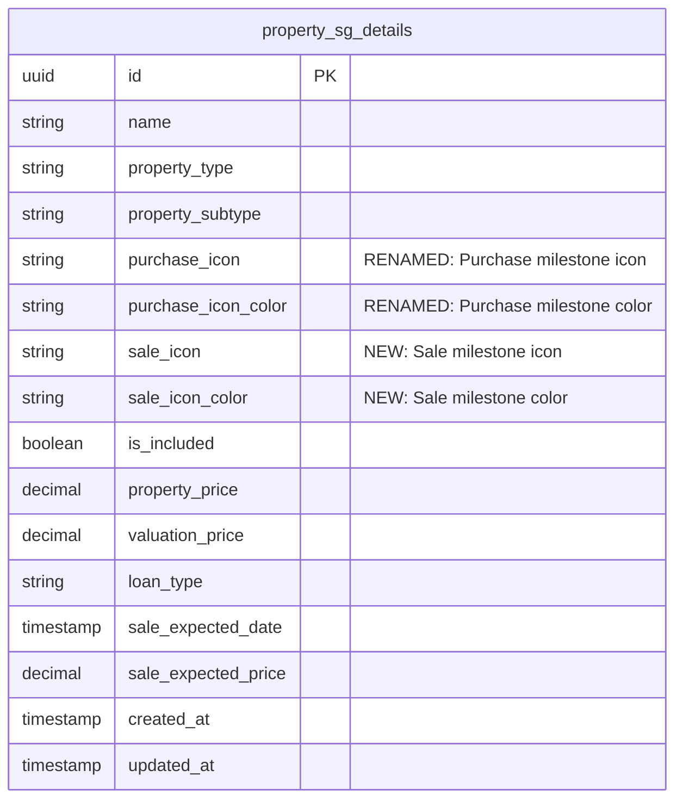
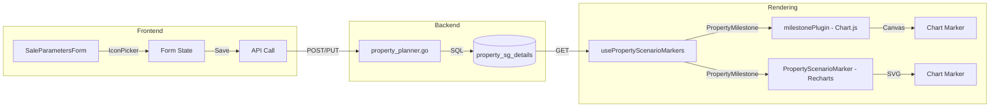
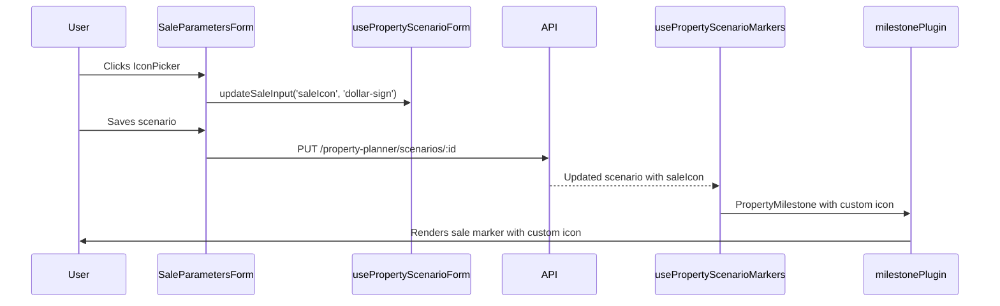

# Property Milestone Icon Customization

**Status:** Backlog
**Priority:** Medium
**Estimated Effort:** 5-7 hours

## Overview

Allow users to select custom icons and colors for both **purchase** and **sale milestones** on the timeline chart. This involves:
1. Renaming existing `icon`/`icon_color` to `purchase_icon`/`purchase_icon_color` for clarity
2. Adding new `sale_icon`/`sale_icon_color` columns (currently hardcoded to `banknote`/`#10b981`)

## Current Behavior

| Milestone Type | Icon Source | Color Source |
|---------------|-------------|--------------|
| Purchase | `propertySG.icon` (user-selected) | `propertySG.iconColor` (user-selected) |
| Sale | Hardcoded: `banknote` | Hardcoded: `#10b981` |
| Fee | `fee.icon` (user-selected) | `fee.iconColor` (user-selected) |

## Proposed Behavior

| Milestone Type | Icon Source | Color Source |
|---------------|-------------|--------------|
| Purchase | **`propertySG.purchaseIcon`** | **`propertySG.purchaseIconColor`** |
| Sale | **`propertySG.saleIcon`** | **`propertySG.saleIconColor`** |
| Fee | `fee.icon` | `fee.iconColor` |

## Database Schema Changes

### Table: `property_sg_details`

**Step 1: Rename existing columns**

```sql
ALTER TABLE property_sg_details
RENAME COLUMN icon TO purchase_icon;

ALTER TABLE property_sg_details
RENAME COLUMN icon_color TO purchase_icon_color;
```

**Step 2: Add sale icon columns**

```sql
ALTER TABLE property_sg_details
ADD COLUMN sale_icon VARCHAR(64) DEFAULT 'banknote',
ADD COLUMN sale_icon_color VARCHAR(16) DEFAULT '#10b981';
```

### ERD (Mermaid)



## Chart Rendering Architecture

The codebase uses **two charting libraries** that share a common data source:

| Library | Component | Rendering |
|---------|-----------|-----------|
| **Chart.js** | `milestonePlugin.ts` | Canvas-based (primary) |
| **Recharts** | `PropertyScenarioMarker.tsx`, `NestedMilestoneMarker` | SVG-based (legacy) |

Both consume marker data from the shared `usePropertyScenarioMarkers` hook, so fixing the hook automatically fixes both renderers.

## Data Flow



## Files to Modify

### Backend (Go)

| File | Changes |
|------|---------|
| `migrations/YYYYMMDDHHMM_add_sale_icon.up.sql` | Add columns |
| `migrations/YYYYMMDDHHMM_add_sale_icon.down.sql` | Drop columns |
| `internal/financial_v2/repository/property_planner.go` | Add fields to structs + SQL |

#### Struct Changes

```go
// PropertySGDetails - rename + add fields
type PropertySGDetails struct {
    // ... existing fields ...
    // RENAMED from Icon/IconColor
    PurchaseIcon      *string `json:"purchaseIcon"`
    PurchaseIconColor *string `json:"purchaseIconColor"`
    // NEW
    SaleIcon          *string `json:"saleIcon"`
    SaleIconColor     *string `json:"saleIconColor"`
}

// UpdatePropertySGInput - rename + add fields
type UpdatePropertySGInput struct {
    // ... existing fields ...
    PurchaseIcon      *string `json:"purchaseIcon"`
    PurchaseIconColor *string `json:"purchaseIconColor"`
    SaleIcon          *string `json:"saleIcon"`
    SaleIconColor     *string `json:"saleIconColor"`
}
```

### Frontend (TypeScript)

| File | Changes |
|------|---------|
| `types/propertyPlannerV2.ts` | Add `saleIcon`, `saleIconColor` to `PropertySGDetails` |
| `app/property-planner/types/index.ts` | Add fields to `SaleInputs` interface |
| `lib/validations/propertyScenario.ts` | Add to Zod schema |
| `components/modals/PropertyPlannerModal/components/SaleParametersForm.tsx` | Add `IconPicker` component |
| `components/modals/PropertyPlannerModal/hooks/usePropertyScenarioForm.ts` | Handle new fields |
| `components/dashboard/projections/usePropertyScenarioMarkers.ts` | Use custom icon instead of hardcoded |

### Type Changes

```typescript
// PropertySGDetails (propertyPlannerV2.ts)
interface PropertySGDetails {
  // ... existing fields ...
  // RENAMED from icon/iconColor
  purchaseIcon?: string | null
  purchaseIconColor?: string | null
  // NEW
  saleIcon?: string | null
  saleIconColor?: string | null
}

// PropertyScenarioFormData - rename form fields
interface PropertyScenarioFormData {
  name: string
  propertyType: PropertyType | null
  // RENAMED from icon/iconColor/iconSearch
  purchaseIcon: string
  purchaseIconColor: string
  purchaseIconSearch: string
  // NEW
  saleIcon: string
  saleIconColor: string
  saleIconSearch: string
  inputs: MortgageInputs
  saleInputs: SaleInputs
}
```

### Files Affected by Rename

The following files reference `icon`/`iconColor` and need updating:

| File | Current | New |
|------|---------|-----|
| `types/propertyPlannerV2.ts` | `icon`, `iconColor` | `purchaseIcon`, `purchaseIconColor` |
| `lib/validations/propertyScenario.ts` | `icon`, `iconColor`, `iconSearch` | `purchaseIcon`, `purchaseIconColor`, `purchaseIconSearch` |
| `PropertyPlannerModal/hooks/usePropertyScenarioForm.ts` | `icon`, `iconColor`, `iconSearch` | `purchaseIcon`, `purchaseIconColor`, `purchaseIconSearch` |
| `PropertyPlannerModal/components/ScenarioDetailView.tsx` | `editingScenarioIcon`, etc. | `editingScenarioPurchaseIcon`, etc. |
| `PropertyPlannerModal/components/ScenarioList.tsx` | `scenario.icon` | `scenario.purchaseIcon` |
| `dashboard/projections/usePropertyScenarioMarkers.ts` | `sgDetails.icon` | `sgDetails.purchaseIcon` |

## UI Changes

### SaleParametersForm - IconPicker Placement

Add an `IconPicker` at the **top of the timing step**, before the date/price fields:

```
┌─────────────────────────────────────────────────────────────┐
│  [1. Timing]  [2. Fees]                    ← Progress Tabs  │
├─────────────────────────────────────────────────────────────┤
│                                                             │
│  ┌──────┐                                                   │
│  │ 💰   │  Sale Milestone Icon              ← NEW SECTION   │
│  └──────┘  Click to customize                               │
│                                                             │
│  ┌─────────────────────┐  ┌─────────────────────┐           │
│  │ Expected Sale Date  │  │ Expected Sale Price │           │
│  │ [  Jan 2035      ▼] │  │ $ [  1,500,000    ] │           │
│  └─────────────────────┘  └─────────────────────┘           │
│                                                             │
│  ┌─────────────────────────────────────────────────────────┐│
│  │ Holding Period                           10.0 years     ││
│  └─────────────────────────────────────────────────────────┘│
└─────────────────────────────────────────────────────────────┘
```

### Implementation

```tsx
// SaleParametersForm.tsx - inside timing step (line ~93)

{currentStep === 'timing' && (
  <div className="space-y-4">
    {/* NEW: Sale Icon Picker */}
    <div className="flex items-center gap-3 p-3 rounded-xl bg-white/[0.02] border border-white/[0.06]">
      <IconPicker
        iconName={saleInputs.saleIcon}
        iconColor={saleInputs.saleIconColor}
        searchQuery={saleIconSearch}
        onIconChange={(icon) => onSaleInputChange('saleIcon', icon)}
        onColorChange={(color) => onSaleInputChange('saleIconColor', color)}
        onSearchChange={setSaleIconSearch}
      />
      <div>
        <span className="text-sm text-white font-medium block">Sale Milestone Icon</span>
        <span className="text-xs text-slate-500">Shown on timeline chart</span>
      </div>
    </div>

    {/* Existing: Date and Price fields */}
    <div className="grid grid-cols-2 gap-4">
      ...
    </div>
  </div>
)}
```

### Props Changes

```tsx
// SaleParametersFormProps - add new props
interface SaleParametersFormProps {
  saleInputs: SaleInputs
  onSaleInputChange: (field: keyof SaleInputs, value: string | number | boolean | FeeItem[]) => void
  saleResult: SaleResult
  propertyPrice: number
  propertyType: PropertyType
  // NEW: Icon picker state
  saleIconSearch: string
  onSaleIconSearchChange: (search: string) => void
}
```

### Comparison: Purchase vs Sale Icon Placement

| Icon | Location | Component |
|------|----------|-----------|
| **Purchase** | Header bar (next to scenario name) | `ScenarioDetailView.tsx:123-130` |
| **Sale** | Inside Sale tab, timing step | `SaleParametersForm.tsx` (new) |

The sale icon is placed **inside** the form rather than in the header because:
1. It's only relevant when viewing the Sale tab
2. It's contextually grouped with other sale parameters
3. The header already has the purchase icon + scenario name

## Component Flow



## Default Values

| Field | Default Value | Rationale |
|-------|---------------|-----------|
| `sale_icon` | `'banknote'` | Current hardcoded value, familiar to existing users |
| `sale_icon_color` | `'#10b981'` | Emerald green, current hardcoded value |

## Migration Strategy

### Database Migration (Single Transaction)

```sql
BEGIN;

-- Step 1: Rename existing columns
ALTER TABLE property_sg_details RENAME COLUMN icon TO purchase_icon;
ALTER TABLE property_sg_details RENAME COLUMN icon_color TO purchase_icon_color;

-- Step 2: Add sale icon columns with defaults
ALTER TABLE property_sg_details
ADD COLUMN sale_icon VARCHAR(64) DEFAULT 'banknote',
ADD COLUMN sale_icon_color VARCHAR(16) DEFAULT '#10b981';

COMMIT;
```

### Deployment Order

⚠️ **Breaking change** - Frontend and backend must be deployed together:

1. **Deploy backend first** with updated Go structs (returns `purchaseIcon` instead of `icon`)
2. **Run migration** to rename columns
3. **Deploy frontend** with updated TypeScript types

### Rollback Plan

```sql
BEGIN;
ALTER TABLE property_sg_details DROP COLUMN IF EXISTS sale_icon;
ALTER TABLE property_sg_details DROP COLUMN IF EXISTS sale_icon_color;
ALTER TABLE property_sg_details RENAME COLUMN purchase_icon TO icon;
ALTER TABLE property_sg_details RENAME COLUMN purchase_icon_color TO icon_color;
COMMIT;
```

## Testing

### Unit Tests
- [ ] Go: Test CRUD operations with new fields
- [ ] Frontend: Test form validation with new fields

### E2E Tests
- [ ] Create property scenario with custom sale icon
- [ ] Verify sale marker renders with custom icon on chart
- [ ] Edit existing scenario, change sale icon, verify update

## Out of Scope

- Purchase icon picker redesign (already exists and works)
- Fee icon persistence changes (already works per-fee)
- Batch icon updates across multiple scenarios
