# Singapore CPF/SRS System Diagrams

This document contains Mermaid diagrams illustrating the interactions and flows within Singapore's personal finance system.

> **⚠️ IMPORTANT**: This document is used for financial projections. All figures must be verified against official CPF sources before use in production calculations.

---

## Quick Reference: 2025 Key Figures

### Contribution Ceilings

| Parameter | 2025 Value | Notes |
|-----------|------------|-------|
| **OW Ceiling** | $7,400/month | Maximum Ordinary Wages subject to CPF |
| **AW Ceiling** | $102,000 - YTD OW | Additional Wages ceiling (annual) |
| **Total Wage Ceiling** | $102,000/year | Maximum total wages subject to CPF |

### Retirement Sums (Cohort turning 55 in 2025)

| Sum | Amount | Purpose |
|-----|--------|---------|
| **BRS** (Basic) | $106,500 | Minimum for property pledge option |
| **FRS** (Full) | $213,000 | Standard requirement (2 × BRS) |
| **ERS** (Enhanced) | $426,000 | Maximum top-up for higher payouts (4 × BRS) |

### Healthcare

| Parameter | 2025 Value | Notes |
|-----------|------------|-------|
| **BHS** (Basic Healthcare Sum) | $71,500 | MediSave cap - excess spills over |

### Interest Rates

| Account | Base Rate | Extra Interest |
|---------|-----------|----------------|
| **OA** | 2.5% p.a. | +1% on first $20K (within $60K combined) |
| **SA** | 4.0% p.a. | +1% on first $60K combined |
| **MA** | 4.0% p.a. | +1% on first $60K combined |
| **RA** | 4.0% p.a. | +2% on first $30K, +1% on next $30K |

### SRS Contribution Caps

| Status | Annual Cap |
|--------|------------|
| Singapore Citizen/PR | $15,300 |
| Foreigner | $35,700 |

---

## Glossary of CPF Terms

| Acronym | Full Name | Description |
|---------|-----------|-------------|
| **CPF** | Central Provident Fund | Singapore's mandatory social security savings scheme |
| **OA** | Ordinary Account | For housing, education, investment, insurance. Earns 2.5% p.a. |
| **SA** | Special Account | For retirement. Earns 4% p.a. Locked until 55 |
| **MA** | MediSave Account | For healthcare expenses. Earns 4% p.a. |
| **RA** | Retirement Account | Created at 55 from SA+OA. For CPF LIFE |
| **BRS** | Basic Retirement Sum | Minimum retirement savings ($106,500 in 2025) |
| **FRS** | Full Retirement Sum | Standard retirement target ($213,000 in 2025) |
| **ERS** | Enhanced Retirement Sum | Maximum for higher payouts ($426,000 in 2025) |
| **BHS** | Basic Healthcare Sum | MediSave cap ($71,500 in 2025) |
| **VL** | Valuation Limit | min(Purchase Price, Valuation) - first CPF usage tier |
| **WL** | Withdrawal Limit | 120% × VL - maximum CPF for property (bank loan) |
| **OW** | Ordinary Wages | Regular monthly salary (capped at $7,400) |
| **AW** | Additional Wages | Bonus, commission, etc. (capped at $102,000 - YTD OW) |
| **CPFIS** | CPF Investment Scheme | Invest OA/SA in approved products |
| **SRS** | Supplementary Retirement Scheme | Voluntary tax-advantaged savings |
| **AWL** | Additional Withdrawal Limits | Annual MediSave limit for insurance premiums |
| **RSTU** | Retirement Sum Topping-Up | Cash top-up scheme with tax relief |
| **CPF LIFE** | CPF Lifelong Income For the Elderly | National annuity scheme from RA |

---

## 1. System Overview: Account Relationships

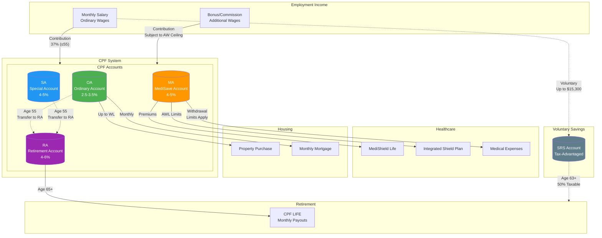

---

## 2. Monthly CPF Contribution Flow

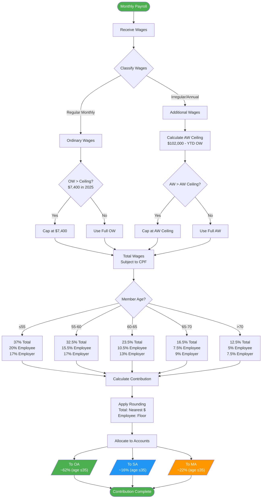

---

## 3. CPF Account Allocation by Age

### Complete Contribution & Allocation Rates (2025)

| Age Group | Total Rate | Employee | Employer | OA | SA | MA |
|-----------|------------|----------|----------|----|----|-----|
| **≤35** | 37% | 20% | 17% | 23% | 6% | 8% |
| **36-45** | 37% | 20% | 17% | 21% | 7% | 9% |
| **46-50** | 37% | 20% | 17% | 19% | 8% | 10% |
| **51-55** | 37% | 20% | 17% | 15% | 11.5% | 10.5% |
| **56-60** | 29.5% | 15% | 14.5% | 12% | 3.5% | 10.5% |
| **61-65** | 20.5% | 9.5% | 11% | 3.5% | 2.5% | 10.5% |
| **66-70** | 16.5% | 7.5% | 9% | 3.5% | 1% | 8% |
| **>70** | 12.5% | 5% | 7.5% | 1% | 1% | 5.5% |

*Note: OA/SA/MA columns show % of total wages, not % of contribution.*

### Allocation Percentages (of Total Contribution)

| Age Group | OA % | SA % | MA % |
|-----------|------|------|------|
| **≤35** | 62.16% | 16.22% | 21.62% |
| **36-45** | 56.76% | 18.92% | 24.32% |
| **46-50** | 51.35% | 21.62% | 27.03% |
| **51-55** | 40.54% | 31.08% | 28.38% |
| **56-60** | 40.68% | 11.86% | 35.59% |
| **61-65** | 17.07% | 12.20% | 51.22% |
| **66-70** | 21.21% | 6.06% | 48.48% |
| **>70** | 8.00% | 8.00% | 44.00% |

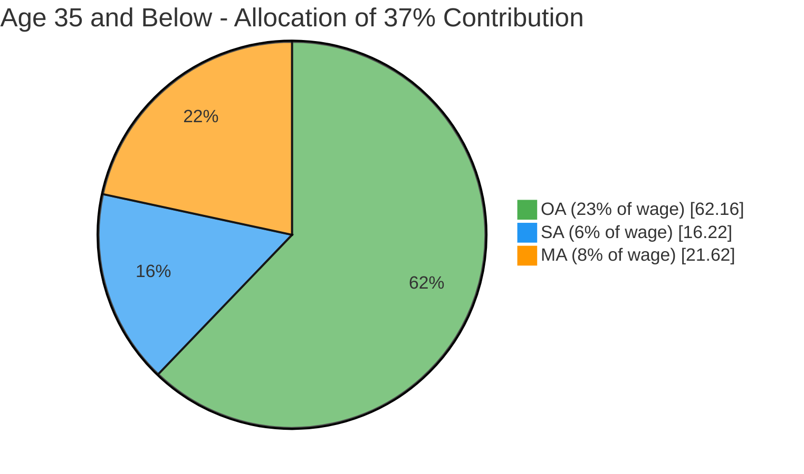

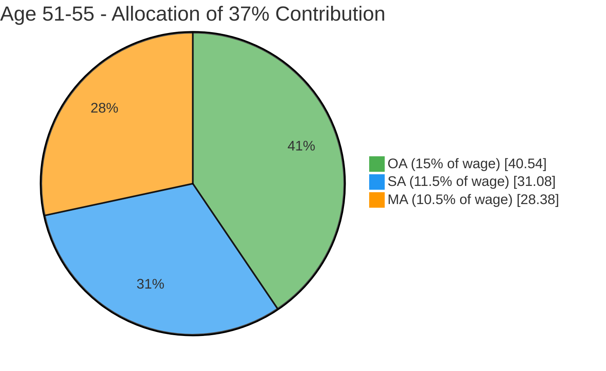

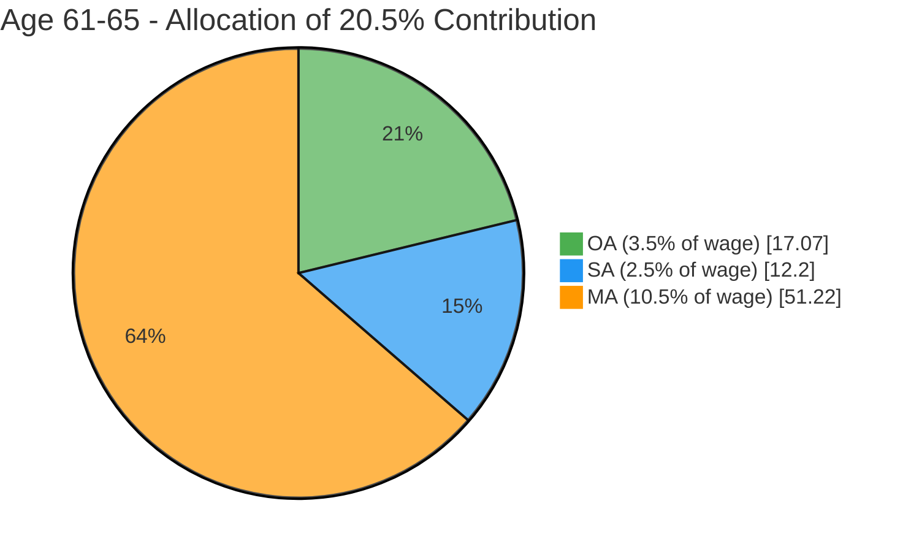

### Key Observations

1. **OA decreases with age** - From 23% (≤35) to 1% (>70)
2. **SA peaks at 51-55** - 11.5% before RA creation at 55
3. **MA stays relatively stable** - Around 8-10.5% throughout working life
4. **Total rate drops after 55** - From 37% to 29.5%, then 20.5%, 16.5%, 12.5%
5. **After 55, no more SA** - SA closes, contributions go to RA instead

---

## 4. MediSave BHS Spillover Logic

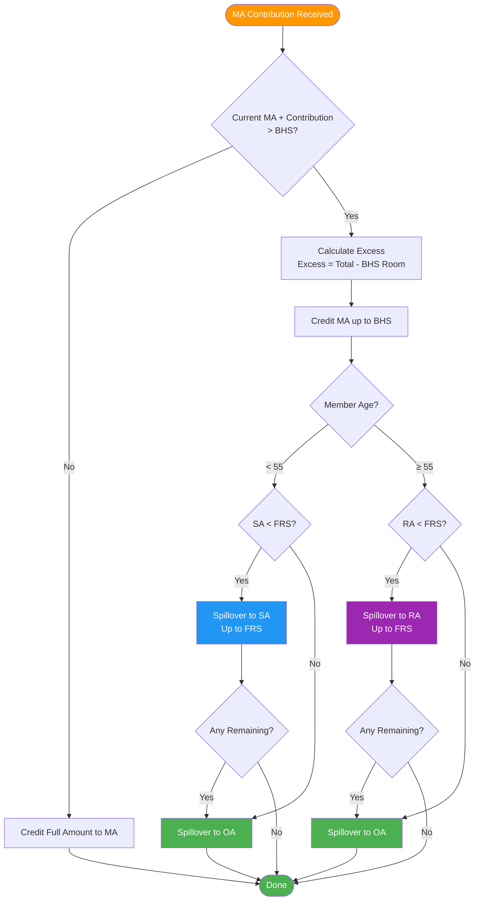

---

## 5. Age 55: Retirement Account Creation

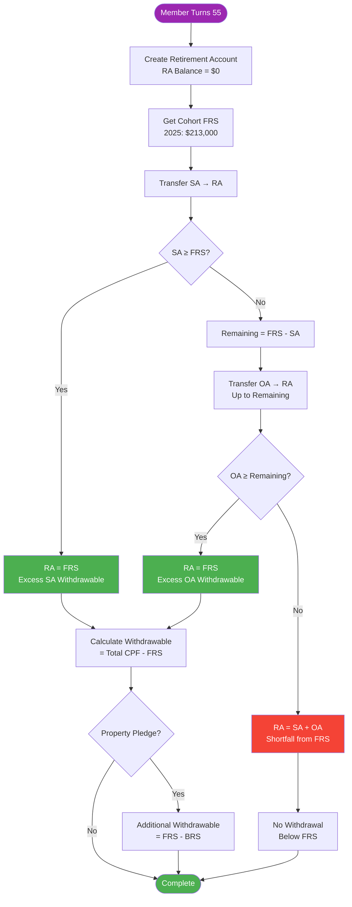

---

## 6. CPF Interest Calculation

### Base Interest Rates

| Account | Base Rate | Floor Rate | Notes |
|---------|-----------|------------|-------|
| **OA** | 2.5% p.a. | 2.5% | Pegged to 3-month average of major local banks' rates |
| **SA** | 4.0% p.a. | 4.0% | = 12-month average yield of 10-year SGS + 1% |
| **MA** | 4.0% p.a. | 4.0% | Same as SA |
| **RA** | 4.0% p.a. | 4.0% | Same as SA |

### Extra Interest Scheme

**For members below 55:**
| Tier | Eligible Balance | Extra Rate | Where Credited |
|------|-----------------|------------|----------------|
| First $60,000 | OA (max $20K) + SA + MA | +1% p.a. | SA |

**For members 55 and above:**
| Tier | Eligible Balance | Extra Rate | Where Credited |
|------|-----------------|------------|----------------|
| First $30,000 | OA (max $20K) + SA + MA + RA | +2% p.a. | RA |
| Next $30,000 | OA (max $20K) + SA + MA + RA | +1% p.a. | RA |

### Effective Interest Rates Summary

| Age | OA (first $20K) | OA (above $20K) | SA | MA | RA |
|-----|-----------------|-----------------|----|----|-----|
| **< 55** | 3.5% | 2.5% | 5.0% | 5.0% | N/A |
| **55-65** | 6.0% (first $30K) | 2.5% | 6.0% | 6.0% | 6.0% |
| **> 65** | 6.0% (first $30K) | 2.5% | 6.0% | 6.0% | 6.0% |

*Note: Extra interest calculation order is OA → SA → MA → RA*

### Calculation Example (Age 40)

```
Balances: OA $50,000, SA $30,000, MA $20,000

Step 1: Calculate combined for extra interest
- OA eligible: min($50K, $20K) = $20,000
- Combined: $20K + $30K + $20K = $70,000
- First $60K gets extra 1%

Step 2: Base interest
- OA: $50,000 × 2.5% = $1,250
- SA: $30,000 × 4.0% = $1,200
- MA: $20,000 × 4.0% = $800

Step 3: Extra interest (credited to SA)
- Extra = $60,000 × 1% = $600 → SA

Total Annual Interest:
- OA: $1,250
- SA: $1,200 + $600 = $1,800
- MA: $800
- Total: $3,850 (effective ~3.85%)
```

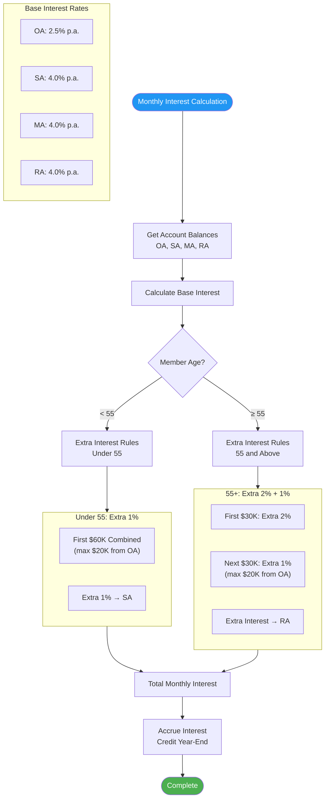

---

## 7. CPF Housing Usage Flow

### Key Terms

| Term | Full Name | Definition |
|------|-----------|------------|
| **VL** | Valuation Limit | Lower of purchase price or property valuation |
| **WL** | Withdrawal Limit | Maximum CPF that can be used = 120% × VL |
| **BRS** | Basic Retirement Sum | $106,500 (2025) - minimum needed before using CPF beyond VL |

### VL and WL Explained

**Valuation Limit (VL)** = min(Purchase Price, Market Valuation)
- Example: Price $500K, Valuation $480K → VL = $480K

**Withdrawal Limit (WL)** = VL × 120%
- Example: VL $480K → WL = $576K
- The extra 20% (VL to WL) requires meeting BRS first

### Usage Rules by Property & Loan Type

| Property Type | Loan Type | CPF Usage Limit | BRS Requirement |
|--------------|-----------|-----------------|-----------------|
| **BTO (New HDB)** | HDB Loan | No limit | None |
| **HDB Resale** | HDB Loan | Beyond VL allowed | Must meet BRS |
| **HDB Resale** | Bank Loan | Up to WL (120% VL) | Must meet BRS for VL→WL |
| **Private** | Bank Loan | Up to WL (120% VL) | Must meet BRS for VL→WL |

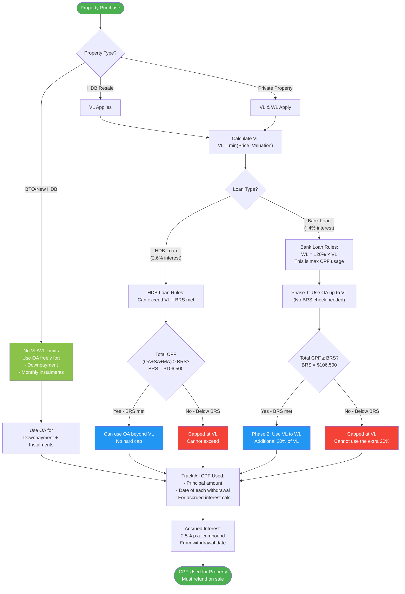

### Worked Example: Bank Loan on Private Property

```
Purchase Price: $1,000,000
Valuation: $950,000
Your CPF OA: $200,000
Your Total CPF (OA+SA+MA): $280,000

VL = min($1,000,000, $950,000) = $950,000
WL = $950,000 × 120% = $1,140,000

Since Total CPF ($280,000) > BRS ($106,500):
✓ Can use full OA up to WL ($1,140,000)
✓ But you only have $200,000 OA, so use all $200K

If Total CPF was only $80,000 (below BRS):
✗ Can only use OA up to VL ($950,000)
✗ Cannot access the extra 20% (VL to WL)
```

---

## 8. Property Sale: Accrued Interest Refund

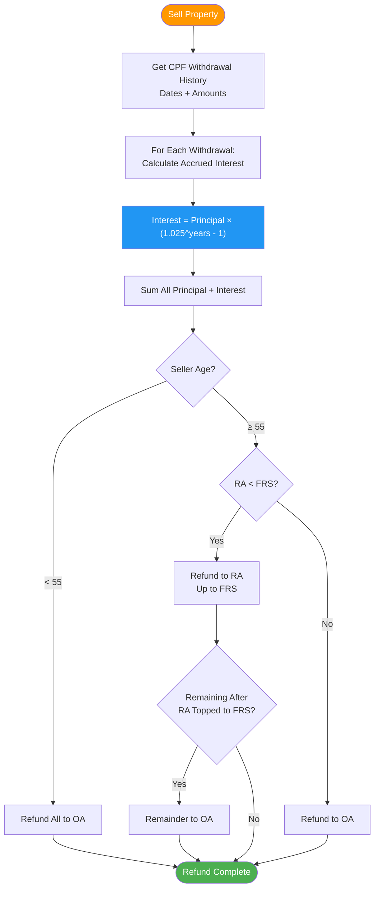

---

## 9. CPF LIFE Payout Flow

### CPF LIFE Overview

| Criteria | Details |
|----------|---------|
| **Eligibility** | Singapore Citizens/PRs with RA ≥ $60,000 at age 65 |
| **Auto-enrollment** | Yes, if RA ≥ $60,000 |
| **Payout Start** | Age 65 (can defer up to 70) |
| **Payout Duration** | Lifelong (until death) |
| **Bequest** | Remaining annuity premium to beneficiaries |

### Three CPF LIFE Plans Compared

| Feature | Standard | Basic | Escalating |
|---------|----------|-------|------------|
| **Monthly Payout** | Highest | Lower | Lowest initially |
| **Bequest** | Lower | Highest | Medium |
| **Payout Pattern** | Level (fixed) | Level (fixed) | +2% yearly |
| **Best For** | Maximize income | Leave more to family | Inflation protection |

### Approximate Payout Factors (per $1,000 of RA balance)

*These are estimates - actual rates depend on cohort and prevailing interest rates*

| Start Age | Standard ($/month) | Basic ($/month) | Escalating ($/month) |
|-----------|-------------------|-----------------|---------------------|
| **65** | $5.50 | $5.00 | $4.40 |
| **66** | $5.90 | $5.40 | $4.70 |
| **67** | $6.30 | $5.80 | $5.00 |
| **68** | $6.80 | $6.20 | $5.40 |
| **69** | $7.30 | $6.70 | $5.80 |
| **70** | $7.90 | $7.20 | $6.30 |

**Example**: RA balance $200,000, Standard plan at age 65:
- Monthly payout ≈ $200K ÷ $1K × $5.50 = **$1,100/month**

### Deferral Bonus

| Defer From 65 To | Payout Increase |
|------------------|-----------------|
| 66 | +7% |
| 67 | +14% |
| 68 | +21% |
| 69 | +28% |
| 70 | +35% |

*Approximately 7% increase per year of deferral*

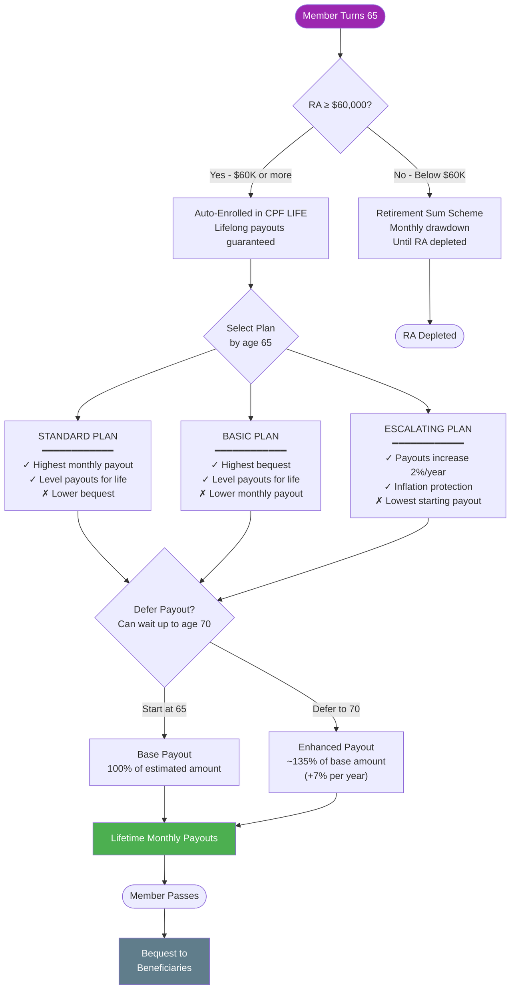

---

## 10. SRS Contribution & Withdrawal Flow

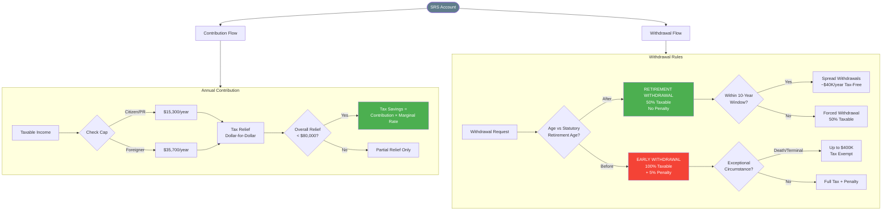

---

## 11. Healthcare Financing Flow

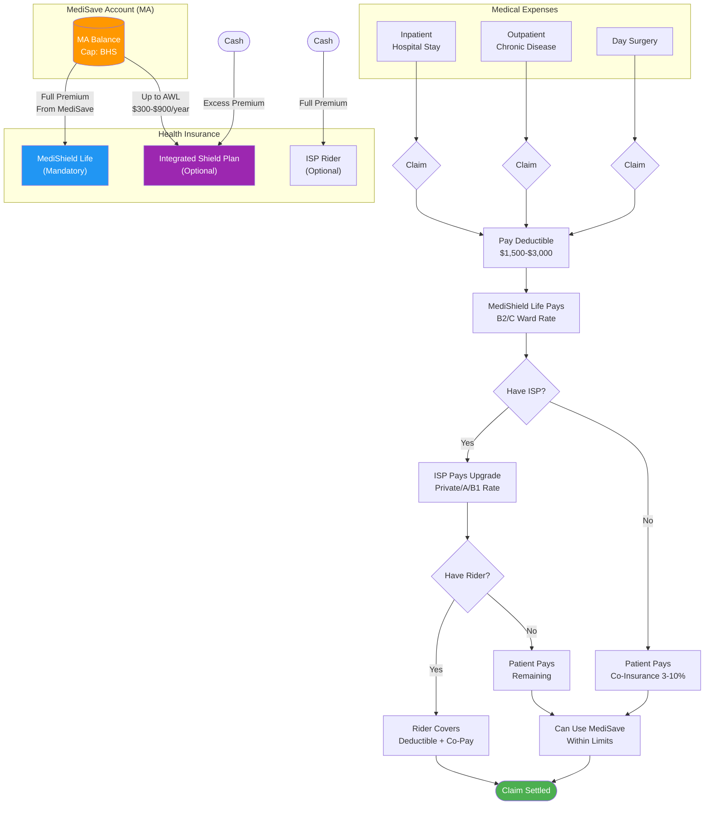

---

## 12. Complete Lifecycle: Age Progression

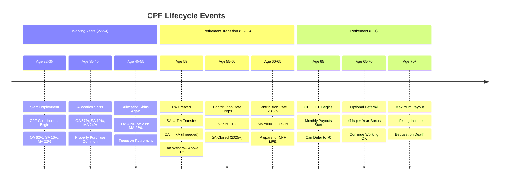

---

## 13. Data Flow: Simulation Engine

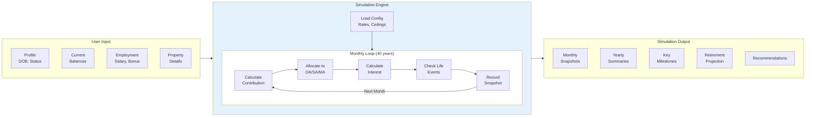

---

## 14. Scenario Comparison

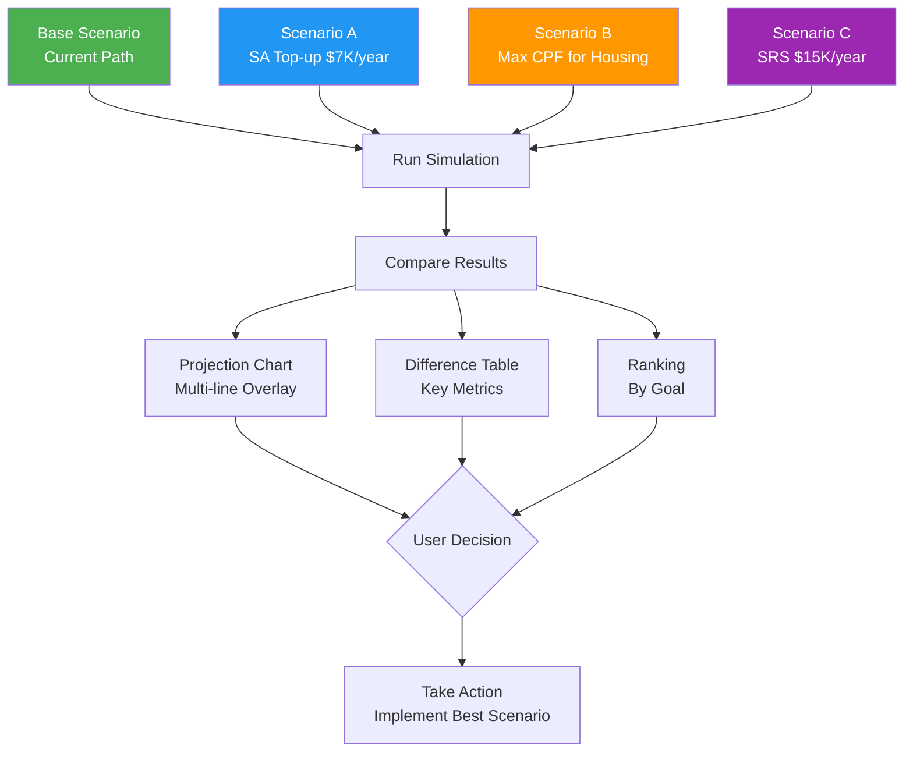

---

## 15. CPFIS Investment Flow

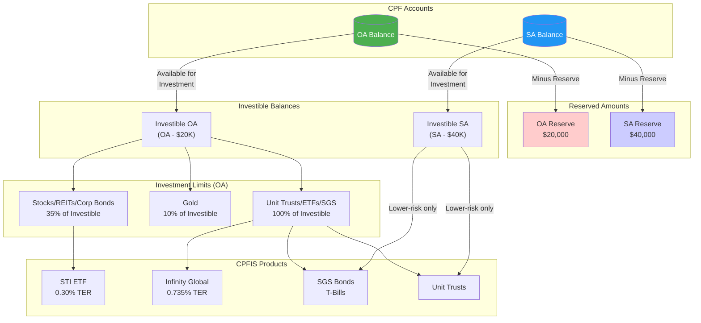

---

## 16. SA Shielding Strategy Timeline

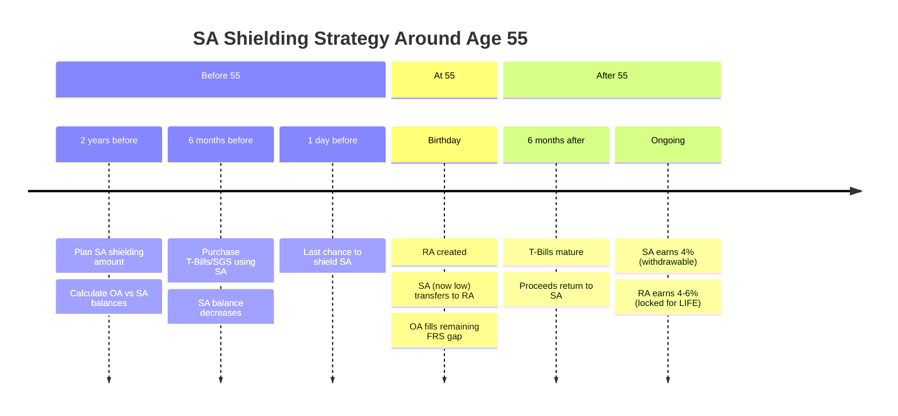

---

## 17. SA Shielding Decision Flow

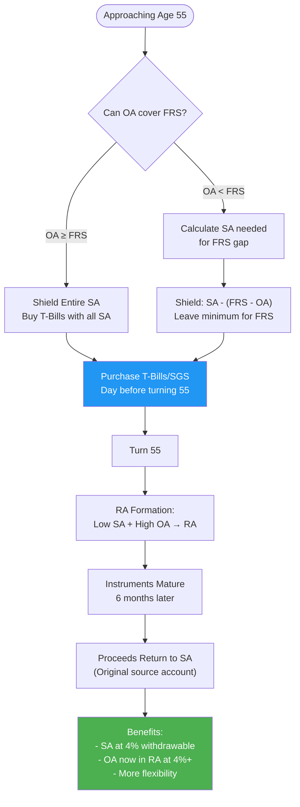

---

## 18. OA to SA Transfer and Top-up Flow

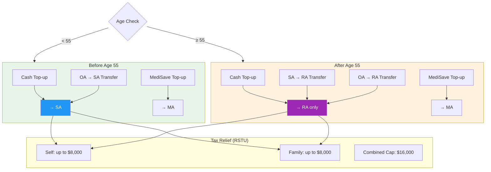

---

## 19. CPF Education Scheme Flow

```mermaid
flowchart TD
    OA[("OA Balance")] --> WITHDRAW["Withdraw for Education"]

    WITHDRAW --> ELIGIBLE{Eligible Course?}

    ELIGIBLE --> |"NUS/NTU/SMU/etc"| APPROVED[Approved]
    ELIGIBLE --> |"Not eligible"| REJECTED[Rejected]

    APPROVED --> DISBURSE["Funds Disbursed<br/>Interest starts accruing<br/>@ 2.5% p.a."]

    DISBURSE --> STUDY["Complete Studies"]

    STUDY --> REPAY["Repay over 12 years<br/>Min $100/month"]

    REPAY --> OA_RETURN["Repayments return<br/>to own OA"]

    subgraph Waiver["Loan Waiver Eligibility"]
        AGE55["Age 55+"]
        FRS_MET["RA ≥ FRS"]
        WAIVER["Loan Waived!"]
    end

    REPAY --> |"Check eligibility"| AGE55
    AGE55 --> FRS_MET
    FRS_MET --> WAIVER

    style OA fill:#4CAF50,color:#fff
    style WAIVER fill:#9C27B0,color:#fff
    style OA_RETURN fill:#4CAF50,color:#fff
```

---

## 20. Property Sale with CPF Refund (Detailed)

```mermaid
flowchart TD
    SALE([Property Sale Initiated]) --> CALC_PROCEEDS["Calculate Sale Proceeds<br/>Sale Price - Outstanding Loan"]

    CALC_PROCEEDS --> CALC_COSTS["Deduct Selling Costs<br/>Agent Commission + Legal Fees"]

    CALC_COSTS --> CALC_CPF["Calculate CPF Refund Required"]

    subgraph CPF_Refund["CPF Refund Calculation"]
        PRINCIPAL["OA Principal Used<br/>(Downpayment + Instalments)"]
        ACCRUED["+ Accrued Interest<br/>(2.5% compound)"]
        TOTAL_REF["= Total Refund Required"]
    end

    CALC_CPF --> PRINCIPAL
    PRINCIPAL --> ACCRUED
    ACCRUED --> TOTAL_REF

    TOTAL_REF --> AGE_CHECK{Member's Age?}

    AGE_CHECK --> |"< 55"| TO_OA["Full Refund → OA"]
    AGE_CHECK --> |"≥ 55"| TO_RA_FIRST["Refund → RA first<br/>(up to FRS)"]

    TO_RA_FIRST --> RA_FULL{RA reached FRS?}
    RA_FULL --> |"Yes, or excess"| REMAINDER["Remainder → OA"]
    RA_FULL --> |"No"| ALL_TO_RA["All to RA"]

    TO_OA --> NET["Calculate Net Cash Proceeds"]
    REMAINDER --> NET
    ALL_TO_RA --> NET

    NET --> SHORTFALL{Shortfall?}
    SHORTFALL --> |"Yes"| CASH_TOPUP["No cash top-up required<br/>if sold at market value"]
    SHORTFALL --> |"No"| RECEIVE["Receive Cash Proceeds"]

    style TO_OA fill:#4CAF50,color:#fff
    style TO_RA_FIRST fill:#9C27B0,color:#fff
    style REMAINDER fill:#4CAF50,color:#fff
```

---

## 21. Accrued Interest Accumulation

```mermaid
xychart-beta
    title "Accrued Interest Growth Over 25 Years (Example: $200K OA Used)"
    x-axis [Y1, Y5, Y10, Y15, Y20, Y25]
    y-axis "Amount ($)" 0 --> 400000
    bar [200000, 200000, 200000, 200000, 200000, 200000]
    line [205000, 226000, 256000, 291000, 330000, 375000]
```

*Note: Bar = Principal Used, Line = Total Refund Required (Principal + Accrued Interest)*

---

## Summary: Key Account Interactions

### CPF Flow Summary Table

| From | To | Trigger | Amount/Limit | BRS Requirement |
|------|-----|---------|--------------|-----------------|
| **Employment** | OA/SA/MA | Monthly payroll | Based on age rates & OW/AW ceilings | N/A |
| **MA** | SA/RA | MA > BHS ($71,500) | Spillover excess | N/A |
| **MA** | OA | MA > BHS, SA/RA ≥ FRS | Remaining spillover | N/A |
| **OA** | BTO Property | Purchase/instalment | No limit | None |
| **OA** | HDB Resale (HDB Loan) | Purchase/instalment | Beyond VL allowed | Must meet BRS |
| **OA** | HDB Resale/Private (Bank Loan) | Purchase/instalment | Up to VL freely | None for VL |
| **OA** | HDB Resale/Private (Bank Loan) | Purchase/instalment | VL to WL (extra 20%) | Must meet BRS |
| **OA** | RA | Age 55 | To fill FRS gap | N/A (automatic) |
| **SA** | RA | Age 55 | Full SA transfers | N/A (automatic) |
| **RA** | CPF LIFE | Age 65 | Annuity premium | RA ≥ $60K |
| **CPF LIFE** | Member | Age 65+ | Monthly payout (lifelong) | N/A |
| **Property Sale** | OA (< 55) | Sale completed | Principal + accrued interest | N/A |
| **Property Sale** | RA then OA (≥ 55) | Sale completed | Fill RA to FRS first | N/A |
| **Income** | SRS | Voluntary | Up to $15,300/$35,700 | N/A |
| **SRS** | Member | Age 63+ | 50% taxable withdrawal | N/A |
| **OA** | CPFIS | Voluntary | OA - $20K reserve | N/A |
| **SA** | CPFIS | Voluntary | SA - $40K reserve (low risk only) | N/A |
| **Cash** | SA (< 55) | Top-up | Up to FRS, $8K tax relief | N/A |
| **Cash** | RA (≥ 55) | Top-up | Up to ERS, $8K tax relief | N/A |
| **OA** | SA (< 55) | Transfer | Up to FRS, $8K tax relief | N/A |
| **OA** | Education | Loan | Course fees, 2.5% accrued interest | N/A |

### Housing CPF Usage Quick Reference

| Scenario | Max CPF Usage | BRS Check Required? |
|----------|---------------|---------------------|
| BTO (New HDB) | No limit | No |
| HDB Resale + HDB Loan | Beyond VL | Yes - for beyond VL |
| HDB Resale + Bank Loan | VL | No |
| HDB Resale + Bank Loan | VL to WL (+20%) | Yes - for VL→WL |
| Private + Bank Loan | VL | No |
| Private + Bank Loan | VL to WL (+20%) | Yes - for VL→WL |

**VL** = min(Price, Valuation)
**WL** = VL × 120%
**BRS** = $106,500 (2025)

---

---

## 22. CPF Lifecycle & Concept Interactions (Comprehensive Overview)

This diagram shows how all CPF concepts interact across the entire lifecycle from employment to retirement.

```mermaid
flowchart TB
    subgraph Employment["💼 Employment Phase (Before 55)"]
        Salary[Monthly Salary] --> |"Employee: 20%<br/>Employer: 17%"| CPF[Total CPF Contribution]
        CPF --> |"23% of wage"| OA[Ordinary Account<br/>2.5% p.a.]
        CPF --> |"6% of wage"| SA[Special Account<br/>4% p.a.]
        CPF --> |"8% of wage"| MA[MediSave Account<br/>4% p.a.]
    end

    subgraph OA_Uses["OA Usage"]
        OA --> |"Housing"| HDB[HDB Purchase<br/>Down payment + Loan]
        OA --> |"Education"| EDU[Education<br/>Approved institutions]
        OA --> |"Investment"| CPFIS_OA[CPFIS-OA<br/>Stocks, Unit Trusts]
        OA --> |"Voluntary"| SA_TopUp[Top-up to SA<br/>Tax relief up to $8k]
    end

    subgraph SA_Uses["SA Usage"]
        SA --> |"Investment"| CPFIS_SA[CPFIS-SA<br/>Lower risk only]
        SA --> |"Cannot withdraw"| SA_Lock[Locked until 55]
    end

    subgraph MA_Uses["MA Usage"]
        MA --> |"Healthcare"| Medical[Medical Bills<br/>Hospitalization]
        MA --> |"Insurance"| Shield[MediShield Life<br/>+ Integrated Plans]
        MA --> |"Cap"| BHS[Basic Healthcare Sum<br/>$71,500 in 2025]
    end

    subgraph Age55["🎂 At Age 55"]
        SA --> |"Transfers to"| RA[Retirement Account<br/>4% p.a.]
        OA --> |"Tops up RA to FRS"| RA

        RA --> |"Must meet"| FRS[Full Retirement Sum<br/>$213,000 in 2025]

        OA --> |"If FRS met"| Withdraw55[Withdraw Excess OA]
        OA --> |"If FRS not met"| NoWithdraw[Cannot Withdraw<br/>Must top up RA]
    end

    subgraph Retirement["🏖️ Retirement Phase (55+)"]
        RA --> |"Option 1"| CPFLIFE[CPF LIFE<br/>Lifelong payouts from 65]
        RA --> |"Option 2"| RS[Retirement Sum Scheme<br/>Fixed period payouts]

        CPFLIFE --> Standard[Standard Plan<br/>Higher payout]
        CPFLIFE --> Basic[Basic Plan<br/>Higher bequest]
        CPFLIFE --> Escalating[Escalating Plan<br/>+2% yearly]
    end

    subgraph Schemes["Key Retirement Sums"]
        BRS[Basic Retirement Sum<br/>$106,500] --> |"Half of FRS"| FRS
        FRS --> |"Double of BRS"| ERS[Enhanced Retirement Sum<br/>$426,000]
    end

    subgraph Death["Upon Death"]
        OA --> |"Nominee"| Beneficiary[Beneficiaries]
        SA --> |"Nominee"| Beneficiary
        MA --> |"Nominee"| Beneficiary
        RA --> |"Bequest"| Beneficiary
    end

    subgraph Special["Special Schemes"]
        OA --> |"Property pledge"| Pledge[Property Pledge<br/>Use property to meet FRS]
        SA --> |"Before 55"| Shield_SA[SA Shielding<br/>Transfer to spouse/invest]
        RA --> |"Top-up"| RSTU[Retirement Sum Top-up<br/>Tax relief up to $8k]
    end

    style OA fill:#3b82f6,color:#fff
    style SA fill:#10b981,color:#fff
    style MA fill:#f59e0b,color:#fff
    style RA fill:#8b5cf6,color:#fff
    style FRS fill:#ef4444,color:#fff
    style BRS fill:#f97316,color:#fff
    style ERS fill:#dc2626,color:#fff
    style CPFLIFE fill:#06b6d4,color:#fff
```

### Key Lifecycle Summary

| Age | What Happens |
|-----|--------------|
| Working | Contributions split into OA (23%), SA (6%), MA (8%) |
| Before 55 | OA for housing/education, SA locked, MA for healthcare |
| At 55 | SA closes → transfers to RA. OA tops up RA to meet FRS |
| 55+ | Can withdraw OA excess only if FRS is met in RA |
| 65+ | CPF LIFE payouts begin from RA |

### Critical Rules

1. **FRS is mandatory** - Must have $213k (2025) in RA before any OA withdrawal at 55
2. **SA → RA is automatic** - No choice at age 55, entire SA transfers to RA
3. **OA → RA is forced** - If SA transfer doesn't meet FRS, OA must top up
4. **Property counts** - Can pledge property value toward FRS requirement
5. **No early SA withdrawal** - SA is completely locked until 55 (except CPFIS investments)
6. **MA has BHS cap** - Excess spills over to SA/RA, then OA

---

## 23. CPF Integration with Assetra Core Modules

This section maps how CPF events interact with Assetra's core financial data models for projection calculations.

### Assetra Core Entities Reference

| Entity | Description | Key Fields |
|--------|-------------|------------|
| **CashAccount** | User's bank savings/checking | `balance`, `interestRate`, `isAccumulator` |
| **Income** | Salary, bonus, dividends | `amount`, `frequency`, `category`, `growthRate` |
| **Expense** | Monthly/annual spending | `amount`, `frequency`, `category`, `growthRate` |
| **Asset** | Property, investments, etc. | `currentValue`, `annualGrowthRate`, `category` |
| **Liability** | Mortgages, loans, debts | `currentBalance`, `interestRateApr`, `minimumPayment` |
| **PropertyScenario** | HDB/Condo/Landed details | `propertyPrice`, `downPayment`, `loanAmount`, `loanTenure` |
| **ScenarioEvent** | Life events with impacts | `occursOn`, `impacts[]` on above entities |

---

### 23.1 CPF ↔ Assetra Integration Map

```mermaid
flowchart TB
    subgraph Assetra["Assetra Core Modules"]
        CASH[("CashAccount<br/>Bank Savings")]
        INCOME[("Income<br/>Salary/Bonus")]
        EXPENSE[("Expense<br/>Monthly Bills")]
        ASSET[("Asset<br/>Properties/Investments")]
        LIABILITY[("Liability<br/>Mortgages/Loans")]
        TIMELINE[("Timeline<br/>Net Worth Projection")]
    end

    subgraph CPF["CPF Accounts"]
        OA[("OA<br/>Ordinary Account")]
        SA[("SA<br/>Special Account")]
        MA[("MA<br/>MediSave Account")]
        RA[("RA<br/>Retirement Account")]
    end

    subgraph Events["Life Events / Triggers"]
        E1[Monthly Salary]
        E2[Buy Property]
        E3[Medical Bill]
        E4[Turn 55]
        E5[Turn 65]
        E6[Sell Property]
        E7[Top-up CPF]
        E8[CPFIS Investment]
    end

    %% Salary flows
    E1 --> |"Employee 20%"| CASH
    E1 --> |"→ OA/SA/MA"| CPF
    INCOME --> |"Gross Salary"| E1

    %% Property purchase
    E2 --> |"Cash portion"| CASH
    E2 --> |"OA for downpayment"| OA
    E2 --> |"OA for monthly"| OA
    E2 --> |"Create Asset"| ASSET
    E2 --> |"Create Liability"| LIABILITY

    %% Medical
    E3 --> |"MA withdrawal"| MA
    E3 --> |"Cash if MA insufficient"| CASH
    E3 --> |"Create Expense"| EXPENSE

    %% Age 55
    E4 --> |"SA → RA"| RA
    E4 --> |"OA → RA"| RA
    E4 --> |"Withdraw excess → Cash"| CASH

    %% Age 65
    E5 --> |"CPF LIFE payout"| RA
    RA --> |"Monthly income"| INCOME
    RA --> |"→ Cash"| CASH

    %% Property sale
    E6 --> |"Refund OA+interest"| OA
    E6 --> |"Net proceeds → Cash"| CASH
    E6 --> |"Remove Asset"| ASSET
    E6 --> |"Clear Liability"| LIABILITY

    %% Top-ups
    E7 --> |"Cash → SA/RA"| CASH
    E7 --> |"Tax relief"| EXPENSE

    %% CPFIS
    E8 --> |"OA → Investment"| OA
    E8 --> |"SA → Investment"| SA
    E8 --> |"Create Asset"| ASSET

    style CASH fill:#4CAF50,color:#fff
    style OA fill:#3b82f6,color:#fff
    style SA fill:#10b981,color:#fff
    style MA fill:#f59e0b,color:#fff
    style RA fill:#8b5cf6,color:#fff
```

---

### 23.2 Complete CPF Use Case → Assetra Impact Matrix

#### Employment & Contributions

| Use Case | Trigger | CPF Impact | Assetra Impact |
|----------|---------|------------|----------------|
| **Monthly Salary** | Payroll | OA ↑, SA ↑, MA ↑ | `Income` (gross), `CashAccount` ↑ (take-home) |
| **Annual Bonus** | Year-end | OA ↑, SA ↑, MA ↑ (subject to AW ceiling) | `Income` (bonus), `CashAccount` ↑ |
| **Salary Increase** | Promotion | Higher contributions | `Income.amount` ↑, `Income.growthRate` adjustment |
| **Job Loss** | Retrenchment | Contributions stop | `Income` end date set, `CashAccount` drawdown |

#### Housing (Property Purchase)

| Use Case | Trigger | CPF Impact | Assetra Impact |
|----------|---------|------------|----------------|
| **BTO Purchase** | Buy HDB | OA ↓ (downpayment + monthly) | `Asset` created (property), `Liability` created (HDB loan), `CashAccount` ↓ (cash portion) |
| **HDB Resale Purchase** | Buy resale | OA ↓ (up to VL/WL) | `Asset` created, `Liability` created, `CashAccount` ↓, `PropertyLink` created |
| **Private Property** | Buy condo/landed | OA ↓ (up to WL, need BRS) | `Asset` created, `Liability` created, `CashAccount` ↓ (larger cash portion) |
| **Monthly Mortgage (CPF)** | Loan servicing | OA ↓ monthly | No cash impact (unless OA insufficient) |
| **Monthly Mortgage (Cash)** | OA insufficient | OA depleted | `CashAccount` ↓, `Expense` created |
| **Property Sale** | Sell property | OA ↑ (refund + accrued interest) | `Asset` removed, `Liability` cleared, `CashAccount` ↑ (net proceeds) |
| **Refinancing** | Switch loan | Accrued interest continues | `Liability` updated (new terms) |

#### Healthcare (MediSave)

| Use Case | Trigger | CPF Impact | Assetra Impact |
|----------|---------|------------|----------------|
| **MediShield Life Premium** | Annual | MA ↓ (auto-deducted) | No cash impact |
| **Integrated Shield Plan** | Annual | MA ↓ (up to AWL), Cash ↓ (excess) | `Expense` created (insurance), `CashAccount` ↓ |
| **ISP Rider** | Annual | No MA usage | `Expense` created, `CashAccount` ↓ |
| **Hospitalization** | Medical event | MA ↓ (within limits) | `Expense` created (co-pay), `CashAccount` ↓ |
| **Outpatient (Chronic)** | Regular treatment | MA ↓ (CHAS limits) | `Expense` created, `CashAccount` ↓ |
| **Family MediSave Withdrawal** | Pay for family | MA ↓ | No direct Assetra impact |

#### Retirement (Age 55+)

| Use Case | Trigger | CPF Impact | Assetra Impact |
|----------|---------|------------|----------------|
| **Turn 55 - RA Creation** | Birthday | SA → RA (full), OA → RA (to FRS) | `ScenarioEvent` (milestone) |
| **Turn 55 - Withdrawal** | FRS met | OA ↓ (excess withdrawn) | `CashAccount` ↑ (lump sum) |
| **Turn 55 - No Withdrawal** | Below FRS | All locked in RA | No cash impact |
| **Property Pledge** | Meet FRS with property | RA remains at BRS | Additional OA withdrawable → `CashAccount` ↑ |
| **Turn 65 - CPF LIFE Start** | Birthday | RA → Annuity premium | `Income` created (monthly payout), `CashAccount` ↑ monthly |
| **CPF LIFE Payout** | Monthly (65+) | RA ↓ (notional) | `Income` (recurring), `CashAccount` ↑ |
| **Defer CPF LIFE** | Defer to 70 | RA continues earning interest | Higher future `Income` |
| **Death - Bequest** | Member dies | RA → Beneficiaries | `CashAccount` ↑ (for beneficiaries) |

#### Voluntary Top-ups & Transfers

| Use Case | Trigger | CPF Impact | Assetra Impact |
|----------|---------|------------|----------------|
| **Cash Top-up to SA (< 55)** | Voluntary | SA ↑ | `CashAccount` ↓, Tax relief → `Expense` reduction |
| **Cash Top-up to RA (≥ 55)** | Voluntary | RA ↑ | `CashAccount` ↓, Tax relief |
| **OA → SA Transfer (< 55)** | Voluntary | OA ↓, SA ↑ | No cash impact, Tax relief |
| **OA → RA Transfer (≥ 55)** | Voluntary | OA ↓, RA ↑ | No cash impact, Tax relief |
| **Top-up for Family** | Voluntary | Recipient's SA/RA ↑ | `CashAccount` ↓, Tax relief up to $8K |
| **RSTU Tax Relief** | Year-end | N/A | `Expense` reduction (up to $16K combined) |

#### CPFIS Investments

| Use Case | Trigger | CPF Impact | Assetra Impact |
|----------|---------|------------|----------------|
| **OA → CPFIS Investment** | Buy stocks/ETF | OA ↓ (investible: OA - $20K) | `Asset` created (investment), tracks growth |
| **SA → CPFIS Investment** | Buy low-risk | SA ↓ (investible: SA - $40K) | `Asset` created (investment) |
| **CPFIS Returns** | Dividends/Growth | OA/SA ↑ (on sale) | `Asset.currentValue` ↑ |
| **CPFIS Loss** | Market decline | OA/SA unchanged until sale | `Asset.currentValue` ↓ |
| **Sell CPFIS Investment** | Liquidate | OA/SA ↑ (proceeds) | `Asset` removed |

#### Education Scheme

| Use Case | Trigger | CPF Impact | Assetra Impact |
|----------|---------|------------|----------------|
| **Education Loan (Self)** | Start studies | OA ↓ (tuition withdrawn) | `Liability` created (CPF education loan) |
| **Education Loan (Child)** | Child's education | OA ↓ | `Liability` created, `Expense` (if cash top-up) |
| **Loan Repayment** | Monthly | OA ↑ (repayments return) | `Liability` ↓, `CashAccount` ↓ (if cash repay) |
| **Loan Waiver (55+)** | FRS met at 55 | Loan forgiven | `Liability` removed |

#### SA Shielding (Advanced)

| Use Case | Trigger | CPF Impact | Assetra Impact |
|----------|---------|------------|----------------|
| **Buy T-Bills with SA** | Before 55 | SA ↓ (CPFIS) | `Asset` created (T-Bill) |
| **Turn 55 (Shielded)** | Birthday | Low SA → RA, High OA → RA | More OA in RA instead of SA |
| **T-Bills Mature** | 6 months later | SA ↑ (proceeds return) | `Asset` removed, SA balance ↑ |
| **Benefit** | Ongoing | SA at 4% (withdrawable) vs RA locked | More flexibility, same interest |

---

### 23.3 CPF Account Flow Diagram with Assetra Integration

```mermaid
flowchart TD
    subgraph Employment["Monthly Employment"]
        GROSS["Gross Salary<br/>#40;Income entity#41;"]
        TAKE_HOME["Take-Home Pay<br/>#40;→ CashAccount#41;"]
        CPF_CONTRIB["CPF Contribution<br/>#40;37% if ≤55#41;"]
    end

    GROSS --> |"Employee 20%"| CPF_CONTRIB
    GROSS --> |"Net 63%"| TAKE_HOME

    subgraph CPF_Accounts["CPF Accounts"]
        OA["OA<br/>2.5% p.a."]
        SA["SA<br/>4% p.a."]
        MA["MA<br/>4% p.a."]
        RA["RA<br/>4% p.a."]
    end

    CPF_CONTRIB --> |"23%"| OA
    CPF_CONTRIB --> |"6%"| SA
    CPF_CONTRIB --> |"8%"| MA

    subgraph Housing["Housing Purchase"]
        PROP_ASSET["Property Asset<br/>#40;Asset entity#41;"]
        MORTGAGE["Mortgage<br/>#40;Liability entity#41;"]
        CASH_DOWN["Cash Downpayment<br/>#40;CashAccount ↓#41;"]
    end

    OA --> |"Downpayment<br/>+ Monthly"| Housing
    TAKE_HOME --> |"Cash portion"| CASH_DOWN

    subgraph Healthcare["Healthcare"]
        MSL["MediShield Life"]
        ISP["Integrated Shield<br/>#40;Expense entity#41;"]
        MEDICAL_BILL["Medical Bills<br/>#40;Expense entity#41;"]
    end

    MA --> |"Premiums"| MSL
    MA --> |"Up to AWL"| ISP
    MA --> |"Within limits"| MEDICAL_BILL
    TAKE_HOME --> |"Cash if MA insufficient"| MEDICAL_BILL

    subgraph Age55["At Age 55"]
        RA_CREATE["RA Created"]
        WITHDRAW["Excess Withdrawal<br/>#40;→ CashAccount#41;"]
    end

    SA --> |"Full transfer"| RA_CREATE
    OA --> |"Top up to FRS"| RA_CREATE
    OA --> |"If FRS met"| WITHDRAW

    subgraph Retirement["Age 65+ Retirement"]
        CPFLIFE["CPF LIFE Payout<br/>#40;Income entity#41;"]
        RETIRE_CASH["Monthly Cash<br/>#40;CashAccount ↑#41;"]
    end

    RA --> |"Annuity"| CPFLIFE
    CPFLIFE --> |"$X/month"| RETIRE_CASH

    subgraph Sale["Property Sale"]
        REFUND["CPF Refund<br/>#40;Principal + Interest#41;"]
        NET_PROCEEDS["Net Proceeds<br/>#40;CashAccount ↑#41;"]
        REMOVE_ASSET["Remove Property<br/>#40;Asset deleted#41;"]
        CLEAR_LOAN["Clear Mortgage<br/>#40;Liability deleted#41;"]
    end

    PROP_ASSET --> |"Sale"| REMOVE_ASSET
    MORTGAGE --> |"Paid off"| CLEAR_LOAN
    Sale --> REFUND
    REFUND --> |"< 55"| OA
    REFUND --> |"≥ 55"| RA
    Sale --> NET_PROCEEDS

    style OA fill:#3b82f6,color:#fff
    style SA fill:#10b981,color:#fff
    style MA fill:#f59e0b,color:#fff
    style RA fill:#8b5cf6,color:#fff
    style TAKE_HOME fill:#4CAF50,color:#fff
    style RETIRE_CASH fill:#4CAF50,color:#fff
    style WITHDRAW fill:#4CAF50,color:#fff
    style NET_PROCEEDS fill:#4CAF50,color:#fff
```

---

### 23.4 Timeline Projection Integration

When running Assetra's timeline projection, CPF events should be incorporated:

```mermaid
sequenceDiagram
    participant User
    participant Timeline as Timeline Engine
    participant CPF as CPF Module
    participant Core as Assetra Core

    User->>Timeline: Request 40-year projection

    loop Each Year
        Timeline->>Core: Get Income/Expenses
        Timeline->>CPF: Calculate CPF contributions
        CPF-->>Timeline: OA/SA/MA allocations

        alt Housing Purchase Year
            Timeline->>CPF: Deduct OA for property
            Timeline->>Core: Create Asset + Liability
            Timeline->>Core: Deduct CashAccount
        end

        alt Medical Event
            Timeline->>CPF: Deduct MA
            Timeline->>Core: Create Expense
        end

        alt Age 55
            Timeline->>CPF: Transfer SA → RA
            Timeline->>CPF: Transfer OA → RA (to FRS)
            alt FRS Met
                Timeline->>Core: Add excess to CashAccount
            end
        end

        alt Age 65+
            Timeline->>CPF: Calculate CPF LIFE payout
            Timeline->>Core: Add Income (monthly payout)
            Timeline->>Core: Increase CashAccount
        end

        Timeline->>CPF: Apply interest to all accounts
        Timeline->>Core: Calculate net worth
    end

    Timeline-->>User: Return TimelineResponse
```

---

### 23.5 Assetra Entity Updates by CPF Event

#### ScenarioEvent Examples for CPF Integration

```typescript
// Example: Buy HDB BTO
{
  name: "Buy HDB BTO",
  occursOn: "2025-06-01",
  impacts: [
    // Create property asset
    {
      targetType: "asset",
      impactKind: "start",
      amount: 500000, // Property value
      cadence: "once",
      notes: "HDB BTO property"
    },
    // Create mortgage liability
    {
      targetType: "liability",
      impactKind: "start",
      amount: 400000, // Loan amount
      cadence: "monthly", // $1,800/month
      notes: "HDB loan at 2.6%"
    },
    // Cash downpayment
    {
      targetType: "expense",
      impactKind: "delta",
      amount: -25000, // Cash portion of downpayment
      cadence: "once"
    }
    // CPF OA deduction handled by CPF module
  ]
}

// Example: Turn 55 with FRS met
{
  name: "Turn 55 - CPF Withdrawal",
  occursOn: "2045-03-15",
  impacts: [
    // Lump sum withdrawal to cash
    {
      targetType: "asset", // CashAccount treated as asset
      targetId: "accumulator-account-id",
      impactKind: "delta",
      amount: 150000, // Excess OA withdrawn
      cadence: "once",
      notes: "CPF withdrawal - FRS met"
    }
  ]
}

// Example: CPF LIFE starts at 65
{
  name: "CPF LIFE Payout Begins",
  occursOn: "2055-03-15",
  impacts: [
    // Monthly retirement income
    {
      targetType: "income",
      impactKind: "start",
      amount: 1500, // Monthly payout
      cadence: "monthly",
      notes: "CPF LIFE Standard Plan"
    }
  ]
}
```

---

### 23.6 Data Mapping Reference

| CPF Field | Assetra Entity | Assetra Field | Notes |
|-----------|---------------|---------------|-------|
| Monthly salary | `Income` | `amount`, `frequency: monthly` | Gross salary for CPF calc |
| Take-home pay | `CashAccount` | `balance` ↑ | Net after CPF deduction |
| OA for housing | `CPFHousingUsage` | `downPayment.oaUsed` | Track separately from cash |
| Property value | `Asset` | `currentValue`, `category: property` | Via PropertyLink |
| Mortgage balance | `Liability` | `currentBalance`, `category: property` | Via PropertyLink |
| Monthly mortgage | `Expense` OR CPF | Depends on source | OA or cash payment |
| Medical expense | `Expense` | `amount`, `category: healthcare` | After MA withdrawal |
| CPF LIFE payout | `Income` | `amount`, `frequency: monthly`, `category: retirement` | From age 65 |
| CPF withdrawal | `CashAccount` | `balance` ↑ | Lump sum at 55 |
| Top-up tax relief | `Expense` | Reduction in tax | Via income tax calc |
| CPFIS investment | `Asset` | `currentValue`, `category: cpfis` | Track separately |

---

### 23.7 Key Integration Points for Implementation

1. **CPF Contribution Calculator**
   - Input: `Income.amount` (gross salary)
   - Output: OA/SA/MA amounts, take-home pay
   - Updates: `CashAccount.balance`

2. **Housing Purchase Flow**
   - Input: PropertyScenario, CPF OA balance
   - Output: Asset, Liability, CPFHousingUsage
   - Updates: OA balance, `CashAccount.balance`

3. **Age 55 Transition**
   - Input: OA, SA, MA balances, FRS target
   - Output: RA balance, withdrawable amount
   - Updates: `CashAccount.balance` if FRS met

4. **CPF LIFE Projection**
   - Input: RA balance at 65, plan choice
   - Output: Monthly payout amount
   - Creates: `Income` entity for retirement

5. **Healthcare Withdrawals**
   - Input: Medical bill, MA balance
   - Output: MA deduction, cash expense
   - Updates: MA balance, may create `Expense`

6. **Property Sale**
   - Input: Sale price, CPF usage history
   - Output: Refund amount, net proceeds
   - Updates: OA/RA balance, `CashAccount.balance`, removes Asset/Liability

---

*These diagrams can be rendered in any Mermaid-compatible viewer (GitHub, VS Code with Mermaid extension, Obsidian, etc.)*
