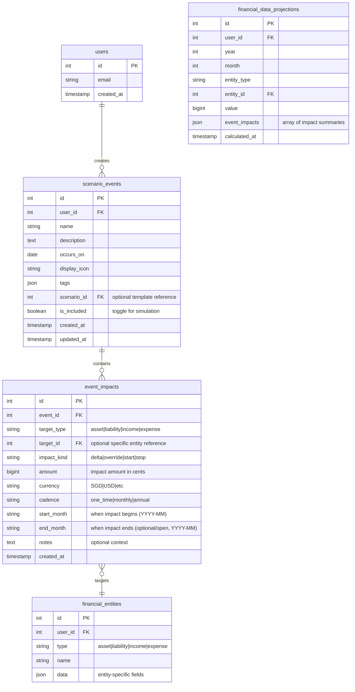
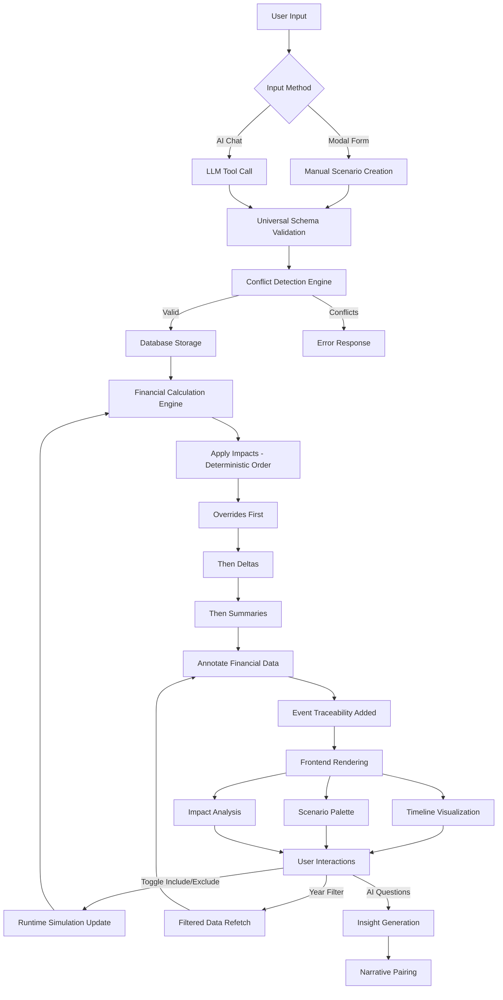
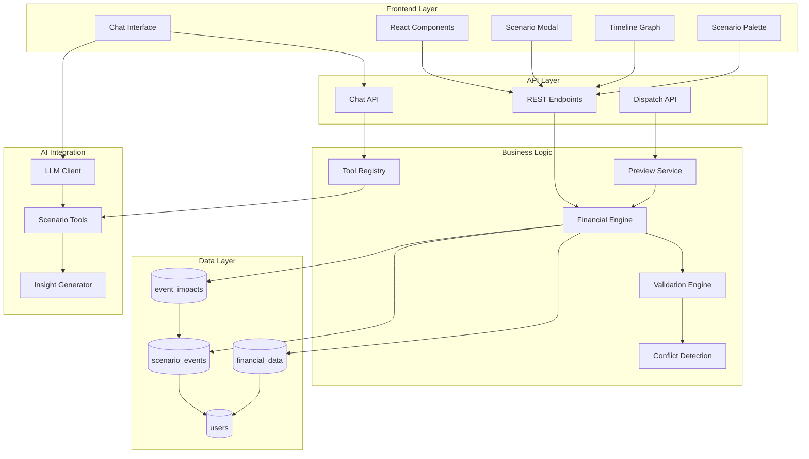
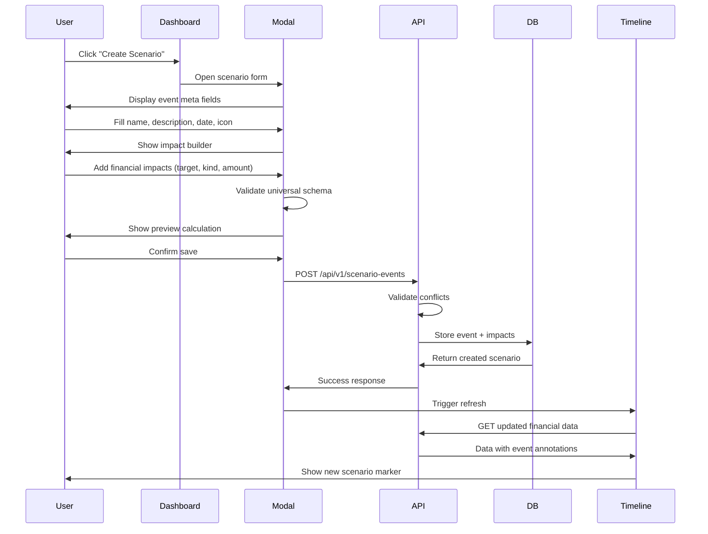
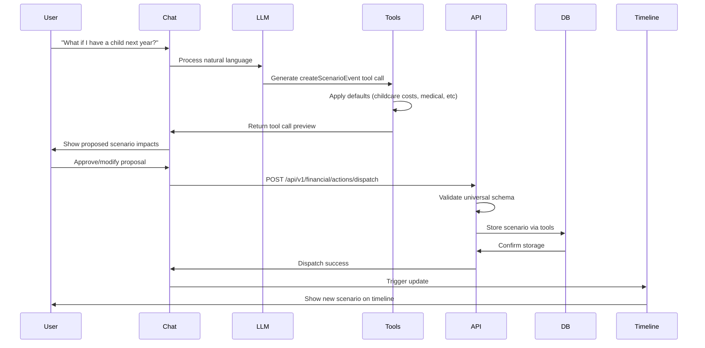
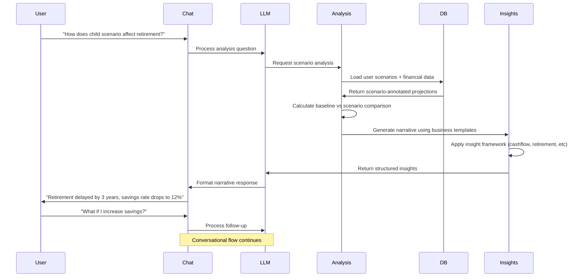
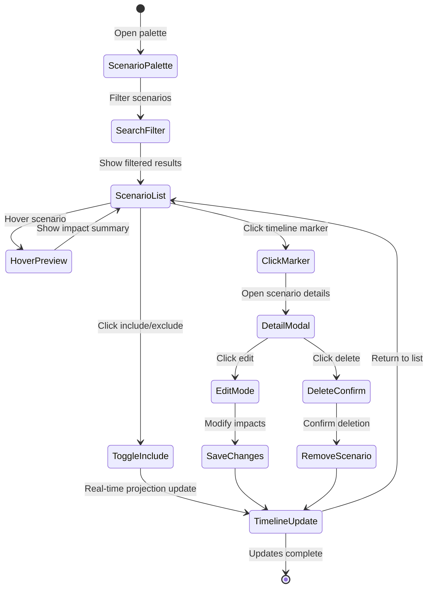

# Scenario Analysis Product Requirements Document

## Executive Summary

The Scenario Analysis feature enables Assetra users to model "what-if" life events (having a child, job loss, disability, major purchases) and understand their financial impact through interactive visualizations and AI-powered insights. This feature integrates seamlessly with the existing financial planning system and chat interface.

---

## Problem Statement

Users struggle to understand how major life events will impact their financial future. Current financial planning tools are static and don't allow users to easily explore different scenarios or get AI-powered insights about the implications of life changes.

**Pain Points**:
- No way to model future life events and their financial impact
- Difficulty understanding cascading effects of major decisions
- Manual calculations required for scenario planning
- No AI assistance for scenario analysis and recommendations

---

## Product Vision

Enable users to confidently plan for life's uncertainties by providing an intuitive scenario modeling system with AI-powered insights, helping them make informed financial decisions and prepare for the future.

---

## User Stories & Epics

### Epic 1: Manual Scenario Creation
**As a user, I want to create custom life scenarios through a form interface so that I can model specific financial situations.**

#### User Stories:
- **US1.1**: As a user, I want to click a "Create Scenario" button so that I can start modeling a new life event
- **US1.2**: As a user, I want to fill in scenario details (name, date, description, icon) so that I can define my event
- **US1.3**: As a user, I want to add multiple financial impacts (income/expense/asset/liability changes) so that I can model complex scenarios
- **US1.4**: As a user, I want to see a preview of the financial impact so that I can understand the consequences before saving
- **US1.5**: As a user, I want to save my scenario so that I can reference it later

### Epic 2: AI-Powered Scenario Creation
**As a user, I want to create scenarios through natural language so that I can quickly model events without filling complex forms.**

#### User Stories:
- **US2.1**: As a user, I want to ask "What if I have a child next year?" so that the AI can create a relevant scenario
- **US2.2**: As a user, I want to see the AI's proposed scenario impacts so that I can review before approval
- **US2.3**: As a user, I want to modify AI-suggested values so that I can customize the scenario to my situation
- **US2.4**: As a user, I want to approve or reject AI proposals so that I maintain control over my financial data

### Epic 3: Scenario Visualization & Analysis
**As a user, I want to see scenarios on my financial timeline and understand their impact so that I can make informed decisions.**

#### User Stories:
- **US3.1**: As a user, I want to see scenario icons on my financial timeline so that I can visualize when events occur
- **US3.2**: As a user, I want to click scenario markers so that I can see detailed impact information
- **US3.3**: As a user, I want to toggle scenarios on/off so that I can compare different future projections
- **US3.4**: As a user, I want to see "before vs after" comparisons so that I can understand the financial impact

### Epic 4: AI Financial Insights
**As a user, I want AI-powered analysis of my scenarios so that I can understand the implications and get actionable advice.**

#### User Stories:
- **US4.1**: As a user, I want to ask "How does having a child affect my retirement?" so that I get specific impact analysis
- **US4.2**: As a user, I want to receive insights about cashflow risks so that I can prepare for potential shortfalls
- **US4.3**: As a user, I want to understand retirement delays so that I can adjust my savings strategy
- **US4.4**: As a user, I want to know about emergency fund risks so that I can build adequate buffers

### Epic 5: Scenario Management
**As a user, I want to manage multiple scenarios efficiently so that I can explore different life paths.**

#### User Stories:
- **US5.1**: As a user, I want to search and filter scenarios so that I can find relevant ones quickly
- **US5.2**: As a user, I want to duplicate scenarios so that I can create variations easily
- **US5.3**: As a user, I want to delete outdated scenarios so that I can keep my planning current
- **US5.4**: As a user, I want to bulk manage scenarios so that I can efficiently organize my planning

---

## Functional Requirements

### Core Design Principles

#### Universal Input/Output Schema
**Key Principle**: One schema for all scenarios - every life event (car purchase, disability, child, etc.) uses the same input structure:

**Required Inputs (per event)**:
- **Event Meta**: `name`, `description`, `occurs_on`, `display_icon`, `tags`, `scenario_id?`, `is_included` (defaults to true on create).
- **Impacts Array**: `{ target_type, target_id?, impact_kind (delta|override|start|stop), amount, currency, cadence (one_time|monthly|annual), start_month, end_month?, notes? }` where `start_month/end_month` are timestamps aligned with system datetime format (ISO 8601, normalized to the first day of the month 00:00:00Z); end optional/open-ended but must be >= start_month when provided. No aggregate impacts; totals (cashflow/net worth) are computed on demand from entity-level impacts.
- **Optional**: probability/severity flags (future Monte Carlo)

**Required Outputs (per view)**:
- **Graph Overlay**: icon + tooltip (name, date, short description); click → modal
- **Modal**: grouped impacts with net worth delta, monthly cashflow delta, "If this happens..." summary
- **Financial Data Rows**: include `event_impacts` for impacted entities; cards show badges/tooltips when selected year/month falls within impact window
- **Scenario Palette**: searchable list with tags, year, include/exclude toggle; hover highlights markers
- **Derived Aggregates**: net worth and cashflow are computed from entity impacts; no aggregate targets are edited directly.

#### Core Implementation Principles
- **Uniform Structure**: Every scenario is just event meta + typed impact list. No bespoke branches per scenario type
- **Scope Clarity**: Impacts must declare who/what they touch (asset/liability/income/expense) and the month window; aggregates are derived from entity impacts.
- **Deterministic Ordering**: Apply start/stop gates, then overrides, then deltas, then summaries for stable repeated runs
- **Separation of Concerns**: Capture data once; render anywhere. Backend computes financial_data; frontend renders from same payload
- **Traceability**: Each impacted row in financial_data carries event_ids so users see why values changed
- **Conflict Hygiene**: Allow overlapping overrides across scenarios but surface warnings; deterministic precedence applies (default: most recent `updated_at` wins unless user explicitly sets precedence) and conflicts are listed so users can resolve (e.g., convert one to delta).
- **Toggleable Simulation**: Include/exclude events without deleting (persisted record, runtime toggle)
- **Start/Stop Semantics**: `start/stop` gates baseline streams before overrides/deltas; one window per impact row, multiple rows allowed per event (no overlapping windows for the same entity within an event).

### Core Features

#### 1. Universal Scenario Data Model
- **Event Metadata**: Follows universal schema (name, description, occurs_on, display_icon, tags)
- **Impacts Array**: Typed impacts using target_type, impact_kind, cadence, timing structure
- **User Controls**: Include/exclude toggle for analysis without data deletion
- **Data Integrity**: Conflict detection for overlapping overrides, validation, audit trail

#### 2. Scenario Creation Interfaces
- **Modal Form**: Rich form interface with impact builder
- **AI Chat**: Natural language scenario creation via existing chat system
- **Template Library**: Pre-built common scenarios (child, disability, job loss)
- **Import/Export**: Share scenarios between users (future)

#### 3. Financial Impact Engine (Following Design Principles)
- **Deterministic Calculation**: Apply impacts in strict order (start/stop → overrides → deltas → summaries) for stable results
- **Universal Impact Application**: Same logic handles all scenario types through unified impact schema
- **Conflict Detection**: Within a scenario, overlapping overrides per entity/month are invalid. Across scenarios, allow but resolve via deterministic precedence (latest `updated_at` wins until user picks otherwise) and surface warnings; suggest converting one override to delta when appropriate.
- **Event Traceability**: Annotate financial_data with event_ids so users see impact sources
- **Graceful Degradation**: Show "no quantified impact yet" for incomplete scenarios without mutating projections
- **Time-based Filtering**: Financial data includes events matching selected year/month filter

#### 4. Visualization System (Following Output Requirements)
- **Graph Overlay**: Icons + tooltips (name, date, description) with click → modal behavior
- **Modal Views**: Grouped impacts with net worth delta, monthly cashflow delta, "If this happens..." summary
- **Financial Data Cards**: Show badges/tooltips when selected year/month falls within impact window
- **Scenario Palette**: Searchable list with tags, year filter, include/exclude toggle; hover highlights markers
- **Derived Aggregates Reminder**: Aggregates (net worth, cashflow) are derived from entity impacts; users edit only assets/liabilities/income/expenses.
- **Interactive Elements**: Click, hover, toggle interactions following design principles
- **Mobile Responsive**: Touch-friendly interface maintaining principle compliance
- **Conflict Visibility**: Palette shows warning icons/messages when overrides overlap across scenarios, with suggested resolutions (e.g., convert one to delta or pick precedence); users can choose precedence when needed.
- **Grouped Scenario Management**: Scenarios can be organized into logical groups (e.g., "Career Transition", "Family Planning") via tags or explicit grouping for better visual organization and bulk operations.

#### Notable Edge Case (overlapping overrides across scenarios)
- Example: “Sabbatical” overrides Employment Income to 0 from 2026-03–2026-08, and “Job Loss” overrides it to 2,500/mo from 2026-04–2026-09. Both are included.
- Behavior: allow both; compute with deterministic precedence (default latest `updated_at` wins) and surface a warning in the palette/modal: “Job Loss overrides Sabbatical for Employment Income (2026-04–2026-08). Consider converting one to a delta or choose precedence.”
- Goal: avoid blocking users while keeping the outcome transparent and user-adjustable.

#### 5. AI Analysis Framework (Following Narrative Pairing Principle)
- **Scenario Questions**: Natural language queries about impacts using universal schema
- **Insight Generation**: MVP: cashflow/liquidity/DSR/protection only; goal/retirement/education insights deferred until engines are wired (show “Not available in this version” if requested)
- **Universal Analysis**: Same insight framework works for all scenario types through common impact schema
- **Narrative Responses**: Human-readable explanations derived from financial_data annotations

---

## Technical Architecture

### System Integration Points (Aligned with Design Principles)
- **Database**: Extends existing schema with universal scenario structure (`scenario_events`, `event_impacts`)
- **API**: `/api/v1/scenario-events` CRUD with impacts; financial_data annotated with event_ids when year/month filter present; list endpoints support pagination + total count + text search (indexed).
- **Chat System**: Integrates with LLM tool calling using universal scenario schema
- **Financial Engine**: Deterministic impact application (overrides → deltas → summaries)
- **Frontend**: React components rendering from unified payload (separation of concerns)

### Database Schema Changes



### Data Flow Architecture



### System Architecture Overview



---

## User Experience Design

### User Flow Diagrams

#### Flow 1: Manual Scenario Creation



#### Flow 2: AI Scenario Creation



#### Flow 3: Scenario Analysis & Insights



#### Flow 4: Interactive Scenario Management



### Design Principles
- **Progressive Disclosure**: Start simple, reveal complexity as needed
- **Visual Clarity**: Clear distinction between scenarios and reality
- **Immediate Feedback**: Real-time impact calculations and previews
- **Consistent Patterns**: Follow existing UI/UX conventions

---

## Implementation Plan

### Phase 1: Core Infrastructure (4-6 weeks)
- **Backend**: Database schema, models, CRUD APIs
- **Integration**: Financial calculation engine, scenario application
- **Basic UI**: Simple scenario creation and timeline visualization

### Phase 2: AI Integration (3-4 weeks)
- **Chat Tools**: Scenario creation via LLM tool calls
- **Dispatch System**: Integration with existing action approval flow
- **Insights**: Basic AI-powered scenario analysis

### Phase 3: Enhanced UX (3-4 weeks)
- **Rich Modal**: Advanced scenario creation interface
- **Scenario Management**: Search, filter, bulk operations
- **Visual Polish**: Enhanced timeline markers and interactions

### Phase 4: Advanced Features (2-3 weeks)
- **Template Library**: Pre-built scenario templates
- **Advanced Insights**: Comprehensive analysis framework
- **Performance**: Optimization for complex scenarios

---

## Success Metrics

### User Engagement
- **Scenario Creation Rate**: Average scenarios created per active user
- **Chat Usage**: Percentage of scenarios created via AI vs manual
- **Analysis Queries**: Number of scenario analysis questions per user
- **Retention**: Users returning to modify/analyze scenarios

### Feature Adoption
- **Modal vs Chat**: Split between creation methods
- **Scenario Types**: Most common scenario categories
- **Toggle Usage**: Frequency of include/exclude interactions
- **Timeline Engagement**: Click-through rates on scenario markers

### Business Impact
- **User Satisfaction**: Scenario feature satisfaction scores
- **Planning Confidence**: User-reported confidence in financial planning
- **Feature Value**: Perceived value of scenario analysis
- **Support Reduction**: Decrease in planning-related support requests

---

## Implementation Tickets

### Backend Tickets

#### B9: Core Scenario Event Models & Database Schema
**Priority**: P0 | **Complexity**: 5 points | **Sprint**: 1-2

**Background**: Implement the foundational data models for the scenario analysis system based on the universal input structure defined in scenario-design-principles.md. This establishes the core database schema that will handle all life events (child birth, job loss, property purchase, etc.) through a unified structure.

**Detailed Requirements**:

**Database Schema Changes**:
1. **scenario_events table**:
   ```sql
   CREATE TABLE scenario_events (
     id BIGSERIAL PRIMARY KEY,
     user_id BIGINT NOT NULL REFERENCES users(id) ON DELETE CASCADE,
     name VARCHAR(100) NOT NULL,
     description TEXT,
     occurs_on DATE NOT NULL,
     display_icon VARCHAR(50) NOT NULL,
     tags JSONB DEFAULT '[]'::jsonb,
     scenario_id BIGINT REFERENCES scenario_templates(id),
     is_included BOOLEAN NOT NULL DEFAULT true,
     created_at TIMESTAMP WITH TIME ZONE NOT NULL DEFAULT NOW(),
     updated_at TIMESTAMP WITH TIME ZONE NOT NULL DEFAULT NOW(),

     -- Constraints
     CONSTRAINT valid_name_length CHECK (char_length(name) >= 1),
     CONSTRAINT valid_icon_format CHECK (display_icon ~ '^[a-z0-9-]+$'),
     CONSTRAINT future_or_recent_date CHECK (occurs_on >= CURRENT_DATE - INTERVAL '5 years')
   );

   -- Indexes for performance
   CREATE INDEX idx_scenario_events_user_id ON scenario_events(user_id);
   CREATE INDEX idx_scenario_events_occurs_on ON scenario_events(occurs_on);
   CREATE INDEX idx_scenario_events_tags ON scenario_events USING GIN(tags);
   CREATE INDEX idx_scenario_events_included ON scenario_events(user_id, is_included);
   ```

2. **event_impacts table**:
   ```sql
   CREATE TABLE event_impacts (
     id BIGSERIAL PRIMARY KEY,
     event_id BIGINT NOT NULL REFERENCES scenario_events(id) ON DELETE CASCADE,
     target_type VARCHAR(20) NOT NULL CHECK (target_type IN ('asset', 'liability', 'income', 'expense')),
     target_id BIGINT, -- References specific entity, NULL for new streams
     impact_kind VARCHAR(10) NOT NULL CHECK (impact_kind IN ('delta', 'override', 'start', 'stop')),
     amount BIGINT NOT NULL, -- Amount in cents to avoid floating point issues
     currency CHAR(3) NOT NULL DEFAULT 'SGD',
     cadence VARCHAR(10) NOT NULL CHECK (cadence IN ('one_time', 'monthly', 'annual')),
     start_month TIMESTAMP WITH TIME ZONE NOT NULL, -- Normalized to first day of month 00:00:00Z
     end_month TIMESTAMP WITH TIME ZONE, -- Optional, must be >= start_month
     notes TEXT,
     created_at TIMESTAMP WITH TIME ZONE NOT NULL DEFAULT NOW(),

     -- Constraints
     CONSTRAINT valid_amount CHECK (
       CASE
         WHEN impact_kind = 'stop' THEN amount = 0
         ELSE amount != 0
       END
     ),
     CONSTRAINT valid_month_range CHECK (end_month IS NULL OR end_month >= start_month),
     CONSTRAINT no_overlapping_windows CHECK (
       -- Prevent overlapping windows within same event for same entity
       -- This will be enforced by application logic due to complexity
       true
     )
   );

   -- Indexes for performance
   CREATE INDEX idx_event_impacts_event_id ON event_impacts(event_id);
   CREATE INDEX idx_event_impacts_target ON event_impacts(target_type, target_id);
   CREATE INDEX idx_event_impacts_timing ON event_impacts(start_month, end_month);
   ```

**Go Model Implementation**:
```go
// models/scenario.go
type ScenarioEvent struct {
    ID          int64     `db:"id" json:"id"`
    UserID      int64     `db:"user_id" json:"user_id"`
    Name        string    `db:"name" json:"name" validate:"required,min=1,max=100"`
    Description string    `db:"description" json:"description"`
    OccursOn    time.Time `db:"occurs_on" json:"occurs_on" validate:"required"`
    DisplayIcon string    `db:"display_icon" json:"display_icon" validate:"required,alphanum"`
    Tags        []string  `db:"tags" json:"tags"`
    ScenarioID  *int64    `db:"scenario_id" json:"scenario_id,omitempty"`
    IsIncluded  bool      `db:"is_included" json:"is_included"`
    CreatedAt   time.Time `db:"created_at" json:"created_at"`
    UpdatedAt   time.Time `db:"updated_at" json:"updated_at"`

    // Loaded separately to avoid N+1 queries
    Impacts []EventImpact `json:"impacts,omitempty"`
}

type EventImpact struct {
    ID         int64     `db:"id" json:"id"`
    EventID    int64     `db:"event_id" json:"event_id"`
    TargetType string    `db:"target_type" json:"target_type" validate:"required,oneof=asset liability income expense"`
    TargetID   *int64    `db:"target_id" json:"target_id,omitempty"`
    ImpactKind string    `db:"impact_kind" json:"impact_kind" validate:"required,oneof=delta override start stop"`
    Amount     int64     `db:"amount" json:"amount"` // In cents
    Currency   string    `db:"currency" json:"currency" validate:"len=3"`
    Cadence    string    `db:"cadence" json:"cadence" validate:"required,oneof=one_time monthly annual"`
    StartMonth time.Time `db:"start_month" json:"start_month" validate:"required"`
    EndMonth   *time.Time `db:"end_month" json:"end_month,omitempty"`
    Notes      string    `db:"notes" json:"notes"`
    CreatedAt  time.Time `db:"created_at" json:"created_at"`
}

// Business logic validation
func (s *ScenarioEvent) Validate() error {
    if s.OccursOn.Before(time.Now().AddDate(-5, 0, 0)) {
        return errors.New("occurs_on cannot be more than 5 years in the past")
    }

    for _, impact := range s.Impacts {
        if err := impact.Validate(); err != nil {
            return fmt.Errorf("invalid impact: %w", err)
        }
    }

    return nil
}

func (i *EventImpact) Validate() error {
    if i.ImpactKind == "stop" && i.Amount != 0 {
        return errors.New("stop impacts must have amount = 0")
    }

    if i.ImpactKind != "stop" && i.Amount == 0 {
        return errors.New("non-stop impacts must have non-zero amount")
    }

    if i.EndMonth != nil && i.EndMonth.Before(i.StartMonth) {
        return errors.New("end_month must be >= start_month")
    }

    return nil
}
```

**Repository Layer**:
```go
// repository/scenario_repository.go
type ScenarioRepository struct {
    db *sqlx.DB
}

func (r *ScenarioRepository) Create(ctx context.Context, userID int64, event *ScenarioEvent) error
func (r *ScenarioRepository) GetByID(ctx context.Context, userID int64, eventID int64) (*ScenarioEvent, error)
func (r *ScenarioRepository) List(ctx context.Context, userID int64, filters ScenarioFilters) ([]ScenarioEvent, error)
func (r *ScenarioRepository) Update(ctx context.Context, userID int64, event *ScenarioEvent) error
func (r *ScenarioRepository) Delete(ctx context.Context, userID int64, eventID int64) error
func (r *ScenarioRepository) ToggleIncluded(ctx context.Context, userID int64, eventID int64, included bool) error
func (r *ScenarioRepository) CreateImpacts(ctx context.Context, eventID int64, impacts []EventImpact) error
func (r *ScenarioRepository) UpdateImpacts(ctx context.Context, eventID int64, impacts []EventImpact) error

type ScenarioFilters struct {
    IncludedOnly *bool
    Tags         []string
    YearFrom     *int
    YearTo       *int
    Search       string
}
```

**Migration Files**:
- `migrations/001_create_scenario_events.up.sql`
- `migrations/002_create_event_impacts.up.sql`
- `migrations/003_add_scenario_indexes.up.sql`

**Acceptance Criteria**:
- [ ] Database schema supports all fields from scenario-design-principles.md with proper constraints
- [ ] Foreign key relationships prevent orphaned records and maintain referential integrity
- [ ] Repository methods handle all CRUD operations with proper error handling and user isolation
- [ ] Validation enforces business rules (amount validation, date constraints, impact kind rules)
- [ ] Database indexes optimize common query patterns (user lookup, date filtering, tag search)
- [ ] Migration scripts run cleanly on existing database without data loss
- [ ] Unit tests achieve >95% coverage for repository and model validation logic
- [ ] Integration tests verify constraint enforcement at database level
- [ ] Performance tests confirm queries execute under 100ms with 10k scenarios per user

**API Contract**:
```go
type ScenarioEvent struct {
    ID          int       `json:"id"`
    UserID      int       `json:"user_id"`
    Name        string    `json:"name"`
    Description string    `json:"description"`
    OccursOn    time.Time `json:"occurs_on"`
    DisplayIcon string    `json:"display_icon"`
    Tags        []string  `json:"tags"`
    IsIncluded  bool      `json:"is_included"`
    Impacts     []EventImpact `json:"impacts"`
}

type EventImpact struct {
    ID         int    `json:"id"`
    EventID    int    `json:"event_id"`
    TargetType string `json:"target_type"` // asset|liability|income|expense
    TargetID   *int   `json:"target_id,omitempty"`
    ImpactKind string `json:"impact_kind"` // delta|override|start|stop
    Amount     int64  `json:"amount"`
    Currency   string `json:"currency"`
    Cadence    string `json:"cadence"` // one_time|monthly|annual
    StartMonth time.Time `json:"start_month"` // month-aligned timestamp (first day of month, 00:00:00Z)
    EndMonth   *time.Time `json:"end_month,omitempty"` // optional/open-ended
    Notes      string `json:"notes,omitempty"`
}
```

#### B10: Scenario Events CRUD API
**Priority**: P0 | **Complexity**: 3 points | **Sprint**: 2

**Background**: Create REST API endpoints for managing scenario events with their associated impacts. This API provides the foundation for both manual scenario creation via UI and AI-driven scenario creation via chat tools.

**Detailed Requirements**:

**API Endpoints**:

1. **Create Scenario Event**:
   ```
   POST /api/v1/scenario-events
   Content-Type: application/json
   Authorization: Bearer {token}

   Request Body:
   {
     "name": "Child Birth",
     "description": "First child expected",
     "occurs_on": "2025-06-01",
     "display_icon": "baby",
     "tags": ["family", "major"],
     "impacts": [
       {
         "target_type": "expense",
         "impact_kind": "delta",
         "amount": 150000, // cents
         "currency": "SGD",
         "cadence": "monthly",
         "start_month": "2025-06-01T00:00:00Z",
         "end_month": "2030-06-01T00:00:00Z",
         "notes": "Childcare expenses"
       }
     ]
   }

   Response: 201 Created
   {
     "id": 123,
     "name": "Child Birth",
     "user_id": 456,
     "is_included": true,
     "created_at": "2025-01-15T10:30:00Z",
     "impacts": [...]
   }
   ```

2. **List Scenario Events**:
   ```
   GET /api/v1/scenario-events?included=true&tags=family&year_from=2025&search=child&page=1&limit=20
   Authorization: Bearer {token}

   Response: 200 OK
   {
     "data": [
       { scenario event objects... }
     ],
     "pagination": {
       "page": 1,
       "limit": 20,
       "total": 45,
       "total_pages": 3
     },
     "filters_applied": {
       "included": true,
       "tags": ["family"],
       "year_from": 2025,
       "search": "child"
     }
   }
   ```

3. **Get Single Scenario**:
   ```
   GET /api/v1/scenario-events/{id}
   Authorization: Bearer {token}

   Response: 200 OK
   { scenario event with impacts... }

   Error: 404 Not Found
   {
     "error": {
       "code": "scenario_not_found",
       "message": "Scenario event not found or access denied",
       "details": {
         "scenario_id": 123,
         "user_id": 456
       }
     }
   }
   ```

4. **Update Scenario**:
   ```
   PUT /api/v1/scenario-events/{id}
   Content-Type: application/json
   Authorization: Bearer {token}

   Request Body: { updated scenario data... }

   Response: 200 OK
   { updated scenario... }
   ```

5. **Toggle Inclusion**:
   ```
   PATCH /api/v1/scenario-events/{id}/toggle
   Content-Type: application/json
   Authorization: Bearer {token}

   Request Body:
   {
     "is_included": false
   }

   Response: 200 OK
   {
     "id": 123,
     "is_included": false,
     "updated_at": "2025-01-15T11:00:00Z"
   }
   ```

6. **Delete Scenario**:
   ```
   DELETE /api/v1/scenario-events/{id}
   Authorization: Bearer {token}

   Response: 204 No Content

   Error: 409 Conflict (if scenario has dependencies)
   {
     "error": {
       "code": "scenario_in_use",
       "message": "Cannot delete scenario that is referenced by active projections",
       "details": {
         "references": ["financial_projection_123"]
       }
     }
   }
   ```

**Handler Implementation**:
```go
// handlers/scenario_handler.go
type ScenarioHandler struct {
    repository   ScenarioRepository
    validator    *validator.Validate
    authService  AuthService
}

func (h *ScenarioHandler) CreateScenario(w http.ResponseWriter, r *http.Request) {
    userID := h.authService.GetUserIDFromContext(r.Context())

    var req CreateScenarioRequest
    if err := json.NewDecoder(r.Body).Decode(&req); err != nil {
        writeErrorResponse(w, http.StatusBadRequest, "invalid_json", err.Error())
        return
    }

    if err := h.validator.Struct(&req); err != nil {
        writeValidationError(w, err)
        return
    }

    // Convert request to domain model
    scenario := &ScenarioEvent{
        UserID:      userID,
        Name:        req.Name,
        Description: req.Description,
        // ... map other fields
    }

    if err := h.repository.Create(r.Context(), userID, scenario); err != nil {
        if errors.Is(err, ErrDuplicateScenario) {
            writeErrorResponse(w, http.StatusConflict, "duplicate_scenario", "Scenario with this name already exists")
            return
        }
        writeInternalError(w, err)
        return
    }

    writeJSONResponse(w, http.StatusCreated, scenario)
}

// Additional handler methods...
```

**Request/Response Models**:
```go
type CreateScenarioRequest struct {
    Name        string               `json:"name" validate:"required,min=1,max=100"`
    Description string               `json:"description" validate:"max=1000"`
    OccursOn    time.Time            `json:"occurs_on" validate:"required"`
    DisplayIcon string               `json:"display_icon" validate:"required,alphanum"`
    Tags        []string             `json:"tags" validate:"max=10,dive,min=1,max=50"`
    Impacts     []CreateImpactRequest `json:"impacts" validate:"required,min=1,max=20"`
}

type CreateImpactRequest struct {
    TargetType string     `json:"target_type" validate:"required,oneof=asset liability income expense"`
    TargetID   *int64     `json:"target_id,omitempty"`
    ImpactKind string     `json:"impact_kind" validate:"required,oneof=delta override start stop"`
    Amount     int64      `json:"amount"`
    Currency   string     `json:"currency" validate:"len=3"`
    Cadence    string     `json:"cadence" validate:"required,oneof=one_time monthly annual"`
    StartMonth time.Time  `json:"start_month" validate:"required"`
    EndMonth   *time.Time `json:"end_month,omitempty"`
    Notes      string     `json:"notes" validate:"max=500"`
}

type ScenarioListResponse struct {
    Data       []ScenarioEvent `json:"data"`
    Pagination PaginationInfo  `json:"pagination"`
    Filters    AppliedFilters  `json:"filters_applied"`
}

type ErrorResponse struct {
    Error ErrorDetail `json:"error"`
}

type ErrorDetail struct {
    Code    string      `json:"code"`
    Message string      `json:"message"`
    Details interface{} `json:"details,omitempty"`
}
```

**Middleware & Authorization**:
```go
// middleware/scenario_auth.go
func (m *AuthMiddleware) RequireScenarioAccess(next http.Handler) http.Handler {
    return http.HandlerFunc(func(w http.ResponseWriter, r *http.Request) {
        userID := m.GetUserIDFromContext(r.Context())
        scenarioID := mux.Vars(r)["id"]

        if !m.scenarioService.UserCanAccessScenario(r.Context(), userID, scenarioID) {
            writeErrorResponse(w, http.StatusForbidden, "access_denied", "Cannot access this scenario")
            return
        }

        next.ServeHTTP(w, r)
    })
}
```

**Acceptance Criteria**:
- [ ] All CRUD endpoints implemented with proper HTTP status codes (201, 200, 204, 400, 401, 403, 404, 409, 500)
- [ ] Request validation using struct tags with descriptive error messages
- [ ] Response serialization handles all data types correctly (timestamps, arrays, nested objects)
- [ ] User authorization middleware prevents cross-user access and unauthorized operations
- [ ] Error responses follow consistent format with error codes, messages, and structured details
- [ ] Pagination works correctly with configurable limits and proper total counts
- [ ] Filtering supports multiple criteria (tags, date ranges, inclusion status, text search)
- [ ] Database transactions ensure data consistency across scenario and impact operations
- [ ] Rate limiting prevents API abuse (100 requests per minute per user)
- [ ] Integration tests cover all endpoints with various input combinations and edge cases
- [ ] API documentation updated with OpenAPI 3.0 specification including examples
- [ ] Performance requirements: endpoints respond under 200ms for typical payloads

#### B11: Financial Data Integration with Events
**Priority**: P0 | **Complexity**: 8 points | **Sprint**: 3-4

**Background**: Integrate scenario events into the financial projection system. This is the core calculation engine that applies event impacts to financial_data following the deterministic ordering principle (start/stop gates → overrides → deltas → summaries). This integration enables the universal scenario system to affect real financial projections.

**Detailed Requirements**:

**Financial Impact Engine Architecture**:
```go
// financial/scenario_engine.go
type ScenarioEngine struct {
    scenarioRepo     ScenarioRepository
    financialService FinancialService
    conflictDetector ConflictDetector
    insightGenerator InsightGenerator
}

// Core method that applies all included scenarios to financial projections
func (e *ScenarioEngine) ApplyScenarios(ctx context.Context, userID int64, baselineData []FinancialDataRow, targetYear int) ([]FinancialDataRow, []ConflictWarning, error) {
    // 1. Load all included scenarios for user
    scenarios, err := e.scenarioRepo.ListIncluded(ctx, userID)
    if err != nil {
        return nil, nil, fmt.Errorf("loading scenarios: %w", err)
    }

    // 2. Detect conflicts across scenarios
    conflicts := e.conflictDetector.DetectOverrideConflicts(scenarios)

    // 3. Apply deterministic processing order per entity/month
    result := make([]FinancialDataRow, len(baselineData))
    copy(result, baselineData)

    for month := range getMonthRange(targetYear) {
        // Process each entity type
        for _, entityType := range []string{"income", "expense", "asset", "liability"} {
            impacts := e.collectImpactsForMonth(scenarios, entityType, month)

            // Apply in strict order: start/stop → overrides → deltas
            e.applyStartStopGates(result, impacts, month)
            e.applyOverrides(result, impacts, month, conflicts)
            e.applyDeltas(result, impacts, month)

            // Annotate rows with event impact information
            e.annotateEventImpacts(result, impacts, month)
        }
    }

    return result, conflicts, nil
}
```

**Conflict Detection System**:
```go
// conflict/detector.go
type ConflictDetector struct{}

type ConflictWarning struct {
    Type        string    `json:"type"` // "override_conflict"
    Severity    string    `json:"severity"` // "warning", "error"
    Message     string    `json:"message"`
    EventIDs    []int64   `json:"event_ids"`
    EntityType  string    `json:"entity_type"`
    EntityID    *int64    `json:"entity_id"`
    Month       time.Time `json:"month"`
    Suggestion  string    `json:"suggestion"`
}

func (d *ConflictDetector) DetectOverrideConflicts(scenarios []ScenarioEvent) []ConflictWarning {
    conflicts := []ConflictWarning{}

    // Group impacts by entity/month to find overlapping overrides
    entityMonthImpacts := make(map[string]map[time.Time][]EventImpact)

    for _, scenario := range scenarios {
        for _, impact := range scenario.Impacts {
            if impact.ImpactKind != "override" {
                continue
            }

            key := fmt.Sprintf("%s:%d", impact.TargetType, *impact.TargetID)
            if entityMonthImpacts[key] == nil {
                entityMonthImpacts[key] = make(map[time.Time][]EventImpact)
            }

            // Check each month in impact window
            for month := impact.StartMonth; !month.After(*impact.EndMonth); month = month.AddDate(0, 1, 0) {
                entityMonthImpacts[key][month] = append(entityMonthImpacts[key][month], impact)
            }
        }
    }

    // Find conflicts (>1 override for same entity/month)
    for entityKey, monthlyImpacts := range entityMonthImpacts {
        for month, impacts := range monthlyImpacts {
            if len(impacts) > 1 {
                conflicts = append(conflicts, ConflictWarning{
                    Type:       "override_conflict",
                    Severity:   "warning",
                    Message:    d.formatConflictMessage(impacts),
                    EventIDs:   d.extractEventIDs(impacts),
                    Month:      month,
                    Suggestion: "Consider converting one override to a delta or set explicit precedence",
                })
            }
        }
    }

    return conflicts
}
```

**Event Impact Annotation**:
```go
// annotation/annotator.go
type EventImpactSummary struct {
    EventID      int64  `json:"event_id"`
    EventName    string `json:"event_name"`
    ImpactAmount int64  `json:"impact_amount"`
    ImpactKind   string `json:"impact_kind"`
    Notes        string `json:"notes,omitempty"`
}

type AnnotatedFinancialDataRow struct {
    FinancialDataRow
    EventImpacts []EventImpactSummary `json:"event_impacts,omitempty"`
}

func (a *Annotator) AnnotateEventImpacts(row *FinancialDataRow, impacts []EventImpact, month time.Time) {
    if len(impacts) == 0 {
        return
    }

    eventImpacts := make([]EventImpactSummary, 0, len(impacts))
    for _, impact := range impacts {
        // Only include impacts that affect this specific row
        if a.impactAffectsRow(impact, row) {
            eventImpacts = append(eventImpacts, EventImpactSummary{
                EventID:      impact.EventID,
                EventName:    a.getEventName(impact.EventID),
                ImpactAmount: a.calculateActualImpact(impact, row, month),
                ImpactKind:   impact.ImpactKind,
                Notes:        impact.Notes,
            })
        }
    }

    if len(eventImpacts) > 0 {
        row.EventImpacts = eventImpacts
    }
}
```

**Integration with Existing Financial Service**:
```go
// financial/service.go (extending existing service)
func (s *FinancialService) GetProjectionsWithScenarios(ctx context.Context, userID int64, year int) ([]FinancialDataRow, error) {
    // Get baseline projections
    baseline, err := s.GetBaselineProjections(ctx, userID, year)
    if err != nil {
        return nil, err
    }

    // Apply scenario impacts
    scenarioEngine := NewScenarioEngine(s.scenarioRepo, s, s.conflictDetector, s.insightGenerator)

    result, conflicts, err := scenarioEngine.ApplyScenarios(ctx, userID, baseline, year)
    if err != nil {
        return nil, err
    }

    // Log conflicts for debugging/monitoring
    if len(conflicts) > 0 {
        log.Printf("Scenario conflicts detected for user %d: %d warnings", userID, len(conflicts))
    }

    return result, nil
}
```

**Performance Optimizations**:
```go
// cache/scenario_cache.go
type ScenarioCache struct {
    redis *redis.Client
    ttl   time.Duration
}

func (c *ScenarioCache) GetCachedProjections(ctx context.Context, userID int64, scenarioHash string, year int) ([]FinancialDataRow, bool) {
    key := fmt.Sprintf("projections:%d:%s:%d", userID, scenarioHash, year)

    data, err := c.redis.Get(ctx, key).Result()
    if err == redis.Nil {
        return nil, false // Cache miss
    }

    var projections []FinancialDataRow
    if err := json.Unmarshal([]byte(data), &projections); err != nil {
        return nil, false
    }

    return projections, true
}

func (c *ScenarioCache) CacheProjections(ctx context.Context, userID int64, scenarioHash string, year int, projections []FinancialDataRow) {
    key := fmt.Sprintf("projections:%d:%s:%d", userID, scenarioHash, year)

    data, _ := json.Marshal(projections)
    c.redis.Set(ctx, key, data, c.ttl)
}
```

**Acceptance Criteria**:
- [ ] Event impacts correctly applied to financial projections following deterministic order (start/stop → overrides → deltas → summaries)
- [ ] Conflict detection identifies overlapping overrides with clear warnings and resolution suggestions
- [ ] Financial data rows include event_impacts annotations with event_id, impact details, and traceability
- [ ] Year/month filtering shows only relevant events and their impacts for the selected time period
- [ ] Graceful degradation handles scenarios with incomplete impact data without corrupting projections
- [ ] Performance optimizations enable real-time calculations with 50+ scenarios per user
- [ ] Caching system reduces calculation time for repeated requests by 80%
- [ ] Integration tests verify correct impact application across various scenario combinations
- [ ] Stress tests confirm system handles 100 scenarios with 500+ impacts without performance degradation
- [ ] Unit tests achieve >95% coverage for impact calculation and conflict detection logic

**Objective**: Integrate scenarios into financial projection calculations

**Requirements**:
- Extend financial calculation engine to process scenario impacts
- Apply impacts in deterministic order (overrides → deltas → summaries)
- Annotate financial_data rows with event impact information
- Implement conflict detection for overlapping overrides
- Support year-based filtering and time window calculations
- Generate derived metrics for insight analysis

**Acceptance Criteria**:
- [ ] Scenario impacts correctly applied to financial projections
- [ ] Deterministic calculation order ensures consistent results
- [ ] Conflict detection prevents invalid override combinations
- [ ] Financial data includes event_impacts annotations
- [ ] Year filtering shows relevant scenarios
- [ ] Unit tests for impact application logic
- [ ] Integration tests with multiple scenario combinations
- [ ] Performance testing with complex scenario sets

#### B12: Scenario Analysis Endpoint
**Priority**: P1 | **Complexity**: 4 points | **Sprint**: 4

**Objective**: Create endpoint for comprehensive scenario analysis

**Requirements**:
- `POST /api/v1/scenario-analysis` - Run analysis with selected events
- Accept event IDs or use all included scenarios
- Return financial projections with scenario annotations
- Include AI-ready insight data and comparison metrics
- Support baseline vs scenario comparisons
- Cache results for performance optimization
- Intended use: chat responses and compare views can call this to get baseline + scenario in one payload; alternatively, frontend can call financial_data with selected events, but this endpoint simplifies server-side comparison.

**Acceptance Criteria**:
- [ ] Endpoint processes multiple scenarios efficiently
- [ ] Returns complete analysis with baseline comparison
- [ ] Insight data structured for AI consumption
- [ ] Performance optimized for real-time use
- [ ] Error handling for invalid scenario combinations
- [ ] Integration tests with various event combinations

### Frontend Tickets

#### F9: Scenario Event Models & Types
**Priority**: P0 | **Complexity**: 3 points | **Sprint**: 2

**Objective**: Create comprehensive TypeScript types, Zod schemas, and React Query hooks for scenario event management

**Requirements**:
1. **TypeScript Type Definitions**:
   ```typescript
   // Core scenario event types
   export interface ScenarioEvent {
     id: number
     userId: number
     name: string
     description: string | null
     occursOn: string // ISO date string
     displayIcon: string
     tags: string[]
     scenarioId: number | null
     isIncluded: boolean
     createdAt: string
     updatedAt: string
     impacts: EventImpact[]
   }

   export interface EventImpact {
     id: number
     eventId: number
     targetType: 'asset' | 'liability' | 'income' | 'expense'
     targetId: number | null
     impactKind: 'delta' | 'override' | 'start' | 'stop'
     amount: number // In cents
     currency: string
     cadence: 'one_time' | 'monthly' | 'annual'
     startMonth: string // YYYY-MM format
     endMonth: string | null // YYYY-MM format, null for open-ended
     notes: string | null
   }

   // API request/response types
   export interface CreateScenarioEventRequest {
     name: string
     description?: string
     occursOn: string
     displayIcon: string
     tags: string[]
     scenarioId?: number
     impacts: CreateEventImpactRequest[]
   }

   export interface CreateEventImpactRequest {
     targetType: 'asset' | 'liability' | 'income' | 'expense'
     targetId?: number
     impactKind: 'delta' | 'override' | 'start' | 'stop'
     amount: number
     currency: string
     cadence: 'one_time' | 'monthly' | 'annual'
     startMonth: string
     endMonth?: string
     notes?: string
   }
   ```

2. **Zod Schema Validation**:
   ```typescript
   import { z } from 'zod'

   export const EventImpactSchema = z.object({
     id: z.number(),
     eventId: z.number(),
     targetType: z.enum(['asset', 'liability', 'income', 'expense']),
     targetId: z.number().nullable(),
     impactKind: z.enum(['delta', 'override', 'start', 'stop']),
     amount: z.number().int(),
     currency: z.string().length(3),
     cadence: z.enum(['one_time', 'monthly', 'annual']),
     startMonth: z.string().regex(/^\d{4}-\d{2}$/),
     endMonth: z.string().regex(/^\d{4}-\d{2}$/).nullable(),
     notes: z.string().nullable()
   })

   export const ScenarioEventSchema = z.object({
     id: z.number(),
     userId: z.number(),
     name: z.string().min(1).max(100),
     description: z.string().nullable(),
     occursOn: z.string().refine(date => !isNaN(Date.parse(date))),
     displayIcon: z.string().regex(/^[a-z0-9-]+$/),
     tags: z.array(z.string()),
     scenarioId: z.number().nullable(),
     isIncluded: z.boolean(),
     createdAt: z.string(),
     updatedAt: z.string(),
     impacts: z.array(EventImpactSchema)
   })
   ```

3. **API Client Implementation**:
   ```typescript
   // services/scenario-api.ts
   import { ApiClient } from './api'

   export class ScenarioEventApi {
     constructor(private client: ApiClient) {}

     async getEvents(year: number): Promise<ScenarioEvent[]> {
       const response = await this.client.get(`/api/v1/scenario-events?year=${year}`)
       return z.array(ScenarioEventSchema).parse(response.data)
     }

     async createEvent(request: CreateScenarioEventRequest): Promise<ScenarioEvent> {
       const response = await this.client.post('/api/v1/scenario-events', request)
       return ScenarioEventSchema.parse(response.data)
     }

     async updateEvent(id: number, request: Partial<CreateScenarioEventRequest>): Promise<ScenarioEvent> {
       const response = await this.client.put(`/api/v1/scenario-events/${id}`, request)
       return ScenarioEventSchema.parse(response.data)
     }

     async deleteEvent(id: number): Promise<void> {
       await this.client.delete(`/api/v1/scenario-events/${id}`)
     }

     async toggleIncluded(id: number, isIncluded: boolean): Promise<ScenarioEvent> {
       const response = await this.client.patch(`/api/v1/scenario-events/${id}/toggle`, { isIncluded })
       return ScenarioEventSchema.parse(response.data)
     }
   }
   ```

4. **React Query Hooks**:
   ```typescript
   // hooks/useScenarioEvents.ts
   import { useQuery, useMutation, useQueryClient } from '@tanstack/react-query'

   export const useScenarioEvents = (year: number) => {
     return useQuery({
       queryKey: ['scenario-events', year],
       queryFn: () => scenarioApi.getEvents(year),
       staleTime: 5 * 60 * 1000, // 5 minutes
     })
   }

   export const useCreateScenarioEvent = () => {
     const queryClient = useQueryClient()
     return useMutation({
       mutationFn: (request: CreateScenarioEventRequest) => scenarioApi.createEvent(request),
       onSuccess: () => {
         queryClient.invalidateQueries({ queryKey: ['scenario-events'] })
         queryClient.invalidateQueries({ queryKey: ['financial-data'] })
       }
     })
   }

   export const useUpdateScenarioEvent = () => {
     const queryClient = useQueryClient()
     return useMutation({
       mutationFn: ({ id, request }: { id: number, request: Partial<CreateScenarioEventRequest> }) =>
         scenarioApi.updateEvent(id, request),
       onSuccess: () => {
         queryClient.invalidateQueries({ queryKey: ['scenario-events'] })
         queryClient.invalidateQueries({ queryKey: ['financial-data'] })
       }
     })
   }

   export const useToggleScenarioEvent = () => {
     const queryClient = useQueryClient()
     return useMutation({
       mutationFn: ({ id, isIncluded }: { id: number, isIncluded: boolean }) =>
         scenarioApi.toggleIncluded(id, isIncluded),
       onSuccess: () => {
         queryClient.invalidateQueries({ queryKey: ['scenario-events'] })
         queryClient.invalidateQueries({ queryKey: ['financial-data'] })
       }
     })
   }
   ```

**Dependencies**:
- B9: Scenario Event API implementation
- Existing financial data types and API client
- React Query and Zod validation setup

**Technical Considerations**:
- Amount handling in cents to avoid floating point precision issues
- ISO 8601 date format for frontend/backend consistency
- Automatic cache invalidation for related financial data queries
- Proper error handling with user-friendly messages

**Performance Requirements**:
- TypeScript compilation must complete under 5 seconds
- Zod validation overhead must be < 1ms per object
- React Query cache hits should serve data instantly

**Acceptance Criteria**:
- [ ] All TypeScript types match backend API contracts exactly
- [ ] Zod schemas validate all API responses and reject invalid data
- [ ] API client methods handle all HTTP status codes appropriately
- [ ] React Query hooks provide loading, error, and success states
- [ ] Cache invalidation triggers correctly for related data
- [ ] Unit tests cover all API methods and edge cases
- [ ] Integration tests verify end-to-end data flow
- [ ] Error messages are user-friendly and actionable
- [ ] Amount conversion between dollars and cents is tested
- [ ] Date format validation prevents invalid ISO strings

#### F10: Event Overlay & Graph Integration
**Priority**: P1 | **Complexity**: 5 points | **Sprint**: 3

**Objective**: Integrate scenario event markers into existing financial timeline with interactive overlays and responsive positioning

**Requirements**:
1. **Timeline Integration Component**:
   ```typescript
   // components/timeline/ScenarioOverlay.tsx
   interface ScenarioOverlayProps {
     events: ScenarioEvent[]
     timelineRef: RefObject<HTMLElement>
     yearRange: [number, number]
     onEventClick: (event: ScenarioEvent) => void
   }

   export const ScenarioOverlay: React.FC<ScenarioOverlayProps> = ({
     events,
     timelineRef,
     yearRange,
     onEventClick
   }) => {
     const positionedEvents = useEventPositioning(events, timelineRef, yearRange)

     return (
       <div className="absolute inset-0 pointer-events-none">
         {positionedEvents.map(event => (
           <EventMarker
             key={event.id}
             event={event}
             position={event.position}
             onClick={() => onEventClick(event)}
           />
         ))}
       </div>
     )
   }
   ```

2. **Event Marker Component**:
   ```typescript
   // components/timeline/EventMarker.tsx
   interface EventMarkerProps {
     event: ScenarioEvent
     position: { x: number, y: number }
     onClick: () => void
   }

   export const EventMarker: React.FC<EventMarkerProps> = ({
     event,
     position,
     onClick
   }) => {
     const [isHovered, setIsHovered] = useState(false)

     return (
       <>
         <motion.div
           className={cn(
             "absolute w-6 h-6 rounded-full border-2 cursor-pointer pointer-events-auto",
             "flex items-center justify-center transition-all duration-200",
             event.isIncluded
               ? "bg-blue-500 border-blue-600 hover:bg-blue-600"
               : "bg-gray-400 border-gray-500 hover:bg-gray-500 opacity-60"
           )}
           style={{
             left: position.x - 12,
             top: position.y - 12,
             zIndex: isHovered ? 50 : 10
           }}
           whileHover={{ scale: 1.2 }}
           whileTap={{ scale: 0.9 }}
           onMouseEnter={() => setIsHovered(true)}
           onMouseLeave={() => setIsHovered(false)}
           onClick={onClick}
         >
           <Icon name={event.displayIcon} className="w-3 h-3 text-white" />
         </motion.div>

         <AnimatePresence>
           {isHovered && (
             <EventTooltip event={event} position={position} />
           )}
         </AnimatePresence>
       </>
     )
   }
   ```

3. **Event Positioning Hook**:
   ```typescript
   // hooks/useEventPositioning.ts
   export const useEventPositioning = (
     events: ScenarioEvent[],
     timelineRef: RefObject<HTMLElement>,
     yearRange: [number, number]
   ) => {
     return useMemo(() => {
       if (!timelineRef.current) return []

       const timelineRect = timelineRef.current.getBoundingClientRect()
       const [startYear, endYear] = yearRange
       const timelineWidth = timelineRect.width

       return events.map(event => {
         const eventDate = new Date(event.occursOn)
         const eventYear = eventDate.getFullYear()
         const eventMonth = eventDate.getMonth()

         // Calculate exact position within year
         const yearProgress = (eventYear - startYear) / (endYear - startYear)
         const monthProgress = eventMonth / 12
         const totalProgress = yearProgress + (monthProgress / (endYear - startYear))

         return {
           ...event,
           position: {
             x: totalProgress * timelineWidth,
             y: getVerticalPosition(event, events) // Handle overlapping events
           }
         }
       })
     }, [events, timelineRef, yearRange])
   }

   const getVerticalPosition = (event: ScenarioEvent, allEvents: ScenarioEvent[]) => {
     // Stack overlapping events vertically
     const sameMonthEvents = allEvents.filter(e =>
       new Date(e.occursOn).getMonth() === new Date(event.occursOn).getMonth() &&
       new Date(e.occursOn).getFullYear() === new Date(event.occursOn).getFullYear()
     )

     const index = sameMonthEvents.findIndex(e => e.id === event.id)
     return 10 + (index * 25) // Base position + stacking offset
   }
   ```

4. **Event Tooltip Component**:
   ```typescript
   // components/timeline/EventTooltip.tsx
   interface EventTooltipProps {
     event: ScenarioEvent
     position: { x: number, y: number }
   }

   export const EventTooltip: React.FC<EventTooltipProps> = ({
     event,
     position
   }) => {
     const totalImpact = event.impacts.reduce((sum, impact) => sum + impact.amount, 0)

     return (
       <motion.div
         className="absolute bg-white border border-gray-200 rounded-lg shadow-lg p-3 max-w-64 z-50"
         style={{
           left: position.x + 20,
           top: position.y - 10
         }}
         initial={{ opacity: 0, scale: 0.9 }}
         animate={{ opacity: 1, scale: 1 }}
         exit={{ opacity: 0, scale: 0.9 }}
         transition={{ duration: 0.15 }}
       >
         <div className="flex items-center gap-2 mb-2">
           <Icon name={event.displayIcon} className="w-4 h-4 text-blue-500" />
           <h4 className="font-medium text-sm">{event.name}</h4>
         </div>

         {event.description && (
           <p className="text-xs text-gray-600 mb-2">{event.description}</p>
         )}

         <div className="text-xs space-y-1">
           <div>Date: {formatDate(event.occursOn)}</div>
           <div>Impacts: {event.impacts.length} items</div>
           {totalImpact !== 0 && (
             <div className={cn(
               "font-medium",
               totalImpact > 0 ? "text-green-600" : "text-red-600"
             )}>
               Net: {formatCurrency(totalImpact / 100)}
             </div>
           )}
         </div>

         {event.tags.length > 0 && (
           <div className="mt-2 flex flex-wrap gap-1">
             {event.tags.slice(0, 3).map(tag => (
               <span key={tag} className="px-1.5 py-0.5 bg-gray-100 text-xs rounded">
                 {tag}
               </span>
             ))}
             {event.tags.length > 3 && (
               <span className="text-xs text-gray-500">+{event.tags.length - 3}</span>
             )}
           </div>
         )}

         <div className="mt-2 text-xs text-gray-500">
           Click to view details
         </div>
       </motion.div>
     )
   }
   ```

5. **Timeline Integration**:
   ```typescript
   // Integration with existing timeline component
   const FinancialTimeline = () => {
     const timelineRef = useRef<HTMLDivElement>(null)
     const { data: events } = useScenarioEvents(currentYear)
     const [selectedEvent, setSelectedEvent] = useState<ScenarioEvent | null>(null)

     return (
       <div ref={timelineRef} className="relative">
         {/* Existing timeline content */}
         <ExistingTimelineChart />

         {/* Scenario overlay */}
         <ScenarioOverlay
           events={events || []}
           timelineRef={timelineRef}
           yearRange={[startYear, endYear]}
           onEventClick={setSelectedEvent}
         />

         {/* Event detail modal */}
         <ScenarioEventModal
           event={selectedEvent}
           open={!!selectedEvent}
           onClose={() => setSelectedEvent(null)}
         />
       </div>
     )
   }
   ```

**Dependencies**:
- F9: Scenario Event Models & Types
- Existing timeline/chart components
- Framer Motion for animations
- React Query for event data

**Technical Considerations**:
- Responsive positioning across different screen sizes
- Performance optimization for many events (virtualization if needed)
- Conflict resolution for overlapping event markers
- Accessibility support with keyboard navigation
- Touch device support for mobile interactions

**Performance Requirements**:
- Smooth 60fps animations during hover/click interactions
- Event positioning calculations must complete < 10ms
- Tooltip rendering must be < 5ms to avoid hover lag
- Support up to 100 events per year without performance degradation

**Acceptance Criteria**:
- [ ] Event markers positioned accurately on timeline based on occurrence date
- [ ] Hover tooltips display event name, date, description, and impact summary
- [ ] Click interactions open detailed scenario modals
- [ ] Multiple events on same date are visually stacked without overlap
- [ ] Included/excluded events have distinct visual styling
- [ ] Smooth animations for hover states and modal transitions
- [ ] Responsive design works on mobile and desktop
- [ ] Keyboard navigation supports tab to markers and enter to open
- [ ] Touch gestures work properly on mobile devices
- [ ] Performance benchmarks met for 100+ events
- [ ] Click interactions open detail modals
- [ ] Visual states for included/excluded scenarios
- [ ] Responsive design for mobile devices
- [ ] Accessibility support (keyboard navigation, ARIA)

#### F11: Event Detail Modal & Management
**Priority**: P1 | **Complexity**: 6 points | **Sprint**: 4-5

**Objective**: Create comprehensive scenario event modal with editing capabilities, impact visualization, and AI-powered insights

**Requirements**:
1. **Modal Structure Component**:
   ```typescript
   // components/modals/ScenarioEventModal.tsx
   interface ScenarioEventModalProps {
     event: ScenarioEvent | null
     open: boolean
     onClose: () => void
     mode?: 'view' | 'edit' | 'create'
   }

   export const ScenarioEventModal: React.FC<ScenarioEventModalProps> = ({
     event,
     open,
     onClose,
     mode = 'view'
   }) => {
     const [editMode, setEditMode] = useState(mode === 'edit' || mode === 'create')
     const { mutate: updateEvent } = useUpdateScenarioEvent()
     const { mutate: deleteEvent } = useDeleteScenarioEvent()

     return (
       <Dialog open={open} onOpenChange={onClose}>
         <DialogContent className="max-w-4xl max-h-[90vh] overflow-hidden">
           <DialogHeader>
             <div className="flex items-center justify-between">
               <DialogTitle className="flex items-center gap-2">
                 <Icon name={event?.displayIcon} className="w-5 h-5" />
                 {editMode ? (
                   <EditableTitle event={event} />
                 ) : (
                   event?.name
                 )}
               </DialogTitle>
               <EventActions
                 event={event}
                 editMode={editMode}
                 onEditToggle={() => setEditMode(!editMode)}
                 onDelete={() => deleteEvent(event?.id)}
               />
             </div>
           </DialogHeader>

           <ScrollArea className="flex-1">
             <div className="space-y-6 p-1">
               <EventMetadataSection
                 event={event}
                 editMode={editMode}
               />

               <EventImpactsSection
                 event={event}
                 editMode={editMode}
               />

               <FinancialPreviewSection event={event} />

               <EventInsightsSection event={event} />
             </div>
           </ScrollArea>
         </DialogContent>
       </Dialog>
     )
   }
   ```

2. **Event Metadata Section**:
   ```typescript
   // components/modals/EventMetadataSection.tsx
   interface EventMetadataSectionProps {
     event: ScenarioEvent | null
     editMode: boolean
   }

   export const EventMetadataSection: React.FC<EventMetadataSectionProps> = ({
     event,
     editMode
   }) => {
     const { register, handleSubmit, watch, formState: { errors } } = useForm({
       defaultValues: {
         name: event?.name || '',
         description: event?.description || '',
         occursOn: event?.occursOn || '',
         displayIcon: event?.displayIcon || 'calendar',
         tags: event?.tags || []
       }
     })

     if (!editMode) {
       return (
         <Card>
           <CardHeader>
             <CardTitle className="text-lg">Event Details</CardTitle>
           </CardHeader>
           <CardContent className="space-y-3">
             <div>
               <Label className="text-sm font-medium">Date</Label>
               <div className="text-sm text-gray-600">
                 {formatDate(event?.occursOn)}
               </div>
             </div>

             {event?.description && (
               <div>
                 <Label className="text-sm font-medium">Description</Label>
                 <div className="text-sm text-gray-600">{event.description}</div>
               </div>
             )}

             <div>
               <Label className="text-sm font-medium">Tags</Label>
               <div className="flex flex-wrap gap-1 mt-1">
                 {event?.tags.map(tag => (
                   <Badge key={tag} variant="secondary">{tag}</Badge>
                 ))}
               </div>
             </div>

             <div>
               <Label className="text-sm font-medium">Status</Label>
               <EventIncludeToggle event={event} />
             </div>
           </CardContent>
         </Card>
       )
     }

     return (
       <Card>
         <CardHeader>
           <CardTitle className="text-lg">Edit Event Details</CardTitle>
         </CardHeader>
         <CardContent className="space-y-4">
           <div>
             <Label htmlFor="name">Event Name</Label>
             <Input
               {...register('name', { required: 'Name is required', maxLength: 100 })}
               placeholder="Event name"
               error={errors.name?.message}
             />
           </div>

           <div>
             <Label htmlFor="description">Description</Label>
             <Textarea
               {...register('description')}
               placeholder="Optional description"
               rows={3}
             />
           </div>

           <div className="grid grid-cols-2 gap-4">
             <div>
               <Label htmlFor="occursOn">Date</Label>
               <Input
                 type="date"
                 {...register('occursOn', { required: 'Date is required' })}
                 error={errors.occursOn?.message}
               />
             </div>

             <div>
               <Label htmlFor="displayIcon">Icon</Label>
               <IconPicker
                 value={watch('displayIcon')}
                 onChange={(icon) => register('displayIcon').onChange({ target: { value: icon } })}
               />
             </div>
           </div>

           <div>
             <Label>Tags</Label>
             <TagsInput
               value={watch('tags')}
               onChange={(tags) => register('tags').onChange({ target: { value: tags } })}
               placeholder="Add tags..."
             />
           </div>
         </CardContent>
       </Card>
     )
   }
   ```

3. **Event Impacts Section**:
   ```typescript
   // components/modals/EventImpactsSection.tsx
   export const EventImpactsSection: React.FC<{
     event: ScenarioEvent | null
     editMode: boolean
   }> = ({ event, editMode }) => {
     const [impacts, setImpacts] = useState(event?.impacts || [])

     if (!editMode) {
       return (
         <Card>
           <CardHeader>
             <CardTitle className="text-lg">Financial Impacts</CardTitle>
           </CardHeader>
           <CardContent>
             <Table>
               <TableHeader>
                 <TableRow>
                   <TableHead>Type</TableHead>
                   <TableHead>Target</TableHead>
                   <TableHead>Impact</TableHead>
                   <TableHead>Amount</TableHead>
                   <TableHead>Cadence</TableHead>
                   <TableHead>Period</TableHead>
                 </TableRow>
               </TableHeader>
               <TableBody>
                 {event?.impacts.map(impact => (
                   <TableRow key={impact.id}>
                     <TableCell>
                       <Badge variant={getImpactTypeVariant(impact.targetType)}>
                         {impact.targetType}
                       </Badge>
                     </TableCell>
                     <TableCell>{getTargetName(impact)}</TableCell>
                     <TableCell>
                       <Badge variant={getImpactKindVariant(impact.impactKind)}>
                         {impact.impactKind}
                       </Badge>
                     </TableCell>
                     <TableCell className={cn(
                       "font-medium",
                       impact.amount > 0 ? "text-green-600" : "text-red-600"
                     )}>
                       {formatCurrency(impact.amount / 100)}
                     </TableCell>
                     <TableCell>{impact.cadence}</TableCell>
                     <TableCell>
                       {impact.startMonth}
                       {impact.endMonth && ` - ${impact.endMonth}`}
                     </TableCell>
                   </TableRow>
                 ))}
               </TableBody>
             </Table>

             {(!event?.impacts || event.impacts.length === 0) && (
               <div className="text-center py-6 text-gray-500">
                 No financial impacts defined
               </div>
             )}
           </CardContent>
         </Card>
       )
     }

     return (
       <Card>
         <CardHeader>
           <div className="flex items-center justify-between">
             <CardTitle className="text-lg">Edit Financial Impacts</CardTitle>
             <Button
               variant="outline"
               size="sm"
               onClick={() => setImpacts([...impacts, createNewImpact()])}
             >
               <Plus className="w-4 h-4 mr-2" />
               Add Impact
             </Button>
           </div>
         </CardHeader>
         <CardContent>
           <div className="space-y-4">
             {impacts.map((impact, index) => (
               <ImpactEditor
                 key={impact.id || index}
                 impact={impact}
                 onChange={(updatedImpact) => {
                   const newImpacts = [...impacts]
                   newImpacts[index] = updatedImpact
                   setImpacts(newImpacts)
                 }}
                 onRemove={() => {
                   setImpacts(impacts.filter((_, i) => i !== index))
                 }}
               />
             ))}
           </div>
         </CardContent>
       </Card>
     )
   }
   ```

4. **Financial Preview Section**:
   ```typescript
   // components/modals/FinancialPreviewSection.tsx
   export const FinancialPreviewSection: React.FC<{
     event: ScenarioEvent | null
   }> = ({ event }) => {
     const { data: preview } = useEventFinancialPreview(event?.id)

     if (!preview) return null

     return (
       <Card>
         <CardHeader>
           <CardTitle className="text-lg">Financial Impact Preview</CardTitle>
         </CardHeader>
         <CardContent>
           <div className="grid grid-cols-1 md:grid-cols-2 gap-6">
             <div>
               <h4 className="font-medium mb-3">Impact Summary</h4>
               <div className="space-y-2">
                 <div className="flex justify-between">
                   <span>Net Worth Change:</span>
                   <span className={cn(
                     "font-medium",
                     preview.netWorthDelta > 0 ? "text-green-600" : "text-red-600"
                   )}>
                     {formatCurrency(preview.netWorthDelta / 100)}
                   </span>
                 </div>
                 <div className="flex justify-between">
                   <span>Monthly Cashflow:</span>
                   <span className={cn(
                     "font-medium",
                     preview.monthlyCashflowDelta > 0 ? "text-green-600" : "text-red-600"
                   )}>
                     {formatCurrency(preview.monthlyCashflowDelta / 100)}
                   </span>
                 </div>
               </div>
             </div>

             <div>
               <h4 className="font-medium mb-3">Timeline</h4>
               <MiniFinancialChart
                 data={preview.timelineData}
                 height={120}
                 showEvent={true}
                 eventDate={event?.occursOn}
               />
             </div>
           </div>

           {preview.warnings && preview.warnings.length > 0 && (
             <div className="mt-4 p-3 bg-yellow-50 border border-yellow-200 rounded-lg">
               <h5 className="font-medium text-yellow-800 mb-2">Warnings</h5>
               <ul className="text-sm text-yellow-700 space-y-1">
                 {preview.warnings.map((warning, index) => (
                   <li key={index}>• {warning}</li>
                 ))}
               </ul>
             </div>
           )}
         </CardContent>
       </Card>
     )
   }
   ```

5. **Event Actions Component**:
   ```typescript
   // components/modals/EventActions.tsx
   export const EventActions: React.FC<{
     event: ScenarioEvent | null
     editMode: boolean
     onEditToggle: () => void
     onDelete: () => void
   }> = ({ event, editMode, onEditToggle, onDelete }) => {
     const [showDeleteDialog, setShowDeleteDialog] = useState(false)

     return (
       <div className="flex items-center gap-2">
         <EventIncludeToggle event={event} />

         <Button
           variant={editMode ? "default" : "outline"}
           size="sm"
           onClick={onEditToggle}
         >
           {editMode ? (
             <>
               <Save className="w-4 h-4 mr-2" />
               Save
             </>
           ) : (
             <>
               <Edit className="w-4 h-4 mr-2" />
               Edit
             </>
           )}
         </Button>

         <DropdownMenu>
           <DropdownMenuTrigger asChild>
             <Button variant="outline" size="sm">
               <MoreVertical className="w-4 h-4" />
             </Button>
           </DropdownMenuTrigger>
           <DropdownMenuContent align="end">
             <DropdownMenuItem onClick={() => {/* duplicate logic */}}>
               <Copy className="w-4 h-4 mr-2" />
               Duplicate
             </DropdownMenuItem>
             <DropdownMenuSeparator />
             <DropdownMenuItem
               onClick={() => setShowDeleteDialog(true)}
               className="text-red-600"
             >
               <Trash className="w-4 h-4 mr-2" />
               Delete
             </DropdownMenuItem>
           </DropdownMenuContent>
         </DropdownMenu>

         <ConfirmDialog
           open={showDeleteDialog}
           onClose={() => setShowDeleteDialog(false)}
           onConfirm={onDelete}
           title="Delete Event"
           description="This action cannot be undone. This will permanently delete the event and all its impacts."
         />
       </div>
     )
   }
   ```

**Dependencies**:
- F9: Scenario Event Models & Types
- F10: Event Overlay & Graph Integration
- Existing UI components (Dialog, Card, Table, Form components)
- React Hook Form for form management
- AI integration for insights (AI1)

**Technical Considerations**:
- Form validation with real-time feedback
- Optimistic updates for better UX
- Proper error handling and rollback
- Responsive design for mobile devices
- Keyboard navigation and accessibility
- Performance optimization for large impact lists

**Performance Requirements**:
- Modal open/close animations must be smooth (60fps)
- Form validation feedback must be < 100ms
- Financial preview calculations must complete < 500ms
- Support editing up to 50 impacts per event

**Acceptance Criteria**:
- [ ] Complete event information display with proper formatting
- [ ] Inline editing mode with form validation and error handling
- [ ] Impact management (add, edit, remove) with real-time updates
- [ ] Financial preview showing net worth and cashflow changes
- [ ] Include/exclude toggle with immediate effect on calculations
- [ ] Delete confirmation with proper warning messages
- [ ] Responsive design works on tablet and mobile
- [ ] Keyboard navigation supports all interactive elements
- [ ] Form persistence prevents data loss on accidental close
- [ ] Real-time validation provides immediate feedback
- [ ] Optimistic updates improve perceived performance
- [ ] Error states provide clear recovery paths
- [ ] Real-time financial impact calculations
- [ ] AI insights integration
- [ ] Include/exclude toggle updates projections
- [ ] Mobile-responsive design with accessibility
- [ ] Loading states and error handling

#### F12: Scenario Event Palette & Search
**Priority**: P1 | **Complexity**: 4 points | **Sprint**: 5

**Objective**: Create comprehensive scenario management sidebar with search, filtering, grouping, and bulk operations

**Requirements**:
1. **Main Palette Component**:
   ```typescript
   // components/sidebars/ScenarioEventPalette.tsx
   interface ScenarioEventPaletteProps {
     selectedYear: number
     onEventClick: (event: ScenarioEvent) => void
     onCreateNew: () => void
   }

   export const ScenarioEventPalette: React.FC<ScenarioEventPaletteProps> = ({
     selectedYear,
     onEventClick,
     onCreateNew
   }) => {
     const [searchQuery, setSearchQuery] = useState('')
     const [filters, setFilters] = useState<EventFilters>({
       includedOnly: false,
       tags: [],
       dateRange: null
     })
     const [groupBy, setGroupBy] = useState<'none' | 'tags' | 'year' | 'status'>('tags')
     const [selectedEvents, setSelectedEvents] = useState<Set<number>>(new Set())

     const { data: events } = useScenarioEvents(selectedYear)
     const filteredEvents = useEventFiltering(events, searchQuery, filters)
     const groupedEvents = useEventGrouping(filteredEvents, groupBy)

     return (
       <aside className="w-80 bg-white border-r border-gray-200 flex flex-col">
         <PaletteHeader
           onCreateNew={onCreateNew}
           searchQuery={searchQuery}
           onSearchChange={setSearchQuery}
           filters={filters}
           onFiltersChange={setFilters}
           groupBy={groupBy}
           onGroupByChange={setGroupBy}
         />

         <ScrollArea className="flex-1">
           <div className="p-4 space-y-2">
             {groupedEvents.map(group => (
               <EventGroup
                 key={group.key}
                 group={group}
                 selectedEvents={selectedEvents}
                 onEventSelect={(event, selected) => {
                   const newSelected = new Set(selectedEvents)
                   if (selected) {
                     newSelected.add(event.id)
                   } else {
                     newSelected.delete(event.id)
                   }
                   setSelectedEvents(newSelected)
                 }}
                 onEventClick={onEventClick}
               />
             ))}
           </div>
         </ScrollArea>

         <BulkActionsFooter
           selectedEvents={Array.from(selectedEvents)}
           onClearSelection={() => setSelectedEvents(new Set())}
         />
       </aside>
     )
   }
   ```

2. **Search and Filter Header**:
   ```typescript
   // components/sidebars/PaletteHeader.tsx
   interface PaletteHeaderProps {
     onCreateNew: () => void
     searchQuery: string
     onSearchChange: (query: string) => void
     filters: EventFilters
     onFiltersChange: (filters: EventFilters) => void
     groupBy: GroupByOption
     onGroupByChange: (groupBy: GroupByOption) => void
   }

   export const PaletteHeader: React.FC<PaletteHeaderProps> = ({
     onCreateNew,
     searchQuery,
     onSearchChange,
     filters,
     onFiltersChange,
     groupBy,
     onGroupByChange
   }) => {
     const [filtersOpen, setFiltersOpen] = useState(false)

     return (
       <div className="p-4 border-b border-gray-200 space-y-3">
         <div className="flex items-center justify-between">
           <h2 className="text-lg font-semibold">Scenarios</h2>
           <Button size="sm" onClick={onCreateNew}>
             <Plus className="w-4 h-4 mr-2" />
             New
           </Button>
         </div>

         <div className="space-y-2">
           <div className="relative">
             <Search className="absolute left-3 top-1/2 transform -translate-y-1/2 w-4 h-4 text-gray-400" />
             <Input
               placeholder="Search events..."
               value={searchQuery}
               onChange={(e) => onSearchChange(e.target.value)}
               className="pl-10"
             />
           </div>

           <div className="flex items-center gap-2">
             <DropdownMenu open={filtersOpen} onOpenChange={setFiltersOpen}>
               <DropdownMenuTrigger asChild>
                 <Button variant="outline" size="sm" className="flex-1">
                   <Filter className="w-4 h-4 mr-2" />
                   Filters
                   {getActiveFilterCount(filters) > 0 && (
                     <Badge variant="secondary" className="ml-2">
                       {getActiveFilterCount(filters)}
                     </Badge>
                   )}
                 </Button>
               </DropdownMenuTrigger>
               <DropdownMenuContent className="w-64" align="start">
                 <FilterControls
                   filters={filters}
                   onChange={onFiltersChange}
                 />
               </DropdownMenuContent>
             </DropdownMenu>

             <DropdownMenu>
               <DropdownMenuTrigger asChild>
                 <Button variant="outline" size="sm">
                   <Group className="w-4 h-4 mr-2" />
                   {groupBy}
                 </Button>
               </DropdownMenuTrigger>
               <DropdownMenuContent>
                 <DropdownMenuItem onClick={() => onGroupByChange('none')}>
                   No Grouping
                 </DropdownMenuItem>
                 <DropdownMenuItem onClick={() => onGroupByChange('tags')}>
                   Group by Tags
                 </DropdownMenuItem>
                 <DropdownMenuItem onClick={() => onGroupByChange('year')}>
                   Group by Year
                 </DropdownMenuItem>
                 <DropdownMenuItem onClick={() => onGroupByChange('status')}>
                   Group by Status
                 </DropdownMenuItem>
               </DropdownMenuContent>
             </DropdownMenu>
           </div>
         </div>
       </div>
     )
   }
   ```

3. **Event Group Component**:
   ```typescript
   // components/sidebars/EventGroup.tsx
   interface EventGroupProps {
     group: EventGroup
     selectedEvents: Set<number>
     onEventSelect: (event: ScenarioEvent, selected: boolean) => void
     onEventClick: (event: ScenarioEvent) => void
   }

   export const EventGroup: React.FC<EventGroupProps> = ({
     group,
     selectedEvents,
     onEventSelect,
     onEventClick
   }) => {
     const [isExpanded, setIsExpanded] = useState(true)
     const allSelected = group.events.every(event => selectedEvents.has(event.id))
     const someSelected = group.events.some(event => selectedEvents.has(event.id))

     const toggleAllSelection = () => {
       group.events.forEach(event => {
         onEventSelect(event, !allSelected)
       })
     }

     return (
       <div className="space-y-1">
         <div
           className="flex items-center justify-between py-2 px-2 rounded hover:bg-gray-50 cursor-pointer"
           onClick={() => setIsExpanded(!isExpanded)}
         >
           <div className="flex items-center gap-2">
             <ChevronRight
               className={cn(
                 "w-4 h-4 transition-transform",
                 isExpanded && "rotate-90"
               )}
             />
             <h3 className="font-medium text-sm">{group.title}</h3>
             <Badge variant="secondary" className="text-xs">
               {group.events.length}
             </Badge>
           </div>

           <Checkbox
             checked={allSelected}
             ref={(el) => {
               if (el && someSelected && !allSelected) {
                 el.indeterminate = true
               }
             }}
             onChange={toggleAllSelection}
             onClick={(e) => e.stopPropagation()}
           />
         </div>

         <AnimatePresence>
           {isExpanded && (
             <motion.div
               initial={{ height: 0, opacity: 0 }}
               animate={{ height: 'auto', opacity: 1 }}
               exit={{ height: 0, opacity: 0 }}
               transition={{ duration: 0.2 }}
               className="overflow-hidden"
             >
               <div className="ml-6 space-y-1">
                 {group.events.map(event => (
                   <EventListItem
                     key={event.id}
                     event={event}
                     selected={selectedEvents.has(event.id)}
                     onSelect={(selected) => onEventSelect(event, selected)}
                     onClick={() => onEventClick(event)}
                   />
                 ))}
               </div>
             </motion.div>
           )}
         </AnimatePresence>
       </div>
     )
   }
   ```

4. **Event List Item Component**:
   ```typescript
   // components/sidebars/EventListItem.tsx
   interface EventListItemProps {
     event: ScenarioEvent
     selected: boolean
     onSelect: (selected: boolean) => void
     onClick: () => void
   }

   export const EventListItem: React.FC<EventListItemProps> = ({
     event,
     selected,
     onSelect,
     onClick
   }) => {
     const [isHovered, setIsHovered] = useState(false)
     const { mutate: toggleIncluded } = useToggleScenarioEvent()

     const netImpact = event.impacts.reduce((sum, impact) => sum + impact.amount, 0)

     return (
       <div
         className={cn(
           "flex items-center gap-3 p-2 rounded cursor-pointer transition-colors",
           "hover:bg-gray-50 border border-transparent",
           selected && "bg-blue-50 border-blue-200"
         )}
         onMouseEnter={() => setIsHovered(true)}
         onMouseLeave={() => setIsHovered(false)}
         onClick={onClick}
       >
         <Checkbox
           checked={selected}
           onChange={(e) => {
             e.stopPropagation()
             onSelect(!selected)
           }}
         />

         <div className="flex-shrink-0">
           <div className={cn(
             "w-8 h-8 rounded-full flex items-center justify-center",
             event.isIncluded ? "bg-blue-100" : "bg-gray-100"
           )}>
             <Icon
               name={event.displayIcon}
               className={cn(
                 "w-4 h-4",
                 event.isIncluded ? "text-blue-600" : "text-gray-400"
               )}
             />
           </div>
         </div>

         <div className="flex-1 min-w-0">
           <div className="flex items-center justify-between">
             <h4 className={cn(
               "font-medium text-sm truncate",
               !event.isIncluded && "text-gray-500"
             )}>
               {event.name}
             </h4>
             {netImpact !== 0 && (
               <span className={cn(
                 "text-xs font-medium",
                 netImpact > 0 ? "text-green-600" : "text-red-600"
               )}>
                 {formatCurrency(netImpact / 100, { compact: true })}
               </span>
             )}
           </div>

           <div className="flex items-center justify-between mt-1">
             <span className="text-xs text-gray-500">
               {formatDate(event.occursOn, { compact: true })}
             </span>
             {event.impacts.length > 0 && (
               <span className="text-xs text-gray-400">
                 {event.impacts.length} impacts
               </span>
             )}
           </div>

           {event.tags.length > 0 && (
             <div className="flex flex-wrap gap-1 mt-1">
               {event.tags.slice(0, 2).map(tag => (
                 <Badge key={tag} variant="outline" className="text-xs">
                   {tag}
                 </Badge>
               ))}
               {event.tags.length > 2 && (
                 <span className="text-xs text-gray-400">
                   +{event.tags.length - 2}
                 </span>
               )}
             </div>
           )}
         </div>

         <AnimatePresence>
           {isHovered && (
             <motion.div
               initial={{ opacity: 0, scale: 0.8 }}
               animate={{ opacity: 1, scale: 1 }}
               exit={{ opacity: 0, scale: 0.8 }}
               transition={{ duration: 0.15 }}
               className="flex items-center gap-1"
             >
               <Button
                 variant="ghost"
                 size="sm"
                 className="h-6 w-6 p-0"
                 onClick={(e) => {
                   e.stopPropagation()
                   toggleIncluded({ id: event.id, isIncluded: !event.isIncluded })
                 }}
               >
                 {event.isIncluded ? (
                   <EyeOff className="w-3 h-3" />
                 ) : (
                   <Eye className="w-3 h-3" />
                 )}
               </Button>

               <DropdownMenu>
                 <DropdownMenuTrigger asChild>
                   <Button
                     variant="ghost"
                     size="sm"
                     className="h-6 w-6 p-0"
                     onClick={(e) => e.stopPropagation()}
                   >
                     <MoreVertical className="w-3 h-3" />
                   </Button>
                 </DropdownMenuTrigger>
                 <DropdownMenuContent align="end">
                   <DropdownMenuItem>
                     <Edit className="w-4 h-4 mr-2" />
                     Edit
                   </DropdownMenuItem>
                   <DropdownMenuItem>
                     <Copy className="w-4 h-4 mr-2" />
                     Duplicate
                   </DropdownMenuItem>
                   <DropdownMenuSeparator />
                   <DropdownMenuItem className="text-red-600">
                     <Trash className="w-4 h-4 mr-2" />
                     Delete
                   </DropdownMenuItem>
                 </DropdownMenuContent>
               </DropdownMenu>
             </motion.div>
           )}
         </AnimatePresence>
       </div>
     )
   }
   ```

5. **Filtering and Grouping Hooks**:
   ```typescript
   // hooks/useEventFiltering.ts
   export const useEventFiltering = (
     events: ScenarioEvent[] | undefined,
     searchQuery: string,
     filters: EventFilters
   ) => {
     return useMemo(() => {
       if (!events) return []

       return events.filter(event => {
         // Search query matching
         if (searchQuery) {
           const query = searchQuery.toLowerCase()
           const matchesName = event.name.toLowerCase().includes(query)
           const matchesDescription = event.description?.toLowerCase().includes(query)
           const matchesTags = event.tags.some(tag => tag.toLowerCase().includes(query))

           if (!matchesName && !matchesDescription && !matchesTags) {
             return false
           }
         }

         // Inclusion filter
         if (filters.includedOnly && !event.isIncluded) {
           return false
         }

         // Tags filter
         if (filters.tags.length > 0) {
           const hasRequiredTags = filters.tags.every(tag =>
             event.tags.includes(tag)
           )
           if (!hasRequiredTags) {
             return false
           }
         }

         // Date range filter
         if (filters.dateRange) {
           const eventDate = new Date(event.occursOn)
           if (eventDate < filters.dateRange.start || eventDate > filters.dateRange.end) {
             return false
           }
         }

         return true
       })
     }, [events, searchQuery, filters])
   }

   // hooks/useEventGrouping.ts
   export const useEventGrouping = (
     events: ScenarioEvent[],
     groupBy: GroupByOption
   ) => {
     return useMemo(() => {
       if (groupBy === 'none') {
         return [{ key: 'all', title: 'All Events', events }]
       }

       const groups = new Map<string, ScenarioEvent[]>()

       events.forEach(event => {
         let groupKey: string
         let groupTitle: string

         switch (groupBy) {
           case 'tags':
             if (event.tags.length === 0) {
               groupKey = 'untagged'
               groupTitle = 'Untagged'
             } else {
               groupKey = event.tags[0] // Group by first tag
               groupTitle = event.tags[0]
             }
             break

           case 'year':
             const year = new Date(event.occursOn).getFullYear()
             groupKey = year.toString()
             groupTitle = year.toString()
             break

           case 'status':
             groupKey = event.isIncluded ? 'included' : 'excluded'
             groupTitle = event.isIncluded ? 'Included' : 'Excluded'
             break

           default:
             groupKey = 'all'
             groupTitle = 'All Events'
         }

         if (!groups.has(groupKey)) {
           groups.set(groupKey, [])
         }
         groups.get(groupKey)!.push(event)
       })

       return Array.from(groups.entries()).map(([key, events]) => ({
         key,
         title: groups.size === 1 && key === 'all' ? 'Events' : key,
         events: events.sort((a, b) => new Date(a.occursOn).getTime() - new Date(b.occursOn).getTime())
       }))
     }, [events, groupBy])
   }
   ```

**Grouping Features**:
1. **Automatic Grouping**: Group by shared tags (e.g., "career-transition", "family-planning")
2. **Manual Grouping**: Group by year, status, or custom categories
3. **Visual Management**: Collapsible groups with selection states
4. **Bulk Operations**: Select entire groups for mass operations

**Dependencies**:
- F9: Scenario Event Models & Types
- F10: Event Overlay & Graph Integration
- React Query for data management
- Framer Motion for smooth animations

**Technical Considerations**:
- Virtual scrolling for large event lists (1000+ events)
- Debounced search to avoid excessive API calls
- Memoized filtering and grouping for performance
- Keyboard shortcuts for power users
- Responsive design for mobile sidebar

**Performance Requirements**:
- Search results must appear < 200ms after typing
- Group collapse/expand animations must be smooth (60fps)
- Bulk selection of 100+ events must complete < 100ms
- Virtual scrolling must handle 1000+ events without lag

**Acceptance Criteria**:
- [ ] Event list displays icons, names, dates, and inclusion status
- [ ] Search functionality matches names, descriptions, and tags
- [ ] Filter controls for inclusion status, tags, and date ranges
- [ ] Automatic grouping by tags creates logical visual organization
- [ ] Quick action buttons for toggle, duplicate, and delete
- [ ] Hover previews show impact summaries and key details
- [ ] Bulk selection supports individual events and entire groups
- [ ] Keyboard navigation allows arrow key movement and space/enter selection
- [ ] Responsive design works on narrow sidebar widths
- [ ] Performance benchmarks met for large event lists
- [ ] Group management with expand/collapse functionality
- [ ] Visual selection states clearly indicate current selection
2. **Visual Organization**: Collapsible folder-style groups with icons
   ```
   📁 Career Transition (3 scenarios)
   ├── 🏢 Leave Corporate Job (Jun 2025)
   ├── 💼 Start Consulting (Jul 2025)
   └── 🎯 Land Major Client (Oct 2025)

   📁 Family Planning (2 scenarios)
   ├── 👶 First Child (Mar 2026)
   └── 🏠 Bigger Home (May 2026)
   ```
3. **Group Operations**: Bulk include/exclude, duplicate entire groups
4. **Ungrouped Section**: Standalone scenarios without shared tags

**Acceptance Criteria**:
- [ ] Searchable list with multiple filter options
- [ ] Automatic grouping by shared tags works correctly
- [ ] Collapsible groups reduce visual clutter
- [ ] Quick toggles update projections immediately
- [ ] Bulk operations work for scenarios and groups
- [ ] Hover previews show relevant information
- [ ] Keyboard navigation and accessibility
- [ ] Empty states and loading indicators

#### F13: Scenario Template Library
**Priority**: P2 | **Complexity**: 4 points | **Sprint**: 6

**Objective**: Create curated template library for common life events with both individual scenarios and grouped scenario packages

**Requirements**:
1. **Template Gallery Component**:
   ```typescript
   // components/templates/ScenarioTemplateGallery.tsx
   interface ScenarioTemplateGalleryProps {
     open: boolean
     onClose: () => void
     onTemplateSelect: (template: ScenarioTemplate) => void
   }

   export const ScenarioTemplateGallery: React.FC<ScenarioTemplateGalleryProps> = ({
     open,
     onClose,
     onTemplateSelect
   }) => {
     const [selectedCategory, setSelectedCategory] = useState<TemplateCategory>('all')
     const [searchQuery, setSearchQuery] = useState('')
     const [selectedTemplate, setSelectedTemplate] = useState<ScenarioTemplate | null>(null)

     const { data: templates } = useScenarioTemplates()
     const filteredTemplates = useTemplateFiltering(templates, selectedCategory, searchQuery)

     return (
       <Dialog open={open} onOpenChange={onClose} className="max-w-6xl">
         <DialogContent>
           <DialogHeader>
             <DialogTitle>Scenario Template Library</DialogTitle>
             <DialogDescription>
               Choose from pre-built scenarios or complete event packages
             </DialogDescription>
           </DialogHeader>

           <div className="flex h-[600px]">
             <TemplateSidebar
               categories={TEMPLATE_CATEGORIES}
               selectedCategory={selectedCategory}
               onCategorySelect={setSelectedCategory}
               searchQuery={searchQuery}
               onSearchChange={setSearchQuery}
             />

             <div className="flex-1 overflow-hidden">
               <ScrollArea className="h-full">
                 <TemplateGrid
                   templates={filteredTemplates}
                   onTemplateClick={setSelectedTemplate}
                   onTemplateSelect={onTemplateSelect}
                 />
               </ScrollArea>
             </div>

             {selectedTemplate && (
               <TemplatePreviewPanel
                 template={selectedTemplate}
                 onSelect={() => onTemplateSelect(selectedTemplate)}
                 onClose={() => setSelectedTemplate(null)}
               />
             )}
           </div>
         </DialogContent>
       </Dialog>
     )
   }
   ```

2. **Template Categories & Types**:
   ```typescript
   // types/scenario-templates.ts
   export interface ScenarioTemplate {
     id: string
     name: string
     description: string
     category: TemplateCategory
     type: 'single' | 'group'
     icon: string
     tags: string[]
     isPopular?: boolean
     estimatedSetupTime: number // minutes
     scenarios: TemplateScenario[]
   }

   export interface TemplateScenario {
     name: string
     description: string
     displayIcon: string
     defaultTags: string[]
     impacts: TemplateImpact[]
     occursOnOffset?: number // months from today
   }

   export interface TemplateImpact {
     targetType: 'asset' | 'liability' | 'income' | 'expense'
     impactKind: 'delta' | 'override' | 'start' | 'stop'
     amount: number // Can be 0 for user input
     currency: string
     cadence: 'one_time' | 'monthly' | 'annual'
     durationMonths?: number
     description: string
     isRequired: boolean // Whether user must fill this in
   }

   export const TEMPLATE_CATEGORIES: TemplateCategory[] = [
     'all', 'career', 'family', 'health', 'property', 'financial', 'education'
   ]
   ```

3. **Template Grid Component**:
   ```typescript
   // components/templates/TemplateGrid.tsx
   export const TemplateGrid: React.FC<{
     templates: ScenarioTemplate[]
     onTemplateClick: (template: ScenarioTemplate) => void
     onTemplateSelect: (template: ScenarioTemplate) => void
   }> = ({ templates, onTemplateClick, onTemplateSelect }) => {
     return (
       <div className="p-6">
         <div className="grid grid-cols-1 md:grid-cols-2 lg:grid-cols-3 gap-4">
           {templates.map(template => (
             <TemplateCard
               key={template.id}
               template={template}
               onClick={() => onTemplateClick(template)}
               onSelect={() => onTemplateSelect(template)}
             />
           ))}
         </div>

         {templates.length === 0 && (
           <div className="text-center py-12">
             <Search className="w-12 h-12 text-gray-400 mx-auto mb-4" />
             <h3 className="text-lg font-medium text-gray-900">No templates found</h3>
             <p className="text-gray-500">Try adjusting your search or category filter</p>
           </div>
         )}
       </div>
     )
   }

   const TemplateCard: React.FC<{
     template: ScenarioTemplate
     onClick: () => void
     onSelect: () => void
   }> = ({ template, onClick, onSelect }) => {
     return (
       <Card
         className="hover:shadow-md transition-shadow cursor-pointer group"
         onClick={onClick}
       >
         <CardHeader className="pb-3">
           <div className="flex items-start justify-between">
             <div className="flex items-center gap-3">
               <div className="w-10 h-10 bg-blue-100 rounded-lg flex items-center justify-center">
                 <Icon name={template.icon} className="w-5 h-5 text-blue-600" />
               </div>
               <div className="min-w-0">
                 <h3 className="font-medium text-sm truncate">{template.name}</h3>
                 <div className="flex items-center gap-2 mt-1">
                   <Badge variant={template.type === 'group' ? 'default' : 'secondary'}>
                     {template.type === 'group' ? `${template.scenarios.length} events` : 'Single event'}
                   </Badge>
                   {template.isPopular && (
                     <Badge variant="outline" className="text-orange-600 border-orange-200">
                       Popular
                     </Badge>
                   )}
                 </div>
               </div>
             </div>

             <Button
               size="sm"
               variant="ghost"
               className="opacity-0 group-hover:opacity-100 transition-opacity"
               onClick={(e) => {
                 e.stopPropagation()
                 onSelect()
               }}
             >
               <Plus className="w-4 h-4" />
             </Button>
           </div>
         </CardHeader>

         <CardContent className="pt-0">
           <p className="text-xs text-gray-600 line-clamp-2 mb-3">
             {template.description}
           </p>

           <div className="flex items-center justify-between text-xs text-gray-500">
             <span>{template.estimatedSetupTime} min setup</span>
             <span>{template.category}</span>
           </div>

           {template.tags.length > 0 && (
             <div className="flex flex-wrap gap-1 mt-2">
               {template.tags.slice(0, 3).map(tag => (
                 <Badge key={tag} variant="outline" className="text-xs">
                   {tag}
                 </Badge>
               ))}
               {template.tags.length > 3 && (
                 <span className="text-xs text-gray-400">+{template.tags.length - 3}</span>
               )}
             </div>
           )}
         </CardContent>
       </Card>
     )
   }
   ```

4. **Template Preview Panel**:
   ```typescript
   // components/templates/TemplatePreviewPanel.tsx
   export const TemplatePreviewPanel: React.FC<{
     template: ScenarioTemplate
     onSelect: () => void
     onClose: () => void
   }> = ({ template, onSelect, onClose }) => {
     return (
       <div className="w-96 border-l border-gray-200 bg-gray-50 flex flex-col">
         <div className="p-4 border-b border-gray-200">
           <div className="flex items-center justify-between mb-3">
             <h3 className="font-semibold text-lg">{template.name}</h3>
             <Button variant="ghost" size="sm" onClick={onClose}>
               <X className="w-4 h-4" />
             </Button>
           </div>

           <p className="text-sm text-gray-600 mb-4">{template.description}</p>

           <div className="flex items-center gap-4 text-xs text-gray-500 mb-4">
             <span>⏱️ {template.estimatedSetupTime} min setup</span>
             <span>📁 {template.category}</span>
             <span>📊 {template.scenarios.length} scenario{template.scenarios.length !== 1 ? 's' : ''}</span>
           </div>

           <Button onClick={onSelect} className="w-full">
             <Plus className="w-4 h-4 mr-2" />
             Use This Template
           </Button>
         </div>

         <ScrollArea className="flex-1">
           <div className="p-4 space-y-4">
             <h4 className="font-medium text-sm">What's Included:</h4>

             {template.scenarios.map((scenario, index) => (
               <div key={index} className="bg-white p-3 rounded-lg border">
                 <div className="flex items-center gap-2 mb-2">
                   <Icon name={scenario.displayIcon} className="w-4 h-4 text-blue-600" />
                   <h5 className="font-medium text-sm">{scenario.name}</h5>
                 </div>

                 <p className="text-xs text-gray-600 mb-3">{scenario.description}</p>

                 {scenario.impacts.length > 0 && (
                   <div className="space-y-1">
                     <span className="text-xs font-medium text-gray-700">Impacts:</span>
                     {scenario.impacts.slice(0, 3).map((impact, impactIndex) => (
                       <div key={impactIndex} className="text-xs text-gray-600 flex justify-between">
                         <span>{impact.description}</span>
                         {impact.amount > 0 && (
                           <span className="font-medium">
                             {formatCurrency(impact.amount / 100)}
                           </span>
                         )}
                       </div>
                     ))}
                     {scenario.impacts.length > 3 && (
                       <div className="text-xs text-gray-400">
                         +{scenario.impacts.length - 3} more impacts
                       </div>
                     )}
                   </div>
                 )}
               </div>
             ))}
           </div>
         </ScrollArea>
       </div>
     )
   }
   ```

5. **Template Customization Wizard**:
   ```typescript
   // components/templates/TemplateCustomizationWizard.tsx
   interface TemplateCustomizationWizardProps {
     template: ScenarioTemplate
     open: boolean
     onClose: () => void
     onComplete: (customizedEvents: CreateScenarioEventRequest[]) => void
   }

   export const TemplateCustomizationWizard: React.FC<TemplateCustomizationWizardProps> = ({
     template,
     open,
     onClose,
     onComplete
   }) => {
     const [currentStep, setCurrentStep] = useState(0)
     const [formData, setFormData] = useState<TemplateFormData>({})

     const steps = [
       { title: 'Basic Info', component: BasicInfoStep },
       { title: 'Timeline', component: TimelineStep },
       { title: 'Financial Details', component: FinancialDetailsStep },
       { title: 'Review', component: ReviewStep }
     ]

     const handleComplete = () => {
       const customizedEvents = transformTemplateToEvents(template, formData)
       onComplete(customizedEvents)
       onClose()
     }

     return (
       <Dialog open={open} onOpenChange={onClose} className="max-w-4xl">
         <DialogContent>
           <DialogHeader>
             <DialogTitle>Customize: {template.name}</DialogTitle>
             <div className="flex items-center gap-2">
               {steps.map((step, index) => (
                 <div
                   key={step.title}
                   className={cn(
                     "flex-1 h-2 rounded-full",
                     index <= currentStep ? "bg-blue-500" : "bg-gray-200"
                   )}
                 />
               ))}
             </div>
           </DialogHeader>

           <div className="min-h-[400px]">
             {React.createElement(steps[currentStep].component, {
               template,
               formData,
               onChange: setFormData
             })}
           </div>

           <DialogFooter>
             <Button
               variant="outline"
               onClick={() => setCurrentStep(Math.max(0, currentStep - 1))}
               disabled={currentStep === 0}
             >
               Previous
             </Button>

             {currentStep < steps.length - 1 ? (
               <Button
                 onClick={() => setCurrentStep(currentStep + 1)}
                 disabled={!isStepValid(currentStep, formData)}
               >
                 Next
               </Button>
             ) : (
               <Button onClick={handleComplete}>
                 Create {template.scenarios.length} Scenario{template.scenarios.length !== 1 ? 's' : ''}
               </Button>
             )}
           </DialogFooter>
         </DialogContent>
       </Dialog>
     )
   }
   ```

**Template Types**:
1. **Single Scenarios**: Individual events (e.g., "Car Purchase", "Critical Illness")
2. **Scenario Groups**: Related event bundles (e.g., "Career Transition Package", "Family Planning Bundle")

**Popular Template Examples**:
- **Career Transition Package**: Job loss, gap period, new job, salary change
- **Family Planning Bundle**: Pregnancy costs, childcare, education savings, life insurance
- **Property Journey**: Home purchase, mortgage, maintenance, property tax changes
- **Health Event Package**: Critical illness, income protection, medical expenses
- **Education Planning**: Tuition fees, living expenses, career preparation costs

**Dependencies**:
- F9: Scenario Event Models & Types
- F11: Event Detail Modal (for template customization)
- Template data service and API integration

**Technical Considerations**:
- Template versioning for updates without breaking existing scenarios
- Intelligent defaults based on user's existing financial profile
- Validation to prevent unrealistic template values
- Bulk creation of related scenarios with proper grouping
- Template analytics to track popularity and effectiveness

**Performance Requirements**:
- Template gallery must load < 500ms
- Template preview must render < 200ms
- Customization wizard steps must transition smoothly
- Bulk scenario creation must complete < 2 seconds

**Acceptance Criteria**:
- [ ] Template gallery displays categorized scenarios with filtering
- [ ] Preview mode shows scenario details and typical impact ranges
- [ ] Customization wizard guides users through personalization
- [ ] Single scenarios create individual events with custom values
- [ ] Group templates create multiple related scenarios with shared tags
- [ ] Quick setup applies reasonable defaults based on user profile
- [ ] Template search finds relevant scenarios by keywords
- [ ] Popular templates are highlighted and easily discoverable
- [ ] Customization preserves template structure while allowing personalization
- [ ] Bulk creation properly groups related scenarios for visual management
   - Career Transition: Job departure + consulting start + major client scenarios
   - Family Planning: Child birth + bigger home + education savings scenarios
   - Health Emergency: Critical illness + income protection + medical expense scenarios

**Acceptance Criteria**:
- [ ] Template library with clear categorization
- [ ] Preview shows estimated impacts for individual and grouped scenarios
- [ ] Customization with sensible defaults
- [ ] One-click apply creates configured scenario or scenario group
- [ ] Group templates automatically tag scenarios for proper grouping
- [ ] Search and filter templates by category and type
- [ ] Help text explaining each template type

### AI Integration Tickets

#### AI1: Scenario Tool Registration
**Priority**: P1 | **Complexity**: 3 points | **Sprint**: 3

**Objective**: Register scenario management tools in LLM tool registry with comprehensive parameter definitions and validation

**Requirements**:
1. **Tool Definitions**:
   ```typescript
   // types/ai-tools.ts
   export interface CreateScenarioEventTool {
     name: 'createScenarioEvent'
     description: string
     parameters: {
       name: string
       description?: string
       occursOn: string // ISO date string
       displayIcon: string
       tags: string[]
       impacts: CreateEventImpactRequest[]
     }
   }

   export interface UpdateScenarioEventTool {
     name: 'updateScenarioEvent'
     description: string
     parameters: {
       eventId: number
       updates: Partial<CreateScenarioEventRequest>
     }
   }

   export interface DeleteScenarioEventTool {
     name: 'deleteScenarioEvent'
     description: string
     parameters: {
       eventId: number
       reason?: string
     }
   }

   export interface ToggleScenarioEventTool {
     name: 'toggleScenarioEvent'
     description: string
     parameters: {
       eventId: number
       isIncluded: boolean
       reason?: string
     }
   }
   ```

2. **Tool Registration Implementation**:
   ```typescript
   // services/ai/scenario-tools.ts
   import { ToolRegistry } from './tool-registry'
   import { z } from 'zod'

   const CreateScenarioEventSchema = z.object({
     name: z.string().min(1).max(100).describe('Event name (e.g., "Job Loss", "Home Purchase")'),
     description: z.string().optional().describe('Optional detailed description of the event'),
     occursOn: z.string().refine(date => !isNaN(Date.parse(date))).describe('When the event occurs (ISO date string)'),
     displayIcon: z.string().regex(/^[a-z0-9-]+$/).describe('Icon identifier (e.g., "briefcase", "home", "heart")'),
     tags: z.array(z.string()).default([]).describe('Tags for categorization (e.g., ["career", "major-change"])'),
     impacts: z.array(EventImpactSchema).describe('Financial impacts of this event')
   })

   const EventImpactSchema = z.object({
     targetType: z.enum(['asset', 'liability', 'income', 'expense']).describe('What type of financial item is affected'),
     targetId: z.number().optional().describe('ID of specific item, omit to create new stream'),
     impactKind: z.enum(['delta', 'override', 'start', 'stop']).describe('How the impact affects the target'),
     amount: z.number().describe('Amount in cents (e.g., 500000 for $5,000)'),
     currency: z.string().length(3).default('SGD').describe('Currency code'),
     cadence: z.enum(['one_time', 'monthly', 'annual']).describe('How often the impact occurs'),
     startMonth: z.string().regex(/^\d{4}-\d{2}$/).describe('Start month in YYYY-MM format'),
     endMonth: z.string().regex(/^\d{4}-\d{2}$/).optional().describe('End month in YYYY-MM format, omit for ongoing'),
     notes: z.string().optional().describe('Additional context about this impact')
   })

   export const registerScenarioTools = (registry: ToolRegistry) => {
     registry.register({
       name: 'createScenarioEvent',
       description: `Create a new scenario event that models a life event's financial impact.

       Use this tool when the user wants to:
       - Model "what if" scenarios (job loss, promotion, major purchases, etc.)
       - See how life events affect their financial trajectory
       - Plan for upcoming changes or assess risks

       Common scenarios include:
       - Job changes (loss, new role, promotion, career switch)
       - Major purchases (home, car, education)
       - Family events (marriage, children, divorce)
       - Health events (illness, insurance changes)
       - Investment decisions (property, business ventures)`,
       parameters: CreateScenarioEventSchema,
       handler: async (params, context) => {
         try {
           const event = await context.services.scenarios.createEvent(params, context.userId)

           // Generate insights about the event's impact
           const insights = await context.services.ai.generateEventInsights(event)

           return {
             success: true,
             event,
             message: `Created scenario "${params.name}" with ${params.impacts.length} financial impacts.`,
             insights: insights.summary
           }
         } catch (error) {
           return {
             success: false,
             error: error.message,
             suggestions: getCreationSuggestions(params, error)
           }
         }
       }
     })

     registry.register({
       name: 'updateScenarioEvent',
       description: `Update an existing scenario event to modify its details or financial impacts.

       Use this to:
       - Adjust event timing or amounts
       - Add/remove financial impacts
       - Update event description or categorization
       - Correct mistakes in scenario setup`,
       parameters: z.object({
         eventId: z.number().describe('ID of the event to update'),
         updates: z.object({
           name: z.string().optional(),
           description: z.string().optional(),
           occursOn: z.string().optional(),
           displayIcon: z.string().optional(),
           tags: z.array(z.string()).optional(),
           impacts: z.array(EventImpactSchema).optional()
         }).describe('Fields to update (only provide fields that should change)')
       }),
       handler: async (params, context) => {
         try {
           const event = await context.services.scenarios.updateEvent(
             params.eventId,
             params.updates,
             context.userId
           )

           return {
             success: true,
             event,
             message: `Updated scenario "${event.name}".`
           }
         } catch (error) {
           return {
             success: false,
             error: error.message,
             suggestions: getUpdateSuggestions(params, error)
           }
         }
       }
     })

     registry.register({
       name: 'deleteScenarioEvent',
       description: `Delete a scenario event when it's no longer needed or was created by mistake.`,
       parameters: z.object({
         eventId: z.number().describe('ID of the event to delete'),
         reason: z.string().optional().describe('Optional reason for deletion')
       }),
       handler: async (params, context) => {
         try {
           const eventName = await context.services.scenarios.getEventName(params.eventId, context.userId)
           await context.services.scenarios.deleteEvent(params.eventId, context.userId)

           return {
             success: true,
             message: `Deleted scenario "${eventName}".`
           }
         } catch (error) {
           return {
             success: false,
             error: error.message
           }
         }
       }
     })

     registry.register({
       name: 'toggleScenarioEvent',
       description: `Include or exclude a scenario from financial projections without deleting it.

       Use this to:
       - Test different scenario combinations
       - Temporarily disable scenarios for comparison
       - Re-enable previously excluded scenarios`,
       parameters: z.object({
         eventId: z.number().describe('ID of the event to toggle'),
         isIncluded: z.boolean().describe('Whether to include this event in projections'),
         reason: z.string().optional().describe('Optional reason for the change')
       }),
       handler: async (params, context) => {
         try {
           const event = await context.services.scenarios.toggleEvent(
             params.eventId,
             params.isIncluded,
             context.userId
           )

           const action = params.isIncluded ? 'included' : 'excluded'
           return {
             success: true,
             event,
             message: `Scenario "${event.name}" is now ${action} in projections.`
           }
         } catch (error) {
           return {
             success: false,
             error: error.message
           }
         }
       }
     })
   }
   ```

3. **Parameter Validation and Defaults**:
   ```typescript
   // services/ai/scenario-validation.ts
   export const validateScenarioParams = (params: CreateScenarioEventRequest): ValidationResult => {
     const errors: string[] = []
     const warnings: string[] = []

     // Validate amounts are reasonable
     for (const impact of params.impacts) {
       if (Math.abs(impact.amount) > 100000000) { // $1M limit
         warnings.push(`Large amount detected: ${formatCurrency(impact.amount / 100)}`)
       }

       if (impact.amount === 0 && impact.impactKind !== 'start' && impact.impactKind !== 'stop') {
         warnings.push(`Zero amount for ${impact.targetType} impact might not be intentional`)
       }
     }

     // Validate timeline logic
     for (const impact of params.impacts) {
       if (impact.endMonth && impact.startMonth > impact.endMonth) {
         errors.push(`Impact end month cannot be before start month`)
       }
     }

     // Suggest common improvements
     if (params.tags.length === 0) {
       warnings.push(`Consider adding tags for better organization`)
     }

     if (!params.description && params.impacts.length > 2) {
       warnings.push(`Complex scenarios benefit from descriptions`)
     }

     return { errors, warnings, isValid: errors.length === 0 }
   }

   export const getCreationSuggestions = (params: any, error: Error): string[] => {
     const suggestions: string[] = []

     if (error.message.includes('amount')) {
       suggestions.push('Check that amounts are in cents (multiply by 100)')
       suggestions.push('Ensure amounts are reasonable for the scenario type')
     }

     if (error.message.includes('date')) {
       suggestions.push('Use ISO date format: YYYY-MM-DD')
       suggestions.push('Ensure the date is not too far in the past')
     }

     if (error.message.includes('icon')) {
       suggestions.push('Use lowercase kebab-case for icons: briefcase, home, heart')
       suggestions.push('Common icons: job-loss, promotion, house, car, baby, graduation')
     }

     return suggestions
   }
   ```

4. **Integration with Chat System**:
   ```typescript
   // services/chat/scenario-context.ts
   export const addScenarioContext = (message: string, userId: number): Promise<string> => {
     // Add context about user's existing scenarios
     return `Current scenarios context:
     - User has ${getUserScenarioCount(userId)} existing scenarios
     - Most recent: ${getRecentScenarios(userId, 3)}
     - Common tags: ${getPopularTags(userId)}

     When creating scenarios:
     - Use realistic amounts for Singapore context
     - Suggest appropriate tags based on scenario type
     - Consider timing relative to existing events
     - Validate impact logic (start/stop vs delta/override)

     User message: ${message}`
   }
   ```

**Integration Points**:
- Existing tool dispatch system from assetra2
- Financial data API for impact calculations
- Chat system for natural language scenario creation
- Real-time financial projection updates

**Error Handling Strategies**:
- Parameter validation with helpful error messages
- Automatic correction for common mistakes (e.g., dollar to cents conversion)
- Suggestions for improvement when validation fails
- Graceful degradation for edge cases

**Performance Requirements**:
- Tool parameter validation must complete < 50ms
- Event creation through AI tools must complete < 2 seconds
- Batch operations (template application) must handle up to 10 events
- Error responses must provide actionable feedback

**Acceptance Criteria**:
- [ ] All scenario tools registered in financial tool registry
- [ ] Tool parameters exactly match API contracts with proper validation
- [ ] Default values provided for common scenario types (job loss, home purchase, etc.)
- [ ] Seamless integration with existing chat→dispatch workflow
- [ ] Validation prevents invalid tool calls and provides helpful suggestions
- [ ] Error handling provides clear feedback and recovery options
- [ ] Performance benchmarks met for tool execution and validation
- [ ] Integration tests cover all tool scenarios and edge cases
- [ ] Documentation includes examples for common scenario types
- [ ] AI context includes user's existing scenarios for better suggestions

#### AI2: Scenario Analysis Integration
**Priority**: P1 | **Complexity**: 5 points | **Sprint**: 4

**Objective**: Enable AI to provide comprehensive scenario analysis and insights using the business framework templates with contextual financial data

**Requirements**:
1. **Scenario Analysis System**:
   ```typescript
   // services/ai/scenario-analysis.ts
   export class ScenarioAnalysisService {
     constructor(
       private llmClient: LLMClient,
       private scenarioService: ScenarioService,
       private financialService: FinancialService,
       private insightsService: InsightsService
     ) {}

     async analyzeScenarios(
       userId: number,
       query: string,
       eventIds?: number[]
     ): Promise<ScenarioAnalysisResponse> {
       // Load relevant context
       const context = await this.buildAnalysisContext(userId, eventIds)

       // Generate analysis using business framework
       const analysis = await this.generateAnalysis(query, context)

       // Validate and enrich insights
       const enrichedAnalysis = await this.enrichWithCalculations(analysis, context)

       return enrichedAnalysis
     }

     private async buildAnalysisContext(
       userId: number,
       eventIds?: number[]
     ): Promise<AnalysisContext> {
       const [events, financialData, userProfile] = await Promise.all([
         this.scenarioService.getUserEvents(userId, eventIds),
         this.financialService.getFinancialData(userId),
         this.financialService.getUserProfile(userId)
       ])

       return {
         user: userProfile,
         scenarios: events,
         baseline: financialData.baseline,
         withScenarios: financialData.withScenarios,
         insights: await this.generateBaselineInsights(financialData)
       }
     }
   }
   ```

2. **Business Framework Templates**:
   ```typescript
   // services/ai/insights-templates.ts
   export const SCENARIO_INSIGHT_TEMPLATES = {
     cashflow: {
       template: `
       Cashflow Impact Analysis:
       - Baseline monthly cashflow: {baseline_cashflow}
       - With scenario: {scenario_cashflow}
       - Monthly change: {monthly_delta}
       - Cumulative impact over 12 months: {annual_impact}

       Key considerations:
       {cashflow_warnings}
       {emergency_fund_impact}
       {liquidity_concerns}
       `,
       fields: [
         'baseline_cashflow', 'scenario_cashflow', 'monthly_delta',
         'annual_impact', 'cashflow_warnings', 'emergency_fund_impact',
         'liquidity_concerns'
       ]
     },

     networth: {
       template: `
       Net Worth Analysis:
       - Current net worth: {current_networth}
       - Projected change: {networth_delta}
       - New net worth: {new_networth}
       - Percentage change: {percentage_change}

       Asset vs Liability Impact:
       {asset_changes}
       {liability_changes}
       {debt_service_ratio_impact}
       `,
       fields: [
         'current_networth', 'networth_delta', 'new_networth',
         'percentage_change', 'asset_changes', 'liability_changes',
         'debt_service_ratio_impact'
       ]
     },

     goals: {
       template: `
       Goal Impact Assessment:
       {retirement_impact}
       {education_impact}
       {major_purchase_impact}

       Timeline Changes:
       {goal_delays}
       {required_adjustments}
       `,
       fields: [
         'retirement_impact', 'education_impact', 'major_purchase_impact',
         'goal_delays', 'required_adjustments'
       ]
     },

     protection: {
       template: `
       Protection Gap Analysis:
       {income_protection_adequacy}
       {medical_coverage_assessment}
       {dependency_risks}
       {insurance_recommendations}
       `,
       fields: [
         'income_protection_adequacy', 'medical_coverage_assessment',
         'dependency_risks', 'insurance_recommendations'
       ]
     }
   }

   export const generateInsightNarrative = async (
     template: InsightTemplate,
     data: FinancialCalculations,
     scenarios: ScenarioEvent[]
   ): Promise<string> => {
     const templateData: Record<string, string> = {}

     // Fill template fields with calculated data
     for (const field of template.fields) {
       templateData[field] = await calculateInsightField(field, data, scenarios)
     }

     // Replace template variables
     let narrative = template.template
     for (const [key, value] of Object.entries(templateData)) {
       narrative = narrative.replace(`{${key}}`, value)
     }

     return narrative
   }
   ```

3. **Context Enhancement for Chat**:
   ```typescript
   // services/chat/scenario-chat-context.ts
   export const enhanceMessageWithScenarioContext = async (
     message: string,
     userId: number
   ): Promise<EnhancedMessage> => {
     const isScenarioQuery = detectScenarioQuery(message)

     if (!isScenarioQuery) {
       return { message, context: null, intent: 'general' }
     }

     const context = await buildScenarioContext(userId, message)

     return {
       message,
       context: {
         scenarios: context.scenarios,
         financialSnapshot: context.financialData,
         relevantInsights: context.insights,
         queryIntent: context.intent,
         suggestedActions: context.suggestedActions
       },
       intent: 'scenario_analysis',
       enhancedPrompt: buildEnhancedPrompt(message, context)
     }
   }

   const detectScenarioQuery = (message: string): boolean => {
     const scenarioKeywords = [
       'what if', 'scenario', 'impact', 'happen if', 'effect of',
       'job loss', 'promotion', 'buy house', 'have baby',
       'emergency fund', 'cashflow', 'net worth'
     ]

     return scenarioKeywords.some(keyword =>
       message.toLowerCase().includes(keyword.toLowerCase())
     )
   }

   const buildEnhancedPrompt = (message: string, context: AnalysisContext): string => {
     return `
     User question: ${message}

     Financial Context:
     - Current net worth: ${formatCurrency(context.financialData.netWorth / 100)}
     - Monthly cashflow: ${formatCurrency(context.financialData.monthlyCashflow / 100)}
     - Emergency fund: ${context.financialData.emergencyFundMonths} months

     Existing Scenarios (${context.scenarios.length}):
     ${context.scenarios.map(s =>
       `- ${s.name}: ${s.impacts.length} impacts, ${s.isIncluded ? 'included' : 'excluded'}`
     ).join('\n')}

     Analysis Framework:
     Use the scenario analysis business templates to provide specific insights about:
     1. Cashflow impact (monthly and annual)
     2. Net worth changes (assets vs liabilities)
     3. Goal timeline effects (retirement, education, major purchases)
     4. Protection gaps and insurance needs
     5. Liquidity and emergency fund adequacy

     Provide specific numbers, timelines, and actionable recommendations.
     Reference the user's existing scenarios when relevant.
     Suggest new scenarios if helpful for their question.
     `
   }
   ```

4. **Query Processing and Response Generation**:
   ```typescript
   // services/ai/scenario-query-processor.ts
   export class ScenarioQueryProcessor {
     async processQuery(
       query: string,
       context: AnalysisContext
     ): Promise<ScenarioAnalysisResponse> {
       const intent = this.categorizeIntent(query)

       switch (intent) {
         case 'impact_analysis':
           return this.generateImpactAnalysis(query, context)

         case 'comparison':
           return this.generateComparison(query, context)

         case 'recommendation':
           return this.generateRecommendations(query, context)

         case 'planning':
           return this.generatePlanningInsights(query, context)

         default:
           return this.generateGeneralAnalysis(query, context)
       }
     }

     private async generateImpactAnalysis(
       query: string,
       context: AnalysisContext
     ): Promise<ScenarioAnalysisResponse> {
       const calculations = await this.calculateImpacts(context)

       const insights = {
         cashflow: await generateInsightNarrative(
           SCENARIO_INSIGHT_TEMPLATES.cashflow,
           calculations,
           context.scenarios
         ),
         networth: await generateInsightNarrative(
           SCENARIO_INSIGHT_TEMPLATES.networth,
           calculations,
           context.scenarios
         ),
         goals: await generateInsightNarrative(
           SCENARIO_INSIGHT_TEMPLATES.goals,
           calculations,
           context.scenarios
         )
       }

       return {
         type: 'impact_analysis',
         summary: this.generateExecutiveSummary(calculations),
         insights,
         calculations,
         recommendations: await this.generateActionItems(calculations, context),
         charts: await this.generateChartData(calculations)
       }
     }

     private generateExecutiveSummary(calculations: FinancialCalculations): string {
       const majorImpacts = this.identifyMajorImpacts(calculations)

       return `
       Your scenario analysis shows ${majorImpacts.length} significant impacts:

       ${majorImpacts.map(impact => `• ${impact.description}`).join('\n')}

       Overall financial health: ${this.assessFinancialHealth(calculations)}
       Key priority: ${this.identifyTopPriority(calculations)}
       `
     }
   }
   ```

5. **Integration with Financial Calculations**:
   ```typescript
   // services/financial/scenario-calculator.ts
   export const calculateScenarioImpacts = async (
     baseline: FinancialData,
     scenarios: ScenarioEvent[]
   ): Promise<ScenarioCalculations> => {
     // Apply scenario impacts to baseline data
     const impactedData = applyScenarioImpacts(baseline, scenarios)

     // Calculate key metrics
     const calculations = {
       cashflowChanges: calculateCashflowChanges(baseline, impactedData),
       networthChanges: calculateNetworthChanges(baseline, impactedData),
       goalImpacts: calculateGoalImpacts(baseline, impactedData),
       riskMetrics: calculateRiskMetrics(impactedData),
       timeline: generateTimelineData(baseline, impactedData, scenarios)
     }

     return calculations
   }

   const applyScenarioImpacts = (
     baseline: FinancialData,
     scenarios: ScenarioEvent[]
   ): FinancialData => {
     let result = { ...baseline }

     for (const scenario of scenarios.filter(s => s.isIncluded)) {
       for (const impact of scenario.impacts) {
         result = applyImpact(result, impact, scenario.occursOn)
       }
     }

     return result
   }
   ```

**Query Types Supported**:
- Impact analysis: "What if I lose my job next year?"
- Scenario comparison: "Should I buy a house or keep renting?"
- Planning questions: "How long until I can retire if I get promoted?"
- Risk assessment: "What happens if we have a medical emergency?"

**Integration Points**:
- Chat system message processing
- Financial data calculation engine
- Scenario event management
- User goal and timeline tracking

**Performance Requirements**:
- Query analysis must complete < 3 seconds
- Context loading must complete < 1 second
- Insight generation must complete < 2 seconds
- Chart data generation must complete < 500ms

**Acceptance Criteria**:
- [ ] AI handles "what if" and scenario analysis questions accurately
- [ ] Context loading includes user's financial data and existing scenarios
- [ ] Insight generation uses business framework templates with specific numbers
- [ ] Narrative responses include quantified impacts and timelines
- [ ] Follow-up questions maintain context and provide deeper analysis
- [ ] Chart and visualization data is generated for key insights
- [ ] Response quality is consistent with business framework guidelines
- [ ] Performance benchmarks are met for all query types
- [ ] Integration with chat system preserves existing functionality
- [ ] Error handling provides helpful feedback when analysis fails
- [ ] Responses include specific impact metrics
- [ ] Follow-up conversation flow works smoothly

### Testing & Documentation

#### T1: Comprehensive Integration Testing
**Priority**: P1 | **Complexity**: 4 points | **Sprint**: 6

**Objective**: End-to-end testing of complete scenario workflow

**Requirements**:
- API integration tests for all scenario endpoints
- Frontend component testing with mocked responses
- User journey tests for common workflows
- Performance testing with complex scenarios
- Cross-browser and mobile device testing

#### D1: Documentation & User Guide
**Priority**: P2 | **Complexity**: 2 points | **Sprint**: 6

**Objective**: Complete documentation for scenario feature

**Requirements**:
- User guide for scenario creation and analysis
- API documentation with examples
- Developer guide for extending scenarios
- Architecture documentation
- Troubleshooting guide

---

## Risk Assessment

### Technical Risks
- **Database Performance**: Complex scenario calculations may impact performance
  - *Mitigation*: Implement caching, optimize queries, consider async processing
- **UI Complexity**: Rich scenario builder may become unwieldy
  - *Mitigation*: Progressive disclosure, user testing, iterative design
- **AI Integration**: LLM tool calling may be unreliable for complex scenarios
  - *Mitigation*: Robust validation, fallback flows, user override options

### Product Risks
- **User Adoption**: Users may find scenario planning too complex
  - *Mitigation*: Start with simple templates, guided onboarding, AI assistance
- **Analysis Accuracy**: AI insights may not match user expectations
  - *Mitigation*: Clear disclaimers, user feedback loops, conservative estimates
- **Feature Scope**: Complex scenarios may require features beyond MVP
  - *Mitigation*: Phased approach, user feedback, iterative enhancement

### Business Risks
- **Development Timeline**: Ambitious scope may lead to delays
  - *Mitigation*: Clear prioritization, MVP focus, feature flags for gradual rollout
- **Resource Allocation**: Significant frontend and backend work required
  - *Mitigation*: Cross-team coordination, parallel development where possible

---

## Conclusion

The Scenario Analysis feature represents a significant enhancement to Assetra's financial planning capabilities. By enabling users to model life events and understand their financial impact through both manual tools and AI assistance, we can provide substantial value and differentiation in the market.

The phased implementation approach ensures we can deliver core value quickly while building towards a comprehensive scenario planning solution. Success will be measured through user engagement, feature adoption, and ultimately, improved confidence in financial decision-making.
