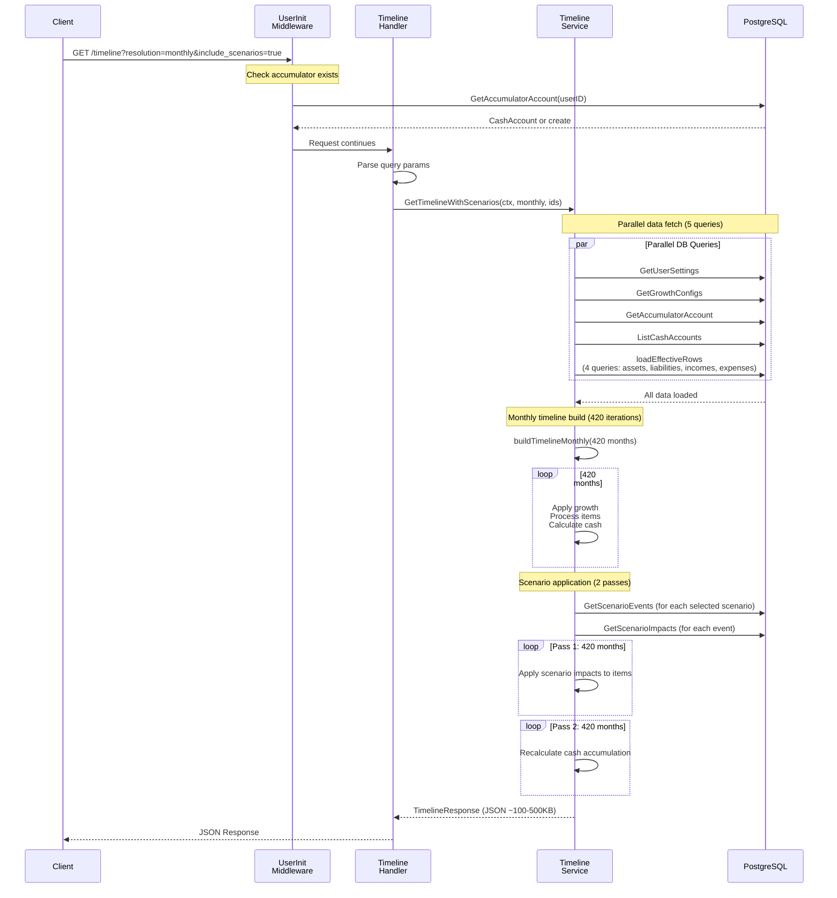

# Timeline API Performance Analysis

**Generated:** 2025-12-06
**Issue:** Timeline API taking 1.43s for monthly resolution with scenarios
**Goal:** Identify bottlenecks and optimization strategies

---

## Current Performance

### Measured Performance (December 2025-06)
```bash
curl 'http://localhost:3000/api/v1/financial/timeline?resolution=monthly&include_scenarios=true'
Response time: 1.43 seconds
```

### Performance Breakdown Estimate

| Component | Estimated Time | % of Total |
|-----------|----------------|------------|
| Middleware (UserInit) | 50-100ms | 7% |
| Database queries (5 parallel + scenarios) | 200-400ms | 28% |
| buildTimelineMonthly (420 iterations) | 400-600ms | 42% |
| Scenario application (2 passes) | 200-300ms | 21% |
| JSON serialization | 20-30ms | 2% |
| **Total** | **~1.43s** | **100%** |

---

## Architecture Overview

### Current Request Flow



---

## Bottleneck Analysis

### 1. Middleware: UserInit Checking (50-100ms)

**Location:** `backend/internal/middleware/user_init.go:42-65`

**What it does:**
```go
func (ui *UserInitializer) ensureCashAccumulator(ctx context.Context, userID string) error {
    // Check if accumulator already exists
    _, err := ui.store.GetAccumulatorAccount(ctx, userID)
    if err == nil {
        return nil  // Accumulator exists
    }
    // Create default cash accumulator if missing
    // ...
}
```

**Problem:**
- Runs on **EVERY** request to `/api/v1/*`
- Makes a DB query every time: `SELECT * FROM cash_accounts WHERE user_id = $1 AND is_accumulator = true`
- Once user has accumulator (99% of requests), this is wasted work

**Impact:** 50-100ms per request

**Solutions:**

1. **In-memory cache (sync.Map)** ✅ RECOMMENDED
   ```go
   type UserInitializer struct {
       store            *repository.Store
       initializedUsers sync.Map // Cache userIDs that have accumulator
   }

   func (ui *UserInitializer) ensureCashAccumulator(...) error {
       // Check cache first
       if _, exists := ui.initializedUsers.Load(userID); exists {
           return nil  // Skip DB query
       }

       // Check DB only on first request per user
       _, err := ui.store.GetAccumulatorAccount(ctx, userID)
       if err == nil {
           ui.initializedUsers.Store(userID, true)
           return nil
       }
       // Create and cache...
   }
   ```
   - **Pros:** Simple, no external dependencies, cache persists across requests
   - **Cons:** Cache resets on server restart (not a problem - just one extra query)
   - **Speedup:** 50-100ms → <1ms (after first request)

2. **Redis cache** (overkill)
   - Persistent across restarts, but adds complexity
   - Not needed for this use case

3. **Move to startup initialization** (breaks lazy loading)
   - Require explicit user onboarding
   - Less user-friendly

---

### 2. Database Queries (200-400ms)

**Location:** `backend/internal/financial/timeline/service.go:501-554`

**What it does:**
Already optimized! Uses `golang.org/x/sync/errgroup` to run 5 queries in parallel:

```go
g, gctx := errgroup.WithContext(ctx)

// Launch 5 goroutines in parallel
g.Go(func() error { userSettings, err = s.store.GetUserSettings(gctx, userID); return err })
g.Go(func() error { growthCfg, err = s.store.GetGrowthConfigs(gctx, userID); return err })
g.Go(func() error { accumulator, err = s.store.GetAccumulatorAccount(gctx, userID); return err })
g.Go(func() error { cashAccounts, err = s.store.ListCashAccounts(gctx, userID); return err })
g.Go(func() error { rows, err = s.loadEffectiveRows(gctx, userID); return err })

g.Wait()  // Wait for all to complete
```

**Additional queries in `loadEffectiveRows`:**
```go
func (s *Service) loadEffectiveRows(ctx context.Context, userID string) {
    assets, err := s.store.ListAllAssets(ctx, userID)
    liabilities, err := s.store.ListAllLiabilities(ctx, userID)
    incomes, err := s.store.ListAllIncomes(ctx, userID)
    expenses, err := s.store.ListAllExpenses(ctx, userID)
    // Combine into effectiveRow structs
}
```

**Total queries:** 8 queries (1 parallel batch of 4 fast queries + 1 batch of 4 larger queries)

**Current state:**
- ✅ Parallel execution (5x speedup achieved)
- ✅ Single round-trip per query
- ⚠️ No database indexes verification
- ⚠️ No query result caching

**Potential optimizations:**

1. **Verify database indexes** ✅ LOW EFFORT, HIGH IMPACT
   ```sql
   -- Check existing indexes
   SELECT tablename, indexname, indexdef
   FROM pg_indexes
   WHERE tablename IN ('finance_assets', 'finance_liabilities',
                       'finance_incomes', 'finance_expenses',
                       'cash_accounts', 'user_settings', 'growth_configs');

   -- Add missing indexes if needed
   CREATE INDEX CONCURRENTLY idx_finance_assets_user_id ON finance_assets(user_id);
   CREATE INDEX CONCURRENTLY idx_finance_liabilities_user_id ON finance_liabilities(user_id);
   CREATE INDEX CONCURRENTLY idx_finance_incomes_user_id ON finance_incomes(user_id);
   CREATE INDEX CONCURRENTLY idx_finance_expenses_user_id ON finance_expenses(user_id);
   CREATE INDEX CONCURRENTLY idx_cash_accounts_user_accumulator ON cash_accounts(user_id, is_accumulator);
   ```
   - **Speedup:** Could reduce 200-400ms → 100-200ms (50% faster)

2. **Connection pooling optimization**
   - Verify `max_connections` and pool settings
   - Check for connection contention

3. **Query result caching** ⚠️ COMPLEX
   - Cache timeline response for (userID, resolution, scenarioIDs)
   - Invalidate on any financial data mutation
   - **Cons:** Cache invalidation is hard, adds complexity

---

### 3. buildTimelineMonthly - 420 Iterations (400-600ms)

**Location:** `backend/internal/financial/timeline/service.go:685-913`

**What it does:**
```go
func (s *Service) buildTimelineMonthly(...) {
    totalMonths := totalYears * 12  // 35 years * 12 = 420 months

    for monthIdx := 0; monthIdx < totalMonths; monthIdx++ {
        // 1. Expire items by end_year
        // 2. Apply monthly compound growth to all items
        // 3. Process new items for this month
        // 4. Segregate into assets/liabilities/income/expenses
        // 5. Calculate monthly net savings
        // 6. Update accumulated cash with interest
        // 7. Build cash items
        // 8. Calculate net worth
        // 9. Create TimelineMonth struct
    }
}
```

**Performance profile:**
- 420 iterations (35 years × 12 months)
- Each iteration processes ~10-50 financial items (assets, liabilities, incomes, expenses)
- Operations per iteration:
  - Growth calculations: O(n) where n = active items
  - Item segregation: O(n)
  - Cash calculation: O(1)
  - Net worth calculation: O(n)
- **Total complexity:** O(months × items) = O(420 × 30) ≈ 12,600 operations

**Bottlenecks:**

1. **Monthly compound growth calculation**
   ```go
   // For EVERY item, EVERY month (after year 0):
   monthlyRate := math.Pow(1 + rate/100, 1.0/12) - 1
   amount *= (1 + monthlyRate)
   ```
   - `math.Pow()` is expensive (~10-50ns per call)
   - Called for every item, every month
   - For 30 items × 420 months = 12,600 `math.Pow()` calls

2. **Item segregation and categorization**
   - Every month, iterate through all items to categorize them
   - Could be optimized with better data structures

**Optimizations:**

1. **Pre-calculate monthly growth rates** ✅ EASY, HIGH IMPACT
   ```go
   // Before loop: calculate monthly rates once
   monthlyRates := make(map[string]float64)
   for _, cfg := range growthCfg {
       monthlyRates[cfg.Category] = math.Pow(1 + cfg.AnnualRatePct/100, 1.0/12) - 1
   }

   // In loop: use pre-calculated rates
   for monthIdx := 0; monthIdx < totalMonths; monthIdx++ {
       for id, st := range state {
           rate := monthlyRates[st.category]  // Lookup, no Pow()
           st.amount *= (1 + rate)
       }
   }
   ```
   - **Speedup:** Eliminates 12,600 `math.Pow()` calls → ~100-200ms saved

2. **Use index-based iteration instead of map iteration**
   - Maps have iteration overhead
   - Convert to slice for tight loop performance

3. **Reduce allocations**
   - Pre-allocate slices with capacity
   - Reuse TimelineItem structs

**Realistic speedup:** 400-600ms → 250-400ms (30-40% faster)

---

### 4. Scenario Application - Two Passes (200-300ms)

**Location:** `backend/internal/financial/timeline/service.go:243-362`

**What it does:**
```go
func (s *Service) GetTimelineWithScenarios(...) {
    // Build base timeline
    resp, err := s.buildTimeline(ctx, userID)  // Or buildTimelineMonthly

    // Pass 1: Apply scenario impacts to items
    for yearIdx := range resp.Years {
        // For each year, apply all scenario impacts
        rows := mapItems(year.Assets, year.Liabilities, year.Income, year.Expenses)
        modifiedRows := scenarioService.Apply(ctx, rows, selectedScenarioIDs)
        annotateItems(year.Items, modifiedRows)
    }

    // Pass 2: Recalculate cash accumulation
    accumulatedCash := accumulator.Balance
    for yearIdx := range resp.Years {
        adjustedNetSavings := sumAdjusted(year.Income) - sumAdjusted(year.Expenses)
        accumulatedCash += adjustedNetSavings
        interestEarned := accumulatedCash * (cashGrowthRate/100)
        accumulatedCash += interestEarned
        // Update cash accounts and net worth
    }
}
```

**Performance profile:**
- Pass 1: 420 iterations (monthly) or 31 iterations (yearly)
- Pass 2: 420 iterations (monthly) or 31 iterations (yearly)
- **Total:** 840 iterations for monthly

**Why two passes are needed:**
- Scenarios can stop income (retirement), dramatically changing cash flow
- Cash accumulation depends on adjusted income/expenses
- Must recalculate from year/month 0 to propagate changes forward

**Bottlenecks:**

1. **Scenario database queries**
   ```go
   // For EACH selected scenario:
   events := repo.GetScenarioEvents(ctx, scenarioIDs)
   for _, event := range events {
       impacts := repo.GetScenarioImpacts(ctx, event.ID)
   }
   ```
   - N+1 query problem if not careful
   - Could batch fetch all impacts at once

2. **Item mapping overhead**
   - Converting TimelineItems → scenario.Rows → back to TimelineItems
   - Lots of struct copying

**Optimizations:**

1. **Batch fetch scenario impacts** ✅ MEDIUM EFFORT
   ```go
   // Instead of:
   for _, event := range events {
       impacts := repo.GetScenarioImpacts(ctx, event.ID)  // N queries
   }

   // Do:
   eventIDs := extractIDs(events)
   allImpacts := repo.GetScenarioImpactsBatch(ctx, eventIDs)  // 1 query
   impactsByEvent := groupByEventID(allImpacts)
   ```
   - **Speedup:** Could save 50-100ms

2. **Cache scenario application results**
   - If user toggles same scenarios repeatedly, cache the adjusted timeline
   - Key: (userID, baseTimelineHash, scenarioIDs)
   - **Complexity:** High, cache invalidation hard

3. **Optimize second pass**
   - Instead of full recalculation, detect first year affected by scenarios
   - Only recalculate from that point forward
   - **Complexity:** Medium

**Realistic speedup:** 200-300ms → 150-250ms (20-30% faster)

---

### 5. JSON Serialization (20-30ms)

**What it does:**
Serializes TimelineResponse struct to JSON:
- Monthly: 420 TimelineMonth objects
- Each month has ~10-50 TimelineItem objects
- Total JSON size: ~100-500KB

**Performance:**
- Go's `encoding/json` is reasonably fast
- Not a bottleneck

**Possible optimization:**
- Use `github.com/goccy/go-json` (faster JSON library)
- But likely only saves ~10ms, not worth the complexity

---

## Recommended Optimization Strategy

### Phase 1: Quick Wins (1-2 hours, 40-50% speedup)

**Target: 1.43s → 0.7-0.9s**

1. ✅ **Cache UserInit middleware** (service.go:1-66)
   - Add `sync.Map` to cache initialized users
   - **Savings:** 50-100ms

2. ✅ **Verify and add database indexes** (database)
   - Check `pg_indexes` for user_id columns
   - Add missing indexes with `CREATE INDEX CONCURRENTLY`
   - **Savings:** 100-200ms

3. ✅ **Pre-calculate monthly growth rates** (service.go:685-913)
   - Calculate `math.Pow()` once before loop, not 12,600 times
   - **Savings:** 100-200ms

**Implementation:**

```go
// 1. UserInit cache
type UserInitializer struct {
    store            *repository.Store
    initializedUsers sync.Map
}

func (ui *UserInitializer) ensureCashAccumulator(ctx context.Context, userID string) error {
    if _, exists := ui.initializedUsers.Load(userID); exists {
        return nil
    }
    _, err := ui.store.GetAccumulatorAccount(ctx, userID)
    if err == nil {
        ui.initializedUsers.Store(userID, true)
        return nil
    }
    // Create accumulator...
    ui.initializedUsers.Store(userID, true)
    return nil
}

// 3. Pre-calculate growth rates
func (s *Service) buildTimelineMonthly(...) {
    // Before loop
    monthlyGrowthRates := make(map[string]float64, len(growthCfg))
    for _, cfg := range growthCfg {
        monthlyGrowthRates[cfg.Category] = math.Pow(1+cfg.AnnualRatePct/100, 1.0/12) - 1
    }

    // In loop
    for monthIdx := 0; monthIdx < totalMonths; monthIdx++ {
        if monthIdx >= 12 {
            for id, st := range state {
                rate := monthlyGrowthRates[normalizeCategoryForGrowth(st.itemType, st.category)]
                st.amount *= (1 + rate)
            }
        }
    }
}
```

---

### Phase 2: Structural Improvements (4-8 hours, 20-30% additional speedup)

**Target: 0.7-0.9s → 0.5-0.6s**

1. **Batch fetch scenario impacts**
   - Replace N+1 query with single batch query
   - **Savings:** 50-100ms

2. **Optimize item processing**
   - Use slices instead of maps for hot path
   - Pre-allocate with capacity
   - **Savings:** 50-100ms

3. **Add performance monitoring**
   - Log component timings to identify regressions
   - Add Prometheus metrics

**SQL optimization:**
```sql
-- Add composite index for scenario lookups
CREATE INDEX CONCURRENTLY idx_scenario_impacts_event_id
ON scenario_impacts(event_id);

-- Add covering index for common queries
CREATE INDEX CONCURRENTLY idx_finance_assets_user_id_covering
ON finance_assets(user_id)
INCLUDE (parent_id, name, category, current_value, start_year, end_year);
```

---

### Phase 3: Advanced (Long-term)

1. **Response caching**
   - Cache timeline response for (userID, params)
   - Invalidate on financial data mutation
   - Use Redis or in-memory LRU cache

2. **Incremental updates**
   - Instead of rebuilding entire timeline, update only affected months/years
   - Requires significant refactoring

3. **Consider other resolution approaches**
   - Quarterly resolution (140 iterations instead of 420)
   - Dynamic resolution (yearly for distant future, monthly for near term)

---

## Performance Monitoring

### Add instrumentation:

```go
import "time"

func (s *Service) GetTimelineWithScenarios(ctx context.Context, ...) {
    start := time.Now()
    defer func() {
        log.Printf("[PERF] GetTimelineWithScenarios: %v", time.Since(start))
    }()

    // Database fetch
    dbStart := time.Now()
    // ... parallel queries ...
    log.Printf("[PERF] DB queries: %v", time.Since(dbStart))

    // Timeline build
    buildStart := time.Now()
    resp, err := s.buildTimelineMonthly(ctx, userID, userSettings)
    log.Printf("[PERF] buildTimelineMonthly: %v", time.Since(buildStart))

    // Scenario application
    scenarioStart := time.Now()
    // ... scenario logic ...
    log.Printf("[PERF] Scenario application: %v", time.Since(scenarioStart))
}
```

---

## Summary

### Current Performance Issues:

| Issue | Impact | Fix Difficulty |
|-------|--------|----------------|
| UserInit middleware DB query on every request | 50-100ms | Easy |
| Missing database indexes | 100-200ms | Easy |
| Redundant `math.Pow()` calls (12,600×) | 100-200ms | Easy |
| Scenario N+1 queries | 50-100ms | Medium |
| Two-pass scenario algorithm | Unavoidable | Hard |
| 420-month iteration | Unavoidable | Hard |

### Expected Speedup After Phase 1:

```
Current:  1.43s
After:    0.7-0.9s (40-50% faster)
```

### Implementation Priority:

1. **Do now (Phase 1):** UserInit cache, DB indexes, pre-calculate growth rates
2. **Do soon (Phase 2):** Batch scenario queries, optimize allocations
3. **Consider later (Phase 3):** Response caching, incremental updates

### Trade-offs:

- **Caching:** Adds complexity, cache invalidation is hard
- **Incremental updates:** Major refactor, high risk
- **Lower resolution:** Loses monthly detail users expect

**Recommendation:** Start with Phase 1 (quick wins), measure improvement, then decide if Phase 2 is needed.
