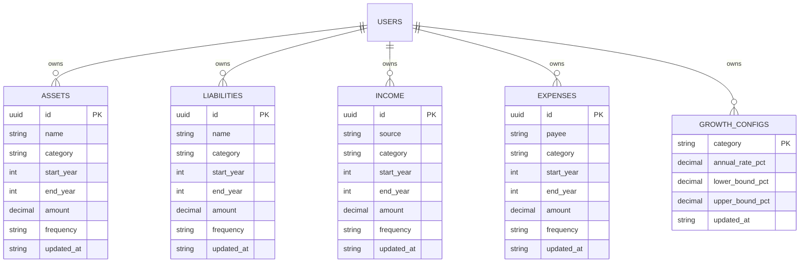
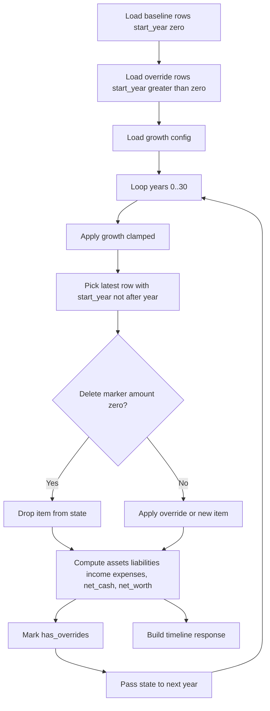

## Data Model (Effective-Dated Values, no separate items table)

_Notes_: Baseline rows have `start_year=0`; overrides/new rows use `start_year > 0`; `end_year` optional; `amount=0` at `start_year=N` = delete from N forward. Uniqueness on `(user_id, id, start_year)` per table.

## Projection Flow

