# CPF Module Backend Integration Specification

## Overview

This specification details the migration of CPF frontend calculations to the backend, replacing all mock data with real API calls. The goal is to make the frontend a pure presentation layer while the backend handles all CPF-related computations.

---

## Scope

### In Scope
- CPF Module tabs: Overview, Projection, Property, Retirement, Strategies, Learn
- All frontend CPF calculations moved to backend
- User-specific CPF assumptions (persisted per account)
- 30-year projection with date range queries
- Age 55 RA conversion calculations
- CPF LIFE payout estimations
- Property sale CPF refund calculations

### Out of Scope
- CPFIS (CPF Investment Scheme) tracking
- CPF contribution history tables
- Admin UI for CPF policy constants
- RSTU (Retirement Sum Topping-Up) tax relief calculations
- OA-to-SA transfer tax relief calculations

---

## Architecture Diagrams

### Database Schema

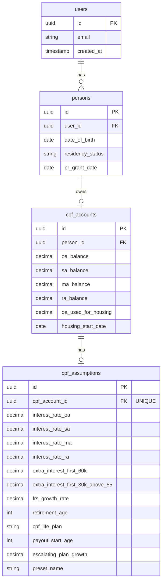

### System Data Flow

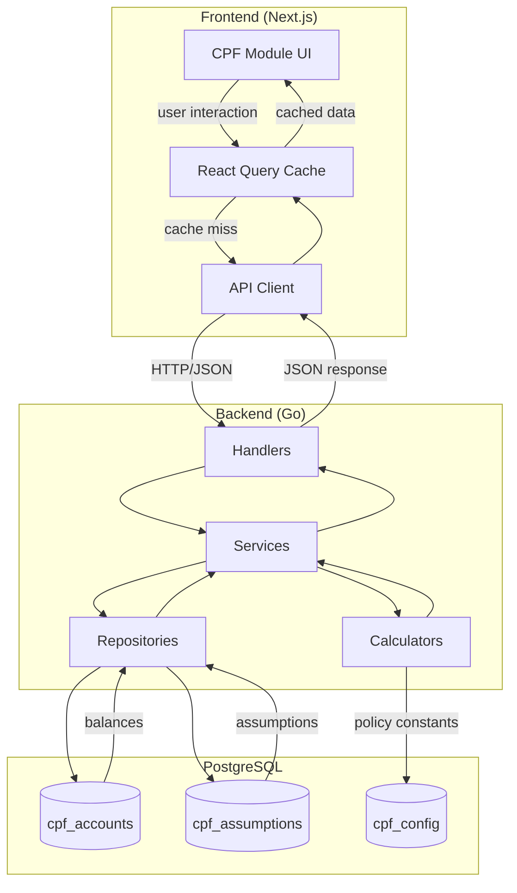

### Projection Calculation Flow

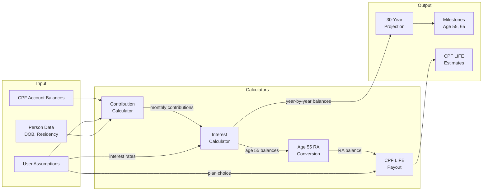

### API Request Flow (Assumptions Example)

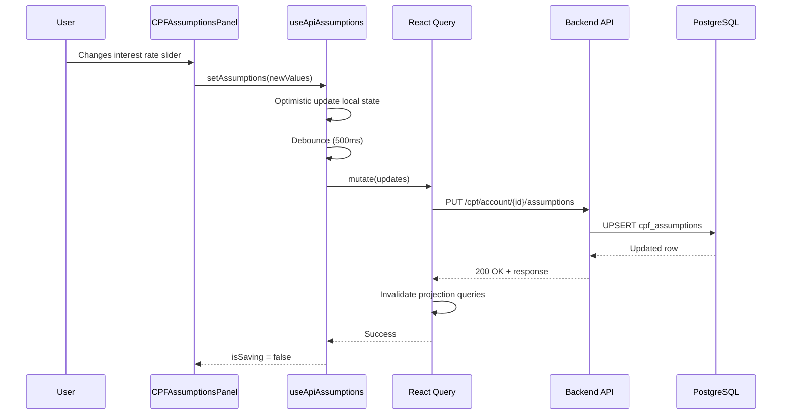

### Age 55 Conversion Flow

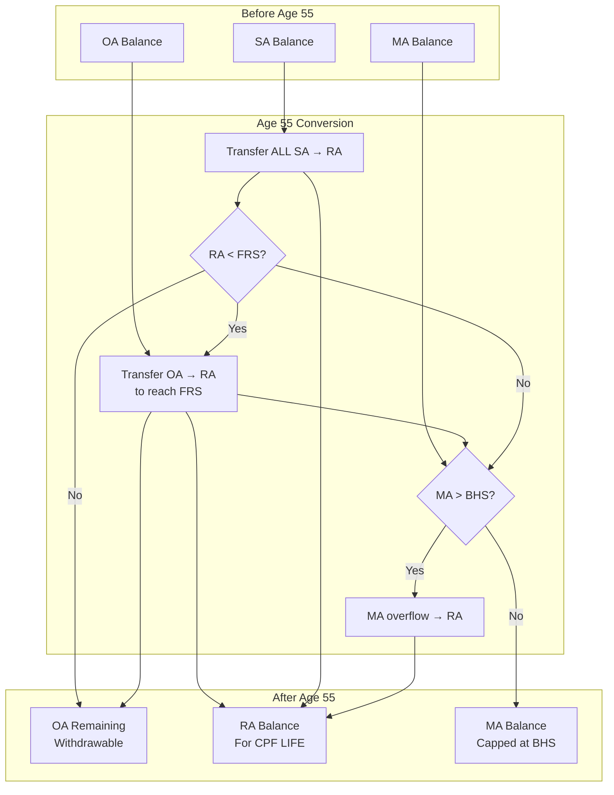

---

## Projection Architecture

This section documents the **hybrid projection model** for CPF data, clarifying when to use each system and how they relate.

### Two CPF Processing Systems

The backend has two complementary systems for CPF projections:

| System | Location | Purpose | Use Case |
|--------|----------|---------|----------|
| **Timeline Service** | `financial_v2/timeline/service.go` | Monthly CPF snapshots integrated with full financial picture | Dashboard charts, net worth, scenario modeling |
| **Standalone Projector** | `cpf/projector/projector.go` | Long-range CPF-specific projections | 30-year charts, retirement planning, CPF LIFE estimates |

### When to Use Each System

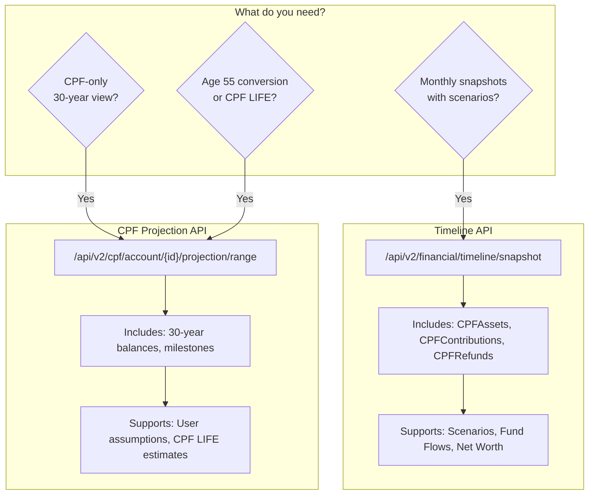

### Data Flow Comparison

**Timeline API Flow:**
```
Income → Scenario Impacts → CPF Contributions → Fund Flows → Monthly Balances
         (if enabled)       (per income)        (transfers)   (accumulated)
```

**Standalone Projector Flow:**
```
AccountSnapshot + IncomeStreams + Assumptions → Month-by-Month → Yearly Aggregates
(starting balances)  (CPF-eligible)   (interest rates)   (contributions + interest)
```

### Data Consistency

Both systems should produce consistent CPF balances when:
1. Same starting balances are used
2. Same income streams are considered
3. No scenario impacts are applied (Timeline) or scenarios are disabled

**Key Difference:** The Timeline integrates CPF with fund flows (e.g., OA used for mortgage payments), while the Standalone Projector focuses on pure CPF accumulation.

---

## CPF Processing in Timeline DAG

The Timeline service processes financial data through a 7-step monthly pipeline. CPF is integrated at **Step 5**.

### Monthly Processing Pipeline

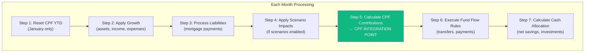

### Step 5 Details: CPF Contribution Calculation

**Location:** `backend/internal/financial_v2/timeline/service.go` (processMonth function)

```go
// Simplified flow in processMonth():

// 1. Reset YTD at year boundaries (for AW ceiling calculation)
mctx.resetAllCPFContextsYTD()

// 2. Process all CPF-eligible incomes
for _, income := range activeIncomes {
    if income.CPFWageType != "" {
        monthlyWage := getMonthlyAmount(income)

        // Apply scenario impact if enabled
        if scenarioAdjusted != nil {
            monthlyWage = scenarioAdjusted
        }

        // Route to OW or AW processor
        if income.CPFWageType == "ow" {
            result = cpfContext.Processor.ProcessOrdinaryWage(monthlyWage, ...)
        } else {
            result = cpfContext.Processor.ProcessAdditionalWage(monthlyWage, ...)
        }

        // Track for response
        contributionResults = append(contributionResults, result)
    }
}

// 3. Accumulate to balances (except anchor month)
if !isAnchorMonth {
    cpfContext.Balances.AddContribution(result.Allocation)
}
```

### Key Implementation Details

| Aspect | Implementation |
|--------|----------------|
| **YTD Tracking** | Reset in January for Additional Wage (AW) ceiling: `$102,000 - YTD_OW - YTD_AW` |
| **Anchor Month** | First month shows starting balances, contributions calculated but not accumulated |
| **Scenario Integration** | Contributions use scenario-adjusted income if `includeScenarios=true` |
| **Fund Flow Integration** | CPF OA can pay mortgages via `executePaymentRules()` in Step 6 |

### Response Building

The timeline response includes three CPF-related arrays:

```json
{
  "months": [{
    "cpfAssets": [
      { "id": "cpf-oa", "name": "CPF Ordinary Account", "balance": "150000.00" },
      { "id": "cpf-sa", "name": "CPF Special Account", "balance": "85000.00" },
      { "id": "cpf-ma", "name": "CPF Medisave Account", "balance": "68500.00" }
    ],
    "cpfContributions": [
      {
        "id": "income-abc-cpf",
        "name": "CPF Contribution - Salary",
        "employeeContribution": "1000.00",
        "employerContribution": "850.00",
        "allocationOa": "1150.00",
        "allocationSa": "300.00",
        "allocationMa": "400.00"
      }
    ],
    "cpfRefunds": []
  }]
}
```

---

## Interest Calculation

### Current State (Gap)

The standalone projector uses **hardcoded interest rates**:

```go
// backend/internal/cpf/projector/interest.go
var (
    OAInterestRatePct = decimal.MustFromFloat64(2.5)  // 2.5% p.a.
    SAInterestRatePct = decimal.MustFromFloat64(4.0)  // 4.0% p.a.
    MAInterestRatePct = decimal.MustFromFloat64(4.0)  // 4.0% p.a.
    RAInterestRatePct = decimal.MustFromFloat64(4.0)  // 4.0% p.a.
)
```

User assumptions are **stored but not used**:

```go
// backend/internal/cpf/assumptions/repository.go
type CPFAssumptions struct {
    InterestRateOA               decimal.Decimal  // User can customize
    InterestRateSA               decimal.Decimal
    InterestRateMA               decimal.Decimal
    InterestRateRA               decimal.Decimal
    ExtraInterestFirst60K        decimal.Decimal  // +1% on first $60k
    ExtraInterestFirst30KAbove55 decimal.Decimal  // +2% on first $30k (55+)
}
```

### Target State (Phase 2)

The projector should accept assumptions as input:

```go
// Target signature for ProjectToDate:
func (p *Projector) ProjectToDate(
    snapshot AccountSnapshot,
    incomes []IncomeStream,
    assumptions *CPFAssumptions,  // NEW: User assumptions
    targetDate time.Time,
) (*ProjectedBalances, error)
```

### Interest Calculation Formula

#### Base Interest (Per Account)

**Monthly Simple Interest:**
```
monthly_interest = balance × (annual_rate / 12)

Example: $100,000 OA at 2.5% p.a.
  = $100,000 × (0.025 / 12) = $208.33/month
```

| Account | Base Rate | Interest Credited To |
|---------|-----------|---------------------|
| OA | 2.5% p.a. | OA |
| SA | 4.0% p.a. | SA |
| MA | 4.0% p.a. | MA |
| RA | 4.0% p.a. | RA |

---

#### Extra Interest: First $60k (All Members)

Members earn **+1% extra interest** on the first $60,000 of **combined balances** (OA + SA + MA, or OA + RA for 55+).

**Calculation Order:** OA first, then SA/RA, then MA

```
combined = OA + SA + MA  (or OA + RA for 55+)
eligible_for_extra = min(combined, 60000)

// Apply in priority order:
extra_from_oa = min(OA, eligible_for_extra)
remaining = eligible_for_extra - extra_from_oa
extra_from_sa = min(SA, remaining)  // or RA if 55+
remaining = remaining - extra_from_sa
extra_from_ma = min(MA, remaining)

total_extra_interest = (extra_from_oa + extra_from_sa + extra_from_ma) × (0.01 / 12)
```

**Where Extra Interest is Credited:**

| Age | Extra Interest Credited To |
|-----|---------------------------|
| Below 55 | **SA** (Special Account) |
| 55 and above | **RA** (Retirement Account) |

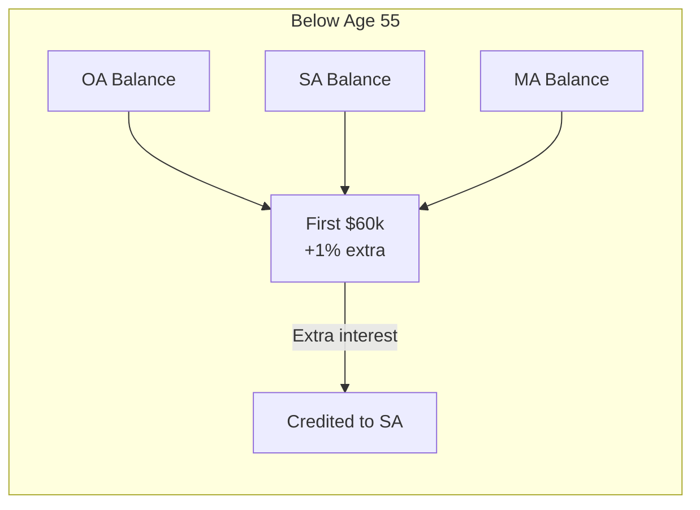

---

#### Extra Interest: First $30k (Age 55+ Only)

Members aged 55+ earn an **additional +1% extra interest** on the first $30,000 of combined balances.

**This stacks with the first $60k extra interest:**
- First $30k: +2% total extra (1% + 1%)
- Next $30k (up to $60k): +1% extra
- Above $60k: Base rates only

```
// For members 55+:
first_30k = min(combined, 30000)
next_30k = min(combined - 30000, 30000)  // $30k to $60k portion

extra_interest_first_30k = first_30k × (0.02 / 12)    // +2% total
extra_interest_next_30k = next_30k × (0.01 / 12)      // +1%

total_extra = extra_interest_first_30k + extra_interest_next_30k
```

**Where Credited:** All extra interest for 55+ goes to **RA**

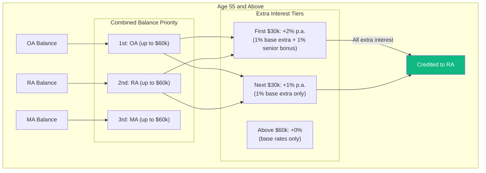

---

#### Complete Interest Calculation Example

**Scenario:** Age 56, balances: OA=$80,000, RA=$150,000, MA=$70,000

```
Combined = $80,000 + $150,000 + $70,000 = $300,000

Step 1: Base Interest (credited to respective accounts)
  OA: $80,000 × 2.5% / 12 = $166.67 → OA
  RA: $150,000 × 4.0% / 12 = $500.00 → RA
  MA: $70,000 × 4.0% / 12 = $233.33 → MA

Step 2: Extra Interest on First $60k (credited to RA)
  Priority order: OA first, then RA, then MA

  First $30k (from OA): $30,000 × 2% / 12 = $50.00 → RA
  Next $30k (from OA): $30,000 × 1% / 12 = $25.00 → RA

  Total extra from OA: $75.00 (uses full $60k from OA alone)

Step 3: Total Monthly Interest
  OA receives: $166.67 (base only)
  RA receives: $500.00 (base) + $75.00 (extra) = $575.00
  MA receives: $233.33 (base only)

  Grand Total: $975.00/month
```

---

#### Interest Flow Diagram (Comprehensive)

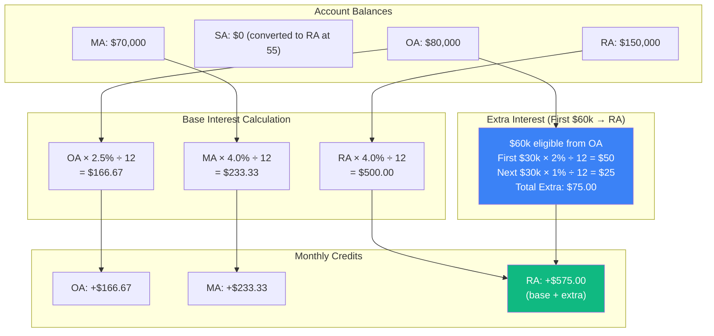

---

### Timeline Interest Gap

**Current:** Timeline service does NOT calculate interest on CPF balances - it only tracks contribution accumulation.

**Phase 2 Goal:** Either:
1. Add interest calculation to Timeline CPF processing (including extra interest flow to SA/RA), OR
2. Document that interest is only calculated in standalone projections

**Recommendation:** Option 2 is simpler. Timeline shows contribution accumulation; standalone projector shows full balance growth with compounded interest.

---

## CPF LIFE Payout & Bequest Calculation

> ⚠️ **IMPORTANT DISCLAIMER**
>
> The calculations in this section are **approximations for planning purposes only**. CPF LIFE is a complex annuity product and CPF Board does not publicly disclose the exact actuarial formulas used. Actual payouts may differ from these estimates due to:
> - **Cohort-specific factors**: CPF Board adjusts rates based on each birth cohort's life expectancy
> - **Interest rate changes**: Payout rates are reviewed periodically and may change
> - **Policy updates**: CPF rules and rates are subject to government policy changes
> - **Individual circumstances**: Health status, citizenship, and other factors may apply
>
> **Always verify with CPF Board's official estimator** at [cpf.gov.sg](https://www.cpf.gov.sg) for accurate, personalized projections. The figures here are derived from the CPF Playbook (2025) and should be treated as rough estimates only.

CPF LIFE provides lifelong monthly payouts starting from the chosen payout age (65-70). The three plans differ in payout amounts and bequest (money left to beneficiaries upon death).

### CPF LIFE Plans Overview

| Plan | Monthly Payout | Bequest | Best For |
|------|---------------|---------|----------|
| **Standard** | Highest | Lower | Members who want maximum monthly income |
| **Basic** | Medium | Higher | Members who want to leave more to beneficiaries |
| **Escalating** | Starts lowest, grows 2%/year | Medium | Members concerned about inflation |

---

### Payout Calculation

CPF LIFE payouts are determined by:
1. **RA balance at age 55** (grows with 4% interest until payout starts)
2. **Gender** (females live longer → lower monthly payout for same balance)
3. **Payout start age** (65-70, +7% per year deferment)
4. **Plan type** (Standard/Basic/Escalating)

#### Quick Payout Calculation (from CPF Playbook)

**Standard Plan Formula:**
```
monthly_payout_at_65 = RA_balance_at_55 ÷ divisor

| Gender | Divisor |
|--------|---------|
| Male   | 120     |
| Female | 132     |
```

**Plan Adjustments (relative to Standard):**
| Plan | Adjustment |
|------|------------|
| **Basic** | ~90% of Standard |
| **Escalating** | ~80% of Standard initially (then +2%/year) |

**Deferment Bonus:**
- +7% per year for each year payout is delayed (ages 65-70)
- Max +40% at age 70

#### Payout by Retirement Sum (2025, Standard Plan at 65)

| Retirement Sum | Amount | Male Payout | Female Payout |
|----------------|--------|-------------|---------------|
| **BRS** | $106,500 | $890/month | $810/month |
| **FRS** | $213,000 | $1,775/month | $1,614/month |
| **ERS** | $426,000 | $3,550/month | $3,230/month |

*Source: CPF Playbook quick calculation (RA ÷ divisor)*

#### Payout Comparison by Plan (FRS at 65)

| Plan | Male | Female | Notes |
|------|------|--------|-------|
| **Standard** | $1,775 | $1,614 | Highest initial payout |
| **Basic** | $1,598 | $1,453 | ~90% of Standard |
| **Escalating** | $1,420 | $1,291 | ~80% initially, +2%/year |

#### Deferment Impact (FRS, Standard, Male)

| Start Age | Monthly Payout | vs Age 65 |
|-----------|---------------|-----------|
| 65 | $1,730 | - |
| 66 | $1,850 | +7% |
| 67 | $1,980 | +14% |
| 68 | $2,120 | +23% |
| 69 | $2,270 | +31% |
| 70 | $2,430 | +40% |

*Note: Payouts auto-start at 70 if not initiated.*

---

### Escalating Plan Growth

The Escalating plan starts with lower payouts but increases by **2% annually**:

```
payout(year_n) = payout(year_1) × (1.02)^(n-1)

Example: FRS Male, Starting payout $1,420/month at age 65
  Age 65 (Year 1):  $1,420/month
  Age 70 (Year 6):  $1,420 × 1.02^5 = $1,568/month
  Age 75 (Year 11): $1,420 × 1.02^10 = $1,731/month
  Age 85 (Year 21): $1,420 × 1.02^20 = $2,110/month
  Age 95 (Year 31): $1,420 × 1.02^30 = $2,572/month
```

#### Break-even Points (from CPF Playbook)

**Monthly Payout Break-even** (when Escalating exceeds others):
- vs Basic Plan: **Age 73** (~8 years)
- vs Standard Plan: **Age 77** (~12 years)

**Cumulative Payout Break-even** (total received):
- vs Basic Plan: **Age 80** (~15 years)
- vs Standard Plan: **Age 88** (~23 years)

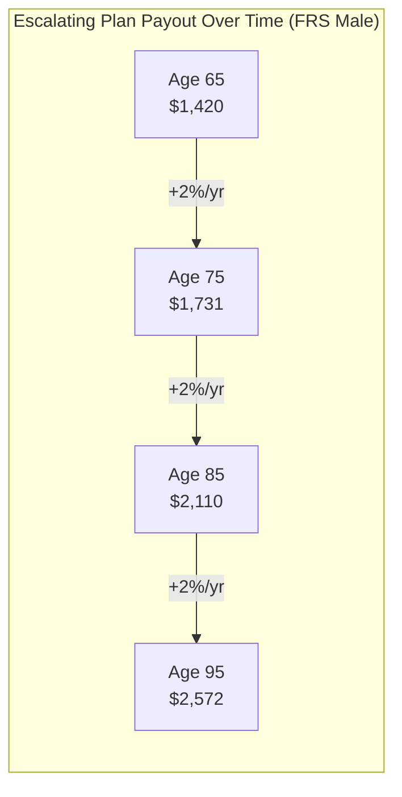

---

### Bequest Calculation

Bequest is the amount paid to beneficiaries if the member passes away. It depends on:
1. **Plan type** (Basic has highest bequest)
2. **Premium paid** (initial RA transferred to CPF LIFE)
3. **Total payouts received** before death
4. **Interest earned** on remaining premium

#### Bequest Formula by Plan

**Basic Plan:**
```
bequest = unused_premium + interest_earned

unused_premium = premium_paid - total_payouts_received
interest_earned = accumulated_interest_on_unused_premium

// Basic Plan guarantees return of unused premium
```

**Standard Plan:**
```
bequest = max(0, premium_paid - total_payouts_received)

// Standard Plan bequest decreases as payouts are received
// Bequest reaches $0 after ~10-12 years of payouts typically
```

**Escalating Plan:**
```
bequest = max(0, premium_paid - total_payouts_received)

// Similar to Standard, but lower initial payouts mean
// bequest lasts longer before reaching $0
```

---

### Bequest Over Time (from CPF Playbook)

**Scenario:** FRS ($213,000) at age 55, grows to ~$315,000 by age 65 (at 4% interest)

| Age at Death | Standard Plan | Basic Plan | Escalating Plan |
|--------------|---------------|------------|-----------------|
| **65** (payout starts) | $315,000 | $315,000 | $315,000 |
| **75** (10 years) | $111k-124k | $228k-232k | $139k-155k |
| **80** (15 years) | ~$4,500 | $135k | ~$102k |
| **85** (20 years) | **$0** | $108k-119k | **$0** |
| **90** (25 years) | $0 | $45k | $0 |
| **95** (30 years) | $0 | **$0** | $0 |

**Key Insights:**
- **Standard**: Bequest depletes by ~age 85 (highest payouts consume premium fastest)
- **Basic**: Bequest remains substantial until ~age 95 (only 10-20% used as premium)
- **Escalating**: Bequest depletes by ~age 85 (lower early payouts extend slightly vs Standard)

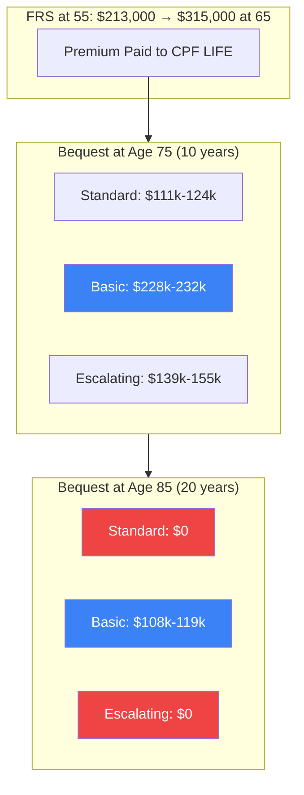

---

### Bequest Depletion Timeline

```
Bequest Remaining ($)
$315k │
      │ ●━━━━━━●━━━━━━━━━━━━━━━━━━━━━━━━━━━━●  Basic (depletes ~95)
      │  ╲      ╲
$200k │   ╲      ●━━━━━━●━━━━━━━━━●
      │    ╲             Escalating (depletes ~85)
      │     ╲
$100k │      ●━━━━━●
      │            Standard (depletes ~85)
      │             ╲
   $0 │──────────────●────────────────────────────►
      65    70    75    80    85    90    95   Age

Legend:
━━━  Basic Plan (highest bequest, lowest payout)
━━━  Standard Plan (lowest bequest, highest payout)
━━━  Escalating Plan (moderate bequest, growing payout)
```

---

### CPF LIFE Projection Integration

The projection should calculate:

1. **RA Balance at Payout Age**
   ```
   ra_at_payout_age = project_cpf_balances(current_ra, contributions, interest, payout_start_age)
   ```

2. **Monthly Payout Estimates**
   ```go
   type CPFLifeEstimates struct {
       Standard   MonthlyPayout
       Basic      MonthlyPayout
       Escalating MonthlyPayout
   }

   type MonthlyPayout struct {
       InitialMonthly    decimal.Decimal  // First month payout
       YearlyTotal       decimal.Decimal  // First year total
       PayoutAt75        decimal.Decimal  // For escalating: payout at age 75
       PayoutAt85        decimal.Decimal  // For escalating: payout at age 85
   }
   ```

3. **Bequest Estimates** (at sample ages)
   ```go
   type BequestEstimates struct {
       AtAge75  BequestByPlan  // After 10 years of payouts
       AtAge80  BequestByPlan  // After 15 years of payouts
       AtAge85  BequestByPlan  // After 20 years of payouts
       AtAge90  BequestByPlan  // After 25 years of payouts
   }

   type BequestByPlan struct {
       Standard   decimal.Decimal
       Basic      decimal.Decimal
       Escalating decimal.Decimal
   }
   ```

---

### Projection Response Structure

```json
{
  "cpfLifeEstimates": {
    "raBalanceAtPayout": "450000.00",
    "payoutStartAge": 65,

    "payouts": {
      "standard": {
        "initialMonthly": "2475.00",
        "yearlyTotal": "29700.00"
      },
      "basic": {
        "initialMonthly": "2250.00",
        "yearlyTotal": "27000.00"
      },
      "escalating": {
        "initialMonthly": "1980.00",
        "yearlyTotal": "23760.00",
        "payoutAt75": "2414.00",
        "payoutAt85": "2942.00"
      }
    },

    "bequestEstimates": {
      "atAge75": {
        "standard": "153000.00",
        "basic": "180000.00",
        "escalating": "168000.00"
      },
      "atAge80": {
        "standard": "4500.00",
        "basic": "135000.00",
        "escalating": "102000.00"
      },
      "atAge85": {
        "standard": "0.00",
        "basic": "90000.00",
        "escalating": "36000.00"
      },
      "atAge90": {
        "standard": "0.00",
        "basic": "45000.00",
        "escalating": "0.00"
      }
    }
  }
}
```

---

### RSS (Retirement Sum Scheme) - Below Minimum

Members with RA below the Minimum Retirement Sum (MRS, ~$60,000) don't qualify for CPF LIFE and instead receive **RSS payouts**:

```
RSS monthly payout = ra_balance / expected_payout_months

// Expected payout months varies by age, typically ~240 months (20 years)
// RSS payouts stop when RA is exhausted (not lifelong)

Example: $40,000 RA at age 65
  = $40,000 / 240 months
  = ~$167/month for 20 years
```

**Key Difference:** RSS has fixed duration (RA depletes), CPF LIFE is lifelong (never runs out).

---

## Assumptions Integration Flow

### Current State

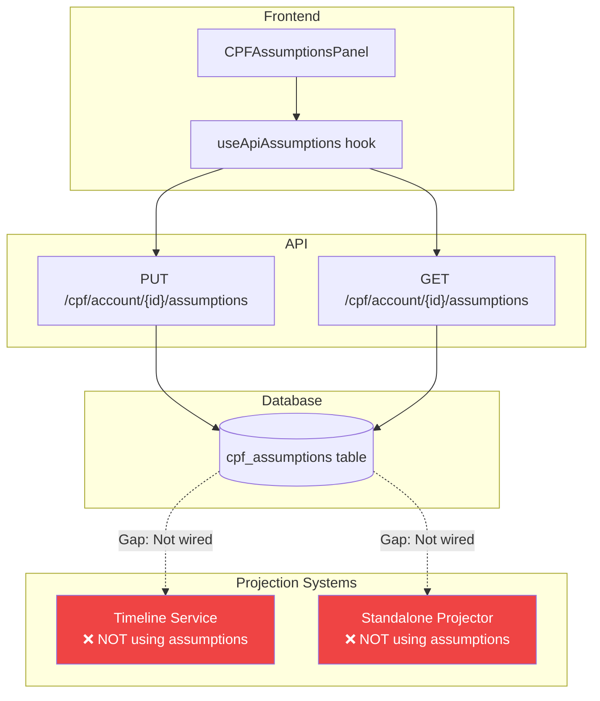

### Target State (Phase 2)

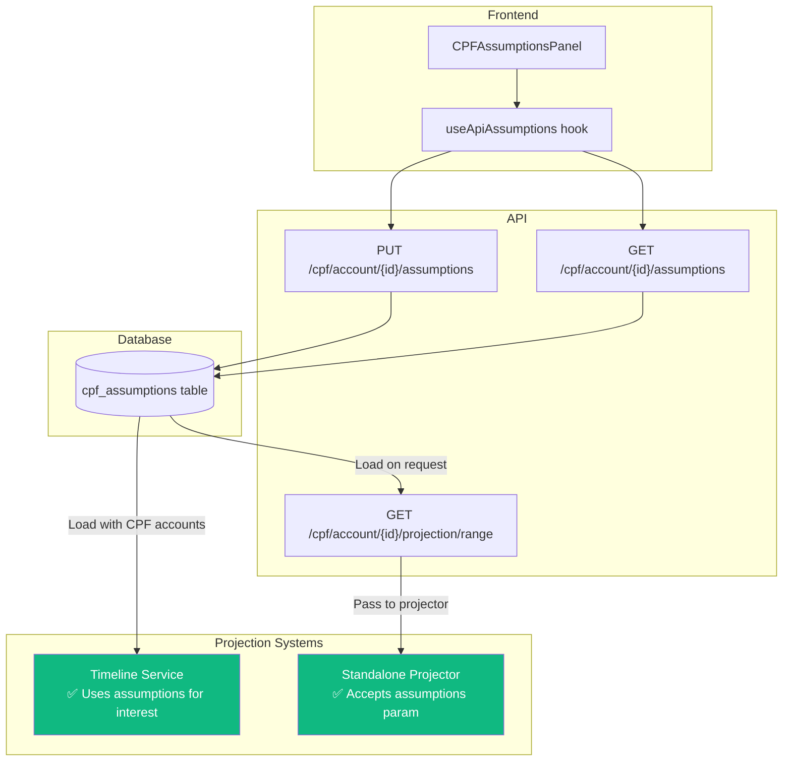

### Implementation Checklist

- [ ] Modify `ProjectToDate()` to accept `*CPFAssumptions` parameter
- [ ] Load assumptions in projection endpoint handler
- [ ] Pass assumptions to interest calculation
- [ ] Update Timeline to load assumptions with CPF accounts
- [ ] Apply user interest rates in monthly interest calculation

---

## Scenarios and CPF

Scenario events affect CPF **indirectly** through income changes. Direct CPF balance manipulation is not supported.

### Supported Scenario Impacts

| Scenario Type | Target | CPF Effect |
|---------------|--------|------------|
| **OVERRIDE** | Income | Higher/lower CPF contributions based on new income amount |
| **DELTA** | Income | Incremental CPF contribution change (e.g., +$500/month) |
| **STOP** | Income | CPF contributions stop when income stops |
| **START** | Income | New income source begins contributing to CPF |

### Example: Promotion Scenario

```json
{
  "name": "Promotion in 2027",
  "occursOn": "2027-01",
  "impacts": [{
    "impactKind": "override",
    "targetType": "income",
    "targetId": "salary-uuid",
    "amount": "10000.00"
  }]
}
```

**Effect on CPF:**
- Before: $8,000/month salary → ~$2,960/month total CPF (employee + employer)
- After: $10,000/month salary → ~$3,700/month total CPF
- Difference accumulates in OA/SA/MA based on age allocation rates

### Example: Early Retirement Scenario

```json
{
  "name": "Early Retirement at 55",
  "occursOn": "2035-06",
  "impacts": [{
    "impactKind": "stop",
    "targetType": "income",
    "targetId": "salary-uuid"
  }]
}
```

**Effect on CPF:**
- Contributions stop in June 2035
- Balances grow only from interest thereafter
- Age 55 RA conversion still occurs

### NOT Supported

Direct scenario impacts on CPF accounts are **not supported**:

```json
// ❌ This will NOT work
{
  "impacts": [{
    "impactKind": "delta",
    "targetType": "cpf_account",  // Not a valid target
    "targetId": "cpf-oa",
    "amount": "50000.00"
  }]
}
```

**Reason:** CPF balances are derived from contributions, not directly manipulated. Use fund flow rules for voluntary top-ups.

---

## Data Loading Strategy

### Standalone Projection Endpoints

When implementing standalone CPF projection endpoints, there are two approaches for loading data:

### Option A: Reuse Timeline Data Loading (Recommended)

```go
// Use timeline service's data loading for consistency
func (h *CPFHandler) GetProjectionRange(c *gin.Context) {
    // Load financial data using shared loading logic
    rows, err := h.timelineService.LoadEffectiveRows(ctx, userID, LoadOptions{
        IncludeIncomes: true,
        IncludeCPF:     true,
        IncludePersons: true,
    })

    // Filter to CPF-eligible incomes
    cpfIncomes := filterCPFEligible(rows.Incomes)

    // Build projector inputs
    snapshot := buildAccountSnapshot(rows.CPFAccounts, personID)
    streams := buildIncomeStreams(cpfIncomes)

    // Load user assumptions
    assumptions, _ := h.assumptionsRepo.GetOrCreateDefault(ctx, cpfAccountID)

    // Project
    result := h.projector.ProjectRange(snapshot, streams, assumptions, years)

    c.JSON(200, result)
}
```

**Benefits:**
- Respects person exclusion settings
- Consistent income filtering logic
- Handles versioned records (start_date/end_date)

### Option B: Direct Repository Access

```go
func (h *CPFHandler) GetProjectionRange(c *gin.Context) {
    // Load directly from repositories
    cpfAccount, _ := h.cpfRepo.GetByID(ctx, accountID)
    person, _ := h.personRepo.GetByID(ctx, cpfAccount.PersonID)
    incomes, _ := h.incomeRepo.ListByPersonID(ctx, person.ID)
    assumptions, _ := h.assumptionsRepo.GetOrCreateDefault(ctx, accountID)

    // Build and project...
}
```

**Trade-offs:**
- Simpler code path
- Doesn't automatically respect exclusion/filtering
- May diverge from Timeline behavior

### Recommendation

Use **Option A** for consistency. The standalone projection should produce results that align with Timeline when the same data and assumptions are used.

---

## Requirements

| Requirement | Decision |
|-------------|----------|
| Mock Data | Replace ALL with real backend data |
| CPF Constants | Hardcoded with versioning (by year in `backend/internal/cpf/config/`) |
| Assumptions | User-specific, persisted per CPF account |
| Projections | Date range queries (frontend requests specific ranges) |
| API Version | V2 endpoints |

---

## Current State Analysis

### Backend (Already Exists)
| Component | Location | Status |
|-----------|----------|--------|
| Contribution Calculator | `backend/internal/cpf/contribution/calculator.go` | Complete |
| Basic Projector | `backend/internal/cpf/projector/projector.go` | Complete |
| CPF Config (2024, 2025) | `backend/internal/cpf/config/` | Complete |
| CPF Account CRUD | `backend/internal/financial_v2/repository/cpf_account.go` | Complete |
| Housing Refund Calculator | `backend/internal/financial_v2/property/cpf_refund.go` | Complete |

### Backend (Needs Implementation)
| Component | Description |
|-----------|-------------|
| Age 55 RA Conversion | SA→RA, OA→RA, MA overflow, withdrawals |
| CPF LIFE Payout Calculator | Standard, Basic, Escalating plans |
| RSS Calculator | For accounts below MRS |
| Extended Projector | 30-year range with assumptions |
| Assumptions Repository | Per-account storage |

### Frontend (Calculations to Remove)
| File | Calculation |
|------|-------------|
| `components/cpf/CPFJourneyCalculator.tsx` | CPF rates, contribution splits, payout factors |
| `components/cpf/Age55ConversionSimulator/hooks/useRAConversion.ts` | Full RA conversion logic |
| `components/cpf/CPFProjectionChart.tsx` | 30-year projection generation |
| `lib/cpf-mock-data.ts` | All mock data functions |

---

## Database Schema

### New Table: `cpf_assumptions`

```sql
CREATE TABLE cpf_assumptions (
    id uuid DEFAULT gen_random_uuid() NOT NULL PRIMARY KEY,
    cpf_account_id uuid NOT NULL REFERENCES cpf_accounts(id) ON DELETE CASCADE,

    -- Interest rate assumptions (stored as decimals, e.g., 0.025 = 2.5%)
    interest_rate_oa numeric(6,4) DEFAULT 0.025 NOT NULL,
    interest_rate_sa numeric(6,4) DEFAULT 0.04 NOT NULL,
    interest_rate_ma numeric(6,4) DEFAULT 0.04 NOT NULL,
    interest_rate_ra numeric(6,4) DEFAULT 0.04 NOT NULL,
    extra_interest_first_60k numeric(6,4) DEFAULT 0.01 NOT NULL,
    extra_interest_first_30k_above_55 numeric(6,4) DEFAULT 0.01 NOT NULL,

    -- Growth rate assumptions
    -- NOTE: inflation_rate is NOT stored here - it's a global assumption
    -- that affects all expenses/income goals, not just CPF projections.
    -- Will be added to a future user_assumptions table.
    frs_growth_rate numeric(6,4) DEFAULT 0.035 NOT NULL,
    salary_growth_rate numeric(6,4) DEFAULT 0.03 NOT NULL,

    -- Employment assumptions
    assume_continuous_employment boolean DEFAULT true NOT NULL,
    retirement_age integer DEFAULT 65 NOT NULL,

    -- CPF LIFE assumptions
    cpf_life_plan character varying(20) DEFAULT 'standard' NOT NULL
        CHECK (cpf_life_plan IN ('standard', 'basic', 'escalating')),
    payout_start_age integer DEFAULT 65 NOT NULL
        CHECK (payout_start_age BETWEEN 65 AND 70),
    escalating_plan_growth numeric(6,4) DEFAULT 0.02 NOT NULL,

    -- Preset tracking
    preset_name character varying(20) DEFAULT 'official' NOT NULL
        CHECK (preset_name IN ('official', 'conservative', 'optimistic', 'custom')),

    -- Metadata
    created_at timestamp with time zone DEFAULT now() NOT NULL,
    updated_at timestamp with time zone DEFAULT now() NOT NULL,

    UNIQUE (cpf_account_id)
);

CREATE INDEX idx_cpf_assumptions_account ON cpf_assumptions(cpf_account_id);
```

**Migration Files:**
- `202601080001_cpf_assumptions.up.sql`
- `202601080001_cpf_assumptions.down.sql`

---

## API Endpoints

### CPF Projection Endpoints

#### GET `/api/v2/cpf/account/{id}/projection`
Get projected balances at a specific target date.

**Query Parameters:**
| Parameter | Type | Required | Description |
|-----------|------|----------|-------------|
| `targetDate` | string (YYYY-MM-DD) | Yes | Date to project balances to |

**Response:**
```json
{
  "oa": "150000.00",
  "sa": "85000.00",
  "ma": "68500.00",
  "ra": "0.00",
  "total": "303500.00",
  "asOfDate": "2035-01-01",
  "age": 44,
  "contributionsOA": "45000.00",
  "interestOA": "12500.00"
}
```

#### GET `/api/v2/cpf/account/{id}/projection/range`
Get 30-year projection data for charting.

**Query Parameters:**
| Parameter | Type | Required | Default | Description |
|-----------|------|----------|---------|-------------|
| `years` | integer | No | 30 | Number of years to project |

**Response:**
```json
{
  "projections": [
    {
      "year": 2025,
      "age": 34,
      "oa": "85000.00",
      "sa": "45000.00",
      "ma": "32000.00",
      "ra": "0.00",
      "total": "162000.00",
      "contributions": "28000.00",
      "interest": "5200.00"
    }
  ],
  "milestones": {
    "age55": {
      "year": 2046,
      "balances": { "oa": "250000.00", "sa": "180000.00", "ma": "68500.00" }
    },
    "age65": {
      "year": 2056,
      "balances": { "oa": "50000.00", "sa": "0.00", "ma": "75500.00", "ra": "520000.00" }
    }
  },
  "retirement": {
    "frsTarget": "285000.00",
    "brsTarget": "142500.00",
    "ersTarget": "570000.00",
    "cpfLifeEstimates": {
      "standard": "2600.00",
      "basic": "2260.00",
      "escalating": "2080.00"
    }
  }
}
```

---

### CPF Assumptions Endpoints

#### GET `/api/v2/cpf/account/{id}/assumptions`
Get user-specific CPF assumptions for an account.

**Response:**
```json
{
  "id": "uuid",
  "cpfAccountId": "uuid",
  "interestRates": {
    "oa": "0.025",
    "sa": "0.04",
    "ma": "0.04",
    "ra": "0.04",
    "extraFirst60k": "0.01",
    "extraFirst30kAbove55": "0.01"
  },
  "growthRates": {
    "frs": "0.035"
  },
  "employment": {
    "retirementAge": 65
  },
  "cpfLife": {
    "plan": "standard",
    "payoutStartAge": 65,
    "escalatingGrowth": "0.02"
  },
  "presetName": "official"
}
```

#### PUT `/api/v2/cpf/account/{id}/assumptions`
Update user-specific CPF assumptions.

**Request Body:** Same structure as GET response (without `id` and `cpfAccountId`)

---

### CPF Calculator Endpoints

#### POST `/api/v2/cpf/calculators/age55-conversion`
Calculate RA formation at age 55.

**Request:**
```json
{
  "oaBalance": "250000.00",
  "saBalance": "180000.00",
  "maBalance": "68500.00",
  "targetSum": "FRS",
  "hasPropertyPledge": false,
  "cashBalance": "50000.00",
  "configYear": 2025
}
```

**Response:**
```json
{
  "transfers": {
    "saToRa": "180000.00",
    "oaToRa": "33000.00",
    "maOverflow": "0.00",
    "cashTopUp": "0.00"
  },
  "result": {
    "raTotal": "213000.00",
    "oaRemaining": "217000.00",
    "saRemaining": "0.00",
    "maRemaining": "68500.00",
    "withdrawable": "217000.00",
    "shortfall": "0.00"
  },
  "eligibility": {
    "qualifiesForCPFLife": true,
    "meetsMinimumRA": true,
    "meetsTargetSum": true
  },
  "projectedAt65": {
    "raBalance": "340000.00",
    "cpfLifeEstimates": {
      "standard": "2600.00",
      "basic": "2260.00",
      "escalating": "2080.00"
    }
  }
}
```

**Target Sum Values:**
- `BRS` - Basic Retirement Sum ($106,500 for 2025)
- `FRS` - Full Retirement Sum ($213,000 for 2025)
- `ERS` - Enhanced Retirement Sum ($426,000 for 2025)

#### POST `/api/v2/cpf/calculators/cpflife-estimate`
Estimate CPF LIFE monthly payouts.

**Request:**
```json
{
  "raBalance": "213000.00",
  "payoutStartAge": 65,
  "configYear": 2025
}
```

**Response:**
```json
{
  "estimates": {
    "standard": {
      "monthlyPayout": "1380.00",
      "yearlyPayout": "16560.00",
      "description": "Higher payouts, lower bequest"
    },
    "basic": {
      "monthlyPayout": "1200.00",
      "yearlyPayout": "14400.00",
      "description": "Lower payouts, higher bequest"
    },
    "escalating": {
      "monthlyPayout": "1100.00",
      "yearlyPayout": "13200.00",
      "annualIncrease": "0.02",
      "description": "2% annual increase"
    }
  },
  "rss": null,
  "qualifiesForCPFLife": true
}
```

#### POST `/api/v2/cpf/calculators/property-refund`
Calculate CPF refund due at property sale.

**Request:**
```json
{
  "principalUsed": "150000.00",
  "holdingPeriodMonths": 120,
  "interestRate": "0.025"
}
```

**Response:**
```json
{
  "principal": "150000.00",
  "accruedInterest": "42038.00",
  "totalRefund": "192038.00",
  "effectiveRate": "0.025",
  "holdingYears": 10
}
```

---

## Backend Implementation

### New Files to Create

```
backend/internal/cpf/
├── retirement/
│   ├── conversion.go       # Age 55 RA conversion calculator
│   ├── conversion_test.go
│   ├── cpflife.go          # CPF LIFE payout calculator
│   ├── cpflife_test.go
│   ├── rss.go              # RSS payout calculator (below MRS)
│   ├── rss_test.go
│   └── types.go            # Shared types for retirement package
└── projector/
    ├── extended.go         # Extended projector with range support
    └── extended_test.go

backend/internal/financial_v2/
├── cpf/
│   ├── assumptions.go      # Assumptions service layer
│   └── projection.go       # Projection service layer
└── repository/
    └── cpf_assumptions.go  # Database CRUD for assumptions

backend/cmd/server/handlers/
└── cpf_v2.go               # Add new handler methods
```

### Key Types

```go
// retirement/types.go
type TargetSumType string

const (
    TargetSumBRS TargetSumType = "BRS"
    TargetSumFRS TargetSumType = "FRS"
    TargetSumERS TargetSumType = "ERS"
)

type ConversionInput struct {
    OABalance         decimal.Decimal
    SABalance         decimal.Decimal
    MABalance         decimal.Decimal
    TargetSum         TargetSumType
    HasPropertyPledge bool
    CashBalance       decimal.Decimal
    ConfigYear        int
}

type ConversionResult struct {
    Transfers    TransferBreakdown
    Result       ResultBalances
    Eligibility  EligibilityStatus
    ProjectedAt65 ProjectedRetirement
}

// projector/extended.go
type ProjectionYear struct {
    Year          int
    Age           int
    OA            decimal.Decimal
    SA            decimal.Decimal
    MA            decimal.Decimal
    RA            decimal.Decimal
    Total         decimal.Decimal
    Contributions decimal.Decimal
    Interest      decimal.Decimal
}

type ProjectionRangeResult struct {
    Projections []ProjectionYear
    Milestones  Milestones
    Retirement  RetirementSummary
}
```

---

## Frontend Integration

### New API Functions

**File:** `frontend/src/api/financial/cpf.ts`

```typescript
// Projection endpoints
export async function getCPFProjection(
  id: string,
  targetDate: string
): Promise<CPFProjectedBalances>

export async function getCPFProjectionRange(
  id: string,
  years?: number
): Promise<CPFProjectionRangeResponse>

// Assumptions CRUD
export async function getCPFAssumptions(
  id: string
): Promise<CPFAssumptions>

export async function updateCPFAssumptions(
  id: string,
  assumptions: CPFAssumptionsInput
): Promise<CPFAssumptions>

// Calculator endpoints
export async function calculateAge55Conversion(
  input: Age55ConversionInput
): Promise<Age55ConversionResult>

export async function calculateCPFLifeEstimate(
  input: CPFLifeEstimateInput
): Promise<CPFLifeEstimateResult>

export async function calculatePropertyRefund(
  input: PropertyRefundInput
): Promise<PropertyRefundResult>
```

### New React Query Hooks

**File:** `frontend/src/hooks/queries/useCpfQuery.ts`

```typescript
// Projection queries
export function useCpfProjectionQuery(
  cpfAccountId: string,
  targetDate: string
)

export function useCpfProjectionRangeQuery(
  cpfAccountId: string,
  years?: number
)

// Assumptions queries
export function useCpfAssumptionsQuery(cpfAccountId: string)
export function useUpdateCpfAssumptionsMutation()

// Calculator mutations (stateless POST endpoints)
export function useAge55ConversionMutation()
export function useCpfLifeEstimateMutation()
export function usePropertyRefundMutation()
```

### Component Updates

| Component | Current Implementation | New Implementation |
|-----------|----------------------|-------------------|
| `CPFProjectionChart.tsx` | `generateMockProjection()` from `cpf-mock-data.ts` | `useCpfProjectionRangeQuery()` |
| `Age55ConversionSimulator/hooks/useRAConversion.ts` | Local `calculateRAConversion()` | `useAge55ConversionMutation()` |
| `CPFAssumptionsPanel/` | Local React state | `useCpfAssumptionsQuery()` + mutation |
| `PropertyCPFUsage.tsx` | Mock `PropertySaleAnalysis` | `usePropertyRefundMutation()` |
| `CPFLifeEstimator.tsx` | Frontend payout calculation | `useCpfLifeEstimateMutation()` |

### Files to Deprecate/Remove

- `frontend/src/lib/cpf-mock-data.ts` - Remove all mock calculation functions
- `frontend/src/lib/cpf-constants.ts` - Replace with API calls or keep for UI display only

---

## Implementation Phases

### Phase 1: Foundation (Sprint 1) ✅ COMPLETE
**Goal:** Set up database and assumptions infrastructure

1. ✅ Create database migration for `cpf_assumptions` table
2. ✅ Implement `cpf_assumptions` repository with CRUD operations
3. ✅ Create assumptions service layer
4. ✅ Add GET/PUT/DELETE assumptions endpoints
5. ✅ Create frontend hooks for assumptions (`useCpfAssumptionsQuery`, mutations)
6. ✅ Update `CPFAssumptionsPanel` to use API via `useApiAssumptions` hook

**Deliverables:**
- ✅ Working assumptions persistence (UNIQUE per CPF account)
- ✅ Frontend can save/load user assumptions with debounced updates
- ✅ Default assumptions auto-created on first access

**Key Files:**
- `backend/internal/cpf/assumptions/repository.go`
- `backend/internal/cpf/assumptions/constants.go`
- `backend/migrations/202601090001_cpf_assumptions.up.sql`
- `frontend/src/hooks/queries/useCpfQuery.ts`
- `frontend/src/components/cpf/CPFAssumptionsPanel/useApiAssumptions.ts`

### Phase 2: Projections (Sprint 2)
**Goal:** Backend-driven 30-year projections with assumptions integration

#### 2A: Wire Assumptions into Projector
1. Modify `ProjectToDate()` to accept `*CPFAssumptions` parameter
2. Update `calculateInterest()` to use assumption rates instead of hardcoded values
3. Implement extra interest calculation using assumption values
4. Add unit tests for assumption-driven interest calculation

#### 2B: Add Projection Endpoints
5. Add `GET /api/v2/cpf/account/{id}/projection` (single target date)
6. Add `GET /api/v2/cpf/account/{id}/projection/range` (30-year with milestones)
7. Load assumptions in handler and pass to projector
8. Use timeline data loading for consistent income filtering (see "Data Loading Strategy")

#### 2C: Timeline Interest Integration (Optional)
9. Evaluate: Should Timeline calculate CPF interest?
   - **Option A:** Timeline only tracks contributions; interest shown in standalone projections
   - **Option B:** Add interest calculation to Timeline CPF processing
10. Document decision and update this spec accordingly

#### 2D: Frontend Integration
11. Create `useCpfProjectionRangeQuery()` hook
12. Update `CPFProjectionChart` to use real data
13. Add loading/error states
14. Invalidate projection cache when assumptions change

**Deliverables:**
- Real projection data in charts
- User assumptions affect projections (interest rates, retirement age)
- Clear documentation of Timeline vs Standalone projection relationship

### Phase 3: Age 55 Conversion (Sprint 3)
**Goal:** Retirement planning calculations

9. Implement RA conversion calculator
10. Implement CPF LIFE payout calculator
11. Implement RSS calculator
12. Add conversion and CPF LIFE endpoints
13. Create frontend mutation hooks
14. Update `Age55ConversionSimulator` to use API

**Deliverables:**
- Accurate Age 55 conversion calculations
- CPF LIFE payout estimates

### Phase 4: Property Integration (Sprint 4)
**Goal:** Property CPF refund integration

15. Expose existing property refund calculator via endpoint
16. Create frontend property refund hook
17. Update `PropertyCPFUsage` component

**Deliverables:**
- Property CPF refund calculations via API

### Phase 5: Cleanup & Polish (Sprint 5)
**Goal:** Remove mock data, add tests, polish UX

18. Remove mock data functions from `cpf-mock-data.ts`
19. Update all components to handle loading/error states
20. Add comprehensive unit tests for calculators
21. Add integration tests for endpoints
22. Performance optimization (caching, memoization)

**Deliverables:**
- No mock data remaining
- Full test coverage
- Production-ready module

---

## Future Considerations

### Global Assumptions Table (Out of Scope)

The following assumptions affect the entire financial system, not just CPF:

| Assumption | Default | Used By |
|------------|---------|---------|
| `inflation_rate` | 2.0% | Expense projections, income goals, purchasing power |
| `salary_growth_rate` | 3.0% | Income projections, CPF contribution growth |
| `assume_continuous_employment` | true | Life planning, income/expense continuity |
| `default_investment_return` | 5.0% | Investment projections |

These should be stored in a future `user_assumptions` table at the user level:

```sql
CREATE TABLE user_assumptions (
    id uuid DEFAULT gen_random_uuid() NOT NULL PRIMARY KEY,
    user_id uuid NOT NULL REFERENCES users(id) ON DELETE CASCADE,
    inflation_rate numeric(6,4) DEFAULT 0.02 NOT NULL,
    salary_growth_rate numeric(6,4) DEFAULT 0.03 NOT NULL,
    assume_continuous_employment boolean DEFAULT true NOT NULL,
    default_investment_return numeric(6,4) DEFAULT 0.05 NOT NULL,
    -- Add more global assumptions as needed
    UNIQUE (user_id)
);
```

Until implemented, the frontend will use hardcoded defaults.

---

## Testing Strategy

### Backend Unit Tests
- All calculators should have >90% coverage
- Test edge cases: zero balances, max balances, boundary ages
- Test with different config years (2024, 2025)

### Backend Integration Tests
- Test all endpoints with realistic payloads
- Verify assumptions are correctly persisted
- Test projection accuracy over 30 years

### Frontend Tests
- Component tests for updated components
- Hook tests for React Query mutations
- E2E tests for critical flows (Age 55 conversion, projections)

---

## CPF Policy Constants Reference

### 2025 Values (from `backend/internal/cpf/config/`)

| Constant | Value | Description |
|----------|-------|-------------|
| OW Ceiling | $7,400/month | Ordinary Wage ceiling |
| Annual Ceiling | $102,000 | Total annual wage ceiling |
| BRS | $106,500 | Basic Retirement Sum |
| FRS | $213,000 | Full Retirement Sum |
| ERS | $426,000 | Enhanced Retirement Sum |
| BHS | $71,500 | Basic Healthcare Sum |
| MRS | $60,000 | Minimum for CPF LIFE eligibility |
| OA Interest | 2.5% | Ordinary Account base rate |
| SA/MA/RA Interest | 4.0% | Special/Medisave/Retirement Account rate |
| Extra Interest | +1% | On first $60k (below 55) |
| Extra Interest 55+ | +2% | On first $30k (age 55+) |

### CPF LIFE Payout Factors (per $1,000 RA)

| Plan | Age 65 | Age 66 | Age 67 | Age 68 | Age 69 | Age 70 |
|------|--------|--------|--------|--------|--------|--------|
| Standard | $5.50 | $5.90 | $6.30 | $6.80 | $7.30 | $7.90 |
| Basic | $5.00 | $5.40 | $5.80 | $6.20 | $6.70 | $7.20 |
| Escalating | $4.40 | $4.70 | $5.00 | $5.40 | $5.80 | $6.30 |

---

## Acceptance Criteria

### Must Have
- [ ] All CPF calculations performed on backend
- [ ] User assumptions persisted per CPF account
- [ ] 30-year projection chart uses real data
- [ ] Age 55 conversion simulator uses API
- [ ] CPF LIFE estimates from backend
- [ ] No mock data functions in production code

### Should Have
- [ ] Loading states during API calls
- [ ] Error handling with user-friendly messages
- [ ] Caching for projection data (5-minute stale time)
- [ ] Optimistic updates for assumptions

### Nice to Have
- [ ] Offline support with cached projections
- [ ] Comparison view between assumption presets
- [ ] Export projection data to CSV

---

## Dependencies

### External
- CPF Board policy updates (annual FRS/BRS changes)
- Singapore tax rate changes

### Internal
- Existing CPF contribution calculator
- Existing CPF projector
- Property scenarios for OA used data
- Person table for date of birth and residency

---

## Risks & Mitigations

| Risk | Impact | Mitigation |
|------|--------|------------|
| CPF policy changes mid-year | Incorrect calculations | Version constants by date, not just year |
| Performance with 30-year projections | Slow API response | Add caching, consider background computation |
| Complex age-based rules | Calculation errors | Comprehensive test coverage with real scenarios |
| Migration data integrity | Lost assumptions | Add migration rollback, backup existing data |
