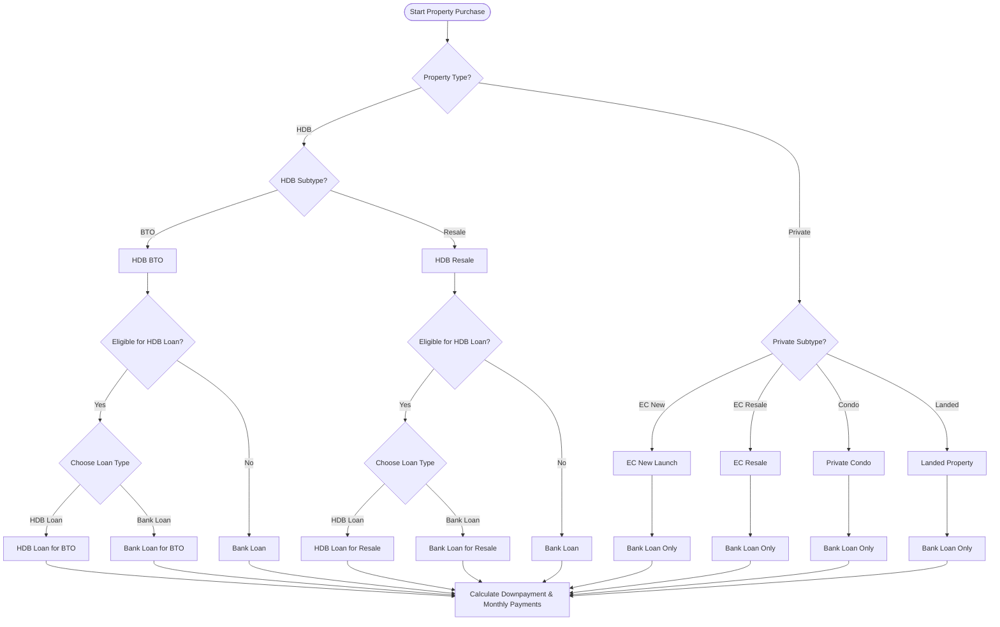
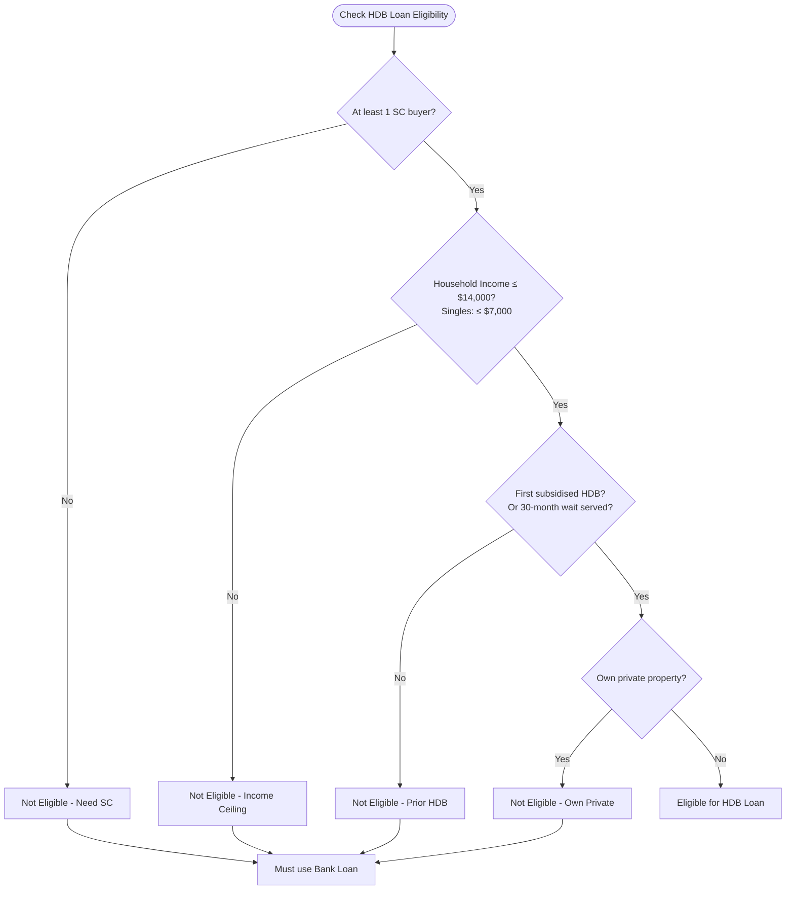
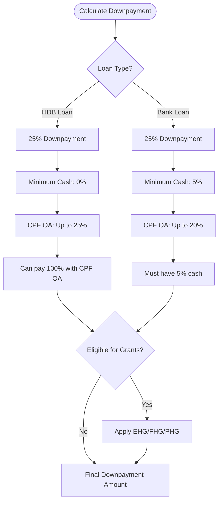
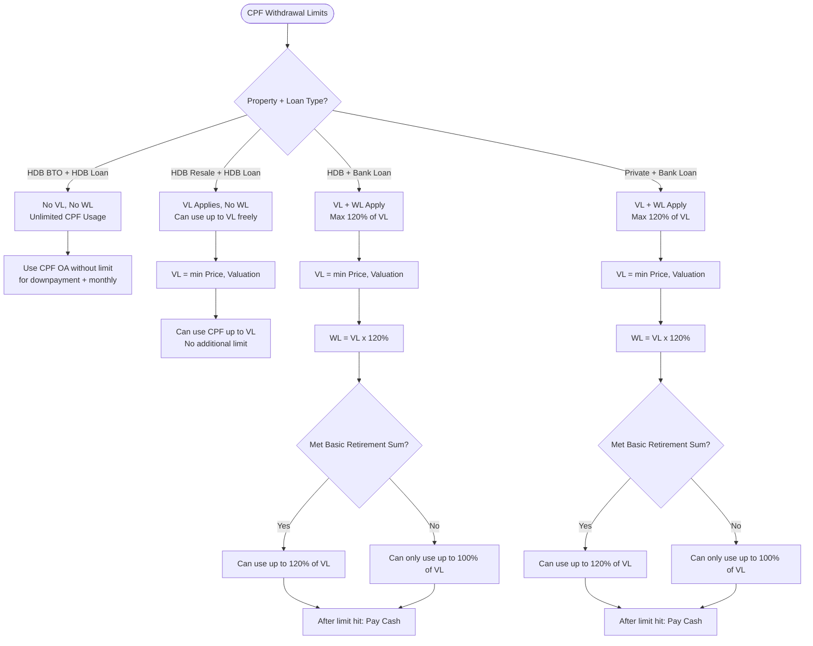
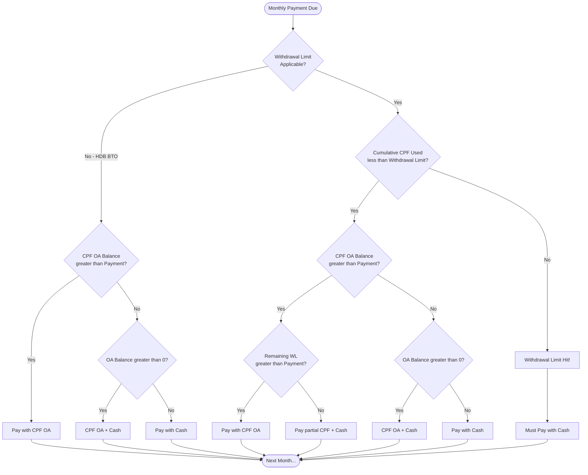
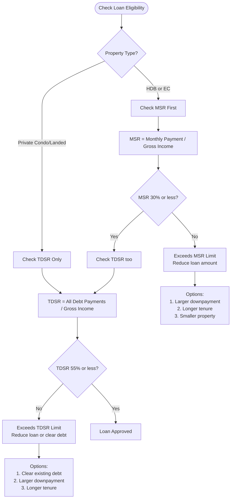
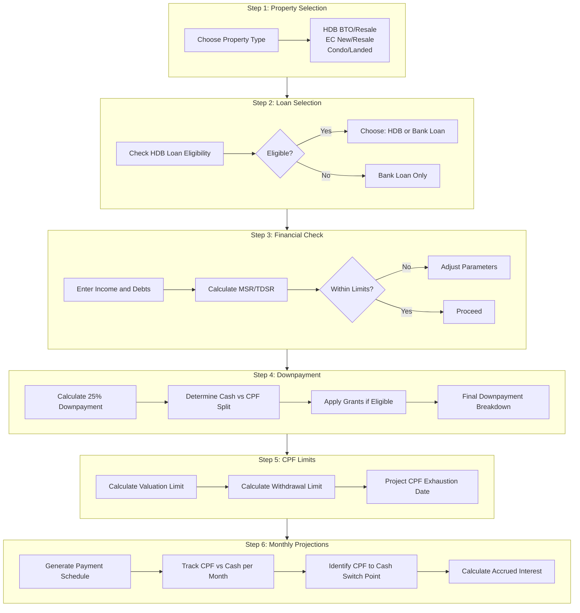

# Singapore Property Purchase Flow - Decision Trees & Rules

## 1. Property Purchase Decision Flow



---

## 2. HDB Loan Eligibility Check



---

## 3. Downpayment Rules by Scenario



---

## 4. CPF Withdrawal Limits Flow



---

## 5. Monthly Payment Source Logic



---

## 6. Loan Servicing Ratio Checks



---

## 7. Complete Purchase Flow Summary



---

## Quick Reference Tables

### Downpayment Rules

| Property | Loan Type | Total | Min Cash | Max CPF |
|----------|-----------|-------|----------|---------|
| HDB | HDB Loan | 25% | **0%** | 25% |
| HDB | Bank Loan | 25% | **5%** | 20% |
| EC | Bank Loan | 25% | **5%** | 20% |
| Condo | Bank Loan | 25% | **5%** | 20% |
| Landed | Bank Loan | 25% | **5%** | 20% |

### CPF Withdrawal Limits

| Scenario | Valuation Limit (VL) | Withdrawal Limit (WL) |
|----------|----------------------|-----------------------|
| HDB BTO + HDB Loan | None | None |
| HDB Resale + HDB Loan | Applies | None |
| HDB + Bank Loan | Applies | 120% of VL |
| Private + Bank Loan | Applies | 120% of VL |

### Loan Servicing Limits

| Property Type | MSR Limit | TDSR Limit |
|---------------|-----------|------------|
| HDB | 30% | 55% |
| EC | 30% | 55% |
| Private | N/A | 55% |

### Interest Rates (Typical 2025)

| Loan Type | Rate | Notes |
|-----------|------|-------|
| HDB Loan | 2.6% | CPF OA rate + 0.1% |
| Bank Loan | 3.5-4.5% | Variable, depends on market |

---

## Key Milestones in Property Purchase Timeline

1. **Option to Purchase (OTP)** - Pay option fee (usually $1,000-$5,000)
2. **Exercise OTP** - Pay remaining downpayment (within 21 days for resale)
3. **Completion** - Pay stamp duties, legal fees, remaining cash
4. **Loan Disbursement** - Monthly payments begin
5. **CPF Withdrawal Limit Hit** - Switch to cash payments (if applicable)
6. **Loan Fully Paid** - Property fully owned

---

## Formulas

### Valuation Limit (VL)
```
VL = min(Purchase Price, Market Valuation)
```

### Withdrawal Limit (WL)
```
WL = VL × 120%  (only if met Basic Retirement Sum)
WL = VL × 100%  (if not met BRS)
```

### Monthly Payment (Amortization)
```
M = P × [r(1+r)^n] / [(1+r)^n - 1]

Where:
  M = Monthly payment
  P = Principal (loan amount)
  r = Monthly interest rate (annual rate / 12)
  n = Total number of payments (years × 12)
```

### MSR (Mortgage Servicing Ratio)
```
MSR = Monthly Mortgage Payment / Gross Monthly Income
Limit: ≤ 30% for HDB and EC
```

### TDSR (Total Debt Servicing Ratio)
```
TDSR = (All Monthly Debt Payments) / Gross Monthly Income
Limit: ≤ 55% for all properties
```

### CPF Accrued Interest
```
Accrued Interest = Principal × [(1 + 0.025)^years - 1]

Note: 2.5% p.a. compounded yearly
Must be refunded to CPF OA when property is sold
```

---

## Historical Changes Timeline

These rules have changed multiple times. Here's the complete history:

### LTV (Loan-to-Value) Ratio Changes

| Date | Change | Notes |
|------|--------|-------|
| **Feb 2010** | 90% → 80% | First cooling measure |
| **Aug 2010** | 80% → 70% | For buyers with existing loans |
| **Jan 2011** | → 60% | For buyers with existing loans |
| **Oct 2012** | → 60%/40% | For loans >30 years |
| **Jan 2013** | → 50%/40% | 2nd loan: 50%, 3rd loan: 40% |
| **Jul 2018** | Bank: 80% → 75% | First change since 2013 |
| **Dec 2021** | HDB: 90% → 85% | HDB loan tightening |
| **Sep 2022** | HDB: 85% → 80% | Further tightening |
| **Aug 2024** | HDB: 80% → 75% | Now same as bank loans |

**Current (2024-2025):** Both HDB and bank loans at **75% LTV**

---

### TDSR (Total Debt Servicing Ratio) Changes

| Date | Change | Notes |
|------|--------|-------|
| **Jun 2013** | Introduced at 60% | First TDSR framework |
| **Dec 2021** | 60% → 55% | Tightened |
| **Sep 2022** | Interest floor raised | 4% for residential, 5% for non-residential |

**Current:** **55% TDSR limit**

---

### MSR (Mortgage Servicing Ratio) Changes

| Date | Change | Notes |
|------|--------|-------|
| **Pre-2013** | 40% | Original rate |
| **Jan 2013** | 40% → 35% | First reduction |
| **Jan 2013** | Bank HDB loans: 30% | For bank loans on HDB |
| **Aug 2013** | HDB loans: 30% | Aligned with bank loans |
| **Sep 2022** | Interest floor: 3% | For HDB/EC loans |

**Current:** **30% MSR limit** (HDB and EC only)

---

### ABSD (Additional Buyer's Stamp Duty) Changes

| Date | SC 1st | SC 2nd | SC 3rd+ | PR 1st | PR 2nd | Foreigner |
|------|--------|--------|---------|--------|--------|-----------|
| **Dec 2011** | 0% | 0% | 0% | 0% | 3% | 10% |
| **Jan 2013** | 0% | 7% | 10% | 5% | 10% | 15% |
| **Jul 2018** | 0% | 12% | 15% | 5% | 15% | 20% |
| **Dec 2021** | 0% | 17% | 25% | 5% | 25% | 30% |
| **Apr 2023** | 0% | 20% | 30% | 5% | 30% | **60%** |

**Current (2024-2025):**
- SC: 0% / 20% / 30%
- PR: 5% / 30% / 30%
- Foreigner: **60%**
- Entities: **65%**

---

### HDB Income Ceiling Changes

| Date | Family | Singles | EC |
|------|--------|---------|-----|
| **Pre-2015** | $10,000 | - | $12,000 |
| **2015** | $12,000 | - | $14,000 |
| **2019** | $14,000 | $7,000 | $16,000 |

**Current:** $14,000 (family), $7,000 (singles), $16,000 (EC)

---

### CPF Housing Withdrawal Limit Changes

| Date | Change | Notes |
|------|--------|-------|
| **Pre-May 2019** | Based on 60-year lease | Could use CPF if lease ≥60 years |
| **May 2019** | Based on age 95 coverage | Lease must cover youngest buyer to age 95 |
| **May 2019** | Minimum 20-year lease | No CPF if lease ≤20 years |

**Current:**
- Lease must cover youngest buyer until age 95
- Minimum 20-year remaining lease required
- WL = 120% of VL (if met BRS)

---

### Basic Retirement Sum (BRS) Changes

| Year | BRS Amount |
|------|------------|
| 2020 | $90,500 |
| 2021 | $93,000 |
| 2022 | $96,000 |
| 2023 | $99,400 |
| 2024 | $102,900 |
| 2025 | ~$106,500 (estimated) |

**Note:** BRS increases ~3-4% annually. Required to access 120% withdrawal limit.

---

## Change Frequency Summary

| Rule | Last Changed | Frequency |
|------|--------------|-----------|
| LTV (HDB) | Aug 2024 | Every 1-3 years |
| LTV (Bank) | Jul 2018 | Stable for 6+ years |
| TDSR | Dec 2021 | Every 8 years |
| MSR | Aug 2013 | Stable for 11+ years |
| ABSD | Apr 2023 | Every 2-3 years |
| Income Ceiling | 2019 | Every 4 years |
| CPF WL Rules | May 2019 | Stable for 5+ years |
| BRS | Annual | Yearly adjustment |

**Key Insight:** Most rules are relatively stable (changes every 3-8 years), except:
- **ABSD** - Most frequently changed (cooling measure tool)
- **BRS** - Changes annually (inflation adjustment)
- **LTV** - Changed during market overheating

---

## Sources

- [CPF Housing Withdrawal Limits - 99.co](https://www.99.co/singapore/insider/cpf-housing-withdrawal-limits/)
- [CPF Withdrawal Limits from May 2019 - Home123](https://www.home123.sg/use-of-cpf-for-housing)
- [HDB Income Guidelines](https://www.hdb.gov.sg/residential/buying-a-flat/understanding-your-eligibility-and-housing-loan-options/application-for-an-hdb-flat-eligibility-hfe-letter/income-guidelines)
- [Income Ceiling History - Home & Decor](https://www.homeanddecor.com.sg/property/hdb/income-ceiling-bto-ec)
- [MSR and TDSR Rules - MAS](https://www.mas.gov.sg/regulation/explainers/new-housing-loans/msr-and-tdsr-rules)
- [TDSR MSR Singapore - LoanSaver](https://loansaver.com.sg/tdsr-msr-singapore/)
- [LTV Ratio Guide - PropertyGuru](https://www.propertyguru.com.sg/property-guides/singapore-loan-to-value-ratio-guide-12845)
- [Cooling Measures History - SRX](https://www.srx.com.sg/cooling-measures)
- [ABSD Rates - PropertyGuru](https://www.propertyguru.com.sg/property-guides/additional-buyers-stamp-duty-guide-13034)
- [ABSD - IRAS](https://www.iras.gov.sg/taxes/stamp-duty/for-property/buying-or-acquiring-property/additional-buyer's-stamp-duty-(absd))

---

## Versioning Strategy for Implementation

Based on existing codebase patterns (CPF config, financial items versioning), here's how to handle rules that change over time:

### Rule Categories by Volatility

| Category | Rules | Strategy |
|----------|-------|----------|
| **Stable** (rarely change) | MSR 30%, TDSR 55%, CPF WL 120% | Hardcode as constants |
| **Periodic** (yearly) | BRS amounts | In-code config with year functions |
| **Moderate** (every 2-4 years) | LTV limits, Income ceilings | Database with effective dates |
| **Volatile** (policy tool) | ABSD rates | Database with effective dates + admin UI |

### Recommended Architecture

```
┌─────────────────────────────────────────────────────────────────┐
│                    Property Rules Config                         │
├─────────────────────────────────────────────────────────────────┤
│                                                                  │
│  ┌──────────────────┐    ┌──────────────────┐                   │
│  │  STABLE RULES    │    │  VERSIONED RULES │                   │
│  │  (constants.go)  │    │  (DB + seed.go)  │                   │
│  ├──────────────────┤    ├──────────────────┤                   │
│  │ MSR_LIMIT = 0.30 │    │ property_rules   │                   │
│  │ TDSR_LIMIT = 0.55│    │ ┌──────────────┐ │                   │
│  │ WL_MULTIPLIER=1.2│    │ │effective_from│ │                   │
│  │ MIN_CASH_BANK=5% │    │ │effective_to  │ │                   │
│  │ MIN_CASH_HDB=0%  │    │ │absd_rates    │ │                   │
│  └──────────────────┘    │ │ltv_limits    │ │                   │
│                          │ │brs_amount    │ │                   │
│                          │ │income_ceiling│ │                   │
│                          │ └──────────────┘ │                   │
│                          └──────────────────┘                   │
│                                                                  │
│  Query: GetActiveRules(propertyType, asOfDate)                  │
└─────────────────────────────────────────────────────────────────┘
```

### Database Schema for Versioned Rules

```sql
-- Property purchase rules with date-effective versioning
CREATE TABLE property_purchase_rules (
    id UUID PRIMARY KEY DEFAULT gen_random_uuid(),

    -- Versioning (matches existing pattern)
    parent_id UUID NOT NULL,
    effective_from TIMESTAMPTZ NOT NULL,
    effective_until TIMESTAMPTZ,  -- NULL = current

    -- Rule set name for grouping
    rule_set VARCHAR(50) NOT NULL DEFAULT 'singapore_default',

    -- LTV Limits
    ltv_hdb_loan NUMERIC(5,4) NOT NULL,      -- 0.75
    ltv_bank_loan NUMERIC(5,4) NOT NULL,     -- 0.75

    -- Income Ceilings
    income_ceiling_family INTEGER NOT NULL,   -- 14000
    income_ceiling_single INTEGER NOT NULL,   -- 7000
    income_ceiling_ec INTEGER NOT NULL,       -- 16000

    -- BRS Amount
    brs_amount INTEGER NOT NULL,              -- 106500

    -- ABSD Rates (JSONB for flexibility)
    absd_rates JSONB NOT NULL,
    /* Example:
    {
      "sc": [0, 0.20, 0.30],      -- 1st, 2nd, 3rd+
      "pr": [0.05, 0.30, 0.30],
      "foreigner": [0.60, 0.60, 0.60],
      "entity": [0.65, 0.65, 0.65]
    }
    */

    -- BSD Brackets (JSONB for tiered structure)
    bsd_brackets JSONB NOT NULL,
    /* Example:
    [
      {"threshold": 180000, "rate": 0.01},
      {"threshold": 180000, "rate": 0.02},
      {"threshold": 640000, "rate": 0.03},
      {"threshold": 500000, "rate": 0.04},
      {"threshold": 1500000, "rate": 0.05},
      {"threshold": null, "rate": 0.06}
    ]
    */

    -- Interest Rate Floors (for MSR/TDSR calculation)
    interest_floor_residential NUMERIC(5,4) NOT NULL,  -- 0.04
    interest_floor_hdb NUMERIC(5,4) NOT NULL,          -- 0.03

    -- Metadata
    notes TEXT,
    created_at TIMESTAMPTZ DEFAULT NOW(),
    updated_at TIMESTAMPTZ DEFAULT NOW(),

    UNIQUE(parent_id, effective_from)
);

-- Prevent overlapping date ranges
CREATE EXTENSION IF NOT EXISTS btree_gist;
ALTER TABLE property_purchase_rules
ADD CONSTRAINT property_rules_no_overlap EXCLUDE USING gist (
    rule_set WITH =,
    tstzrange(effective_from, COALESCE(effective_until, 'infinity'), '[)') WITH &&
);

-- Index for efficient date queries
CREATE INDEX idx_property_rules_effective
    ON property_purchase_rules(rule_set, effective_from, effective_until);
```

### Go Config Types

```go
// backend/internal/property/config/types.go

package config

import (
    "time"
    "github.com/shopspring/decimal"
)

// PropertyRuleSet represents a versioned set of property purchase rules
type PropertyRuleSet struct {
    ID            string
    ParentID      string
    EffectiveFrom time.Time
    EffectiveUntil *time.Time
    RuleSetName   string

    // LTV Limits
    LTVHDBLoan   decimal.Decimal
    LTVBankLoan  decimal.Decimal

    // Income Ceilings
    IncomeCeilingFamily int
    IncomeCeilingSingle int
    IncomeCeilingEC     int

    // BRS
    BRSAmount int

    // ABSD Rates
    ABSDRates ABSDRateSchedule

    // BSD Brackets
    BSDBrackets []BSDBracket

    // Interest Floors
    InterestFloorResidential decimal.Decimal
    InterestFloorHDB         decimal.Decimal

    CreatedAt time.Time
    UpdatedAt time.Time
}

type ABSDRateSchedule struct {
    SC        []decimal.Decimal // [0%, 20%, 30%] for 1st, 2nd, 3rd+
    PR        []decimal.Decimal // [5%, 30%, 30%]
    Foreigner []decimal.Decimal // [60%, 60%, 60%]
    Entity    []decimal.Decimal // [65%, 65%, 65%]
}

type BSDBracket struct {
    Threshold *int64          // nil = remainder
    Rate      decimal.Decimal
}

// Stable constants (rarely change)
const (
    MSRLimit        = 0.30  // 30% - unchanged since 2013
    TDSRLimit       = 0.55  // 55% - unchanged since 2021
    WLMultiplier    = 1.20  // 120% of VL
    MinCashBankLoan = 0.05  // 5% cash for bank loans
    MinCashHDBLoan  = 0.00  // 0% cash for HDB loans
    MaxDownpayment  = 0.25  // 25% total downpayment
    CPFOAInterest   = 0.025 // 2.5% accrued interest rate
)
```

### Seed Data Pattern (like CPF config)

```go
// backend/internal/property/config/seed.go

package config

import "time"

// Rules2024 returns property rules effective from Jan 2024
func Rules2024() PropertyRuleSet {
    return PropertyRuleSet{
        EffectiveFrom: time.Date(2024, 1, 1, 0, 0, 0, 0, time.UTC),
        RuleSetName:   "singapore_default",

        LTVHDBLoan:  d("0.80"), // Changed to 0.75 in Aug 2024
        LTVBankLoan: d("0.75"),

        IncomeCeilingFamily: 14000,
        IncomeCeilingSingle: 7000,
        IncomeCeilingEC:     16000,

        BRSAmount: 102900,

        ABSDRates: ABSDRateSchedule{
            SC:        []decimal.Decimal{d("0"), d("0.20"), d("0.30")},
            PR:        []decimal.Decimal{d("0.05"), d("0.30"), d("0.30")},
            Foreigner: []decimal.Decimal{d("0.60"), d("0.60"), d("0.60")},
            Entity:    []decimal.Decimal{d("0.65"), d("0.65"), d("0.65")},
        },

        BSDBrackets: []BSDBracket{
            {Threshold: ptr(180000), Rate: d("0.01")},
            {Threshold: ptr(180000), Rate: d("0.02")},
            {Threshold: ptr(640000), Rate: d("0.03")},
            {Threshold: ptr(500000), Rate: d("0.04")},
            {Threshold: ptr(1500000), Rate: d("0.05")},
            {Threshold: nil, Rate: d("0.06")},
        },

        InterestFloorResidential: d("0.04"),
        InterestFloorHDB:         d("0.03"),
    }
}

// Rules2024Aug returns rules after Aug 2024 cooling measures
func Rules2024Aug() PropertyRuleSet {
    rules := Rules2024()
    rules.EffectiveFrom = time.Date(2024, 8, 20, 0, 0, 0, 0, time.UTC)
    rules.LTVHDBLoan = d("0.75") // Lowered from 80% to 75%
    return rules
}

// Rules2025 returns property rules for 2025
func Rules2025() PropertyRuleSet {
    rules := Rules2024Aug()
    rules.EffectiveFrom = time.Date(2025, 1, 1, 0, 0, 0, 0, time.UTC)
    rules.BRSAmount = 106500 // Estimated ~3.5% increase
    return rules
}
```

### Query Helper

```go
// backend/internal/property/config/repository.go

// GetActiveRules returns the property rules effective at the given date
func (r *Repository) GetActiveRules(ctx context.Context, ruleSet string, asOf time.Time) (*PropertyRuleSet, error) {
    query := `
        SELECT * FROM property_purchase_rules
        WHERE rule_set = $1
          AND effective_from <= $2
          AND (effective_until IS NULL OR effective_until > $2)
        ORDER BY effective_from DESC
        LIMIT 1
    `
    // ... implementation
}

// For calculations, use the purchase date to get correct rules:
// rules, _ := repo.GetActiveRules(ctx, "singapore_default", purchaseDate)
// absdRate := rules.ABSDRates.SC[propertyCount]
```

### Usage in Calculations

```go
// When calculating property purchase:
func CalculatePropertyPurchase(ctx context.Context, req PropertyPurchaseRequest) (*PropertyPurchaseResult, error) {
    // Get rules effective at purchase date
    rules, err := configRepo.GetActiveRules(ctx, "singapore_default", req.PurchaseDate)
    if err != nil {
        return nil, err
    }

    // Use versioned rules
    ltvLimit := rules.LTVBankLoan
    if req.LoanType == "hdb" {
        ltvLimit = rules.LTVHDBLoan
    }

    // ABSD based on citizenship and property count
    absdRate := rules.ABSDRates.GetRate(req.Citizenship, req.PropertyCount)

    // BSD using tiered brackets
    bsd := rules.CalculateBSD(req.PurchasePrice)

    // Use constants for stable rules
    if req.PropertyType == "hdb" {
        msrRatio := monthlyPayment / grossIncome
        if msrRatio > MSRLimit {
            return nil, errors.New("exceeds MSR limit of 30%")
        }
    }

    // ...
}
```

### Benefits of This Approach

1. **Stable rules as constants** - No need to version what doesn't change
2. **Yearly seed functions** - Easy to add new year's rules (like CPF pattern)
3. **Database for runtime** - Can query historical rules for any date
4. **JSONB for complex structures** - ABSD tiers, BSD brackets stored flexibly
5. **Exclusion constraint** - Prevents overlapping rule periods
6. **Backward compatible** - Old property scenarios use rules from their purchase date

---

## Implementation Gap Analysis

### What Exists vs What's Missing

| Requirement | Status | Location / Notes |
|-------------|--------|------------------|
| **Multiple incomes per user** | ✅ Exists | `finance_incomes` with versioning |
| **CPF contribution from income** | ✅ Exists | `cpf/contribution/calculator.go` |
| **CPF OA/SA/MA/RA balances** | ✅ Exists | `cpf_accounts` table with versioning |
| **User date of birth** | ✅ Exists | Stored in `cpf_accounts` |
| **Residency status** | ⚠️ Partial | citizen/pr_year_1/2/3_plus (no foreigner) |
| **Property scenario model** | ✅ Exists | `property_scenarios` table |
| **Property-to-asset linking** | ✅ Exists | `property_links` table |
| **Household / co-buyer** | ❌ Missing | No concept of combining two people |
| **Household income** | ❌ Missing | No way to sum two incomes |
| **Property count per user** | ❌ Missing | Can't determine 1st/2nd/3rd property |
| **Property ownership history** | ❌ Missing | No tracking of owned properties |
| **CPF future projection** | ⚠️ Partial | Calculator exists, no timeline integration |
| **CPF age 95 rule** | ❌ Missing | Not enforced for lease coverage |
| **Grants eligibility (EHG/FHG/PHG)** | ❌ Missing | No calculators |
| **ABSD calculation** | ❌ Missing | No stamp duty logic |
| **BSD calculation** | ❌ Missing | No buyer stamp duty logic |

---

### Gap 1: Household / Co-Buyer Concept

**Problem:** Property purchases often involve couples. Current system is individual-only.

**Impact on calculations:**
- MSR/TDSR uses combined household income
- CPF can be drawn from both buyers' OA
- HDB loan eligibility requires combined income ≤ $14,000
- Grants are based on household income brackets

**Proposed Solution:**

```sql
-- New table: buyer_profiles (extends beyond just user)
CREATE TABLE buyer_profiles (
    id UUID PRIMARY KEY DEFAULT gen_random_uuid(),
    user_id VARCHAR(36) NOT NULL,  -- Links to auth user

    -- Personal info
    date_of_birth DATE NOT NULL,
    citizenship VARCHAR(20) NOT NULL,  -- 'sc', 'pr', 'foreigner'
    pr_grant_date DATE,                 -- For PR year calculation

    -- CPF link
    cpf_account_id UUID REFERENCES cpf_accounts(id),

    -- Employment
    primary_income_id UUID REFERENCES finance_incomes(id),

    created_at TIMESTAMPTZ DEFAULT NOW(),
    updated_at TIMESTAMPTZ DEFAULT NOW()
);

-- New table: households (groups buyers together)
CREATE TABLE households (
    id UUID PRIMARY KEY DEFAULT gen_random_uuid(),
    name VARCHAR(100),  -- e.g., "John & Jane Household"

    created_at TIMESTAMPTZ DEFAULT NOW(),
    updated_at TIMESTAMPTZ DEFAULT NOW()
);

-- Junction table: household members
CREATE TABLE household_members (
    id UUID PRIMARY KEY DEFAULT gen_random_uuid(),
    household_id UUID NOT NULL REFERENCES households(id),
    buyer_profile_id UUID NOT NULL REFERENCES buyer_profiles(id),
    role VARCHAR(20) NOT NULL,  -- 'primary', 'co_buyer'

    UNIQUE(household_id, buyer_profile_id)
);
```

**Go Types:**

```go
type BuyerProfile struct {
    ID            string
    UserID        string
    DateOfBirth   time.Time
    Citizenship   string  // "sc", "pr", "foreigner"
    PRGrantDate   *time.Time
    CPFAccountID  *string
    PrimaryIncomeID *string
}

type Household struct {
    ID      string
    Name    string
    Members []HouseholdMember
}

type HouseholdMember struct {
    BuyerProfile BuyerProfile
    Role         string  // "primary", "co_buyer"
}

// Helper methods
func (h *Household) CombinedMonthlyIncome() decimal.Decimal
func (h *Household) CombinedCPFOABalance() decimal.Decimal
func (h *Household) YoungestMemberAge() int
func (h *Household) HasSingaporeCitizen() bool
```

---

### Gap 2: Property Ownership Tracking

**Problem:** Can't determine if purchase is 1st, 2nd, or 3rd property. This affects:
- ABSD rates (0% vs 20% vs 30% for SC)
- LTV limits (75% vs 45% for 2nd property)
- HDB eligibility (can't own private + buy HDB)

**Proposed Solution:**

```sql
-- Track property ownership (current and historical)
CREATE TABLE property_ownership (
    id UUID PRIMARY KEY DEFAULT gen_random_uuid(),
    household_id UUID NOT NULL REFERENCES households(id),

    -- Property details
    property_type VARCHAR(50) NOT NULL,  -- 'hdb', 'condo', 'landed', 'ec'
    property_subtype VARCHAR(50),        -- 'bto', 'resale', etc.
    address TEXT,

    -- Ownership period
    acquired_date DATE NOT NULL,
    disposed_date DATE,  -- NULL = still owned

    -- Purchase details (optional, for reference)
    purchase_price NUMERIC(15,2),
    property_scenario_id UUID REFERENCES property_scenarios(id),

    -- Ownership structure
    ownership_type VARCHAR(20) NOT NULL,  -- 'sole', 'joint', 'tenants_in_common'
    ownership_percentage NUMERIC(5,2) DEFAULT 100,

    created_at TIMESTAMPTZ DEFAULT NOW(),
    updated_at TIMESTAMPTZ DEFAULT NOW()
);

-- Index for counting properties
CREATE INDEX idx_property_ownership_active
    ON property_ownership(household_id, disposed_date)
    WHERE disposed_date IS NULL;
```

**Helper Functions:**

```go
// Count properties owned at a specific date
func (r *Repository) CountPropertiesOwned(ctx context.Context, householdID string, asOf time.Time) (int, error)

// Check if household owns private property (affects HDB eligibility)
func (r *Repository) OwnsPrivateProperty(ctx context.Context, householdID string) (bool, error)

// Get ABSD property index (0 = 1st, 1 = 2nd, 2 = 3rd+)
func (r *Repository) GetPropertyIndex(ctx context.Context, householdID string) (int, error)
```

---

### Gap 3: Grants Eligibility Calculator

**Problem:** No logic for EHG, FHG, PHG, or Step-Up Grant eligibility.

**EHG (Enhanced Housing Grant) Rules:**

| Household Income | Grant Amount (Family) | Grant Amount (Single) |
|------------------|----------------------|----------------------|
| ≤ $1,500 | $80,000 | $40,000 |
| $1,501 - $2,000 | $75,000 | $37,500 |
| $2,001 - $2,500 | $70,000 | $35,000 |
| ... | ... | ... |
| $8,501 - $9,000 | $5,000 | $2,500 |
| > $9,000 | $0 | $0 |

**Proposed Solution:**

```go
// backend/internal/property/grants/calculator.go

type GrantEligibility struct {
    EHG   GrantResult
    FHG   GrantResult  // Singles Grant / Family Grant
    PHG   GrantResult  // Proximity Housing Grant
    Total decimal.Decimal
}

type GrantResult struct {
    Eligible bool
    Amount   decimal.Decimal
    Reason   string  // Why eligible/ineligible
}

type GrantCalculator struct {
    rules PropertyRuleSet
}

func (c *GrantCalculator) Calculate(ctx context.Context, req GrantRequest) (*GrantEligibility, error) {
    result := &GrantEligibility{}

    // EHG eligibility
    if req.IsFirstTimer && req.PropertyType == "hdb" {
        result.EHG = c.calculateEHG(req.HouseholdIncome, req.BuyerType)
    }

    // PHG eligibility (proximity to parents)
    if req.NearParents && req.PropertyType == "hdb_resale" {
        result.PHG = c.calculatePHG(req.BuyerType, req.ParentsNearby)
    }

    result.Total = result.EHG.Amount.Add(result.FHG.Amount).Add(result.PHG.Amount)
    return result, nil
}

type GrantRequest struct {
    HouseholdID     string
    HouseholdIncome decimal.Decimal
    BuyerType       string  // "family", "single"
    PropertyType    string  // "hdb_bto", "hdb_resale", etc.
    IsFirstTimer    bool
    NearParents     bool    // For PHG
    ParentsNearby   string  // "same_flat", "within_4km"
}
```

---

### Gap 4: ABSD & BSD Calculators

**Problem:** No stamp duty calculation logic.

**Proposed Solution:**

```go
// backend/internal/property/stamps/calculator.go

type StampDutyResult struct {
    BSD       decimal.Decimal
    ABSD      decimal.Decimal
    ABSDRate  decimal.Decimal
    Total     decimal.Decimal
    Breakdown []StampDutyLine
}

type StampDutyLine struct {
    Description string
    Amount      decimal.Decimal
}

func (c *StampDutyCalculator) Calculate(ctx context.Context, req StampDutyRequest) (*StampDutyResult, error) {
    rules, _ := c.rulesRepo.GetActiveRules(ctx, "singapore_default", req.PurchaseDate)

    // BSD calculation (tiered)
    bsd := c.calculateBSD(req.PurchasePrice, rules.BSDBrackets)

    // ABSD calculation
    propertyIndex := c.getPropertyIndex(req.HouseholdID, req.PurchaseDate)
    absdRate := rules.ABSDRates.GetRate(req.Citizenship, propertyIndex)
    absd := req.PurchasePrice.Mul(absdRate)

    return &StampDutyResult{
        BSD:      bsd,
        ABSD:     absd,
        ABSDRate: absdRate,
        Total:    bsd.Add(absd),
    }, nil
}
```

---

### Gap 5: CPF Future Projection

**Problem:** Can project contributions but not integrated with timeline.

**What exists:**
- `cpf/contribution/calculator.go` - calculates monthly contributions
- `cpf_accounts` - tracks current balances

**What's missing:**
- Project CPF OA balance forward based on income
- Account for future CPF usage (housing payments)
- Track when CPF OA will be exhausted

**Proposed Solution:**

```go
// backend/internal/cpf/projection/service.go

type CPFProjection struct {
    Month              string          // "2025-01"
    OABalance          decimal.Decimal
    OAContribution     decimal.Decimal
    OAUsedForHousing   decimal.Decimal
    CumulativeHousing  decimal.Decimal
    AccruedInterest    decimal.Decimal
}

func (s *ProjectionService) ProjectCPFBalance(
    ctx context.Context,
    cpfAccountID string,
    incomeID string,
    housingPayment decimal.Decimal,  // Monthly housing payment from CPF
    startDate time.Time,
    months int,
) ([]CPFProjection, error) {
    // Get current balance
    account, _ := s.cpfRepo.GetByID(ctx, cpfAccountID)
    income, _ := s.incomeRepo.GetByID(ctx, incomeID)

    projections := make([]CPFProjection, months)
    oaBalance := account.OABalance
    cumulativeHousing := account.OAUsedForHousing

    for i := 0; i < months; i++ {
        month := startDate.AddDate(0, i, 0)

        // Calculate contribution for this month
        contribution := s.contributionCalc.Calculate(income, month)
        oaContribution := contribution.OAAmount

        // Add contribution
        oaBalance = oaBalance.Add(oaContribution)

        // Deduct housing payment (if enough balance)
        housingDeduction := decimal.Min(housingPayment, oaBalance)
        oaBalance = oaBalance.Sub(housingDeduction)
        cumulativeHousing = cumulativeHousing.Add(housingDeduction)

        // Calculate accrued interest
        accruedInterest := s.calculateAccruedInterest(cumulativeHousing, account.HousingStartDate, month)

        projections[i] = CPFProjection{
            Month:             month.Format("2006-01"),
            OABalance:         oaBalance,
            OAContribution:    oaContribution,
            OAUsedForHousing:  housingDeduction,
            CumulativeHousing: cumulativeHousing,
            AccruedInterest:   accruedInterest,
        }
    }

    return projections, nil
}
```

---

### Gap 6: Foreigner Status

**Problem:** Current `residency_status` only has: citizen, pr_year_1, pr_year_2, pr_year_3_plus. No "foreigner" option.

**Impact:**
- Foreigners pay 60% ABSD
- Foreigners can't buy HDB
- Foreigners can't use CPF

**Fix:** Add 'foreigner' to residency_status enum or citizenship field.

---

## Implementation Plan (Single Buyer, Infrastructure First)

**Scope:** Single buyer only (no household/co-buyer for v1). Build all infrastructure before purchase flow.

---

## Complete Database Schema

### Tables Overview

| Table | Status | Purpose |
|-------|--------|---------|
| `property_scenarios` | **EXTEND** | Main property purchase plan storage |
| `property_links` | **KEEP** | Links scenario → asset + liability |
| `property_ownership` | **NEW** | Track existing properties for ABSD |
| `property_purchase_rules` | **NEW** | Versioned rules (ABSD, LTV, BRS) |
| `cpf_accounts` | **EXTEND** | Add citizenship field |
| `finance_assets` | KEEP | Property as asset (via property_links) |
| `finance_liabilities` | KEEP | Mortgage as liability (via property_links) |

### Data Flow Diagram

```
┌─────────────────────────────────────────────────────────────────────┐
│                     PROPERTY PURCHASE FLOW                          │
├─────────────────────────────────────────────────────────────────────┤
│                                                                     │
│  ┌─────────────────────┐    ┌─────────────────────┐                │
│  │ property_purchase_  │    │ property_ownership  │                │
│  │ rules               │    │ (existing props)    │                │
│  │ ─────────────────── │    │ ─────────────────── │                │
│  │ ABSD rates          │    │ Count → ABSD tier   │                │
│  │ BSD brackets        │    │ Type → HDB eligible │                │
│  │ LTV limits          │    └─────────────────────┘                │
│  │ BRS amount          │              │                            │
│  └─────────────────────┘              │                            │
│            │                          │                            │
│            └──────────┬───────────────┘                            │
│                       ▼                                            │
│         ┌─────────────────────────────┐                            │
│         │      CALCULATORS            │                            │
│         │  BSD, ABSD, Downpayment,    │                            │
│         │  MSR/TDSR, Projections      │                            │
│         └─────────────────────────────┘                            │
│                       │                                            │
│                       ▼                                            │
│  ┌─────────────────────────────────────────────────────────────┐  │
│  │                  property_scenarios (EXTENDED)               │  │
│  │  ───────────────────────────────────────────────────────────│  │
│  │  Existing: property_type, price, loan_amount, tenure, etc.  │  │
│  │  New: loan_type, valuation, cpf/cash breakdown, stamps,     │  │
│  │       withdrawal_limit, payment_projections JSONB           │  │
│  └─────────────────────────────────────────────────────────────┘  │
│                       │                                            │
│                       ▼                                            │
│         ┌─────────────────────────────┐                            │
│         │     property_links          │                            │
│         │  scenario → asset_id        │                            │
│         │  scenario → liability_id    │                            │
│         └─────────────────────────────┘                            │
│                       │                                            │
│            ┌──────────┴──────────┐                                 │
│            ▼                     ▼                                 │
│  ┌─────────────────┐   ┌─────────────────┐                        │
│  │ finance_assets  │   │ finance_liabil- │                        │
│  │ (property)      │   │ ities (mortgage)│                        │
│  └─────────────────┘   └─────────────────┘                        │
│            │                     │                                 │
│            └──────────┬──────────┘                                 │
│                       ▼                                            │
│         ┌─────────────────────────────┐                            │
│         │   Timeline / Net Worth      │                            │
│         └─────────────────────────────┘                            │
│                                                                     │
└─────────────────────────────────────────────────────────────────────┘
```

---

### Table 1: `cpf_accounts` (EXTEND)

Add citizenship field:

```sql
-- Migration: Add citizenship to cpf_accounts
ALTER TABLE cpf_accounts
ADD COLUMN citizenship VARCHAR(20) DEFAULT 'citizen'
    CHECK (citizenship IN ('citizen', 'pr', 'foreigner'));

-- Existing fields already present:
-- date_of_birth, residency_status, oa_balance, sa_balance, ma_balance, ra_balance
-- oa_used_for_housing, housing_start_date
```

---

### Table 2: `property_scenarios` (EXTEND)

Add CPF/cash breakdown and calculation results:

```sql
-- Migration: Extend property_scenarios for CPF/cash calculations
ALTER TABLE property_scenarios

-- Property classification
ADD COLUMN property_subtype VARCHAR(50),  -- 'bto', 'resale', 'new', etc.
ADD COLUMN loan_type VARCHAR(20) DEFAULT 'bank'
    CHECK (loan_type IN ('hdb', 'bank')),

-- Valuation for VL/WL calculation
ADD COLUMN valuation NUMERIC(15,2),

-- Downpayment breakdown
ADD COLUMN downpayment_cash NUMERIC(15,2) DEFAULT 0,
ADD COLUMN downpayment_cpf_oa NUMERIC(15,2) DEFAULT 0,
ADD COLUMN downpayment_grants NUMERIC(15,2) DEFAULT 0,
ADD COLUMN grant_types VARCHAR(100),  -- e.g., 'ehg,phg'

-- Stamp duties
ADD COLUMN bsd NUMERIC(15,2) DEFAULT 0,
ADD COLUMN absd NUMERIC(15,2) DEFAULT 0,
ADD COLUMN absd_rate NUMERIC(5,4) DEFAULT 0,

-- CPF limits
ADD COLUMN valuation_limit NUMERIC(15,2),
ADD COLUMN withdrawal_limit NUMERIC(15,2),
ADD COLUMN has_no_cpf_limit BOOLEAN DEFAULT FALSE,

-- Loan servicing ratios
ADD COLUMN msr_ratio NUMERIC(5,4),
ADD COLUMN tdsr_ratio NUMERIC(5,4),
ADD COLUMN monthly_payment NUMERIC(15,2),

-- Monthly payment projections (array of month-by-month data)
ADD COLUMN payment_projections JSONB,
/*
  [
    {
      "month": "2025-01",
      "paymentNumber": 1,
      "totalPayment": 2500.00,
      "principal": 1500.00,
      "interest": 1000.00,
      "cpfUsed": 2500.00,
      "cashUsed": 0,
      "cumulativeCpf": 52500.00,
      "cumulativeCash": 0,
      "cpfOaBalanceAfter": 45000.00,
      "loanBalanceAfter": 498500.00,
      "isCpfExhausted": false,
      "isWlHit": false,
      "accruedInterest": 109.38
    },
    ...
  ]
*/

-- Summary stats
ADD COLUMN cpf_exhaustion_month INTEGER,  -- Month number when CPF runs out
ADD COLUMN wl_hit_month INTEGER,          -- Month number when WL is hit
ADD COLUMN total_cpf_used NUMERIC(15,2),
ADD COLUMN total_cash_used NUMERIC(15,2),
ADD COLUMN total_interest NUMERIC(15,2),
ADD COLUMN accrued_interest_at_end NUMERIC(15,2),

-- Key dates
ADD COLUMN purchase_date DATE,
ADD COLUMN loan_start_date DATE,
ADD COLUMN loan_end_date DATE;
```

---

### Table 3: `property_links` (KEEP AS-IS)

Already exists and works perfectly:

```sql
-- Existing table (no changes needed)
CREATE TABLE property_links (
    id UUID PRIMARY KEY,
    property_scenario_id UUID NOT NULL REFERENCES property_scenarios(id),
    asset_id UUID NOT NULL REFERENCES finance_assets(id),
    liability_id UUID NOT NULL REFERENCES finance_liabilities(id),
    created_at TIMESTAMPTZ,
    updated_at TIMESTAMPTZ,
    UNIQUE (property_scenario_id, asset_id, liability_id)
);
```

---

### Table 4: `property_ownership` (NEW)

Track existing properties for ABSD calculation:

```sql
-- Migration: Create property_ownership table
CREATE TABLE property_ownership (
    id UUID PRIMARY KEY DEFAULT gen_random_uuid(),
    user_id VARCHAR(36) NOT NULL,

    -- Property details
    property_type VARCHAR(50) NOT NULL,  -- 'hdb', 'condo', 'landed', 'ec'
    property_subtype VARCHAR(50),        -- 'bto', 'resale', etc.
    address TEXT,

    -- Ownership period
    acquired_date DATE NOT NULL,
    disposed_date DATE,  -- NULL = still owned

    -- Link to property scenario (if this property was modeled)
    property_scenario_id UUID REFERENCES property_scenarios(id) ON DELETE SET NULL,

    -- Purchase details (optional, for reference)
    purchase_price NUMERIC(15,2),

    created_at TIMESTAMPTZ DEFAULT NOW(),
    updated_at TIMESTAMPTZ DEFAULT NOW()
);

-- Indices
CREATE INDEX idx_property_ownership_user ON property_ownership(user_id);
CREATE INDEX idx_property_ownership_active ON property_ownership(user_id)
    WHERE disposed_date IS NULL;
```

**Usage:**
- `CountPropertiesOwned(userID)` → determines ABSD tier (0=1st, 1=2nd, 2+=3rd)
- `OwnsHDB(userID)` → affects HDB purchase eligibility
- `OwnsPrivateProperty(userID)` → affects HDB loan eligibility

---

### Table 5: `property_purchase_rules` (NEW)

Versioned rules with effective dates:

```sql
-- Migration: Create property_purchase_rules table
CREATE TABLE property_purchase_rules (
    id UUID PRIMARY KEY DEFAULT gen_random_uuid(),

    -- Versioning
    parent_id UUID NOT NULL,
    effective_from TIMESTAMPTZ NOT NULL,
    effective_until TIMESTAMPTZ,  -- NULL = current
    rule_set VARCHAR(50) NOT NULL DEFAULT 'singapore_default',

    -- LTV Limits
    ltv_hdb_loan NUMERIC(5,4) NOT NULL,   -- 0.75 = 75%
    ltv_bank_loan NUMERIC(5,4) NOT NULL,  -- 0.75 = 75%

    -- Income Ceilings (for HDB loan eligibility)
    income_ceiling_family INTEGER NOT NULL,  -- 14000
    income_ceiling_single INTEGER NOT NULL,  -- 7000
    income_ceiling_ec INTEGER NOT NULL,      -- 16000

    -- Basic Retirement Sum (for 120% WL eligibility)
    brs_amount INTEGER NOT NULL,  -- 106500

    -- ABSD Rates (JSONB for flexibility)
    absd_rates JSONB NOT NULL,
    /*
      {
        "sc": [0, 0.20, 0.30],           -- 1st, 2nd, 3rd+
        "pr": [0.05, 0.30, 0.30],
        "foreigner": [0.60, 0.60, 0.60],
        "entity": [0.65, 0.65, 0.65]
      }
    */

    -- BSD Brackets (JSONB for tiered structure)
    bsd_brackets JSONB NOT NULL,
    /*
      [
        {"threshold": 180000, "rate": 0.01},
        {"threshold": 180000, "rate": 0.02},
        {"threshold": 640000, "rate": 0.03},
        {"threshold": 500000, "rate": 0.04},
        {"threshold": 1500000, "rate": 0.05},
        {"threshold": null, "rate": 0.06}
      ]
    */

    -- EHG Grant Brackets (JSONB for income-based tiers)
    ehg_brackets JSONB NOT NULL,
    /*
      [
        {"maxIncome": 1500, "familyAmount": 80000, "singleAmount": 40000},
        {"maxIncome": 2000, "familyAmount": 75000, "singleAmount": 37500},
        ...
        {"maxIncome": 9000, "familyAmount": 5000, "singleAmount": 2500}
      ]
    */

    -- Interest Rate Floors (for MSR/TDSR stress test)
    interest_floor_residential NUMERIC(5,4) NOT NULL,  -- 0.04 = 4%
    interest_floor_hdb NUMERIC(5,4) NOT NULL,          -- 0.03 = 3%

    -- Metadata
    notes TEXT,
    created_at TIMESTAMPTZ DEFAULT NOW(),
    updated_at TIMESTAMPTZ DEFAULT NOW(),

    UNIQUE(parent_id, effective_from)
);

-- Prevent overlapping date ranges
CREATE EXTENSION IF NOT EXISTS btree_gist;
ALTER TABLE property_purchase_rules
ADD CONSTRAINT property_rules_no_overlap EXCLUDE USING gist (
    rule_set WITH =,
    tstzrange(effective_from, COALESCE(effective_until, 'infinity'), '[)') WITH &&
);

-- Index for efficient date queries
CREATE INDEX idx_property_rules_effective
    ON property_purchase_rules(rule_set, effective_from, effective_until);
```

---

### Existing Tables (No Changes)

| Table | Role in Property Purchase |
|-------|---------------------------|
| `finance_assets` | Stores property as an asset (created via property_links) |
| `finance_liabilities` | Stores mortgage as a liability (created via property_links) |
| `finance_incomes` | User's income for MSR/TDSR calculation |
| `finance_expenses` | Existing debt for TDSR calculation |

---

## Phase 1: Core Infrastructure

### Phase 2: Calculators

#### 2.1 BSD Calculator
File: `backend/internal/property/stamps/bsd.go`

```go
func CalculateBSD(purchasePrice decimal.Decimal, brackets []BSDBracket) decimal.Decimal
```

#### 2.2 ABSD Calculator
File: `backend/internal/property/stamps/absd.go`

```go
func CalculateABSD(purchasePrice decimal.Decimal, citizenship string, propertyCount int, rules ABSDRateSchedule) decimal.Decimal
```

#### 2.3 Property Count Helper
File: `backend/internal/property/repository/ownership.go`

```go
func (r *Repository) CountPropertiesOwned(ctx context.Context, userID string, asOf time.Time) (int, error)
func (r *Repository) OwnsHDB(ctx context.Context, userID string) (bool, error)
func (r *Repository) OwnsPrivateProperty(ctx context.Context, userID string) (bool, error)
```

#### 2.4 Grants Calculator (Simplified for Single Buyer)
File: `backend/internal/property/grants/calculator.go`

```go
type GrantRequest struct {
    MonthlyIncome  decimal.Decimal
    BuyerType      string  // "single" only for v1
    PropertyType   string
    IsFirstTimer   bool
}

func CalculateEHG(req GrantRequest) GrantResult
```

### Phase 3: CPF Integration

#### 3.1 CPF Projection Service
File: `backend/internal/cpf/projection/service.go`

```go
type ProjectionService struct {
    cpfRepo        *repository.CPFAccountRepository
    incomeRepo     *repository.IncomeRepository
    contributionCalc *contribution.Calculator
}

func (s *ProjectionService) ProjectOABalance(
    ctx context.Context,
    userID string,
    monthlyHousingPayment decimal.Decimal,
    months int,
) ([]CPFProjection, error)
```

#### 3.2 Withdrawal Limit Calculator
File: `backend/internal/property/cpf/withdrawal.go`

```go
type WithdrawalLimitResult struct {
    ValuationLimit   decimal.Decimal
    WithdrawalLimit  decimal.Decimal  // 120% of VL if met BRS
    HasNoLimit       bool             // HDB BTO + HDB loan
    CanUse120Percent bool             // Met BRS requirement
}

func CalculateWithdrawalLimit(
    propertyType string,
    loanType string,
    purchasePrice decimal.Decimal,
    valuation decimal.Decimal,
    cpfSABalance decimal.Decimal,  // To check BRS
    brsAmount int,
) WithdrawalLimitResult
```

#### 3.3 Accrued Interest Calculator
File: `backend/internal/cpf/interest/accrued.go`

```go
// 2.5% p.a. compound interest on CPF used for housing
func CalculateAccruedInterest(
    totalCPFUsed decimal.Decimal,
    housingStartDate time.Time,
    asOfDate time.Time,
) decimal.Decimal
```

### Phase 4: Property Purchase Flow

#### 4.1 Eligibility Calculator
File: `backend/internal/property/purchase/eligibility.go`

```go
type EligibilityRequest struct {
    UserID          string
    PropertyType    string  // "hdb_bto", "hdb_resale", "condo", "landed"
    LoanType        string  // "hdb", "bank"
    PurchasePrice   decimal.Decimal
    MonthlyIncome   decimal.Decimal
    ExistingDebt    decimal.Decimal  // Monthly debt payments
}

type EligibilityResult struct {
    Eligible        bool
    Violations      []string
    Warnings        []string

    // HDB Loan specific
    HDBLoanEligible bool
    HDBLoanReason   string

    // MSR/TDSR
    MSRRatio        decimal.Decimal
    TDSRRatio       decimal.Decimal
    MSRWithinLimit  bool
    TDSRWithinLimit bool

    // Max loan based on ratios
    MaxLoanByMSR    decimal.Decimal
    MaxLoanByTDSR   decimal.Decimal
}

func CheckEligibility(ctx context.Context, req EligibilityRequest) (*EligibilityResult, error)
```

#### 4.2 Downpayment Calculator
File: `backend/internal/property/purchase/downpayment.go`

```go
type DownpaymentRequest struct {
    PropertyType   string
    LoanType       string
    PurchasePrice  decimal.Decimal
    LoanPercentage decimal.Decimal  // e.g., 0.75 for 75% LTV
    CPFOABalance   decimal.Decimal
    GrantsAmount   decimal.Decimal
}

type DownpaymentResult struct {
    TotalRequired   decimal.Decimal
    MinimumCash     decimal.Decimal
    MaxCPF          decimal.Decimal
    CPFUsed         decimal.Decimal
    CashUsed        decimal.Decimal
    GrantsApplied   decimal.Decimal
    Shortfall       decimal.Decimal  // If not enough funds
}

func CalculateDownpayment(req DownpaymentRequest) DownpaymentResult
```

#### 4.3 Monthly Payment Projection
File: `backend/internal/property/purchase/projection.go`

```go
type PaymentProjectionRequest struct {
    LoanAmount          decimal.Decimal
    InterestRate        decimal.Decimal
    TenureMonths        int
    StartDate           time.Time
    InitialCPFOA        decimal.Decimal
    MonthlyOAContribution decimal.Decimal
    WithdrawalLimit     *decimal.Decimal  // nil = no limit
    CPFUsedForDownpayment decimal.Decimal
}

type MonthlyProjection struct {
    Month               string
    PaymentNumber       int
    TotalPayment        decimal.Decimal
    Principal           decimal.Decimal
    Interest            decimal.Decimal
    CPFUsed             decimal.Decimal
    CashUsed            decimal.Decimal
    CumulativeCPF       decimal.Decimal
    CumulativeCash      decimal.Decimal
    CPFOABalanceAfter   decimal.Decimal
    LoanBalanceAfter    decimal.Decimal
    IsCPFExhausted      bool
    IsWLHit             bool
    AccruedInterest     decimal.Decimal
}

func ProjectPayments(req PaymentProjectionRequest) ([]MonthlyProjection, PaymentSummary)
```

#### 4.4 Main Purchase Calculator (Orchestrator)
File: `backend/internal/property/purchase/calculator.go`

```go
type PropertyPurchaseRequest struct {
    UserID          string
    PropertyType    string
    PropertySubtype string
    LoanType        string
    PurchasePrice   decimal.Decimal
    Valuation       decimal.Decimal
    LoanPercentage  decimal.Decimal
    InterestRate    decimal.Decimal
    TenureYears     int
    PurchaseDate    time.Time
}

type PropertyPurchaseResult struct {
    // Eligibility
    Eligibility     EligibilityResult

    // Costs
    Downpayment     DownpaymentResult
    StampDuty       StampDutyResult
    Grants          GrantEligibility

    // Loan
    LoanAmount      decimal.Decimal
    MonthlyPayment  decimal.Decimal
    TotalInterest   decimal.Decimal

    // CPF
    WithdrawalLimit WithdrawalLimitResult
    Projections     []MonthlyProjection
    Summary         PaymentSummary
}

func CalculatePropertyPurchase(ctx context.Context, req PropertyPurchaseRequest) (*PropertyPurchaseResult, error)
```

---

## API Endpoints

```
POST /api/v2/property-purchase/calculate
  - Main calculation endpoint
  - Returns full PropertyPurchaseResult

POST /api/v2/property-purchase/eligibility
  - Quick eligibility check
  - Returns EligibilityResult only

POST /api/v2/property-purchase/projections
  - Generate payment projections
  - For existing property scenario

GET  /api/v2/property-ownership
  - List user's owned properties

POST /api/v2/property-ownership
  - Add a property to ownership history

DELETE /api/v2/property-ownership/{id}
  - Mark property as disposed

GET  /api/v2/property-rules
  - Get current property rules
  - Optional: ?asOf=2024-01-01 for historical
```

---

## Implementation Order (Build Sequence)

```
Week 1: Database & Config
├── Migration: Add citizenship to cpf_accounts
├── Migration: Create property_ownership table
├── Migration: Create property_purchase_rules table
├── Seed: property_purchase_rules with 2024/2025 data
└── Go types: PropertyRuleSet, constants

Week 2: Calculators
├── BSD calculator + tests
├── ABSD calculator + tests
├── Property ownership repository + tests
└── Grants calculator (EHG only for singles) + tests

Week 3: CPF Integration
├── CPF projection service + tests
├── Withdrawal limit calculator + tests
├── Accrued interest calculator + tests
└── Integration with existing CPF contribution calc

Week 4: Purchase Flow
├── Eligibility calculator (MSR/TDSR) + tests
├── Downpayment calculator + tests
├── Monthly payment projection + tests
└── Main purchase orchestrator + tests

Week 5: API & Frontend
├── API endpoints for all calculators
├── Property ownership CRUD endpoints
├── Frontend property purchase wizard
└── Integration testing
```

---

## Files to Create

```
backend/
├── migrations/
│   ├── 2025XXXX_add_citizenship_to_cpf.up.sql
│   ├── 2025XXXX_create_property_ownership.up.sql
│   └── 2025XXXX_create_property_rules.up.sql
├── internal/
│   └── property/
│       ├── config/
│       │   ├── types.go
│       │   ├── constants.go
│       │   ├── seed.go
│       │   └── repository.go
│       ├── stamps/
│       │   ├── bsd.go
│       │   ├── bsd_test.go
│       │   ├── absd.go
│       │   └── absd_test.go
│       ├── grants/
│       │   ├── calculator.go
│       │   └── calculator_test.go
│       ├── cpf/
│       │   ├── withdrawal.go
│       │   └── withdrawal_test.go
│       ├── purchase/
│       │   ├── eligibility.go
│       │   ├── downpayment.go
│       │   ├── projection.go
│       │   ├── calculator.go
│       │   └── *_test.go
│       └── repository/
│           ├── ownership.go
│           └── rules.go
└── cmd/server/handlers/
    └── property_purchase.go
```

---

## Deferred for v2 (Household Support)
- buyer_profiles table
- households table
- household_members junction table
- Combined income calculation
- Combined CPF OA drawing
- Co-buyer grant eligibility
- Joint property ownership percentage

---

## File Structure for New Code

```
backend/internal/
├── property/
│   ├── config/
│   │   ├── types.go         # PropertyRuleSet, constants
│   │   ├── seed.go          # Rules2024, Rules2025, etc.
│   │   └── repository.go    # GetActiveRules
│   ├── grants/
│   │   └── calculator.go    # EHG, FHG, PHG
│   ├── stamps/
│   │   └── calculator.go    # BSD, ABSD
│   ├── purchase/
│   │   ├── calculator.go    # Main purchase flow
│   │   ├── downpayment.go   # CPF vs Cash split
│   │   └── eligibility.go   # MSR, TDSR, HDB eligibility
│   └── repository/
│       ├── buyer_profile.go
│       ├── household.go
│       └── ownership.go
├── cpf/
│   └── projection/
│       └── service.go       # Future CPF projection
```
