# Singapore CPF/SRS System Diagrams

This document contains Mermaid diagrams illustrating the interactions and flows within Singapore's personal finance system.

---

## 1. System Overview: Account Relationships

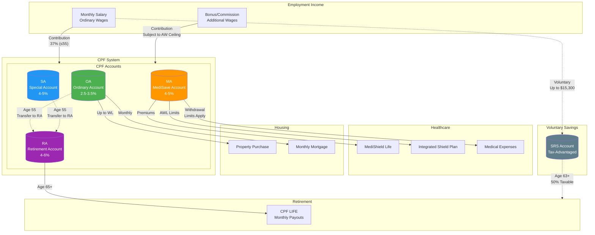

---

## 2. Monthly CPF Contribution Flow

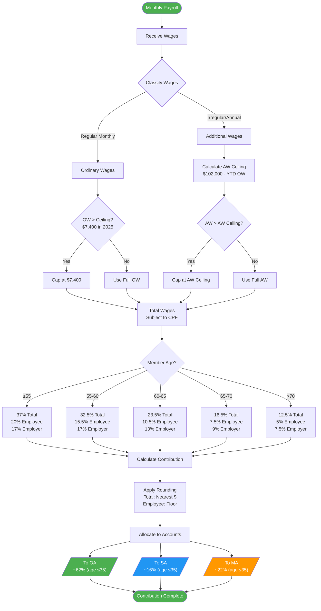

---

## 3. CPF Account Allocation by Age

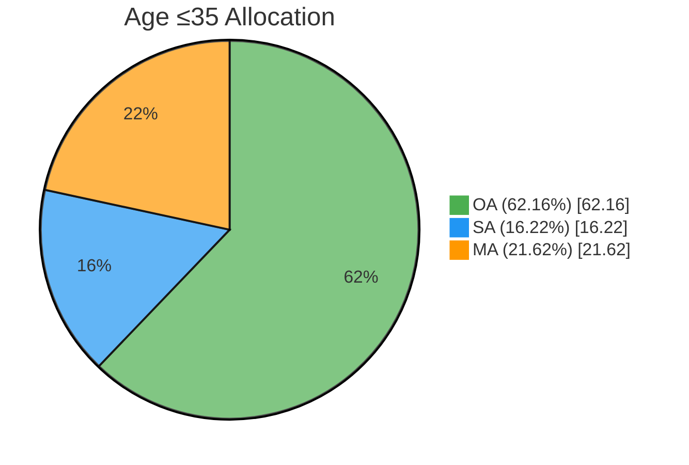

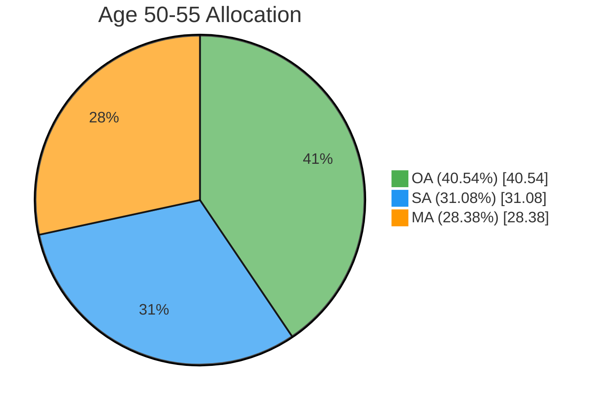

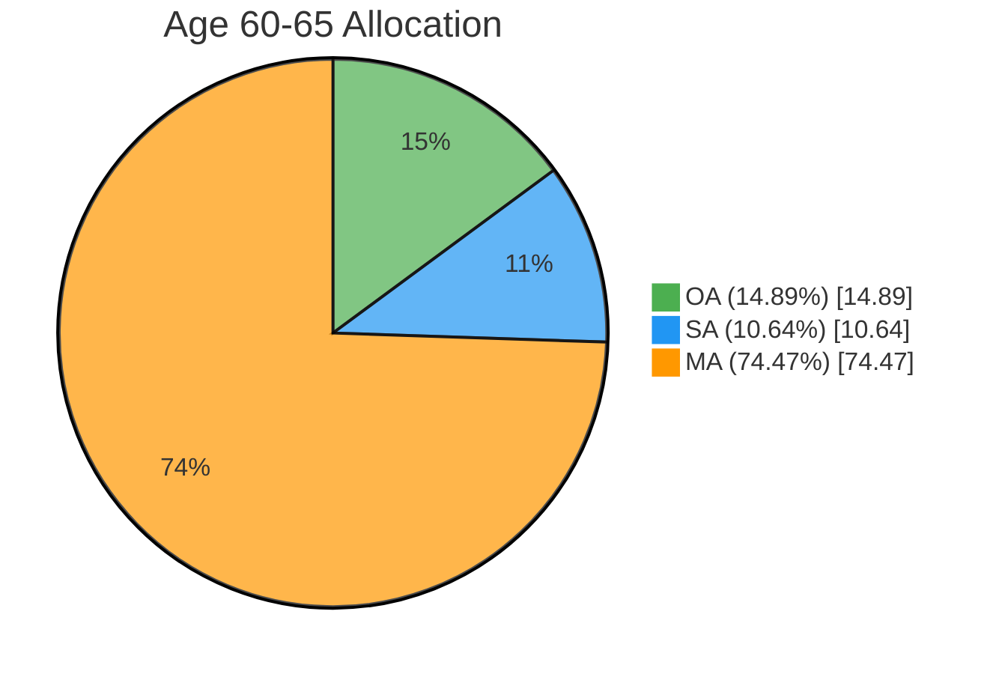

---

## 4. MediSave BHS Spillover Logic

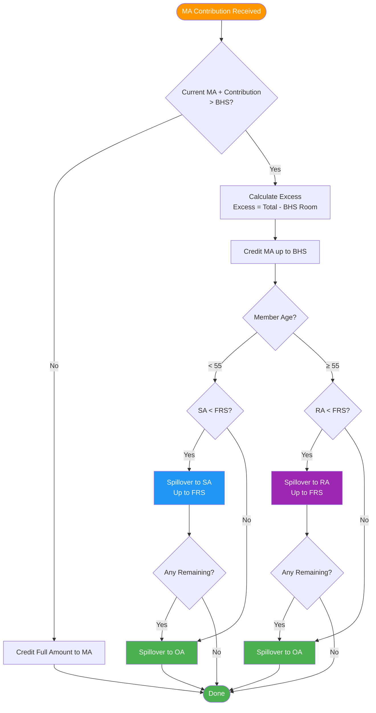

---

## 5. Age 55: Retirement Account Creation

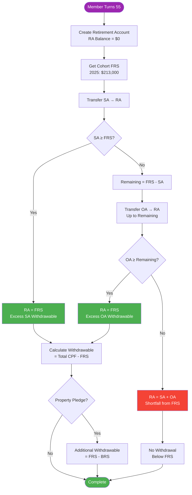

---

## 6. CPF Interest Calculation

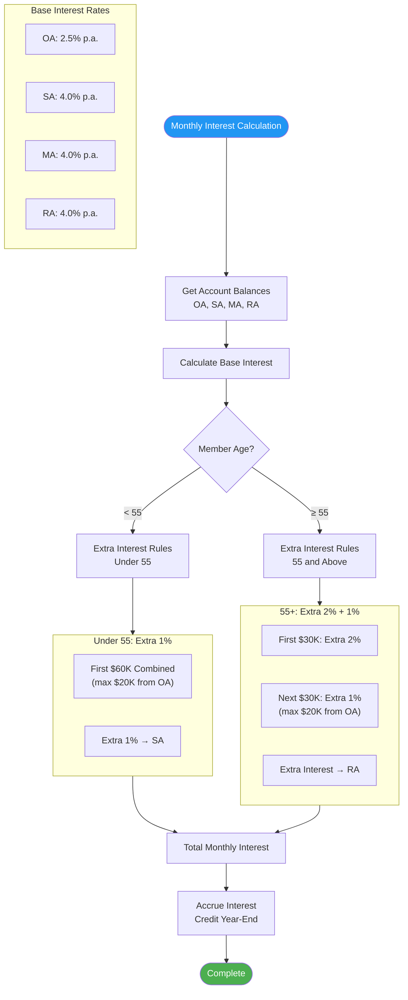

---

## 7. CPF Housing Usage Flow

```mermaid
flowchart TD
    START([Property Purchase]) --> TYPE{Property Type?}

    TYPE --> |BTO| BTO[No VL/WL Limits<br/>Use OA Freely]
    TYPE --> |HDB Resale| RESALE[VL Applies]
    TYPE --> |Private| PRIVATE[VL & WL Apply]

    BTO --> USE_OA[Use OA for<br/>Downpayment + Instalments]

    RESALE --> CALC_VL[VL = min(Price, Valuation)]
    PRIVATE --> CALC_VL

    CALC_VL --> LOAN{Loan Type?}

    LOAN --> |HDB Loan| HDB_LOAN[Can Exceed VL<br/>if BRS Met]
    LOAN --> |Bank Loan| BANK_LOAN[WL = 120% × VL<br/>Max CPF Usage]

    HDB_LOAN --> BRS_CHECK_1{CPF ≥ BRS?}
    BANK_LOAN --> VL_FIRST[Use OA up to VL]

    BRS_CHECK_1 --> |Yes| USE_BEYOND[Use Beyond VL]
    BRS_CHECK_1 --> |No| CAP_VL_1[Cap at VL]

    VL_FIRST --> BRS_CHECK_2{CPF ≥ BRS?}

    BRS_CHECK_2 --> |Yes| USE_TO_WL[Use VL to WL<br/>Additional 20%]
    BRS_CHECK_2 --> |No| CAP_VL_2[Cap at VL]

    USE_OA --> TRACK[Track Principal<br/>for Accrued Interest]
    USE_BEYOND --> TRACK
    CAP_VL_1 --> TRACK
    USE_TO_WL --> TRACK
    CAP_VL_2 --> TRACK

    TRACK --> DONE([CPF Used for Property])

    style START fill:#4CAF50,color:#fff
    style DONE fill:#4CAF50,color:#fff
    style BTO fill:#8BC34A,color:#fff
```

---

## 8. Property Sale: Accrued Interest Refund

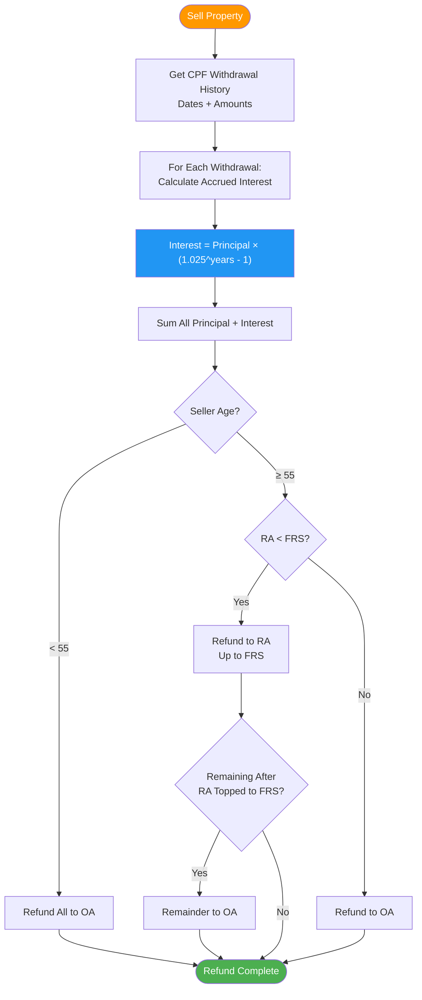

---

## 9. CPF LIFE Payout Flow

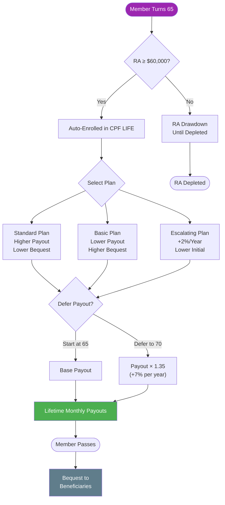

---

## 10. SRS Contribution & Withdrawal Flow

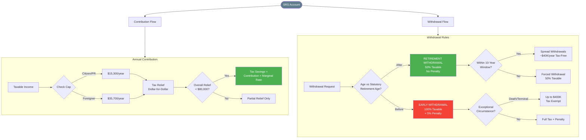

---

## 11. Healthcare Financing Flow

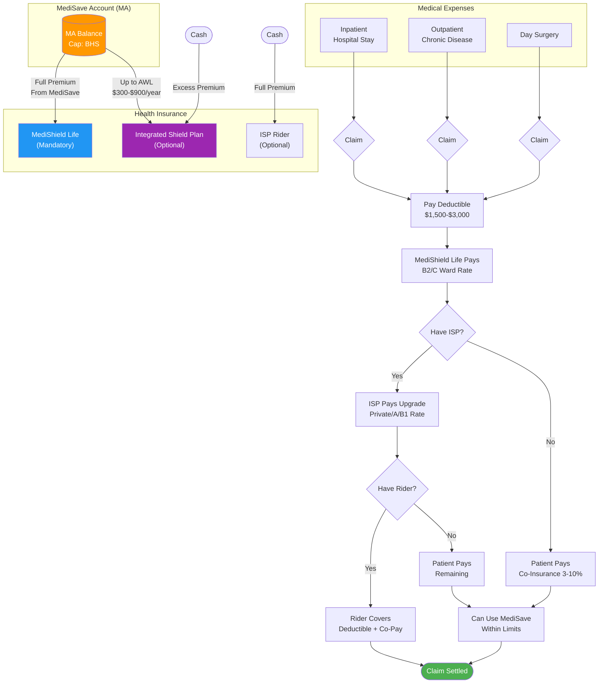

---

## 12. Complete Lifecycle: Age Progression

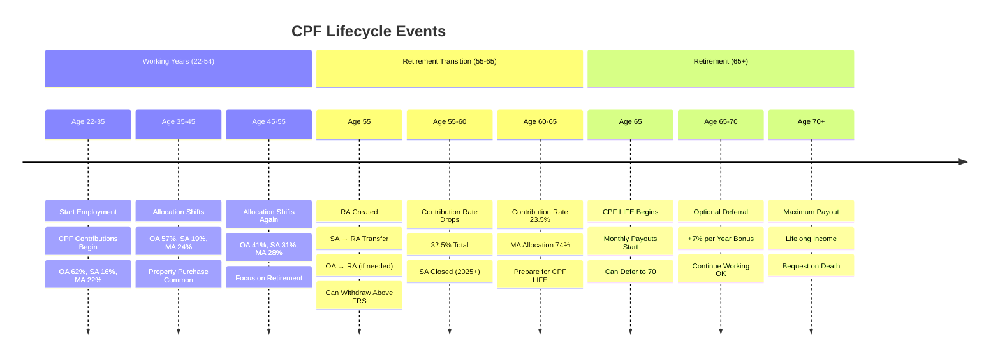

---

## 13. Data Flow: Simulation Engine

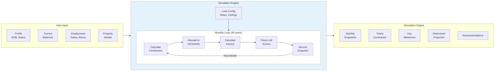

---

## 14. Scenario Comparison

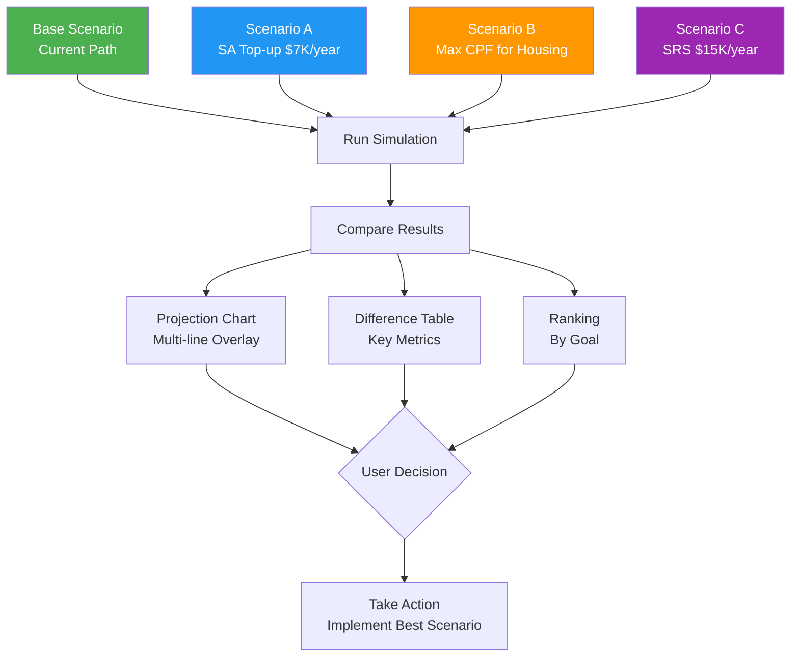

---

## 15. CPFIS Investment Flow

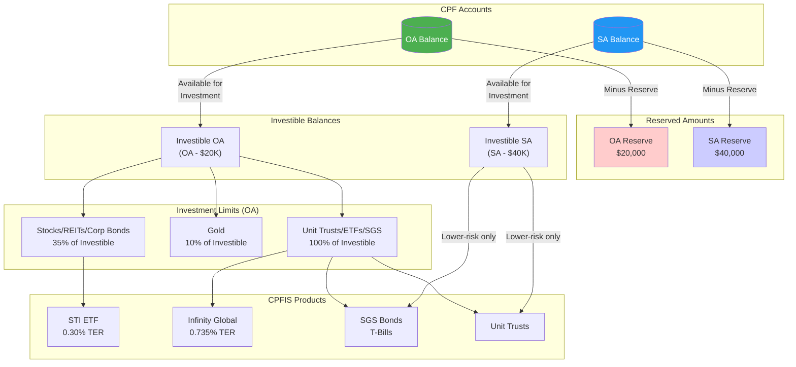

---

## 16. SA Shielding Strategy Timeline

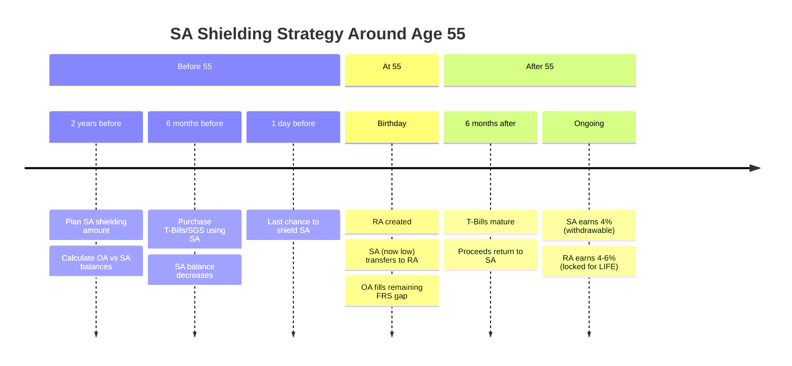

---

## 17. SA Shielding Decision Flow

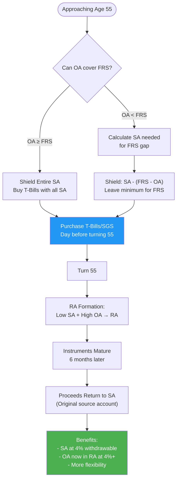

---

## 18. OA to SA Transfer and Top-up Flow

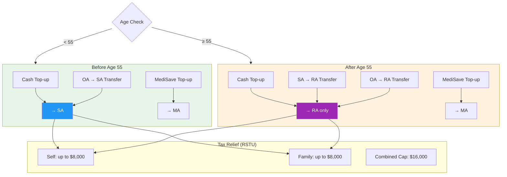

---

## 19. CPF Education Scheme Flow

```mermaid
flowchart TD
    OA[("OA Balance")] --> WITHDRAW["Withdraw for Education"]

    WITHDRAW --> ELIGIBLE{Eligible Course?}

    ELIGIBLE --> |"NUS/NTU/SMU/etc"| APPROVED[Approved]
    ELIGIBLE --> |"Not eligible"| REJECTED[Rejected]

    APPROVED --> DISBURSE["Funds Disbursed<br/>Interest starts accruing<br/>@ 2.5% p.a."]

    DISBURSE --> STUDY["Complete Studies"]

    STUDY --> REPAY["Repay over 12 years<br/>Min $100/month"]

    REPAY --> OA_RETURN["Repayments return<br/>to own OA"]

    subgraph Waiver["Loan Waiver Eligibility"]
        AGE55["Age 55+"]
        FRS_MET["RA ≥ FRS"]
        WAIVER["Loan Waived!"]
    end

    REPAY --> |"Check eligibility"| AGE55
    AGE55 --> FRS_MET
    FRS_MET --> WAIVER

    style OA fill:#4CAF50,color:#fff
    style WAIVER fill:#9C27B0,color:#fff
    style OA_RETURN fill:#4CAF50,color:#fff
```

---

## 20. Property Sale with CPF Refund (Detailed)

```mermaid
flowchart TD
    SALE([Property Sale Initiated]) --> CALC_PROCEEDS["Calculate Sale Proceeds<br/>Sale Price - Outstanding Loan"]

    CALC_PROCEEDS --> CALC_COSTS["Deduct Selling Costs<br/>Agent Commission + Legal Fees"]

    CALC_COSTS --> CALC_CPF["Calculate CPF Refund Required"]

    subgraph CPF_Refund["CPF Refund Calculation"]
        PRINCIPAL["OA Principal Used<br/>(Downpayment + Instalments)"]
        ACCRUED["+ Accrued Interest<br/>(2.5% compound)"]
        TOTAL_REF["= Total Refund Required"]
    end

    CALC_CPF --> PRINCIPAL
    PRINCIPAL --> ACCRUED
    ACCRUED --> TOTAL_REF

    TOTAL_REF --> AGE_CHECK{Member's Age?}

    AGE_CHECK --> |"< 55"| TO_OA["Full Refund → OA"]
    AGE_CHECK --> |"≥ 55"| TO_RA_FIRST["Refund → RA first<br/>(up to FRS)"]

    TO_RA_FIRST --> RA_FULL{RA reached FRS?}
    RA_FULL --> |"Yes, or excess"| REMAINDER["Remainder → OA"]
    RA_FULL --> |"No"| ALL_TO_RA["All to RA"]

    TO_OA --> NET["Calculate Net Cash Proceeds"]
    REMAINDER --> NET
    ALL_TO_RA --> NET

    NET --> SHORTFALL{Shortfall?}
    SHORTFALL --> |"Yes"| CASH_TOPUP["No cash top-up required<br/>if sold at market value"]
    SHORTFALL --> |"No"| RECEIVE["Receive Cash Proceeds"]

    style TO_OA fill:#4CAF50,color:#fff
    style TO_RA_FIRST fill:#9C27B0,color:#fff
    style REMAINDER fill:#4CAF50,color:#fff
```

---

## 21. Accrued Interest Accumulation

```mermaid
xychart-beta
    title "Accrued Interest Growth Over 25 Years (Example: $200K OA Used)"
    x-axis [Y1, Y5, Y10, Y15, Y20, Y25]
    y-axis "Amount ($)" 0 --> 400000
    bar [200000, 200000, 200000, 200000, 200000, 200000]
    line [205000, 226000, 256000, 291000, 330000, 375000]
```

*Note: Bar = Principal Used, Line = Total Refund Required (Principal + Accrued Interest)*

---

## Summary: Key Account Interactions

| From | To | Trigger | Amount |
|------|-----|---------|--------|
| Employment | OA/SA/MA | Monthly payroll | Based on rates & ceilings |
| MA | SA/RA | MA > BHS | Spillover excess |
| MA | OA | MA > BHS, SA/RA ≥ FRS | Remaining spillover |
| OA | Property | Purchase/instalment | Up to VL/WL |
| OA | RA | Age 55 | To fill FRS gap |
| SA | RA | Age 55 | Up to FRS |
| RA | CPF LIFE | Age 65 | Annuity premium |
| CPF LIFE | Member | Age 65+ | Monthly payout |
| Property Sale | OA/RA | Sale completed | Principal + accrued interest |
| Income | SRS | Voluntary | Up to $15,300/$35,700 |
| SRS | Member | Age 63+ | 50% taxable withdrawal |
| OA | CPFIS | Voluntary | Investible balance (OA - $20K) |
| SA | CPFIS | Voluntary | Investible balance (SA - $40K) - lower risk only |
| Cash | SA/RA | Top-up | Up to FRS, $8K tax relief |
| OA | SA | Transfer (before 55) | Up to FRS, $8K tax relief |
| OA | Education | Loan | Course fees, 2.5% interest |

---

*These diagrams can be rendered in any Mermaid-compatible viewer (GitHub, VS Code with Mermaid extension, Obsidian, etc.)*
