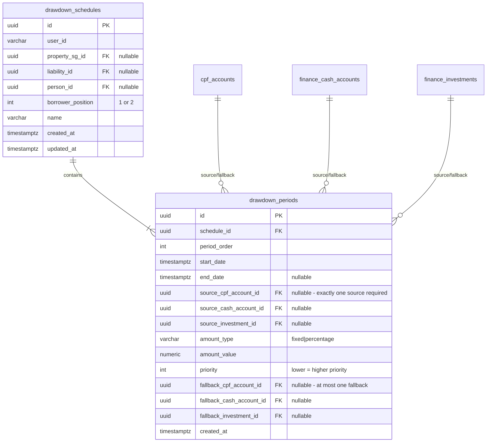
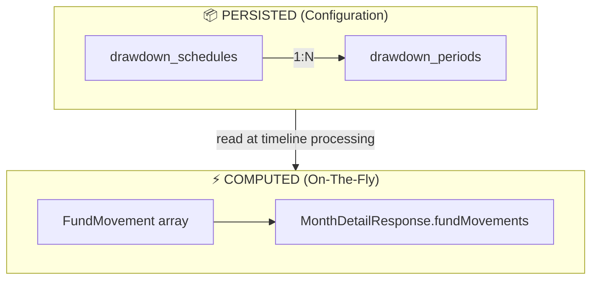
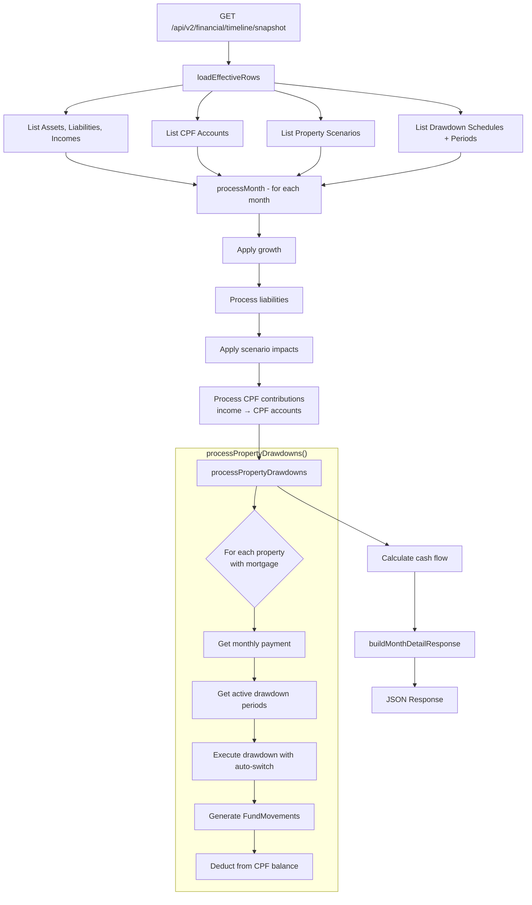
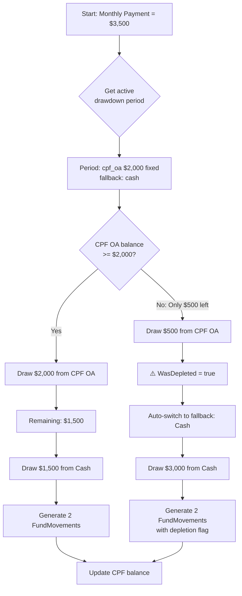

# Flexible CPF/Cash Drawdown Engine - Design Specification

## Summary

Enable users to specify flexible CPF/cash splits for property mortgage payments across different periods. The engine auto-switches to cash when CPF OA is depleted. Designed for reuse across CPF retirement, other liabilities, etc.

**Requirements:**
- Support both fixed amounts AND percentages per period
- Auto-switch to cash when CPF OA balance exhausted
- Monthly payments only (downpayment stays with existing fields)
- Fund movements computed on-the-fly (not persisted)

---

## Current State

```sql
-- property_sg table (current limitation)
borrower1_monthly_cpf_oa NUMERIC(15,4)  -- Fixed for ENTIRE loan term
borrower2_monthly_cpf_oa NUMERIC(15,4)  -- No period flexibility
```

---

## Database Schema

### ER Diagram



### Table 1: `drawdown_schedules`

```sql
CREATE TABLE drawdown_schedules (
    id uuid DEFAULT gen_random_uuid() PRIMARY KEY,
    user_id VARCHAR(36) NOT NULL,

    -- Entity FKs - add more columns as new entity types are needed
    property_sg_id uuid REFERENCES property_sg(id) ON DELETE CASCADE,
    liability_id uuid REFERENCES finance_liabilities(id) ON DELETE CASCADE,
    -- Future: cpf_retirement_id, investment_id, etc.

    -- Per-borrower tracking
    person_id uuid REFERENCES persons(id) ON DELETE SET NULL,
    borrower_position INT CHECK (borrower_position IN (1, 2)),

    name VARCHAR(100),
    created_at TIMESTAMPTZ DEFAULT NOW() NOT NULL,
    updated_at TIMESTAMPTZ DEFAULT NOW() NOT NULL
);

CREATE INDEX idx_drawdown_schedules_user ON drawdown_schedules(user_id);
CREATE INDEX idx_drawdown_schedules_property ON drawdown_schedules(property_sg_id);
CREATE INDEX idx_drawdown_schedules_liability ON drawdown_schedules(liability_id);
CREATE INDEX idx_drawdown_schedules_person ON drawdown_schedules(person_id);
```

### Table 2: `drawdown_periods`

Uses proper FK columns (matching `income_allocations` pattern) instead of polymorphic associations for referential integrity.

```sql
CREATE TABLE drawdown_periods (
    id uuid DEFAULT gen_random_uuid() PRIMARY KEY,
    schedule_id uuid NOT NULL REFERENCES drawdown_schedules(id) ON DELETE CASCADE,

    -- Period ordering and timing
    period_order INT DEFAULT 0 NOT NULL,
    start_date TIMESTAMPTZ NOT NULL,
    end_date TIMESTAMPTZ,  -- NULL = continues until entity ends

    -- Source: separate FK columns for referential integrity
    -- Exactly one must be set (enforced by CHECK constraint)
    source_cpf_account_id uuid REFERENCES cpf_accounts(id) ON DELETE CASCADE,
    source_cash_account_id uuid REFERENCES finance_cash_accounts(id) ON DELETE CASCADE,
    source_investment_id uuid REFERENCES finance_investments(id) ON DELETE CASCADE,

    -- Amount specification
    amount_type VARCHAR(10) NOT NULL CHECK (amount_type IN ('fixed', 'percentage')),
    amount_value NUMERIC(15,4) NOT NULL,

    -- Multi-source priority (lower = higher priority)
    priority INT DEFAULT 0 NOT NULL,

    -- Fallback: separate FK columns (at most one, optional)
    fallback_cpf_account_id uuid REFERENCES cpf_accounts(id) ON DELETE SET NULL,
    fallback_cash_account_id uuid REFERENCES finance_cash_accounts(id) ON DELETE SET NULL,
    fallback_investment_id uuid REFERENCES finance_investments(id) ON DELETE SET NULL,

    created_at TIMESTAMPTZ DEFAULT NOW() NOT NULL,

    -- Exactly one source required
    CONSTRAINT chk_exactly_one_source CHECK (
        ((source_cpf_account_id IS NOT NULL)::int +
         (source_cash_account_id IS NOT NULL)::int +
         (source_investment_id IS NOT NULL)::int) = 1
    ),

    -- At most one fallback (optional)
    CONSTRAINT chk_at_most_one_fallback CHECK (
        ((fallback_cpf_account_id IS NOT NULL)::int +
         (fallback_cash_account_id IS NOT NULL)::int +
         (fallback_investment_id IS NOT NULL)::int) <= 1
    )
);

CREATE INDEX idx_drawdown_periods_schedule ON drawdown_periods(schedule_id);
CREATE INDEX idx_drawdown_periods_dates ON drawdown_periods(start_date, end_date);
CREATE INDEX idx_drawdown_periods_cpf ON drawdown_periods(source_cpf_account_id) WHERE source_cpf_account_id IS NOT NULL;
CREATE INDEX idx_drawdown_periods_cash ON drawdown_periods(source_cash_account_id) WHERE source_cash_account_id IS NOT NULL;
CREATE INDEX idx_drawdown_periods_investment ON drawdown_periods(source_investment_id) WHERE source_investment_id IS NOT NULL;
```

### Reusability: Adding New Entity Types

**For `drawdown_schedules` (what entity is being paid):**
```sql
ALTER TABLE drawdown_schedules
ADD COLUMN cpf_retirement_id uuid REFERENCES cpf_retirements(id) ON DELETE CASCADE;

CREATE INDEX idx_drawdown_schedules_cpf_retirement
ON drawdown_schedules(cpf_retirement_id);
```

**For `drawdown_periods` (new source types):**
```sql
-- Add new source FK column
ALTER TABLE drawdown_periods
ADD COLUMN source_new_account_id uuid REFERENCES new_accounts(id) ON DELETE CASCADE;

-- Update CHECK constraint (drop old, add new)
ALTER TABLE drawdown_periods DROP CONSTRAINT chk_exactly_one_source;
ALTER TABLE drawdown_periods ADD CONSTRAINT chk_exactly_one_source CHECK (
    ((source_cpf_account_id IS NOT NULL)::int +
     (source_cash_account_id IS NOT NULL)::int +
     (source_investment_id IS NOT NULL)::int +
     (source_new_account_id IS NOT NULL)::int) = 1
);
```

### Design Decision: Proper FKs vs Polymorphic Associations

We use **separate FK columns** (like `income_allocations`) instead of polymorphic `source_type`/`source_id` because:

| Approach | Polymorphic | Separate FKs ✓ |
|----------|-------------|----------------|
| Referential integrity | ❌ None | ✓ Enforced |
| Cascade deletes | ❌ Manual | ✓ Automatic |
| Type safety | ❌ String enum | ✓ Compile-time |
| Query joins | ❌ Dynamic | ✓ Direct |
| Adding new types | ✓ Just add enum | Needs ALTER |

The tradeoff is worth it — financial data integrity is critical.

---

## Architecture

### High-Level Flow



### In-Memory: `FundMovement` (NOT persisted)

Fund movements are computed during timeline processing and returned in API responses.

```go
type FundMovement struct {
    SourceType    string          // "cpf_oa", "cpf_sa", "cash", "investment"
    SourceID      *string         // Account ID (nil for generic cash)
    DestType      string          // "liability", "expense"
    DestID        *string
    Amount        decimal.Decimal
    MovementType  string          // "payment", "withdrawal", "transfer"
    EffectiveDate time.Time
    TriggerType   string          // "drawdown_period", "income_allocation"
    TriggerID     *string
    WasDepleted   bool
    SwitchedToSource *string
    BalanceBefore *decimal.Decimal
    BalanceAfter  *decimal.Decimal
}
```

---

## Timeline Processing Flow



---

## Auto-Switch Logic



---

## Example API Response

```json
{
  "months": [{
    "year": 2025,
    "month": 6,

    "cpfAssets": [{
      "name": "CPF Ordinary Account",
      "balance": "148000.00"
    }],

    "expenses": [{
      "name": "Mortgage Payment - HDB Tampines",
      "amount": "3500.00",
      "itemType": "mortgage_payment",
      "sourceBreakdown": {
        "cpfOa": "2000.00",
        "cash": "1500.00"
      }
    }],

    "fundMovements": [
      {
        "sourceType": "cpf_oa",
        "sourceId": "cpf-account-123",
        "destType": "liability",
        "destId": "mortgage-456",
        "amount": "2000.00",
        "movementType": "payment",
        "balanceBefore": "150000.00",
        "balanceAfter": "148000.00"
      },
      {
        "sourceType": "cash",
        "destType": "liability",
        "destId": "mortgage-456",
        "amount": "1500.00",
        "movementType": "payment"
      }
    ]
  }]
}
```

---

## Implementation Phases

| Phase | Tasks | Files |
|-------|-------|-------|
| 1. Database | Migration, CRUD | `migrations/`, `repository/drawdown.go` |
| 2. Engine Core | ProcessMonth, auto-switch | `drawdown/engine.go` |
| 3. Timeline | Load schedules, integrate | `timeline/service.go`, `timeline/types.go` |
| 4. API | CRUD endpoints | `handlers/drawdown.go` |
| 5. Testing | Migration, integration tests | `*_test.go` |

## Critical Files

| File | Change |
|------|--------|
| `backend/migrations/202601030001_add_drawdown_engine.up.sql` | New tables |
| `backend/internal/financial_v2/repository/drawdown.go` | CRUD |
| `backend/internal/financial_v2/drawdown/engine.go` | Core logic |
| `backend/internal/financial_v2/timeline/types.go` | FundMovement struct |
| `backend/internal/financial_v2/timeline/service.go` | Monthly processing |
| `backend/internal/cpf/processor/processor.go` | OA deduction method |
| `backend/cmd/server/handlers/drawdown.go` | API handlers |

---

## Future Reusability

| Future Use Case | New FK Column |
|-----------------|---------------|
| CPF retirement withdrawals | `cpf_retirement_id` |
| Education loan repayment | `education_loan_id` |
| Investment portfolio drawdown | `investment_id` |
