# Fund Flow Rules - Phased Implementation Spec

## Summary

A unified abstraction for **internal money movements between balances**, implemented incrementally. Phase 1 delivers payment sequencing (~20 files), subsequent phases add allocation and transfer types.

**Key Distinction:** Fund flows are *internal* balance-to-balance movements. They don't change net worth—they redistribute it. External flows (income entering, expenses leaving) are handled by `finance_incomes` and `finance_expenses`.

### System Overview

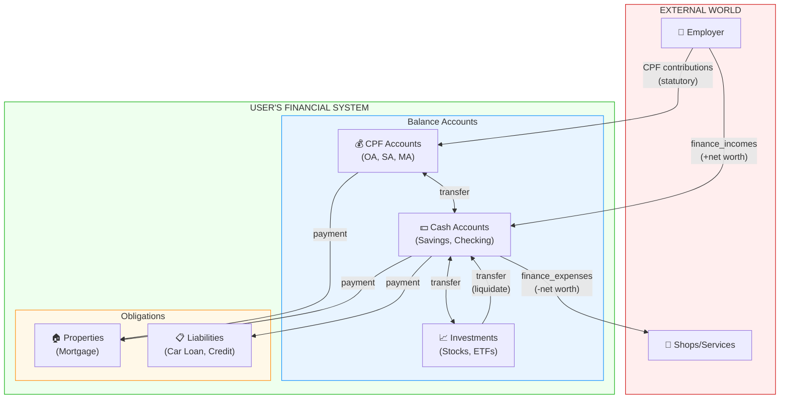

### Fund Flows vs External Flows

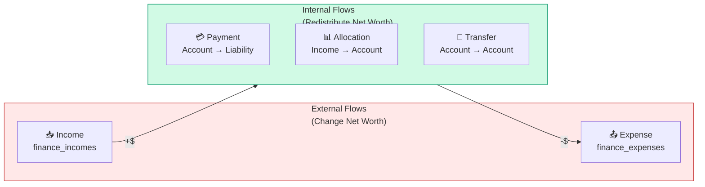

---

## Design Philosophy

### Fund Flows vs External Flows

| Concept | Direction | Net Worth Impact | Table |
|---------|-----------|------------------|-------|
| **Income** | External → System | Increases | `finance_incomes` |
| **Expense** | System → External | Decreases | `finance_expenses` |
| **Fund Flow** | Balance → Balance | Zero (redistribution) | `fund_flow_rules` |

### Why Unified Schema with Phased Implementation?

| Approach | Upfront Cost | Per-Feature Cost | Extensibility |
|----------|--------------|------------------|---------------|
| Focused tables | Low | High (new table each time) | Poor |
| Full unified | High (~45 files) | Low | Excellent |
| **Phased unified** | **Medium (~20 files)** | **Low (add enum)** | **Excellent** |

We get the best of both: low initial investment with excellent long-term extensibility.

### Phased Implementation Roadmap

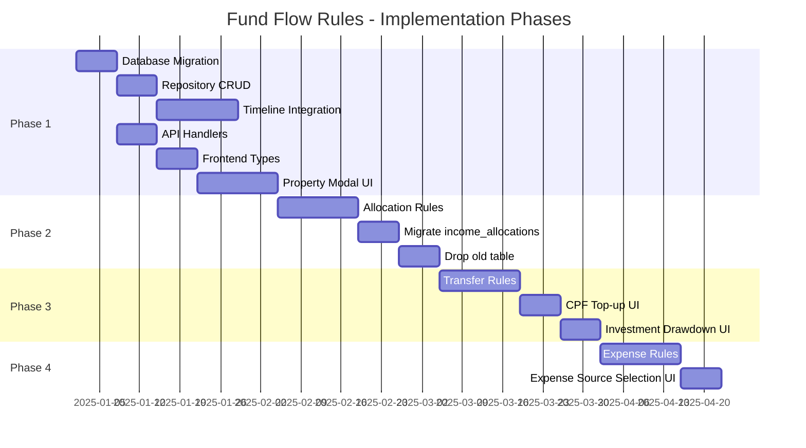

### Rule Type Rollout

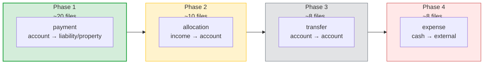

---

## Database Schema (Complete - All Phases)

### Entity Relationship Diagram

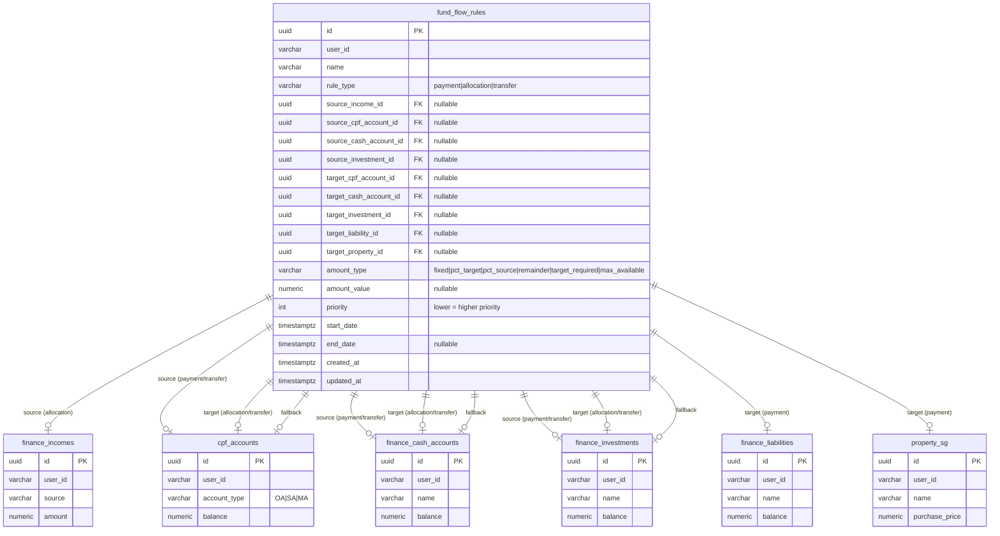

### Source/Target Constraints by Rule Type

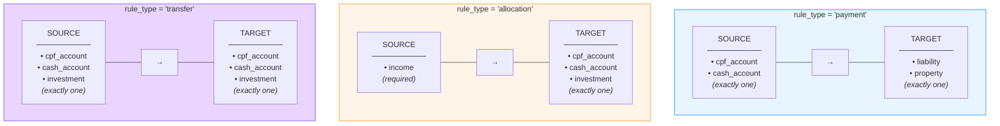

```sql
CREATE TABLE fund_flow_rules (
    id uuid DEFAULT gen_random_uuid() PRIMARY KEY,
    user_id VARCHAR(36) NOT NULL,
    name VARCHAR(100) NOT NULL,

    -- =========================================================================
    -- RULE TYPE
    -- =========================================================================
    -- All rule types are INTERNAL balance movements (no external flows)
    -- Phase 1: 'payment' only
    -- Phase 2: + 'allocation'
    -- Phase 3: + 'transfer'
    rule_type VARCHAR(20) NOT NULL CHECK (rule_type IN (
        'payment',     -- account → liability/property (Phase 1)
        'allocation',  -- income → account (Phase 2, replaces income_allocations)
        'transfer'     -- account → account (Phase 3: CPF top-ups, withdrawals)
    )),
    -- Note: No 'deduction' type - tax/CPF are external flows handled elsewhere

    -- =========================================================================
    -- SOURCE: which balance to deduct from
    -- =========================================================================
    -- For 'allocation': source_income_id required (routes incoming money)
    -- For 'payment'/'transfer': exactly one source account required
    source_income_id uuid REFERENCES finance_incomes(id) ON DELETE CASCADE,
    source_cpf_account_id uuid REFERENCES cpf_accounts(id) ON DELETE CASCADE,
    source_cash_account_id uuid REFERENCES finance_cash_accounts(id) ON DELETE CASCADE,
    source_investment_id uuid REFERENCES finance_investments(id) ON DELETE CASCADE,

    -- =========================================================================
    -- TARGET: which balance to credit (or reduce for liabilities)
    -- =========================================================================
    -- For 'allocation'/'transfer': exactly one target account required
    -- For 'payment': exactly one target liability/property required
    target_cpf_account_id uuid REFERENCES cpf_accounts(id) ON DELETE CASCADE,
    target_cash_account_id uuid REFERENCES finance_cash_accounts(id) ON DELETE CASCADE,
    target_investment_id uuid REFERENCES finance_investments(id) ON DELETE CASCADE,
    target_liability_id uuid REFERENCES finance_liabilities(id) ON DELETE CASCADE,
    target_property_id uuid REFERENCES property_sg(id) ON DELETE CASCADE,
    -- Note: No target_external - external flows belong in finance_expenses

    -- =========================================================================
    -- AMOUNT SPECIFICATION
    -- =========================================================================
    amount_type VARCHAR(20) NOT NULL CHECK (amount_type IN (
        'fixed',           -- Exact amount specified by user
        'pct_target',      -- Percentage of target's required amount (e.g., 60% of mortgage)
        'pct_source',      -- Percentage of source's amount/balance (e.g., 30% of income)
        'remainder',       -- Whatever's left after higher-priority rules
        'target_required', -- Derive from target's required payment (liability/property)
        'max_available'    -- Use up to source balance, optionally capped
    )),

    -- amount_value interpretation by type:
    -- 'fixed':           Required. The exact amount to transfer.
    -- 'pct_target':      Required. Percentage (0-100) of target's required amount.
    -- 'pct_source':      Required. Percentage (0-100) of source's amount/balance.
    -- 'remainder':       Ignored. Takes whatever's left.
    -- 'target_required': Optional. If set, caps the target's required amount.
    -- 'max_available':   Optional. If set, caps how much to take from source.
    amount_value NUMERIC(15,4),

    -- =========================================================================
    -- ORDERING
    -- =========================================================================
    -- Priority for multiple rules on same target (lower = higher priority)
    -- Use multiple rules with different priorities instead of fallback columns
    priority INT DEFAULT 0 NOT NULL,

    -- =========================================================================
    -- TIMING
    -- =========================================================================
    start_date TIMESTAMPTZ NOT NULL,
    end_date TIMESTAMPTZ,  -- NULL = no end

    created_at TIMESTAMPTZ DEFAULT NOW() NOT NULL,
    updated_at TIMESTAMPTZ DEFAULT NOW() NOT NULL,

    -- =========================================================================
    -- CONSTRAINTS
    -- =========================================================================

    -- Amount value required for fixed, pct_target, and pct_source types
    CONSTRAINT chk_amount_value CHECK (
        amount_type IN ('remainder', 'target_required', 'max_available')
        OR amount_value IS NOT NULL
    ),

    -- Percentage types must be 0-100
    CONSTRAINT chk_percentage_range CHECK (
        amount_type NOT IN ('pct_target', 'pct_source')
        OR (amount_value >= 0 AND amount_value <= 100)
    )

    -- Note: Source/target validation done at application layer per rule_type
    -- (more flexible than trying to encode all combinations in CHECK constraints)
);

-- Indexes
CREATE INDEX idx_fund_flow_rules_user ON fund_flow_rules(user_id);
CREATE INDEX idx_fund_flow_rules_type ON fund_flow_rules(rule_type);
CREATE INDEX idx_fund_flow_rules_dates ON fund_flow_rules(start_date, end_date);
CREATE INDEX idx_fund_flow_rules_income ON fund_flow_rules(source_income_id)
    WHERE source_income_id IS NOT NULL;
CREATE INDEX idx_fund_flow_rules_liability ON fund_flow_rules(target_liability_id)
    WHERE target_liability_id IS NOT NULL;
CREATE INDEX idx_fund_flow_rules_property ON fund_flow_rules(target_property_id)
    WHERE target_property_id IS NOT NULL;
```

---

## Amount Type Semantics

| Amount Type | Question Answered | amount_value | Use Case |
|-------------|-------------------|--------------|----------|
| `fixed` | "Transfer exactly this much" | Required | $2,500/month mortgage |
| `pct_target` | "Transfer this % of target's required" | Required (0-100) | 60% of mortgage payment from CPF |
| `pct_source` | "Transfer this % of source's amount" | Required (0-100) | 30% of income to savings |
| `remainder` | "Transfer whatever's left" | Ignored | Cash covers remaining mortgage |
| `target_required` | "Transfer what target needs" | Optional cap | Pay full mortgage amount |
| `max_available` | "Transfer what source has" | Optional cap | Use all available CPF for mortgage |

### Amount Type Decision Tree

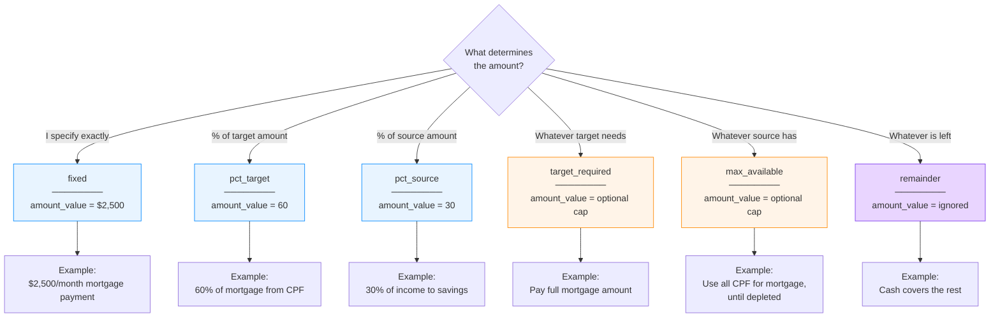

### `max_available` - Dynamic Source-Constrained Transfers

The `max_available` type enables dynamic transfers based on source balance:

```go
func calculateMaxAvailable(
    rule FundFlowRule,
    sourceBalance decimal.Decimal,
    remainingRequired decimal.Decimal,
) decimal.Decimal {
    // Start with what source has
    amount := sourceBalance

    // Don't exceed what's still needed
    if amount.GreaterThan(remainingRequired) {
        amount = remainingRequired
    }

    // Apply optional cap
    if rule.AmountValue != nil && amount.GreaterThan(*rule.AmountValue) {
        amount = *rule.AmountValue
    }

    return amount
}
```

**Example: "Use all CPF OA for mortgage, cash covers rest"**

```json
[
  {
    "name": "Mortgage from CPF",
    "ruleType": "payment",
    "sourceCpfAccountId": "cpf-oa-uuid",
    "targetPropertyId": "hdb-uuid",
    "amountType": "max_available",
    "amountValue": null,
    "priority": 0
  },
  {
    "name": "Mortgage from Cash",
    "ruleType": "payment",
    "sourceCashAccountId": "savings-uuid",
    "targetPropertyId": "hdb-uuid",
    "amountType": "remainder",
    "priority": 1
  }
]
```

**Monthly behavior when CPF contribution < mortgage:**

| Month | CPF OA Start | +Contribution | Mortgage | From CPF | From Cash | CPF OA End |
|-------|-------------|---------------|----------|----------|-----------|------------|
| 1 | $50,000 | +$2,400 | $2,500 | $2,500 | $0 | $49,900 |
| 60 | $3,000 | +$2,400 | $2,500 | $2,500 | $0 | $2,900 |
| 100 | $100 | +$2,400 | $2,500 | $2,500 | $0 | $0 |
| 101 | $0 | +$2,400 | $2,500 | $2,400 | $100 | $0 |
| 102 | $0 | +$2,400 | $2,500 | $2,400 | $100 | $0 |

---

## Rule Type Semantics

| Rule Type | Source | Target | Net Worth Impact | Use Case |
|-----------|--------|--------|------------------|----------|
| `payment` | CPF or Cash | Liability or Property | Zero (principal) / Negative (interest) | Mortgage from CPF, car loan from cash |
| `allocation` | Income | Account (CPF/cash/investment) | Zero (routing only) | Salary → 30% to investment |
| `transfer` | Account (CPF/cash/investment) | Account (CPF/cash/investment) | Zero | CPF top-up, investment liquidation |

**Note:** Investments cannot directly pay liabilities/properties. To use investment funds for payments, first create a `transfer` rule to liquidate to cash, then a `payment` rule from cash.

**Example: Using investment to pay mortgage**
```
1. transfer: Investment → Cash (liquidate $5,000/month)
2. payment: Cash → Property (pay mortgage)
```

### Validation Rules (Application Layer)

```go
func validateRule(r FundFlowRule) error {
    switch r.RuleType {
    case "payment":
        if r.SourceIncomeID != nil {
            return errors.New("payment rules cannot have income source")
        }
        if r.SourceInvestmentID != nil {
            return errors.New("payment rules cannot use investment as source - liquidate to cash first")
        }
        if countPaymentSources(r) != 1 {
            return errors.New("payment rules require exactly one source (cpf or cash)")
        }
        if r.TargetLiabilityID == nil && r.TargetPropertyID == nil {
            return errors.New("payment rules require liability or property target")
        }

    case "allocation":
        if r.SourceIncomeID == nil {
            return errors.New("allocation rules require income source")
        }
        if countAccountTargets(r) != 1 {
            return errors.New("allocation rules require exactly one account target")
        }

    case "transfer":
        if countTransferSources(r) != 1 {
            return errors.New("transfer rules require exactly one account source")
        }
        if countAccountTargets(r) != 1 {
            return errors.New("transfer rules require exactly one account target")
        }
    }
    return nil
}

func countPaymentSources(r FundFlowRule) int {
    count := 0
    if r.SourceCpfAccountID != nil { count++ }
    if r.SourceCashAccountID != nil { count++ }
    // Note: investments cannot be payment sources - must liquidate to cash first
    return count
}

func countTransferSources(r FundFlowRule) int {
    count := 0
    if r.SourceCpfAccountID != nil { count++ }
    if r.SourceCashAccountID != nil { count++ }
    if r.SourceInvestmentID != nil { count++ }
    return count
}

func countAccountTargets(r FundFlowRule) int {
    count := 0
    if r.TargetCpfAccountID != nil { count++ }
    if r.TargetCashAccountID != nil { count++ }
    if r.TargetInvestmentID != nil { count++ }
    return count
}
```

---

## Phase 1: Payment Rules

**Goal:** Enable payment sequencing (CPF → mortgage with cash fallback)

**Blast Radius:** ~20 files

### What Gets Built

| Layer | Files |
|-------|-------|
| Migration | `migrations/YYYYMMDD_create_fund_flow_rules.up.sql` |
| Repository | `repository/fund_flow_rules.go` |
| Repository | `repository/store.go` (interface additions) |
| Handlers | `handlers/fund_flow_rules.go` |
| Routes | `routes/v2.go` |
| Timeline | `timeline/fund_flow.go` (execution logic) |
| Timeline | `timeline/service.go` (integration) |
| Timeline | `timeline/types.go` (structs) |
| Tests | `repository/fund_flow_rules_test.go` |
| Tests | `timeline/fund_flow_test.go` |
| Docs | `docs/*.go`, `docs/*.yaml` |
| Frontend | `types/fundFlow.ts` |
| Frontend | `services/financialApi.ts` |
| Frontend | `hooks/queries/useFundFlowRulesQuery.ts` |
| Frontend | `components/modals/PaymentRuleModal/` |

### Schema (Phase 1 Only)

```sql
-- Phase 1: Only allow 'payment' type
CREATE TABLE fund_flow_rules (
    -- ... full schema from above ...

    rule_type VARCHAR(20) NOT NULL CHECK (rule_type IN ('payment')),

    -- ... rest of columns ...
);
```

### Timeline Integration

```go
// timeline/service.go
func processMonth(mctx *MonthlyContext, ...) MonthDetailResponse {
    // ... existing steps 1-3 ...

    // 3b. Execute payment rules (NEW)
    executePaymentRules(mctx.FundFlowRules, mctx.State, currentDate)

    // ... existing steps 4-7 ...
}

// timeline/fund_flow.go
func executePaymentRules(rules []FundFlowRule, state BalanceMap, date time.Time) {
    paymentRules := filterByType(rules, "payment")

    // Group by target (liability or property)
    byTarget := groupPaymentsByTarget(paymentRules)

    for targetID, targetRules := range byTarget {
        executePaymentGroup(targetID, targetRules, state, date)
    }
}

func executePaymentGroup(targetID string, rules []FundFlowRule, state BalanceMap, date time.Time) {
    // Sort by priority
    sort.Slice(rules, func(i, j int) bool {
        return rules[i].Priority < rules[j].Priority
    })

    // Get required payment from liability/property
    required := getRequiredPayment(targetID, state)
    remaining := required

    for _, rule := range rules {
        if remaining.IsZero() {
            break
        }

        amount := calculateAmount(rule, required, remaining)
        sourceID := getSourceID(rule)
        sourceBalance := state[sourceID]

        if sourceBalance.GreaterThanOrEqual(amount) {
            // Full payment from source
            state[sourceID] = sourceBalance.Sub(amount)
            remaining = remaining.Sub(amount)
        } else if fallbackID := getFallbackID(rule); fallbackID != "" {
            // Partial from source, rest from fallback
            state[sourceID] = decimal.Zero()
            shortfall := amount.Sub(sourceBalance)
            state[fallbackID] = state[fallbackID].Sub(shortfall)
            remaining = remaining.Sub(amount)
        } else {
            // Insufficient funds - partial payment only
            state[sourceID] = decimal.Zero()
            remaining = remaining.Sub(sourceBalance)
        }
    }
}
```

### Example: HDB Mortgage from CPF with Cash as Secondary Source

Using priority-based rules instead of fallback columns:

```json
[
  {
    "name": "HDB Mortgage from CPF",
    "ruleType": "payment",
    "sourceCpfAccountId": "cpf-uuid",
    "targetPropertyId": "hdb-uuid",
    "amountType": "max_available",
    "priority": 0,
    "startDate": "2025-01-01"
  },
  {
    "name": "HDB Mortgage from Cash",
    "ruleType": "payment",
    "sourceCashAccountId": "savings-uuid",
    "targetPropertyId": "hdb-uuid",
    "amountType": "remainder",
    "priority": 1,
    "startDate": "2025-01-01"
  }
]
```

**Result (when mortgage = $2,500/month):**
- Months 1-72: $2,500 deducted from CPF OA (priority 0 rule covers full amount)
- Month 73: CPF OA has $1,800 left → $1,800 from CPF, $700 from cash (remainder rule kicks in)
- Month 74+: Full $2,500 from cash (CPF depleted, remainder covers all)

---

## Phase 2: Allocation Rules

**Goal:** Migrate `income_allocations` to unified table

**Blast Radius:** ~10 additional files

### What Changes

```sql
-- Expand allowed types
ALTER TABLE fund_flow_rules
    DROP CONSTRAINT fund_flow_rules_rule_type_check,
    ADD CONSTRAINT fund_flow_rules_rule_type_check
        CHECK (rule_type IN ('payment', 'allocation'));
```

### Migration Script

```sql
-- Migrate existing income_allocations to fund_flow_rules
INSERT INTO fund_flow_rules (
    user_id, name, rule_type,
    source_income_id,
    target_cash_account_id, target_investment_id,
    amount_type, amount_value,
    priority, start_date, end_date
)
SELECT
    i.user_id,
    COALESCE(i.name, 'Allocation') || ' → ' || COALESCE(ca.name, inv.name),
    'allocation',
    ia.income_id,
    ia.target_cash_account_id,
    ia.target_investment_id,
    ia.allocation_type,
    ia.allocation_value,
    0,  -- default priority
    ia.start_date,
    ia.end_date
FROM income_allocations ia
JOIN finance_incomes i ON ia.income_id = i.id
LEFT JOIN finance_cash_accounts ca ON ia.target_cash_account_id = ca.id
LEFT JOIN finance_investments inv ON ia.target_investment_id = inv.id
WHERE ia.parent_id IS NULL;  -- Only root records
```

### Timeline Integration

```go
// Extend executeFlowRules to handle allocations
func executeFlowRules(rules []FundFlowRule, state BalanceMap, incomes []Income, date time.Time) {
    // Allocations run first (route incoming money)
    allocationRules := filterByType(rules, "allocation")
    executeAllocations(allocationRules, incomes, state, date)

    // Payments run second (route money to obligations)
    paymentRules := filterByType(rules, "payment")
    executePayments(paymentRules, state, date)
}
```

### Deprecation Path

1. **Phase 2a:** Dual-read (read from both tables, prefer fund_flow_rules)
2. **Phase 2b:** Dual-write (write to both tables for rollback safety)
3. **Phase 2c:** Single-write to fund_flow_rules only
4. **Phase 2d:** Drop income_allocations table

---

## Phase 3: Transfer Rules

**Goal:** Enable account-to-account movements (CPF top-ups, investment withdrawals)

### What Changes

```sql
ALTER TABLE fund_flow_rules
    DROP CONSTRAINT fund_flow_rules_rule_type_check,
    ADD CONSTRAINT fund_flow_rules_rule_type_check
        CHECK (rule_type IN ('payment', 'allocation', 'transfer'));
```

### Example: Monthly CPF SA Top-Up

```json
{
  "name": "Voluntary SA Top-Up",
  "ruleType": "transfer",
  "sourceCashAccountId": "savings-uuid",
  "targetCpfAccountId": "cpf-uuid",
  "amountType": "fixed",
  "amountValue": 1000,
  "priority": 0,
  "startDate": "2025-01-01",
  "endDate": "2030-12-31"
}
```

### Example: Retirement Investment Drawdown

```json
{
  "name": "Retirement Drawdown",
  "ruleType": "transfer",
  "sourceInvestmentId": "retirement-portfolio-uuid",
  "targetCashAccountId": "checking-uuid",
  "amountType": "fixed",
  "amountValue": 5000,
  "priority": 0,
  "startDate": "2055-01-01"
}
```

---

## Property Sale Proceeds (Frontend-Only, Precursor to Phase 3)

**Status:** ✅ Implemented (Frontend Only)

When a property is sold in Singapore, two types of fund movements occur:

### 1. CPF Refund (Mandatory)

CPF principal used + 2.5% accrued interest **must** be refunded to each borrower's respective CPF OA account. This is enforced by CPF Board regulations.

**Per-Borrower Calculation:**
```
Borrower's CPF Refund = Their Downpayment CPF + Their Monthly CPF Used + Accrued Interest
```

Where:
- Downpayment CPF: Amount each borrower contributed from CPF for downpayment
- Monthly CPF Used: Sum of monthly CPF payments over the holding period
- Accrued Interest: 2.5% compound interest on their principal

### 2. Net Cash Proceeds (User-Selected)

The remaining cash after deducting:
- Outstanding loan balance
- Total CPF refund (both borrowers)
- Seller's Stamp Duty (if applicable)
- Sale fees (agent, legal, etc.)

This goes to a user-selected cash account.

### Frontend Implementation

**Types (`frontend/src/app/property-planner/types/index.ts`):**
```typescript
export interface SaleInputs {
  expectedSaleDate: string
  expectedSalePrice: number
  fees: FeeItem[]
  // Sale proceeds destination fields
  borrower1CpfRefundAccountId: string | null  // Target CPF OA account for borrower 1's refund
  borrower2CpfRefundAccountId: string | null  // Target CPF OA account for borrower 2's refund (joint)
  netCashProceedsAccountId: string | null     // Target cash account for net proceeds
}

export interface PerBorrowerCpfRefund {
  borrower1: CpfRefund
  borrower2: CpfRefund | null  // null for single borrower
}
```

**UI Location:** Property Planner → Sale tab → "Proceeds" step

The UI shows:
- Per-borrower CPF OA destination dropdowns (with projected refund amounts)
- Cash account destination dropdown (with projected net proceeds)
- Summary of total sale value breakdown

### Future Phase 3 Integration

When Phase 3 (transfer rules) is implemented, these sale proceeds will be modeled as:

```json
[
  {
    "name": "CPF Refund to Borrower 1 OA",
    "ruleType": "transfer",
    "sourcePropertyId": "property-uuid",
    "targetCpfAccountId": "borrower-1-oa-uuid",
    "amountType": "fixed",
    "amountValue": 125000,
    "startDate": "2035-06-01"
  },
  {
    "name": "CPF Refund to Borrower 2 OA",
    "ruleType": "transfer",
    "sourcePropertyId": "property-uuid",
    "targetCpfAccountId": "borrower-2-oa-uuid",
    "amountType": "fixed",
    "amountValue": 98000,
    "startDate": "2035-06-01"
  },
  {
    "name": "Net Proceeds to Savings",
    "ruleType": "transfer",
    "sourcePropertyId": "property-uuid",
    "targetCashAccountId": "savings-uuid",
    "amountType": "remainder",
    "startDate": "2035-06-01"
  }
]
```

**Note:** This requires extending the transfer rule schema to support `sourcePropertyId` (a property sale event as source).

---

## Phase 4: Expense Rules

**Goal:** Enable priority-based source accounts for expenses (childcare, utilities, etc.)

**Blast Radius:** ~8 additional files

### Rationale

Currently, expenses deduct from a single cash account. Users want to model:
- "Pay childcare from savings first, then emergency fund if savings runs low"
- "Pay utilities from checking, fall back to savings"

This is the same pattern as payment rules, but for external outflows instead of liability payments.

### What Changes

```sql
-- Add expense as a target type
ALTER TABLE fund_flow_rules
    DROP CONSTRAINT fund_flow_rules_rule_type_check,
    ADD CONSTRAINT fund_flow_rules_rule_type_check
        CHECK (rule_type IN ('payment', 'allocation', 'transfer', 'expense'));

-- Add expense target column
ALTER TABLE fund_flow_rules
    ADD COLUMN target_expense_id uuid REFERENCES finance_expenses(id) ON DELETE CASCADE;

-- Index for expense lookups
CREATE INDEX idx_fund_flow_rules_expense ON fund_flow_rules(target_expense_id)
    WHERE target_expense_id IS NOT NULL;
```

### Source/Target Constraints

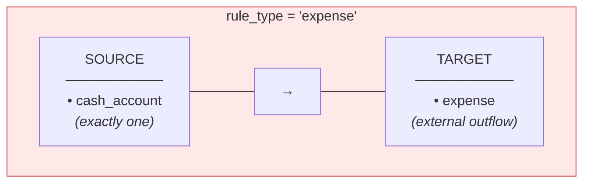

**Note:** Only cash accounts can pay expenses (not CPF or investments directly).

### Example: Childcare with Priority-Based Sources

**User Story:** Childcare is $1,500/month. Pay from savings first, then emergency fund.

```json
[
  {
    "name": "Childcare from Savings",
    "ruleType": "expense",
    "sourceCashAccountId": "savings-uuid",
    "targetExpenseId": "childcare-uuid",
    "amountType": "max_available",
    "priority": 0,
    "startDate": "2025-01-01",
    "endDate": "2031-12-31"
  },
  {
    "name": "Childcare from Emergency",
    "ruleType": "expense",
    "sourceCashAccountId": "emergency-uuid",
    "targetExpenseId": "childcare-uuid",
    "amountType": "remainder",
    "priority": 1,
    "startDate": "2025-01-01",
    "endDate": "2031-12-31"
  }
]
```

**Monthly Execution (when childcare = $1,500):**

| Month | Savings Balance | From Savings | From Emergency | Savings End |
|-------|-----------------|--------------|----------------|-------------|
| 1 | $10,000 | $1,500 | $0 | $8,500 |
| 6 | $1,200 | $1,200 | $300 | $0 |
| 7 | $0 | $0 | $1,500 | $0 |

### Validation Rules

```go
case "expense":
    if r.SourceCashAccountID == nil {
        return errors.New("expense rules require cash account source")
    }
    if r.SourceCpfAccountID != nil || r.SourceInvestmentID != nil {
        return errors.New("expense rules can only use cash as source")
    }
    if r.TargetExpenseID == nil {
        return errors.New("expense rules require expense target")
    }
```

### Key Differences from Payment Rules

| Aspect | Payment | Expense |
|--------|---------|---------|
| Target | Liability/Property (internal) | Expense (external) |
| Net Worth | Zero (debt reduction) | Decreases |
| Sources | CPF or Cash | Cash only |
| Purpose | Pay down tracked debt | Pay external costs |

---

## How Tax & CPF Deductions Work (Not Fund Flows)

Tax and mandatory CPF are **external flows**, not internal balance movements:

```
Gross Salary: $10,000
    │
    ├── CPF Employee (20%): $2,000 → CPF accounts (system-calculated by cpf/processor)
    ├── Income Tax (~8%): $800 → leaves system (implicit expense or future tax module)
    │
    └── Net Cash: $7,200 → available for fund_flow_rules (allocations)
         │
         └── fund_flow_rules (allocation type):
             ├── Investment (30%): $2,160 → brokerage
             └── Savings (remainder): $5,040 → cash
```

**Why not in fund_flow_rules?**
- CPF is statutory (rates set by law, not user choice) - handled by `cpf/processor`
- Tax is an outflow to external (government) - belongs in `finance_expenses` or future tax module
- Fund flows are strictly internal balance-to-balance movements

---

## API Design (All Phases)

### Endpoints

```
GET    /api/v2/fund-flow-rules                    List all rules for user
POST   /api/v2/fund-flow-rules                    Create new rule
GET    /api/v2/fund-flow-rules/:id                Get single rule
PUT    /api/v2/fund-flow-rules/:id                Update rule
DELETE /api/v2/fund-flow-rules/:id                Delete rule

GET    /api/v2/fund-flow-rules/by-type/:type      Rules filtered by type
GET    /api/v2/fund-flow-rules/by-income/:id      Rules for an income
GET    /api/v2/fund-flow-rules/by-liability/:id   Rules for a liability
GET    /api/v2/fund-flow-rules/by-property/:id    Rules for a property
GET    /api/v2/fund-flow-rules/by-account/:id     Rules affecting an account
```

### TypeScript Types

```typescript
type RuleType = 'payment' | 'allocation' | 'transfer';
type AmountType = 'fixed' | 'pct_target' | 'pct_source' | 'remainder' | 'target_required' | 'max_available';

interface FundFlowRule {
  id: string;
  name: string;
  ruleType: RuleType;

  // Source (one set based on ruleType)
  sourceIncomeId?: string;       // Required for 'allocation'
  sourceCpfAccountId?: string;   // For 'payment' or 'transfer'
  sourceCashAccountId?: string;  // For 'payment' or 'transfer'
  sourceInvestmentId?: string;   // For 'payment' or 'transfer'

  // Target (one set based on ruleType)
  targetCpfAccountId?: string;     // For 'allocation' or 'transfer'
  targetCashAccountId?: string;    // For 'allocation' or 'transfer'
  targetInvestmentId?: string;     // For 'allocation' or 'transfer'
  targetLiabilityId?: string;      // For 'payment'
  targetPropertyId?: string;       // For 'payment'

  amountType: AmountType;
  amountValue?: number;  // Required for 'fixed'/'pct_target'/'pct_source', optional cap for others

  // Priority for ordering multiple rules on same target (lower = higher priority)
  // Use multiple rules with different priorities instead of fallback columns
  priority: number;

  startDate: string;
  endDate?: string;
}

interface CreateFundFlowRuleInput extends Omit<FundFlowRule, 'id'> {}
```

---

## Execution Order in Timeline

### Monthly Processing Flow

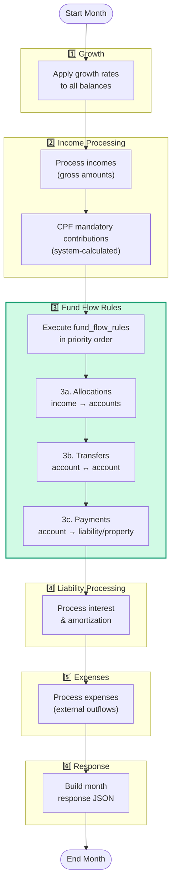

### Payment Rule Execution Sequence

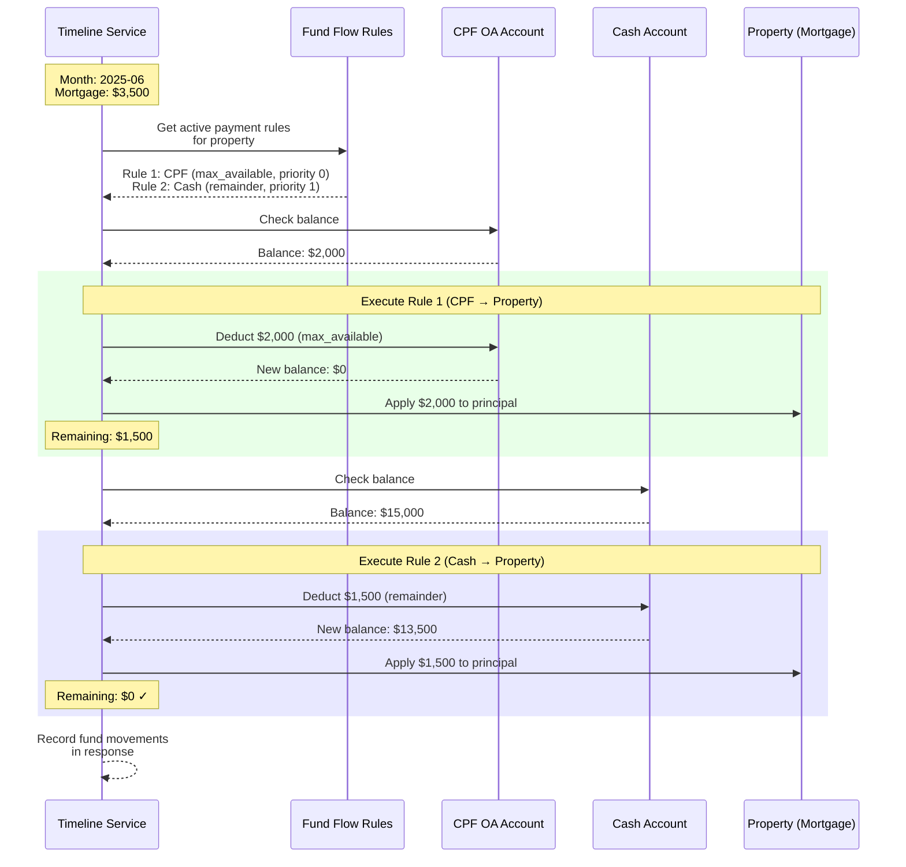

### Fallback Activation Flow

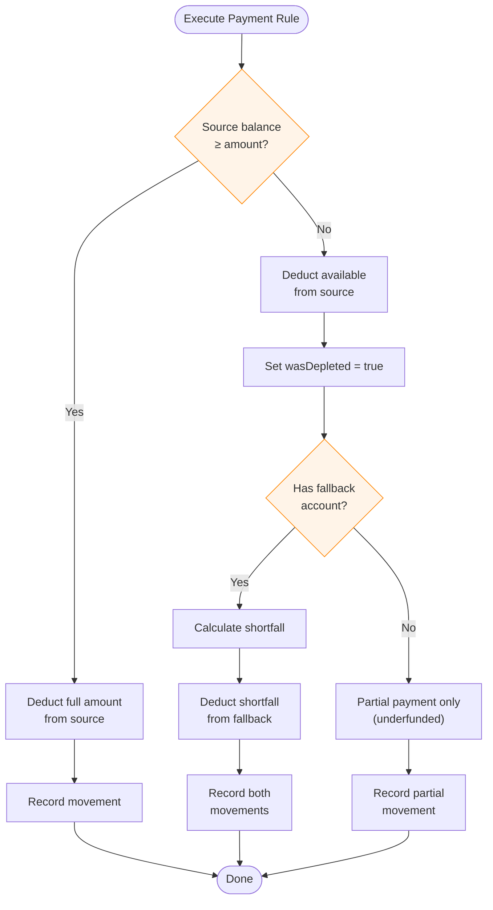

---

## Timeline Response Attribution

When rules execute, the response includes attribution:

```json
{
  "months": [{
    "date": "2025-06",
    "liabilities": [{
      "id": "mortgage-uuid",
      "name": "HDB Mortgage",
      "balance": 450000,
      "monthlyPayment": 2500,
      "paymentSources": [
        {
          "ruleId": "rule-uuid",
          "ruleName": "HDB Mortgage",
          "sourceType": "cpf",
          "sourceId": "cpf-uuid",
          "sourceName": "CPF OA",
          "amount": 2500,
          "usedFallback": false
        }
      ]
    }],
    "cashAccounts": [{
      "id": "savings-uuid",
      "balance": 50000,
      "flowsIn": [...],
      "flowsOut": [...]
    }]
  }]
}
```

---

## Comparison to Original Specs

| Aspect | payment-rules.md | unified-fund-flows.md | This Spec |
|--------|------------------|----------------------|-----------|
| Tables | 1 (payment_rules) | 1 (fund_flow_rules) | 1 (fund_flow_rules) |
| Initial scope | Payment only | Everything | Payment only |
| Extensibility | Poor | Excellent | Excellent |
| Blast radius Phase 1 | ~20 files | ~45 files | ~20 files |
| Replaces income_allocations | No | Yes (Phase 1) | Yes (Phase 2) |
| Schema changes per feature | New table likely | Add enum value | Add enum value |

---

## Risk Mitigation

### Phase 1 Rollback
- Drop `fund_flow_rules` table
- No other systems affected

### Phase 2 Rollback
- Keep `income_allocations` table until Phase 2d
- Feature flag to switch between old/new allocation loading
- Dual-write during transition

### Phase 3+ Rollback
- Each new rule_type is additive
- Can disable at application layer without schema changes

---

## Sample Scenarios with Data Rows & Queries

This section provides concrete examples of how `fund_flow_rules` handles real-world financial planning scenarios.

### Reference Data (Accounts)

```sql
-- Sample accounts for all scenarios below
-- CPF Accounts
INSERT INTO cpf_accounts (id, user_id, oa_balance, sa_balance, ma_balance, ra_balance) VALUES
  ('cpf-john-uuid', 'user-123', 150000, 80000, 45000, 0),
  ('cpf-jane-uuid', 'user-123', 120000, 65000, 40000, 0);

-- Cash Accounts
INSERT INTO finance_cash_accounts (id, user_id, name, balance) VALUES
  ('cash-savings-uuid', 'user-123', 'Joint Savings', 80000),
  ('cash-emergency-uuid', 'user-123', 'Emergency Fund', 30000),
  ('cash-retirement-uuid', 'user-123', 'Retirement Spending', 0);

-- Investments
INSERT INTO finance_investments (id, user_id, name, balance) VALUES
  ('inv-portfolio-uuid', 'user-123', 'Retirement Portfolio', 500000),
  ('inv-growth-uuid', 'user-123', 'Growth ETFs', 150000);

-- Properties
INSERT INTO property_sg (id, name, property_price) VALUES
  ('prop-hdb-uuid', 'HDB Flat', 550000),
  ('prop-condo-uuid', 'Investment Condo', 1200000);

-- Liabilities
INSERT INTO finance_liabilities (id, user_id, name, balance, monthly_payment) VALUES
  ('loan-car-uuid', 'user-123', 'Car Loan', 45000, 800),
  ('loan-reno-uuid', 'user-123', 'Renovation Loan', 30000, 500);

-- Incomes
INSERT INTO finance_incomes (id, user_id, name, amount) VALUES
  ('income-john-uuid', 'user-123', 'John Salary', 8000),
  ('income-jane-uuid', 'user-123', 'Jane Salary', 6500);
```

---

### Scenario 1: HDB Mortgage with Priority-Based Payment Sources

**User Story:** John and Jane's HDB mortgage is $2,800/month. They want to:
1. First use John's CPF OA (as much as available)
2. Then use Jane's CPF OA (as much as available)
3. Finally, cash covers any remainder

**Fund Flow Rules:**

```sql
INSERT INTO fund_flow_rules (id, user_id, name, rule_type, source_cpf_account_id, target_property_id, amount_type, amount_value, priority, start_date) VALUES
  ('rule-hdb-1', 'user-123', 'HDB from John CPF', 'payment', 'cpf-john-uuid', 'prop-hdb-uuid', 'max_available', NULL, 0, '2025-01-01'),
  ('rule-hdb-2', 'user-123', 'HDB from Jane CPF', 'payment', 'cpf-jane-uuid', 'prop-hdb-uuid', 'max_available', NULL, 1, '2025-01-01'),
  ('rule-hdb-3', 'user-123', 'HDB from Cash', 'payment', NULL, 'prop-hdb-uuid', 'remainder', NULL, 2, '2025-01-01');

-- Note: rule-hdb-3 uses source_cash_account_id instead (shown as NULL for brevity)
UPDATE fund_flow_rules SET source_cash_account_id = 'cash-savings-uuid' WHERE id = 'rule-hdb-3';
```

**Query: Get payment sources for HDB in priority order**

```sql
SELECT
    ffr.name,
    ffr.priority,
    ffr.amount_type,
    COALESCE(cpf.oa_balance, cash.balance) as source_balance,
    CASE
        WHEN ffr.source_cpf_account_id IS NOT NULL THEN 'CPF OA'
        WHEN ffr.source_cash_account_id IS NOT NULL THEN 'Cash'
    END as source_type
FROM fund_flow_rules ffr
LEFT JOIN cpf_accounts cpf ON ffr.source_cpf_account_id = cpf.id
LEFT JOIN finance_cash_accounts cash ON ffr.source_cash_account_id = cash.id
WHERE ffr.target_property_id = 'prop-hdb-uuid'
  AND ffr.rule_type = 'payment'
  AND ffr.start_date <= CURRENT_DATE
  AND (ffr.end_date IS NULL OR ffr.end_date >= CURRENT_DATE)
ORDER BY ffr.priority;
```

**Result:**

| name | priority | amount_type | source_balance | source_type |
|------|----------|-------------|----------------|-------------|
| HDB from John CPF | 0 | max_available | 150,000 | CPF OA |
| HDB from Jane CPF | 1 | max_available | 120,000 | CPF OA |
| HDB from Cash | 2 | remainder | 80,000 | Cash |

**Monthly Execution (when mortgage = $2,800):**

| Month | John CPF Contrib | Jane CPF Contrib | From John CPF | From Jane CPF | From Cash | John CPF End |
|-------|-----------------|------------------|---------------|---------------|-----------|--------------|
| 1 | +$1,600 | +$1,300 | $1,600 | $1,200 | $0 | 150,000 |
| 60 | +$1,600 | +$1,300 | $1,600 | $1,200 | $0 | 150,000 |
| ... | ... | ... | ... | ... | ... | ... |
| 120 | +$1,600 | +$1,300 | $1,600 | $1,200 | $0 | depleting... |
| 180 | +$1,600 | +$1,300 | $1,600 | $800 | $400 | 0 |

---

### Scenario 2: Investment Condo with Fixed Amounts

**User Story:** Investment condo mortgage is $4,500/month. They want to:
1. Pay exactly $2,000 from John's CPF OA
2. Pay exactly $2,500 from joint savings

**Fund Flow Rules:**

```sql
INSERT INTO fund_flow_rules (id, user_id, name, rule_type, source_cpf_account_id, source_cash_account_id, target_property_id, amount_type, amount_value, priority, start_date) VALUES
  ('rule-condo-1', 'user-123', 'Condo from John CPF', 'payment', 'cpf-john-uuid', NULL, 'prop-condo-uuid', 'fixed', 2000, 0, '2025-01-01'),
  ('rule-condo-2', 'user-123', 'Condo from Cash', 'payment', NULL, 'cash-savings-uuid', 'prop-condo-uuid', 'fixed', 2500, 1, '2025-01-01');
```

**Query: Calculate total configured payment for condo**

```sql
SELECT
    target_property_id,
    SUM(CASE WHEN amount_type = 'fixed' THEN amount_value ELSE 0 END) as total_fixed,
    COUNT(*) FILTER (WHERE amount_type = 'remainder') as has_remainder_rule
FROM fund_flow_rules
WHERE target_property_id = 'prop-condo-uuid'
  AND rule_type = 'payment'
GROUP BY target_property_id;
```

---

### Scenario 2b: Investment Condo with Percentage Split

**User Story:** Investment condo mortgage is $4,500/month. They want to:
1. Pay 60% of mortgage from John's CPF OA
2. Cash covers the remaining 40%

**Fund Flow Rules:**

```sql
INSERT INTO fund_flow_rules (id, user_id, name, rule_type, source_cpf_account_id, source_cash_account_id, target_property_id, amount_type, amount_value, priority, start_date) VALUES
  ('rule-condo-pct-1', 'user-123', 'Condo 60% from CPF', 'payment', 'cpf-john-uuid', NULL, 'prop-condo-uuid', 'pct_target', 60, 0, '2025-01-01'),
  ('rule-condo-pct-2', 'user-123', 'Condo remainder from Cash', 'payment', NULL, 'cash-savings-uuid', 'prop-condo-uuid', 'remainder', NULL, 1, '2025-01-01');
```

**Note:** `pct_target` means "60% of the target's required payment" ($4,500 × 60% = $2,700 from CPF).

---

### Scenario 3: Car Loan - Single Source

**User Story:** Car loan is $800/month, paid entirely from joint savings.

**Fund Flow Rules:**

```sql
INSERT INTO fund_flow_rules (id, user_id, name, rule_type, source_cash_account_id, target_liability_id, amount_type, amount_value, priority, start_date, end_date) VALUES
  ('rule-car-1', 'user-123', 'Car Loan Payment', 'payment', 'cash-savings-uuid', 'loan-car-uuid', 'target_required', NULL, 0, '2025-01-01', '2029-12-31');
```

**Note:** `amount_type = 'target_required'` means "pay whatever the liability requires" ($800/month).

---

### Scenario 4: Retirement Drawdown (Age 65+)

**User Story:** At retirement, John needs $5,000/month for living expenses. Priority:
1. CPF LIFE payout (fixed $2,000/month - government scheme)
2. Investment portfolio (fixed $2,500/month)
3. CPF RA as emergency backup (max_available)

**Fund Flow Rules:**

```sql
INSERT INTO fund_flow_rules (id, user_id, name, rule_type, source_cpf_account_id, source_investment_id, target_cash_account_id, amount_type, amount_value, priority, start_date) VALUES
  -- CPF LIFE is modeled as a special CPF account or income
  ('rule-retire-1', 'user-123', 'CPF LIFE Payout', 'transfer', 'cpf-john-uuid', NULL, 'cash-retirement-uuid', 'fixed', 2000, 0, '2055-01-01'),
  ('rule-retire-2', 'user-123', 'Investment Drawdown', 'transfer', NULL, 'inv-portfolio-uuid', 'cash-retirement-uuid', 'fixed', 2500, 1, '2055-01-01'),
  ('rule-retire-3', 'user-123', 'CPF RA Emergency', 'transfer', 'cpf-john-uuid', NULL, 'cash-retirement-uuid', 'max_available', 500, 2, '2055-01-01');

-- rule-retire-3: max_available with cap of $500 (only dip into RA if needed, up to $500)
```

**Query: Get retirement income sources**

```sql
SELECT
    ffr.name,
    ffr.priority,
    ffr.amount_type,
    ffr.amount_value,
    CASE
        WHEN ffr.source_cpf_account_id IS NOT NULL THEN 'CPF'
        WHEN ffr.source_investment_id IS NOT NULL THEN 'Investment'
    END as source_type,
    COALESCE(inv.balance, cpf.ra_balance) as source_balance
FROM fund_flow_rules ffr
LEFT JOIN finance_investments inv ON ffr.source_investment_id = inv.id
LEFT JOIN cpf_accounts cpf ON ffr.source_cpf_account_id = cpf.id
WHERE ffr.target_cash_account_id = 'cash-retirement-uuid'
  AND ffr.rule_type = 'transfer'
  AND ffr.start_date <= '2055-06-01'
ORDER BY ffr.priority;
```

**Result:**

| name | priority | amount_type | amount_value | source_type | source_balance |
|------|----------|-------------|--------------|-------------|----------------|
| CPF LIFE Payout | 0 | fixed | 2,000 | CPF | - |
| Investment Drawdown | 1 | fixed | 2,500 | Investment | 500,000 |
| CPF RA Emergency | 2 | max_available | 500 | CPF | 200,000 |

**Monthly Execution:**

| Month | CPF LIFE | From Investment | From CPF RA | Total to Spending |
|-------|----------|-----------------|-------------|-------------------|
| 2055-01 | $2,000 | $2,500 | $0 | $4,500 |
| 2055-02 | $2,000 | $2,500 | $0 | $4,500 |
| ... | ... | ... | ... | ... |
| 2072-06 | $2,000 | $0 (depleted) | $500 | $2,500 |
| 2072-07 | $2,000 | $0 | $500 | $2,500 |

---

### Scenario 5: Income Allocation (Salary Distribution)

**User Story:** John's $8,000 salary should be allocated:
1. 30% to Growth ETFs investment
2. 20% to Emergency Fund
3. Remainder to Joint Savings

**Fund Flow Rules:**

```sql
INSERT INTO fund_flow_rules (id, user_id, name, rule_type, source_income_id, target_investment_id, target_cash_account_id, amount_type, amount_value, priority, start_date) VALUES
  ('rule-alloc-1', 'user-123', 'Salary to Growth ETFs', 'allocation', 'income-john-uuid', 'inv-growth-uuid', NULL, 'pct_source', 30, 0, '2025-01-01'),
  ('rule-alloc-2', 'user-123', 'Salary to Emergency', 'allocation', 'income-john-uuid', NULL, 'cash-emergency-uuid', 'pct_source', 20, 1, '2025-01-01'),
  ('rule-alloc-3', 'user-123', 'Salary to Savings', 'allocation', 'income-john-uuid', NULL, 'cash-savings-uuid', 'remainder', NULL, 2, '2025-01-01');
```

**Query: Get allocation breakdown for an income**

```sql
SELECT
    ffr.name,
    ffr.priority,
    ffr.amount_type,
    ffr.amount_value,
    CASE
        WHEN ffr.target_investment_id IS NOT NULL THEN inv.name
        WHEN ffr.target_cash_account_id IS NOT NULL THEN cash.name
    END as target_name,
    -- Calculate actual amount for $8,000 salary (net after CPF)
    CASE
        WHEN ffr.amount_type = 'pct_source' THEN 6400 * (ffr.amount_value / 100)
        WHEN ffr.amount_type = 'pct_target' THEN NULL  -- requires target amount
        WHEN ffr.amount_type = 'fixed' THEN ffr.amount_value
        ELSE NULL  -- remainder calculated at runtime
    END as estimated_amount
FROM fund_flow_rules ffr
LEFT JOIN finance_investments inv ON ffr.target_investment_id = inv.id
LEFT JOIN finance_cash_accounts cash ON ffr.target_cash_account_id = cash.id
WHERE ffr.source_income_id = 'income-john-uuid'
  AND ffr.rule_type = 'allocation'
ORDER BY ffr.priority;
```

**Result (assuming $6,400 net after CPF):**

| name | priority | amount_type | amount_value | target_name | estimated_amount |
|------|----------|-------------|--------------|-------------|------------------|
| Salary to Growth ETFs | 0 | pct_source | 30 | Growth ETFs | $1,920 |
| Salary to Emergency | 1 | pct_source | 20 | Emergency Fund | $1,280 |
| Salary to Savings | 2 | remainder | - | Joint Savings | $3,200 |

---

### Scenario 6: Voluntary CPF SA Top-Up

**User Story:** John wants to top up CPF SA by $7,000/year (tax relief) from savings.

**Fund Flow Rules:**

```sql
INSERT INTO fund_flow_rules (id, user_id, name, rule_type, source_cash_account_id, target_cpf_account_id, amount_type, amount_value, priority, start_date, end_date) VALUES
  ('rule-topup-1', 'user-123', 'Annual SA Top-Up', 'transfer', 'cash-savings-uuid', 'cpf-john-uuid', 'fixed', 583.33, 0, '2025-01-01', '2054-12-31');
  -- $7,000 / 12 months = $583.33/month
```

---

### Query: Complete Financial Flow Overview

**Get all active rules for a user, organized by target:**

```sql
WITH rule_summary AS (
    SELECT
        ffr.id,
        ffr.name,
        ffr.rule_type,
        ffr.amount_type,
        ffr.amount_value,
        ffr.priority,
        -- Source
        COALESCE(
            'Income: ' || inc.name,
            'CPF: ' || 'OA',
            'Cash: ' || src_cash.name,
            'Investment: ' || src_inv.name
        ) as source,
        -- Target
        COALESCE(
            'Property: ' || prop.name,
            'Liability: ' || liab.name,
            'CPF: ' || 'Account',
            'Cash: ' || tgt_cash.name,
            'Investment: ' || tgt_inv.name
        ) as target
    FROM fund_flow_rules ffr
    LEFT JOIN finance_incomes inc ON ffr.source_income_id = inc.id
    LEFT JOIN cpf_accounts src_cpf ON ffr.source_cpf_account_id = src_cpf.id
    LEFT JOIN finance_cash_accounts src_cash ON ffr.source_cash_account_id = src_cash.id
    LEFT JOIN finance_investments src_inv ON ffr.source_investment_id = src_inv.id
    LEFT JOIN property_sg prop ON ffr.target_property_id = prop.id
    LEFT JOIN finance_liabilities liab ON ffr.target_liability_id = liab.id
    LEFT JOIN cpf_accounts tgt_cpf ON ffr.target_cpf_account_id = tgt_cpf.id
    LEFT JOIN finance_cash_accounts tgt_cash ON ffr.target_cash_account_id = tgt_cash.id
    LEFT JOIN finance_investments tgt_inv ON ffr.target_investment_id = tgt_inv.id
    WHERE ffr.user_id = 'user-123'
      AND ffr.start_date <= CURRENT_DATE
      AND (ffr.end_date IS NULL OR ffr.end_date >= CURRENT_DATE)
)
SELECT * FROM rule_summary
ORDER BY rule_type, target, priority;
```

---

### Design Decision: Priority-Based Rules (No `fallback_*` Columns)

**Status: ✅ Implemented** - The schema uses priority-based multiple rules instead of `fallback_*` columns.

**Rationale:** Priority-based rules handle all use cases more flexibly:

| Scenario | With `fallback_*` | With Priority (Current) |
|----------|-------------------|-------------------------|
| CPF → Cash for mortgage | 1 rule with fallback | 2 rules (priority 0, 1) |
| CPF OA → SA → RA → Cash | Not possible (only 1 fallback) | 4 rules (priority 0, 1, 2, 3) |
| Change order mid-stream | Delete & recreate rule | Update priority values |

**Benefits:**
- Unlimited payment source chain (not limited to 1 fallback)
- Easier reordering via priority updates
- Simpler schema with fewer nullable columns
- More intuitive UI (drag-and-drop list of sources)

---

## Success Metrics

| Phase | Success Criteria |
|-------|-----------------|
| 1 | Users can configure CPF → mortgage with `max_available` + cash fallback |
| 2 | All `income_allocations` migrated, old table dropped |
| 3 | Users can model CPF voluntary top-ups, investment drawdowns |
| 4 | Users can configure priority-based source accounts for expenses (childcare, utilities) |

---

## Next Steps

1. **Review this spec** - any use cases missing?
2. **Implement Phase 1** - payment rules with the full schema (future-proofed)
3. **Validate with users** - does payment sequencing solve their problems?
4. **Plan Phase 2** - based on user feedback on allocation needs
