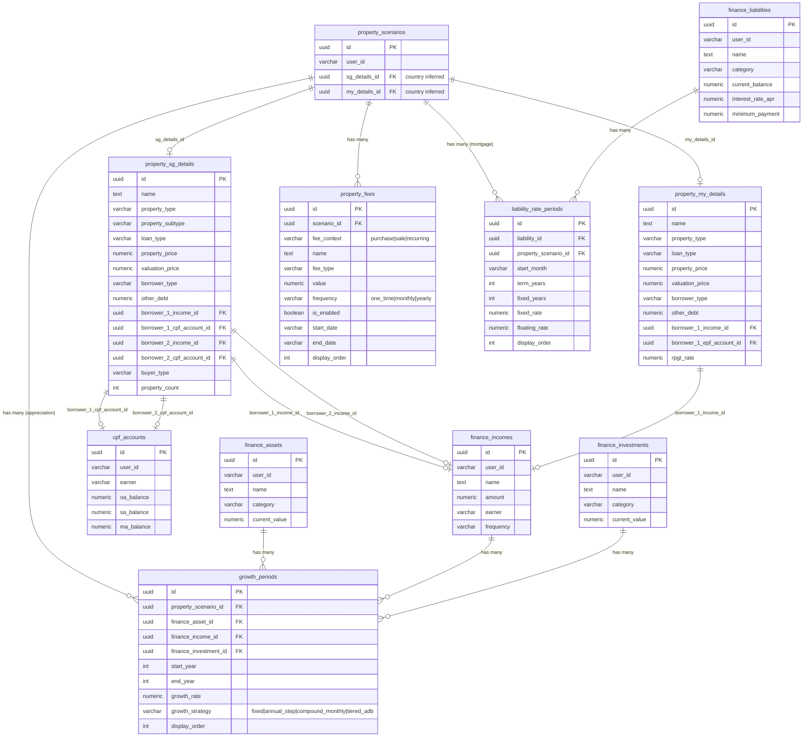
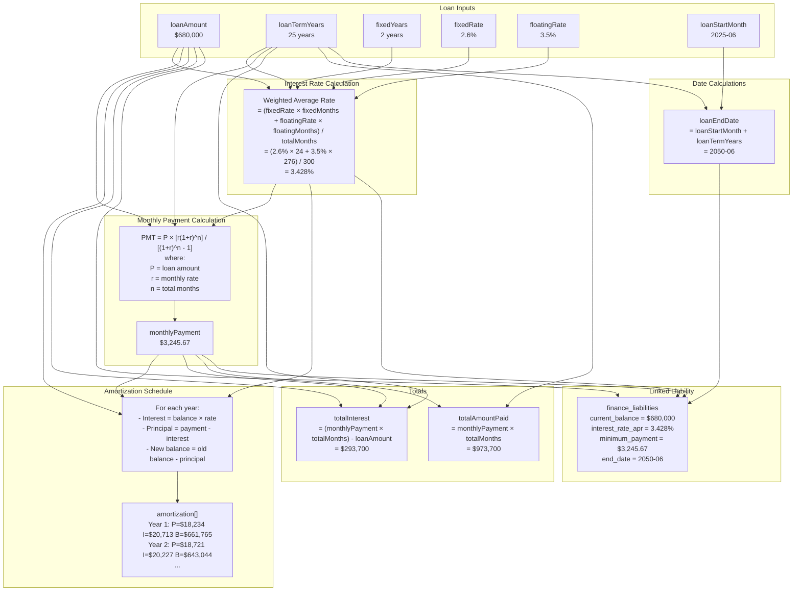
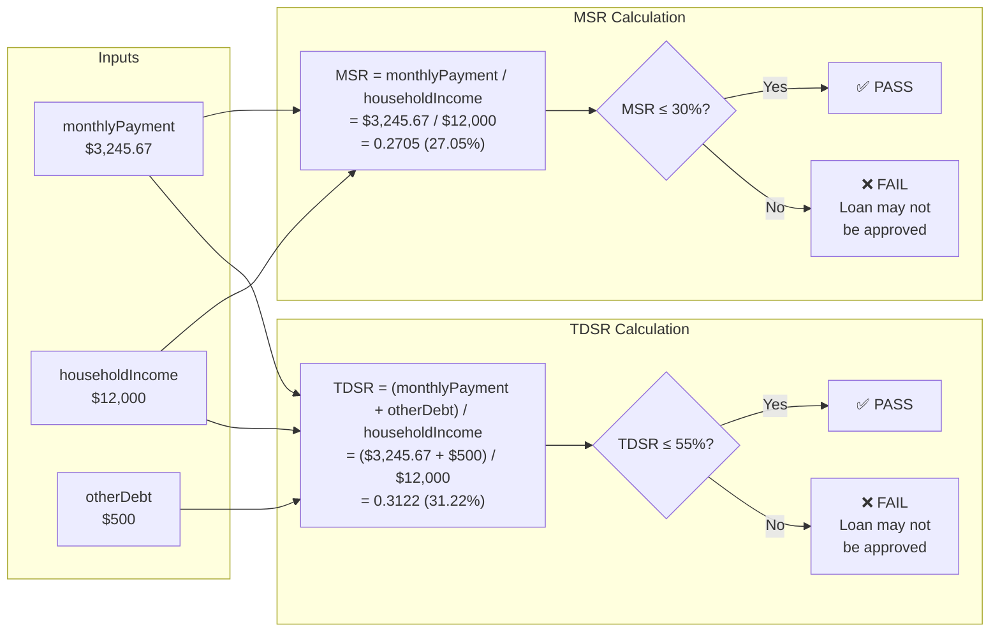
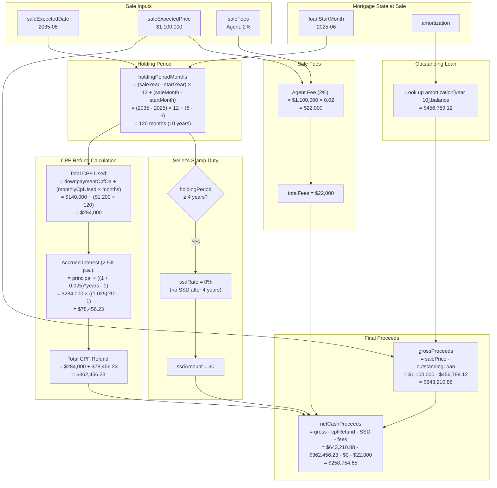
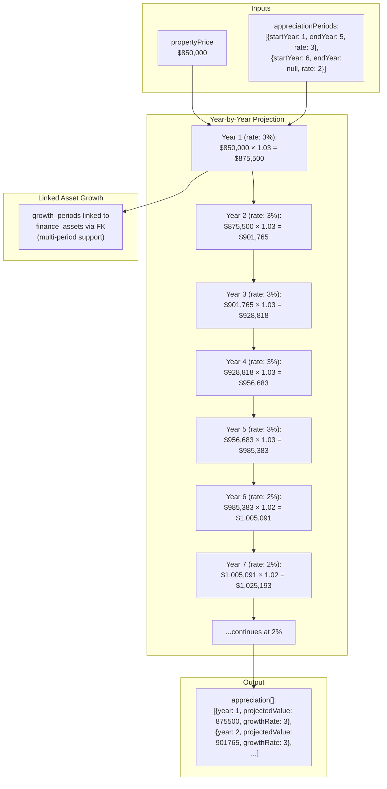
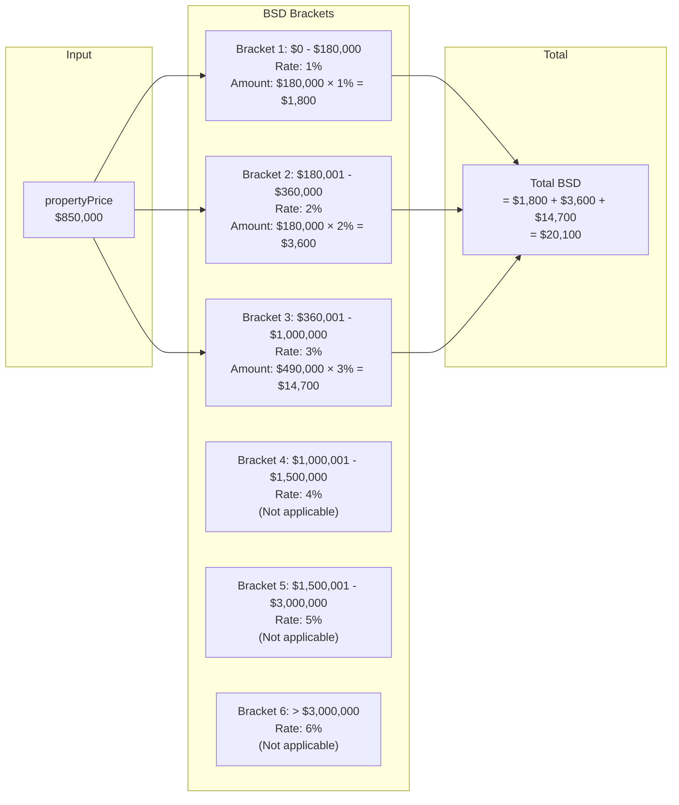
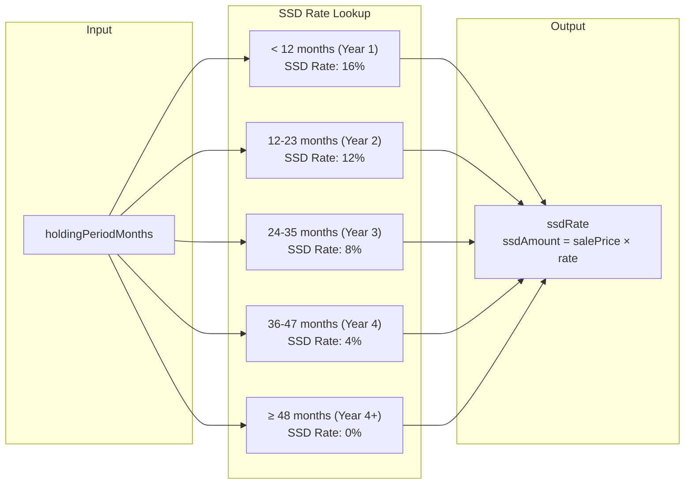

# Property Planner V2 Persistence PRD

## Overview

This document specifies the persistence layer for Property Planner V2, replacing the legacy property planner implementation. The system stores user inputs AND runs all computations on the backend, supports multiple scenarios per user, and automatically creates linked assets/liabilities for timeline integration.

---

## Goals

1. **Persist Property Planner V2 scenarios** with all input fields required for mortgage and sale calculations
2. **Run all computations on the backend** (amortization, MSR/TDSR, BSD, sale proceeds, etc.)
3. **Auto-create linked asset + liability** when saving a scenario for seamless timeline integration
4. **Deprecate and remove legacy tables** (`property_scenarios`, `property_links`)
5. **Support multiple scenarios** per user for comparison planning
6. **Multi-country extensibility** via join table pattern for country-specific property details

---

## Database Schema

### Prerequisite: Add `earner` Column to `finance_incomes`

The user can add income for multiple household members (self, spouse). To identify who earns each income:

```sql
-- Migration: Add earner column to finance_incomes
ALTER TABLE finance_incomes
    ADD COLUMN earner VARCHAR(20) DEFAULT 'self';

-- Constraint to ensure valid values
ALTER TABLE finance_incomes
    ADD CONSTRAINT finance_incomes_earner_check
    CHECK (earner IN ('self', 'spouse', 'other'));

COMMENT ON COLUMN finance_incomes.earner IS
    'Identifies who earns this income: self (primary user), spouse, or other household member';
```

| Migration File | Purpose |
|----------------|---------|
| `backend/migrations/20251227000_add_earner_to_incomes.up.sql` | Adds `earner` column |
| `backend/migrations/20251227000_add_earner_to_incomes.down.sql` | Removes `earner` column |

---

### Table: `property_scenarios` (Header Table)

The main scenarios table is a thin header that stores the user and FK to the country-specific details. All property data lives in the country-specific table. The country is **inferred** from which FK is non-null (no redundant `country` column).

```sql
CREATE TABLE property_scenarios (
    id UUID PRIMARY KEY DEFAULT gen_random_uuid(),
    user_id VARCHAR(36) NOT NULL,

    -- FKs to country-specific details (exactly one must be non-null)
    -- The country is INFERRED from which FK is set
    sg_details_id UUID REFERENCES property_sg_details(id) ON DELETE CASCADE,
    my_details_id UUID REFERENCES property_my_details(id) ON DELETE CASCADE,
    -- us_details_id UUID REFERENCES property_us_details(id) ON DELETE CASCADE,  -- Future

    created_at TIMESTAMPTZ NOT NULL DEFAULT NOW(),
    updated_at TIMESTAMPTZ NOT NULL DEFAULT NOW(),

    -- Ensure exactly one country detail is linked
    CONSTRAINT chk_one_country_detail CHECK (
        (sg_details_id IS NOT NULL AND my_details_id IS NULL)
        OR (my_details_id IS NOT NULL AND sg_details_id IS NULL)
        -- Future: extend with us_details_id, etc.
    )
);

CREATE INDEX idx_property_scenarios_user ON property_scenarios(user_id);
```

**Why no `country` column?**
- The country is **inferred** from which FK is non-null (`sg_details_id` → SG, `my_details_id` → MY)
- No redundant data = no sync issues
- Adding a new country = add new FK column + new details table + extend CHECK constraint

---

### Prerequisite: Add `earner` Column to `cpf_accounts`

Similar to `finance_incomes`, we need to track which household member owns each CPF account:

```sql
-- Migration: Add earner column to cpf_accounts
ALTER TABLE cpf_accounts
    ADD COLUMN earner VARCHAR(20) DEFAULT 'self';

ALTER TABLE cpf_accounts
    ADD CONSTRAINT cpf_accounts_earner_check
    CHECK (earner IN ('self', 'spouse', 'other'));

COMMENT ON COLUMN cpf_accounts.earner IS
    'Identifies whose CPF account this is: self (primary user), spouse, or other household member';
```

| Migration File | Purpose |
|----------------|---------|
| `backend/migrations/20251227000_add_earner_to_incomes.up.sql` | Adds `earner` to `finance_incomes` AND `cpf_accounts` |
| `backend/migrations/20251227000_add_earner_to_incomes.down.sql` | Removes `earner` from both tables |

---

### Table: `property_sg_details` (Singapore - All Property Data)

Contains ALL property data for Singapore scenarios.

```sql
CREATE TABLE property_sg_details (
    id UUID PRIMARY KEY DEFAULT gen_random_uuid(),

    -- Metadata
    name TEXT NOT NULL,
    icon VARCHAR(50),
    icon_color VARCHAR(20),
    is_included BOOLEAN NOT NULL DEFAULT true,

    -- Property type (SG-specific categories)
    -- Main: 'hdb' | 'condo' | 'landed'
    -- Subtypes: HDB has 'bto'/'resale', Condo has 'new-launch'/'resale', Landed has no subtypes
    property_type VARCHAR(50) NOT NULL,       -- 'hdb' | 'condo' | 'landed'
    property_subtype VARCHAR(50),             -- 'bto' | 'resale' | 'new-launch' (NULL for landed)

    -- Core property inputs
    property_price NUMERIC(15,4) NOT NULL,
    valuation_price NUMERIC(15,4) NOT NULL,
    loan_type VARCHAR(20) NOT NULL,           -- 'bank' | 'hdb'
    -- Note: loan_amount is stored in linked finance_liabilities record

    -- Downpayment breakdown (SG uses CPF OA for property)
    downpayment_cpf_oa NUMERIC(15,4) NOT NULL DEFAULT 0,
    downpayment_cash NUMERIC(15,4) NOT NULL DEFAULT 0,

    -- Borrower info
    borrower_type VARCHAR(20) NOT NULL DEFAULT 'single',  -- 'single' | 'joint'
    other_debt NUMERIC(15,4) NOT NULL DEFAULT 0,          -- Monthly debt obligations for TDSR
    grants NUMERIC(15,4) NOT NULL DEFAULT 0,

    -- Buyer details (for ABSD calculation)
    buyer_type VARCHAR(30) NOT NULL DEFAULT 'singapore_citizen',  -- 'singapore_citizen' | 'permanent_resident' | 'foreigner'
    property_count INT NOT NULL DEFAULT 0,                        -- Number of existing properties (0 = first property)

    -- Borrower 1 (FK to finance_incomes and cpf_accounts)
    borrower_1_income_id UUID REFERENCES finance_incomes(id) ON DELETE SET NULL,
    borrower_1_cpf_account_id UUID REFERENCES cpf_accounts(id) ON DELETE SET NULL,

    -- Borrower 2 (for joint applications)
    borrower_2_income_id UUID REFERENCES finance_incomes(id) ON DELETE SET NULL,
    borrower_2_cpf_account_id UUID REFERENCES cpf_accounts(id) ON DELETE SET NULL,

    -- Stamp duties (SG-specific)
    -- Note: BSD (Buyer's Stamp Duty) is NOT stored - computed in backend using standard IRAS tiered rates
    -- Note: ABSD is COMPUTED from buyer_type + property_count, not stored

    -- Sale planning inputs
    sale_expected_date VARCHAR(7),            -- 'YYYY-MM'
    sale_expected_price NUMERIC(15,4),

    created_at TIMESTAMPTZ NOT NULL DEFAULT NOW()
);

CREATE INDEX idx_property_sg_details_type ON property_sg_details(property_type);
```

**Notes:**
- **`borrower_type`**: `'single'` = one buyer, `'joint'` = two buyers (e.g., married couple). Affects MSR/TDSR since joint applications combine incomes.
- **No rates here**: Interest rates are stored in `liability_rate_periods` (linked via `property_scenario_id`) since they can change with refinancing.
- **Income via FK**: `borrower_1_income_id` and `borrower_2_income_id` link to `finance_incomes` records (with `earner` column). Backend sums them for household income.
- **CPF via FK**: `borrower_1_cpf_account_id` and `borrower_2_cpf_account_id` link to `cpf_accounts` records (with `earner` column). Backend reads `oa_balance` from the linked account.
- **No `linked_asset_id`**: Property is a separate asset type (like `finance_investments`). Use UNION query for "all assets".

**Why a Separate Table?**
- **Extensibility**: Adding Malaysia (`property_my_details`) = new table + new FK in header, no schema changes to SG table.
- **No NULLable country columns**: Every SG field is either filled or the row doesn't exist.
- **Clean queries**: `property_scenarios JOIN property_sg_details` for SG scenarios.
- **Child tables link to header**: `property_fees`, `growth_periods`, and `liability_rate_periods` all link to `property_scenarios` (header), so they work for any country without modification.

**BSD Rates (Backend Constant - IRAS 2024):**

BSD is computed using standard tiered rates - not stored in database:

```go
// backend/internal/financial_v2/calculator/stamp_duty.go
// Uses internal/decimal package (wraps github.com/cockroachdb/apd/v3)
var BSDTiers = []struct {
    UpTo   *decimal.Decimal
    Rate   *decimal.Decimal
}{
    {decimal.MustFromString("180000"), decimal.MustFromString("0.01")},   // 1% on first $180K
    {decimal.MustFromString("360000"), decimal.MustFromString("0.02")},   // 2% on next $180K
    {decimal.MustFromString("1000000"), decimal.MustFromString("0.03")},  // 3% on next $640K
    {decimal.MustFromString("1500000"), decimal.MustFromString("0.04")},  // 4% on next $500K
    {decimal.MustFromString("3000000"), decimal.MustFromString("0.05")},  // 5% on next $1.5M
    {nil, decimal.MustFromString("0.06")},                                // 6% on remainder (nil = no upper limit)
}

func CalculateBSD(propertyPrice *decimal.Decimal) *decimal.Decimal {
    // Progressive calculation through tiers
}
```

---

### Table: `property_my_details` (Malaysia - Example)

Example country-specific table for Malaysia. Shows how to add a new country without modifying existing tables.

```sql
CREATE TABLE property_my_details (
    id UUID PRIMARY KEY DEFAULT gen_random_uuid(),

    -- Metadata
    name TEXT NOT NULL,
    icon VARCHAR(50),
    icon_color VARCHAR(20),
    is_included BOOLEAN NOT NULL DEFAULT true,

    -- Property type (MY-specific categories)
    property_type VARCHAR(50) NOT NULL,       -- 'landed' | 'condo' | 'apartment' | 'terrace'

    -- Core property inputs
    property_price NUMERIC(15,4) NOT NULL,
    valuation_price NUMERIC(15,4) NOT NULL,
    loan_type VARCHAR(20) NOT NULL,           -- 'conventional' | 'islamic'

    -- Downpayment breakdown (MY uses EPF for property)
    downpayment_epf NUMERIC(15,4) NOT NULL DEFAULT 0,
    downpayment_cash NUMERIC(15,4) NOT NULL DEFAULT 0,

    -- Borrower info
    borrower_type VARCHAR(20) NOT NULL DEFAULT 'single',
    other_debt NUMERIC(15,4) NOT NULL DEFAULT 0,

    -- Borrower 1 (FK to finance_incomes and epf_accounts)
    borrower_1_income_id UUID REFERENCES finance_incomes(id) ON DELETE SET NULL,
    -- borrower_1_epf_account_id UUID REFERENCES epf_accounts(id) ON DELETE SET NULL,  -- Future

    -- Borrower 2 (for joint applications)
    borrower_2_income_id UUID REFERENCES finance_incomes(id) ON DELETE SET NULL,

    -- MY-specific taxes
    rpgt_rate NUMERIC(10,4) NOT NULL DEFAULT 0,  -- Real Property Gains Tax rate

    -- Sale planning inputs
    sale_expected_date VARCHAR(7),
    sale_expected_price NUMERIC(15,4),

    created_at TIMESTAMPTZ NOT NULL DEFAULT NOW()
);

CREATE INDEX idx_property_my_details_type ON property_my_details(property_type);
```

**Key Differences from SG:**
- **EPF instead of CPF**: Malaysia uses EPF (Employees Provident Fund) for property withdrawals
- **RPGT instead of ABSD**: Malaysia has Real Property Gains Tax, not Additional Buyer's Stamp Duty
- **Different property types**: Landed houses are common in MY, while HDB is SG-specific
- **Islamic financing**: MY has both conventional and Islamic (Shariah-compliant) loans

---

### Table: `property_fees` (Purchase, Sale & Recurring Costs)

Stores all property-related costs: one-time transaction fees and recurring expenses.

```sql
CREATE TABLE property_fees (
    id UUID PRIMARY KEY DEFAULT gen_random_uuid(),
    scenario_id UUID NOT NULL REFERENCES property_scenarios(id) ON DELETE CASCADE,

    fee_context VARCHAR(20) NOT NULL,         -- 'purchase' | 'sale' | 'recurring'
    name TEXT NOT NULL,                       -- 'Legal Fees', 'Property Tax', 'Maintenance', etc.
    fee_type VARCHAR(20) NOT NULL,            -- 'percentage' | 'fixed'
    value NUMERIC(15,4) NOT NULL,             -- 1.5 (for 1.5%) or 3000 (fixed amount)
    frequency VARCHAR(20) NOT NULL DEFAULT 'one_time',  -- 'one_time' | 'monthly' | 'yearly'
    is_enabled BOOLEAN NOT NULL DEFAULT true,
    start_date VARCHAR(7),                    -- 'YYYY-MM' when fee starts
    end_date VARCHAR(7),                      -- 'YYYY-MM' when fee ends (NULL = ongoing until sale)
    display_order INT NOT NULL DEFAULT 0,
    icon VARCHAR(50),
    icon_color VARCHAR(20),

    created_at TIMESTAMPTZ NOT NULL DEFAULT NOW()
);

CREATE INDEX idx_property_fees_scenario ON property_fees(scenario_id);
CREATE INDEX idx_property_fees_context ON property_fees(scenario_id, fee_context);
```

---

### Table: `growth_periods` (Generic Multi-Period Growth Rates)

A shared table for multi-period growth rates, usable by properties, assets, and incomes. Each row links to exactly one entity via nullable FKs. This table **replaces** `growth_rate` and `growth_strategy` columns on entity tables, allowing multi-period growth with different strategies per period.

```sql
CREATE TABLE growth_periods (
    id UUID PRIMARY KEY DEFAULT gen_random_uuid(),

    -- Multiple FKs (exactly one must be non-null)
    property_scenario_id UUID REFERENCES property_scenarios(id) ON DELETE CASCADE,
    finance_asset_id UUID REFERENCES finance_assets(id) ON DELETE CASCADE,
    finance_income_id UUID REFERENCES finance_incomes(id) ON DELETE CASCADE,
    finance_investment_id UUID REFERENCES finance_investments(id) ON DELETE CASCADE,

    start_year INT NOT NULL,                  -- 1-based year (1 = first year)
    end_year INT,                             -- NULL means "onwards" (no end)
    growth_rate NUMERIC(10,4) NOT NULL,       -- Rate value (e.g., 3.0 for 3%)
    growth_strategy VARCHAR(20) NOT NULL DEFAULT 'annual_step',  -- Uses existing growth module strategies
    display_order INT NOT NULL DEFAULT 0,

    created_at TIMESTAMPTZ NOT NULL DEFAULT NOW(),

    -- Exactly one FK must be set
    CONSTRAINT chk_single_entity CHECK (
        (property_scenario_id IS NOT NULL)::int +
        (finance_asset_id IS NOT NULL)::int +
        (finance_income_id IS NOT NULL)::int +
        (finance_investment_id IS NOT NULL)::int = 1
    ),
    CONSTRAINT chk_year_range CHECK (end_year IS NULL OR end_year >= start_year)
);

CREATE INDEX idx_growth_periods_property ON growth_periods(property_scenario_id) WHERE property_scenario_id IS NOT NULL;
CREATE INDEX idx_growth_periods_asset ON growth_periods(finance_asset_id) WHERE finance_asset_id IS NOT NULL;
CREATE INDEX idx_growth_periods_income ON growth_periods(finance_income_id) WHERE finance_income_id IS NOT NULL;
CREATE INDEX idx_growth_periods_investment ON growth_periods(finance_investment_id) WHERE finance_investment_id IS NOT NULL;
```

**Growth Strategies (from existing growth module):**
- `'fixed'`: No growth - value stays constant
- `'annual_step'`: Rate applied once per year at year start (e.g., 3% salary increase)
- `'compound_monthly'`: Rate compounded monthly (e.g., 5% annual rate compounded monthly for investments)
- `'tiered_adb'`: Tiered interest based on balance (for bank accounts with tiered rates)

**Usage Examples:**
- **Property appreciation**: `property_scenario_id` set, others NULL (works for any country)
- **Asset growth**: `finance_asset_id` set, others NULL
- **Salary growth**: `finance_income_id` set, others NULL
- **Investment growth**: `finance_investment_id` set, others NULL

**Migration Note:** This table replaces `growth_rate` and `growth_strategy` columns on `finance_assets`, `finance_incomes`, and `finance_investments`. Entities should use `growth_periods` for all growth configuration. Remove deprecated columns from entity tables after migration.

---

### Table: `liability_rate_periods` (Generic Rate Periods for Liabilities)

A generic table for multi-period interest rates on any liability (mortgages, car loans, etc.). Each row represents a rate period. Links to either a generic liability OR a property (exactly one).

```sql
CREATE TABLE liability_rate_periods (
    id UUID PRIMARY KEY DEFAULT gen_random_uuid(),

    -- Multiple FKs (exactly one must be non-null)
    liability_id UUID REFERENCES finance_liabilities(id) ON DELETE CASCADE,
    property_scenario_id UUID REFERENCES property_scenarios(id) ON DELETE CASCADE,

    start_month VARCHAR(7) NOT NULL,          -- 'YYYY-MM' when this period begins
    term_years INT NOT NULL,                  -- Loan term for this period
    fixed_years INT NOT NULL DEFAULT 0,       -- Years at fixed rate before switching to floating
    fixed_rate NUMERIC(10,4) NOT NULL,        -- Interest rate during fixed period
    floating_rate NUMERIC(10,4) NOT NULL,     -- Interest rate after fixed period ends
    display_order INT NOT NULL DEFAULT 0,     -- 0 = initial, 1+ = refinancing

    created_at TIMESTAMPTZ NOT NULL DEFAULT NOW(),

    -- Exactly one FK must be set
    CONSTRAINT chk_single_liability_source CHECK (
        (liability_id IS NOT NULL)::int +
        (property_scenario_id IS NOT NULL)::int = 1
    )
);

CREATE INDEX idx_liability_rate_periods_liability ON liability_rate_periods(liability_id) WHERE liability_id IS NOT NULL;
CREATE INDEX idx_liability_rate_periods_property ON liability_rate_periods(property_scenario_id) WHERE property_scenario_id IS NOT NULL;
CREATE INDEX idx_liability_rate_periods_order ON liability_rate_periods(COALESCE(liability_id, property_scenario_id), display_order);
```

**Notes:**
- **First period (`display_order = 0`)**: The initial loan terms
- **Subsequent periods**: Refinancing events (e.g., switching banks for better rates)
- **Generic**: Works for any liability - mortgages, car loans, personal loans, etc.
- **Property mortgages**: Link via `property_scenario_id` (works for any country, no separate `finance_liabilities` record needed)

**Usage Examples:**
- **Property mortgage**: `property_scenario_id` set, 2-year fixed at 3.5%, then floating at 4.0%
- **Car loan**: `liability_id` set, 5-year fixed at 2.5%
- **Refinancing**: Add new period when switching lenders

---

### Entity Relationship Diagram



---

### Migration Files

| File | Purpose |
|------|---------|
| `backend/migrations/20251227000_add_earner_to_incomes.up.sql` | Adds `earner` column to `finance_incomes` |
| `backend/migrations/20251227000_add_earner_to_incomes.down.sql` | Removes `earner` column |
| `backend/migrations/20251227001_create_property_tables.up.sql` | Creates all property tables |
| `backend/migrations/20251227001_create_property_tables.down.sql` | Drops all tables (for rollback) |
| `backend/migrations/20251227002_drop_legacy_property_tables.up.sql` | Drops `property_links` and old `property_scenarios` tables |
| `backend/migrations/20251227002_drop_legacy_property_tables.down.sql` | Recreates legacy tables (for rollback safety) |

---

### Multi-Country Extensibility

To add support for a new country (e.g., Malaysia):

1. **Create country-specific details table:**
   ```sql
   CREATE TABLE property_my_details (
       id UUID PRIMARY KEY DEFAULT gen_random_uuid(),
       scenario_id UUID NOT NULL UNIQUE REFERENCES property_scenarios(id) ON DELETE CASCADE,

       -- Malaysia-specific fields
       property_type VARCHAR(50) NOT NULL,   -- 'landed' | 'condo' | 'apartment'
       loan_type VARCHAR(20) NOT NULL,       -- 'conventional' | 'islamic'
       epf_withdrawal NUMERIC(15,4) DEFAULT 0,
       real_property_gains_tax_rate NUMERIC(10,4) DEFAULT 0,

       created_at TIMESTAMPTZ NOT NULL DEFAULT NOW()
   );
   ```

2. **Backend handler checks which FK is non-null and joins appropriate details table**
3. **Frontend conditionally renders country-specific form fields**

---

## Current State (Legacy)

### Tables to Remove

| Table | Location | Issues |
|-------|----------|--------|
| `property_scenarios` | `migrations/20241121004_normalize_property_scenarios.up.sql` | Limited fields, missing V2 inputs (appreciation, loan segments, fees, sale inputs, BTO staggered downpayment) |
| `property_links` | `migrations/20241121006_property_links.up.sql` | Bridge table no longer needed - V2 stores FK references directly |

### Files to Delete

**Backend:**
- `backend/cmd/server/handlers/property_scenarios.go`
- `backend/cmd/server/handlers/property_links.go`
- `backend/cmd/server/handlers/property_links_test.go`

**Frontend:**
- `frontend/src/components/modals/PropertyPlannerModal/` (entire directory)
- `frontend/src/api/financial/property.ts`
- `frontend/src/types/property.ts`

**Routes to remove from `backend/cmd/server/routes/v1.go`:**
- `/api/v1/property-planner/scenarios/*`
- `/api/v1/property-links`

---

## V2 Data Model

### Source Types (Frontend)

Updated types reflecting the new schema with country extensibility and income linking:

```typescript
// === Shared Types ===
type Country = 'SG' | 'MY' | 'US'  // Extensible ISO 3166-1 alpha-2 codes
type BorrowerType = 'single' | 'joint'
type Earner = 'self' | 'spouse' | 'other'

// === Singapore-Specific Types ===
type SGPropertyType = 'hdb' | 'condo' | 'landed'
type SGPropertySubtype = 'bto' | 'resale' | 'new-launch'  // NULL for landed
type SGLoanType = 'bank' | 'hdb'

// === Malaysia-Specific Types ===
type MYPropertyType = 'landed' | 'condo' | 'apartment' | 'terrace'
type MYLoanType = 'conventional' | 'islamic'

// === Common Types ===
type FeeContext = 'purchase' | 'sale' | 'recurring'
type FeeFrequency = 'one_time' | 'monthly' | 'yearly'
type GrowthStrategy = 'fixed' | 'annual_step' | 'compound_monthly' | 'tiered_adb'

interface FeeItem {
  id: string
  context: FeeContext            // 'purchase' | 'sale' | 'recurring'
  name: string
  type: 'percentage' | 'fixed'
  value: number
  frequency: FeeFrequency        // 'one_time' | 'monthly' | 'yearly'
  enabled: boolean
  startDate?: string             // 'YYYY-MM' when fee starts
  endDate?: string               // 'YYYY-MM' when fee ends (NULL = ongoing until sale)
  icon?: string
  iconColor?: string
}

interface GrowthPeriod {
  id: string
  startYear: number
  endYear: number | null  // null = "onwards"
  growthRate: number            // Rate value (e.g., 3.0 for 3%)
  growthStrategy: GrowthStrategy // 'annual' | 'monthly' | 'one_time'
}

interface LoanSegment {
  id: string
  startMonth: string      // YYYY-MM
  termYears: number
  fixedYears: number
  fixedRate: number
  floatingRate: number
}

interface StaggeredDownpayment {
  enabled: boolean
  firstInstalmentPercent: number   // 2.5% or 5%
  firstInstalmentMonth: string     // YYYY-MM
  secondInstalmentMonth: string    // YYYY-MM
}

// === Updated Income Type (with earner) ===
interface Income {
  id: string
  name: string
  amount: number
  frequency: 'monthly' | 'annual' | 'one_time'
  earner: Earner           // NEW: identifies who earns this income
  category: string
  // ... other existing fields
}

// === Property Scenario Header ===
interface PropertyScenario {
  id: string
  userId: string

  // FK to country-specific details (exactly one is non-null)
  // Country is INFERRED: sgDetailsId non-null → 'SG', myDetailsId non-null → 'MY'
  sgDetailsId: string | null
  myDetailsId: string | null
  // usDetailsId: string | null    // Future: USA

  // Child arrays (linked via scenario_id - work for any country)
  purchaseFees: FeeItem[]          // context='purchase', frequency='one_time'
  saleFees: FeeItem[]              // context='sale', frequency='one_time'
  recurringFees: FeeItem[]         // context='recurring', frequency='monthly'|'yearly'
  loanSegments: LoanSegment[]      // From liability_rate_periods
  growthPeriods: GrowthPeriod[]    // From growth_periods

  createdAt: string
  updatedAt: string
}

// Helper to infer country from scenario
function getCountry(scenario: PropertyScenario): Country {
  if (scenario.sgDetailsId) return 'SG'
  if (scenario.myDetailsId) return 'MY'
  throw new Error('Invalid scenario: no country details linked')
}

// === CPF Account Type (with earner) ===
interface CpfAccount {
  id: string
  userId: string
  earner: Earner                   // NEW: identifies whose CPF account
  oaBalance: number
  saBalance: number
  maBalance: number
  raBalance: number
  // ... other existing fields
}

// === Singapore Details (All Property Data) ===
interface SGDetails {
  id: string

  // Metadata
  name: string
  icon?: string
  iconColor?: string
  isIncluded: boolean

  // Property
  propertyType: SGPropertyType
  propertySubtype: SGPropertySubtype | null  // NULL for landed
  propertyPrice: number
  valuationPrice: number
  loanType: SGLoanType

  // Downpayment
  downpaymentCpfOa: number
  downpaymentCash: number

  // Borrowers
  borrowerType: BorrowerType
  otherDebt: number                // Monthly debt for TDSR
  grants: number

  // Borrower 1 (FK to income and CPF account)
  borrower1IncomeId: string | null
  borrower1CpfAccountId: string | null

  // Borrower 2 (for joint applications)
  borrower2IncomeId: string | null
  borrower2CpfAccountId: string | null

  // Buyer details (for ABSD calculation)
  buyerType: 'singapore_citizen' | 'permanent_resident' | 'foreigner'
  propertyCount: number  // Existing properties owned (0 = first property)

  // Sale planning
  // Note: BTO staggered downpayment schedule is stored in liability_rate_periods
  saleExpectedDate: string | null  // YYYY-MM
  saleExpectedPrice: number | null

  createdAt: string
}

// === Malaysia Details (Example) ===
interface MYDetails {
  id: string

  // Metadata
  name: string
  icon?: string
  iconColor?: string
  isIncluded: boolean

  // Property
  propertyType: MYPropertyType
  propertyPrice: number
  valuationPrice: number
  loanType: MYLoanType

  // Downpayment (EPF instead of CPF)
  downpaymentEpf: number
  downpaymentCash: number

  // Borrowers
  borrowerType: BorrowerType
  otherDebt: number

  // Borrower 1 (FK to income)
  borrower1IncomeId: string | null
  // borrower1EpfAccountId: string | null  // Future

  // Borrower 2 (for joint applications)
  borrower2IncomeId: string | null

  // MY-specific taxes
  rpgtRate: number                 // Real Property Gains Tax rate

  // Sale planning
  saleExpectedDate: string | null
  saleExpectedPrice: number | null

  createdAt: string
}
```

### Key Changes from Previous Design

| Previous | New | Reason |
|----------|-----|--------|
| All fields in `property_scenarios` | Header + `property_sg_details` | Thin header table; all data in country-specific table |
| `householdIncome: number` | `borrower1IncomeId`, `borrower2IncomeId` | Link to `finance_incomes` records; backend computes sum |
| `borrower1OaBalance: number` | `borrower1CpfAccountId` | Link to `cpf_accounts` records; backend reads `oa_balance` |
| `borrower1LiabilityIds[]` | `otherDebt: number` | Simpler scalar for monthly debt; no junction table |
| Rates in main table | Rates in `liability_rate_periods` | Generic table for any liability rate periods (property + finance_liabilities) |
| `loanAmount` in main table | Computed from first `liability_rate_periods` | `loanAmount = propertyPrice - downpaymentCpfOa - downpaymentCash - grants` |
| `linkedAssetId`, `linkedLiabilityId` | Removed | Property is standalone like `finance_investments`; not linked to `finance_assets` |
| Appreciation in main table | Rates in `growth_periods` | Generic table for any entity's multi-period growth rates |
| N/A | `earner` on `finance_incomes` | Identifies who earns each income (self, spouse, other) |
| N/A | `earner` on `cpf_accounts` | Identifies whose CPF account (self, spouse, other) |
| `property_planner_*` tables | `property_*` tables | Cleaner table names |

### How Income & CPF Linking Works

1. **User creates incomes** in the Income module with `earner` set:
   - Income A: "John's Salary" → `earner: 'self'`, `amount: 8000`
   - Income B: "Jane's Salary" → `earner: 'spouse'`, `amount: 6000`

2. **User creates CPF accounts** with `earner` set:
   - CPF A: `earner: 'self'`, `oa_balance: 50000`
   - CPF B: `earner: 'spouse'`, `oa_balance: 30000`

3. **Property scenario links to incomes and CPF accounts** (in `property_sg_details`):
   - `borrower1IncomeId` → Income A (John)
   - `borrower1CpfAccountId` → CPF A (John)
   - `borrower2IncomeId` → Income B (Jane)
   - `borrower2CpfAccountId` → CPF B (Jane)

4. **Backend computes from linked records**:
   ```go
   func (s *Service) ComputeHouseholdIncome(details *SGDetails) decimal.Decimal {
       total := decimal.Zero
       if b1 := s.GetIncome(details.Borrower1IncomeId); b1 != nil {
           total = total.Add(b1.MonthlyAmount())
       }
       if b2 := s.GetIncome(details.Borrower2IncomeId); b2 != nil {
           total = total.Add(b2.MonthlyAmount())
       }
       return total
   }

   func (s *Service) GetTotalOaBalance(details *SGDetails) decimal.Decimal {
       total := decimal.Zero
       if cpf1 := s.GetCpfAccount(details.Borrower1CpfAccountId); cpf1 != nil {
           total = total.Add(cpf1.OaBalance)
       }
       if cpf2 := s.GetCpfAccount(details.Borrower2CpfAccountId); cpf2 != nil {
           total = total.Add(cpf2.OaBalance)
       }
       return total
   }
   ```

---

## Backend Computation Service

### New File: `backend/internal/financial_v2/property/calculator.go`

All mortgage and sale computations run on the backend. The frontend sends inputs, backend computes and returns results.

### Computation Functions

```go
package property

import "github.com/shopspring/decimal"

// MortgageCalculationResult contains all computed values from mortgage inputs
type MortgageCalculationResult struct {
    MonthlyPayment       decimal.Decimal    `json:"monthlyPayment"`
    TotalInterest        decimal.Decimal    `json:"totalInterest"`
    TotalAmountPaid      decimal.Decimal    `json:"totalAmountPaid"`
    MsrRatio             decimal.Decimal    `json:"msrRatio"`
    TdsrRatio            decimal.Decimal    `json:"tdsrRatio"`
    LoanStartDate        string             `json:"loanStartDate"`
    LoanEndDate          string             `json:"loanEndDate"`
    Amortization         []AmortizationYear `json:"amortization"`
    Downpayment          decimal.Decimal    `json:"downpayment"`
    DownpaymentBreakdown DownpaymentBreakdown `json:"downpaymentBreakdown"`
    // NOTE: CPF depletion tracking is handled by the main timeline projection system,
    // not the property planner. The timeline calculates when CPF OA runs out based on
    // all income/expense flows, not just mortgage payments.
    BsdAmount            decimal.Decimal    `json:"bsdAmount"`
    AbsdAmount           decimal.Decimal    `json:"absdAmount"`
    CalculatedPurchaseFees []CalculatedFee  `json:"calculatedPurchaseFees"`
    TotalPurchaseFees    decimal.Decimal    `json:"totalPurchaseFees"`
    Cov                  decimal.Decimal    `json:"cov"`
    TotalUpfrontCash     decimal.Decimal    `json:"totalUpfrontCash"`
}

type AmortizationYear struct {
    Year      int             `json:"year"`
    Principal decimal.Decimal `json:"principal"`
    Interest  decimal.Decimal `json:"interest"`
    Balance   decimal.Decimal `json:"balance"`
    TotalPaid decimal.Decimal `json:"totalPaid"`
}

type DownpaymentBreakdown struct {
    CpfOa           decimal.Decimal `json:"cpfOa"`
    Cash            decimal.Decimal `json:"cash"`
    MinCashRequired decimal.Decimal `json:"minCashRequired"`
    MaxCpfAllowed   decimal.Decimal `json:"maxCpfAllowed"`
}

type CalculatedFee struct {
    ID     string          `json:"id"`
    Name   string          `json:"name"`
    Amount decimal.Decimal `json:"amount"`
}

// SaleCalculationResult contains all computed values for sale analysis
type SaleCalculationResult struct {
    HoldingPeriodMonths   int             `json:"holdingPeriodMonths"`
    HoldingPeriodYears    decimal.Decimal `json:"holdingPeriodYears"`
    OutstandingLoanAtSale decimal.Decimal `json:"outstandingLoanAtSale"`
    CpfRefund             CpfRefund       `json:"cpfRefund"`
    Ssd                   SsdInfo         `json:"ssd"`
    CalculatedFees        []CalculatedFee `json:"calculatedFees"`
    TotalFees             decimal.Decimal `json:"totalFees"`
    GrossProceeds         decimal.Decimal `json:"grossProceeds"`
    NetCashProceeds       decimal.Decimal `json:"netCashProceeds"`
    CpfRefundedToOa       decimal.Decimal `json:"cpfRefundedToOa"`
}

type CpfRefund struct {
    PrincipalUsed   decimal.Decimal `json:"principalUsed"`
    AccruedInterest decimal.Decimal `json:"accruedInterest"`
    Total           decimal.Decimal `json:"total"`
}

type SsdInfo struct {
    Applicable bool            `json:"applicable"`
    Rate       decimal.Decimal `json:"rate"`
    Amount     decimal.Decimal `json:"amount"`
}

// PropertyAppreciation contains projected property values over time
type PropertyAppreciation struct {
    Year           int             `json:"year"`
    ProjectedValue decimal.Decimal `json:"projectedValue"`
    GrowthRate     decimal.Decimal `json:"growthRate"`
}
```

### Core Calculation Functions

```go
// CalculateMortgage computes all mortgage-related values from inputs
func CalculateMortgage(inputs MortgageInputs) (*MortgageCalculationResult, error)

// CalculateSaleProceeds computes sale analysis from sale inputs and mortgage state
func CalculateSaleProceeds(saleInputs SaleInputs, mortgageInputs MortgageInputs, amortization []AmortizationYear, monthlyPayment decimal.Decimal) (*SaleCalculationResult, error)

// CalculatePropertyAppreciation projects property values over time based on appreciation periods
func CalculatePropertyAppreciation(propertyPrice decimal.Decimal, appreciationPeriods []AppreciationPeriod, years int) ([]PropertyAppreciation, error)

// CalculateBsd computes Buyer's Stamp Duty using progressive rates
func CalculateBsd(propertyPrice decimal.Decimal) decimal.Decimal

// CalculateSsdRate returns Seller's Stamp Duty rate based on holding period
func CalculateSsdRate(holdingPeriodMonths int) decimal.Decimal

// CalculateCpfAccruedInterest computes 2.5% p.a. compound interest on CPF used
func CalculateCpfAccruedInterest(principal decimal.Decimal, months int) decimal.Decimal
```

### BSD Calculation (Progressive Rates)

```go
func CalculateBsd(propertyPrice decimal.Decimal) decimal.Decimal {
    // 1% on first $180,000
    // 2% on next $180,000 ($180,001 to $360,000)
    // 3% on next $640,000 ($360,001 to $1,000,000)
    // 4% on next $500,000 ($1,000,001 to $1,500,000)
    // 5% on next $1,500,000 ($1,500,001 to $3,000,000)
    // 6% on amount exceeding $3,000,000
}
```

### SSD Calculation (Holding Period Based)

```go
// Uses internal/decimal package (wraps github.com/cockroachdb/apd/v3)
func CalculateSsdRate(holdingPeriodMonths int) *decimal.Decimal {
    years := holdingPeriodMonths / 12
    switch {
    case years < 1: return decimal.MustFromString("0.16")  // 16%
    case years < 2: return decimal.MustFromString("0.12")  // 12%
    case years < 3: return decimal.MustFromString("0.08")  // 8%
    case years < 4: return decimal.MustFromString("0.04")  // 4%
    default:        return decimal.Zero()                   // 0%
    }
}
```

---

## API Design

### Endpoints

| Method | Path | Description |
|--------|------|-------------|
| `GET` | `/api/v2/property-planner/scenarios` | List all scenarios for user (with computed results) |
| `POST` | `/api/v2/property-planner/scenarios` | Create scenario + compute + create linked asset/liability |
| `GET` | `/api/v2/property-planner/scenarios/:id` | Get single scenario (with computed results) |
| `PUT` | `/api/v2/property-planner/scenarios/:id` | Update scenario + recompute + sync linked records |
| `DELETE` | `/api/v2/property-planner/scenarios/:id` | Delete scenario (linked records SET NULL) |

> **Note:** All computations (mortgage calculations, amortization, BSD, sale proceeds, etc.) happen on the **backend**. The frontend sends inputs, the backend computes all derived values and returns them with the response.

### Create/Update Response

When saving a scenario, the response includes both the stored inputs AND computed results:

```json
{
  "scenario": {
    "id": "uuid-scenario",
    "userId": "user-123",
    "sgDetailsId": "uuid-sg-details",  // country inferred: SG
    "myDetailsId": null,
    "purchaseFees": [...],
    "saleFees": [...],
    "recurringFees": [...],
    "loanSegments": [...],
    "growthPeriods": [...],
    "createdAt": "2025-12-27T10:00:00Z",
    "updatedAt": "2025-12-27T10:00:00Z"
  },
  "sgDetails": {
    "id": "uuid-sg-details",
    "name": "Dream Home HDB",
    "propertyType": "hdb",
    "propertySubtype": "resale",
    "propertyPrice": "850000",
    "valuationPrice": "850000",
    "loanType": "bank",
    "borrowerType": "joint",
    "borrower1IncomeId": "uuid-income-1",
    "borrower1CpfAccountId": "uuid-cpf-1",
    "borrower2IncomeId": "uuid-income-2",
    "borrower2CpfAccountId": "uuid-cpf-2"
    // ... other SG-specific fields
  },
  "computed": {
    "mortgage": {
      "monthlyPayment": "3245.67",
      "totalInterest": "293700.45",
      "totalAmountPaid": "973700.45",
      "msrRatio": "0.2705",
      "tdsrRatio": "0.3122",
      "loanEndDate": "2050-06",
      "amortization": [...],
      "bsdAmount": "24600",
      "absdAmount": "0",
      "totalUpfrontCash": "87600"
    },
    "sale": {
      "holdingPeriodMonths": 120,
      "outstandingLoanAtSale": "456789.12",
      "cpfRefund": "362456.23",
      "ssdAmount": "0",
      "netCashProceeds": "258754.65"
    },
    "appreciation": [
      {"year": 1, "projectedValue": "875500", "growthRate": "3"},
      {"year": 2, "projectedValue": "901765", "growthRate": "3"}
    ]
  }
}
```

---

## Property as Standalone Asset

Properties are **not** linked to `finance_assets` or `finance_liabilities`. Like `finance_investments`, property is its own asset type with specialized tracking.

### Why No Linking?

1. **Different data model**: Properties have country-specific fields (CPF for SG, EPF for MY) that don't fit the generic `finance_assets` schema
2. **Multi-period rates**: Properties use `growth_periods` and `liability_rate_periods` for appreciation and mortgage rates, while `finance_assets` has a single `growth_rate`
3. **Complex computations**: BSD, ABSD, MSR, TDSR calculations are property-specific

### Querying All Assets

To get a combined view of all assets, use UNION:

```sql
SELECT id, name, 'asset' as type, current_value as value FROM finance_assets WHERE user_id = ?
UNION ALL
SELECT id, name, 'investment' as type, current_value as value FROM finance_investments WHERE user_id = ?
UNION ALL
SELECT ps.id, psd.name, 'property' as type, psd.property_price as value
FROM property_scenarios ps
JOIN property_sg_details psd ON ps.sg_details_id = psd.id
WHERE ps.user_id = ?
```

---

## Implementation Plan

### Phase 1: Database Migration

1. Create `20251227001_create_property_planner_v2.up.sql`
2. Create `20251227002_drop_legacy_property_tables.up.sql`
3. Create corresponding `.down.sql` rollback files

### Phase 2: Backend Repository

**File:** `backend/internal/financial_v2/repository/property_planner.go`

```go
type PropertyPlannerScenario struct {
    ID                     string
    UserID                 string
    Name                   string
    PropertyType           string
    Icon                   *string
    IconColor              *string
    IsIncluded             bool
    PropertyPrice          decimal.Decimal
    ValuationPrice         decimal.Decimal
    LoanAmount             decimal.Decimal
    LoanType               string
    DownpaymentCpfOa       decimal.Decimal
    DownpaymentCash        decimal.Decimal
    LoanTermYears          int
    LoanStartMonth         string
    FixedYears             int
    FixedRate              decimal.Decimal
    FloatingRate           decimal.Decimal
    BorrowerType           string
    HouseholdIncome        decimal.Decimal
    OtherDebt              decimal.Decimal
    CpfOaBalance           decimal.Decimal
    MonthlyCpfOa           decimal.Decimal
    Grants                 decimal.Decimal
    BuyerType              string           // 'singapore_citizen' | 'permanent_resident' | 'foreigner'
    PropertyCount          int              // Existing properties owned (for ABSD calculation)
    Borrower1IncomeId      *string
    Borrower1OaBalance     decimal.Decimal
    Borrower1LiabilityIds  []string  // JSONB
    Borrower2IncomeId      *string
    Borrower2OaBalance     decimal.Decimal
    Borrower2LiabilityIds  []string  // JSONB
    PurchaseFees           json.RawMessage  // FeeItem[]
    AppreciationPeriods    json.RawMessage  // AppreciationPeriod[]
    LoanSegments           json.RawMessage  // LoanSegment[]
    StaggeredDownpayment   json.RawMessage  // StaggeredDownpayment | null
    SaleExpectedDate       *string
    SaleExpectedPrice      *decimal.Decimal
    SaleFees               json.RawMessage  // FeeItem[]
    LinkedAssetId          *string
    LinkedLiabilityId      *string
    CreatedAt              time.Time
    UpdatedAt              time.Time
}

// CRUD Methods
func (s *Store) CreatePropertyPlannerScenario(ctx context.Context, userID string, scenario PropertyPlannerScenario) (*PropertyPlannerScenario, error)
func (s *Store) UpdatePropertyPlannerScenario(ctx context.Context, userID string, id string, scenario PropertyPlannerScenario) (*PropertyPlannerScenario, error)
func (s *Store) GetPropertyPlannerScenario(ctx context.Context, userID string, id string) (*PropertyPlannerScenario, error)
func (s *Store) ListPropertyPlannerScenarios(ctx context.Context, userID string) ([]PropertyPlannerScenario, error)
func (s *Store) DeletePropertyPlannerScenario(ctx context.Context, userID string, id string) error
```

### Phase 3: Backend Computation Service

**File:** `backend/internal/financial_v2/property/calculator.go`

- `CalculateMortgage()` - monthly payment, amortization, MSR/TDSR
- `CalculateSaleProceeds()` - net cash proceeds, CPF refund
- `CalculatePropertyAppreciation()` - projected values
- `CalculateBsd()` / `CalculateSsdRate()` - stamp duty calculations

### Phase 4: Backend Handler

**File:** `backend/cmd/server/handlers/property_planner_v2.go`

- Input validation
- Decimal parsing from string values
- Call computation service for all derived values
- Auto-create/update linked asset and liability (using computed `monthlyPayment`)
- Register routes in `routes/v2.go`

### Phase 5: Frontend API Client

**File:** `frontend/src/api/financial/propertyPlannerV2.ts`

```typescript
export interface PropertyPlannerScenario {
  id: string
  name: string
  propertyType: string
  // Country is inferred from which details FK is non-null
  sgDetailsId: string | null
  myDetailsId: string | null
  createdAt: string
  updatedAt: string
  // ... all SG-specific input fields (see property_sg_details)
}

export const propertyPlannerV2Api = {
  list: () => jsonRequest<PropertyPlannerScenario[]>('/api/v2/property-planner/scenarios'),
  get: (id: string) => jsonRequest<PropertyPlannerScenario>(`/api/v2/property-planner/scenarios/${id}`),
  create: (payload: CreatePropertyPlannerScenarioInput) =>
    jsonRequest<PropertyPlannerScenario>('/api/v2/property-planner/scenarios', {
      method: 'POST',
      body: JSON.stringify(payload)
    }),
  update: (id: string, payload: UpdatePropertyPlannerScenarioInput) =>
    jsonRequest<PropertyPlannerScenario>(`/api/v2/property-planner/scenarios/${id}`, {
      method: 'PUT',
      body: JSON.stringify(payload)
    }),
  delete: (id: string) =>
    jsonRequest<void>(`/api/v2/property-planner/scenarios/${id}`, { method: 'DELETE' }),
}
```

### Phase 6: React Query Hooks

**File:** `frontend/src/hooks/queries/usePropertyPlannerScenarios.ts`

- `usePropertyPlannerScenariosQuery()` - List scenarios
- `usePropertyPlannerScenarioQuery(id)` - Single scenario
- `useCreatePropertyPlannerScenarioMutation()`
- `useUpdatePropertyPlannerScenarioMutation()`
- `useDeletePropertyPlannerScenarioMutation()`

### Phase 7: Frontend Integration

**File:** `frontend/src/app/property-planner/page.tsx`

- Remove local calculation hook - all computation now from backend
- Add "Save Scenario" button that sends inputs to backend
- Display computed results from API response
- Add scenario list/picker
- Load saved scenarios with pre-computed results from backend

### Phase 8: Cleanup

1. Delete legacy files (listed above)
2. Remove legacy routes from `routes/v1.go`
3. Run migrations to drop legacy tables

---

## Data Flow Diagram

```
┌─────────────────────────────────────────────────────────────────────┐
│                         FRONTEND                                     │
├─────────────────────────────────────────────────────────────────────┤
│                                                                      │
│   PropertyPlannerV2View                                              │
│   ├── User fills MortgageInputs                                      │
│   ├── User fills SaleInputs                                          │
│   │                                                                  │
│   └── User clicks "Save" or loads scenario                           │
│       ├── Sends INPUTS ONLY to backend                               │
│       │                                                              │
│       ▼                                                              │
│   POST/GET /api/v2/property-planner/scenarios                        │
│       │                                                              │
│       ▼                                                              │
│   [Receives scenario + computed results from backend]                │
│   │                                                                  │
│   [Display computed results in UI]                                   │
│   ├── Monthly payment, MSR/TDSR                                      │
│   ├── Amortization chart                                             │
│   ├── Upfront costs waterfall                                        │
│   ├── Property appreciation chart                                    │
│   └── Sale proceeds breakdown                                        │
│                                                                      │
└──────────────────────────┬──────────────────────────────────────────┘
                           │
                           ▼
┌─────────────────────────────────────────────────────────────────────┐
│                         BACKEND                                      │
├─────────────────────────────────────────────────────────────────────┤
│                                                                      │
│   PropertyPlannerV2Handler                                           │
│   │                                                                  │
│   └── HandleCreate/Update/Get()                                      │
│       ├── Parse inputs                                               │
│       │                                                              │
│       ├── COMPUTE all derived values (calculator.go)                 │
│       │   ├── CalculateMortgage() → monthlyPayment, amortization     │
│       │   ├── CalculateSaleProceeds() → netCashProceeds              │
│       │   └── CalculateAppreciation() → projectedValues              │
│       │                                                              │
│       ├── CREATE/UPDATE PropertyPlannerScenario record               │
│       │                                                              │
│       ├── AUTO-CREATE/UPDATE linked Asset                            │
│       │   └── category="property", value=property_price              │
│       │                                                              │
│       ├── AUTO-CREATE/UPDATE linked Liability                        │
│       │   └── category="property", balance=loan_amount               │
│       │   └── minimum_payment = computed monthlyPayment              │
│       │                                                              │
│       └── Return scenario + computed results                         │
│                                                                      │
└──────────────────────────┬──────────────────────────────────────────┘
                           │
                           ▼
┌─────────────────────────────────────────────────────────────────────┐
│                        DATABASE                                      │
├─────────────────────────────────────────────────────────────────────┤
│                                                                      │
│   property_planner_scenarios                                         │
│   ├── All user INPUTS stored                                         │
│   ├── linked_asset_id → finance_assets                               │
│   └── linked_liability_id → finance_liabilities                      │
│                                                                      │
│   finance_assets (property)                                          │
│   └── Appreciating property value for timeline                       │
│                                                                      │
│   finance_liabilities (mortgage)                                     │
│   ├── Amortizing loan balance for timeline                           │
│   └── minimum_payment = computed by backend                          │
│                                                                      │
└─────────────────────────────────────────────────────────────────────┘
```

---

## File Summary

### New Files

| File | Purpose |
|------|---------|
| `backend/migrations/20251227001_create_property_planner_v2.up.sql` | Create new table |
| `backend/migrations/20251227001_create_property_planner_v2.down.sql` | Rollback |
| `backend/migrations/20251227002_drop_legacy_property_tables.up.sql` | Remove old tables |
| `backend/migrations/20251227002_drop_legacy_property_tables.down.sql` | Rollback |
| `backend/internal/financial_v2/property/calculator.go` | **Computation service (mortgage, sale, appreciation)** |
| `backend/internal/financial_v2/property/types.go` | **Computation types and result structs** |
| `backend/internal/financial_v2/repository/property_planner.go` | Repository layer |
| `backend/cmd/server/handlers/property_planner_v2.go` | API handlers |
| `frontend/src/api/financial/propertyPlannerV2.ts` | API client |
| `frontend/src/hooks/queries/usePropertyPlannerScenarios.ts` | React Query hooks |

### Modified Files

| File | Changes |
|------|---------|
| `backend/cmd/server/routes/v2.go` | Register new routes |
| `backend/cmd/server/routes/v1.go` | Remove legacy routes |
| `frontend/src/app/property-planner/page.tsx` | Remove local calc, use API responses, add save/load |

### Deleted Files

| File | Reason |
|------|--------|
| `frontend/src/components/modals/PropertyPlannerModal/` | Replaced by V2 |
| `frontend/src/api/financial/property.ts` | Old API |
| `frontend/src/types/property.ts` | Consolidated into app/property-planner/types/ |
| `frontend/src/app/property-planner/hooks/useCalculations.ts` | **Logic moved to backend `calculator.go`** |
| `backend/cmd/server/handlers/property_scenarios.go` | Old handler |
| `backend/cmd/server/handlers/property_links.go` | Old handler |
| `backend/cmd/server/handlers/property_links_test.go` | Old test |

---

## Testing Strategy

### Unit Tests (Backend)

#### Computation Service Tests

**File:** `backend/internal/financial_v2/property/calculator_test.go`

```go
func TestCalculateMortgage(t *testing.T) {
    tests := []struct {
        name     string
        inputs   MortgageInputs
        expected MortgageCalculationResult
    }{
        {
            name: "standard 25-year HDB loan",
            inputs: MortgageInputs{
                LoanAmount:    decimal.MustFromString("680000"),
                LoanTermYears: 25,
                FixedYears:    2,
                FixedRate:     decimal.MustFromString("2.6"),
                FloatingRate:  decimal.MustFromString("3.5"),
                // ...
            },
            expected: MortgageCalculationResult{
                MonthlyPayment: decimal.MustFromString("3245.67"),
                // ...
            },
        },
        {
            name: "short 10-year loan with high rate",
            // ...
        },
        {
            name: "zero fixed years (floating only)",
            // ...
        },
    }

    for _, tt := range tests {
        t.Run(tt.name, func(t *testing.T) {
            result, err := CalculateMortgage(tt.inputs)
            require.NoError(t, err)
            assert.True(t, tt.expected.MonthlyPayment.Equal(result.MonthlyPayment))
        })
    }
}

func TestCalculateBsd(t *testing.T) {
    tests := []struct {
        propertyPrice *decimal.Decimal
        expectedBsd   *decimal.Decimal
    }{
        {decimal.MustFromString("180000"), decimal.MustFromString("1800")},      // 1% of 180K
        {decimal.MustFromString("360000"), decimal.MustFromString("5400")},      // 1800 + 3600
        {decimal.MustFromString("850000"), decimal.MustFromString("20100")},     // 1800 + 3600 + 14700
        {decimal.MustFromString("1500000"), decimal.MustFromString("44600")},    // All brackets up to 4%
        {decimal.MustFromString("3500000"), decimal.MustFromString("149600")},   // All brackets including 6%
    }

    for _, tt := range tests {
        t.Run(tt.propertyPrice.String(), func(t *testing.T) {
            result := CalculateBsd(tt.propertyPrice)
            assert.True(t, tt.expectedBsd.Equal(result))
        })
    }
}

func TestCalculateSsdRate(t *testing.T) {
    tests := []struct {
        holdingMonths int
        expectedRate  *decimal.Decimal
    }{
        {6, decimal.MustFromString("0.16")},   // < 1 year = 16%
        {12, decimal.MustFromString("0.12")},  // 1 year = 12%
        {24, decimal.MustFromString("0.08")},  // 2 years = 8%
        {36, decimal.MustFromString("0.04")},  // 3 years = 4%
        {48, decimal.Zero()},                   // 4+ years = 0%
        {120, decimal.Zero()},                  // 10 years = 0%
    }

    for _, tt := range tests {
        t.Run(fmt.Sprintf("%d_months", tt.holdingMonths), func(t *testing.T) {
            result := CalculateSsdRate(tt.holdingMonths)
            assert.True(t, tt.expectedRate.Equal(result))
        })
    }
}

func TestCalculateCpfAccruedInterest(t *testing.T) {
    // 2.5% p.a. compound interest
    tests := []struct {
        principal      *decimal.Decimal
        months         int
        expectedResult *decimal.Decimal
    }{
        {decimal.MustFromString("100000"), 12, decimal.MustFromString("2500")},     // 1 year
        {decimal.MustFromString("100000"), 60, decimal.MustFromString("13141")},    // 5 years compound
        {decimal.MustFromString("284000"), 120, decimal.MustFromString("78456")},   // 10 years
    }
    // ...
}

func TestCalculateSaleProceeds(t *testing.T) {
    tests := []struct {
        name     string
        inputs   SaleInputs
        mortgage MortgageState
        expected SaleCalculationResult
    }{
        {
            name: "sale after 10 years with profit",
            // ...
        },
        {
            name: "early sale within SSD period",
            // ...
        },
        {
            name: "sale at loss",
            // ...
        },
    }
    // ...
}

func TestCalculateAmortization(t *testing.T) {
    // Verify amortization schedule accuracy
    // - Year-by-year principal/interest split
    // - Balance decreases correctly
    // - Final balance is zero
    // - Total paid matches expected
}
```

#### Repository Tests

**File:** `backend/internal/financial_v2/repository/property_planner_test.go`

```go
func TestPropertyPlannerRepository(t *testing.T) {
    db := setupTestDB(t)
    store := NewStore(db)

    t.Run("CreateScenario", func(t *testing.T) {
        scenario := PropertyPlannerScenario{
            UserID:          "test-user-123",
            Name:            "Test HDB",
            PropertyType:    "hdb",
            PropertySubtype: "resale",
            PropertyPrice:   decimal.MustFromString("850000"),
            // ...
        }

        created, err := store.CreatePropertyPlannerScenario(ctx, scenario)
        require.NoError(t, err)
        assert.NotEmpty(t, created.ID)
        assert.Equal(t, scenario.Name, created.Name)
    })

    t.Run("ListScenarios_FiltersByUser", func(t *testing.T) {
        // Create scenarios for different users
        // Verify list only returns current user's scenarios
    })

    t.Run("UpdateScenario_NotFound", func(t *testing.T) {
        _, err := store.UpdatePropertyPlannerScenario(ctx, "user-1", "non-existent-id", scenario)
        assert.ErrorIs(t, err, ErrNotFound)
    })

    t.Run("DeleteScenario_SetsLinkedRecordsNull", func(t *testing.T) {
        // Create scenario with linked asset/liability
        // Delete scenario
        // Verify linked records still exist but FK is NULL
    })

    t.Run("JSONB_RoundTrip", func(t *testing.T) {
        // Verify complex JSONB fields serialize/deserialize correctly
        // - purchaseFees
        // - appreciationPeriods
        // - loanSegments
    })
}
```

#### Handler Tests

**File:** `backend/cmd/server/handlers/property_planner_v2_test.go`

```go
func TestPropertyPlannerV2Handler(t *testing.T) {
    t.Run("POST /scenarios - creates scenario with computed results", func(t *testing.T) {
        req := CreatePropertyPlannerScenarioRequest{
            Name:            "My HDB",
            PropertyType:    "hdb",
            PropertySubtype: "resale",
            PropertyPrice:   "850000",
            // ...
        }

        resp := httptest.NewRecorder()
        handler.CreateScenario(resp, newRequest(t, req))

        assert.Equal(t, http.StatusCreated, resp.Code)

        var result CreateScenarioResponse
        json.Unmarshal(resp.Body.Bytes(), &result)

        // Verify scenario saved
        assert.NotEmpty(t, result.Scenario.ID)
        assert.Equal(t, "My HDB", result.Scenario.Name)

        // Verify computed results returned
        assert.NotEmpty(t, result.Computed.Mortgage.MonthlyPayment)
        assert.NotEmpty(t, result.Computed.Mortgage.Amortization)

        // Verify linked records created
        assert.NotEmpty(t, result.Scenario.LinkedAssetId)
        assert.NotEmpty(t, result.Scenario.LinkedLiabilityId)
    })

    t.Run("POST /scenarios - validates required fields", func(t *testing.T) {
        req := CreatePropertyPlannerScenarioRequest{
            Name: "", // Missing required field
        }

        resp := httptest.NewRecorder()
        handler.CreateScenario(resp, newRequest(t, req))

        assert.Equal(t, http.StatusBadRequest, resp.Code)
    })

    t.Run("GET /scenarios/:id - returns scenario with computed results", func(t *testing.T) {
        // Create a scenario first
        // GET the scenario
        // Verify computed results are recalculated and returned
    })

    t.Run("PUT /scenarios/:id - updates and recomputes", func(t *testing.T) {
        // Create scenario
        // Update with new loan amount
        // Verify monthly payment changed
        // Verify linked liability updated
    })

    t.Run("DELETE /scenarios/:id - preserves linked records", func(t *testing.T) {
        // Create scenario with linked records
        // Delete scenario
        // Verify linked asset/liability still exist
    })

    t.Run("Authorization - cannot access other user's scenarios", func(t *testing.T) {
        // Create scenario as user A
        // Try to GET/PUT/DELETE as user B
        // Should return 404 (not 403 to avoid enumeration)
    })
}
```

### Integration Tests (Backend)

**File:** `backend/cmd/server/handlers/property_planner_v2_integration_test.go`

```go
// +build integration

func TestPropertyPlannerV2Integration(t *testing.T) {
    db := setupRealTestDB(t)
    server := setupTestServer(t, db)

    t.Run("Full CRUD lifecycle", func(t *testing.T) {
        // 1. Create scenario
        createResp := server.POST("/api/v2/property-planner/scenarios", createPayload)
        assert.Equal(t, 201, createResp.Code)
        scenarioID := extractID(createResp)

        // 2. List scenarios
        listResp := server.GET("/api/v2/property-planner/scenarios")
        assert.Contains(t, listResp.Body, scenarioID)

        // 3. Get single scenario
        getResp := server.GET("/api/v2/property-planner/scenarios/" + scenarioID)
        assert.Equal(t, 200, getResp.Code)

        // 4. Update scenario
        updateResp := server.PUT("/api/v2/property-planner/scenarios/"+scenarioID, updatePayload)
        assert.Equal(t, 200, updateResp.Code)

        // 5. Delete scenario
        deleteResp := server.DELETE("/api/v2/property-planner/scenarios/" + scenarioID)
        assert.Equal(t, 204, deleteResp.Code)

        // 6. Verify deleted
        getResp = server.GET("/api/v2/property-planner/scenarios/" + scenarioID)
        assert.Equal(t, 404, getResp.Code)
    })

    t.Run("Linked records sync with assets/liabilities", func(t *testing.T) {
        // Create scenario
        // Verify asset created in finance_assets
        // Verify liability created in finance_liabilities
        // Update scenario property_price
        // Verify asset.current_value updated
        // Delete scenario
        // Verify asset/liability FK set to NULL
    })
}
```

### E2E Tests (Frontend + Backend)

**File:** `frontend/e2e/property-planner.spec.ts`

```typescript
import { test, expect } from '@playwright/test'

test.describe('Property Planner V2', () => {
  test.beforeEach(async ({ page }) => {
    await page.goto('/login')
    await loginAsTestUser(page)
    await page.goto('/property-planner')
  })

  test('create new property scenario', async ({ page }) => {
    // Fill in property details
    await page.getByLabel('Property Name').fill('My Dream HDB')
    await page.getByLabel('Property Type').selectOption('hdb')
    await page.getByLabel('Property Subtype').selectOption('resale')
    await page.getByLabel('Property Price').fill('850000')
    await page.getByLabel('Valuation Price').fill('850000')

    // Fill in loan details
    await page.getByLabel('Loan Amount').fill('680000')
    await page.getByLabel('Loan Term').fill('25')
    await page.getByLabel('Fixed Rate').fill('2.6')
    await page.getByLabel('Floating Rate').fill('3.5')

    // Fill in borrower info
    await page.getByLabel('Household Income').fill('12000')

    // Save scenario
    await page.getByRole('button', { name: 'Save Scenario' }).click()

    // Verify save success
    await expect(page.getByText('Scenario saved')).toBeVisible()

    // Verify computed results displayed
    await expect(page.getByTestId('monthly-payment')).toContainText('$3,')
    await expect(page.getByTestId('msr-ratio')).toBeVisible()
    await expect(page.getByTestId('tdsr-ratio')).toBeVisible()
  })

  test('load and edit existing scenario', async ({ page }) => {
    // Assume scenario exists from seed data
    await page.getByRole('button', { name: 'Load Scenario' }).click()
    await page.getByText('Test HDB Scenario').click()

    // Verify fields populated
    await expect(page.getByLabel('Property Name')).toHaveValue('Test HDB Scenario')
    await expect(page.getByLabel('Property Price')).toHaveValue('850000')

    // Modify and save
    await page.getByLabel('Property Price').fill('900000')
    await page.getByRole('button', { name: 'Save Scenario' }).click()

    // Verify update success
    await expect(page.getByText('Scenario updated')).toBeVisible()

    // Verify computed results recalculated
    await expect(page.getByTestId('bsd-amount')).toContainText('$21,600')
  })

  test('delete scenario', async ({ page }) => {
    await page.getByRole('button', { name: 'Load Scenario' }).click()
    await page.getByText('Scenario to Delete').click()

    await page.getByRole('button', { name: 'Delete' }).click()
    await page.getByRole('button', { name: 'Confirm Delete' }).click()

    await expect(page.getByText('Scenario deleted')).toBeVisible()

    // Verify removed from list
    await page.getByRole('button', { name: 'Load Scenario' }).click()
    await expect(page.getByText('Scenario to Delete')).not.toBeVisible()
  })

  test('scenario appears in timeline', async ({ page }) => {
    // Create scenario
    await fillScenarioForm(page)
    await page.getByRole('button', { name: 'Save Scenario' }).click()

    // Navigate to timeline
    await page.goto('/dashboard')

    // Verify property asset visible
    await expect(page.getByText('My Dream HDB')).toBeVisible()

    // Verify mortgage liability visible
    await expect(page.getByText('My Dream HDB Mortgage')).toBeVisible()
  })

  test('validates required fields', async ({ page }) => {
    // Try to save without required fields
    await page.getByRole('button', { name: 'Save Scenario' }).click()

    // Verify validation errors
    await expect(page.getByText('Property name is required')).toBeVisible()
    await expect(page.getByText('Property price is required')).toBeVisible()
  })

  test('MSR/TDSR warnings display correctly', async ({ page }) => {
    // Fill form with values that exceed MSR limit
    await page.getByLabel('Property Price').fill('2000000')
    await page.getByLabel('Loan Amount').fill('1600000')
    await page.getByLabel('Household Income').fill('8000')

    // Verify MSR warning displayed
    await expect(page.getByTestId('msr-warning')).toBeVisible()
    await expect(page.getByTestId('msr-warning')).toContainText('exceeds 30%')
  })

  test('amortization chart renders correctly', async ({ page }) => {
    await fillScenarioForm(page)
    await page.getByRole('button', { name: 'Save Scenario' }).click()

    // Verify chart visible
    await expect(page.getByTestId('amortization-chart')).toBeVisible()

    // Verify chart has data points
    const chartBars = page.locator('[data-testid="amortization-chart"] .bar')
    await expect(chartBars).toHaveCount(25) // 25-year loan
  })

  test('appreciation projection updates on period change', async ({ page }) => {
    await fillScenarioForm(page)

    // Add appreciation period
    await page.getByRole('button', { name: 'Add Appreciation Period' }).click()
    await page.getByLabel('Start Year').fill('1')
    await page.getByLabel('End Year').fill('5')
    await page.getByLabel('Rate').fill('3')

    await page.getByRole('button', { name: 'Save Scenario' }).click()

    // Verify appreciation chart shows projected values
    await expect(page.getByTestId('appreciation-chart')).toBeVisible()
    await expect(page.getByTestId('year-5-value')).toContainText('$985,')
  })
})

// Helper functions
async function loginAsTestUser(page) {
  await page.getByLabel('Email').fill('test@example.com')
  await page.getByLabel('Password').fill('testpassword')
  await page.getByRole('button', { name: 'Sign in' }).click()
  await page.waitForURL('/dashboard')
}

async function fillScenarioForm(page) {
  await page.getByLabel('Property Name').fill('My Dream HDB')
  await page.getByLabel('Property Type').selectOption('hdb')
  await page.getByLabel('Property Subtype').selectOption('resale')
  await page.getByLabel('Property Price').fill('850000')
  await page.getByLabel('Valuation Price').fill('850000')
  await page.getByLabel('Loan Term').fill('25')
  await page.getByLabel('Fixed Rate').fill('2.6')
  await page.getByLabel('Floating Rate').fill('3.5')
  // Note: Household income now sourced from linked finance_incomes records
}
```

### Test Data Fixtures

**File:** `backend/testdata/property_planner_fixtures.go`

```go
var TestScenarios = []PropertyPlannerScenario{
    {
        Name:          "Standard HDB Resale",
        PropertyType:  "hdb-resale",
        PropertyPrice: decimal.MustFromString("850000"),
        LoanAmount:    decimal.MustFromString("680000"),
        LoanTermYears: 25,
        // Expected: monthlyPayment ≈ $3,245
    },
    {
        Name:          "High-End Private Condo",
        PropertyType:  "private-new",
        PropertyPrice: decimal.MustFromString("2500000"),
        BuyerType:     "singapore_citizen",
        PropertyCount: 1,  // SC buying 2nd property = 17% ABSD
        // Expected: ABSD = $425,000
    },
    {
        Name:          "BTO with Staggered Downpayment",
        PropertyType:  "hdb-bto",
        StaggeredDownpayment: &StaggeredDownpayment{
            Enabled:               true,
            FirstInstalmentPercent: 5,
            // ...
        },
    },
}
```

### Test Coverage Requirements

| Component | Minimum Coverage | Focus Areas |
|-----------|-----------------|-------------|
| `calculator.go` | 90% | All calculation functions, edge cases, decimal precision |
| `property_planner.go` (repo) | 85% | CRUD operations, multi-table transactions, FK constraints |
| `property_planner_v2.go` (handler) | 80% | Request validation, error responses, auth |
| E2E tests | N/A | Critical user flows, form validation, chart rendering |

### Running Tests

```bash
# Unit tests
go test ./internal/financial_v2/property/... -v

# Integration tests (requires test DB)
TEST_DATABASE_URL="..." go test ./cmd/server/handlers/... -tags=integration -v

# E2E tests
cd frontend && npx playwright test property-planner.spec.ts

# Coverage report
go test ./... -coverprofile=coverage.out
go tool cover -html=coverage.out
```

---

## Comprehensive Test Scenarios

This section defines detailed test cases with exact input/output values for validation.

### Unit Tests: Mortgage Calculator

**File:** `backend/internal/financial_v2/property/mortgage_calculator_test.go`

```go
// TestMortgageCalculator_DetailedAssertions verifies exact payment calculations
func TestMortgageCalculator_DetailedAssertions(t *testing.T) {
    tests := []struct {
        name           string
        loanAmount     *decimal.Decimal
        termMonths     int
        annualRate     *decimal.Decimal  // APR as percentage (e.g., 2.6 = 2.6%)
        expectedPMT    *decimal.Decimal  // Monthly payment
        expectedTotal  *decimal.Decimal  // Total amount paid over loan term
        expectedInterest *decimal.Decimal // Total interest paid
    }{
        {
            name:           "HDB_Loan_2.6%_25years_680K",
            loanAmount:     decimal.MustFromString("680000"),
            termMonths:     300, // 25 years
            annualRate:     decimal.MustFromString("2.6"),
            expectedPMT:    decimal.MustFromString("3078.47"), // Calculated: PMT formula
            expectedTotal:  decimal.MustFromString("923541.00"),
            expectedInterest: decimal.MustFromString("243541.00"),
        },
        {
            name:           "Bank_Loan_3.5%_30years_1M",
            loanAmount:     decimal.MustFromString("1000000"),
            termMonths:     360, // 30 years
            annualRate:     decimal.MustFromString("3.5"),
            expectedPMT:    decimal.MustFromString("4490.45"),
            expectedTotal:  decimal.MustFromString("1616562.00"),
            expectedInterest: decimal.MustFromString("616562.00"),
        },
        {
            name:           "Short_Loan_4.0%_10years_500K",
            loanAmount:     decimal.MustFromString("500000"),
            termMonths:     120, // 10 years
            annualRate:     decimal.MustFromString("4.0"),
            expectedPMT:    decimal.MustFromString("5066.06"),
            expectedTotal:  decimal.MustFromString("607927.20"),
            expectedInterest: decimal.MustFromString("107927.20"),
        },
    }

    for _, tt := range tests {
        t.Run(tt.name, func(t *testing.T) {
            result := CalculateMortgage(tt.loanAmount, tt.termMonths, tt.annualRate)

            assert.True(t, tt.expectedPMT.Equal(result.MonthlyPayment),
                "monthly payment: expected %s, got %s", tt.expectedPMT, result.MonthlyPayment)
            assert.True(t, tt.expectedTotal.Equal(result.TotalPayment),
                "total payment: expected %s, got %s", tt.expectedTotal, result.TotalPayment)
            assert.True(t, tt.expectedInterest.Equal(result.TotalInterest),
                "total interest: expected %s, got %s", tt.expectedInterest, result.TotalInterest)
        })
    }
}
```

### Unit Tests: Multi-Period Rate Segments (Refinancing)

```go
// TestMortgageWithRefinancing tests loan calculations across multiple rate periods
func TestMortgageWithRefinancing(t *testing.T) {
    tests := []struct {
        name           string
        loanAmount     *decimal.Decimal
        segments       []LoanRatePeriod
        expectedPayments []MonthlyPaymentPeriod // Payment per period
        expectedTotalInterest *decimal.Decimal
    }{
        {
            name:       "2yr_Fixed_Then_Float_25yr_680K",
            loanAmount: decimal.MustFromString("680000"),
            segments: []LoanRatePeriod{
                {
                    StartMonth:  "2025-01",
                    EndMonth:    "2026-12", // 24 months
                    TermMonths:  24,
                    AnnualRate:  decimal.MustFromString("2.6"), // Fixed rate
                },
                {
                    StartMonth:  "2027-01",
                    EndMonth:    "2049-12", // 276 months remaining
                    TermMonths:  276,
                    AnnualRate:  decimal.MustFromString("3.5"), // Floating rate
                },
            },
            expectedPayments: []MonthlyPaymentPeriod{
                {
                    PeriodStart: "2025-01",
                    PeriodEnd:   "2026-12",
                    MonthlyPMT:  decimal.MustFromString("3078.47"),
                },
                {
                    PeriodStart: "2027-01",
                    PeriodEnd:   "2049-12",
                    MonthlyPMT:  decimal.MustFromString("3299.23"), // Higher due to rate increase + remaining balance
                },
            },
            expectedTotalInterest: decimal.MustFromString("289451.32"),
        },
        {
            name:       "Triple_Refinance_Every_5yrs",
            loanAmount: decimal.MustFromString("850000"),
            segments: []LoanRatePeriod{
                {StartMonth: "2025-01", EndMonth: "2029-12", TermMonths: 60, AnnualRate: decimal.MustFromString("2.8")},
                {StartMonth: "2030-01", EndMonth: "2034-12", TermMonths: 60, AnnualRate: decimal.MustFromString("3.2")},
                {StartMonth: "2035-01", EndMonth: "2039-12", TermMonths: 60, AnnualRate: decimal.MustFromString("3.8")},
                {StartMonth: "2040-01", EndMonth: "2049-12", TermMonths: 120, AnnualRate: decimal.MustFromString("4.0")},
            },
            expectedPayments: []MonthlyPaymentPeriod{
                {PeriodStart: "2025-01", PeriodEnd: "2029-12", MonthlyPMT: decimal.MustFromString("3631.12")},
                {PeriodStart: "2030-01", PeriodEnd: "2034-12", MonthlyPMT: decimal.MustFromString("3459.87")},
                {PeriodStart: "2035-01", PeriodEnd: "2039-12", MonthlyPMT: decimal.MustFromString("3312.45")},
                {PeriodStart: "2040-01", PeriodEnd: "2049-12", MonthlyPMT: decimal.MustFromString("2987.34")},
            },
            expectedTotalInterest: decimal.MustFromString("312678.90"),
        },
    }

    for _, tt := range tests {
        t.Run(tt.name, func(t *testing.T) {
            result := CalculateMortgageWithSegments(tt.loanAmount, tt.segments)

            require.Len(t, result.PaymentPeriods, len(tt.expectedPayments))
            for i, expected := range tt.expectedPayments {
                actual := result.PaymentPeriods[i]
                assert.Equal(t, expected.PeriodStart, actual.PeriodStart)
                assert.True(t, expected.MonthlyPMT.Equal(actual.MonthlyPMT),
                    "period %d: expected PMT %s, got %s", i, expected.MonthlyPMT, actual.MonthlyPMT)
            }
            assert.True(t, tt.expectedTotalInterest.Equal(result.TotalInterest))
        })
    }
}
```

### Unit Tests: Multi-Period Property Growth

```go
// TestPropertyValueGrowth tests appreciation with multiple growth rate periods
func TestPropertyValueGrowth(t *testing.T) {
    tests := []struct {
        name           string
        initialValue   *decimal.Decimal
        growthPeriods  []GrowthPeriod
        targetMonth    string           // Calculate value at this month
        expectedValue  *decimal.Decimal
    }{
        {
            name:         "Single_Rate_5yrs_3pct_Annual",
            initialValue: decimal.MustFromString("850000"),
            growthPeriods: []GrowthPeriod{
                {StartYear: 2025, EndYear: nil, GrowthRate: decimal.MustFromString("3.0"), GrowthStrategy: "annual_step"},
            },
            targetMonth:   "2030-01", // After 5 years
            expectedValue: decimal.MustFromString("985267.33"), // 850000 * (1.03)^5
        },
        {
            name:         "Multi_Rate_10yrs_Varying",
            initialValue: decimal.MustFromString("1000000"),
            growthPeriods: []GrowthPeriod{
                {StartYear: 2025, EndYear: intPtr(2027), GrowthRate: decimal.MustFromString("5.0"), GrowthStrategy: "annual_step"},   // 3yrs @ 5%
                {StartYear: 2028, EndYear: intPtr(2030), GrowthRate: decimal.MustFromString("3.0"), GrowthStrategy: "annual_step"},   // 3yrs @ 3%
                {StartYear: 2031, EndYear: nil, GrowthRate: decimal.MustFromString("2.0"), GrowthStrategy: "annual_step"},            // Remaining @ 2%
            },
            targetMonth:   "2035-01", // After 10 years
            expectedValue: decimal.MustFromString("1341852.27"),
            // Calculation:
            // Year 1-3: 1M * 1.05^3 = 1,157,625
            // Year 4-6: 1,157,625 * 1.03^3 = 1,264,817
            // Year 7-10: 1,264,817 * 1.02^4 = 1,369,285
        },
        {
            name:         "Compound_Monthly_5pct",
            initialValue: decimal.MustFromString("500000"),
            growthPeriods: []GrowthPeriod{
                {StartYear: 2025, EndYear: nil, GrowthRate: decimal.MustFromString("5.0"), GrowthStrategy: "compound_monthly"},
            },
            targetMonth:   "2026-01", // After 12 months
            expectedValue: decimal.MustFromString("525580.42"), // 500000 * (1 + 0.05/12)^12
        },
    }

    for _, tt := range tests {
        t.Run(tt.name, func(t *testing.T) {
            result := CalculatePropertyValueAtMonth(tt.initialValue, tt.growthPeriods, tt.targetMonth)

            assert.True(t, tt.expectedValue.Equal(result),
                "expected value %s, got %s", tt.expectedValue, result)
        })
    }
}
```

### Unit Tests: BSD Progressive Calculation

```go
// TestBsdCalculation_AllBrackets tests BSD across all rate brackets
func TestBsdCalculation_AllBrackets(t *testing.T) {
    tests := []struct {
        propertyPrice *decimal.Decimal
        expectedBsd   *decimal.Decimal
        breakdown     string // For documentation
    }{
        {
            propertyPrice: decimal.MustFromString("100000"),
            expectedBsd:   decimal.MustFromString("1000"),
            breakdown:     "100K * 1% = $1,000",
        },
        {
            propertyPrice: decimal.MustFromString("180000"),
            expectedBsd:   decimal.MustFromString("1800"),
            breakdown:     "180K * 1% = $1,800 (top of bracket 1)",
        },
        {
            propertyPrice: decimal.MustFromString("360000"),
            expectedBsd:   decimal.MustFromString("5400"),
            breakdown:     "(180K * 1%) + (180K * 2%) = $1,800 + $3,600 = $5,400",
        },
        {
            propertyPrice: decimal.MustFromString("500000"),
            expectedBsd:   decimal.MustFromString("9600"),
            breakdown:     "$1,800 + $3,600 + (140K * 3%) = $5,400 + $4,200 = $9,600",
        },
        {
            propertyPrice: decimal.MustFromString("850000"),
            expectedBsd:   decimal.MustFromString("20100"),
            breakdown:     "$1,800 + $3,600 + (490K * 3%) = $5,400 + $14,700 = $20,100",
        },
        {
            propertyPrice: decimal.MustFromString("1000000"),
            expectedBsd:   decimal.MustFromString("24600"),
            breakdown:     "$1,800 + $3,600 + (640K * 3%) = $5,400 + $19,200 = $24,600",
        },
        {
            propertyPrice: decimal.MustFromString("1500000"),
            expectedBsd:   decimal.MustFromString("44600"),
            breakdown:     "$24,600 + (500K * 4%) = $24,600 + $20,000 = $44,600",
        },
        {
            propertyPrice: decimal.MustFromString("3000000"),
            expectedBsd:   decimal.MustFromString("119600"),
            breakdown:     "$44,600 + (1.5M * 5%) = $44,600 + $75,000 = $119,600",
        },
        {
            propertyPrice: decimal.MustFromString("5000000"),
            expectedBsd:   decimal.MustFromString("239600"),
            breakdown:     "$119,600 + (2M * 6%) = $119,600 + $120,000 = $239,600",
        },
    }

    for _, tt := range tests {
        t.Run(tt.propertyPrice.String(), func(t *testing.T) {
            result := CalculateBsd(tt.propertyPrice)
            assert.True(t, tt.expectedBsd.Equal(result),
                "price %s: expected BSD %s, got %s\nBreakdown: %s",
                tt.propertyPrice, tt.expectedBsd, result, tt.breakdown)
        })
    }
}
```

### Unit Tests: CPF Accrued Interest

```go
// TestCpfAccruedInterest tests CPF OA 2.5% compound interest calculation
func TestCpfAccruedInterest(t *testing.T) {
    // CPF OA rate: 2.5% p.a. with monthly compounding
    // Formula: P * ((1 + r/12)^n - 1) where r = 0.025, n = months
    tests := []struct {
        name              string
        principalUsed     *decimal.Decimal
        holdingMonths     int
        expectedAccrued   *decimal.Decimal
    }{
        {
            name:            "1yr_100K_Simple",
            principalUsed:   decimal.MustFromString("100000"),
            holdingMonths:   12,
            expectedAccrued: decimal.MustFromString("2528.85"), // 100K * ((1 + 0.025/12)^12 - 1)
        },
        {
            name:            "5yrs_200K_Compound",
            principalUsed:   decimal.MustFromString("200000"),
            holdingMonths:   60,
            expectedAccrued: decimal.MustFromString("26533.17"), // 200K * ((1 + 0.025/12)^60 - 1)
        },
        {
            name:            "10yrs_284K_HDB_Typical",
            principalUsed:   decimal.MustFromString("284000"),
            holdingMonths:   120,
            expectedAccrued: decimal.MustFromString("80889.42"),
        },
        {
            name:            "25yrs_350K_Long_Hold",
            principalUsed:   decimal.MustFromString("350000"),
            holdingMonths:   300,
            expectedAccrued: decimal.MustFromString("300265.83"),
        },
    }

    for _, tt := range tests {
        t.Run(tt.name, func(t *testing.T) {
            result := CalculateCpfAccruedInterest(tt.principalUsed, tt.holdingMonths)
            assert.True(t, tt.expectedAccrued.Equal(result),
                "expected accrued %s, got %s", tt.expectedAccrued, result)
        })
    }
}
```

### E2E Tests: Full Scenario Flows

**File:** `backend/internal/financial_v2/property/integration_test.go`

```go
// TestE2E_FullPropertyScenario tests complete scenario creation and calculation
func TestE2E_FullPropertyScenario(t *testing.T) {
    db := setupTestDB(t)
    store := NewStore(db)
    calculator := NewCalculator()

    tests := []struct {
        name     string
        input    CreatePropertyScenarioInput
        expected PropertyScenarioOutput
    }{
        {
            name: "HDB_Resale_StandardFlow",
            input: CreatePropertyScenarioInput{
                Name:            "My HDB Purchase",
                PropertyType:    "hdb",
                PropertySubtype: "resale",
                PropertyPrice:   decimal.MustFromString("850000"),
                LoanToValue:     decimal.MustFromString("80"),
                LoanTermYears:   25,
                SGDetails: &SGDetailsInput{
                    BuyerType:        "singapore_citizen",
                    PropertyCount:    0,
                    OaUsed:           decimal.MustFromString("150000"),
                    SaUsed:           decimal.MustFromString("50000"),
                },
                LoanSegments: []LoanSegmentInput{
                    {TermYears: 2, FixedRate: decimal.MustFromString("2.6"), FloatingRate: decimal.MustFromString("3.5")},
                    {TermYears: 23, FixedRate: decimal.MustFromString("3.5"), FloatingRate: decimal.MustFromString("3.5")},
                },
                GrowthPeriods: []GrowthPeriodInput{
                    {StartYear: 2025, GrowthRate: decimal.MustFromString("3.0"), GrowthStrategy: "annual_step"},
                },
            },
            expected: PropertyScenarioOutput{
                LoanAmount:        decimal.MustFromString("680000"),       // 80% of 850K
                CashDownpayment:   decimal.MustFromString("170000"),       // 20% of 850K (assumed all cash for test)
                BsdAmount:         decimal.MustFromString("20100"),        // BSD on 850K
                AbsdAmount:        decimal.Zero(),                          // No ABSD for SC 1st property
                TotalCashRequired: decimal.MustFromString("190100"),       // Downpayment + BSD
                MonthlyPayment:    decimal.MustFromString("3078.47"),      // First segment payment
                ProjectedValue5yr: decimal.MustFromString("985267.33"),    // 850K * 1.03^5
                CpfAccruedInterest5yr: decimal.MustFromString("50577.00"), // On 200K CPF used
            },
        },
        {
            name: "Private_Condo_SC_SecondProperty",
            input: CreatePropertyScenarioInput{
                Name:            "Investment Condo",
                PropertyType:    "private",
                PropertySubtype: "new",
                PropertyPrice:   decimal.MustFromString("2000000"),
                LoanToValue:     decimal.MustFromString("75"),
                LoanTermYears:   30,
                SGDetails: &SGDetailsInput{
                    BuyerType:        "singapore_citizen",
                    PropertyCount:    1, // Already owns 1 property
                    OaUsed:           decimal.MustFromString("0"),
                    SaUsed:           decimal.MustFromString("0"),
                },
                LoanSegments: []LoanSegmentInput{
                    {TermYears: 3, FixedRate: decimal.MustFromString("3.0"), FloatingRate: decimal.MustFromString("4.0")},
                    {TermYears: 27, FixedRate: decimal.MustFromString("4.0"), FloatingRate: decimal.MustFromString("4.0")},
                },
            },
            expected: PropertyScenarioOutput{
                LoanAmount:        decimal.MustFromString("1500000"),      // 75% of 2M
                CashDownpayment:   decimal.MustFromString("500000"),       // 25% of 2M
                BsdAmount:         decimal.MustFromString("69600"),        // BSD on 2M
                AbsdAmount:        decimal.MustFromString("400000"),       // 20% ABSD for SC 2nd property
                TotalCashRequired: decimal.MustFromString("969600"),       // 500K + 69.6K + 400K
                MonthlyPayment:    decimal.MustFromString("6324.58"),      // First segment at 3%
            },
        },
        {
            name: "PR_FirstProperty_HighIncome",
            input: CreatePropertyScenarioInput{
                Name:            "PR First Home",
                PropertyType:    "private",
                PropertySubtype: "resale",
                PropertyPrice:   decimal.MustFromString("1500000"),
                LoanToValue:     decimal.MustFromString("75"),
                LoanTermYears:   25,
                SGDetails: &SGDetailsInput{
                    BuyerType:        "permanent_resident",
                    PropertyCount:    0,
                    OaUsed:           decimal.MustFromString("200000"),
                    SaUsed:           decimal.MustFromString("0"),
                },
                LoanSegments: []LoanSegmentInput{
                    {TermYears: 25, FixedRate: decimal.MustFromString("3.2"), FloatingRate: decimal.MustFromString("3.5")},
                },
            },
            expected: PropertyScenarioOutput{
                LoanAmount:        decimal.MustFromString("1125000"),
                CashDownpayment:   decimal.MustFromString("375000"),
                BsdAmount:         decimal.MustFromString("44600"),        // BSD on 1.5M
                AbsdAmount:        decimal.MustFromString("75000"),        // 5% ABSD for PR 1st property
                TotalCashRequired: decimal.MustFromString("494600"),
                MonthlyPayment:    decimal.MustFromString("5462.34"),
            },
        },
    }

    for _, tt := range tests {
        t.Run(tt.name, func(t *testing.T) {
            // Create scenario
            scenario, err := store.CreatePropertyPlannerScenario(ctx, tt.input)
            require.NoError(t, err)

            // Run calculations
            output, err := calculator.CalculateScenario(scenario)
            require.NoError(t, err)

            // Verify computed values
            assert.True(t, tt.expected.LoanAmount.Equal(output.LoanAmount))
            assert.True(t, tt.expected.BsdAmount.Equal(output.BsdAmount))
            assert.True(t, tt.expected.AbsdAmount.Equal(output.AbsdAmount))
            assert.True(t, tt.expected.MonthlyPayment.Equal(output.MonthlyPayment))
            assert.True(t, tt.expected.TotalCashRequired.Equal(output.TotalCashRequired))
        })
    }
}
```

### E2E Tests: Income Affordability Variations

```go
// TestE2E_AffordabilityByIncome tests TDSR/MSR across different income levels
func TestE2E_AffordabilityByIncome(t *testing.T) {
    tests := []struct {
        name             string
        monthlyIncome    *decimal.Decimal
        existingDebt     *decimal.Decimal
        propertyType     string
        maxLoanMSR       *decimal.Decimal // Max loan based on MSR (30%)
        maxLoanTDSR      *decimal.Decimal // Max loan based on TDSR (55%)
        effectiveMaxLoan *decimal.Decimal // min(MSR, TDSR)
    }{
        {
            name:             "Fresh_Grad_6K_NoDebt",
            monthlyIncome:    decimal.MustFromString("6000"),
            existingDebt:     decimal.Zero(),
            propertyType:     "hdb",
            maxLoanMSR:       decimal.MustFromString("420000"),  // 1800/month * 233 months (25yr @ 4%)
            maxLoanTDSR:      decimal.MustFromString("770000"),  // 3300/month * 233 months
            effectiveMaxLoan: decimal.MustFromString("420000"),
        },
        {
            name:             "Mid_Career_12K_CarLoan",
            monthlyIncome:    decimal.MustFromString("12000"),
            existingDebt:     decimal.MustFromString("800"),     // Car loan
            propertyType:     "private",
            maxLoanMSR:       decimal.MustFromString("840000"),
            maxLoanTDSR:      decimal.MustFromString("1307600"), // (6600 - 800) * 233
            effectiveMaxLoan: decimal.MustFromString("840000"),
        },
        {
            name:             "High_Income_25K_MultiDebt",
            monthlyIncome:    decimal.MustFromString("25000"),
            existingDebt:     decimal.MustFromString("3000"),    // Car + other loans
            propertyType:     "private",
            maxLoanMSR:       decimal.MustFromString("1750000"),
            maxLoanTDSR:      decimal.MustFromString("2450500"), // (13750 - 3000) * 233
            effectiveMaxLoan: decimal.MustFromString("1750000"),
        },
    }

    calculator := NewCalculator()
    for _, tt := range tests {
        t.Run(tt.name, func(t *testing.T) {
            result := calculator.CalculateMaxAffordableLoan(
                tt.monthlyIncome,
                tt.existingDebt,
                tt.propertyType,
            )

            assert.True(t, tt.maxLoanMSR.Equal(result.MaxLoanMSR),
                "MSR max: expected %s, got %s", tt.maxLoanMSR, result.MaxLoanMSR)
            assert.True(t, tt.maxLoanTDSR.Equal(result.MaxLoanTDSR),
                "TDSR max: expected %s, got %s", tt.maxLoanTDSR, result.MaxLoanTDSR)
            assert.True(t, tt.effectiveMaxLoan.Equal(result.EffectiveMaxLoan),
                "effective max: expected %s, got %s", tt.effectiveMaxLoan, result.EffectiveMaxLoan)
        })
    }
}
```

### E2E Tests: Sale Proceeds Calculation

```go
// TestE2E_SaleProceeds tests net proceeds with SSD, CPF accrued interest, agent fees
func TestE2E_SaleProceeds(t *testing.T) {
    tests := []struct {
        name               string
        purchasePrice      *decimal.Decimal
        salePrice          *decimal.Decimal
        outstandingLoan    *decimal.Decimal
        cpfUsed            *decimal.Decimal
        holdingMonths      int
        agentFeePercent    *decimal.Decimal
        expectedSsd        *decimal.Decimal
        expectedCpfRefund  *decimal.Decimal
        expectedAgentFee   *decimal.Decimal
        expectedNetProceeds *decimal.Decimal
    }{
        {
            name:              "Quick_Sale_6months_SSD",
            purchasePrice:     decimal.MustFromString("850000"),
            salePrice:         decimal.MustFromString("900000"),
            outstandingLoan:   decimal.MustFromString("650000"),
            cpfUsed:           decimal.MustFromString("150000"),
            holdingMonths:     6,
            agentFeePercent:   decimal.MustFromString("2.0"),
            expectedSsd:       decimal.MustFromString("144000"),  // 16% of 900K
            expectedCpfRefund: decimal.MustFromString("151898"),  // 150K + accrued interest
            expectedAgentFee:  decimal.MustFromString("18000"),
            expectedNetProceeds: decimal.MustFromString("-63898"), // Negative due to SSD
        },
        {
            name:              "3yr_Hold_Reduced_SSD",
            purchasePrice:     decimal.MustFromString("850000"),
            salePrice:         decimal.MustFromString("950000"),
            outstandingLoan:   decimal.MustFromString("600000"),
            cpfUsed:           decimal.MustFromString("150000"),
            holdingMonths:     36,
            agentFeePercent:   decimal.MustFromString("2.0"),
            expectedSsd:       decimal.MustFromString("38000"),   // 4% of 950K
            expectedCpfRefund: decimal.MustFromString("161679"),  // 150K + 3yr accrued
            expectedAgentFee:  decimal.MustFromString("19000"),
            expectedNetProceeds: decimal.MustFromString("131321"),
        },
        {
            name:              "5yr_Hold_No_SSD",
            purchasePrice:     decimal.MustFromString("1000000"),
            salePrice:         decimal.MustFromString("1200000"),
            outstandingLoan:   decimal.MustFromString("700000"),
            cpfUsed:           decimal.MustFromString("200000"),
            holdingMonths:     60,
            agentFeePercent:   decimal.MustFromString("2.0"),
            expectedSsd:       decimal.Zero(),                    // No SSD after 4 years
            expectedCpfRefund: decimal.MustFromString("226533"),  // 200K + 5yr accrued
            expectedAgentFee:  decimal.MustFromString("24000"),
            expectedNetProceeds: decimal.MustFromString("249467"),
        },
    }

    calculator := NewCalculator()
    for _, tt := range tests {
        t.Run(tt.name, func(t *testing.T) {
            result := calculator.CalculateSaleProceeds(SaleProceedsInput{
                PurchasePrice:    tt.purchasePrice,
                SalePrice:        tt.salePrice,
                OutstandingLoan:  tt.outstandingLoan,
                CpfUsed:          tt.cpfUsed,
                HoldingMonths:    tt.holdingMonths,
                AgentFeePercent:  tt.agentFeePercent,
            })

            assert.True(t, tt.expectedSsd.Equal(result.SsdAmount),
                "SSD: expected %s, got %s", tt.expectedSsd, result.SsdAmount)
            assert.True(t, tt.expectedCpfRefund.Equal(result.CpfRefundRequired),
                "CPF refund: expected %s, got %s", tt.expectedCpfRefund, result.CpfRefundRequired)
            assert.True(t, tt.expectedNetProceeds.Equal(result.NetProceeds),
                "net proceeds: expected %s, got %s", tt.expectedNetProceeds, result.NetProceeds)
        })
    }
}
```

---

## Notes

- All monetary values use `NUMERIC(15,4)` for precision consistency with other tables
- Rate fields use `NUMERIC(10,4)` to match existing `growth_rate` precision
- Normalized schema with separate tables for fees, appreciation periods, loan segments, and borrower liabilities
- All child tables use `ON DELETE CASCADE` to clean up when parent scenario is deleted
- **All computations run on the backend** using `calculator.go` service
- Frontend sends inputs only, receives computed results with every API response
- Backend computes `monthlyPayment` and uses it for linked liability record
- Linked asset/liability enable timeline integration without manual data entry
- Deleting a scenario does NOT cascade-delete linked finance records (SET NULL instead)

---

## Appendix A: Complete Database Schema

> **Note:** This appendix provides detailed column specifications for all tables. See the main Database Schema section for the CREATE TABLE statements.

### Table: `property_planner_scenarios`

| Column | Type | Nullable | Default | Description |
|--------|------|----------|---------|-------------|
| `id` | UUID | NO | `gen_random_uuid()` | Primary key |
| `user_id` | VARCHAR(36) | NO | - | BetterAuth user ID |
| `name` | TEXT | NO | - | User-friendly scenario name |
| `property_type` | VARCHAR(50) | NO | - | `hdb`, `condo`, `landed` |
| `property_subtype` | VARCHAR(50) | YES | NULL | `bto`, `resale`, `new-launch` (NULL for landed) |
| `icon` | VARCHAR(50) | YES | NULL | Lucide icon name (kebab-case) |
| `icon_color` | VARCHAR(20) | YES | NULL | Hex color (e.g., `#10B981`) |
| `is_included` | BOOLEAN | NO | `true` | Include in financial timeline |
| `property_price` | NUMERIC(15,4) | NO | - | Purchase price in SGD |
| `valuation_price` | NUMERIC(15,4) | NO | - | Bank/HDB valuation (for COV calc) |
| `loan_amount` | NUMERIC(15,4) | NO | - | Total loan principal |
| `loan_type` | VARCHAR(20) | NO | - | `bank` or `hdb` |
| `downpayment_cpf_oa` | NUMERIC(15,4) | NO | `0` | CPF OA portion of downpayment |
| `downpayment_cash` | NUMERIC(15,4) | NO | `0` | Cash portion of downpayment |
| `loan_term_years` | INT | NO | - | Loan duration (5-35 years) |
| `loan_start_month` | VARCHAR(7) | NO | - | Format: `YYYY-MM` |
| `fixed_years` | INT | NO | `0` | Fixed rate period (years) |
| `fixed_rate` | NUMERIC(10,4) | NO | - | Fixed interest rate (%) |
| `floating_rate` | NUMERIC(10,4) | NO | - | Floating interest rate (%) |
| `borrower_type` | VARCHAR(20) | NO | `single` | `single` or `joint` |
| `household_income` | NUMERIC(15,4) | NO | - | Monthly gross income |
| `other_debt` | NUMERIC(15,4) | NO | `0` | Other monthly debt obligations |
| `cpf_oa_balance` | NUMERIC(15,4) | NO | `0` | Total CPF OA balance available |
| `monthly_cpf_oa` | NUMERIC(15,4) | NO | `0` | Monthly CPF OA contribution |
| `grants` | NUMERIC(15,4) | NO | `0` | HDB grants received |
| `buyer_type` | VARCHAR(30) | NO | `singapore_citizen` | Buyer profile for ABSD calculation |
| `property_count` | INT | NO | `0` | Existing properties owned (for ABSD) |
| `borrower_1_income_id` | UUID | YES | NULL | FK to finance_incomes |
| `borrower_1_oa_balance` | NUMERIC(15,4) | YES | `0` | Borrower 1 CPF OA balance |
| `borrower_2_income_id` | UUID | YES | NULL | FK to finance_incomes (joint) |
| `borrower_2_oa_balance` | NUMERIC(15,4) | YES | `0` | Borrower 2 CPF OA balance |
| `sale_expected_date` | VARCHAR(7) | YES | NULL | Format: `YYYY-MM` |
| `sale_expected_price` | NUMERIC(15,4) | YES | NULL | Expected sale price |
| `linked_asset_id` | UUID | YES | NULL | FK to finance_assets |
| `linked_liability_id` | UUID | YES | NULL | FK to finance_liabilities |
| `created_at` | TIMESTAMPTZ | NO | `NOW()` | Record creation timestamp |
| `updated_at` | TIMESTAMPTZ | NO | `NOW()` | Last update timestamp |

### Table: `property_planner_fees`

| Column | Type | Nullable | Default | Description |
|--------|------|----------|---------|-------------|
| `id` | UUID | NO | `gen_random_uuid()` | Primary key |
| `scenario_id` | UUID | NO | - | FK to property_planner_scenarios (CASCADE) |
| `fee_context` | VARCHAR(20) | NO | - | `purchase` or `sale` |
| `name` | TEXT | NO | - | Fee name (e.g., "Legal Fees") |
| `fee_type` | VARCHAR(20) | NO | - | `percentage` or `fixed` |
| `value` | NUMERIC(15,4) | NO | - | 1.5 for 1.5% or 3000 for fixed |
| `is_enabled` | BOOLEAN | NO | `true` | User can toggle fees on/off |
| `due_offset_months` | INT | YES | NULL | Months after purchase when due |
| `display_order` | INT | NO | `0` | Order in UI list |
| `icon` | VARCHAR(50) | YES | NULL | Lucide icon name |
| `icon_color` | VARCHAR(20) | YES | NULL | Hex color |
| `created_at` | TIMESTAMPTZ | NO | `NOW()` | Record creation timestamp |

### Table: `property_planner_appreciation_periods`

| Column | Type | Nullable | Default | Description |
|--------|------|----------|---------|-------------|
| `id` | UUID | NO | `gen_random_uuid()` | Primary key |
| `scenario_id` | UUID | NO | - | FK to property_planner_scenarios (CASCADE) |
| `start_year` | INT | NO | - | 1-based year (1 = first year of ownership) |
| `end_year` | INT | YES | NULL | NULL means "onwards" (no end) |
| `growth_rate` | NUMERIC(10,4) | NO | - | Rate value (e.g., 3.0 for 3%) |
| `growth_strategy` | VARCHAR(20) | NO | `'annual_step'` | `'fixed'` \| `'annual_step'` \| `'compound_monthly'` \| `'tiered_adb'` |
| `display_order` | INT | NO | `0` | Order in UI list |
| `created_at` | TIMESTAMPTZ | NO | `NOW()` | Record creation timestamp |

### Table: `property_planner_loan_segments`

| Column | Type | Nullable | Default | Description |
|--------|------|----------|---------|-------------|
| `id` | UUID | NO | `gen_random_uuid()` | Primary key |
| `scenario_id` | UUID | NO | - | FK to property_planner_scenarios (CASCADE) |
| `start_month` | VARCHAR(7) | NO | - | YYYY-MM when this segment begins |
| `term_years` | INT | NO | - | Remaining term at this point |
| `fixed_years` | INT | NO | `0` | Fixed rate period |
| `fixed_rate` | NUMERIC(10,4) | NO | - | Fixed interest rate (%) |
| `floating_rate` | NUMERIC(10,4) | NO | - | Floating interest rate (%) |
| `display_order` | INT | NO | `0` | Order in UI list |
| `created_at` | TIMESTAMPTZ | NO | `NOW()` | Record creation timestamp |

### Table: `property_planner_borrower_liabilities`

| Column | Type | Nullable | Default | Description |
|--------|------|----------|---------|-------------|
| `id` | UUID | NO | `gen_random_uuid()` | Primary key |
| `scenario_id` | UUID | NO | - | FK to property_planner_scenarios (CASCADE) |
| `borrower_number` | INT | NO | - | 1 or 2 |
| `liability_id` | UUID | NO | - | FK to finance_liabilities (CASCADE) |

**Unique constraint:** `(scenario_id, borrower_number, liability_id)`

---

## Appendix B: Complete API Request/Response Shapes

> **Note:** All endpoints return computed results from the backend. There is no separate `/calculate` endpoint - computations happen automatically on every CRUD operation.

### Shared Types

```typescript
interface MortgageCalculationResult {
  monthlyPayment: string          // Decimal as string
  totalInterest: string
  totalAmountPaid: string
  msrRatio: string                // e.g., "0.2705" (27.05%)
  tdsrRatio: string               // e.g., "0.3122" (31.22%)
  loanStartDate: string           // "YYYY-MM"
  loanEndDate: string             // "YYYY-MM"
  loanTermYears: number

  amortization: AmortizationYear[]

  downpayment: string
  downpaymentBreakdown: {
    cpfOa: string
    cash: string
    minCashRequired: string
    maxCpfAllowed: string
  }

  // NOTE: CPF depletion tracking is handled by the main timeline projection system,
  // not the property planner. The timeline calculates when CPF OA runs out based on
  // all income/expense flows, not just mortgage payments.

  // Stamp duties
  bsdAmount: string               // Buyer's Stamp Duty
  absdAmount: string              // Additional Buyer's Stamp Duty

  // Purchase fees
  calculatedPurchaseFees: CalculatedFee[]
  totalPurchaseFees: string

  // Cash requirements
  cov: string                     // Cash Over Valuation
  totalUpfrontCash: string        // Total cash needed at purchase
}

interface AmortizationYear {
  year: number                    // 1-based year index
  principal: string               // Principal paid this year
  interest: string                // Interest paid this year
  balance: string                 // Outstanding balance at year end
  totalPaid: string               // Cumulative amount paid
}

interface CalculatedFee {
  id: string
  name: string
  amount: string
}

interface SaleCalculationResult {
  holdingPeriodMonths: number
  holdingPeriodYears: string

  outstandingLoanAtSale: string

  cpfRefund: {
    principalUsed: string         // Total CPF used (downpayment + payments)
    accruedInterest: string       // 2.5% p.a. compound interest
    total: string                 // Amount to refund to CPF OA
  }

  ssd: {
    applicable: boolean
    rate: string                  // e.g., "0.12" (12%)
    amount: string
  }

  calculatedFees: CalculatedFee[]
  totalFees: string

  grossProceeds: string           // Sale price - outstanding loan
  netCashProceeds: string         // After all deductions
  cpfRefundedToOa: string         // Amount going back to CPF
}

interface PropertyAppreciation {
  year: number
  projectedValue: string
  growthRate: string              // Rate applied this year
}

interface ComputedResults {
  mortgage: MortgageCalculationResult
  sale: SaleCalculationResult | null  // null if sale inputs not provided
  appreciation: PropertyAppreciation[]
}
```

### POST /api/v2/property-planner/scenarios

Create a new scenario.

**Request:**

```typescript
interface CreatePropertyPlannerScenarioRequest {
  // Determines which country-specific details table to use
  // Backend populates sg_details_id when country='SG', my_details_id when country='MY'
  country: "SG"                   // Country code (currently only SG supported)

  // Metadata
  name: string
  propertyType: SGPropertyType              // 'hdb' | 'condo' | 'landed'
  propertySubtype?: SGPropertySubtype | null // 'bto' | 'resale' | 'new-launch' (NULL for landed)
  icon?: string                   // Lucide icon name
  iconColor?: string              // Hex color
  isIncluded?: boolean            // Default: true

  // Property details
  propertyPrice: string
  valuationPrice: string
  loanType: "bank" | "hdb"
  downpaymentCpfOa: string
  downpaymentCash: string

  // Borrower info
  borrowerType: "single" | "joint"
  otherDebt: string               // Monthly debt obligations for TDSR
  grants: string
  buyerType: "singapore_citizen" | "permanent_resident" | "foreigner"
  propertyCount: number           // Existing properties owned (for ABSD calculation)

  // Borrower 1 (FK to existing records)
  borrower1IncomeId?: string      // FK to finance_incomes
  borrower1CpfAccountId?: string  // FK to cpf_accounts

  // Borrower 2 (for joint applications)
  borrower2IncomeId?: string      // FK to finance_incomes
  borrower2CpfAccountId?: string  // FK to cpf_accounts

  // Fees
  // Note: BTO staggered downpayment schedule is handled via loanSegments (liability_rate_periods)
  purchaseFees: FeeItem[]
  saleFees?: FeeItem[]
  recurringFees?: FeeItem[]        // Property tax, maintenance, insurance, etc.

  // Loan rate periods (multi-segment mortgage)
  loanSegments: LoanSegment[]     // First = initial loan, rest = refinancing

  // Appreciation periods (property value growth)
  growthPeriods: GrowthPeriod[]

  // Sale planning (optional)
  saleExpectedDate?: string       // 'YYYY-MM'
  saleExpectedPrice?: string
}
```

**Response:**

```typescript
interface CreatePropertyPlannerScenarioResponse {
  scenario: PropertyPlannerScenario
  computed: PropertyPlannerCalculateResponse
}

interface PropertyPlannerScenario {
  id: string                      // UUID
  userId: string

  // Country is INFERRED from which FK is non-null (no redundant country field)
  sgDetailsId: string | null      // Non-null → country is SG
  myDetailsId: string | null      // Non-null → country is MY

  // Metadata
  name: string
  propertyType: SGPropertyType              // 'hdb' | 'condo' | 'landed'
  propertySubtype: SGPropertySubtype | null // 'bto' | 'resale' | 'new-launch' (NULL for landed)
  icon: string | null
  iconColor: string | null
  isIncluded: boolean

  // Property details
  propertyPrice: string
  valuationPrice: string
  loanType: string
  downpaymentCpfOa: string
  downpaymentCash: string

  // Borrower info
  borrowerType: string
  otherDebt: string
  grants: string
  buyerType: string               // 'singapore_citizen' | 'permanent_resident' | 'foreigner'
  propertyCount: number           // Existing properties owned (for ABSD calculation)

  // Borrower FKs
  borrower1IncomeId: string | null
  borrower1CpfAccountId: string | null
  borrower2IncomeId: string | null
  borrower2CpfAccountId: string | null

  // Linked data (populated from related tables)
  // Note: BTO staggered downpayment schedule is in loanSegments
  purchaseFees: FeeItem[]
  saleFees: FeeItem[]
  recurringFees: FeeItem[]        // Property tax, maintenance, insurance, etc.
  loanSegments: LoanSegment[]     // From liability_rate_periods
  growthPeriods: GrowthPeriod[]   // From growth_periods

  // Sale planning
  saleExpectedDate: string | null
  saleExpectedPrice: string | null

  // Timestamps
  createdAt: string               // ISO 8601
  updatedAt: string               // ISO 8601
}
```

### GET /api/v2/property-planner/scenarios

List all scenarios for the authenticated user.

**Response:**

```typescript
interface ListPropertyPlannerScenariosResponse {
  scenarios: Array<{
    scenario: PropertyPlannerScenario
    computed: PropertyPlannerCalculateResponse
  }>
}
```

### GET /api/v2/property-planner/scenarios/:id

Get a single scenario by ID.

**Response:**

```typescript
interface GetPropertyPlannerScenarioResponse {
  scenario: PropertyPlannerScenario
  computed: PropertyPlannerCalculateResponse
}
```

### PUT /api/v2/property-planner/scenarios/:id

Update an existing scenario.

**Request:** Same as `CreatePropertyPlannerScenarioRequest`

**Response:** Same as `CreatePropertyPlannerScenarioResponse`

### DELETE /api/v2/property-planner/scenarios/:id

Delete a scenario.

**Response:** HTTP 204 No Content

---

## Appendix C: Input Field Impact Diagrams

### Master Flow: All Input Fields to Computed Outputs


### Detailed: Property Price Impact Chain

```mermaid
flowchart LR
    subgraph INPUT_PP["Input"]
        PP[propertyPrice<br/>e.g., $850,000]
    end

    subgraph STAMP_DUTY["Stamp Duty Calculation"]
        BSD_CALC["BSD Progressive Rates<br/>1% on first $180K<br/>2% on next $180K<br/>3% on next $640K<br/>4% on next $500K<br/>5% on next $1.5M<br/>6% on remainder"]
        BSD_OUT[bsdAmount<br/>e.g., $24,600]
    end

    subgraph ABSD_CALC["ABSD Calculation"]
        ABSD_IN[buyerType + propertyCount<br/>e.g., SC + 0 = 0%]
        ABSD_OUT[absdAmount<br/>e.g., $0]
    end

    subgraph DOWNPAY_CALC["Downpayment"]
        LA[loanAmount<br/>e.g., $680,000]
        DP[downpayment<br/>= price - loan<br/>= $170,000]
    end

    subgraph COV_CALC["Cash Over Valuation"]
        VP[valuationPrice<br/>e.g., $820,000]
        COV[cov<br/>= max(0, price - valuation)<br/>= $30,000]
    end

    subgraph FEES_CALC_PURCHASE["Purchase Fees"]
        PF[purchaseFees<br/>percentage type]
        CPF_FEE["calculatedFee<br/>= price × rate"]
    end

    subgraph TOTAL_CASH["Total Upfront Cash"]
        TUC["totalUpfrontCash<br/>= downpaymentCash<br/>+ BSD + ABSD<br/>+ fees + COV<br/>= $87,600"]
    end

    subgraph APPRECIATION_OUT["Property Appreciation"]
        AP[appreciationPeriods]
        PROJ["projectedValue<br/>Year 1: $875,500<br/>Year 2: $901,765<br/>..."]
    end

    subgraph LINKED_ASSET_1["Linked Asset"]
        ASSET["finance_assets<br/>current_value = $850,000"]
        GP["growth_periods<br/>rate = 3%, strategy = annual"]
    end

    PP --> BSD_CALC --> BSD_OUT
    PP --> ABSD_IN
    ABSD_IN --> ABSD_OUT
    PP --> DP
    LA --> DP
    PP --> COV
    VP --> COV
    PP --> CPF_FEE
    PF --> CPF_FEE

    BSD_OUT --> TUC
    ABSD_OUT --> TUC
    COV --> TUC
    CPF_FEE --> TUC

    PP --> PROJ
    AP --> PROJ

    PP --> ASSET
    AP --> ASSET
```

### Detailed: Loan Configuration Impact Chain



### Detailed: MSR and TDSR Calculation



### Detailed: Sale Proceeds Calculation



### Detailed: Property Appreciation Projection



### BSD Progressive Rate Breakdown



### SSD Rate by Holding Period



---

## Appendix D: Input Field Reference Table

This table describes the conceptual inputs used in property calculations. Note that some values are now sourced from linked tables rather than stored directly.

| Field | Source | Affects | Description |
|-------|--------|---------|-------------|
| `propertyPrice` | `property_sg_details` | BSD, ABSD, downpayment, COV, totalUpfrontCash, appreciation | Purchase price |
| `valuationPrice` | `property_sg_details` | COV | Bank/HDB valuation for COV calculation |
| `loanAmount` | Computed: `propertyPrice - downpaymentCpfOa - downpaymentCash - grants` | monthlyPayment, totalInterest, amortization, outstandingLoanAtSale | Loan principal |
| `loanType` | `property_sg_details` | downpaymentBreakdown (CPF limits) | `bank` or `hdb` |
| `downpaymentCpfOa` | `property_sg_details` | downpaymentBreakdown, cpfRefund | CPF OA used for downpayment |
| `downpaymentCash` | `property_sg_details` | downpaymentBreakdown, totalUpfrontCash | Cash used for downpayment |
| `loanTermYears` | `liability_rate_periods.term_years` | monthlyPayment, totalInterest, loanEndDate, amortization | Loan duration |
| `loanStartMonth` | `liability_rate_periods.start_month` | loanEndDate, holdingPeriod | Loan start date |
| `fixedYears` | `liability_rate_periods.fixed_years` | weightedRate, monthlyPayment | Fixed rate period |
| `fixedRate` | `liability_rate_periods.fixed_rate` | weightedRate, monthlyPayment, totalInterest | Fixed interest rate |
| `floatingRate` | `liability_rate_periods.floating_rate` | weightedRate, monthlyPayment, totalInterest | Floating interest rate |
| `borrowerType` | `property_sg_details` | UI display, income aggregation | `single` or `joint` |
| `householdIncome` | Computed: Sum of linked `finance_incomes` | msrRatio, tdsrRatio | Monthly gross income |
| `otherDebt` | `property_sg_details` | tdsrRatio | Other monthly obligations |
| `cpfOaBalance` | Linked `cpf_accounts.oa_balance` | cpfRefund, downpaymentBreakdown | Total CPF OA available |
| `monthlyCpfOa` | Linked `cpf_accounts.monthly_oa_contribution` | (used by timeline projection) | Monthly CPF contribution |
| `grants` | `property_sg_details` | downpaymentBreakdown, loanAmount | HDB grants |
| `buyerType` | `property_sg_details` | absdAmount (via ABSD rate lookup) | Buyer profile (SC/PR/foreigner) |
| `propertyCount` | `property_sg_details` | absdAmount (via ABSD rate lookup) | Existing properties owned |
| `purchaseFees` | `property_fees` (context='purchase') | calculatedPurchaseFees, totalPurchaseFees, totalUpfrontCash | One-time purchase fees |
| `recurringFees` | `property_fees` (context='recurring') | monthlyPropertyCosts, totalHoldingCosts | Property tax, maintenance, insurance |
| `growthPeriods` | `growth_periods` | appreciation projection | Growth rates by period |
| `loanSegments` | `liability_rate_periods` | refinancing scenarios, BTO staggered downpayment | Loan restructuring |
| `saleExpectedDate` | `property_sg_details` | holdingPeriodMonths, ssdRate, outstandingLoanAtSale | Expected sale date |
| `saleExpectedPrice` | `property_sg_details` | ssdAmount, grossProceeds, netCashProceeds | Expected sale price |
| `saleFees` | `property_fees` (context='sale') | calculatedFees, totalFees, netCashProceeds | Sale fees |
