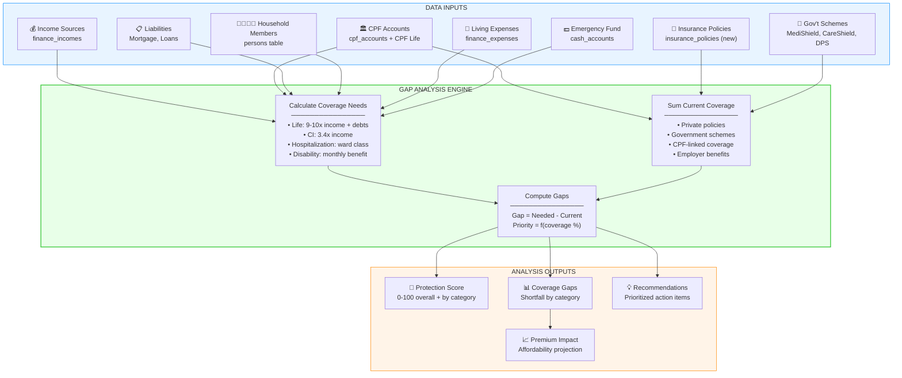
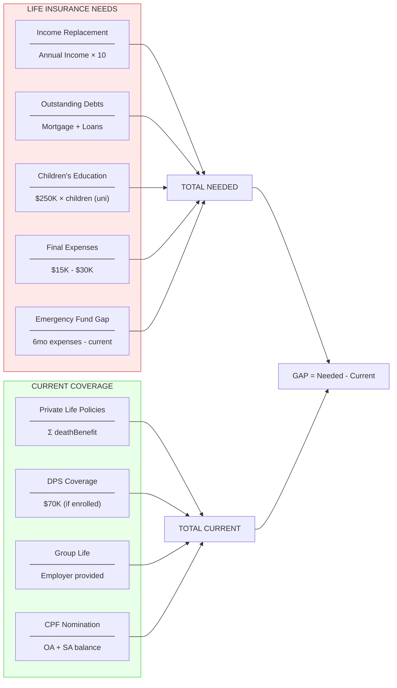
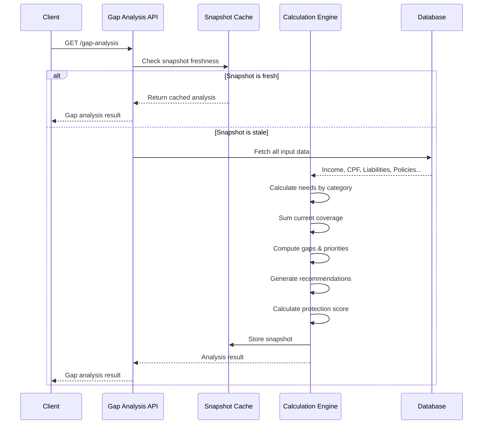

# Insurance Gap Analysis - Feature Specification

## Executive Summary

A comprehensive insurance gap analysis system that determines whether a user has adequate protection across all major insurance categories by analyzing their existing financial profile, dependents, and coverage.

**Key Question Answered:** "Do I have enough insurance to protect myself and my family?"

---

## System Architecture Overview



---

## Data Components

### 1. Income Sources (Existing)

**Source:** `finance_incomes` table

| Field | Usage in Gap Analysis |
|-------|----------------------|
| `amount` | Base for income replacement calculation |
| `frequency` | Normalize to annual income |
| `personId` | Attribute income to household member |
| `incomeType` | Weight employer coverage (salary vs freelance) |

**Calculation:**
```
Annual Income = Σ(income.amount × frequency_multiplier) per person
Household Income = Σ(all persons' annual income)
```

### 2. CPF Accounts (Existing)

**Source:** `cpf_accounts` table

| Field | Usage in Gap Analysis |
|-------|----------------------|
| `raBalance` | Estimate CPF Life payout (retirement annuity) |
| `maBalance` | Available for MediShield Life / ISP premiums |
| `dateOfBirth` | Age-based coverage calculations |
| `residencyStatus` | Eligibility for government schemes |

**CPF Life Estimate:**
```
Monthly Payout ≈ RA Balance at 55 / 180 (Basic) or / 240 (Standard/Escalating)
Lump Sum Death Benefit = Remaining RA Balance
```

### 3. Liabilities (Existing)

**Source:** `finance_liabilities` table + `property_sg` table

| Field | Usage in Gap Analysis |
|-------|----------------------|
| `currentBalance` | Outstanding debt to cover in life insurance |
| `category` | Differentiate mortgage vs other loans |

**Calculation:**
```
Outstanding Debts = Σ(liability.currentBalance) + Σ(property.mortgageBalance)
```

### 4. Household Members / Dependents (Existing)

**Source:** `persons` table

| Field | Usage in Gap Analysis |
|-------|----------------------|
| `dateOfBirth` | Calculate age, determine life stage |
| `isIncluded` | Filter active household members |
| `name` | Display in dependency analysis |

**Dependency Classification:**
```typescript
interface DependentProfile {
  personId: string
  name: string
  age: number
  relationship: 'self' | 'spouse' | 'child' | 'parent' | 'other'
  isDependent: boolean  // financially dependent on primary earner
  educationYearsRemaining?: number  // for children
}
```

**Note:** The `relationship` field needs to be added to the `persons` table (see schema changes below).

### 5. Living Expenses (Existing)

**Source:** `finance_expenses` table

| Field | Usage in Gap Analysis |
|-------|----------------------|
| `amount` | Monthly/annual expense baseline |
| `frequency` | Normalize to annual |
| `category` | Identify essential vs discretionary |

**Calculation:**
```
Annual Essential Expenses = Σ(expense.amount × frequency_multiplier)
                           WHERE category IN ('housing', 'utilities', 'food', 'transport', 'insurance')
```

### 6. Emergency Fund (Existing)

**Source:** `finance_cash_accounts` table

| Field | Usage in Gap Analysis |
|-------|----------------------|
| `balance` | Current liquid savings |
| `isAccumulator` | Primary savings account |

**Calculation:**
```
Emergency Fund = Σ(cash_account.balance)
Emergency Fund Months = Emergency Fund / Monthly Essential Expenses
```

### 7. Insurance Policies (New)

**Source:** `insurance_policies` table (to be created)

Uses the existing `InsurancePolicy` type from [insurance.ts](frontend/src/types/insurance.ts).

**Key Fields for Gap Analysis:**
- `category`: Map to coverage bucket (life, CI, hospitalization, disability, accident)
- `coverageAmount`: Sum for current coverage
- `deathBenefit`, `criticalIllnessBenefit`, `tpdBenefit`: Specific coverage types
- `monthlyPayout`: For disability/LTC coverage
- `isActive`: Only count active policies
- `endDate`: Exclude expired policies

### 8. Government Schemes (New)

**Source:** `government_scheme_status` table (to be created)

Tracks user's enrollment and coverage in Singapore government schemes:

| Scheme | Coverage Type | Default Coverage | Age Requirement |
|--------|--------------|------------------|-----------------|
| MediShield Life | Hospitalization | Varies by ward | All SC/PR |
| CareShield Life | Disability (LTC) | $662/month (2025) | Born 1980+ |
| ElderShield | Disability (LTC) | $400/month | Pre-2020 enrollees |
| DPS | Life (Death + TPD) | $70K (age 59 & below) | CPF members |

---

## Gap Analysis Formulas

### Life Insurance Needs



**Formula:**
```typescript
lifeNeeds = {
  incomeReplacement: annualIncome * 10,
  outstandingDebts: mortgageBalance + otherLoansBalance,
  childrenEducation: numberOfChildren * 250000, // ~$250K per child for uni
  finalExpenses: 20000, // Funeral, estate, legal
  emergencyFundGap: max(0, (monthlyExpenses * 6) - currentEmergencyFund)
}

lifeNeeds.total = sum(lifeNeeds.components)

lifeCurrent = {
  privatePolicies: Σ(policy.deathBenefit WHERE category = 'life'),
  dps: dpsEnrolled ? 70000 : 0,
  groupLife: employerGroupLifeBenefit || 0,
  cpfBalance: cpf.oa + cpf.sa // Transferred to beneficiaries on death
}

lifeCurrent.total = sum(lifeCurrent.components)

lifeGap = lifeNeeds.total - lifeCurrent.total
```

### Critical Illness Needs

**Formula (LIA Guidelines):**
```typescript
ciNeeds = {
  incomeReplacement: annualIncome * 3.4, // LIA: 3.4-4x
  medicalCosts: 100000, // Estimated treatment costs
  recoveryPeriod: monthlyExpenses * 12 // 1 year recovery
}

ciNeeds.total = ciNeeds.incomeReplacement + ciNeeds.medicalCosts

ciCurrent = {
  privatePolicies: Σ(policy.criticalIllnessBenefit WHERE category = 'critical_illness'),
  earlyStageCI: Σ(policy.criticalIllnessBenefit WHERE subcategory = 'early_stage') * 0.25,
  riders: Σ(policy.criticalIllnessBenefit WHERE subcategory = 'rider')
}

ciCurrent.total = sum(ciCurrent.components)

ciGap = ciNeeds.total - ciCurrent.total
```

### Hospitalization Coverage

**Assessment (not monetary gap):**
```typescript
hospAssessment = {
  recommendedWard: determineWardClass(annualIncome),
  // Income < $50K → B2/C, $50K-$120K → B1, >$120K → A

  hasBasicCoverage: hasMediShieldLife,
  hasISP: hasIntegratedShieldPlan,
  ispCoverageLevel: ispPlan?.wardClass, // A, B1, B2+

  hasCopayRider: ispPlan?.hasRider,
  hasHospitalCash: policies.some(p => p.subcategory === 'hospital_cash'),

  annualPremiumEstimate: calculateISPPremium(age, wardClass)
}

hospGap = {
  wardGap: recommendedWard > currentWard ? 'upgrade_recommended' : 'adequate',
  riderRecommended: !hasCopayRider && affordabilityScore > 0.7,
  hospitalCashRecommended: !hasHospitalCash && hasDependents
}
```

**Ward Class Recommendation Logic:**
```typescript
function determineWardClass(annualIncome: number): 'A' | 'B1' | 'B2' | 'C' {
  if (annualIncome >= 150000) return 'A'
  if (annualIncome >= 80000) return 'B1'
  if (annualIncome >= 40000) return 'B2'
  return 'C'
}
```

### Disability / Income Protection Needs

**Formula:**
```typescript
disabilityNeeds = {
  monthlyBenefit: monthlyIncome * 0.75, // Replace 75% of income
  coveragePeriodYears: max(10, yearsToRetirement),
  totalCoverage: monthlyBenefit * 12 * coveragePeriodYears,

  // Long-term care (for severe disability)
  ltcMonthlyBenefit: 3000, // Nursing home / home care costs
  ltcCoverageYears: 10
}

disabilityCurrent = {
  careShieldLife: careShieldEnrolled ? 662 : 0, // Monthly payout
  elderShield: elderShieldEnrolled ? 400 : 0,
  incomeProtection: Σ(policy.monthlyPayout WHERE subcategory = 'income_protection'),
  tpdRiders: Σ(policy.tpdBenefit) // Lump sum, convert to monthly equivalent
}

// Compare monthly benefit adequacy
disabilityGap = {
  monthlyShortfall: disabilityNeeds.monthlyBenefit - disabilityCurrent.totalMonthly,
  ltcShortfall: disabilityNeeds.ltcMonthlyBenefit - (disabilityCurrent.careShieldLife + disabilityCurrent.elderShield)
}
```

---

## Database Schema Changes

### New Tables

#### 1. `insurance_policies`

```sql
CREATE TABLE insurance_policies (
    id UUID DEFAULT gen_random_uuid() PRIMARY KEY,
    user_id VARCHAR(36) NOT NULL,
    person_id UUID REFERENCES persons(id) ON DELETE SET NULL, -- Who is covered

    name VARCHAR(100) NOT NULL,
    category VARCHAR(30) NOT NULL, -- life, critical_illness, hospitalization, disability, accident, custom
    subcategory VARCHAR(30), -- term, whole_life, early_stage, isp, etc.

    -- Government scheme (if applicable)
    government_scheme VARCHAR(30), -- medishield_life, careshield_life, eldershield, dps
    is_government_scheme BOOLEAN DEFAULT false,

    -- Coverage amounts
    coverage_amount NUMERIC(15,2) NOT NULL DEFAULT 0,
    death_benefit NUMERIC(15,2),
    critical_illness_benefit NUMERIC(15,2),
    tpd_benefit NUMERIC(15,2),
    daily_hospital_cash NUMERIC(15,2),
    monthly_payout NUMERIC(15,2), -- For disability/LTC

    -- Premium details
    premium_amount NUMERIC(15,2) NOT NULL DEFAULT 0,
    premium_frequency VARCHAR(20) NOT NULL DEFAULT 'annually', -- monthly, quarterly, annually
    premium_currency VARCHAR(3) DEFAULT 'SGD',

    -- Dates
    start_date TIMESTAMPTZ NOT NULL,
    end_date TIMESTAMPTZ, -- NULL for whole life
    renewal_date TIMESTAMPTZ,

    -- Provider
    insurer_name VARCHAR(100),
    policy_number VARCHAR(50),

    -- Linking
    linked_expense_id UUID REFERENCES finance_expenses(id) ON DELETE SET NULL,

    -- Status
    is_active BOOLEAN DEFAULT true,
    notes TEXT,

    created_at TIMESTAMPTZ DEFAULT NOW() NOT NULL,
    updated_at TIMESTAMPTZ DEFAULT NOW() NOT NULL,

    CONSTRAINT chk_category CHECK (category IN (
        'life', 'critical_illness', 'hospitalization', 'disability', 'accident', 'custom'
    )),
    CONSTRAINT chk_premium_frequency CHECK (premium_frequency IN (
        'monthly', 'quarterly', 'annually'
    ))
);

CREATE INDEX idx_insurance_policies_user ON insurance_policies(user_id);
CREATE INDEX idx_insurance_policies_person ON insurance_policies(person_id);
CREATE INDEX idx_insurance_policies_category ON insurance_policies(category);
CREATE INDEX idx_insurance_policies_active ON insurance_policies(is_active) WHERE is_active = true;
```

#### 2. `government_scheme_enrollments`

```sql
CREATE TABLE government_scheme_enrollments (
    id UUID DEFAULT gen_random_uuid() PRIMARY KEY,
    user_id VARCHAR(36) NOT NULL,
    person_id UUID REFERENCES persons(id) ON DELETE CASCADE,

    scheme VARCHAR(30) NOT NULL, -- medishield_life, careshield_life, eldershield, dps
    is_enrolled BOOLEAN DEFAULT true,
    enrollment_date TIMESTAMPTZ,

    -- Coverage details (can vary from defaults)
    coverage_amount NUMERIC(15,2), -- For DPS
    monthly_payout NUMERIC(15,2), -- For CareShield/ElderShield
    ward_class VARCHAR(5), -- For MediShield Life (A, B1, B2, C)

    -- ISP upgrade (for MediShield Life)
    isp_provider VARCHAR(100),
    isp_plan_name VARCHAR(100),
    isp_ward_class VARCHAR(5),
    has_rider BOOLEAN DEFAULT false,

    notes TEXT,

    created_at TIMESTAMPTZ DEFAULT NOW() NOT NULL,
    updated_at TIMESTAMPTZ DEFAULT NOW() NOT NULL,

    CONSTRAINT chk_scheme CHECK (scheme IN (
        'medishield_life', 'careshield_life', 'eldershield', 'dps'
    )),
    CONSTRAINT uq_person_scheme UNIQUE (person_id, scheme)
);

CREATE INDEX idx_gov_schemes_user ON government_scheme_enrollments(user_id);
CREATE INDEX idx_gov_schemes_person ON government_scheme_enrollments(person_id);
```

#### 3. `insurance_gap_snapshots` (Cached Analysis)

```sql
CREATE TABLE insurance_gap_snapshots (
    id UUID DEFAULT gen_random_uuid() PRIMARY KEY,
    user_id VARCHAR(36) NOT NULL,

    -- Snapshot data (JSON for flexibility)
    coverage_needs JSONB NOT NULL,      -- CoverageNeeds
    current_coverage JSONB NOT NULL,    -- Current coverage by category
    gaps JSONB NOT NULL,                -- CoverageGap[]
    protection_score JSONB NOT NULL,    -- ProtectionScore
    recommendations JSONB NOT NULL,     -- InsuranceRecommendation[]

    -- Input hashes (to detect stale snapshots)
    income_hash VARCHAR(64),
    liability_hash VARCHAR(64),
    policy_hash VARCHAR(64),

    calculated_at TIMESTAMPTZ DEFAULT NOW() NOT NULL,

    CONSTRAINT uq_user_snapshot UNIQUE (user_id)
);

CREATE INDEX idx_gap_snapshots_user ON insurance_gap_snapshots(user_id);
```

### Schema Modifications

#### Add `relationship` to `persons` table

```sql
ALTER TABLE persons
ADD COLUMN relationship VARCHAR(20) DEFAULT 'self';

-- Valid values: 'self', 'spouse', 'child', 'parent', 'sibling', 'other'
ALTER TABLE persons
ADD CONSTRAINT chk_relationship CHECK (relationship IN (
    'self', 'spouse', 'child', 'parent', 'sibling', 'other'
));
```

#### Add `employer_benefits` to track group coverage

```sql
CREATE TABLE employer_benefits (
    id UUID DEFAULT gen_random_uuid() PRIMARY KEY,
    user_id VARCHAR(36) NOT NULL,
    person_id UUID REFERENCES persons(id) ON DELETE CASCADE,
    income_id UUID REFERENCES finance_incomes(id) ON DELETE CASCADE,

    benefit_type VARCHAR(30) NOT NULL, -- group_life, group_health, group_ci
    coverage_amount NUMERIC(15,2),
    monthly_payout NUMERIC(15,2),

    -- Employment link
    employer_name VARCHAR(100),

    is_active BOOLEAN DEFAULT true,
    notes TEXT,

    created_at TIMESTAMPTZ DEFAULT NOW() NOT NULL,
    updated_at TIMESTAMPTZ DEFAULT NOW() NOT NULL
);
```

---

## API Endpoints

### Insurance Policies CRUD

```
GET    /api/v2/insurance-policies                     List all policies
POST   /api/v2/insurance-policies                     Create policy
GET    /api/v2/insurance-policies/:id                 Get single policy
PUT    /api/v2/insurance-policies/:id                 Update policy
DELETE /api/v2/insurance-policies/:id                 Delete policy

GET    /api/v2/insurance-policies/by-person/:personId Policies for a person
GET    /api/v2/insurance-policies/by-category/:cat    Policies by category
```

### Government Schemes

```
GET    /api/v2/government-schemes                     List enrollments
POST   /api/v2/government-schemes                     Create/update enrollment
DELETE /api/v2/government-schemes/:id                 Remove enrollment

GET    /api/v2/government-schemes/defaults            Get default coverage by age
```

### Gap Analysis

```
GET    /api/v2/insurance/gap-analysis                 Get gap analysis (cached)
POST   /api/v2/insurance/gap-analysis/recalculate     Force recalculation
GET    /api/v2/insurance/protection-score             Get protection score
GET    /api/v2/insurance/recommendations              Get recommendations
GET    /api/v2/insurance/coverage-summary             Coverage by category
```

### Timeline Integration

```
GET    /api/v2/insurance/premium-projection           Premium costs over time
POST   /api/v2/insurance/affordability-check          Can user afford recommended coverage?
```

---

## Gap Analysis Engine

### Core Calculation Flow



### Calculation Service (Go)

```go
// internal/insurance/gap_analysis.go

type GapAnalysisService struct {
    store       repository.Store
    cpfService  *cpf.Service
}

type GapAnalysisInput struct {
    UserID      string
    Incomes     []Income
    CPFAccounts []CPFAccount
    Liabilities []Liability
    Properties  []PropertySG
    Expenses    []Expense
    CashAccounts []CashAccount
    Persons     []Person
    Policies    []InsurancePolicy
    GovSchemes  []GovernmentSchemeEnrollment
}

type GapAnalysisResult struct {
    CoverageNeeds    CoverageNeeds
    CurrentCoverage  CurrentCoverage
    Gaps             []CoverageGap
    ProtectionScore  ProtectionScore
    Recommendations  []InsuranceRecommendation
    CalculatedAt     time.Time
}

func (s *GapAnalysisService) CalculateGaps(ctx context.Context, userID string) (*GapAnalysisResult, error) {
    // 1. Gather all input data
    input, err := s.gatherInputData(ctx, userID)
    if err != nil {
        return nil, err
    }

    // 2. Calculate household profile
    profile := s.buildHouseholdProfile(input)

    // 3. Calculate coverage needs
    needs := s.calculateCoverageNeeds(profile, input)

    // 4. Sum current coverage
    current := s.sumCurrentCoverage(input.Policies, input.GovSchemes, input.CPFAccounts)

    // 5. Compute gaps
    gaps := s.computeGaps(needs, current)

    // 6. Calculate protection score
    score := s.calculateProtectionScore(gaps)

    // 7. Generate recommendations
    recs := s.generateRecommendations(gaps, profile, input)

    return &GapAnalysisResult{
        CoverageNeeds:    needs,
        CurrentCoverage:  current,
        Gaps:             gaps,
        ProtectionScore:  score,
        Recommendations:  recs,
        CalculatedAt:     time.Now(),
    }, nil
}
```

### Freshness Detection

```go
func (s *GapAnalysisService) isSnapshotFresh(snapshot *GapSnapshot, input *GapAnalysisInput) bool {
    // Compute hashes of current data
    incomeHash := hashIncomes(input.Incomes)
    liabilityHash := hashLiabilities(input.Liabilities)
    policyHash := hashPolicies(input.Policies)

    // Compare with stored hashes
    return snapshot.IncomeHash == incomeHash &&
           snapshot.LiabilityHash == liabilityHash &&
           snapshot.PolicyHash == policyHash &&
           time.Since(snapshot.CalculatedAt) < 24*time.Hour
}
```

---

## Frontend Components

### Component Hierarchy

```
InsurancePlannerPage
├── InsuranceHeader
│   ├── ProtectionScoreBadge
│   └── QuickStats (total coverage, monthly premiums)
│
├── InsuranceTabs
│   ├── OverviewTab
│   │   ├── ProtectionScoreCard (radial chart)
│   │   ├── CoverageBreakdownCard (horizontal bars)
│   │   ├── GovernmentSchemesCard (status list)
│   │   └── QuickActionsCard (add policy, run analysis)
│   │
│   ├── PoliciesTab
│   │   ├── PolicyFilters (category, status)
│   │   ├── PolicyList
│   │   │   └── PolicyCard (repeating)
│   │   └── AddPolicyButton → PolicyFormModal
│   │
│   ├── GapAnalysisTab
│   │   ├── GapSummaryCards (critical/high/adequate)
│   │   ├── GapDetailList
│   │   │   └── GapCard (category, bar, recommendation)
│   │   └── CoverageNeedsBreakdown (expandable)
│   │
│   └── RecommendationsTab
│       ├── RecommendationPriorityList
│       │   └── RecommendationCard (priority, action, premium est.)
│       ├── AffordabilityAnalysis
│       └── ActionPlanExport
│
└── Modals
    ├── PolicyFormModal (add/edit policy)
    ├── GovernmentSchemeModal (enrollment status)
    └── RecommendationDetailModal
```

### Key UI Patterns

#### Protection Score Card
```tsx
// Radial progress showing 0-100 score
// Color: red (<40), amber (40-70), emerald (>70)
// Breakdown by category below
```

#### Gap Visualization
```tsx
// Horizontal stacked bar:
// [Current Coverage (emerald)] [Gap (rose/amber)]
// Labels: $350K current / $850K needed (41%)
```

#### Recommendation Cards
```tsx
// Priority badge (1-5)
// Category icon + label
// Suggested coverage amount
// Estimated premium range
// "Learn More" → expand rationale
// "Add to Policies" → quick add
```

---

## Recommendation Engine

### Priority Scoring

```typescript
function calculateRecommendationPriority(gap: CoverageGap, profile: HouseholdProfile): number {
  let score = 0

  // Base priority from coverage %
  if (gap.coveragePercentage < 25) score += 50
  else if (gap.coveragePercentage < 50) score += 30
  else if (gap.coveragePercentage < 75) score += 15

  // Category weight
  const categoryWeights = {
    life: 1.5,           // Highest priority if dependents
    critical_illness: 1.3,
    hospitalization: 1.2,
    disability: 1.1,
    accident: 0.8
  }
  score *= categoryWeights[gap.category]

  // Dependent factor
  if (profile.hasDependents && gap.category === 'life') {
    score *= 1.5
  }

  // Age factor (younger = more years to protect)
  if (profile.primaryAge < 40) score *= 1.2

  // Affordability factor (don't recommend if can't afford)
  if (profile.disposableIncome < gap.estimatedPremium * 12) {
    score *= 0.5
  }

  return Math.min(100, score)
}
```

### Recommendation Templates

```typescript
const recommendationTemplates = {
  life_term: {
    title: 'Term Life Insurance',
    rationale: 'Provides high coverage at affordable premiums. Ideal for protecting dependents during working years.',
    actionItems: [
      'Compare quotes from 3+ insurers',
      'Consider level vs decreasing term',
      'Review coverage as dependents grow'
    ]
  },
  ci_early: {
    title: 'Early-Stage Critical Illness',
    rationale: 'Covers early-stage conditions (Stage 0-2 cancer) before they become severe. Lower premiums than multi-pay CI.',
    actionItems: [
      'Check if your CI policy has early-stage rider',
      'Consider standalone early CI if gaps exist'
    ]
  },
  isp_upgrade: {
    title: 'Integrated Shield Plan Upgrade',
    rationale: 'Upgrade from MediShield Life for private hospital access and higher claim limits.',
    actionItems: [
      'Compare ISP plans from major insurers',
      'Consider rider for co-payment reduction',
      'Use Medisave to pay premiums'
    ]
  },
  // ... more templates
}
```

---

## Integration Points

### 1. Timeline Integration

Show insurance premiums as expenses in the timeline projection:

```typescript
// When creating a policy, optionally create linked expense
async function createPolicyWithExpense(policy: InsurancePolicyCreatePayload) {
  // Create expense for premium
  const expense = await createExpense({
    name: `${policy.name} Premium`,
    amount: policy.premiumAmount,
    frequency: mapPremiumToExpenseFrequency(policy.premiumFrequency),
    category: 'insurance',
    startDate: policy.startDate,
    endDate: policy.endDate
  })

  // Link expense to policy
  policy.linkedExpenseId = expense.id
  return createPolicy(policy)
}
```

### 2. Scenario Integration

Model "what if" scenarios for insurance decisions:

```typescript
// Scenario event: "Buy $500K term life insurance"
const scenarioImpact: ScenarioImpact = {
  impactKind: 'start',
  targetType: 'expense',
  name: 'Term Life Premium',
  amount: 150, // Monthly premium
  cadence: 'monthly',
  startDate: '2025-06',
  endDate: '2055-06'
}
```

### 3. CPF Integration

- Pull CPF account data for CPF Life estimates
- Track Medisave usage for ISP premiums
- Link to DPS enrollment status

### 4. Fund Flow Integration (Future)

When fund flow rules are implemented, model:
- Medisave deductions for premiums (allocation rule)
- Premium payments from cash account (payment rule)

---

## Implementation Phases

### Phase 1: Core Data Layer (~2 weeks)

**Backend:**
- [ ] Create `insurance_policies` table + migration
- [ ] Create `government_scheme_enrollments` table + migration
- [ ] Add `relationship` column to `persons` table
- [ ] Repository CRUD for policies and schemes
- [ ] API handlers for CRUD operations

**Frontend:**
- [ ] TypeScript types (already mostly done in `insurance.ts`)
- [ ] API service functions
- [ ] React Query hooks

### Phase 2: Gap Analysis Engine (~2 weeks)

**Backend:**
- [ ] Implement `GapAnalysisService`
- [ ] Coverage needs calculation
- [ ] Current coverage aggregation
- [ ] Gap computation
- [ ] Protection score calculation
- [ ] Snapshot caching

**Frontend:**
- [ ] Gap analysis API integration
- [ ] Protection score display
- [ ] Gap visualization components

### Phase 3: Policy Management UI (~1.5 weeks)

**Frontend:**
- [ ] Policy list with filters
- [ ] Policy form modal (add/edit)
- [ ] Government scheme status form
- [ ] Policy card component
- [ ] Quick actions (duplicate, deactivate)

### Phase 4: Recommendations (~1 week)

**Backend:**
- [ ] Recommendation engine
- [ ] Priority scoring
- [ ] Affordability check

**Frontend:**
- [ ] Recommendation list
- [ ] Recommendation detail modal
- [ ] "Add to Policies" quick action

### Phase 5: Integration & Polish (~1 week)

- [ ] Timeline integration (premiums as expenses)
- [ ] Scenario event support
- [ ] CPF data integration
- [ ] Export / share analysis
- [ ] Mobile responsive polish

---

## Success Metrics

| Metric | Target |
|--------|--------|
| Users can add policies | 100% CRUD working |
| Gap analysis accuracy | Within 10% of manual calculation |
| Protection score reflects coverage | Score correlates with % covered |
| Recommendations are actionable | Users click "Learn More" > 30% |
| Performance | Gap analysis < 500ms |

---

## Open Questions

1. **Employer Benefits:** How do we capture group insurance? Separate table or flag on policy?
   - **Recommendation:** Separate `employer_benefits` table linked to income

2. **Multi-currency:** Support policies in USD, MYR, etc.?
   - **Recommendation:** Add `currency` field, convert to SGD for calculations

3. **Policy Documents:** Allow PDF upload?
   - **Recommendation:** Future phase, not MVP

4. **Beneficiary Tracking:** Who receives payout?
   - **Recommendation:** Future phase, use `notes` field for now

5. **Premium Increases:** How to model annual premium increases?
   - **Recommendation:** Use expense `growthRate` on linked expense

---

## Appendix: Singapore-Specific Considerations

### CPF Life Estimation

```typescript
// Simplified CPF Life payout estimation
function estimateCPFLifePayout(raBalanceAt55: number, planType: 'basic' | 'standard' | 'escalating'): number {
  const divisors = { basic: 180, standard: 240, escalating: 264 }
  return raBalanceAt55 / divisors[planType]
}
```

### MediShield Life Claim Limits (2024)

| Ward Class | Daily Ward Limit | Surgical Limit | Annual Limit |
|------------|-----------------|----------------|--------------|
| C | $800 | $2,400 | $150,000 |
| B2 | $1,000 | $3,000 | $150,000 |
| B1 | $1,400 | $4,200 | $150,000 |
| A | Varies by ISP | Varies by ISP | Varies |

### DPS Coverage Table

| Age | Coverage Amount |
|-----|-----------------|
| 16-59 | $70,000 |
| 60 | $55,000 |
| 61-64 | $40,000 |
| 65+ | Not eligible |

### ISP Premium Ranges (Annual, Age 35)

| Plan | Ward Class | Annual Premium |
|------|------------|----------------|
| Basic MediShield Life | C/B2 | $200-$300 |
| ISP Standard | B1 | $400-$600 |
| ISP Private | A | $800-$1,500 |
| ISP + Rider | A | $1,200-$2,500 |
