# Property Purchase Scenario Flow - Comprehensive Design

## Executive Summary

Design an **interactive visual property purchase timeline** that allows users to model HDB (BTO/Resale), Private, and EC property purchases. The core UX is a **Gantt-chart style interactive timeline** where users can:
- See purchase phases as visual blocks on a timeline
- **Drag vertical milestone markers** to adjust key dates
- Have the financial engine auto-calculate impacts based on timeline positions
- View affordability gauges, grant breakdowns, and payment schedules in real-time

Leverages existing scenario system, CPF integration, Recharts, and drag/pan patterns from the codebase.

---

## 1. Context: Existing Systems to Leverage

### 1.1 Scenario System (Fully Implemented)
- **ScenarioEvent**: Events with `occursOn` date, icon, color, tags, `isIncluded` toggle
- **ScenarioImpact**: Four impact kinds (`start`, `delta`, `override`, `stop`) affecting 6 target types (asset, liability, income, expense, cash, investment)
- **Timeline Integration**: Impacts are applied month-by-month during financial projections
- **UI**: ScenarioEventModal with sentence-builder pattern for impacts

### 1.2 CPF System (Comprehensive Specs)
- **OA for Housing**: Tracks `oaUsedForHousing` for downpayment and monthly payments
- **Accrued Interest**: Compound interest calculation on CPF used for property
- **Age-Based Rules**: VL (Valuation Limit), WL (Weekly Limit at age 55), BRS requirements

### 1.3 Property Planner (Partially Implemented)
- **Mortgage Calculator**: Monthly payment, amortization, MSR/TDSR calculations
- **Property Scenarios**: `property_purchase_plans` table spec with full schema
- **Property Links**: Three-way linking (scenario → asset → liability)
- **Calculators Spec**: Eligibility, Grants, Stamp Duties, Loan Comparison, Timeline

### 1.4 Charting & Interaction Patterns (Existing)
- **Library**: Recharts v3.4.1 with ResponsiveContainer, ComposedChart, Area, Bar, Line
- **Drag/Pan**: `useChartZoom.ts` with mouse wheel zoom, drag-to-pan, zoom stack history
- **Clickable Elements**: ScenarioMarker (circles with icons), YearTick (clickable X-axis)
- **Resizable**: MiniChart (floating), ResizableCard (dashboard cards)
- **Animation**: 700ms area fill, respects prefers-reduced-motion

---

## 2. Core Visual Concept: Interactive Property Timeline

### 2.1 The Gantt-Chart Style Timeline

```
┌──────────────────────────────────────────────────────────────────────────────┐
│  Property Purchase Timeline                                    [HDB Resale ▼]│
├──────────────────────────────────────────────────────────────────────────────┤
│                                                                              │
│  ←─────────────────── Time (months) ─────────────────────────────────────→  │
│  │    │    │    │    │    │    │    │    │    │    │    │    │    │    │    │
│  Jan  Feb  Mar  Apr  May  Jun  Jul  Aug  Sep  Oct  Nov  Dec  Jan  Feb  Mar  │
│  2025                                                         2026          │
│                                                                              │
│  ┌─────────────────────────────────────────────────────────────────────┐    │
│  │                        YOUR PROPERTY JOURNEY                         │    │
│  └─────────────────────────────────────────────────────────────────────┘    │
│                                                                              │
│       ▼ Option         ▼ Exercise         ▼ Stamp Duty    ▼ Completion      │
│       │                │                  │               │                 │
│  ═════╪════════════════╪══════════════════╪═══════════════╪═════════════    │
│       │                │                  │               │                 │
│  ┌────┴───┐       ┌────┴────┐        ┌────┴───┐      ┌────┴────┐           │
│  │ $1,000 │       │ $4,000  │        │$16,200 │      │$120,000 │           │
│  │  CASH  │       │  CASH   │        │  BSD   │      │ CPF+Cash│           │
│  └────────┘       └─────────┘        └────────┘      └─────────┘           │
│                                                                              │
│  [Draggable Markers - drag left/right to adjust timeline]                   │
│                                                                              │
└──────────────────────────────────────────────────────────────────────────────┘

┌──────────────────────────────────────────────────────────────────────────────┐
│  Affordability Overview                                                      │
├──────────────────────────────────────────────────────────────────────────────┤
│                                                                              │
│  MSR Ratio          TDSR Ratio           LTV                                │
│  ┌───────────┐      ┌───────────┐        ┌───────────┐                      │
│  │ ████░░░░░ │      │ █████░░░░ │        │ ███████░░ │                      │
│  │   24%     │      │   42%     │        │   75%     │                      │
│  │  (< 30%)  │      │  (< 55%)  │        │  (max 75%)│                      │
│  └───────────┘      └───────────┘        └───────────┘                      │
│     ✓ PASS            ✓ PASS               ✓ MAX                            │
│                                                                              │
└──────────────────────────────────────────────────────────────────────────────┘

┌──────────────────────────────────────────────────────────────────────────────┐
│  Grants Breakdown (HDB Only)                                    Total: $140k │
├──────────────────────────────────────────────────────────────────────────────┤
│                                                                              │
│  ████████████████████████████████░░░░░░░░░░░░░░░░░░ EHG: $80,000            │
│  ████████████████░░░░░░░░░░░░░░░░░░░░░░░░░░░░░░░░░░ Family: $40,000         │
│  ████████░░░░░░░░░░░░░░░░░░░░░░░░░░░░░░░░░░░░░░░░░░ PHG: $20,000            │
│                                                                              │
└──────────────────────────────────────────────────────────────────────────────┘
```

### 2.2 Key Interaction Patterns

**Draggable Milestone Markers**:
- Each vertical marker (Option, Exercise, Completion, etc.) is draggable left/right
- Dragging recalculates:
  - Payment amounts (interest accrual if delayed)
  - CPF projections (more months of contributions available)
  - Stamp duty deadlines
  - Wait-out period compliance
- Visual constraints: Can't drag completion before exercise, etc.

**Phase Blocks**:
- Colored blocks between milestones show phases:
  - "Searching" (before option)
  - "Option Period" (option → exercise, max 21 days for resale)
  - "Processing" (exercise → completion, 8-12 weeks for resale)
  - "BTO Wait" (3-5 years for BTO)
- Blocks stretch/shrink as markers are dragged

**Real-time Calculations**:
- As user drags markers, sidebar panels update instantly:
  - CPF OA balance at each milestone
  - Cash needed at each milestone
  - Monthly payment start date
  - Accrued interest projections

---

## 3. User Flow: Interactive Property Timeline Builder

### 3.1 Entry Point & Initial Setup

**Entry Point**: "Plan Property Purchase" button in dashboard or sidebar

**Step 1: Quick Setup Form** (30 seconds)
```
┌─────────────────────────────────────────────────────────┐
│  Let's Plan Your Property Purchase                      │
├─────────────────────────────────────────────────────────┤
│                                                         │
│  Property Type: [HDB BTO ▼] [HDB Resale] [Private] [EC] │
│                                                         │
│  Estimated Price: $ [500,000    ]                       │
│                                                         │
│  Target Purchase Date: [March 2025 ▼]                   │
│                                                         │
│  ─────────────────────────────────────────────────────  │
│                                                         │
│  Buyer Profile (click to expand)                        │
│  + Add Applicant   [You: SC, 32, First-timer ✓]        │
│                    [Spouse: PR, 30, First-timer ✓]      │
│                                                         │
│  Household Income: $ [10,000    ] /month                │
│                                                         │
│                              [Create Timeline →]        │
└─────────────────────────────────────────────────────────┘
```

**Step 2: Interactive Timeline View** (Main Experience)

After setup, the main view is the interactive Gantt-chart timeline:
- Timeline auto-populates based on property type (BTO vs Resale timelines differ)
- User can immediately start dragging milestones
- Side panels show real-time calculations

### 3.2 Timeline Templates by Property Type

**HDB BTO Timeline**:
```
Today ─────┬─────────────────────────────────────────────────────┬─────────
           │                                                     │
           ▼ Apply                                               ▼ Key
           (Ballot)                                              Collection
           │                                                     │
           └──────────── 3-5 Year Wait Period ───────────────────┘
           │                                                     │
     ┌─────┴─────┐                                        ┌──────┴──────┐
     │  $2,000   │                                        │  Balance    │
     │ Option Fee│                                        │  + Stamp    │
     └───────────┘                                        └─────────────┘
```

**HDB Resale Timeline**:
```
Today ──┬────────┬────────────┬──────────────┬──────────────────
        │        │            │              │
        ▼ OTP    ▼ Exercise   ▼ Stamp Duty   ▼ Completion
        │  21d   │   14d      │  8-12 wks    │
        └────────┴────────────┴──────────────┘
        │        │            │              │
   ┌────┴───┐┌───┴───┐  ┌─────┴────┐  ┌──────┴─────┐
   │ $1,000 ││$4,000 │  │ BSD+ABSD │  │ Balance    │
   │  Cash  ││ Cash  │  │  Cash    │  │ CPF+Cash   │
   └────────┘└───────┘  └──────────┘  └────────────┘
```

**Private New Launch Timeline**:
```
Today ──┬──────────┬─────────┬─────────┬─────────┬─────────┬────────
        │          │         │         │         │         │
        ▼ Booking  ▼ S&P     ▼ Found-  ▼ Struct  ▼ TOP     ▼ Complete
        (5%)       (15%)     ation     -ure      (5%)      (15%)
                   +Stamp    (10%)     (10%)
        │          │         │         │         │         │
        └──────────┴─────────┴─────────┴─────────┴─────────┘
              Progressive Payment Schedule (Loan Disbursements)
```

### 3.3 Draggable Marker Behaviors

| Marker | Draggable? | Constraints | Recalculates |
|--------|------------|-------------|--------------|
| **OTP/Booking** | ✓ Full | Min: Today | All downstream dates |
| **Exercise** | ✓ Limited | Max 21 days from OTP (resale) | Processing time |
| **Stamp Duty** | ✓ Limited | Max 14 days from Exercise | Late penalty warnings |
| **Completion** | ✓ Full | Min 8 weeks from Exercise | CPF balance at date, Cash needed |
| **Key Collection (BTO)** | ✓ Range | 3-5 years from Apply | All CPF/Cash projections |

**Constraint Visualizations**:
- Valid drag range shown as highlighted zone
- Invalid positions snap back with shake animation
- Tooltip explains constraint ("Exercise must be within 21 days of Option")

### 3.4 Real-Time Side Panels

As user drags markers, these panels update instantly:

**Panel A: Cash Flow Requirements**
```
┌─────────────────────────────────────────┐
│  💰 Cash Needed by Milestone            │
├─────────────────────────────────────────┤
│  Mar 2025  Option Fee        $1,000     │
│  Apr 2025  Exercise          $4,000     │
│  Apr 2025  Stamp Duty       $16,200     │
│  Jun 2025  Completion      $115,000     │
│  ───────────────────────────────────────│
│  Total Cash Required       $136,200     │
│  Your Cash Available       $150,000 ✓   │
└─────────────────────────────────────────┘
```

**Panel B: CPF Projection**
```
┌─────────────────────────────────────────┐
│  🏦 CPF OA Projection                   │
├─────────────────────────────────────────┤
│  Current OA Balance         $80,000     │
│  + Contributions (3 mo)     +$4,500     │
│  ───────────────────────────────────────│
│  OA at Completion           $84,500     │
│  Downpayment from OA       -$84,500     │
│  Remaining OA                   $0      │
│                                         │
│  ⚠️ Accrued Interest Preview            │
│  At sale (25 yrs): ~$120,000            │
└─────────────────────────────────────────┘
```

**Panel C: Grants (HDB Only)**
```
┌─────────────────────────────────────────┐
│  🎁 Grants You Qualify For              │
├─────────────────────────────────────────┤
│  ████████████████████ EHG       $80,000 │
│  ██████████████ Family Grant    $40,000 │
│  ████████ PHG (Near Parents)    $20,000 │
│  ───────────────────────────────────────│
│  Total Grants                  $140,000 │
│  Effective Price              $360,000  │
└─────────────────────────────────────────┘
```

### 3.5 Integration with Financial Engine

**"Apply to Timeline" Action**:
When user is satisfied with the timeline, clicking "Apply" generates scenario impacts:

```typescript
// Auto-generated scenario event
{
  name: "Buy 4-Room HDB Resale",
  occursOn: completionDate,
  displayIcon: "home",
  displayColor: "#3b82f6",
  impacts: [
    // Asset: Property
    { impactKind: "start", targetType: "asset", name: "HDB Resale - Tampines", amount: 500000, ... },
    // Liability: Mortgage
    { impactKind: "start", targetType: "liability", name: "HDB Loan", amount: 360000, interestRate: 2.6, ... },
    // Expense: Monthly Payment
    { impactKind: "start", targetType: "expense", name: "Mortgage Payment", amount: 1700, frequency: "monthly", ... },
    // One-time: Stamp Duty
    { impactKind: "start", targetType: "expense", name: "BSD", amount: 16200, frequency: "one_time", ... },
    // CPF: OA Drawdown (if CPF integration enabled)
    { impactKind: "delta", targetType: "cash", parentId: cpfOaId, amount: -84500, ... }
  ]
}
```

These impacts automatically appear on the main financial timeline projection chart.

---

## 4. Property Types: HDB vs Private Differences

### 4.1 HDB BTO Specifics
| Aspect | HDB BTO Details |
|--------|-----------------|
| Eligibility | SC required, income ceiling ($14k family / $7k single), no existing property |
| Grants | EHG (up to $120k), no Family Grant (BTO only), no PHG |
| Loan Options | HDB Loan (75% LTV, 2.6%) OR Bank Loan (75% LTV, ~3.5%) |
| Timeline | 3-5 year wait, progressive payments NOT required |
| MOP | 5 years (10 years for Prime/Plus) |
| Singles | 35+ only, 2-room in non-mature only |

### 4.2 HDB Resale Specifics
| Aspect | HDB Resale Details |
|--------|---------------------|
| Eligibility | SC/PR (3+ years), may have income ceiling for Prime/Plus ($14k) |
| Grants | EHG + Family/Singles Grant + PHG (stackable, up to $170k+) |
| Wait-out | 15-month (standard) or 30-month (Prime/Plus, or from subsidized) |
| Timeline | 8-12 weeks from OTP exercise |

### 4.3 Private Property Specifics
| Aspect | Private Property Details |
|--------|--------------------------|
| Eligibility | None (just financing qualification) |
| Grants | None |
| ABSD | SC 1st: 0%, SC 2nd: 20%, PR 1st: 5%, Foreigner: 60% |
| LTV | 75% (1st), 45% (2nd), 35% (3rd+) |
| Min Cash Down | 5% for 1st property, 25% for 2nd+ |
| TDSR | 55% with 4% stress test |

### 4.4 Executive Condo (EC) Specifics
| Aspect | EC Details |
|--------|------------|
| Eligibility | SC required, income ceiling $16k |
| Grants | EC Family Grant ($30k SC/SC, $20k SC/PR) |
| Hybrid | HDB rules for 5 years, then privatizes |
| MOP | 5 years, then can sell to locals; 10 years, can sell to foreigners |

---

## 5. Scenario Impact Generation

When user completes property purchase timeline, system auto-creates these scenario impacts (already shown in section 3.5, additional examples below):

### 5.1 For Private Property (Example: $1.5M, SC 2nd property)

```typescript
// Scenario Event: "Buy Condo"
{
  name: "Buy Condo at Orchard",
  occursOn: "2025-09-01",
  displayIcon: "building",
  displayColor: "#8b5cf6",
  tags: ["property", "private", "second-property"],
  impacts: [
    // 1. Property Asset (Start)
    { impactKind: "start", targetType: "asset", name: "Condo - Orchard", amount: 1500000, ... },
    // 2. Mortgage Liability (45% LTV for 2nd property)
    { impactKind: "start", targetType: "liability", name: "Bank Loan - Orchard", amount: 675000, interestRate: 3.5, ... },
    // 3. Monthly Payment
    { impactKind: "start", targetType: "expense", name: "Mortgage Payment", amount: 3400, frequency: "monthly", ... },
    // 4. BSD (tiered calculation on $1.5M)
    { impactKind: "start", targetType: "expense", name: "BSD", amount: 44600, frequency: "one_time", ... },
    // 5. ABSD (20% for SC 2nd property)
    { impactKind: "start", targetType: "expense", name: "ABSD", amount: 300000, frequency: "one_time", ... },
  ]
}
```

**Key differences for private/2nd property:**
- ABSD: $300,000 (20% of $1.5M)
- Higher cash down: 25% = $375k min cash (vs 5% for 1st)
- Lower LTV: 45% max (vs 75% for 1st)
- BSD: Higher due to tiered brackets

---

## 6. CPF Integration Points

### 6.1 OA Usage Tracking
```typescript
interface CPFHousingUsage {
  propertyScenarioId: string
  downPayment: {
    oaUsed: number
    cashUsed: number
    grantReceived: number
  }
  monthlyPayments: {
    month: string
    oaUsed: number
    cashUsed: number
  }[]
  accruedInterest: {
    asOfDate: string
    totalAccrued: number
  }
}
```

### 6.2 Accrued Interest Calculation
- 2.5% compounded annually on OA used for property
- Must be refunded to CPF when property is sold (before age 55)
- Impacts retirement funds calculation

### 6.3 Age 55 Impact
- If property sold before 55: Refund principal + accrued interest to OA/RA
- If keeping property at 55: Can pledge property value toward BRS (up to 50%)
- SA shielding strategies may be affected

---

## 7. Calculator Functions Needed

### 7.1 Eligibility Calculator
```typescript
function checkEligibility(
  profile: BuyerProfile,
  property: PropertySpecs
): EligibilityResult {
  // Check age (21+, singles 35+ for BTO)
  // Check citizenship (SC required for BTO/EC)
  // Check income ceiling
  // Check existing property ownership
  // Check wait-out periods
  // Return: eligible, scheme, violations[], warnings[]
}
```

### 7.2 Grants Calculator
```typescript
function calculateGrants(
  profile: BuyerProfile,
  property: PropertySpecs,
  eligibility: EligibilityResult
): GrantsResult {
  // EHG: income-tiered ($5k - $120k)
  // Family Grant: SC/SC $80k, SC/PR $70k (resale only)
  // Singles Grant: $40k / $25k (resale only)
  // PHG: $30k with parents, $20k nearby
  // Return: breakdown by grant type, total
}
```

### 7.3 Stamp Duty Calculator
```typescript
function calculateStampDuties(
  profile: BuyerProfile,
  property: PropertySpecs
): StampDutiesResult {
  // BSD: tiered 1%-6% brackets
  // ABSD: 0%-60% based on citizenship + property count
  // Return: bsd, absd, ssd (if selling), total, breakdown
}
```

### 7.4 Loan Comparison Calculator
```typescript
function compareLoanOptions(
  profile: BuyerProfile,
  property: PropertySpecs,
  desiredLoan: number,
  tenure: number
): LoanComparisonResult {
  // HDB Loan: 75% LTV, 2.6%, no cash down required
  // Bank Loan: 75% LTV (1st), 5% min cash
  // MSR (30%) and TDSR (55%) checks
  // Return: hdbOption, bankOption, recommendation
}
```

### 7.5 Timeline Generator
```typescript
function generatePaymentTimeline(
  property: PropertySpecs,
  financing: FinancingOptions,
  grants: GrantsResult,
  duties: StampDutiesResult,
  purchaseDate: string
): TimelineResult {
  // BTO: Booking → Signing (9mo) → Key Collection (3-5yr)
  // Resale: Option ($1k) → Exercise ($4k) → Completion (8-12wk)
  // Private: Booking (5%) → S&P (15%) → Progressive → TOP
  // Return: milestones[], totalCashNeeded, totalCpfNeeded
}
```

---

## 8. Implementation Phases

### Phase 1: Core Interactive Timeline Component
**Goal**: Build the draggable Gantt-chart timeline component

- **PropertyTimelineChart.tsx**: Main Recharts-based timeline visualization
  - Horizontal time axis (months/years)
  - Draggable vertical milestone markers (using mouse events)
  - Phase blocks between milestones (colored rectangles)
  - Payment callout boxes below each milestone
- **useDraggableMilestones.ts**: Hook for drag logic
  - Mouse down/move/up handlers
  - Constraint validation (min/max dates between milestones)
  - Snap-to-month behavior
- **TimelineTemplate.ts**: Data structures for each property type
  - HDB BTO template (Application → Key Collection)
  - HDB Resale template (OTP → Exercise → Completion)
  - Private template (Booking → S&P → Progressive → TOP)
  - EC template (similar to private)

### Phase 2: Calculator Functions & Side Panels
**Goal**: Real-time calculations that update as milestones move

- **Calculator Functions** (`frontend/src/lib/propertyCalculators/`):
  - `eligibility.ts`: Citizenship, age, income ceiling checks
  - `grants.ts`: EHG, Family/Singles Grant, PHG calculations
  - `stampDuties.ts`: BSD (tiered), ABSD (citizenship-based)
  - `loanComparison.ts`: HDB vs Bank loan with MSR/TDSR
  - `timeline.ts`: Generate milestones from property type
- **Side Panel Components**:
  - `CashFlowPanel.tsx`: Cash needed by milestone
  - `CPFProjectionPanel.tsx`: OA balance projection
  - `GrantsPanel.tsx`: Visual grant breakdown (horizontal bars)
  - `AffordabilityGauges.tsx`: MSR, TDSR, LTV gauges

### Phase 3: Setup Form & CPF Integration
**Goal**: Quick setup form + CPF account connection

- **PropertySetupForm.tsx**: Initial inputs
  - Property type selector
  - Price, target date
  - Multi-applicant buyer profile
  - Household income
- **CPF Integration**:
  - Connect to existing CPF account data
  - Project OA balance at each milestone
  - Accrued interest calculation
  - Age 55 impact warnings

### Phase 4: Scenario Generation & Advanced Features
**Goal**: Convert timeline to scenario events + advanced flows

- **Scenario Generation**:
  - "Apply to Timeline" button generates impacts
  - Creates Asset (property), Liability (mortgage), Expenses
  - Links to main financial timeline
- **Advanced Features**:
  - Property sale scenario (STOP impacts)
  - Upgrade/downgrade flows
  - Wait-out period tracking
  - Save/load draft timelines

---

## 9. Building on Existing Database Tables

### 9.1 How Property Purchase Uses EXISTING Tables

The property purchase feature **does NOT require new finance tables**. It builds entirely on existing infrastructure:

#### **Using finance_assets (Property Value)**
```sql
-- When user confirms property purchase, creates:
INSERT INTO finance_assets (
  id, user_id, parent_id,
  name,                           -- "4-Room HDB Tampines"
  category,                       -- "property"
  current_value,                  -- 500000
  growth_rate,                    -- 3.0 (appreciation estimate)
  growth_strategy,                -- "compound_monthly"
  start_date,                     -- 2025-06-01 (completion date)
  scenario_event_id,              -- Links to scenario event
  impact_kind                     -- NULL (this is a "start" impact, creates new item)
)
```

#### **Using finance_liabilities (Mortgage/Loan)**
```sql
-- Creates mortgage liability:
INSERT INTO finance_liabilities (
  id, user_id, parent_id,
  name,                           -- "HDB Loan - Tampines"
  category,                       -- "property"
  current_balance,                -- 375000 (75% of price)
  interest_rate_apr,              -- 2.6 (HDB loan rate)
  minimum_payment,                -- 1700 (monthly repayment)
  start_date,                     -- 2025-06-01
  end_date,                       -- 2050-06-01 (25-year tenure)
  scenario_event_id,              -- Links to scenario event
  impact_kind                     -- NULL (start impact)
)
```

#### **Using finance_expenses (Monthly Payment + One-time Costs)**
```sql
-- Monthly mortgage expense:
INSERT INTO finance_expenses (
  id, user_id, parent_id,
  name,                           -- "HDB Mortgage Payment"
  category,                       -- "housing_mortgage"
  amount,                         -- 1700
  frequency,                      -- "monthly"
  start_date,                     -- 2025-06-01
  end_date,                       -- 2050-06-01
  scenario_event_id
)

-- One-time stamp duty:
INSERT INTO finance_expenses (
  name,                           -- "BSD - HDB Tampines"
  category,                       -- "property_tax"
  amount,                         -- 9600
  frequency,                      -- "one_time"
  start_date,                     -- 2025-06-01 (stamp duty payment date)
  scenario_event_id
)
```

#### **Using cpf_accounts (OA Drawdown)**
```sql
-- Create versioned CPF account update for housing usage:
-- Step 1: End current CPF account version
UPDATE cpf_accounts
SET end_date = '2025-06-01'
WHERE user_id = $1 AND end_date IS NULL;

-- Step 2: Create new version with reduced OA
INSERT INTO cpf_accounts (
  user_id, parent_id,
  oa_balance,                     -- Previous OA minus downpayment
  sa_balance, ma_balance, ra_balance,  -- Same as previous
  oa_used_for_housing,            -- 125000 (OA used for this property)
  housing_start_date,             -- 2025-06-01
  start_date,                     -- 2025-06-01 (effective date)
  date_of_birth, residency_status
)
```

#### **Using property_scenarios + property_links (Already Exists!)**
```sql
-- The property_scenarios table already stores:
-- - property_type, property_price, down_payment, loan_amount
-- - interest_rate, loan_tenure
-- - amortization (JSONB), timeline (JSONB), milestones (JSONB)

-- property_links bridges property_scenario ↔ asset ↔ liability
INSERT INTO property_links (
  property_scenario_id,           -- Links to property_scenarios
  asset_id,                       -- Links to finance_assets (property)
  liability_id                    -- Links to finance_liabilities (mortgage)
)
```

### 9.2 Data Flow Diagram

```
┌─────────────────────────────────────────────────────────────────────────┐
│                    USER CONFIRMS PROPERTY PURCHASE                       │
└─────────────────────────────────────────────────────────────────────────┘
                                    │
                                    ▼
┌─────────────────────────────────────────────────────────────────────────┐
│                        1. CREATE SCENARIO EVENT                          │
│  scenario_events: name="Buy HDB", occurs_on="2025-06", icon="home"      │
└─────────────────────────────────────────────────────────────────────────┘
                                    │
            ┌───────────────────────┼───────────────────────┐
            │                       │                       │
            ▼                       ▼                       ▼
┌──────────────────┐   ┌──────────────────┐   ┌──────────────────────────┐
│  finance_assets  │   │finance_liabilities│   │    finance_expenses      │
│  category:       │   │  category:        │   │  - Monthly mortgage       │
│  "property"      │   │  "property"       │   │  - BSD (one_time)         │
│  scenario_event_ │   │  scenario_event_  │   │  - ABSD (one_time)        │
│  id → linked     │   │  id → linked      │   │  scenario_event_id        │
└────────┬─────────┘   └────────┬──────────┘   └──────────────────────────┘
         │                      │
         └──────────┬───────────┘
                    ▼
┌─────────────────────────────────────────────────────────────────────────┐
│                         property_links                                   │
│  property_scenario_id ←─→ asset_id ←─→ liability_id                     │
└─────────────────────────────────────────────────────────────────────────┘
                    │
                    ▼
┌─────────────────────────────────────────────────────────────────────────┐
│                       property_scenarios                                 │
│  - property_type, price, loan details                                    │
│  - amortization JSONB (year-by-year breakdown)                          │
│  - timeline JSONB (milestones for UI)                                    │
│  - milestones JSONB (draggable marker data)                              │
└─────────────────────────────────────────────────────────────────────────┘
                    │
                    ▼
┌─────────────────────────────────────────────────────────────────────────┐
│                         cpf_accounts                                     │
│  - New versioned record with updated oa_balance                          │
│  - oa_used_for_housing tracks CPF used                                   │
│  - housing_start_date for accrued interest calculation                   │
└─────────────────────────────────────────────────────────────────────────┘
```

### 9.3 Extending property_scenarios for Interactive Timeline

The existing `property_scenarios` table already has JSONB columns. We extend these for the interactive timeline:

```sql
-- milestones JSONB (store draggable marker positions):
{
  "milestones": [
    {"id": "otp", "name": "Option Fee", "date": "2025-03-01", "amount": 1000, "type": "cash"},
    {"id": "exercise", "name": "Exercise OTP", "date": "2025-03-21", "amount": 4000, "type": "cash"},
    {"id": "stamp_duty", "name": "Stamp Duty", "date": "2025-04-04", "amount": 16200, "type": "cash"},
    {"id": "completion", "name": "Completion", "date": "2025-06-01", "amount": 115000, "type": "cpf_cash"}
  ],
  "phases": [
    {"from": "otp", "to": "exercise", "name": "Option Period", "color": "#93c5fd"},
    {"from": "exercise", "to": "completion", "name": "Processing", "color": "#86efac"}
  ]
}

-- timeline JSONB (store payment timeline):
{
  "payments": [
    {"date": "2025-03-01", "cash": 1000, "cpf": 0, "label": "Option Fee"},
    {"date": "2025-03-21", "cash": 4000, "cpf": 0, "label": "Exercise"},
    {"date": "2025-04-04", "cash": 16200, "cpf": 0, "label": "BSD"},
    {"date": "2025-06-01", "cash": 30000, "cpf": 85000, "label": "Completion"}
  ],
  "totalCash": 51200,
  "totalCpf": 85000,
  "loanAmount": 375000
}
```

### 9.4 New Table: property_purchase_plans (Optional - For Draft Storage)

Only needed if we want to save drafts BEFORE creating finance records:

```sql
CREATE TABLE property_purchase_plans (
  id UUID PRIMARY KEY DEFAULT gen_random_uuid(),
  user_id VARCHAR(255) NOT NULL,

  -- Status (draft plans don't create finance records yet)
  status VARCHAR(50) NOT NULL DEFAULT 'draft',  -- 'draft', 'confirmed', 'cancelled'

  -- Buyer profile (JSONB for flexibility)
  buyer_profile JSONB NOT NULL,
  -- { "applicants": [...], "householdIncome": 10000, "existingDebts": 500 }

  -- Property details
  property_type VARCHAR(50) NOT NULL,  -- 'hdb_bto', 'hdb_resale', 'private', 'ec'
  property_price NUMERIC(15,2) NOT NULL,
  location_tier VARCHAR(50),  -- 'non_mature', 'mature', 'prime', 'plus'

  -- Timeline milestone positions (from interactive chart)
  timeline_milestones JSONB,  -- Stores draggable marker positions

  -- Calculation results (cached)
  eligibility_result JSONB,
  grants_result JSONB,
  loan_result JSONB,
  stamp_duties_result JSONB,

  -- Links to created entities (after confirmation)
  scenario_event_id UUID REFERENCES scenario_events(id),
  property_scenario_id UUID REFERENCES property_scenarios(id),

  created_at TIMESTAMPTZ DEFAULT NOW(),
  updated_at TIMESTAMPTZ DEFAULT NOW()
);
```

### 9.5 CPF OA Tracking: Using Existing Columns

The `cpf_accounts` table already has exactly what we need:

| Column | Purpose for Property |
|--------|----------------------|
| `oa_balance` | Track remaining OA after downpayment |
| `oa_used_for_housing` | Track total OA used for this property |
| `housing_start_date` | When CPF was first used (for accrued interest) |
| `parent_id` + `start_date`/`end_date` | Versioning for scenario modeling |

**Accrued Interest Calculation**:
- Rate: 2.5% p.a. on `oa_used_for_housing`
- Start: `housing_start_date`
- Calculated at query time or stored in `property_scenarios.insights` JSONB

### 9.6 Summary: Tables Used

| Purpose | Table | New/Existing |
|---------|-------|--------------|
| Property value | `finance_assets` (category='property') | Existing |
| Mortgage | `finance_liabilities` (category='property') | Existing |
| Monthly payment | `finance_expenses` (category='housing_mortgage') | Existing |
| Stamp duties | `finance_expenses` (category='property_tax') | Existing |
| CPF tracking | `cpf_accounts` (oa_used_for_housing) | Existing |
| Property calcs | `property_scenarios` (amortization, timeline JSONB) | Existing |
| Asset-Loan link | `property_links` | Existing |
| Draft plans | `property_purchase_plans` | **New (optional)** |
| Scenario event | `scenario_events` | Existing |

---

## 10. UI Components to Create

### 10.1 Main Page/Container
- `PropertyPurchasePlanner.tsx`: Full-page container with layout
  - Header with property type selector
  - Interactive timeline chart (center)
  - Side panels (right)
  - Action buttons (Apply to Timeline, Save Draft)

### 10.2 Timeline Components
- `PropertyTimelineChart.tsx`: Recharts-based Gantt visualization
- `DraggableMilestone.tsx`: Individual milestone marker (draggable)
- `PhaseBlock.tsx`: Colored block between milestones
- `PaymentCallout.tsx`: Payment amount display under milestone
- `TimelineTooltip.tsx`: Hover tooltip with milestone details

### 10.3 Side Panel Components
- `CashFlowPanel.tsx`: Milestone-by-milestone cash requirements
- `CPFProjectionPanel.tsx`: OA balance projection with contributions
- `GrantsPanel.tsx`: Horizontal bar chart of grants
- `AffordabilityGauges.tsx`: Circular gauges for MSR/TDSR/LTV
- `EligibilityPanel.tsx`: Pass/fail with violation list

### 10.4 Setup Form Components
- `PropertySetupForm.tsx`: Initial quick setup
- `BuyerProfileForm.tsx`: Multi-applicant editor
- `ApplicantCard.tsx`: Individual applicant with citizenship/age/status

### 10.5 Shared/Reusable
- `GaugeChart.tsx`: Circular progress gauge
- `StackedBarChart.tsx`: For grant breakdown
- `MonthPicker.tsx`: Month selector for dates

---

## 11. Files to Create/Modify

### Frontend - New Files
```
frontend/src/
├── components/property-purchase/
│   ├── PropertyPurchasePlanner.tsx      # Main page container
│   ├── PropertyTimelineChart.tsx        # Interactive Gantt chart
│   ├── DraggableMilestone.tsx           # Draggable marker component
│   ├── PhaseBlock.tsx                   # Phase block between milestones
│   ├── PaymentCallout.tsx               # Payment display
│   ├── panels/
│   │   ├── CashFlowPanel.tsx
│   │   ├── CPFProjectionPanel.tsx
│   │   ├── GrantsPanel.tsx
│   │   ├── AffordabilityGauges.tsx
│   │   └── EligibilityPanel.tsx
│   ├── forms/
│   │   ├── PropertySetupForm.tsx
│   │   ├── BuyerProfileForm.tsx
│   │   └── ApplicantCard.tsx
│   └── charts/
│       ├── GaugeChart.tsx
│       └── StackedBarChart.tsx
│
├── lib/propertyCalculators/
│   ├── index.ts                         # Export all
│   ├── types.ts                         # Calculator types
│   ├── eligibility.ts                   # Eligibility checker
│   ├── grants.ts                        # Grant calculations
│   ├── stampDuties.ts                   # BSD/ABSD/SSD
│   ├── loanComparison.ts                # HDB vs Bank
│   └── timelineTemplates.ts             # Property type templates
│
├── hooks/
│   ├── useDraggableMilestones.ts        # Drag interaction logic
│   └── usePropertyCalculations.ts       # Combined calculation hook
│
├── types/
│   └── propertyPurchase.ts              # All property types
│
└── api/
    └── propertyPurchase.ts              # API client
```

### Frontend - Existing Files to Modify
- `frontend/src/app/` - Add route for property planner page
- `frontend/src/components/sidebar/` - Add navigation link

### Backend - New Files
```
backend/
├── internal/financial_v2/property/
│   ├── service.go                       # PropertyPurchaseService
│   ├── repository.go                    # CRUD operations
│   └── types.go                         # Go structs
│
├── cmd/server/handlers/
│   └── property_purchase.go             # HTTP handlers
│
└── migrations/
    └── XXXXXX_create_property_purchase_plans.up.sql
```

### Key Existing Files to Reference
- `frontend/src/components/dashboard/projections/` - Chart patterns
- `frontend/src/components/dashboard/projections/useChartZoom.ts` - Drag/zoom patterns
- `frontend/src/types/scenario.ts` - Impact types
- `frontend/src/utils/mortgage-calculations.ts` - Existing mortgage logic
- `specs/backlog/property-purchase-planner-implementation.md` - Calculator specs

---

## 12. Architecture Diagrams

### 12.1 High-Level System Architecture

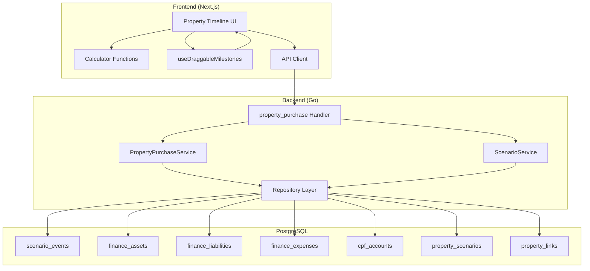

### 12.2 User Flow State Machine

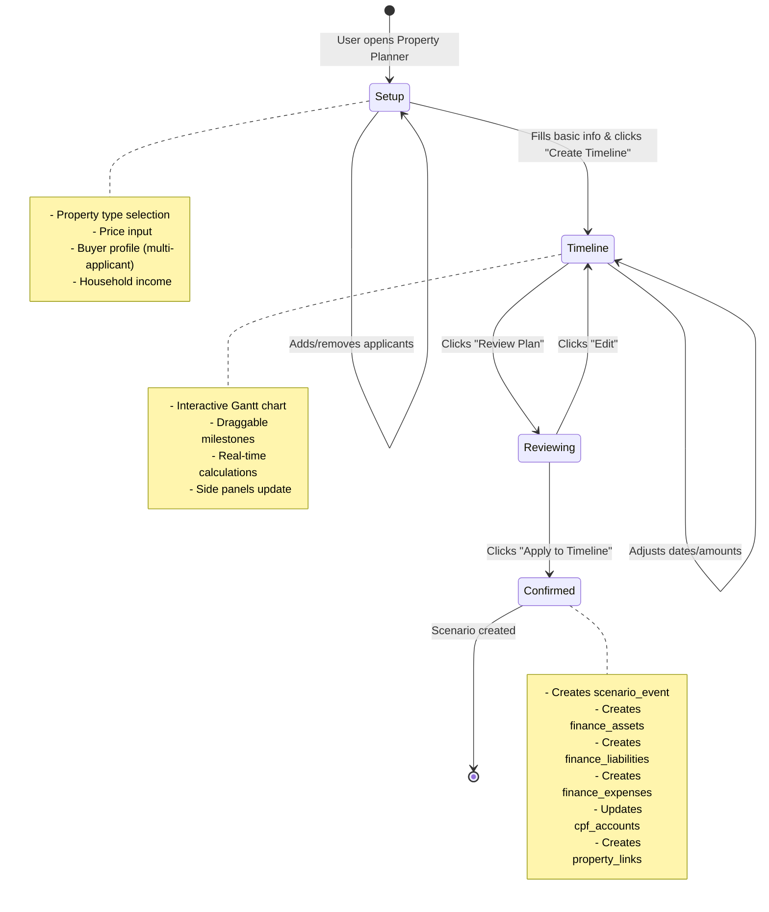

### 12.3 Data Flow: Property Purchase Confirmation

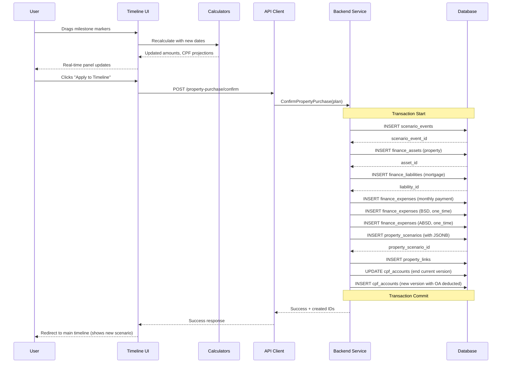

### 12.4 Entity Relationship Diagram

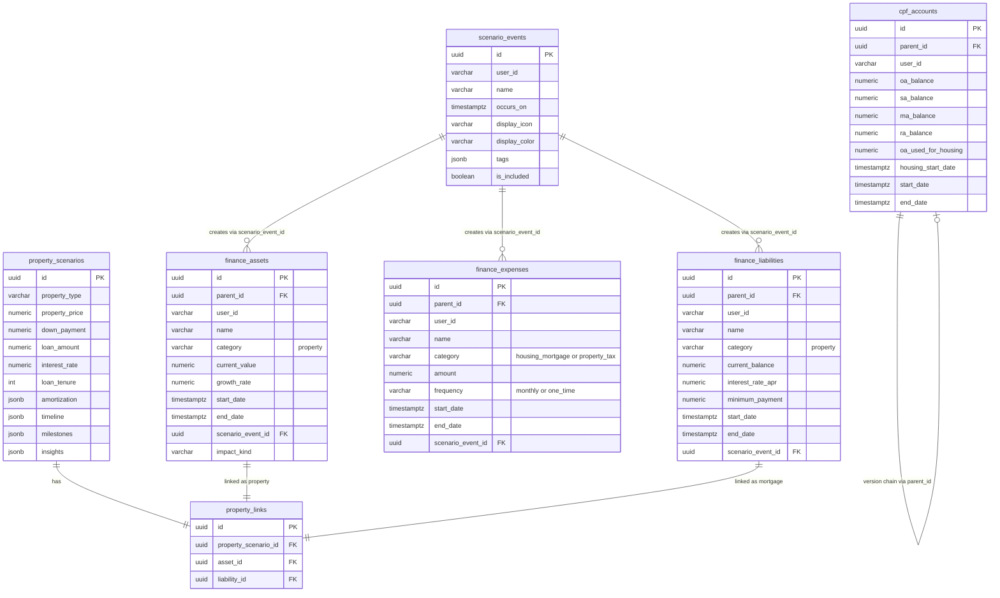

### 12.5 Component Hierarchy

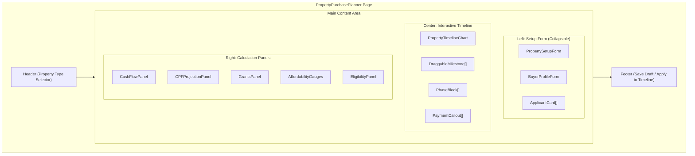

### 12.6 Calculator Function Flow

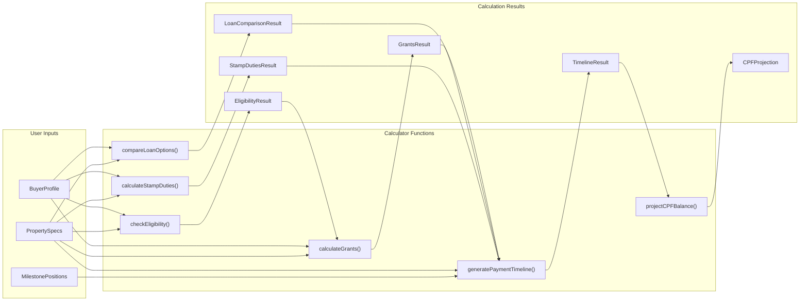

### 12.7 Milestone Drag Interaction Flow

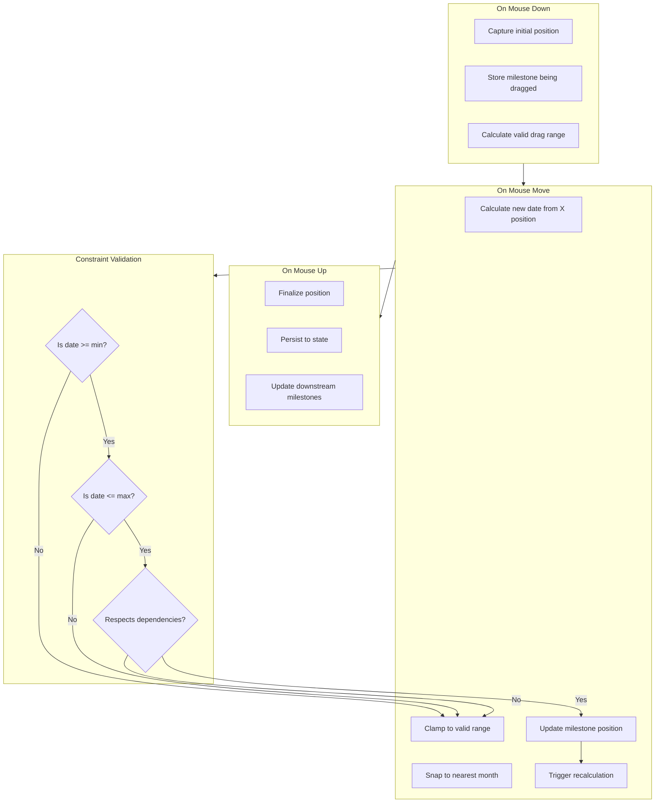

### 12.8 Property Type Timeline Templates

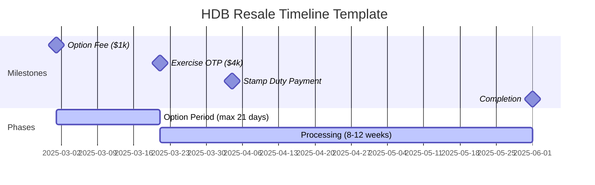

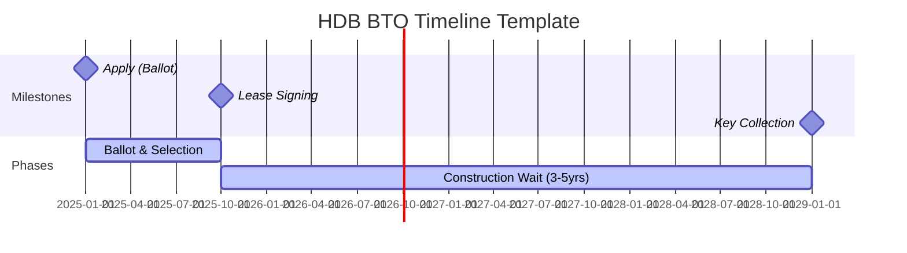

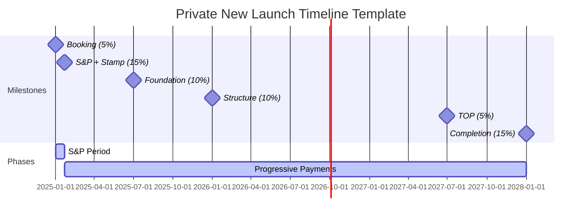

### 12.9 CPF Version Chain (for Scenario Modeling)

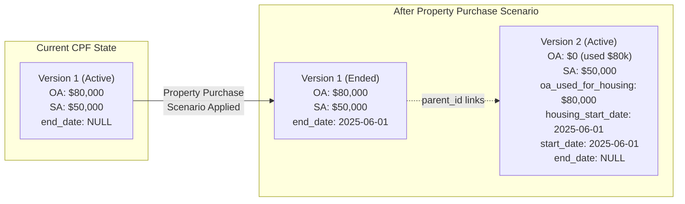

---

## 13. Mortgage Expenses & Refinancing Recording

### 13.1 How Mortgage Data is Stored

**Initial Purchase creates 3 records:**

```
┌─────────────────────────────────────────────────────────────────────┐
│                    MORTGAGE DATA STRUCTURE                           │
├─────────────────────────────────────────────────────────────────────┤
│                                                                      │
│  finance_liabilities (Loan Principal & Terms)                       │
│  ┌─────────────────────────────────────────────────────────────┐    │
│  │ id: loan-v1                                                  │    │
│  │ parent_id: loan-v1  (self-reference = root)                 │    │
│  │ name: "HDB Loan - Tampines"                                 │    │
│  │ category: "property"                                         │    │
│  │ current_balance: 375,000                                     │    │
│  │ interest_rate_apr: 2.6%                                      │    │
│  │ minimum_payment: 1,700                                       │    │
│  │ start_date: 2025-06-01                                       │    │
│  │ end_date: NULL (or 2028-06-01 for fixed period)             │    │
│  │ scenario_event_id: → links to purchase event                │    │
│  └─────────────────────────────────────────────────────────────┘    │
│                                                                      │
│  finance_expenses (Monthly Payment - tracks actual cash outflow)    │
│  ┌─────────────────────────────────────────────────────────────┐    │
│  │ id: expense-v1                                               │    │
│  │ name: "Mortgage Payment - Tampines"                         │    │
│  │ category: "housing_mortgage"                                 │    │
│  │ amount: 1,700                                                │    │
│  │ frequency: "monthly"                                         │    │
│  │ start_date: 2025-06-01                                       │    │
│  │ end_date: 2050-06-01 (loan tenure end)                      │    │
│  │ scenario_event_id: → links to purchase event                │    │
│  │ notes: "liability_id: loan-v1" (optional link)              │    │
│  └─────────────────────────────────────────────────────────────┘    │
│                                                                      │
│  property_scenarios (Amortization & Rate Schedule in JSONB)         │
│  ┌─────────────────────────────────────────────────────────────┐    │
│  │ amortization: { yearByYear: [...], totalInterest: 180000 }  │    │
│  │ timeline: { rateSchedule: [                                  │    │
│  │   { period: "2025-06 to 2028-06", rate: 2.6, type: "fixed" },│    │
│  │   { period: "2028-06 onwards", rate: 3.5, type: "floating" } │    │
│  │ ]}                                                           │    │
│  └─────────────────────────────────────────────────────────────┘    │
│                                                                      │
└─────────────────────────────────────────────────────────────────────┘
```

### 13.2 Rate Changes (Fixed → Floating Transition)

When the fixed period ends and rate changes, **create new liability version**:

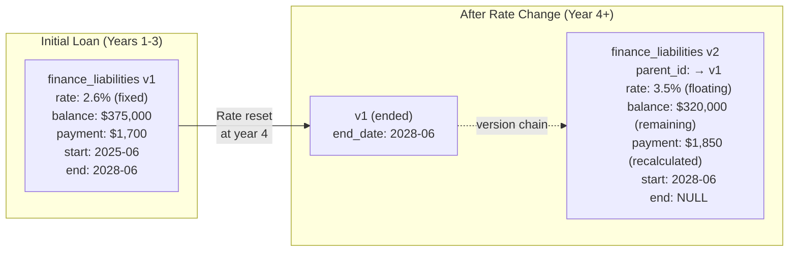

**Also create new expense version** (payment amount changed):

```sql
-- End current expense version
UPDATE finance_expenses
SET end_date = '2028-06-01'
WHERE name = 'Mortgage Payment - Tampines' AND end_date IS NULL;

-- Create new expense version with updated payment
INSERT INTO finance_expenses (
  parent_id,              -- links to original expense
  name, category,
  amount,                 -- NEW payment amount: 1850
  frequency,
  start_date,             -- 2028-06-01
  end_date                -- 2050-06-01 (or next rate change)
);
```

### 13.3 Full Refinancing (New Bank/New Loan)

Full refinancing is modeled as a **scenario event** with multiple impacts:

```typescript
// Scenario Event: "Refinance to Bank XYZ"
{
  name: "Refinance HDB Loan to DBS",
  occursOn: "2028-06-01",
  displayIcon: "refresh-cw",
  displayColor: "#10b981",
  tags: ["refinance", "property"],
  impacts: [
    // 1. STOP old loan (sets balance to 0)
    {
      impactKind: "stop",
      targetType: "liability",
      parentId: "old-loan-id",
      startMonth: "2028-06"
    },
    // 2. STOP old mortgage expense
    {
      impactKind: "stop",
      targetType: "expense",
      parentId: "old-expense-id",
      startMonth: "2028-06"
    },
    // 3. START new loan (possibly different amount for cash-out)
    {
      impactKind: "start",
      targetType: "liability",
      name: "DBS Loan - Tampines",
      amount: 350000,  // could be higher (cash-out) or lower
      interestRate: 3.2,
      minimumPayment: 1650,
      startMonth: "2028-06",
      endMonth: "2053-06"  // new 25-year tenure
    },
    // 4. START new mortgage expense
    {
      impactKind: "start",
      targetType: "expense",
      name: "DBS Mortgage Payment",
      amount: 1650,
      category: "housing_mortgage",
      frequency: "monthly",
      startMonth: "2028-06",
      endMonth: "2053-06"
    },
    // 5. One-time: Refinancing costs
    {
      impactKind: "start",
      targetType: "expense",
      name: "Refinancing Fees",
      amount: 3000,
      category: "property_fees",
      frequency: "one_time",
      startMonth: "2028-06"
    }
  ]
}
```

### 13.4 Data Flow Diagram: Refinancing

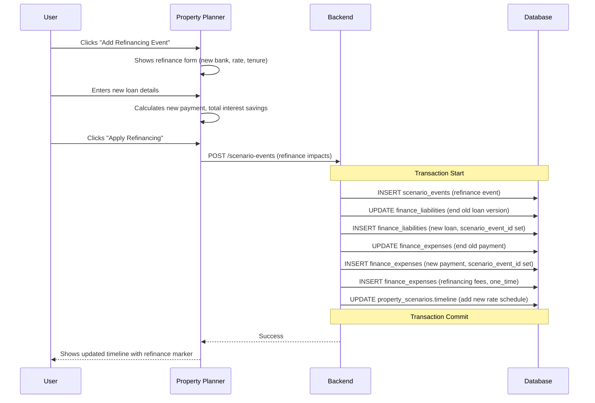

### 13.5 Rate Schedule Storage (in property_scenarios JSONB)

```json
{
  "timeline": {
    "rateSchedule": [
      {
        "id": "period-1",
        "startDate": "2025-06-01",
        "endDate": "2028-06-01",
        "rate": 2.6,
        "type": "fixed",
        "bank": "HDB",
        "liabilityVersionId": "loan-v1"
      },
      {
        "id": "period-2",
        "startDate": "2028-06-01",
        "endDate": null,
        "rate": 3.5,
        "type": "floating",
        "bank": "HDB",
        "liabilityVersionId": "loan-v2"
      }
    ],
    "refinanceEvents": [
      {
        "date": "2028-06-01",
        "type": "rate_change",
        "fromRate": 2.6,
        "toRate": 3.5,
        "scenarioEventId": null
      }
    ]
  },
  "amortization": {
    "schedule": [
      { "year": 1, "principal": 12000, "interest": 8400, "balance": 363000 },
      { "year": 2, "principal": 12300, "interest": 8100, "balance": 350700 },
      // ... continues with rate change at year 4
    ],
    "totalInterest": 185000,
    "effectiveRate": 2.95
  }
}
```

### 13.6 UI: Refinancing in Interactive Timeline

```
┌──────────────────────────────────────────────────────────────────────────────┐
│  Property Timeline                                           [HDB Resale ▼] │
├──────────────────────────────────────────────────────────────────────────────┤
│                                                                              │
│  2025      2026      2027      2028      2029      2030      2031           │
│  │         │         │         │         │         │         │              │
│  ▼ Purchase                    ▼ Rate    ▼ Refi                             │
│  │                             │ Change  │ (Optional)                        │
│  ═══════════════════════════════╪═════════╪═══════════════════════════════   │
│  │                             │         │                                   │
│  │◄─── Fixed 2.6% ────────────►│◄─ Float │◄─── New Bank 3.2% ──────────►   │
│  │        $1,700/mo            │  3.5%   │       $1,650/mo                  │
│  │                             │ $1,850  │                                   │
│                                                                              │
│  [+ Add Rate Change]  [+ Add Refinancing]                                   │
│                                                                              │
└──────────────────────────────────────────────────────────────────────────────┘
```

### 13.7 Summary: Mortgage & Refinancing Recording

| Event | How Recorded | Tables Affected |
|-------|--------------|-----------------|
| **Initial Purchase** | Scenario event with START impacts | finance_liabilities, finance_expenses, property_scenarios |
| **Rate Change (same bank)** | New versions via parent_id chain | finance_liabilities (new version), finance_expenses (new version) |
| **Full Refinancing** | Scenario event with STOP + START | finance_liabilities (stop old, start new), finance_expenses (stop old, start new) |
| **Rate Schedule** | JSONB in property_scenarios.timeline | property_scenarios |
| **Amortization** | JSONB in property_scenarios.amortization | property_scenarios |

---

## 14. Extensible Database Schema (Multi-Country Support)

### 14.1 Design Philosophy

The schema uses a **hybrid approach** combining:
- **Universal columns** for common property purchase concepts
- **JSONB columns** for country-specific rules, taxes, and grants
- **Strategy + Metadata pattern** for extensible calculation logic
- **Versioning** for timeline-aware edits and scenario modeling

This allows the same core tables to support Singapore (HDB, CPF, ABSD), US (conventional loans, PMI, property tax), UK (stamp duty, Help to Buy), Australia (negative gearing, first home buyer grants), etc.

### 14.2 Core Tables

#### Table 1: `property_purchase_plans` (Main Entity)

```sql
CREATE TABLE property_purchase_plans (
  id UUID PRIMARY KEY DEFAULT gen_random_uuid(),
  user_id VARCHAR(36) NOT NULL,

  -- Regional context
  country_code VARCHAR(2) NOT NULL DEFAULT 'SG',  -- ISO 3166-1 alpha-2
  region_code VARCHAR(10),                         -- State/province (e.g., 'CA', 'NSW')
  currency VARCHAR(3) NOT NULL DEFAULT 'SGD',      -- ISO 4217

  -- Property basics (universal)
  name VARCHAR(255) NOT NULL,                      -- User-friendly name
  property_type VARCHAR(50) NOT NULL,              -- 'hdb_bto', 'hdb_resale', 'condo', 'landed', etc.
  property_subtype VARCHAR(50),                    -- '2_room', '4_room', 'detached', etc.
  purchase_price NUMERIC(15,2) NOT NULL,
  purchase_date DATE,                              -- Target/actual completion date

  -- Financing (universal)
  down_payment_total NUMERIC(15,2),                -- Total down payment (all sources)
  loan_amount NUMERIC(15,2),
  loan_tenure_months INTEGER,

  -- Status & workflow
  status VARCHAR(20) NOT NULL DEFAULT 'draft',     -- 'draft', 'planning', 'confirmed', 'completed'

  -- Versioning (for scenario modeling)
  parent_id UUID REFERENCES property_purchase_plans(id) ON DELETE CASCADE,
  start_date TIMESTAMPTZ NOT NULL DEFAULT NOW(),
  end_date TIMESTAMPTZ,

  -- Scenario integration
  scenario_event_id UUID REFERENCES scenario_events(id) ON DELETE SET NULL,

  -- Extensible JSONB columns
  buyer_profile JSONB NOT NULL DEFAULT '{}',       -- Applicants, citizenship, ages, income
  financing_details JSONB NOT NULL DEFAULT '{}',   -- Loan types, rates, sources
  country_specific JSONB NOT NULL DEFAULT '{}',    -- Taxes, grants, regulations
  milestones JSONB NOT NULL DEFAULT '[]',          -- Timeline milestones (draggable markers)
  calculations JSONB NOT NULL DEFAULT '{}',        -- Cached calculation results

  -- Timestamps
  created_at TIMESTAMPTZ DEFAULT NOW(),
  updated_at TIMESTAMPTZ DEFAULT NOW(),

  -- Constraints
  CONSTRAINT property_purchase_plans_no_overlap EXCLUDE USING gist (
    user_id WITH =,
    COALESCE(parent_id, id) WITH =,
    tstzrange(start_date, COALESCE(end_date, 'infinity'::timestamptz), '[)') WITH &&
  )
);

-- Indexes
CREATE INDEX idx_ppp_user_id ON property_purchase_plans(user_id);
CREATE INDEX idx_ppp_user_country ON property_purchase_plans(user_id, country_code);
CREATE INDEX idx_ppp_status ON property_purchase_plans(status) WHERE status != 'completed';
CREATE INDEX idx_ppp_scenario ON property_purchase_plans(scenario_event_id) WHERE scenario_event_id IS NOT NULL;
CREATE INDEX idx_ppp_buyer_profile ON property_purchase_plans USING GIN(buyer_profile);
CREATE INDEX idx_ppp_country_specific ON property_purchase_plans USING GIN(country_specific);
```

#### Table 2: `property_tax_rates` (Reference Data)

```sql
CREATE TABLE property_tax_rates (
  id UUID PRIMARY KEY DEFAULT gen_random_uuid(),
  country_code VARCHAR(2) NOT NULL,
  region_code VARCHAR(10),                         -- NULL = country-wide
  tax_type VARCHAR(50) NOT NULL,                   -- 'stamp_duty', 'transfer_tax', 'gst', 'absd'

  -- Applicability criteria
  buyer_profile_criteria JSONB NOT NULL DEFAULT '{}',  -- citizenship, property_count, etc.
  property_criteria JSONB NOT NULL DEFAULT '{}',       -- property_type, price_range, etc.

  -- Rate structure
  rate_structure VARCHAR(20) NOT NULL,             -- 'flat', 'tiered', 'progressive'
  rate_details JSONB NOT NULL,                     -- Brackets, thresholds, percentages

  -- Validity period
  effective_from DATE NOT NULL,
  effective_to DATE,                               -- NULL = currently active

  -- Metadata
  source_reference VARCHAR(255),                   -- Government source URL
  notes TEXT,

  created_at TIMESTAMPTZ DEFAULT NOW(),
  updated_at TIMESTAMPTZ DEFAULT NOW()
);

-- Indexes
CREATE INDEX idx_ptr_country_type ON property_tax_rates(country_code, tax_type);
CREATE INDEX idx_ptr_effective ON property_tax_rates(effective_from, effective_to);
CREATE UNIQUE INDEX idx_ptr_unique_active ON property_tax_rates(country_code, region_code, tax_type, effective_from)
  WHERE effective_to IS NULL;
```

#### Table 3: `property_grant_schemes` (Reference Data)

```sql
CREATE TABLE property_grant_schemes (
  id UUID PRIMARY KEY DEFAULT gen_random_uuid(),
  country_code VARCHAR(2) NOT NULL,
  region_code VARCHAR(10),

  -- Grant identification
  scheme_code VARCHAR(50) NOT NULL,                -- 'ehg', 'family_grant', 'fhog', etc.
  scheme_name VARCHAR(255) NOT NULL,
  scheme_description TEXT,

  -- Eligibility rules (JSONB for flexibility)
  eligibility_rules JSONB NOT NULL,                -- Age, income, citizenship, property type

  -- Grant calculation
  calculation_type VARCHAR(20) NOT NULL,           -- 'fixed', 'tiered', 'percentage', 'formula'
  calculation_details JSONB NOT NULL,              -- Amount brackets, formulas, caps

  -- Stackability
  stackable_with JSONB DEFAULT '[]',               -- Other scheme_codes that can stack
  mutually_exclusive_with JSONB DEFAULT '[]',

  -- Validity
  effective_from DATE NOT NULL,
  effective_to DATE,

  -- Metadata
  application_url VARCHAR(255),
  source_reference VARCHAR(255),

  created_at TIMESTAMPTZ DEFAULT NOW(),
  updated_at TIMESTAMPTZ DEFAULT NOW()
);

-- Indexes
CREATE INDEX idx_pgs_country ON property_grant_schemes(country_code);
CREATE INDEX idx_pgs_scheme ON property_grant_schemes(scheme_code);
CREATE INDEX idx_pgs_effective ON property_grant_schemes(effective_from, effective_to);
```

#### Table 4: `property_loan_products` (Reference Data)

```sql
CREATE TABLE property_loan_products (
  id UUID PRIMARY KEY DEFAULT gen_random_uuid(),
  country_code VARCHAR(2) NOT NULL,
  region_code VARCHAR(10),

  -- Product identification
  product_code VARCHAR(50) NOT NULL,               -- 'hdb_loan', 'bank_conventional', 'fha', etc.
  product_name VARCHAR(255) NOT NULL,
  provider_type VARCHAR(50),                       -- 'government', 'bank', 'credit_union'

  -- Eligibility
  eligibility_rules JSONB NOT NULL DEFAULT '{}',   -- Citizenship, income, property type

  -- Loan terms
  ltv_limits JSONB NOT NULL,                       -- By property count, type, etc.
  tenure_limits JSONB NOT NULL,                    -- Min/max months, age-based limits
  rate_structure JSONB NOT NULL,                   -- Fixed/floating periods, rate ranges

  -- Affordability rules
  affordability_rules JSONB NOT NULL DEFAULT '{}', -- MSR, TDSR, DTI limits

  -- Cash requirements
  minimum_cash_rules JSONB DEFAULT '{}',           -- Min cash down by scenario

  -- Validity
  effective_from DATE NOT NULL,
  effective_to DATE,

  created_at TIMESTAMPTZ DEFAULT NOW(),
  updated_at TIMESTAMPTZ DEFAULT NOW()
);

-- Indexes
CREATE INDEX idx_plp_country ON property_loan_products(country_code);
CREATE INDEX idx_plp_product ON property_loan_products(product_code);
```

### 14.3 JSONB Column Schemas

#### `buyer_profile` Schema
```json
{
  "applicants": [
    {
      "id": "uuid",
      "name": "Primary Buyer",
      "relationship": "self",
      "citizenship": "citizen",          // citizen, pr, foreigner
      "residency_years": 5,              // Years of residency (for PR)
      "date_of_birth": "1990-05-15",
      "age": 34,
      "is_first_timer": true,
      "existing_properties": 0,
      "monthly_income": 8000
    }
  ],
  "household_income": 12000,
  "existing_debts": {
    "monthly_obligations": 500,
    "items": [
      { "name": "Car Loan", "monthly": 500 }
    ]
  },
  "cpf_balances": {                       // Singapore-specific, in country_specific for others
    "oa": 80000,
    "sa": 50000,
    "ma": 30000
  }
}
```

#### `financing_details` Schema
```json
{
  "loan_type": "hdb_loan",               // Maps to property_loan_products.product_code
  "interest_rate": 2.6,
  "rate_type": "fixed",                  // fixed, floating, hybrid
  "fixed_period_months": 36,
  "floating_spread": 0.5,                // For floating period

  "down_payment_breakdown": {
    "cash": 25000,
    "cpf_oa": 80000,                     // Singapore
    "grants": 50000,
    "other": 0
  },

  "rate_schedule": [
    { "from_month": 1, "to_month": 36, "rate": 2.6, "type": "fixed" },
    { "from_month": 37, "to_month": null, "rate": 3.5, "type": "floating" }
  ],

  "monthly_payment": 1700,
  "total_interest": 180000
}
```

#### `country_specific` Schema (Singapore Example)
```json
{
  "property_classification": "hdb_resale",
  "flat_type": "4_room",
  "town": "Tampines",
  "location_tier": "non_mature",         // non_mature, mature, prime, plus

  "eligibility": {
    "scheme": "public_scheme",           // public_scheme, singles_scheme, etc.
    "income_ceiling_applicable": true,
    "income_ceiling": 14000,
    "wait_out_period_months": 15,
    "wait_out_end_date": "2026-06-01"
  },

  "stamp_duties": {
    "bsd": 9600,
    "bsd_breakdown": [
      { "bracket": "0-180000", "rate": 0.01, "amount": 1800 },
      { "bracket": "180001-360000", "rate": 0.02, "amount": 3600 },
      { "bracket": "360001-500000", "rate": 0.03, "amount": 4200 }
    ],
    "absd": 0,
    "absd_rate": 0,
    "absd_reason": "First property, citizen"
  },

  "grants": {
    "eligible": ["ehg", "family_grant", "phg"],
    "applied": [
      { "scheme": "ehg", "amount": 80000 },
      { "scheme": "family_grant", "amount": 50000 }
    ],
    "total": 130000
  },

  "cpf_usage": {
    "oa_for_downpayment": 80000,
    "oa_for_monthly": true,
    "accrued_interest_rate": 2.5,
    "accrued_interest_projected": 120000  // At sale in 25 years
  },

  "mop": {
    "duration_years": 5,
    "start_date": "2025-06-01",
    "end_date": "2030-06-01"
  }
}
```

#### `country_specific` Schema (US Example)
```json
{
  "state": "CA",
  "county": "San Francisco",
  "property_classification": "single_family",

  "loan_details": {
    "loan_type": "conventional",
    "conforming": true,
    "points": 1.5,
    "origination_fee": 2500
  },

  "taxes": {
    "property_tax_rate": 0.012,
    "annual_property_tax": 6000,
    "transfer_tax": 5500,
    "recording_fees": 150
  },

  "insurance": {
    "pmi_required": true,
    "pmi_monthly": 150,
    "pmi_removal_ltv": 0.80,
    "homeowners_annual": 1800
  },

  "tax_benefits": {
    "mortgage_interest_deductible": true,
    "property_tax_deductible": true,
    "salt_cap": 10000
  },

  "first_time_buyer": {
    "eligible_programs": ["fha", "conventional_97"],
    "down_payment_assistance": 0
  }
}
```

#### `milestones` Schema
```json
[
  {
    "id": "otp",
    "name": "Option Fee",
    "date": "2025-03-01",
    "amount": 1000,
    "payment_type": "cash",
    "is_draggable": true,
    "min_date": "2025-01-01",
    "max_date": null,
    "depends_on": null
  },
  {
    "id": "exercise",
    "name": "Exercise OTP",
    "date": "2025-03-21",
    "amount": 4000,
    "payment_type": "cash",
    "is_draggable": true,
    "min_date": null,
    "max_date": null,
    "max_days_from": { "milestone": "otp", "days": 21 },
    "depends_on": "otp"
  },
  {
    "id": "stamp_duty",
    "name": "Stamp Duty",
    "date": "2025-04-04",
    "amount": 9600,
    "payment_type": "cash",
    "is_draggable": true,
    "max_days_from": { "milestone": "exercise", "days": 14 },
    "depends_on": "exercise"
  },
  {
    "id": "completion",
    "name": "Completion",
    "date": "2025-06-01",
    "amount": 115000,
    "payment_type": "mixed",
    "payment_breakdown": { "cash": 35000, "cpf": 80000 },
    "is_draggable": true,
    "min_weeks_from": { "milestone": "exercise", "weeks": 8 },
    "depends_on": "exercise"
  }
]
```

### 14.4 Sample Reference Data (Singapore)

#### Stamp Duty Rates
```sql
INSERT INTO property_tax_rates (country_code, tax_type, rate_structure, rate_details, effective_from) VALUES
-- BSD (Buyer's Stamp Duty) - Current rates
('SG', 'bsd', 'tiered', '{
  "brackets": [
    { "from": 0, "to": 180000, "rate": 0.01 },
    { "from": 180001, "to": 360000, "rate": 0.02 },
    { "from": 360001, "to": 1000000, "rate": 0.03 },
    { "from": 1000001, "to": 1500000, "rate": 0.04 },
    { "from": 1500001, "to": 3000000, "rate": 0.05 },
    { "from": 3000001, "to": null, "rate": 0.06 }
  ]
}', '2023-02-15'),

-- ABSD (Additional Buyer's Stamp Duty) - By buyer profile
('SG', 'absd', 'flat', '{
  "rates_by_profile": {
    "citizen_first": 0,
    "citizen_second": 0.20,
    "citizen_third_plus": 0.30,
    "pr_first": 0.05,
    "pr_second": 0.30,
    "pr_third_plus": 0.35,
    "foreigner_any": 0.60,
    "entity_any": 0.65
  }
}', '2024-04-27');
```

#### Grant Schemes
```sql
INSERT INTO property_grant_schemes (country_code, scheme_code, scheme_name, eligibility_rules, calculation_type, calculation_details, effective_from) VALUES
-- Enhanced CPF Housing Grant (EHG)
('SG', 'ehg', 'Enhanced CPF Housing Grant', '{
  "property_types": ["hdb_bto", "hdb_resale"],
  "citizenship": ["citizen"],
  "first_timer_required": true,
  "income_ceiling": 9000,
  "age_min": 21
}', 'tiered', '{
  "brackets": [
    { "income_max": 1500, "amount": 80000 },
    { "income_max": 2000, "amount": 75000 },
    { "income_max": 2500, "amount": 70000 },
    { "income_max": 3000, "amount": 65000 },
    { "income_max": 3500, "amount": 60000 },
    { "income_max": 4000, "amount": 55000 },
    { "income_max": 4500, "amount": 50000 },
    { "income_max": 5000, "amount": 45000 },
    { "income_max": 5500, "amount": 40000 },
    { "income_max": 6000, "amount": 35000 },
    { "income_max": 6500, "amount": 30000 },
    { "income_max": 7000, "amount": 25000 },
    { "income_max": 7500, "amount": 20000 },
    { "income_max": 8000, "amount": 15000 },
    { "income_max": 8500, "amount": 10000 },
    { "income_max": 9000, "amount": 5000 }
  ]
}', '2019-09-11'),

-- Family Grant (Resale)
('SG', 'family_grant', 'CPF Housing Grant (Family)', '{
  "property_types": ["hdb_resale"],
  "first_timer_required": true,
  "family_nucleus_required": true,
  "income_ceiling": 14000
}', 'tiered', '{
  "by_citizenship": {
    "citizen_citizen": 80000,
    "citizen_pr": 70000
  }
}', '2019-09-11'),

-- Proximity Housing Grant
('SG', 'phg', 'Proximity Housing Grant', '{
  "property_types": ["hdb_bto", "hdb_resale"],
  "proximity_requirement": true
}', 'tiered', '{
  "living_with_parents": 30000,
  "living_near_parents": 20000,
  "near_definition_km": 4
}', '2015-08-01');
```

### 14.5 Migration File

```sql
-- Migration: YYYYMMDD_create_property_purchase_tables.up.sql

-- Enable required extensions
CREATE EXTENSION IF NOT EXISTS btree_gist;

-- Table 1: property_purchase_plans
CREATE TABLE IF NOT EXISTS property_purchase_plans (
  id UUID PRIMARY KEY DEFAULT gen_random_uuid(),
  user_id VARCHAR(36) NOT NULL,

  country_code VARCHAR(2) NOT NULL DEFAULT 'SG',
  region_code VARCHAR(10),
  currency VARCHAR(3) NOT NULL DEFAULT 'SGD',

  name VARCHAR(255) NOT NULL,
  property_type VARCHAR(50) NOT NULL,
  property_subtype VARCHAR(50),
  purchase_price NUMERIC(15,2) NOT NULL,
  purchase_date DATE,

  down_payment_total NUMERIC(15,2),
  loan_amount NUMERIC(15,2),
  loan_tenure_months INTEGER,

  status VARCHAR(20) NOT NULL DEFAULT 'draft',

  parent_id UUID REFERENCES property_purchase_plans(id) ON DELETE CASCADE,
  start_date TIMESTAMPTZ NOT NULL DEFAULT NOW(),
  end_date TIMESTAMPTZ,

  scenario_event_id UUID REFERENCES scenario_events(id) ON DELETE SET NULL,

  buyer_profile JSONB NOT NULL DEFAULT '{}',
  financing_details JSONB NOT NULL DEFAULT '{}',
  country_specific JSONB NOT NULL DEFAULT '{}',
  milestones JSONB NOT NULL DEFAULT '[]',
  calculations JSONB NOT NULL DEFAULT '{}',

  created_at TIMESTAMPTZ DEFAULT NOW(),
  updated_at TIMESTAMPTZ DEFAULT NOW(),

  CONSTRAINT property_purchase_plans_no_overlap EXCLUDE USING gist (
    user_id WITH =,
    COALESCE(parent_id, id) WITH =,
    tstzrange(start_date, COALESCE(end_date, 'infinity'::timestamptz), '[)') WITH &&
  )
);

CREATE INDEX idx_ppp_user_id ON property_purchase_plans(user_id);
CREATE INDEX idx_ppp_user_country ON property_purchase_plans(user_id, country_code);
CREATE INDEX idx_ppp_status ON property_purchase_plans(status) WHERE status != 'completed';
CREATE INDEX idx_ppp_scenario ON property_purchase_plans(scenario_event_id) WHERE scenario_event_id IS NOT NULL;
CREATE INDEX idx_ppp_buyer_profile ON property_purchase_plans USING GIN(buyer_profile);
CREATE INDEX idx_ppp_country_specific ON property_purchase_plans USING GIN(country_specific);

-- Table 2: property_tax_rates
CREATE TABLE IF NOT EXISTS property_tax_rates (
  id UUID PRIMARY KEY DEFAULT gen_random_uuid(),
  country_code VARCHAR(2) NOT NULL,
  region_code VARCHAR(10),
  tax_type VARCHAR(50) NOT NULL,

  buyer_profile_criteria JSONB NOT NULL DEFAULT '{}',
  property_criteria JSONB NOT NULL DEFAULT '{}',

  rate_structure VARCHAR(20) NOT NULL,
  rate_details JSONB NOT NULL,

  effective_from DATE NOT NULL,
  effective_to DATE,

  source_reference VARCHAR(255),
  notes TEXT,

  created_at TIMESTAMPTZ DEFAULT NOW(),
  updated_at TIMESTAMPTZ DEFAULT NOW()
);

CREATE INDEX idx_ptr_country_type ON property_tax_rates(country_code, tax_type);
CREATE INDEX idx_ptr_effective ON property_tax_rates(effective_from, effective_to);
CREATE UNIQUE INDEX idx_ptr_unique_active ON property_tax_rates(country_code, COALESCE(region_code, ''), tax_type, effective_from)
  WHERE effective_to IS NULL;

-- Table 3: property_grant_schemes
CREATE TABLE IF NOT EXISTS property_grant_schemes (
  id UUID PRIMARY KEY DEFAULT gen_random_uuid(),
  country_code VARCHAR(2) NOT NULL,
  region_code VARCHAR(10),

  scheme_code VARCHAR(50) NOT NULL,
  scheme_name VARCHAR(255) NOT NULL,
  scheme_description TEXT,

  eligibility_rules JSONB NOT NULL,

  calculation_type VARCHAR(20) NOT NULL,
  calculation_details JSONB NOT NULL,

  stackable_with JSONB DEFAULT '[]',
  mutually_exclusive_with JSONB DEFAULT '[]',

  effective_from DATE NOT NULL,
  effective_to DATE,

  application_url VARCHAR(255),
  source_reference VARCHAR(255),

  created_at TIMESTAMPTZ DEFAULT NOW(),
  updated_at TIMESTAMPTZ DEFAULT NOW()
);

CREATE INDEX idx_pgs_country ON property_grant_schemes(country_code);
CREATE INDEX idx_pgs_scheme ON property_grant_schemes(scheme_code);
CREATE INDEX idx_pgs_effective ON property_grant_schemes(effective_from, effective_to);

-- Table 4: property_loan_products
CREATE TABLE IF NOT EXISTS property_loan_products (
  id UUID PRIMARY KEY DEFAULT gen_random_uuid(),
  country_code VARCHAR(2) NOT NULL,
  region_code VARCHAR(10),

  product_code VARCHAR(50) NOT NULL,
  product_name VARCHAR(255) NOT NULL,
  provider_type VARCHAR(50),

  eligibility_rules JSONB NOT NULL DEFAULT '{}',

  ltv_limits JSONB NOT NULL,
  tenure_limits JSONB NOT NULL,
  rate_structure JSONB NOT NULL,

  affordability_rules JSONB NOT NULL DEFAULT '{}',
  minimum_cash_rules JSONB DEFAULT '{}',

  effective_from DATE NOT NULL,
  effective_to DATE,

  created_at TIMESTAMPTZ DEFAULT NOW(),
  updated_at TIMESTAMPTZ DEFAULT NOW()
);

CREATE INDEX idx_plp_country ON property_loan_products(country_code);
CREATE INDEX idx_plp_product ON property_loan_products(product_code);
```

### 14.6 Benefits of This Design

| Benefit | How Achieved |
|---------|--------------|
| **Multi-country support** | `country_code` + `region_code` fields, reference tables per country |
| **Extensible calculations** | JSONB `rate_details`, `eligibility_rules`, `calculation_details` |
| **Version history** | `parent_id` + `start_date` + `end_date` with exclusion constraints |
| **Scenario integration** | `scenario_event_id` links to existing scenario system |
| **Tax rule updates** | `effective_from`/`effective_to` on reference tables |
| **Grant stacking logic** | `stackable_with` / `mutually_exclusive_with` arrays |
| **Loan product comparison** | Separate `property_loan_products` table with eligibility rules |
| **Timeline milestones** | JSONB `milestones` array with drag constraints |
| **Cached calculations** | JSONB `calculations` to avoid recomputing |

---

## 15. Summary: User Requirements Confirmed

| Requirement | Decision |
|-------------|----------|
| **Visual Approach** | Interactive Gantt-chart timeline with draggable markers |
| **CPF Integration** | Full integration with OA tracking, accrued interest |
| **Property Types** | HDB BTO, HDB Resale, Private (New/Resale), EC |
| **Applicants** | Multi-applicant support (1-4 joint buyers) |
| **Visualizations** | Timeline + Affordability gauges + Grant bars + Cash flow panel |
| **Integration** | Generates scenario events for main financial timeline |
| **Database** | Extensible schema with country_code + JSONB for multi-country support |
| **Mortgage/Refinancing** | Versioned liabilities + scenario events for rate changes |

---

## 16. Implementation Priority: Backend Building Blocks

### Phase 0: Database Foundation (First Priority)

| Order | Task | Description |
|-------|------|-------------|
| 1 | **Migration: property_purchase_plans** | Main entity table with JSONB columns |
| 2 | **Migration: property_tax_rates** | Reference data for stamp duties, ABSD, etc. |
| 3 | **Migration: property_grant_schemes** | Reference data for grants (EHG, Family Grant, etc.) |
| 4 | **Migration: property_loan_products** | Reference data for loan products (HDB Loan, Bank Loan) |
| 5 | **Seed: Singapore reference data** | BSD rates, ABSD rates, grants, loan products |

### Phase 1: Backend Repository & Types

| Order | Task | Files |
|-------|------|-------|
| 1 | **Go types for property purchase** | `internal/financial_v2/property/types.go` |
| 2 | **Repository CRUD** | `internal/financial_v2/property/repository.go` |
| 3 | **Reference data queries** | Tax rates, grants, loan products by country |

### Phase 2: Calculator Services

| Order | Task | Files |
|-------|------|-------|
| 1 | **Stamp duty calculator** | `internal/financial_v2/property/stamp_duty.go` |
| 2 | **Grant calculator** | `internal/financial_v2/property/grants.go` |
| 3 | **Eligibility validator** | `internal/financial_v2/property/eligibility.go` |
| 4 | **Affordability calculator** | `internal/financial_v2/property/affordability.go` |
| 5 | **CPF housing calculator** | `internal/financial_v2/property/cpf_housing.go` |

### Phase 3: HTTP Handlers

| Order | Task | Files |
|-------|------|-------|
| 1 | **CRUD handlers** | `handlers/property_purchase.go` |
| 2 | **Calculator endpoints** | `/api/v2/property-purchase/calculate` |
| 3 | **Scenario generation** | `/api/v2/property-purchase/confirm` |

---

## 17. Files to Create/Modify

### Backend - New Files
```
backend/
├── migrations/
│   ├── 20251222001_create_property_purchase_plans.up.sql
│   ├── 20251222002_create_property_tax_rates.up.sql
│   ├── 20251222003_create_property_grant_schemes.up.sql
│   ├── 20251222004_create_property_loan_products.up.sql
│   └── 20251222005_seed_singapore_property_data.up.sql
│
├── internal/financial_v2/property/
│   ├── types.go              # Go structs matching DB schema
│   ├── repository.go         # CRUD operations
│   ├── service.go            # Business logic orchestration
│   ├── stamp_duty.go         # Stamp duty calculator
│   ├── grants.go             # Grant eligibility & calculation
│   ├── eligibility.go        # Buyer eligibility validation
│   ├── affordability.go      # MSR/TDSR/LTV checks
│   └── cpf_housing.go        # CPF withdrawal & accrued interest
│
└── cmd/server/handlers/
    └── property_purchase.go  # HTTP handlers
```

### Frontend - New Files (Phase 2)
```
frontend/src/
├── types/propertyPurchase.ts
├── lib/propertyCalculators/
├── components/property-purchase/
└── hooks/usePropertyCalculations.ts
```
