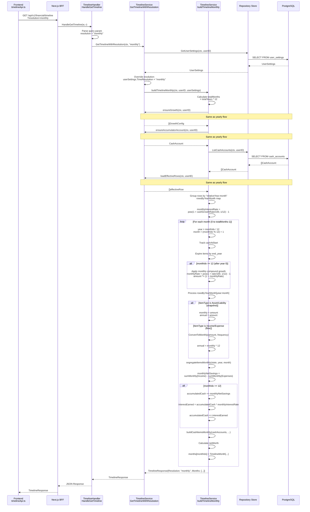
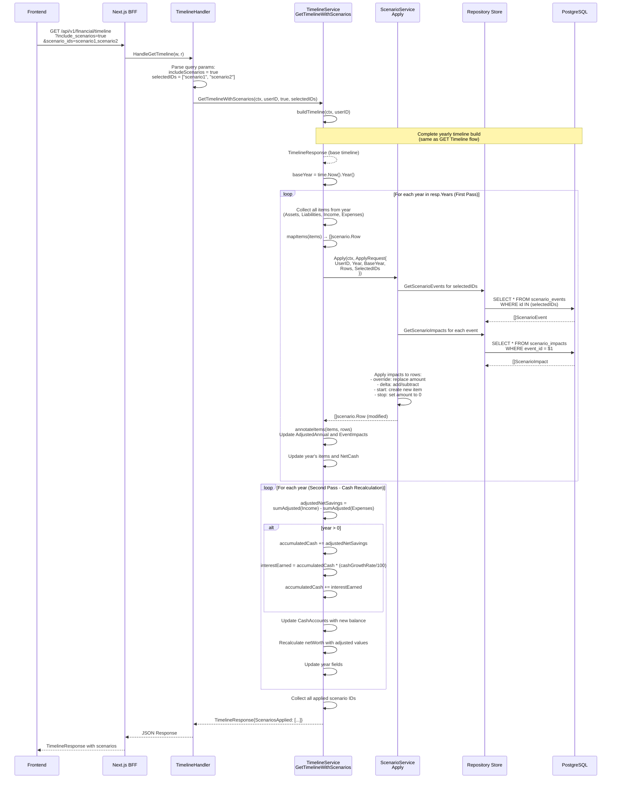
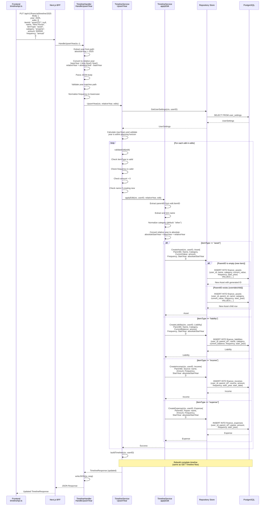
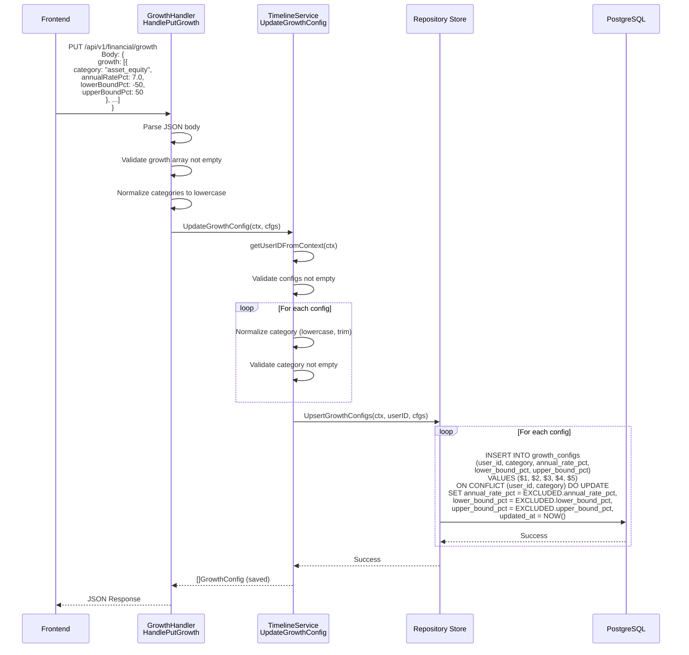
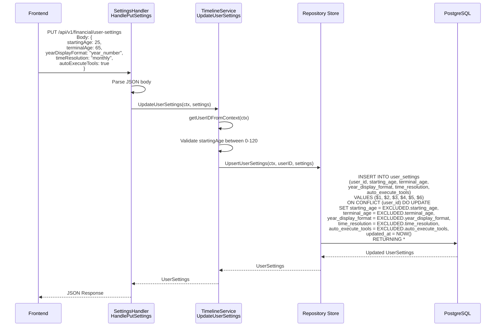
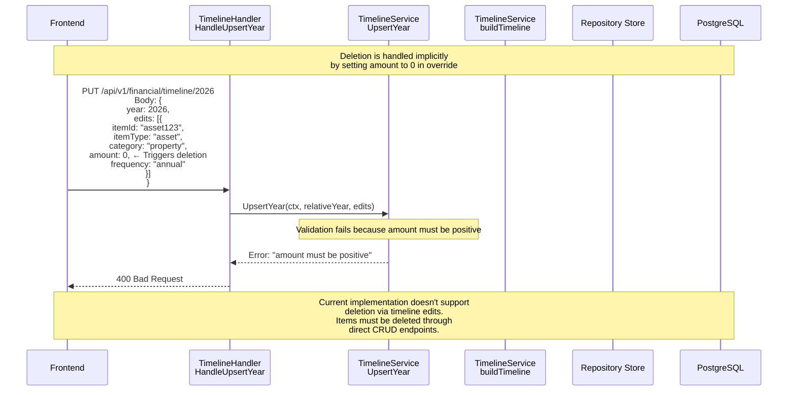
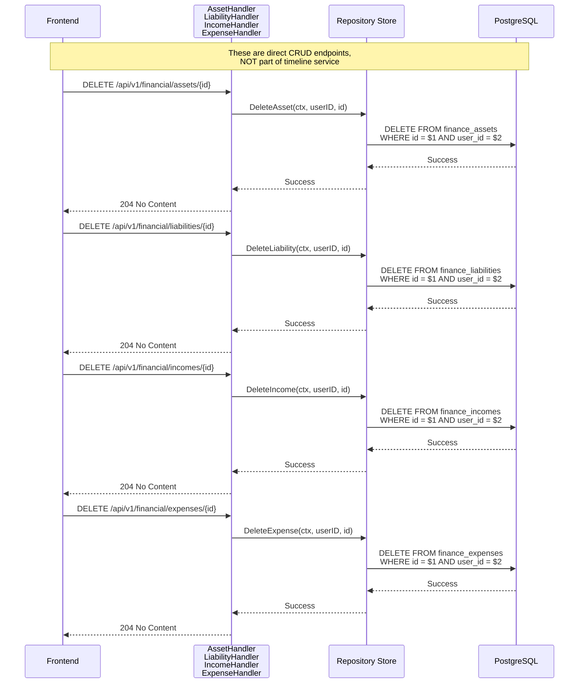

```mermaid
sequenceDiagram
    participant FE as Frontend<br/>timelineApi.ts
    participant Next as Next.js BFF<br/>/api/v1
    participant Handler as TimelineHandler<br/>HandleGetTimeline
    participant Service as TimelineService<br/>GetTimeline
    participant Build as TimelineService<br/>buildTimeline
    participant Repo as Repository Store<br/>store.go
    participant DB as PostgreSQL

    FE->>Next: GET /api/v1/financial/timeline
    Next->>Handler: HandleGetTimeline(w, r)
    Handler->>Handler: Extract user context<br/>from middleware
    Handler->>Service: GetTimeline(ctx)
    Service->>Service: getUserIDFromContext(ctx)
    Service->>Build: buildTimeline(ctx, userID)

    Build->>Repo: GetUserSettings(ctx, userID)
    Repo->>DB: SELECT FROM user_settings<br/>WHERE user_id = $1
    DB-->>Repo: UserSettings or defaults
    Repo-->>Build: UserSettings

    Build->>Build: Calculate totalYears from<br/>TerminalAge - StartingAge + 1

    Build->>Service: ensureGrowth(ctx, userID)
    Service->>Repo: GetGrowthConfigs(ctx, userID)
    Repo->>DB: SELECT FROM growth_configs<br/>WHERE user_id = $1
    DB-->>Repo: GrowthConfigs or empty
    Repo-->>Service: []GrowthConfig

    alt No growth configs exist
        Service->>Repo: UpsertGrowthConfigs(ctx, userID, defaults)
        Repo->>DB: INSERT INTO growth_configs
        DB-->>Repo: Success
    end
    Service-->>Build: []GrowthConfig

    Build->>Service: ensureAccumulatorAccount(ctx, userID)
    Service->>Repo: GetAccumulatorAccount(ctx, userID)
    Repo->>DB: SELECT FROM cash_accounts<br/>WHERE user_id = $1<br/>AND is_accumulator = true

    alt No accumulator found
        Service->>Repo: ListCashAccounts(ctx, userID)
        Repo->>DB: SELECT FROM cash_accounts
        DB-->>Repo: []CashAccount

        alt No cash accounts exist
            Service->>Repo: CreateCashAccount(ctx, defaultAccount)
            Repo->>DB: INSERT INTO cash_accounts
            DB-->>Repo: CashAccount
        else Cash accounts exist
            Service->>Repo: SetAccumulatorAccount(ctx, userID, firstAccountID)
            Repo->>DB: UPDATE cash_accounts<br/>SET is_accumulator = true
        end
    end
    Service-->>Build: CashAccount (accumulator)

    Build->>Repo: ListCashAccounts(ctx, userID)
    Repo->>DB: SELECT FROM cash_accounts<br/>WHERE user_id = $1
    DB-->>Repo: []CashAccount
    Repo-->>Build: []CashAccount

    Build->>Service: loadEffectiveRows(ctx, userID)
    Service->>Repo: ListAllAssets(ctx, userID)
    Repo->>DB: SELECT * FROM finance_assets<br/>WHERE user_id = $1
    DB-->>Repo: []Asset

    Service->>Repo: ListAllLiabilities(ctx, userID)
    Repo->>DB: SELECT * FROM finance_liabilities<br/>WHERE user_id = $1
    DB-->>Repo: []Liability

    Service->>Repo: ListAllIncomes(ctx, userID)
    Repo->>DB: SELECT * FROM finance_incomes<br/>WHERE user_id = $1
    DB-->>Repo: []Income

    Service->>Repo: ListAllExpenses(ctx, userID)
    Repo->>DB: SELECT * FROM finance_expenses<br/>WHERE user_id = $1
    DB-->>Repo: []Expense

    Service-->>Build: []effectiveRow (all financial items)

    Build->>Build: Convert absolute years to relative<br/>baseYear = time.Now().Year()<br/>relativeYear = StartYear - baseYear

    Build->>Build: Initialize state map and<br/>accumulatedCash from accumulator.Balance

    loop For each year (0 to totalYears-1)
        Build->>Build: Track cashAtStart
        Build->>Build: Expire items by end_year

        alt year > 0
            Build->>Build: Apply growth to all items<br/>rate = lookupGrowthRate(growthCfg, category, itemType)<br/>amount = applyGrowth(amount, rate)
        end

        Build->>Build: Process rowsByYear[year]<br/>for new/override items

        alt Amount == 0 (deletion)
            Build->>Build: delete(state, ParentID)
        else New/Override item
            Build->>Build: Annualize(amount, frequency)
            Build->>Build: state[ParentID] = itemState{...}
        end

        Build->>Build: segregateItems(state, year)<br/>→ Assets, Liabilities, Income, Expenses

        Build->>Build: Calculate annualNetSavings<br/>= sumAnnual(Income) - sumAnnual(Expenses)

        alt year > 0
            Build->>Build: accumulatedCash += annualNetSavings
            Build->>Build: interestEarned = accumulatedCash * (cashGrowthRate/100)
            Build->>Build: accumulatedCash += interestEarned
        end

        Build->>Build: buildCashItems(cashAccounts, accumulator.ID, accumulatedCash, year)
        Build->>Build: Calculate netWorth<br/>= totalAssets + totalCash - totalLiabilities

        Build->>Build: years[year] = TimelineYear{...}
    end

    Build-->>Service: TimelineResponse{Resolution: "yearly", Years: [...]}
    Service-->>Handler: TimelineResponse
    Handler->>Handler: writeJSON(w, resp)
    Handler-->>Next: JSON Response
    Next-->>FE: TimelineResponse
```

# Timeline Service Flow Analysis - Complete CRUD Mapping

**Generated:** 2025-12-05
**Purpose:** Deep dive into all flows that touch timeline service.go, mapping ALL functions for ALL CRUD operations

---

## Table of Contents

1. [READ Operations](#read-operations)
   - [GET Timeline (Basic - Yearly)](#1-get-timeline-basic---yearly-resolution)
   - [GET Timeline with Resolution Override (Monthly)](#2-get-timeline-with-resolution-override-monthly)
   - [GET Timeline with Scenarios](#3-get-timeline-with-scenarios)
2. [CREATE Operations](#create-operations-via-timeline)
   - [PUT Timeline Year - Create/Update Items](#4-put-timeline-year---createupdate-items)
3. [UPDATE Operations](#update-operations)
   - [Update Growth Configs](#5-update-growth-configs)
   - [Update User Settings](#6-update-user-settings)
4. [DELETE Operations](#delete-operations)
   - [Delete Item via Timeline](#7-delete-item-via-timeline-amount--0)
   - [Direct Delete Operations](#8-direct-crud-delete-operations-not-timeline-service)
5. [Summary](#summary-of-all-timeline-service-functions)
6. [Critical Issues](#critical-issues-found)

---

## READ Operations

### 1. GET Timeline (Basic) - Yearly Resolution

**Endpoint:** `GET /api/v1/financial/timeline`

**Frontend Call:**
```typescript
timelineApi.getTimeline() // frontend/src/services/timelineApi.ts:39
```

**Flow:**



**Key Functions:**
- `TimelineHandler.HandleGetTimeline` (backend/cmd/server/handlers/timeline.go:49)
- `TimelineService.GetTimeline` (backend/internal/financial/timeline/service.go:50)
- `TimelineService.buildTimeline` (backend/internal/financial/timeline/service.go:503)
- `TimelineService.loadEffectiveRows` (backend/internal/financial/timeline/service.go:1080)
- `TimelineService.ensureGrowth` (backend/internal/financial/timeline/service.go:1191)
- `TimelineService.ensureAccumulatorAccount` (backend/internal/financial/timeline/service.go:1207)

---

### 2. GET Timeline with Resolution Override (Monthly)

**Endpoint:** `GET /api/v1/financial/timeline?resolution=monthly`

**Frontend Call:**
```typescript
timelineApi.getTimeline({ resolution: 'monthly' }) // frontend/src/services/timelineApi.ts:39
```

**Flow:**



**Key Functions:**
- `TimelineService.GetTimelineWithResolution` (backend/internal/financial/timeline/service.go:58)
- `TimelineService.buildTimelineMonthly` (backend/internal/financial/timeline/service.go:685)
- `TimelineService.segregateItemsMonthly` (backend/internal/financial/timeline/service.go:922)
- `TimelineService.buildCashItemsMonthly` (backend/internal/financial/timeline/service.go:976)

**Key Differences from Yearly:**
- Generates 420 months (35 years × 12) instead of 31 years
- Uses monthly compound growth: `monthlyRate = pow(1 + rate/100, 1/12) - 1`
- Snapshots (assets/liabilities) use same value for monthly and annual
- Flows (income/expenses) are converted: `monthly = amount * frequency_factor / 12`

---

### 3. GET Timeline with Scenarios

**Endpoint:** `GET /api/v1/financial/timeline?include_scenarios=true&scenario_ids=scenario1,scenario2`

**Frontend Call:**
```typescript
timelineApi.getTimeline({
  includeScenarios: true,
  scenarioIds: ['scenario1', 'scenario2']
})
```

**Flow:**



**Key Functions:**
- `TimelineService.GetTimelineWithScenarios` (backend/internal/financial/timeline/service.go:243)
- `ScenarioService.Apply` (backend/internal/financial/scenario/service.go)
- `TimelineService.mapItems` (backend/internal/financial/timeline/service.go:1442)
- `TimelineService.annotateItems` (backend/internal/financial/timeline/service.go:1454)

**Important Notes:**
- **Two-pass algorithm**: First pass applies scenarios to items, second pass recalculates cash accumulation
- Scenarios can impact retirement income, causing dramatic changes in cash flow
- `EventImpacts` array on each item shows which scenarios affected it

---

## CREATE Operations (via Timeline)

### 4. PUT Timeline Year - Create/Update Items

**Endpoint:** `PUT /api/v1/financial/timeline/{year}`

**Frontend Call:**
```typescript
timelineApi.putTimeline(2025, {
  year: 2025,
  edits: [{
    itemId: "asset123" | null,  // null = new item
    name: "New House",
    itemType: "asset",
    category: "property",
    amount: 500000,
    frequency: "annual"
  }]
})
```

**Flow:**



**Key Functions:**
- `TimelineHandler.HandleUpsertYear` (backend/cmd/server/handlers/timeline.go:109)
- `TimelineService.UpsertYear` (backend/internal/financial/timeline/service.go:365)
- `TimelineService.applyEdit` (backend/internal/financial/timeline/service.go:413)
- `TimelineService.validateEdit` (backend/internal/financial/timeline/service.go:397)

**Key Behaviors:**
- **New Item:** `itemId: null` creates a brand new financial item
- **Override/Child:** `itemId: "existing-id"` creates a child row with `parent_id` set, overriding parent for that year
- **Year Conversion:** Frontend sends absolute year (2025), backend converts to relative (0, 1, 2, ...)
- **Always Rebuilds:** After any edit, the entire timeline is rebuilt and returned

---

## UPDATE Operations

### 5. Update Growth Configs

**Endpoint:** `PUT /api/v1/financial/growth`

**Flow:**



**Key Functions:**
- `GrowthHandler.HandlePutGrowth` (backend/cmd/server/handlers/timeline.go:182)
- `TimelineService.UpdateGrowthConfig` (backend/internal/financial/timeline/service.go:1258)
- `Repository.UpsertGrowthConfigs` (backend/internal/financial/repository/timeline.go:116)

**Default Growth Rates:**
```go
asset_cash:       1.5%
asset_equity:     6.0%
asset_property:   3.0%
liability_debt:  -3.0%  // negative = paying down
income:           3.0%
expense:          2.0%
```

---

### 6. Update User Settings

**Endpoint:** `PUT /api/v1/financial/user-settings`

**Flow:**



**Key Functions:**
- `SettingsHandler.HandlePutSettings` (backend/cmd/server/handlers/timeline.go:225)
- `TimelineService.UpdateUserSettings` (backend/internal/financial/timeline/service.go:1290)
- `Repository.UpsertUserSettings` (backend/internal/financial/repository/timeline.go:252)

**User Settings Fields:**
- `startingAge`: Current age (default: 30)
- `terminalAge`: Planning horizon end age (default: 65)
- `yearDisplayFormat`: "year_number" or "age"
- `timeResolution`: "yearly" or "monthly" (affects default timeline view)
- `autoExecuteTools`: Enable auto-execution of AI tools (default: false)

---

## DELETE Operations

### 7. Delete Item via Timeline (Amount = 0)

**⚠️ BROKEN - This does NOT work!**

**Attempted Flow:**



**Why It's Broken:**

1. In `buildTimeline` (line 594), there's logic to handle `amount == 0`:
   ```go
   if r.Amount == 0 {
       delete(state, r.ParentID)  // Remove from timeline state
       hasOverride = true
       continue
   }
   ```

2. BUT in `validateEdit` (line 404), it rejects zero amounts:
   ```go
   if edit.Amount <= 0 {
       return errors.New("amount must be positive")
   }
   ```

3. **Result:** There's no way to send `amount: 0` through the API, so the deletion logic in `buildTimeline` is unreachable.

**Location of Issue:**
- `validateEdit` function: backend/internal/financial/timeline/service.go:404
- Unused deletion logic: backend/internal/financial/timeline/service.go:594

---

### 8. Direct CRUD DELETE Operations (Not Timeline Service)

**These endpoints exist but are NOT part of the timeline service!**



**Key Functions (NOT in timeline service):**
- `Repository.DeleteAsset` (backend/internal/financial/repository/store.go:437)
- `Repository.DeleteLiability` (backend/internal/financial/repository/store.go:710)
- `Repository.DeleteIncome` (backend/internal/financial/repository/store.go:1055)
- `Repository.DeleteExpense` (backend/internal/financial/repository/store.go:1253)

**Important:** These deletes do NOT go through the timeline service. They directly delete rows from the database.

---

## Summary of ALL Timeline Service Functions

### Service Layer Functions (service.go:1-1496)

| Line | Function | Purpose | Route | Type |
|------|----------|---------|-------|------|
| 50 | `GetTimeline` | Returns yearly timeline using user's saved resolution | `GET /financial/timeline` | READ |
| 58 | `GetTimelineWithResolution` | Returns timeline with resolution override (yearly/monthly) | `GET /financial/timeline?resolution=monthly` | READ |
| 243 | `GetTimelineWithScenarios` | Returns timeline with scenario impacts applied | `GET /financial/timeline?include_scenarios=true` | READ |
| 365 | `UpsertYear` | Creates/updates items for a specific year, returns updated timeline | `PUT /financial/timeline/{year}` | CREATE/UPDATE |
| 1249 | `GetGrowthConfig` | Returns growth configuration, seeding defaults if missing | `GET /financial/growth` | READ |
| 1258 | `UpdateGrowthConfig` | Updates growth configuration | `PUT /financial/growth` | UPDATE |
| 1281 | `GetUserSettings` | Returns user settings | `GET /financial/user-settings` | READ |
| 1290 | `UpdateUserSettings` | Updates user settings | `PUT /financial/user-settings` | UPDATE |
| 503 | `buildTimeline` | Internal: builds yearly timeline from user data | N/A | Internal |
| 685 | `buildTimelineMonthly` | Internal: builds monthly timeline (420 months for 35 years) | N/A | Internal |
| 1080 | `loadEffectiveRows` | Internal: loads all financial items as effectiveRow | N/A | Internal |
| 1191 | `ensureGrowth` | Internal: ensures growth configs exist (seeds defaults) | N/A | Internal |
| 1207 | `ensureAccumulatorAccount` | Internal: ensures accumulator cash account exists | N/A | Internal |
| 413 | `applyEdit` | Internal: applies single edit to create/update item | N/A | Internal |
| 397 | `validateEdit` | Internal: validates edit request | N/A | Internal |

### Repository Functions Used by Timeline

| Function | Table | Purpose | Type |
|----------|-------|---------|------|
| `ListAllAssets` | finance_assets | Load all user assets | READ |
| `ListAllLiabilities` | finance_liabilities | Load all user liabilities | READ |
| `ListAllIncomes` | finance_incomes | Load all user incomes | READ |
| `ListAllExpenses` | finance_expenses | Load all user expenses | READ |
| `CreateAsset` | finance_assets | Create new asset or override | CREATE |
| `CreateLiability` | finance_liabilities | Create new liability or override | CREATE |
| `CreateIncome` | finance_incomes | Create new income or override | CREATE |
| `CreateExpense` | finance_expenses | Create new expense or override | CREATE |
| `GetGrowthConfigs` | growth_configs | Load growth rate configurations | READ |
| `UpsertGrowthConfigs` | growth_configs | Save growth configurations | UPDATE |
| `GetUserSettings` | user_settings | Load user preferences | READ |
| `UpsertUserSettings` | user_settings | Save user preferences | UPDATE |
| `ListCashAccounts` | cash_accounts | Load all cash accounts | READ |
| `GetAccumulatorAccount` | cash_accounts | Get designated accumulator | READ |
| `CreateCashAccount` | cash_accounts | Create new cash account | CREATE |
| `SetAccumulatorAccount` | cash_accounts | Mark account as accumulator | UPDATE |

### HTTP Routes (Registered in main.go:265-266)

```go
v1Router.HandleFunc("/financial/timeline", timelineHandler.HandleGetTimeline).Methods("GET")
v1Router.HandleFunc("/financial/timeline/{year}", timelineHandler.HandleUpsertYear).Methods("PUT", "OPTIONS")
```

---

## Critical Issues Found

### 1. ❌ No Delete Support in Timeline API
**Location:** `validateEdit` (service.go:404)

**Problem:** The `UpsertYear` endpoint cannot delete items. Setting `amount: 0` is rejected by validation.

**Evidence:**
```go
// service.go:404
if edit.Amount <= 0 {
    return errors.New("amount must be positive")
}

// But later in buildTimeline (service.go:594):
if r.Amount == 0 {
    delete(state, r.ParentID)  // This code is UNREACHABLE
    hasOverride = true
    continue
}
```

**Impact:** Items can only be deleted through direct CRUD endpoints (`DELETE /financial/assets/{id}`), which are NOT part of the timeline service.

**Recommendation:** Either:
- Allow `amount: 0` in validation to enable soft deletion
- Add explicit delete endpoint to timeline API
- Document that deletion must go through separate CRUD endpoints

---

### 2. ⚠️ Year Confusion - Absolute vs Relative
**Location:** Throughout service, especially `HandleUpsertYear` (handlers/timeline.go:119-120)

**Problem:** The system mixes absolute years (2025, 2026) and relative years (0, 1, 2).

**Examples:**
```go
// handlers/timeline.go:119-120
baseYear := time.Now().Year()
year := absoluteYear - baseYear  // Convert 2025 → 0

// service.go:430-431
baseYear := time.Now().Year()
absoluteStartYear := baseYear + year  // Convert back 0 → 2025

// Database stores absolute years
StartYear: absoluteStartYear  // 2025 saved in DB

// Timeline displays absolute years
Year: baseYear + year  // Convert 0 → 2025 for UI
```

**Impact:**
- Confusing code with constant conversions
- Easy to make off-by-one errors
- Year 0 is "current year", but it's calculated dynamically based on `time.Now()`

**Recommendation:** Choose ONE representation:
- **Option A:** Store and use relative years everywhere (0, 1, 2, ..., 30)
- **Option B:** Store and use absolute years everywhere (2025, 2026, ...)
- Add helper functions: `ToAbsoluteYear(relative)` and `ToRelativeYear(absolute)`

---

### 3. ⚠️ Override/Child Pattern with No Cleanup
**Location:** `applyEdit` (service.go:413-481), `CreateAsset` (repository/store.go:378)

**Problem:** When `ParentID` is set, a new row is created as a "child" for that year. There's no cleanup mechanism for old overrides.

**How It Works:**
```go
// Original item (no parent_id)
INSERT INTO finance_assets (id, user_id, name, current_value, start_year)
VALUES ('asset-1', 'user-1', 'House', 500000, 2025)

// User edits year 3 (2028) to change value to 600000
// Creates a CHILD row with parent_id pointing to original
INSERT INTO finance_assets (id, user_id, parent_id, name, current_value, start_year)
VALUES ('asset-1-child-1', 'user-1', 'asset-1', 'House', 600000, 2028)
```

**Issues:**
- Child rows accumulate indefinitely
- No way to "undo" an override
- Deleting parent doesn't cascade to children (need to verify)
- `loadEffectiveRows` sorts by `(ParentID, StartYear)` to handle this, but it's fragile

**Recommendation:**
- Add `DeleteOverride(itemID, year)` endpoint
- Add database constraint: `ON DELETE CASCADE` for parent_id
- Add UI to view/manage overrides per item

---

### 4. ⚠️ Monthly Resolution Duplicates 80% of Logic
**Location:** `buildTimelineMonthly` (service.go:685-913) vs `buildTimeline` (service.go:503-681)

**Problem:** The monthly function duplicates most of the yearly logic with subtle differences.

**Code Duplication:**
- Growth application logic (slightly different for monthly compounding)
- Cash accumulation logic (monthly vs yearly interest)
- Item segregation (separate functions but similar)
- Cash items building (separate functions but similar)

**Differences:**
- Yearly: 31 iterations, annual growth, annual interest
- Monthly: 372 iterations, monthly compound growth, monthly compound interest
- Yearly: `segregateItems(state, year)`
- Monthly: `segregateItemsMonthly(state, year, month)`

**Impact:**
- Hard to maintain - bug fixes must be applied twice
- Easy to introduce inconsistencies
- 230 lines of duplicated logic

**Recommendation:**
- Extract common logic into shared functions
- Use a single `buildTimeline` with a resolution parameter
- Use strategy pattern for resolution-specific calculations

---

### 5. ⚠️ Scenario Recalculation Inefficiency
**Location:** `GetTimelineWithScenarios` (service.go:243-362)

**Problem:** Two complete passes over all years - expensive for long timelines.

**Algorithm:**
```go
// First pass: Apply scenarios to all items (lines 264-291)
for each year {
    for each item type (assets, liabilities, income, expenses) {
        Call scenario.Apply()
        Update adjusted amounts
    }
}

// Second pass: Recalculate cash accumulation (lines 293-355)
for each year {
    Recalculate adjusted net savings
    Recalculate accumulated cash
    Recalculate net worth
}
```

**Why It's Needed:**
- Scenarios can stop income (retirement), dramatically changing cash flow
- Cash accumulation depends on adjusted income/expenses
- Must recalculate from year 0 to propagate changes

**Impact:**
- For 31 years: 62 iterations
- For 420 months: 840 iterations
- Scenarios are commonly used (retirement planning)

**Recommendation:**
- Consider incremental recalculation
- Cache scenario results per (userID, scenarioIDs)
- Add performance monitoring

---

### 6. ⚠️ Growth Rate Lookup Complexity
**Location:** `normalizeCategoryForGrowth` (service.go:1404-1439)

**Problem:** Complex category mapping logic with magic strings.

**Example:**
```go
func normalizeCategoryForGrowth(itemType ItemType, category string) string {
    cat := strings.ToLower(strings.TrimSpace(category))
    switch itemType {
    case ItemTypeAsset:
        switch cat {
        case "cash":
            return "asset_cash"
        case "investment", "equity", "stock", "stocks", "brokerage":
            return "asset_equity"
        case "property", "real_estate", "real-estate", "real estate":
            return "asset_property"
        }
        return "asset_cash"  // Default
    // ... 40 more lines
    }
}
```

**Issues:**
- Many synonyms ("real_estate", "real-estate", "real estate")
- Default fallbacks that might surprise users
- Hard to extend with new categories
- No validation that category is recognized

**Recommendation:**
- Use enum for categories instead of strings
- Define category → growth_key mapping in database
- Return error if category not recognized
- Add `/financial/categories` endpoint to list valid categories

---

### 7. ⚠️ Accumulator Account Implicit Creation
**Location:** `ensureAccumulatorAccount` (service.go:1207-1245)

**Problem:** Automatically creates "Cash" account if none exists.

**Behavior:**
```go
// 1. Try to get existing accumulator
acc, err := s.store.GetAccumulatorAccount(ctx, userID)
if err == nil {
    return acc, nil  // Found it
}

// 2. No accumulator - check if any cash account exists
accounts, err := s.store.ListCashAccounts(ctx, userID)

if len(accounts) > 0 {
    // Mark first one as accumulator
    s.store.SetAccumulatorAccount(ctx, userID, accounts[0].ID)
    return accounts[0], nil
}

// 3. Create default "Cash" account
defaultAccount, err := s.store.CreateCashAccount(ctx, CashAccount{
    Name: "Cash",
    Balance: 0,
    InterestRate: 1.5,
    IsAccumulator: true,
    StartYear: 0,
})
```

**Issues:**
- Unexpected side effect (GET timeline creates DB rows)
- User might not want an account named "Cash"
- `StartYear: 0` is relative, but stored as absolute in DB (possible bug)
- No way to prevent automatic creation

**Impact:**
- Every user gets a "Cash" account on first timeline load
- Hard to test (relies on side effects)

**Recommendation:**
- Require explicit cash account creation
- Return error if no accumulator exists
- Add onboarding flow to create initial accounts

---

### 8. ⚠️ StartYear = 0 Defaults to Current Year
**Location:** `loadEffectiveRows` (service.go:1089-1093, 1114-1117, 1138-1141, 1162-1165)

**Problem:** Missing StartYear is defaulted to current year, but it's unclear if this is correct.

**Code:**
```go
startYear := a.StartYear
if startYear == 0 {
    startYear = baseYear  // time.Now().Year()
}
```

**Questions:**
- Is `StartYear = 0` in database null or actually zero?
- Should missing StartYear use current year or year 0 (baseline)?
- Does this cause items to appear in wrong year on first load?

**Recommendation:**
- Use nullable `*int` for StartYear instead of `int`
- Make StartYear required in CREATE operations
- Document the default behavior clearly

---

### 9. ⚠️ No End Date for Income/Expenses
**Location:** Multiple places in service.go

**Problem:** Incomes and expenses don't respect `end_year` like assets/liabilities do.

**Evidence:**
```go
// Assets and liabilities have EndYear (service.go:1102, 1126)
EndYear: repository.IntPtrToNullInt32(a.EndYear),

// But incomes and expenses don't (service.go:1150, 1174)
EndYear: it.EndYear,  // From database, but not processed differently
```

**Impact:**
- Income continues forever (retirement scenarios need scenarios to stop it)
- Expenses continue forever (rent after buying house needs scenarios)
- No built-in way to model temporary income/expenses

**Recommendation:**
- Add explicit end_year handling for income/expenses
- Allow users to set end dates in UI
- Add "recurring until" field

---

### 10. ⚠️ Debug Logs in Production Code
**Location:** `buildTimelineMonthly` (service.go:736-741, 879-882)

**Problem:** Debug print statements left in production code.

**Examples:**
```go
// service.go:736-741
fmt.Printf("[DEBUG] Accumulator starting balance: %.2f, ID: %s, Name: %s\n",
    accumulator.Balance, accumulator.ID, accumulator.Name)
fmt.Printf("[DEBUG] Total cash accounts: %d\n", len(cashAccounts))
for i, acc := range cashAccounts {
    fmt.Printf("[DEBUG] Cash account %d: Name=%s, Balance=%.2f...\n", ...)
}

// service.go:879-882
if monthIdx == 0 {
    fmt.Printf("[DEBUG] Month 0: accumulatedCash=%.2f, totalCash=%.2f...\n", ...)
}
```

**Impact:**
- Clutters logs
- Uses `fmt.Printf` instead of proper logger
- Can't disable debug output
- Performance impact (string formatting even when not logged)

**Recommendation:**
- Remove or replace with proper `log.Debug()` statements
- Add log level configuration
- Use structured logging (e.g., `zerolog`, `zap`)

---

## Recommendations for Refactoring

### Priority 1: Fix Delete Functionality
1. Allow `amount: 0` in `validateEdit` OR add dedicated delete endpoint
2. Test that child rows are cleaned up when parent is deleted
3. Document deletion behavior

### Priority 2: Simplify Year Handling
1. Choose absolute OR relative year representation
2. Add conversion helpers
3. Update all functions to use consistent representation
4. Add integration tests for year boundaries

### Priority 3: Deduplicate Monthly/Yearly Logic
1. Extract common timeline building logic
2. Use strategy pattern for resolution-specific calculations
3. Add unit tests for both resolutions

### Priority 4: Improve Performance
1. Add caching for scenario calculations
2. Consider incremental timeline updates instead of full rebuild
3. Add performance monitoring
4. Optimize database queries (add indexes)

### Priority 5: Better Error Handling
1. Return structured errors instead of strings
2. Add error codes for frontend to handle
3. Validate categories against known set
4. Add input validation at API boundary

---

## Testing Recommendations

### Integration Tests Needed
1. **Complete timeline lifecycle:**
   - Create item → View in timeline → Edit → Delete → Verify removed

2. **Year boundary handling:**
   - Items starting in year 0, 1, middle, last year
   - End years before, during, after timeline horizon

3. **Scenario application:**
   - Multiple scenarios affecting same item
   - Scenarios with start/stop impacts
   - Cash recalculation with negative income (retirement)

4. **Resolution switching:**
   - Toggle between yearly and monthly
   - Verify cash accumulation matches between resolutions

5. **Override/child pattern:**
   - Create parent → Create child → Delete parent
   - Multiple children for same parent
   - Children in past years vs future years

### Unit Tests Needed
1. **Growth rate calculations:**
   - `applyGrowth` with positive/negative rates
   - Monthly vs yearly compounding
   - Edge cases (0%, 100%, -100%)

2. **Frequency conversions:**
   - `Annualize` for all frequency types
   - `ConvertToMonthly` for all frequency types
   - Edge cases (weekly, biweekly)

3. **Category normalization:**
   - All supported category strings
   - Unknown categories (should error or default?)

4. **Validation:**
   - Valid/invalid EditRequests
   - Boundary conditions (year 0, year 30)

---

## Architecture Diagram

```
┌─────────────────────────────────────────────────────────────┐
│                         Frontend                            │
│                  (timelineApi.ts)                           │
└────────────────┬────────────────────────────────────────────┘
                 │ HTTP/JSON
                 ▼
┌─────────────────────────────────────────────────────────────┐
│                    Next.js BFF                              │
│                   /api/v1/proxy                             │
└────────────────┬────────────────────────────────────────────┘
                 │ Proxy with auth
                 ▼
┌─────────────────────────────────────────────────────────────┐
│                  HTTP Handlers Layer                        │
│           (handlers/timeline.go)                            │
│                                                             │
│  • TimelineHandler (GET, PUT)                               │
│  • GrowthHandler (GET, PUT)                                 │
│  • SettingsHandler (GET, PUT)                               │
└────────────────┬────────────────────────────────────────────┘
                 │
                 ▼
┌─────────────────────────────────────────────────────────────┐
│                   Service Layer                             │
│          (timeline/service.go)                              │
│                                                             │
│  PUBLIC API:                                                │
│  • GetTimeline() → yearly timeline                          │
│  • GetTimelineWithResolution(res) → yearly/monthly          │
│  • GetTimelineWithScenarios(ids) → with scenarios           │
│  • UpsertYear(year, edits) → create/update items            │
│  • GetGrowthConfig() → growth rates                         │
│  • UpdateGrowthConfig(cfg) → save growth rates              │
│  • GetUserSettings() → user preferences                     │
│  • UpdateUserSettings(settings) → save preferences          │
│                                                             │
│  INTERNAL:                                                  │
│  • buildTimeline() → core yearly algorithm                  │
│  • buildTimelineMonthly() → core monthly algorithm          │
│  • loadEffectiveRows() → load all financial data           │
│  • ensureGrowth() → seed default growth configs             │
│  • ensureAccumulatorAccount() → seed cash account           │
│  • applyEdit() → create/update single item                  │
│  • validateEdit() → input validation                        │
└────────────────┬────────────────────────────────────────────┘
                 │
                 ▼
┌─────────────────────────────────────────────────────────────┐
│                  Repository Layer                           │
│            (repository/store.go)                            │
│                                                             │
│  FINANCIAL ITEMS (CRUD):                                    │
│  • ListAllAssets, CreateAsset, UpdateAsset, DeleteAsset     │
│  • ListAllLiabilities, CreateLiability, ...                 │
│  • ListAllIncomes, CreateIncome, ...                        │
│  • ListAllExpenses, CreateExpense, ...                      │
│                                                             │
│  CONFIGURATION:                                             │
│  • GetGrowthConfigs, UpsertGrowthConfigs                    │
│  • GetUserSettings, UpsertUserSettings                      │
│                                                             │
│  CASH ACCOUNTS:                                             │
│  • ListCashAccounts, GetAccumulatorAccount                  │
│  • CreateCashAccount, SetAccumulatorAccount                 │
└────────────────┬────────────────────────────────────────────┘
                 │
                 ▼
┌─────────────────────────────────────────────────────────────┐
│                      Database                               │
│                    (PostgreSQL)                             │
│                                                             │
│  TABLES:                                                    │
│  • finance_assets (id, user_id, parent_id, name,            │
│                    current_value, start_year, end_year)     │
│  • finance_liabilities (similar structure)                  │
│  • finance_incomes (id, user_id, parent_id, source,         │
│                     amount, frequency, start_year)          │
│  • finance_expenses (similar structure)                     │
│  • growth_configs (user_id, category, annual_rate_pct)      │
│  • user_settings (user_id, starting_age, terminal_age,      │
│                   time_resolution)                          │
│  • cash_accounts (user_id, name, balance, interest_rate,    │
│                   is_accumulator)                           │
└─────────────────────────────────────────────────────────────┘
```

---

## Conclusion

The timeline service is a **complex financial projection engine** that:
- ✅ Generates 31-year or 420-month projections
- ✅ Applies growth rates per category
- ✅ Tracks cash accumulation with interest
- ✅ Supports scenario analysis (retirement, events)
- ✅ Allows per-year overrides via child rows

But it has **significant issues**:
- ❌ No proper delete functionality
- ⚠️ Year conversion confusion (absolute vs relative)
- ⚠️ 80% code duplication between yearly and monthly
- ⚠️ Expensive two-pass scenario algorithm
- ⚠️ Implicit account creation side effects
- ⚠️ Complex category mapping with magic strings

**Recommended next steps:**
1. Fix delete functionality (Priority 1)
2. Add comprehensive integration tests
3. Document the override/child pattern
4. Plan refactoring to deduplicate monthly/yearly logic
5. Consider performance optimization for scenario calculations
