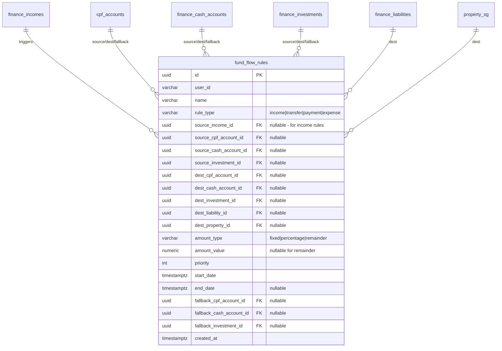

# Unified Fund Flow Model - Design Specification

## Summary

A unified abstraction for all money movements in the system: income deposits, transfers between accounts, payments to liabilities, and expenses. Replaces the fragmented approach of multiple tables with different patterns.

## Motivation

Current state has 4+ separate abstractions for fund movements:

| Table | Purpose | Pattern |
|-------|---------|---------|
| `finance_incomes` | Money appearing | Implicit cash landing |
| `income_allocations` | Income → accounts | Proper FKs ✓ |
| `drawdown_periods` | Accounts → liabilities | Proper FKs ✓ |
| `finance_expenses` | Money leaving | No source specified |

**Problems:**
- CPF top-ups, refunds, insurance payouts not modeled
- Investment withdrawals not modeled
- Inconsistent APIs and query patterns
- No unified "where does my money go?" view

## Use Cases

| # | Movement | Source | Destination | Status |
|---|----------|--------|-------------|--------|
| 1 | Salary | external | cash (+CPF auto) | ✓ `finance_incomes` |
| 2 | Rental income | external | cash | ✓ `finance_incomes` |
| 3 | Insurance payout | external | cash/CPF | ❌ Not modeled |
| 4 | CPF top-up (voluntary) | cash | CPF SA/RA | ❌ Not modeled |
| 5 | CPF refund | CPF | cash | ❌ Not modeled |
| 6 | Investment dividend | investment | cash | ❌ Hardcoded 3% |
| 7 | Investment withdrawal | investment | cash | ❌ Not modeled |
| 8 | Mortgage payment | CPF/cash | liability | ✓ `drawdown_periods` |
| 9 | Expense payment | cash | external | ✓ `finance_expenses` |
| 10 | Cash → Investment | cash | investment | ✓ `income_allocations` |

---

## Database Schema

### ER Diagram



### Table: `fund_flow_rules`

```sql
CREATE TABLE fund_flow_rules (
    id uuid DEFAULT gen_random_uuid() PRIMARY KEY,
    user_id VARCHAR(36) NOT NULL,

    name VARCHAR(100),

    -- Rule type determines valid source/dest combinations
    rule_type VARCHAR(20) NOT NULL CHECK (rule_type IN (
        'income',    -- external → account (triggered by income)
        'transfer',  -- account → account (CPF top-up, investment withdrawal)
        'payment',   -- account → liability/property (mortgage, loan payment)
        'expense'    -- account → external (triggered by expense)
    )),

    -- SOURCE: where money comes from
    -- For 'income': source_income_id required, others NULL
    -- For 'transfer'/'payment': exactly one source account required
    -- For 'expense': exactly one source account required (defaults to cash if none)
    source_income_id uuid REFERENCES finance_incomes(id) ON DELETE CASCADE,
    source_cpf_account_id uuid REFERENCES cpf_accounts(id) ON DELETE CASCADE,
    source_cash_account_id uuid REFERENCES finance_cash_accounts(id) ON DELETE CASCADE,
    source_investment_id uuid REFERENCES finance_investments(id) ON DELETE CASCADE,

    -- DESTINATION: where money goes
    -- For 'income'/'transfer': exactly one dest account required
    -- For 'payment': exactly one dest liability/property required
    -- For 'expense': NULL (money leaves system)
    dest_cpf_account_id uuid REFERENCES cpf_accounts(id) ON DELETE CASCADE,
    dest_cash_account_id uuid REFERENCES finance_cash_accounts(id) ON DELETE CASCADE,
    dest_investment_id uuid REFERENCES finance_investments(id) ON DELETE CASCADE,
    dest_liability_id uuid REFERENCES finance_liabilities(id) ON DELETE CASCADE,
    dest_property_id uuid REFERENCES property_sg(id) ON DELETE CASCADE,

    -- Amount specification
    amount_type VARCHAR(10) NOT NULL CHECK (amount_type IN ('fixed', 'percentage', 'remainder')),
    amount_value NUMERIC(15,4),  -- NULL for 'remainder'

    -- Priority for ordering multiple rules (lower = higher priority)
    priority INT DEFAULT 0 NOT NULL,

    -- Timing
    start_date TIMESTAMPTZ NOT NULL,
    end_date TIMESTAMPTZ,  -- NULL = no end

    -- Fallback for auto-switch when source depleted
    fallback_cpf_account_id uuid REFERENCES cpf_accounts(id) ON DELETE SET NULL,
    fallback_cash_account_id uuid REFERENCES finance_cash_accounts(id) ON DELETE SET NULL,
    fallback_investment_id uuid REFERENCES finance_investments(id) ON DELETE SET NULL,

    created_at TIMESTAMPTZ DEFAULT NOW() NOT NULL,
    updated_at TIMESTAMPTZ DEFAULT NOW() NOT NULL,

    -- Validation constraints
    CONSTRAINT chk_amount_value CHECK (
        amount_type = 'remainder' OR amount_value IS NOT NULL
    ),
    CONSTRAINT chk_percentage_range CHECK (
        amount_type <> 'percentage' OR (amount_value >= 0 AND amount_value <= 100)
    ),
    CONSTRAINT chk_at_most_one_fallback CHECK (
        ((fallback_cpf_account_id IS NOT NULL)::int +
         (fallback_cash_account_id IS NOT NULL)::int +
         (fallback_investment_id IS NOT NULL)::int) <= 1
    )
    -- Note: Source/dest validation done at application level for flexibility
);

CREATE INDEX idx_fund_flow_rules_user ON fund_flow_rules(user_id);
CREATE INDEX idx_fund_flow_rules_type ON fund_flow_rules(rule_type);
CREATE INDEX idx_fund_flow_rules_dates ON fund_flow_rules(start_date, end_date);
CREATE INDEX idx_fund_flow_rules_income ON fund_flow_rules(source_income_id) WHERE source_income_id IS NOT NULL;
CREATE INDEX idx_fund_flow_rules_liability ON fund_flow_rules(dest_liability_id) WHERE dest_liability_id IS NOT NULL;
CREATE INDEX idx_fund_flow_rules_property ON fund_flow_rules(dest_property_id) WHERE dest_property_id IS NOT NULL;
```

---

## Rule Type Examples

### 1. Income → Account (`rule_type = 'income'`)

```json
{
  "name": "Salary to Savings",
  "rule_type": "income",
  "source_income_id": "salary-uuid",
  "dest_cash_account_id": "savings-uuid",
  "amount_type": "percentage",
  "amount_value": 30,
  "priority": 0
}
```

### 2. Account → Account (`rule_type = 'transfer'`)

```json
{
  "name": "Monthly CPF SA Top-up",
  "rule_type": "transfer",
  "source_cash_account_id": "checking-uuid",
  "dest_cpf_account_id": "cpf-uuid",
  "amount_type": "fixed",
  "amount_value": 1000,
  "start_date": "2025-01-01",
  "end_date": "2030-12-31"
}
```

### 3. Account → Liability (`rule_type = 'payment'`)

```json
{
  "name": "Mortgage from CPF OA",
  "rule_type": "payment",
  "source_cpf_account_id": "cpf-uuid",
  "dest_property_id": "hdb-uuid",
  "amount_type": "fixed",
  "amount_value": 2000,
  "priority": 0,
  "fallback_cash_account_id": "checking-uuid"
}
```

### 4. Account → External (`rule_type = 'expense'`)

```json
{
  "name": "Groceries from Joint Account",
  "rule_type": "expense",
  "source_cash_account_id": "joint-uuid",
  "dest_liability_id": null,
  "amount_type": "fixed",
  "amount_value": 800
}
```

---

## Migration Strategy

### Phase 1: Add New Table (Non-Breaking)
- Create `fund_flow_rules` table
- Keep existing tables functional

### Phase 2: Dual-Write
- New rules written to `fund_flow_rules`
- Existing `income_allocations` and `drawdown_periods` still read

### Phase 3: Migrate Existing Data
```sql
-- Migrate income_allocations to fund_flow_rules
INSERT INTO fund_flow_rules (user_id, rule_type, source_income_id, ...)
SELECT i.user_id, 'income', ia.income_id, ...
FROM income_allocations ia
JOIN finance_incomes i ON ia.income_id = i.id;

-- Migrate drawdown_periods to fund_flow_rules
INSERT INTO fund_flow_rules (user_id, rule_type, source_cpf_account_id, dest_property_id, ...)
SELECT ds.user_id, 'payment', dp.source_cpf_account_id, ds.property_sg_id, ...
FROM drawdown_periods dp
JOIN drawdown_schedules ds ON dp.schedule_id = ds.id;
```

### Phase 4: Deprecate Old Tables
- Remove old table reads from timeline processing
- Drop old tables in future migration

---

## API Design

### Endpoints

```
GET    /api/v2/fund-flow-rules              List all rules for user
POST   /api/v2/fund-flow-rules              Create new rule
GET    /api/v2/fund-flow-rules/:id          Get single rule
PUT    /api/v2/fund-flow-rules/:id          Update rule
DELETE /api/v2/fund-flow-rules/:id          Delete rule

GET    /api/v2/fund-flow-rules/by-income/:incomeId     Rules triggered by income
GET    /api/v2/fund-flow-rules/by-account/:accountId   Rules affecting account
GET    /api/v2/fund-flow-rules/by-property/:propertyId Rules for property payments
```

### Request/Response

```typescript
interface FundFlowRule {
  id: string;
  name: string;
  ruleType: 'income' | 'transfer' | 'payment' | 'expense';

  // Source (one of these set based on ruleType)
  sourceIncomeId?: string;
  sourceCpfAccountId?: string;
  sourceCashAccountId?: string;
  sourceInvestmentId?: string;

  // Destination (one of these set based on ruleType)
  destCpfAccountId?: string;
  destCashAccountId?: string;
  destInvestmentId?: string;
  destLiabilityId?: string;
  destPropertyId?: string;

  amountType: 'fixed' | 'percentage' | 'remainder';
  amountValue?: number;
  priority: number;

  startDate: string;
  endDate?: string;

  // Fallback (optional)
  fallbackCpfAccountId?: string;
  fallbackCashAccountId?: string;
  fallbackInvestmentId?: string;
}
```

---

## Timeline Processing Integration

### In `processMonth()`

```go
func (s *TimelineService) processMonth(ctx MonthContext) {
    // 1. Apply growth to accounts
    applyGrowth(ctx)

    // 2. Process incomes and their fund flow rules
    for _, income := range ctx.ActiveIncomes {
        amount := calculateIncomeAmount(income, ctx.Date)

        // Get fund flow rules triggered by this income
        rules := getRulesForIncome(income.ID, ctx.Date)

        for _, rule := range rules {
            executeRule(rule, amount, ctx)
        }

        // Remainder goes to default cash
        remainingAmount := amount - sumAllocated(rules)
        ctx.CashFlow += remainingAmount
    }

    // 3. Process transfer rules (CPF top-ups, etc.)
    transferRules := getRulesByType("transfer", ctx.Date)
    for _, rule := range transferRules {
        executeRule(rule, nil, ctx)  // amount from rule itself
    }

    // 4. Process payment rules (mortgages, loans)
    paymentRules := getRulesByType("payment", ctx.Date)
    for _, rule := range paymentRules {
        executeRule(rule, nil, ctx)
    }

    // 5. Process expense rules
    // ... similar pattern
}
```

---

## Relationship to Existing Tables

| Existing Table | Unified Equivalent | Migration |
|----------------|-------------------|-----------|
| `income_allocations` | `fund_flow_rules` with `rule_type='income'` | Migrate data |
| `drawdown_schedules` + `drawdown_periods` | `fund_flow_rules` with `rule_type='payment'` | Migrate data |
| `finance_expenses` | Keep as-is, optionally add `fund_flow_rules` for source | Optional |

**Note:** `finance_incomes` and `finance_expenses` remain as the **triggers** for fund flows, not replaced by this table.

---

## Implementation Phases

| Phase | Tasks | Files |
|-------|-------|-------|
| 1. Schema | Create migration, types | `migrations/`, `repository/fund_flow.go` |
| 2. CRUD | Repository, handlers | `repository/`, `handlers/fund_flow.go` |
| 3. Timeline | Integrate into processing | `timeline/service.go` |
| 4. Migration | Migrate existing data | `migrations/` |
| 5. Deprecation | Remove old tables | Future migration |

---

## Blast Radius Analysis

### Backend Files Affected

#### Repository Layer (23 files)

| File | Current | Change Required |
|------|---------|-----------------|
| `backend/internal/financial/repository/store.go` | `IncomeAllocation` struct, CRUD methods | Replace with `FundFlowRule` or add adapter |
| `backend/internal/financial_v2/repository/store.go` | `IncomeAllocation` struct, `ListIncomeAllocations`, `CreateIncomeAllocation`, `UpdateIncomeAllocation`, `DeleteIncomeAllocation`, `ListAllIncomeAllocations`, `SetIncomeAllocationEndDate` | **Primary migration target** - new `fund_flow.go` |
| `backend/internal/financial_v2/repository/investment.go` | `StopAllocationsByInvestment()` | Update to use `fund_flow_rules` |
| `backend/internal/financial_v2/repository/cash_account.go` | Cascade logic for allocations | Update to use `fund_flow_rules` |
| `backend/internal/financial_v2/repository/store_income_allocations_test.go` | Tests for allocation CRUD | Rewrite for `fund_flow_rules` |
| `backend/internal/financial_v2/repository/store_parent_id_test.go` | Tests allocation parent_id | Update for new schema |

#### Timeline Processing (4 files)

| File | Current | Change Required |
|------|---------|-----------------|
| `backend/internal/financial_v2/timeline/service.go` | `applyInvestmentAllocations()`, reads `IncomeAllocation` | **Core change** - integrate `fund_flow_rules` processing |
| `backend/internal/financial_v2/timeline/types.go` | `IncomeAllocation` type reference | Add `FundFlowRule` type |
| `backend/internal/financial_v2/timeline/service_test.go` | Tests with allocations | Update test fixtures |
| `backend/internal/financial_v2/timeline/snapshot_contract_test.go` | Contract tests | Update expected responses |

#### API Handlers (3 files)

| File | Current | Change Required |
|------|---------|-----------------|
| `backend/cmd/server/handlers/incomes.go` | `allocationInput`, `handleAllocationsCollection`, `createAllocation`, etc. | Replace with `fund_flow_rules` handlers OR deprecate |
| `backend/cmd/server/handlers/income_allocations_v2.go` | `IncomeAllocationV2Handler`, full CRUD | **Replace entirely** with `FundFlowHandler` |
| `backend/cmd/server/routes/v2.go` | Routes for `/income-allocations`, `/incomes/{id}/allocations` | Add `/fund-flow-rules` routes, deprecate old |

#### Test Utilities (3 files)

| File | Current | Change Required |
|------|---------|-----------------|
| `backend/internal/testutil/fixtures.go` | `CreateIncomeAllocationFixture()` | Add `CreateFundFlowRuleFixture()` |
| `backend/internal/testutil/testdb.go` | Table cleanup | Add `fund_flow_rules` cleanup |
| `backend/internal/testutil/e2e.go` | E2E helpers | Update for new API |

#### E2E Tests (2 files)

| File | Current | Change Required |
|------|---------|-----------------|
| `backend/internal/e2e/income_allocations_test.go` | Full allocation E2E tests | Rewrite for `fund_flow_rules` |
| `backend/internal/e2e/business_logic_test.go` | Business logic with allocations | Update allocation parts |

#### Swagger Docs (3 files)

| File | Current | Change Required |
|------|---------|-----------------|
| `backend/cmd/server/docs/docs.go` | Income allocation DTOs, endpoints | Regenerate after handler changes |
| `backend/cmd/server/docs/swagger.yaml` | OpenAPI spec | Regenerate |
| `backend/cmd/server/docs/swagger.json` | OpenAPI spec | Regenerate |

---

### Frontend Files Affected (11 files)

#### API Layer

| File | Current | Change Required |
|------|---------|-----------------|
| `frontend/src/api/financial/incomes.ts` | Allocation API calls | Add `fundFlowRules` API |
| `frontend/src/types/timeline.ts` | `IncomeAllocation` type | Add `FundFlowRule` type |

#### Hooks

| File | Current | Change Required |
|------|---------|-----------------|
| `frontend/src/hooks/queries/useIncomeAllocationsQuery.ts` | Query for allocations | Replace with `useFundFlowRulesQuery` |
| `frontend/src/hooks/queries/index.ts` | Export allocations hook | Update exports |
| `frontend/src/hooks/queries/useLoadSampleDataMutation.ts` | Sample data with allocations | Update sample data |

#### Components

| File | Current | Change Required |
|------|---------|-----------------|
| `frontend/src/components/modals/IncomeAllocationModal/IncomeAllocationModal.tsx` | Allocation modal UI | **Major rewrite** for unified fund flow UI |
| `frontend/src/components/modals/IncomeAllocationModal/hooks/useAllocationForm.ts` | Form state | Update form fields |
| `frontend/src/components/modals/IncomeAllocationModal/components/AllocationList.tsx` | Allocation list | Update for new schema |
| `frontend/src/components/dashboard/FinancialDataManagement/index.tsx` | Allocation management | Update integration |
| `frontend/src/components/dashboard/FinancialDataManagement/components/CategoryCard.tsx` | Category with allocations | Update props |
| `frontend/src/components/dashboard/FinancialDataManagement/components/CategoryCard/types.ts` | Type definitions | Update types |

---

### Database Migration Steps

#### Step 1: Create New Table (Non-Breaking)

```sql
-- Migration: 202601040001_create_fund_flow_rules.up.sql
CREATE TABLE fund_flow_rules (
    -- ... schema as defined above
);
```

#### Step 2: Migrate Existing Data

```sql
-- Migration: 202601040002_migrate_income_allocations.up.sql

-- Migrate income_allocations → fund_flow_rules (rule_type = 'income')
INSERT INTO fund_flow_rules (
    id,
    user_id,
    name,
    rule_type,
    source_income_id,
    dest_cash_account_id,
    dest_investment_id,
    amount_type,
    amount_value,
    priority,
    start_date,
    end_date,
    created_at,
    updated_at
)
SELECT
    ia.id,
    i.user_id,
    COALESCE(i.name || ' → ' || COALESCE(ca.name, inv.name), 'Allocation'),
    'income',
    ia.income_id,
    ia.target_cash_account_id,
    ia.target_investment_id,
    ia.allocation_type,
    ia.allocation_value,
    0, -- default priority
    ia.start_date,
    ia.end_date,
    COALESCE(ia.created_at, NOW()),
    NOW()
FROM income_allocations ia
JOIN finance_incomes i ON ia.income_id = i.id OR ia.income_id = i.parent_id
LEFT JOIN finance_cash_accounts ca ON ia.target_cash_account_id = ca.id
LEFT JOIN finance_investments inv ON ia.target_investment_id = inv.id
WHERE ia.parent_id IS NULL OR ia.parent_id = ia.id; -- Only root records
```

#### Step 3: Deprecate Old Tables (Future)

```sql
-- Migration: 202601XX0001_drop_income_allocations.up.sql
-- Only after all code migrated and verified

-- First, drop the FK constraint from income_allocations
ALTER TABLE income_allocations DROP CONSTRAINT IF EXISTS income_allocations_income_id_fkey;

-- Then drop the table
DROP TABLE IF EXISTS income_allocations;
```

---

### API Migration Path

#### Phase 1: Add New Endpoints (Parallel)

```
NEW:
POST   /api/v2/fund-flow-rules
GET    /api/v2/fund-flow-rules
GET    /api/v2/fund-flow-rules/:id
PUT    /api/v2/fund-flow-rules/:id
DELETE /api/v2/fund-flow-rules/:id
GET    /api/v2/fund-flow-rules/by-income/:incomeId
GET    /api/v2/fund-flow-rules/by-property/:propertyId

KEEP (during transition):
GET    /api/v2/income-allocations
GET    /api/v2/incomes/{incomeId}/allocations
POST   /api/v2/incomes/{incomeId}/allocations
PUT    /api/v2/incomes/{incomeId}/allocations/{allocId}
DELETE /api/v2/incomes/{incomeId}/allocations/{allocId}
```

#### Phase 2: Dual-Write

```go
// In handlers: write to both tables during transition
func (h *FundFlowHandler) HandleCreate(w http.ResponseWriter, r *http.Request) {
    // Create in fund_flow_rules (new)
    rule, err := h.store.CreateFundFlowRule(ctx, userID, input)

    // Also create in income_allocations (legacy) if rule_type == 'income'
    if input.RuleType == "income" {
        legacyAlloc := convertToLegacyAllocation(rule)
        h.legacyStore.CreateIncomeAllocation(ctx, userID, legacyAlloc)
    }
}
```

#### Phase 3: Frontend Migration

1. Create new `useFundFlowRulesQuery` hook
2. Create new `FundFlowRuleModal` component
3. Update `FinancialDataManagement` to use new components
4. Remove old allocation components

#### Phase 4: Deprecation

1. Remove dual-write logic
2. Remove legacy API endpoints
3. Drop `income_allocations` table

---

### Timeline Processing Migration

#### Current Flow (in `service.go:1140`)

```go
// Current: uses income_allocations directly
netInvestments = applyInvestmentAllocations(
    data.Incomes,
    incomeAllocations,  // []repo.IncomeAllocation
    state,
    currentDate,
    applyAllocations,
)
```

#### New Flow

```go
// New: use fund_flow_rules with rule_type filtering
incomeRules := filterByType(fundFlowRules, "income")
netInvestments = applyFundFlowRules(
    data.Incomes,
    incomeRules,  // []repo.FundFlowRule with rule_type='income'
    state,
    currentDate,
    applyAllocations,
)

// Also process transfer rules (CPF top-ups, etc.)
transferRules := filterByType(fundFlowRules, "transfer")
for _, rule := range transferRules {
    executeFundFlowRule(rule, state, currentDate)
}

// Also process payment rules (mortgage from CPF)
paymentRules := filterByType(fundFlowRules, "payment")
for _, rule := range paymentRules {
    executePaymentRule(rule, state, currentDate)  // with fallback logic
}
```

---

### Risk Assessment

| Risk | Severity | Mitigation |
|------|----------|------------|
| Data loss during migration | High | Backup before migration, test on staging |
| API breaking changes | Medium | Dual-write period, deprecation warnings |
| Timeline calculation regression | High | Comprehensive snapshot tests before/after |
| Frontend state inconsistency | Medium | Feature flag for new UI components |
| Performance regression | Low | Index optimization, query analysis |

---

### Rollback Plan

If issues discovered after migration:

1. **Database**: Keep `income_allocations` table populated during dual-write
2. **API**: Legacy endpoints remain functional
3. **Timeline**: Add feature flag to switch between old/new processing
4. **Frontend**: Feature flag to show old allocation UI

```go
// Feature flag in timeline processing
if config.UseUnifiedFundFlows {
    processFundFlowRules(ctx)
} else {
    applyInvestmentAllocations(ctx) // legacy
}
```

---

## Design Decisions

### Why Not Just Extend `income_allocations`?

- Income allocations only handle income → account
- Can't model account → account transfers (CPF top-ups)
- Can't model account → liability payments
- Name implies one-directional flow

### Why Keep `finance_incomes` and `finance_expenses` Separate?

- They define **what** money is (salary, rent, groceries)
- Fund flow rules define **how** it moves
- Separation of concerns: definition vs routing

### Why Single Table vs Multiple Tables?

- Single table = consistent query patterns
- Single table = easier to answer "where does my money go?"
- Type column + constraints = same safety as separate tables
- Easier to add new rule types without schema changes

---

## Future Extensions

| Feature | How |
|---------|-----|
| CPF LIFE payouts | Add `rule_type='cpf_payout'` |
| Insurance premiums | Add `dest_insurance_id` FK |
| Tax payments | Add `rule_type='tax'` with calculated amounts |
| Recurring transfers | Already supported via `start_date`/`end_date` |
